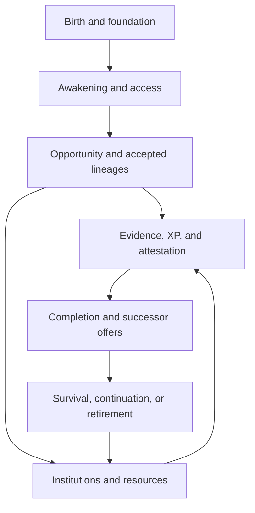

# LitRPG System Specification

**Project:** womb-aware Earth reincarnate; weak-to-overwhelming pure mage; post-imperial island inspired by fifth- to seventh-century Britain  
**Specification version:** 0.89  
**Status:** validated specification closure achieved; controlled baseline active with bounded residual uncertainty  
**Companion research:** `litrpg-system-research-dossier.md`

## Decision states

- **DECIDED:** binding unless a later contradiction or simulation failure requires formal reconsideration.
- **PROVISIONAL:** the current working model, to be tested against later mechanics.
- **OPEN:** not yet selected.
- **DEFERRED:** intentionally paused because it belongs to a later design phase; prior decided premises remain binding, but no further detail should be inferred yet.

## Design constitution

The following rules govern this specification:

1. The System is natural law of unknown origin, perceived through culturally influenced interfaces.
2. It is selectively crunchy: people receive useful numbers and descriptions, but not the complete hidden model.
3. Classes and skills recognise demonstrated conduct, accumulated evidence, and meaningful milestones.
4. Class XP and Skill XP are separate.
5. Class and skill offers may be rejected or deferred. A capped ability stops levelling, but relevant evidence can continue accumulating and can alter later offers.
6. Attributes and class or skill rewards may use decimal values.
7. Ordinary awakening follows stable self-awareness, usually between eight and twelve years of age. Reincarnated awareness gives the protagonist anomalously early access without exempting him from biology.
8. Magic is rare because aptitude, knowledge, resources, opportunity, survival, and institutional access must converge.
9. The protagonist's primary trajectory is one continuous Mage lineage and a persistent preference for magical methods. Nonmagical Skills and classes remain possible and retain their own identities; their knowledge may inform later magical invention, but cannot be relabelled retrospectively as Mage development.
10. Purposeful training and general self-improvement can directly change the attributes whose underlying capacities genuinely adapt. Those organic gains remain distinct from knowledge, Skill XP, Class XP, and level reinforcement and require real challenge, technique, resources, recovery, and assimilation.

## ATR0 — Attribute ontology

**Status: DECIDED**  
**Selected option: ATR0C — Layered absolute capacity**

### Governing definition

> An attribute is the System's decimal assessment of an enduring capacity that the person can reliably express while healthy, rested, and operating under ordinary conditions at their current stage of development.

An attribute is not:

- knowledge or a skill;
- personality, virtue, courage, or wisdom;
- present energy or current health;
- an age-normalised comparison with peers;
- a fixed genetic maximum;
- guaranteed performance in every body, context, or task.

The same rated value is approximately comparable across ages and people, although morphology, leverage, mass, condition, skill, equipment, and circumstances still affect actual performance.

### The five layers

#### 1. Foundation

The hidden physical, cognitive, and metaphysical structures that support development and performance. These include anatomy, neural organisation, long-term adaptations, magical channels or equivalent structures, soul stability, developmental damage, and repair.

Foundation changes slowly. It is neither immutable heredity nor a visible maximum.

#### 2. Rated capacity

The stable decimal attribute shown to the character. It represents reliably expressible capacity rather than moment-to-moment performance.

#### 3. Available condition

Resources, injuries, illness, pain, shock, hunger, fear, fatigue, cognitive load, mana depletion, and channel strain restrict how much capacity can currently be expressed. Short-term impairment does not constantly rewrite the attribute sheet. Severe or prolonged impairment can eventually damage foundation and therefore lower rated capacity.

#### 4. Adaptation pressure

Meaningful effort creates hidden, directional pressure toward development. Challenge, novelty, correction, integration, and consequence produce more useful evidence than easy repetition. Adaptation requires compatible foundation, nutrition, recovery, time, and safe integration before it can become rated capacity.

#### 5. Unresolved potential

When the System recognises a legitimate gain that cannot yet be safely expressed, the gain becomes a hidden developmental claim rather than a spendable point pool. Its treatment depends on its origin. Contingent maturation or organic adaptation may integrate gradually, be redirected into compatible development, stabilise during a later evolution, or be partly lost through deprivation, injury, or developmental failure. Earned class and skill reinforcement is instead protected and directionally fixed under ATR3.0C, although its expression may be delayed.

Unresolved potential cannot be released all at once merely because a person reaches a particular birthday or awakening.

### Performance relationship

The exact formula remains open, but every action will follow the conceptual relationship:

\[
\text{Effective performance}
=
f(\text{rated capacities},\ \text{skills},\ \text{available condition},\ \text{body},\ \text{tools},\ \text{environment},\ \text{method})
\]

No single attribute number is equivalent to final performance.

### Prenatal consequence

The protagonist's retained identity and intention can generate unusually coherent evidence during gestation. His incomplete brain, body, senses, and metaphysical structures still limit what can be integrated or expressed.

Prenatal activity can therefore develop sensory discrimination, intentional control, stable attention, self-other distinction, and early magical foundations in tiny increments. It cannot grant adult physical capacity or make unrestricted grinding safe. Reckless integration can harm the fetus, mother, or both.

### Societal consequence

Because the System does not display a fixed personal ceiling, status cannot be treated as infallible proof of destiny. Elites can still manufacture superiority through food, safety, literacy, tutors, diagnostic relics, and controlled advancement opportunities. Their predictions are powerful but probabilistic, which leaves room for missed common-born talent, failed heirs, political fraud, and late transformation.

### Locked consequences

- Attributes use an absolute cross-age scale.
- Potential is dynamic and normally hidden.
- Temporary depletion belongs to resources and condition, not attribute fluctuation.
- Long-term injury or deprivation can reduce attributes by damaging foundation.
- Growth can integrate earlier unresolved development without creating a one-time banked-stat release.
- Classes and skills may affect rated capacity, foundation, adaptation efficiency, or integration; those reward types will be distinguished later.
- Displayed decimals are useful System summaries, not exhaustive descriptions of a person.

## ATR1 — Attribute architecture

**Status: DECIDED**  
**Selected option: ATR1C — Eleven attributes across Body, Mind, and Soul**

### Architecture

| Domain | Attributes |
|---|---|
| Body | Might, Finesse, Alacrity, Vitality |
| Mind | Perception, Cognition, Focus, Will |
| Soul | Depth, Coherence, Resonance |

An attribute remains eligible for this architecture only if it represents an enduring capacity, can vary independently enough to create recognisably different people, and cannot be represented more accurately as knowledge, skill, morphology, condition, resource, or derived performance.

The eleven values do not divide a person into literally separate components. Body, mind, and soul are organising domains for capacities that continuously interact.

### Body attributes

#### Might

> The capacity to generate and safely transmit physical force.

Might supports lifting, pushing, pulling, carrying, jumping, acceleration, striking, holding force against resistance, and resisting displacement. It does not grant technique, balance, precision, stamina, toughness, or judgement.

Morphology remains important. Limb length, leverage, body mass, attachment geometry, available traction, and posture determine how effectively rated Might can be expressed in a particular action.

#### Finesse

> The capacity to coordinate bodily movement with spatial and temporal precision.

Finesse supports balance, hand-eye coordination, controlled movement, timing, smooth transitions, multi-limb coordination, and accurate correction. It determines how precisely the body can express an intended action, not whether the person knows the correct method.

Finesse does not provide craft knowledge, weapon technique, better senses, or universally faster action.

#### Alacrity

> The capacity to initiate, transition, and cycle bodily actions rapidly while retaining functional control.

Alacrity supports rapid neuromuscular recruitment, changing direction, accelerating a limb, recovering from one movement into the next, and performing repeated actions at speed. It is bodily quickness rather than a universal time statistic.

Alacrity does not make a person notice danger sooner, select the correct response, move accurately, or ignore the mechanical limits of their body. Effective reaction requires a complete chain:

1. Perception detects the change.
2. Cognition, trained automaticity, or instinct selects a response.
3. Alacrity initiates and cycles the response.
4. Finesse keeps the movement controlled.
5. Might, morphology, condition, and environment determine the resulting motion.

This allows a perceptive veteran with moderate Alacrity to react earlier than a physically quicker novice who did not recognise the threat.

#### Vitality

> The capacity to maintain, protect, restore, and safely adapt biological function under load.

Vitality supports recovery, wound stabilisation, resistance to illness and toxins, temperature regulation, training adaptation, survival under deprivation, and the integration of physical or magical changes.

Vitality is not current Health, Stamina, pain tolerance, armour, automatic regeneration, or immunity to catastrophic injury. It improves the body's ability to preserve and rebuild function when time, energy, materials, and viable anatomy remain available.

### Mind attributes

#### Perception

> The capacity to receive, resolve, discriminate, and track information through available sensory channels.

Perception supports sensitivity to faint signals, distinguishing similar signals, separating signal from noise, following changes, and resolving spatial or temporal detail.

Perception does not create a sensory channel. A person with exceptional Perception cannot naturally detect mana without Resonance, a magical organ or foundation, a tool, or a learned method that first makes mana available to perception.

#### Cognition

> The capacity to hold, relate, transform, and organise information.

Cognition supports manipulating interacting variables, recognising complex relationships, modelling processes, comparing possible outcomes, following causal chains, and constructing complicated magical architecture.

Cognition is not knowledge, education, wisdom, creativity, curiosity, truth, morality, perfect memory, or correct judgement. Retained Earth knowledge is mental content rather than free Cognition, and an infant brain still limits how much of that content the protagonist can access and manipulate.

#### Focus

> The capacity to direct and stabilise mental operation with precision.

Focus supports sustained attention, exclusion of interference, simultaneous maintenance of delicate operations, recovery after interruption, and protection of a controlled process from mental noise.

Focus does not provide understanding, determination, courage, or knowledge. High Cognition with low Focus permits sophisticated understanding that is difficult to execute reliably; high Focus with modest Cognition permits exceptionally precise execution of simpler structures.

#### Will

> The capacity to maintain chosen intention, action, or identity against internal or external pressure.

Will supports continued deliberate action through fear, pain, exhaustion, compulsion, distraction, and hostile influence. It does not determine bravery, virtue, discipline, wisdom, or whether the chosen intention is beneficial.

Will can be harmful. It may allow someone to force an injured body, overloaded soul, or collapsing spell beyond the point at which a wiser person would stop.

### Soul attributes

#### Depth

> The capacity of the soul to contain, anchor, and support metaphysical load.

Depth provides the internal metaphysical volume from which Mana capacity, durable self-bound constructs, class reinforcement, and large-scale magical operation can be supported.

Depth is not current Mana, spell power, soul stability, magical sensitivity, or knowledge. A deep but poorly ordered soul can hold a great deal in principle while remaining unsafe to fill or manipulate.

#### Coherence

> The capacity of the soul to preserve internal order, continuity, and structural integrity under change or strain.

Coherence supports mana containment, resistance to leakage and contamination, survival through class or skill reinforcement, tolerance of magical transformation, recovery from spiritual strain, and resistance to possession, fragmentation, or corruption.

Coherence is not Depth, conscious determination, moral purity, or immunity to hostile magic. A highly coherent soul may be small; a deep soul may be dangerously unstable.

#### Resonance

> The capacity to couple selectively with external metaphysical forces and patterns.

Resonance supports detecting mana, drawing from the environment, forming affinities, interacting across metaphysical boundaries, transmitting magical influence, and adapting to different magical conditions.

Resonance is not Mana, Perception, affinity, spell control, spell power, or magical knowledge. It is intentionally double-edged: stronger coupling can also increase susceptibility to hostile influence, contamination, involuntary reactions, environmental overload, and detection.

### Boundary rules

The following distinctions are binding because they prevent the expanded architecture from becoming redundant:

| Easily confused pair | Governing distinction |
|---|---|
| Might / Alacrity | Might determines force capacity; Alacrity determines how rapidly controlled bodily action can begin, change, and repeat. |
| Finesse / Alacrity | Finesse preserves accuracy and coordination; Alacrity supplies rapid initiation and cycling. Either can be high without the other. |
| Perception / Alacrity | Perception detects the need to react; Alacrity begins the bodily response. |
| Perception / Resonance | Resonance makes metaphysical contact possible; Perception resolves information obtained through that contact. |
| Cognition / Focus | Cognition manages complexity; Focus keeps an operation stable and precise. |
| Focus / Will | Focus preserves operational accuracy; Will preserves chosen intent under pressure. |
| Depth / Coherence | Depth is supported metaphysical volume; Coherence is the integrity and order that make using that volume safe. |
| Coherence / Will | Coherence is structural resistance; Will is deliberate resistance. A determined person can tear a weak soul by continuing to resist. |
| Depth / Resonance | Depth governs internal support; Resonance governs coupling and exchange with what lies beyond the self. |

### Cooperative capabilities

No significant action is governed by only one attribute. The following are conceptual inputs, not final formulas:

| Capability | Principal contributors |
|---|---|
| Lift or push | Might, morphology, leverage, condition, applicable skill |
| Sprint | Might, Alacrity, Finesse, Vitality, morphology, Stamina, terrain |
| React to an ambush | Perception, recognition or automaticity, Alacrity, Finesse, condition |
| Perform delicate rapid craftwork | Perception, Finesse, Alacrity, Focus, craft skill, tools |
| Resist illness | Vitality, biological foundation, condition, exposure, treatment |
| Understand magical theory | Cognition, acquired knowledge, language, theory skills |
| Maintain a complex spell | Cognition, Focus, relevant spell skill, mental condition |
| Detect and analyse mana | Resonance, Perception, relevant sense skill, signal, interference |
| Hold mana safely | Depth, Coherence, Vitality, magical foundation, current strain |
| Draw environmental mana | Resonance, Depth, Coherence, technique, environmental availability |
| Resist compulsion or possession | Will, Coherence, awareness, defensive skill, hostile method |
| Sustain a powerful spell | available Mana, Depth, Coherence, Resonance, Focus, spell architecture, class and skill support |

### Consequence for mage development

Complete magehood cannot be purchased through one obvious statistic:

| Magical need | Capacity chain |
|---|---|
| Make contact with magic | Resonance |
| Distinguish what was contacted | Resonance + Perception |
| Understand and alter a structure | Cognition + knowledge + skill |
| Maintain precise control | Focus + relevant skill |
| Keep acting under backlash | Will + condition |
| Support a large internal reserve | Depth + compatible foundation |
| Keep that reserve stable | Coherence + technique |
| Survive and integrate adaptation | Vitality + recovery + nutrition |

This permits distinct pure-mage builds: a sensitive seer, deep-reserve ritualist, highly coherent warder, rapid but shallow channeler, precise spellwright, or dangerously resonant prodigy can all be genuine mages without sharing the same strengths.

### Prenatal consequence

The protagonist may begin creating pressure toward Perception, Focus, Will, Resonance, or Coherence before birth, but every gain remains limited by developing physical, cognitive, and spiritual foundations.

Depth cannot safely expand without the Coherence and Vitality to stabilise it. Resonance can expose the fetus and mother to magical influence. Will can maintain dangerous experimentation. Cognition remains constrained by the developing brain even when a reincarnated identity supplies mature intentions and fragments of retained knowledge.

### Cross-species consequence

The same eleven axes apply to humans and nonhumans, but they do not erase anatomy or metaphysical morphology. Wings, additional limbs, distributed nervous systems, nonhuman senses, unusual souls, and species-specific magical organs remain foundations or traits. Attributes assess the capacities expressed through those structures.

A species is therefore not reduced to a stat package. Two beings with equal Might can still apply force differently because their bodies provide different reach, leverage, mass, movement, and tools.

### Locked consequences

- The reader-facing architecture contains eleven core attributes.
- Alacrity is retained as bodily quickness and cannot substitute for perception, judgement, accuracy, or skill.
- Soul capacity is divided into Depth, Coherence, and Resonance.
- Mana, Health, Stamina, spell power, regeneration, affinity, memory, charisma, luck, knowledge, and skill remain outside the core attribute list.
- Attribute combinations and methods determine capabilities; there are no universal single-stat actions.
- Body, Mind, and Soul are explanatory domains, not isolated substances or mandatory point-allocation categories.
- Alternative cultures may use different names or groupings while the underlying eleven capacities remain mechanically consistent.

## ATR2 — Numerical scale

**Status: DECIDED**  
**Selected option: ATR2B — Anchored geometric index**

### Governing definition

Each displayed attribute is an absolute, open-ended index of its underlying rated capacity. The index is not a direct physical unit and is not a percentile, level, age-normalised score, or comparison with the current population.

Let:

- \(A\) be the displayed attribute;
- \(C\) be the underlying rated capacity;
- \(C_{10}\) be the fixed reference capacity represented by `10.00` for that attribute.

The displayed index follows:

\[
\frac{C}{C_{10}} = 2^{A/10}-1
\]

The System's inverse assessment is:

\[
A = 10\log_2\left(1+\frac{C}{C_{10}}\right)
\]

The conversion formula is backend natural law. Ordinary people can learn approximate benchmarks without receiving the formula from the System.

### Fixed reference

`10.00` represents a fixed reference approximately equivalent to the relevant capacity of a healthy, fully developed, unmodified human adult. It is a calibration standard rather than the statistical average of the living population.

Actual adults can fall above or below the reference because of development, nutrition, illness, injury, occupation, training, classes, skills, ancestry, morphology, magic, and historical conditions. Famine or social collapse cannot redefine a weakened population as the new `10.00`.

Each attribute has its own standardised underlying measure. Might and Cognition share a display convention, not a literal unit.

| Attribute | Capacity indexed in principle |
|---|---|
| Might | Safely generated and transmitted physical force |
| Finesse | Spatial and temporal precision of controlled movement |
| Alacrity | Speed of initiating, transitioning, and cycling controlled bodily action |
| Vitality | Preservation, restoration, and adaptation of biological function under calibrated load |
| Perception | Resolution and discrimination through an available sensory channel |
| Cognition | Complexity of information that can be actively organised and transformed |
| Focus | Stability and precision of sustained mental operation |
| Will | Maintenance of chosen intention under calibrated pressure |
| Depth | Internally supported metaphysical load |
| Coherence | Preservation of spiritual order and continuity under calibrated strain |
| Resonance | Selective metaphysical coupling under standard conditions |

### Scale landmarks

| Attribute | Underlying capacity relative to `10.00` |
|---:|---:|
| 0.00 | 0.000× |
| 1.00 | 0.072× |
| 3.00 | 0.231× |
| 5.00 | 0.414× |
| 8.00 | 0.741× |
| 10.00 | 1.000× |
| 12.00 | 1.297× |
| 15.00 | 1.828× |
| 20.00 | 3.000× |
| 25.00 | 4.657× |
| 30.00 | 7.000× |
| 40.00 | 15.000× |
| 50.00 | 31.000× |
| 60.00 | 63.000× |

`0.00` represents the genuine absence of an expressible capacity. Living people will rarely possess an exact zero, but the value can describe a structure that has not yet formed, has been destroyed, or is genuinely absent.

The scale has no universal maximum. Biological and metaphysical foundations may impose practical limits until training, class evolution, transformation, altered morphology, or another structural change creates a viable route beyond them.

### Decimal behaviour

The visible scale is curved. A numerical increase cannot be read as the same percentage or the same absolute physical increment at every starting value.

Around `10.00`, the approximate increases in underlying rated capacity are:

| Displayed increase | Capacity increase |
|---:|---:|
| +0.01 | +0.139% |
| +0.05 | +0.694% |
| +0.10 | +1.391% |
| +0.25 | +3.496% |
| +0.50 | +7.053% |
| +1.00 | +14.355% |

At low values, a small index increase is proportionally large but remains small in absolute capacity. At high values, the same index increase is proportionally smaller but represents a larger absolute capacity change. Consequently, the mathematical meaning of class rewards, skill rewards, natural development, and deliberate allocation must be specified explicitly rather than assumed from the displayed decimal.

### Broad calibration

The following ranges are calibration language, not mechanically enforced tiers:

| Attribute range | Broad interpretation |
|---:|---|
| 0.00 | Capacity absent or not yet expressible |
| 0.01–0.99 | Trace or emerging capacity |
| 1.00–2.99 | Nascent capacity |
| 3.00–5.99 | Immature or seriously underdeveloped capacity |
| 6.00–7.99 | Subadult, impaired, or weak adult capacity |
| 8.00–11.99 | Ordinary mature-human range |
| 12.00–14.99 | Notably developed or professionally reinforced |
| 15.00–19.99 | Exceptional human or heavily class-reinforced |
| 20.00–29.99 | Unambiguously superhuman |
| 30.00–39.99 | Major superhuman capacity |
| 40.00–49.99 | Overwhelming on an ordinary human scale |
| 50.00+ | Mythic or structurally transformed capacity |

Exact fetal, newborn, childhood, adult, and species distributions remain open until growth and integration are defined. Different attributes mature at different rates, so no life stage receives a uniform eleven-number template.

### Performance and cross-species rules

The curve applies to rated attribute capacity only. It does not directly scale damage, speed, spell output, learning rate, Health, Stamina, Mana, skill effectiveness, or final task performance. Later formulas must not multiply several unrestricted geometric systems together.

An equal attribute has the same calibrated capacity across ages and species, but anatomy, senses, metaphysical morphology, body mass, leverage, available actions, condition, skills, and context determine how that capacity can be expressed. A bird and a human with equal Might do not perform identical tasks, and a nocturnal species can use equal Perception more effectively in darkness if its eyes provide a superior sensory channel.

### Cultural interpretation

Cultures may create titles, tests, legal categories, guild grades, or informal names for portions of the scale. Those categories do not create universal breakpoints. Crossing from `19.99` to `20.00` has no special System effect unless a separate class, skill, spell, institution, or transformation uses that value as an authored prerequisite.

### Locked consequences

- Attributes use the absolute relation \(C/C_{10}=2^{A/10}-1\).
- `10.00` is a fixed healthy mature-human reference, not a population average.
- `0.00` is meaningful, negative attributes are unnecessary, and the scale is open-ended.
- Displayed decimals remain useful from nascent through mythic capacities.
- Attribute ranges have no intrinsic tiers, caps, or threshold bonuses.
- Rated capacity is not final performance.
- Cross-species comparability does not replace anatomy or metaphysical morphology.
- Guaranteed class and skill reinforcement adds source-rated reference capacity under ATR3.2.0C; the operations used by contingent organic change, transformation, damage, and repair remain separate design questions.

## ATR3 — Permanent attribute change

**Status: SYSTEM ARCHITECTURE DECIDED; numerical life-stage calibration continues under CAL0**  
**Selected architecture: ATR3.0C — Typed growth and guaranteed reinforcement; ATR3.1D — Core signature plus evidence-shaped expression; ATR3.2.0C — Source-rated reference-capacity budgets; ATR3.2.1B — Balanced doubling ladder; ATR3.3.0C — Coupled domain throughput with a safe governor; ATR3.3.1C — Sublinear foundation-scaled reference throughput; ATR3.3.2.0C — Supported uplift plus typed overload strain; ATR3.3.3.0C — Safety-reserved fair scheduling with eligibility aging; ATR3.3.3.1B — Balanced fair-recovery calibration; ATR3.3.3.2D — Capability-gated assimilation diagnostics**

ATR3 distinguishes how a permanent change is earned from how it is assimilated, expressed, and displayed. Every successful channel ultimately changes the same rated attribute values defined by ATR0 and ATR2; characters do not possess separate natural, trained, skill-derived, and class-derived versions of an attribute.

### ATR3.0 — Growth-channel architecture

**Status: DECIDED**  
**Selected option: ATR3.0C — Typed growth and guaranteed reinforcement**

The backend preserves the origin and terms of a prospective permanent change even though the status sheet ultimately displays one combined rated capacity.

| Growth channel | What it represents | Acquisition rule |
|---|---|---|
| Maturation | Ordinary physical, neurological, and metaphysical development | Emergent rather than a fixed award; realised only through viable development |
| Organic adaptation | Lasting change caused by meaningful use, challenge, correction, and recovery | Contingent on successful integration |
| Skill reinforcement | A small System reward for mastery of a specific method | Earned and guaranteed when the skill level is gained |
| Class reinforcement | A broader System reward for sustained class-aligned conduct | Earned and guaranteed when the class level is gained |
| Transformation | Creation, reorganisation, or replacement of foundation through evolution, ritual, species change, or breakthrough | Governed by the particular transformation |
| Damage and repair | Degradation, destruction, restoration, rehabilitation, or reconstruction of foundation | Can lower, restore, or occasionally improve rated capacity |

The channels are not interchangeable rewards. A class claim cannot be relabelled as organic adaptation, a skill reward cannot be freely redirected while pending, and two records of the same physical exertion cannot create two organic training stimuli.

### Recognition, assimilation, and expression

Every permanent increase passes through three conceptually separate stages.

#### 1. Recognition

The System or natural developmental process recognises a legitimate claim to change. The claim records its source, direction, magnitude, affected capacities, and any structural requirements.

Recognition can follow maturation, meaningful training, a class or skill level, an evolution, treatment, rehabilitation, ritual, or transformation. Recognition alone does not prove that the recipient can safely express the change immediately.

#### 2. Assimilation

The body, mind, or soul incorporates the change into compatible foundation. Assimilation can require:

- time, sleep, and recovery;
- nutrition, biological material, or other physical resources;
- Mana or an appropriate magical environment;
- tolerable physical, cognitive, and spiritual strain;
- compatible existing structures;
- the gradual formation or reorganisation of supporting foundation.

The System may stabilise and direct supernatural reinforcement, but it does not automatically grant an incomplete body, brain, or soul unrestricted immediate expression.

#### 3. Expression

Assimilated change raises the rated capacity that can be expressed reliably while healthy, rested, and under ordinary conditions. Only then does the displayed attribute increase.

Temporary fatigue, hunger, pain, injury, illness, Mana depletion, fear, or overload can still restrict current performance without immediately reducing the rated attribute. Persistent damage can eventually alter foundation and lower the rating through the damage channel.

### Contingent organic development

Maturation and meaningful use can create adaptation pressure without guaranteeing a fixed gain. Organic improvement may fail, diminish, or be lost when:

- the activity is no longer challenging or contains no useful correction;
- technique repeatedly directs the wrong adaptation;
- recovery, nutrition, or developmental resources are inadequate;
- injury or overload interrupts integration;
- incompatible pressures compete;
- the current foundation cannot yet support the change.

Organic adaptation is therefore causal rather than transactional. Performing a nominal quantity of exercise does not compel the System to award a predetermined decimal increase.

#### Purposeful training and general self-improvement

Attributes are trainable because they describe realised enduring capacities rather than fixed birth allocations. Deliberate exercise, study, practice, reflection, rehabilitation, and self-regulation can create organic adaptation pressure when they actually load, test, correct, and develop the relevant foundation.

Examples include:

| Training activity | Possible organic attribute directions | What determines the actual result |
|---|---|---|
| Press-ups, resistance work, lifting, carrying | Might, Vitality, and task-specific Finesse | Resistance, range, volume, technique, tissue loading, nutrition, rest, and injury state |
| Running, sprinting, swimming, climbing | Vitality, Alacrity, Might, and Finesse in different proportions | Intensity, duration, terrain, movement pattern, energy delivery, recovery, and existing conditioning |
| Assault courses, dance, gymnastics, martial drills | Finesse, Alacrity, Might, Vitality, and Perception | Novelty, balance, timing, correction, obstacle diversity, speed, load, and safe repetition |
| Mathematics, logic, planning, and difficult puzzle solving | Cognition, Focus, and sometimes Perception | Representational complexity, active manipulation, error correction, transfer, novelty, feedback, and consolidation |
| Sustained study, vigilance, memory practice, and attention control | Focus, Perception, Cognition, and sometimes Will | Task structure, distraction control, retrieval demands, accuracy, sleep, stress, and whether the training develops capacity rather than merely adding knowledge |
| Meditation, interoception, emotional regulation, and deliberate discomfort tolerance | Focus, Perception, Will, and where real metaphysical operations occur, Coherence or Resonance | Method, feedback, genuine control, safe load, self-observation, recovery, and actual contact with Soul processes |
| Soul exercises, Mana exposure, identity stabilisation, and controlled coupling | Depth, Coherence, or Resonance according to the mechanism | Compatible Soul structure, source, containment, load, discrimination, recovery, safety, and successful integration |

The table describes possible directions, not fixed bundles. A press-up performed poorly may create fatigue or injury without useful Might adaptation. A mathematical course may mostly add knowledge and a Skill while producing little Cognition change. Meditation does not automatically increase every mental or Soul attribute; Soul growth requires that a genuine Soul-local capacity is exercised.

Training can simultaneously produce several valid outcomes:

- organic attribute adaptation from changed foundation;
- Skill XP from improving a coherent method after acceptance;
- Class XP from sustained role-aligned development;
- knowledge, habits, technique, and task-specific automaticity;
- temporary fatigue, recovery demand, or injury;
- milestone evidence when the circumstances are genuinely significant.

These outcomes do not duplicate one another. The same session supplies only the organic stimuli it causally created, while later Skill or class levels may create separate guaranteed reinforcement claims.

Improvement is directional and subject to diminishing returns. As an activity becomes easy, it maintains existing capacity or refines familiar technique more than it raises the underlying attribute. Further development generally requires greater load, longer duration, finer control, increased complexity, unfamiliar contexts, reduced support, better integration, or a different developmental stimulus. Training beyond recoverable limits produces maladaptation, exhaustion, illness, or injury rather than accelerated growth.

General self-improvement also includes enabling conditions. Better food, sleep, medical care, emotional support, education, tools, and safer environments may restore impaired capacity, allow maturation to realise more fully, increase the proportion of training that becomes durable adaptation, or reveal previously masked ability. They do not create a generic all-stat reward merely because the person adopts a healthier lifestyle.

### Guaranteed class and skill reinforcement

Reaching a class or skill level creates an earned reinforcement claim. Its safe portion may assimilate immediately. Any unsafe portion remains protected and directionally fixed until it can be assimilated; deprivation, youth, or injury delays the reward rather than silently cancelling or reallocating it.

The claim is not:

- a freely spendable point pool;
- a second copy of the displayed attribute;
- permission to bypass required anatomy or metaphysical structure;
- awarded again when delayed assimilation completes.

Routine skill rewards will usually be small enough to integrate immediately. Delayed assimilation becomes more likely after rapid levelling, rare or evolved class rewards, severe deprivation, injury, illness, incomplete childhood development, or reinforcement that requires a genuinely new structure.

The attribute destination of a claim is fixed at recognition. Later conduct may shape later rewards and evolution offers, but it cannot retrospectively redirect reinforcement already earned.

### Multiple consequences from one event

One meaningful event may legitimately contribute to several distinct systems. A difficult sword fight can produce:

- one organic physical adaptation stimulus from the exertion;
- Sword Skill XP from applying and refining the method;
- Class XP and behavioural evidence from acting in a class-aligned way;
- milestone evidence from unusual danger, opponents, or consequences;
- physical, psychological, or spiritual damage and subsequent repair pressure.

These are separate consequences rather than duplicate recordings of the same gain. The exertion itself is recorded only once as organic adaptation, while later class and skill levels create their own supernatural reinforcement claims.

### Unresolved evolution offers

If a class or skill reaches an evolution milestone and its offer is deferred or rejected:

- that class or skill stops gaining levels and therefore stops producing new level-based reinforcement;
- relevant conduct and usage evidence can continue accumulating;
- organic maturation, training, damage, and repair continue normally;
- existing abilities can still be practised and used;
- accumulated evidence can alter a later offer.

Deferral is therefore a genuine progression cost without causing the System to freeze ordinary development.

### Childhood and prenatal consequence

Ordinary maturation remains the dominant source of fetal and childhood physical and neurological change. Reincarnated awareness allows the protagonist to produce unusually coherent intentional evidence but does not supply mature anatomy, senses, neural organisation, or metaphysical foundation.

Early effort can create small pressures or rare reinforcement affecting Perception, Focus, Will, Finesse, Coherence, or Resonance when the underlying activity genuinely exercises them. Repeated easy movement or thought rapidly loses novelty and developmental value. Maternal health and nutrition constrain physical assimilation, while increased Resonance may expose both fetus and mother to magical influence.

An unusually early skill level remains meaningful: compatible reinforcement may integrate and the remainder waits. It cannot produce an adult-scale newborn, release as an unrestricted backlog at birth, or eliminate the dangers of forcing change into incomplete foundation.

### Locked consequences

- Permanent attribute change has typed acquisition channels but one combined displayed result.
- Maturation and organic adaptation are contingent on viable development and assimilation.
- Purposeful physical, cognitive, regulatory, and Soul-directed training can directly raise the attributes whose underlying capacities genuinely adapt; there is no fixed exercise-to-stat tariff or generic self-improvement bonus.
- Every earned class or skill level creates a guaranteed, directionally fixed reinforcement claim.
- Unsafe reinforcement is delayed and gradually assimilated rather than forcibly expressed, freely redirected, duplicated, or quietly erased by ordinary deprivation.
- Recognition, assimilation, and expression are distinct stages.
- One event may produce organic adaptation, Skill XP, Class XP, milestone evidence, and damage without duplicating its organic training stimulus.
- A deferred or rejected evolution stops new level rewards from that class or skill but does not stop natural development or evidence accumulation.
- Claim priority follows ATR3.3.3.0C and ATR3.3.3.1B, diagnostic visibility follows ATR3.3.3.2D, and numerical life-stage calibration continues under the decided ATR3.4 architecture and CAL0.

### ATR3.1 — Attribute reward distribution

**Status: DECIDED**  
**Selected option: ATR3.1D — Core signature plus evidence-shaped expression**

> Every class and skill has a stable reinforcement signature. A guaranteed core preserves the source's identity, while an adaptive portion is distributed according to the meaningful evidence that earned the level. Classes are primarily identity-led; skills are more strongly usage-led. Standard level rewards cannot be manually allocated.

#### Reinforcement signatures

Each class and skill defines four kinds of relationship with the attributes. These relationships determine where its reinforcement may go; ATR3.2 determines how much reinforcement exists to distribute.

| Signature component | Rule |
|---|---|
| Core axes | Defining capacities that receive a non-zero share at every level of the source |
| Adaptive axes | Eligible capacities whose shares are determined by the conduct and method credited across the level |
| Conditional axes | Normally ineligible capacities that become available only when a causally relevant method, milestone, variant, or evolution activates them |
| Excluded axes | Capacities that cannot receive reinforcement from the current source |

Core does not mean equal distribution. A core axis receives some reinforcement because it is constitutive of the class or skill, but the relative shares of the core axes may still differ. Adaptive and conditional axes receive nothing unless the evidence supports them.

When a level is recognised, the System resolves the source's eligible axes and creates a completed reward vector. That vector is directionally fixed before assimilation begins. Delayed assimilation can change when the reinforcement is expressed, but not its destination or relative distribution.

#### Class distribution

Class reinforcement is primarily identity-led. Its core ensures that every level continues to build the capacities required by the class's recognised way of life, while its adaptive component reflects how that identity was actually enacted.

An illustrative Pure Mage signature could be:

| Component | Illustrative attributes |
|---|---|
| Core | Depth, Coherence, Resonance |
| Adaptive | Cognition, Focus, Perception, Will |
| Conditional | Vitality after sustained embodied channel strain or a relevant evolution |
| Excluded | Might, Finesse, and Alacrity unless a later class form explicitly incorporates them |

This is an architectural example rather than the final Pure Mage content definition. It demonstrates how a theorist, sensory investigator, precise spell architect, and forceful channeler can develop differently while all remaining recognisably part of the same class line.

The fixed core cannot be farmed through passive ownership. If a person ceases class-aligned conduct, Class XP and new level rewards slow or stop even though previously earned reinforcement remains theirs.

#### Skill distribution

Skill reinforcement is narrower and more usage-led. The skill's core preserves the method it represents, while its adaptive axes distinguish different applications of that method.

An illustrative ordinary Sword signature could be:

| Component | Illustrative attributes |
|---|---|
| Core | Finesse |
| Adaptive | Might, Alacrity, Perception, Focus |
| Conditional | Axes introduced by a magical, mounted, defensive, or other specialised variant or evolution |
| Excluded | Unrelated Soul capacities for an ordinary mundane Sword skill |

Committed heavy blows may favour Might, rapid combinations Alacrity, precise placement Finesse, reactive defence Perception, and sustained technical control Focus. A heavy swordsman and a duellist can therefore share Sword without receiving identical minor reinforcement or producing identical evolution evidence.

#### Evidence attribution

Distribution is calculated from the meaningful evidence credited across the whole level, not the final action that crosses an XP threshold. The attribution process obeys the following safeguards:

- difficulty, novelty, correction, consequence, and demonstrated method outweigh raw repetition;
- repetitive low-challenge action rapidly loses both XP value and distribution influence;
- evidence affects only attributes it causally exercised or revealed;
- a low current attribute does not automatically attract reinforcement;
- contrived activity near a level boundary cannot outweigh the accumulated evidence that earned the rest of the level;
- milestones affect distribution only when their circumstances genuinely exercised a relevant axis;
- the same attribute may receive both class and skill reinforcement because broad identity and specific method are distinct achievements;
- the completed vector cannot be manually redistributed before or during assimilation.

Milestones such as surviving a dragon encounter are expected to matter more strongly to rarity, divergence, and evolution offers than to routine distribution. The prestige of an event alone does not justify reinforcing an unrelated capacity.

#### Rarity and evolution

Rarity may increase a class or skill's total reinforcement and the breadth of its signature, but it does not permit arbitrary unrelated attributes. ATR3.2 defines the magnitude scaling and breadth protections.

An accepted evolution may rewrite a signature by:

- adding or removing core axes;
- promoting an adaptive axis into the core;
- unlocking one or more conditional axes;
- narrowing the source into a specialised pattern;
- broadening it into a rarer integrated pattern;
- excluding capacities that no longer belong to the evolved identity or method.

The revised signature applies prospectively. It does not recalculate earlier levels or redirect reinforcement already recognised.

#### Player agency

There is no ordinary free-stat allocation menu. Characters shape their rewards through:

- the conduct by which they earn Class XP;
- the methods through which they earn Skill XP;
- the classes and skills they accept, defer, reject, or allow to cap;
- the variants and evolutions they select;
- the challenges, environments, teachers, tools, and constraints through which they develop.

Cultures can discover broad reinforcement tendencies and design training programmes around them. Because evidence is causal and evaluated across a whole level, they cannot purchase an exact decimal distribution or reliably manipulate it with a last-minute ritual.

#### Locked consequences

- Every class and skill possesses a stable four-part reinforcement signature: core, adaptive, conditional, and excluded axes.
- Every earned level gives a non-zero share to its core axes.
- Adaptive shares follow meaningful evidence accumulated across the whole level.
- Conditional axes require causally relevant conduct, a milestone, a variant, or an evolution before they become eligible.
- Classes are more identity-led; skills are narrower and more usage-led.
- Current attribute values do not determine reward destinations merely to provide catch-up or optimisation.
- There is no standard freely allocated attribute-point pool.
- The reward vector is fixed at recognition and cannot be redirected during delayed assimilation.
- Rarity and evolution may alter signature breadth, but they cannot make unrelated axes eligible without a genuine change of identity or method.
- Under ATR3.2.1B, each class level assigns at least 70% of its budget to core axes and no more than 30% to adaptive or conditional axes; each skill level uses limits of 55% and 45% respectively.
- Under ATR3.2.1B, class and skill base magnitudes, their 20:1 relationship, rarity coefficients, evolutionary doubling, and inherited-core breadth protection are binding.

### ATR3.2 — Reinforcement magnitude

**Status: DECIDED**  
**Selected options: ATR3.2.0C — Source-rated reference-capacity budgets; ATR3.2.1B — Balanced doubling ladder**

ATR3.2 defines the numerical amount contained in a guaranteed class or skill reinforcement claim. It does not turn maturation or organic adaptation into fixed level-like awards, and it does not predetermine the operations used by transformation, damage, or repair.

#### ATR3.2.0 — Numerical reward operation

**Status: DECIDED**  
**Selected option: ATR3.2.0C — Source-rated reference-capacity budgets**

> A class or skill level grants an absolute amount of rated capacity determined by the source that was earned. ATR3.1D distributes that amount according to the source's signature and the evidence credited across the level. The recipient's foundation governs when the completed reward can be assimilated, while ATR2B converts the resulting capacity into the displayed attribute index.

For attribute \(i\), define its rated capacity relative to the fixed human reference as:

\[
R_i
=
\frac{C_i}{C_{10,i}}
=
2^{A_i/10}-1
\]

Let:

- \(B_s\) be the total reference-capacity budget granted by source \(s\) for the recognised level;
- \(w_i\) be the completed ATR3.1D distribution weight assigned to attribute \(i\), with eligible weights summing to `1.00`;
- \(R_i'\) and \(A_i'\) be the rated and displayed values after the reinforcement has assimilated.

The reward operation is:

\[
R_i' = R_i + B_s w_i
\]

The displayed result is:

\[
A_i'
=
10\log_2\left(1+R_i+B_s w_i\right)
\]

The budget is denominated in fractions of the fixed reference capacity rather than displayed attribute points. A budget of `0.020` therefore represents two per cent of one reference capacity in total, not `+0.020` on the visible attribute index.

##### Effect of one absolute capacity addition

If `0.020` is assigned wholly to one attribute, its effect varies with the recipient's starting value:

| Starting attribute | New attribute | Displayed increase | Relative capacity increase |
|---:|---:|---:|---:|
| 1.00 | 1.267 | +0.267 | 27.87% |
| 5.00 | 5.203 | +0.203 | 4.83% |
| 10.00 | 10.144 | +0.144 | 2.00% |
| 20.00 | 20.072 | +0.072 | 0.67% |
| 40.00 | 40.018 | +0.018 | 0.13% |

The level adds the same absolute rated capacity in every row. Low capacities receive a larger proportional and displayed improvement, while high capacities receive neither a larger absolute award nor automatic percentage scaling.

##### Source, destination, timing, and display

The four parts of a reward are deliberately separated:

| Question | Governing rule |
|---|---|
| How much was earned? | The accepted class or skill form, its evolutionary grade, rarity, and level-budget rule determine \(B_s\). |
| Where does it go? | The source's reinforcement signature and the meaningful evidence credited across the whole level determine \(w_i\). |
| When does it become usable? | Foundation, age, health, recovery, resources, and strain determine assimilation and expression. |
| What number is shown? | ATR2B converts the combined rated capacity into the geometric displayed index. |

The recipient's existing attribute does not change the amount earned or attract a larger share. Current attributes affect only how large the change appears proportionally and on the displayed curve. Health, deprivation, injury, and incomplete development may delay expression but do not reduce a guaranteed class or skill budget after recognition.

##### Progression consequence

A fixed source form supplies a finite absolute scale of reinforcement. As its user's capacities rise, each further level from that unchanged form produces a smaller proportional and displayed improvement. Continuing into genuinely superhuman and mythic ranges therefore requires stronger evolved sources, not an automatic multiplier derived from already possessing high attributes.

This prevents natural advantages, early access, and prior reinforcement from recursively multiplying every later reward. It also makes evolution mechanically necessary: an obsolete basic class or unevolved skill can remain useful, but it cannot carry a character indefinitely merely because the recipient has become powerful.

Rarity and evolution may increase \(B_s\), but they remain properties of the source rather than the recipient. A broader rare or evolved signature must be budgeted so that newly eligible axes do not accidentally reduce inherited core reinforcement unless the offered form explicitly declares a breadth-for-specialisation trade.

##### Interface consequence

The reference-capacity budget is a backend unit. A normal level notification may show the affected attributes, their displayed changes after assimilation, a qualitative reinforcement description, or a partially assimilated status. The System is not required to reveal \(B_s\), \(w_i\), or the conversion formula.

Small skill rewards remain real even when an individual level's effect is below the current interface's displayed precision. Fractional capacity accumulates without being rounded away. Improved analysis access may later expose finer precision.

##### Scope limits

ATR3.2.0C governs guaranteed class and skill level reinforcement. Other permanent-change channels retain their own causal operations:

- maturation and organic adaptation change capacity through successful development rather than fixed budgets;
- transformation may add capacity, replace foundation, alter a conversion relationship, or combine several operations;
- damage and repair follow what is actually destroyed, restored, rehabilitated, or reconstructed.

Those channels cannot be converted into repeatable source budgets merely to simplify arithmetic.

##### Locked consequences

- Guaranteed class and skill rewards are denominated in fixed reference capacity, not visible attribute-index points or percentages of the recipient's current capacity.
- A recognised level adds \(B_s w_i\) to each affected attribute's relative rated capacity.
- Source form, evolutionary grade, rarity, and the level-budget rule determine total magnitude.
- ATR3.1D evidence determines destination weights rather than increasing the total merely because an event was dramatic.
- Existing attribute values do not magnify the absolute reward.
- Age, health, resources, and foundation govern assimilation timing rather than the guaranteed amount.
- An unchanged low-grade source becomes progressively less significant as attributes rise, making source evolution necessary for sustained high-level advancement.
- Fractional reinforcement accumulates exactly even when the visible interface rounds its immediate effect.
- Concrete class and skill budgets, their ratio, within-form level scaling, rarity coefficients, evolution-grade coefficients, and breadth protection are fixed by ATR3.2.1B.

#### ATR3.2.1 — Concrete reinforcement budgets

**Status: DECIDED**  
**Selected option: ATR3.2.1B — Balanced doubling ladder**

> Reinforcement magnitude belongs to a complete class or skill form. The form's number of levels determines how finely that reinforcement is delivered, not how much total capacity the form creates. At equivalent grade and rarity, a class form grants twenty times the attribute reinforcement of a skill form; evolution is the primary magnitude increase and rarity is a bounded secondary increase.

##### Form budgets and level budgets

Let:

- \(P_s\) be the total reference-capacity reinforcement available across one complete source form;
- \(N_s\) be the number of reinforcement-bearing levels in that form;
- \(B_{s,\ell}\) be the budget granted by one level \(\ell\).

Rewards are uniform within a form:

\[
B_{s,\ell}=\frac{P_s}{N_s}
\]

The form declares its reinforcement-bearing level count as part of its structure. Renaming, subdividing, or combining levels cannot alter \(P_s\). This allows a twenty-five-level form and a one-hundred-level form to possess the same total reinforcement while using different progression granularity.

Every reinforcement-bearing level produces a real claim. Fractions too small for the current interface precision accumulate exactly in rated capacity and are never rounded away.

##### Base formulas

For a class form:

\[
P_{\mathrm{class}}(g,r)
=
3.000\times 2^g\times Q_r
\]

For a skill form:

\[
P_{\mathrm{skill}}(g,r)
=
0.150\times 2^g\times Q_r
\]

Where:

- \(g\) is the evolutionary grade, beginning at `0` for an initial form;
- \(Q_r\) is the coefficient of the form's rarity rank;
- the ratio between equivalent class and skill forms is `20:1`.

The rarity coefficients are:

| Backend rarity rank | Coefficient \(Q_r\) |
|---:|---:|
| R0 | 1.00 |
| R1 | 1.10 |
| R2 | 1.25 |
| R3 | 1.45 |
| R4 | 1.70 |

These are backend ranks. Their in-world names, cultural interpretations, visibility, and offer language remain open.

Example complete-form budgets are:

| Source form | Class budget | Skill budget |
|---|---:|---:|
| Grade 0, R0 | 3.0000 | 0.1500 |
| Grade 0, R2 | 3.7500 | 0.1875 |
| Grade 1, R0 | 6.0000 | 0.3000 |
| Grade 1, R3 | 8.7000 | 0.4350 |
| Grade 2, R4 | 20.4000 | 1.0200 |

If an ordinary grade-0 form contains one hundred reinforcement-bearing levels, each class level grants `0.0300` reference capacity and each skill level grants `0.0015` before ATR3.1D distributes the budget among eligible attributes.

The 20:1 ratio describes attribute reinforcement, not the full value of a source. Skills derive much of their importance from qualitative technique, efficiency, automaticity, abilities, and evolution options. A skill and a class may legitimately reinforce the same attribute because they recognise different achievements.

##### Evolution and rarity relationship

Each increase in evolutionary grade doubles the formula baseline. Rarity increases magnitude within a grade but does not replace evolution:

\[
Q_{R4}=1.70<2.00
\]

The highest-rarity form at one grade therefore has a lower formula baseline than the ordinary form at the next grade. Rare foundational sources can be exceptional without eclipsing a genuine structural evolution.

Grade and rarity apply prospectively. Accepting an evolution, discovering that an earlier form was unusually rare, or gaining a rarer later offer never recalculates reinforcement already recognised.

##### Core and evidence-shaped shares

ATR3.1D distributes every level budget using these limits:

| Source | Core-axis minimum | Adaptive and conditional maximum |
|---|---:|---:|
| Class | 70% | 30% |
| Skill | 55% | 45% |

The core value is a minimum rather than a compulsory exact split. Meaningful evidence may justify assigning more reinforcement to core axes. Adaptive and activated conditional axes may collectively receive no more than the listed maximum.

If the credited evidence does not justify using the entire flexible share, the unused amount returns to eligible core axes. It is not lost, held for later allocation, assigned to a low attribute merely to create catch-up, or diverted to an unrelated capacity.

Every core axis receives a non-zero amount at every reinforcement-bearing level, but core axes need not share the core budget equally. Conditional axes draw from the flexible share unless an evolution explicitly promotes them into the core.

##### Rarity breadth rule

For classes, greater rarity increases both magnitude and causally relevant breadth. Compared with its lower-rarity counterpart, a rarer class form must do at least one of the following:

- add a relevant non-excluded axis capable of receiving reinforcement;
- activate or promote a previously conditional axis;
- convert a relevant adaptive relationship into a guaranteed core relationship.

A class cannot receive a higher rarity solely as a prestige label attached to a larger number when its recognised identity has not become broader, deeper, or more structurally integrated. Added axes must still belong to the class's actual pattern of conduct. Rarity cannot turn a pure mundane craft class into an arbitrary universal-stat source.

Skill rarity may broaden a signature only when the recognised method genuinely exercises additional capacities. An unusually rare skill can instead express much of its value through abilities, efficiency, information, or evolution potential; it does not receive unrelated attribute axes merely to imitate class breadth.

##### Inherited-core breadth protection

Broad evolution must not fund new axes by silently weakening the defining capacities inherited from its predecessor.

Each source form therefore defines absolute full-form floors for its core axes. When an evolved form retains an earlier core axis, that floor is scaled to the new form's grade and rarity. If source \(s\) evolves into source \(t\), the retained floor obeys:

\[
F_{t,i}
\geq
F_{s,i}
\times
2^{g_t-g_s}
\times
\frac{Q_{r_t}}{Q_{r_s}}
\]

Where \(F_{s,i}\) is source \(s\)'s specified full-form minimum for inherited core axis \(i\), not the recipient's realised attribute value or evidence-shaped surplus.

The actual budget of an evolved source is the greater of:

- its grade-and-rarity formula baseline; and
- the source-rated amount required to satisfy all retained core floors and any explicitly funded new core axes.

Any increase above the baseline is a breadth supplement belonging to that evolved source. It is not a recipient-relative bonus and does not depend on the user's existing attribute values. A valid specialist evolution may narrow or remove an inherited axis in exchange for concentration, but the offer must expose that structural trade and earlier reinforcement remains untouched.

##### Calibration examples

The following figures begin with each affected attribute at `10.00`. They isolate guaranteed System reinforcement and exclude maturation, organic adaptation, transformations, rarity unless stated, and qualitative abilities.

| Calibration case | Resulting affected attributes |
|---|---:|
| One grade-0 R0 class form divided equally across four attributes | 14.59 |
| One grade-0 R4 class form divided equally across four attributes | 17.11 |
| One grade-0 R0 skill form divided equally across two attributes | 10.53 |
| Six completed common class forms, grades 0–5, divided equally across six attributes | 50.66 |

The six-grade case contains a total class budget of:

\[
3(1+2+4+8+16+32)=189
\]

Dividing that total equally across six attributes adds `31.5` reference capacities to each. It is a scale check rather than a forecast: real signatures, evidence, rarity, organic development, skills, assimilation limits, and transformations will produce uneven results.

For the illustrative Pure Mage signature, one ordinary grade-0 class form has a `3.000` budget. At least `2.100` goes to its core and no more than `0.900` follows adaptive or conditional evidence. If three core axes divided their minimum equally, each would receive `0.700` and rise from `10.00` to approximately `14.33`. If four adaptive axes divided the full flexible portion equally, each would receive `0.225` and rise from `10.00` to approximately `11.54`.

For the illustrative ordinary Sword signature, one grade-0 R0 skill form has a `0.150` budget. Its core receives at least `0.0825`; if Finesse were its only core axis and began at `10.00`, that minimum alone would raise it to approximately `10.58`. The remaining maximum of `0.0675` is distributed only among adaptive or activated conditional axes supported by actual sword use.

These examples do not make the illustrative signatures final, require equal sharing, or guarantee that every claim assimilates immediately.

##### Locked consequences

- A complete ordinary grade-0 class form has a `3.000` reference-capacity baseline; the equivalent skill form has a `0.150` baseline.
- Equivalent class and skill forms retain a 20:1 attribute-reinforcement ratio.
- Each evolutionary grade doubles the formula baseline.
- Backend rarity coefficients are R0 `1.00`, R1 `1.10`, R2 `1.25`, R3 `1.45`, and R4 `1.70`.
- The highest rarity within one grade remains below the ordinary baseline of the next evolutionary grade.
- Total form budget is divided uniformly among that form's reinforcement-bearing levels; level count changes granularity rather than total power.
- Each class level assigns at least 70% to core axes and at most 30% to adaptive or conditional axes.
- Each skill level assigns at least 55% to core axes and at most 45% to adaptive or conditional axes.
- Unsupported flexible reinforcement returns to eligible core axes rather than being lost or redirected arbitrarily.
- Class rarity increases causally relevant breadth as well as magnitude; skill breadth expands only where the method supports it.
- Retained core axes receive source-rated scaled floors, and new breadth cannot silently dilute them.
- The actual source budget may exceed its formula baseline only where a defined breadth supplement is required to satisfy protected core structure.
- All coefficients apply prospectively, and fractional reinforcement is preserved exactly.

### ATR3.3 — Reinforcement assimilation

**Status: DECIDED**  
**Selected architecture: ATR3.3.0C — Coupled domain throughput with a safe governor**  
**Selected rate model: ATR3.3.1C — Sublinear foundation-scaled reference throughput**  
**Selected acceleration architecture: ATR3.3.2.0C — Supported uplift plus typed overload strain**  
**Selected scheduling architecture: ATR3.3.3.0C — Safety-reserved fair scheduling with eligibility aging**  
**Selected scheduling calibration: ATR3.3.3.1B — Balanced fair-recovery calibration**  
**Selected interface architecture: ATR3.3.3.2D — Capability-gated assimilation diagnostics**

ATR3.3 governs how recognised reinforcement becomes stable, expressed capacity. It does not change how much reinforcement was earned or where ATR3.1D assigned it. All universal assimilation subdecisions are now binding. The partially decided ATR3.4 material is reserved for later protagonist and life-stage design rather than treated as the current System-design frontier.

#### ATR3.3.0 — Assimilation architecture

**Status: DECIDED**  
**Selected option: ATR3.3.0C — Coupled domain throughput with a safe governor**

> Each recognised reward is assimilated through its relevant local foundation and Body, Mind, or Soul integration channels, while overall health and recovery couple those channels through a shared systemic limit. Compatible portions may progress in parallel, and a safe governor prevents reinforcement from displacing essential maintenance or development.

##### Outstanding allocations

At recognition, every class or skill level has already acquired a fixed source, total budget, and ATR3.1D reward vector. The backend divides that vector into attribute-specific outstanding allocations for assimilation.

For a claim \(c\) and attribute \(i\):

\[
X_{c,i}=B_cw_{c,i}-Y_{c,i}
\]

Where:

- \(B_cw_{c,i}\) is the guaranteed allocation recognised for that attribute;
- \(Y_{c,i}\) is the amount already assimilated and expressed;
- \(X_{c,i}\) is the remaining protected allocation.

Assimilation reduces \(X_{c,i}\) and adds the same amount to rated capacity. It does not recalculate \(B_c\), alter \(w_{c,i}\), create interest, or award the reinforcement a second time.

##### Three constraint layers

Safe assimilation is constrained by three coupled layers:

| Layer | Function | Example restriction |
|---|---|---|
| Local foundation | Determines whether the specific capacity-supporting structure can incorporate the allocation | An injured shoulder restricts related Might integration without necessarily blocking leg rehabilitation or Resonance |
| Domain throughput | Supplies integration capacity through the Body, Mind, or Soul network principally involved | Intensive cognitive restructuring consumes Mind throughput; channel formation consumes Soul throughput |
| Systemic recovery | Couples all activity through health, Vitality, rest, nutrition, available resources, and total strain | Fever, starvation, severe exhaustion, or multisystem trauma can slow every domain |

Local foundation is more specific than an attribute label. Two Might allocations can stress different structures, and two Perception allocations can depend on different sensory or metaphysical foundations. A compatible portion may integrate even when another portion of the same attribute allocation remains structurally blocked.

##### Domain relationships

Every attribute has a primary integration domain, but attributes are not sealed into independent queues. Their exact support weights remain a later calibration matter.

Illustratively:

- Might primarily uses Body throughput;
- Finesse and Alacrity require bodily structure with substantial Mind support;
- Cognition primarily uses Mind throughput but still requires viable neurological foundation;
- Will can require both Mind and Soul integration;
- Resonance primarily uses Soul throughput while depending on perception, control, or compatible channels;
- Coherence can depend on Soul structure, mental stability, and adequate magical resources.

The same claim may therefore draw from more than one domain. Cross-domain requirements model genuine supporting structure; they are not permission to redirect an allocation into a different attribute.

##### Background assimilation slack

A healthy, compatible person normally possesses a small amount of non-bankable background assimilation slack. A routine low-grade skill reward, and many ordinary class-level rewards, may fit within this margin and appear to integrate immediately.

This is safe accommodation by existing foundation rather than unlimited instantaneous transformation. It does not accumulate while the person waits for a level, cannot be stored through excessive rest, and cannot be manufactured without a recognised claim. Several rewards acquired close together can exceed the same available slack and leave a pending remainder.

The size, restoration rule, domain distribution, and developmental scaling of this margin are fixed by ATR3.3.1 below.

##### Automatic safe governor

By default, the System assimilates compatible reinforcement at the fastest rate that does not threaten essential maintenance, survival, or necessary development.

The governor cannot:

- consume resources required to keep the recipient alive;
- divert resources away from essential fetal or childhood development merely to express a reward sooner;
- force reinforcement through injured, absent, or incompatible structure;
- redirect a blocked allocation into an easier attribute;
- treat the removal of one restriction as permission to release the entire backlog instantly;
- evade structural limits by dividing one large allocation into many nominally small claims.

Removing a restriction restores compatible throughput. It does not remove the throughput requirement. A healed injury, a meal after deprivation, birth, awakening, or the completion of a developmental structure can allow assimilation to resume without producing an uncontrolled one-time discharge.

Whether a person can deliberately exceed this safe rate through medicine, ritual, specialised environments, class abilities, or dangerous System manipulation belongs to ATR3.3.2.

##### Parallel but coupled progress

Compatible Body, Mind, and Soul allocations can assimilate simultaneously. The domain channels nevertheless share systemic recovery and can require cross-domain support.

A local injury can therefore slow closely related Body reinforcement while leaving modest unrelated Soul integration active. Severe illness, shock, starvation, or exhaustion may reduce all channels. Conversely, a major Soul restructuring, cognitive transformation, and physical class reinforcement attempted together can compete for shared recovery even if each local foundation is individually compatible.

Maturation, organic adaptation, repair, and transformation can consume some of the same foundation and systemic recovery even though they do not become guaranteed class-like budgets. The safe governor therefore evaluates total integration load rather than pretending that natural growth, healing, and System reinforcement occur in separate bodies.

The architecture does not create one universal queue or three fully isolated queues. Safe sharing and priority follow ATR3.3.3.0C, with exact recovery shares, fair-service credits, and anti-fragmentation rules fixed by ATR3.3.3.1B.

##### Protected backlog

Outstanding guaranteed reinforcement:

- retains its original source, magnitude, and attribute destinations;
- is not part of expressed rated capacity;
- grants no derivative benefits merely by waiting;
- does not grow, earn interest, or become a freely transferable reserve;
- resumes only through compatible local, domain, and systemic throughput;
- may be partially assimilated without changing the terms of its remainder;
- cannot bypass a structural requirement through fragmentation or repeated level notifications.

Contingent maturation and organic adaptation do not automatically receive the same indefinite protection. Their unresolved pressure remains governed by ATR3.0C and may weaken or be lost when viable development never occurs.

##### Childhood, prenatal, and social consequences

Incomplete fetal and childhood structures restrict both local compatibility and total throughput. Reincarnated awareness may allow the protagonist to earn unusually early reinforcement, but it does not create the foundation or recovery capacity needed to express adult-scale attributes. Birth changes the environment and available resources; it does not empty a prenatal backlog.

Maternal health, placental supply, infant sleep, nutrition, disease, growth demands, and normal neurological development can all constrain safe integration. The governor preserves essential development before optional acceleration of System reinforcement.

Wealthy households can improve assimilation conditions through nutrition, safety, rest, tutors, healers, Mana-rich environments, and better timing. They accelerate the expression of what was earned and reduce developmental loss; they do not enlarge an already recognised class or skill budget merely by purchasing superior recovery.

##### Interface boundary

The backend always retains exact outstanding allocations even if ordinary access exposes only qualitative recognition, danger, and completion states. Finer progress, forecasts, explanations, and constraint detail require the diagnostic capabilities fixed by ATR3.3.3.2D.

##### Locked consequences

- Assimilation is continuous, divisible, and capable of partial completion.
- Each allocation is constrained by local foundation, relevant domain throughput, and shared systemic recovery.
- Body, Mind, and Soul channels are distinct but coupled and may progress in parallel.
- Healthy compatible foundation provides limited non-bankable background slack, allowing small rewards to appear immediate.
- The default governor integrates at the fastest rate consistent with survival, essential maintenance, and necessary development.
- Removing a restriction restores throughput rather than releasing an accumulated backlog at once.
- Pending reinforcement remains fixed, protected, non-compounding, and non-transferable.
- Fragmenting a claim or acquiring many small claims cannot bypass structural or throughput limits.
- Injury can impose local restrictions, while severe systemic conditions can slow all domains.
- Characters influence assimilation through real conditions and conduct rather than a direct attribute-allocation menu.
- Wealth and institutions can improve timing and safety but cannot purchase larger recognised level rewards.
- Supported acceleration and overload follow ATR3.3.2.0C and ATR3.3.2.1B.
- Safe-throughput priority and competition follow ATR3.3.3.0C and ATR3.3.3.1B; their presentation follows capability-gated diagnostics under ATR3.3.3.2D.

#### ATR3.3.1 — Numerical assimilation rates and scaling

**Status: DECIDED**  
**Selected option: ATR3.3.1C — Sublinear foundation-scaled reference throughput**

> Safe assimilation uses absolute reference-capacity rates. Those rates scale with the square root of the recipient's relevant hidden integration foundation and with current health and recovery, rather than with the visible value of the attribute being reinforced.

##### Domain throughput

For each integration domain \(d\), sustained safe throughput is:

\[
T_d=T_{0,d}\sqrt{F_d}\,H_d
\]

Where:

- \(T_d\) is the amount of reference capacity the domain can safely help assimilate per 24 hours;
- \(T_{0,d}\) is that domain's mature-reference throughput;
- \(F_d\) is its relevant hidden integration foundation relative to the healthy mature reference;
- \(H_d\) is its currently available safe health, recovery, and resource factor from `0.00` to `1.00` under ordinary conditions.

A shared systemic ceiling applies simultaneously:

\[
\sum_d L_d
\leq
T_{\Sigma,0}\sqrt{F_\Sigma}\,H_\Sigma
\]

Here \(L_d\) is the actual assimilation load placed on domain \(d\), and the right-hand side is the whole-person systemic throughput available after essential maintenance, healing, maturation, and other integration demands. An allocation can require more than one domain, so its domain-load coefficients need not behave like a freely redistributed percentage budget.

Local compatibility remains an additional limit. A rate of `0` for one structure cannot be overcome merely because another domain has unused throughput. Exact cross-domain load coefficients belong to the eventual attribute and source definitions.

##### Foundation is not the displayed attribute

\(F_d\) does not equal the relevant displayed attribute, the average of all attributes in a domain, the recipient's level, or their total accumulated reinforcement. It describes the hidden structures that make safe integration possible, including:

- physical remodelling and repair capacity;
- neural plasticity and neurological organisation;
- magical channels and resource-handling structures;
- soul stability and capacity for coherent restructuring;
- whole-body recovery and transport systems.

Foundation can improve through maturation, organic development, healing, transformations, suitable class evolutions, and specialised long-term adaptation. It can also be damaged. Increasing a visible attribute does not automatically increase its own assimilation speed.

Square-root scaling is deliberately sublinear:

| Foundation factor | Safe throughput multiplier |
|---:|---:|
| `0.01` | ×0.10 |
| `0.25` | ×0.50 |
| `1.00` | ×1.00 |
| `4.00` | ×2.00 |
| `9.00` | ×3.00 |

This allows evolved integration structures to handle larger rewards without making existing power proportionally self-accelerating.

##### Mature-reference calibration

For a healthy, fully recovered mature reference with compatible foundation:

| Channel | Maximum background accommodation | Sustained safe throughput per 24 hours |
|---|---:|---:|
| Body | `0.040` | `0.020` |
| Mind | `0.035` | `0.018` |
| Soul | `0.030` | `0.012` |
| Shared systemic ceiling | `0.060` | `0.030` |

The channel limits and systemic limit apply together. The reference person cannot use all three domain margins or rates simultaneously when their sum exceeds the shared ceiling.

These rates measure reference capacity, not displayed attribute points. Because ATR2B converts reference capacity through a geometric index, identical assimilation throughput produces different visible decimal changes at different starting attributes without changing the absolute amount integrated.

##### Background accommodation

The maximum background accommodation available to a non-reference recipient scales through the same safe foundation logic:

\[
M_d=M_{0,d}\sqrt{F_d}\,H_d
\]

\[
\sum_d U_d
\leq
M_{\Sigma,0}\sqrt{F_\Sigma}\,H_\Sigma
\]

Where \(M_d\) is the domain margin and \(U_d\) is the amount of accommodation used. Local compatibility can reduce either value further.

Accommodation represents limited pre-existing structural slack. A compatible claim that fits can therefore become expressed within the recognition window and appear immediate. Using the margin temporarily exhausts the corresponding slack.

The margin:

- never accumulates above its current scaled maximum;
- cannot be banked by waiting, sleeping excessively, or delaying a level;
- cannot create capacity without a recognised claim;
- is shared by claims arriving close together;
- does not refresh merely because a notification has ended;
- restabilises no faster than the relevant sustained domain and systemic throughput permits.

Assimilating an outstanding allocation and restoring exhausted accommodation both place load on the same safe throughput envelope. Their scheduling architecture follows ATR3.3.3.0C, and ATR3.3.3.1B assigns accommodation restoration 20% of the post-recovery residual while compatible claims wait. Consequently, a level can finish assimilating before the recipient has returned to a fully reset state, and another rapidly acquired level may receive little or no immediate accommodation.

##### Health, recovery, and resources

Within the ordinary safe regime, \(H_d\) and \(H_\Sigma\) range from `0.00` to `1.00`:

- adequate food, sleep, Mana, circulation, and ordinary recovery allow them to approach `1.00`;
- fatigue, pain, depletion, illness, stress, poor nutrition, and competing repair reduce them;
- essential fetal or childhood development reserves resources before optional reinforcement assimilation;
- a local injury can reduce compatibility or a particular domain factor without equally suppressing unrelated channels;
- severe systemic deprivation can reduce every channel through \(H_\Sigma\).

Ordinary wealth and care chiefly keep these factors near `1.00`; they do not raise them without limit. Supported effects above the ordinary safe reference, deliberate acceleration, and the risks of exceeding the governor belong to ATR3.3.2.

##### Reference level calibration

The following stress test assumes:

- a common 100-level class form;
- 70% of each level's reward allocated to Soul and 30% to Mind;
- mature-reference foundations of \(F=1.00\);
- full health and recovery factors of \(H=1.00\);
- full initial accommodation;
- no competing healing, maturation, organic adaptation, other claims, or margin restoration during the listed claim-completion interval.

| Class grade | Reward per level | Initially accommodated | Approximate time for the outstanding remainder |
|---:|---:|---:|---:|
| 0 | `0.030` | `0.030` | Immediate |
| 1 | `0.060` | `0.048` | 1 day |
| 2 | `0.120` | `0.060` | 4.5 days |
| 3 | `0.240` | `0.060` | 11.5 days |
| 4 | `0.480` | `0.060` | 25.5 days |
| 5 | `0.960` | `0.060` | 53.5 days |

At grade 1, the allocation is `0.042` Soul and `0.018` Mind. Full Mind accommodation and `0.030` Soul accommodation express `0.048` immediately, leaving `0.012` Soul capacity to assimilate over one reference day.

From grade 2 onward, the `0.030` Soul reference margin becomes the immediate-allocation bottleneck under the shared `0.060` margin, and the remaining Soul allocation becomes the completion-time bottleneck at `0.012` per day. The table reports the time until that claim is expressed, not the additional time required to restore all accommodation headroom.

These are reference-foundation calculations rather than mandatory story intervals. A suitably evolved mage may possess stronger Soul and systemic integration foundations. Raising both relevant foundation factors to `4.00` approximately doubles safe throughput; raising them to `9.00` approximately triples it. Evolution does not automatically grant such foundations unless its actual structure supports them.

##### Developmental and social consequences

- Grade-0 skill rewards normally fit comfortably inside healthy adult accommodation.
- Many isolated grade-0 class levels also appear immediate, preserving level-up impact.
- Rapid acquisition exhausts accommodation and creates a backlog even when every individual reward is small.
- Larger rare and evolved rewards take longer unless integration foundation develops alongside source power.
- A character who evolves faster than their supporting foundation can accumulate a substantial protected backlog.
- Prenatal and childhood integration is slowed through immature \(F\), reduced systemic availability, essential developmental demands, and local incompatibility rather than a universal age penalty.
- Birth, healing, nourishment, or maturation can restore rates and compatibility but cannot release more than the newly available throughput supports.
- Natural advantage and wealth matter, but neither causes the reward itself to scale with the recipient.

##### Locked consequences

- Safe assimilation is measured in absolute reference capacity per 24 hours.
- Body, Mind, Soul, and shared systemic rates use fixed mature-reference calibrations.
- Hidden integration foundation scales both sustained throughput and background accommodation by its square root.
- Current visible attributes do not directly determine assimilation speed.
- Ordinary health, recovery, and resource factors range from `0.00` to `1.00` and modify timing rather than earned magnitude.
- Domain and systemic limits apply simultaneously, and local incompatibility remains capable of blocking a particular allocation.
- Background accommodation is finite, shared, non-bankable, and restored only through the same safe throughput architecture.
- Grade-0 class and skill levels are normally immediate only while compatible accommodation remains available.
- Foundation above the mature reference can support higher rates, but its sublinear scaling prevents proportional self-compounding.
- Supra-normal support and overload follow ATR3.3.2.0C and ATR3.3.2.1B.
- Claim scheduling follows ATR3.3.3.0C and its numerical calibration follows ATR3.3.3.1B; interface presentation follows ATR3.3.3.2D.

#### ATR3.3.2 — Supported acceleration and overload

**Status: DECIDED**  
**Selected architecture: ATR3.3.2.0C — Supported uplift plus typed overload strain**  
**Selected calibration: ATR3.3.2.1B — Balanced emergency overdrive**

ATR3.3.2 distinguishes a genuine increase in the safe integration envelope from an attempt to force assimilation beyond that envelope. The former can accelerate a recognised claim safely when its real requirements are supplied. The latter generates accumulating strain and can damage the structures being altered.

ATR3.3.2.1B supplies the exact support bands, overload coefficients, state thresholds, recovery rates, and ordinary forcing limits for this architecture.

##### ATR3.3.2.0 — Acceleration and overload architecture

**Status: DECIDED**  
**Selected option: ATR3.3.2.0C — Supported uplift plus typed overload strain**

> Causally relevant support may raise one or more parts of the recipient's safe assimilation envelope within method- and foundation-specific limits. Actual assimilation beyond the most restrictive supported local, domain, or systemic constraint generates causally typed overload strain whose cost rises faster than the attempted acceleration. The default governor never chooses overdrive, and neither support nor force changes the earned reward.

##### Ordinary safe envelope

ATR3.3.1C remains the ordinary baseline. Its health and recovery factors retain their defined range of `0.00` to `1.00`:

\[
T_d^{\mathrm{base}}
=
T_{0,d}\sqrt{F_d}\,H_d
\]

Supported supra-normal effects are represented separately. They do not redefine ordinary nutrition, sleep, wealth, or good health as values of \(H_d>1\).

Every active constraint has its own supported envelope. These constraints can include:

- a particular local structure;
- Body, Mind, or Soul throughput;
- cross-domain support required by the allocation;
- the shared systemic ceiling;
- a developmental or resource-dependent restriction.

The smallest relevant supported envelope remains the useful assimilation bottleneck. Raising Soul throughput does not help a claim that is currently limited by neurological structure or the shared systemic ceiling.

##### Supported uplift

A supported-uplift method must provide a real input or function that the assimilation process presently lacks. Depending on its causal action, it may improve one or more of:

- physical energy, circulation, cooling, building material, repair, or waste removal;
- neurological stability, plasticity, sensory isolation, sleep-equivalent recovery, or seizure control;
- Mana supply, channel stabilisation, Soul anchoring, coherence, or resonance damping;
- local structural compatibility;
- domain-specific sustained throughput;
- the shared systemic ceiling;
- accommodation or its restabilisation, but only if the method actually supplies immediate structural slack.

Each method therefore has a typed support profile rather than one universal assimilation multiplier. Better food may restore depleted ordinary Body and systemic factors toward `1.00`, but it cannot by itself accelerate Soul restructuring beyond its safe envelope. Abundant Mana can support an appropriate magical bottleneck, but it cannot replace an absent nervous system, mature an unfinished organ instantly, or repair every physical resource deficit.

Supported uplift:

- consumes resources, labour, attention, environmental conditions, or maintained effects;
- is limited by the method, the recipient's foundation, and local compatibility;
- cannot be banked for a future claim;
- cannot create reinforcement or enlarge a recognised reward;
- cannot redirect a blocked allocation into an easier attribute;
- cannot cross a truly absent or wholly incompatible structure;
- does not automatically apply to every domain or to the systemic ceiling;
- does not stack at full strength merely because several sources use different names;
- must remain active for any stabilisation period its support profile requires.

Ordinary care primarily prevents penalties and restores \(H\) toward `1.00`. Meaningful safe uplift above the ATR3.3.1C reference requires supra-normal or unusually specialised support. ATR3.3.2.1B defines the uplift bands and stacking treatment.

##### Overdrive ratio

For any active constraint \(k\), define:

\[
a_k
=
\frac{T_k^{\mathrm{actual}}}
{T_k^{\mathrm{supported}}}
\]

Where:

- \(T_k^{\mathrm{actual}}\) is the assimilation load actually driven through that constraint;
- \(T_k^{\mathrm{supported}}\) is its current safe envelope after foundation, health, compatibility, and genuine support are considered;
- \(a_k\leq1\) remains supported;
- \(a_k>1\) is overdrive for that constraint.

The ratios are recalculated continuously. If strain, fatigue, depleted support, or injury lowers the supported denominator while an intervention attempts to maintain the same absolute rate, the overdrive ratio rises and deterioration accelerates.

A supported envelope of zero is not a denominator that can be defeated with a sufficiently large multiplier. Where necessary structure is absent or completely incompatible, useful assimilation through that route remains zero. Attempts to force it create direct stress or injury without integrating the blocked allocation.

##### Typed strain

Every exceeded constraint generates strain in the structures actually carrying the excess load. Conceptually:

\[
\dot S_k
\propto
\max(0,a_k-1)^\gamma,
\qquad \gamma>1
\]

The final curve can contain a smaller linear component for calibration, but its marginal cost must rise with the degree of overdrive. A 100% overdrive must therefore be much more dangerous than a 10% overdrive, rather than merely ten times as expensive.

The principal typed ledgers are:

| Strain ledger | Generated by | Representative consequences |
|---|---|---|
| Local | Excess load through a particular tissue, circuit, sense, channel, organ, or Soul structure | Local pain, loss of compatibility, tearing, miswiring, leakage, or structural failure |
| Body | Excess bodily remodelling and resource demand | Fever, inflammation, microtears, bone pain, exhaustion, failed repair, or organ stress |
| Mind | Excess neurological or cognitive restructuring | Headache, confusion, sensory disturbance, memory disruption, loss of coordination, or seizures |
| Soul | Excess metaphysical restructuring | Mana leakage, channel instability, control loss, resonance distortion, or coherence failure |
| Systemic | Excess whole-person recovery and integration demand | Shock, unconsciousness, multisystem failure, developmental disruption, or death |

One intervention can generate more than one ledger when it exceeds several genuine constraints. This is not arbitrary double punishment: a Soul restructuring can simultaneously overstrain its local channels and the recipient's whole-person recovery ceiling. It does not ordinarily produce unrelated physical damage unless the causal chain reaches those structures through systemic failure or another real interaction.

##### Negative feedback

Accumulated strain reduces the envelope that can safely support further assimilation. Depending on its type and severity, it can lower:

- local compatibility;
- the relevant \(H_d\) or \(H_\Sigma\);
- available accommodation;
- foundation stability;
- the effectiveness or safe ceiling of continued support.

Continuing to force the same absolute rate can therefore increase \(a_k\), generate strain faster, and eventually reduce useful assimilation despite greater effort. This prevents overdrive from functioning as a free permanent progression multiplier.

ATR3.3.2.1B defines the exact throughput penalty and state thresholds.

##### Escalating states and injury

The architecture retains four escalating operational states:

1. **Loaded:** accommodation is exhausted or low strain is present, increasing recovery demand without structural failure.
2. **Strained:** symptoms and throughput penalties become material but are normally reversible with timely cessation and appropriate recovery.
3. **Overloaded:** local compatibility and foundation can begin taking causally appropriate damage; continued forcing becomes increasingly inefficient and dangerous.
4. **Critical:** permanent damage, catastrophic failure, loss of expressed capacity, or death becomes possible through the affected structures.

The state does not replace causal injury resolution with a random penalty table. It identifies the severity envelope within which the recipient's actual structures, deficits, intervention, duration, and treatment determine the outcome. ATR3.3.2.1B defines the numerical boundaries.

Outstanding guaranteed reinforcement survives overload unchanged. Already expressed capacity is not invulnerable: genuine neurological injury, tissue destruction, channel collapse, or Soul damage can reduce the foundation and rated capacity that support it, regardless of whether that capacity originated naturally or through the System.

##### Initiation and control

The ordinary safe governor never selects a rate above the supported envelope. Overdrive requires a causal override, including one or more of:

- a deliberate internal technique;
- a dangerous medicine or ritual;
- a class or skill ability that explicitly forces integration;
- a faulty or interrupted support method;
- external coercion or institutional abuse;
- an anomalous environmental or System event.

There is no ordinary interface slider that converts a pending reward into chosen risk. A person must possess or encounter a mechanism capable of creating the additional demand. The forcing mechanism also has a finite effective ceiling. Demand beyond what it can actually drive does not produce infinite assimilation; it wastes resources or causes direct harm.

Stopping the intervention halts new overload generation once actual load returns within the supported envelope. It does not instantly clear existing strain, restore spent resources, heal structural damage, or refill accommodation. ATR3.3.2.1B defines strain recovery; structural injury still requires causally appropriate healing.

##### Prenatal and childhood consequence

The protagonist's unusual awareness does not grant an unsafe-assimilation control panel. If he later discovers a deliberate magical method that circumvents the governor, it still acts upon immature fetal structures and shared maternal resources.

Prenatal or early-childhood overdrive can therefore create causally linked consequences such as:

- diversion from essential growth;
- placental or maternal resource depletion;
- neurological or organ-development disruption;
- unstable magical channels or leakage affecting the mother;
- miscarriage, premature birth, maternal injury, or death in extreme cases.

The safe governor normally prevents those outcomes. They require a real override, external intervention, pathological event, or anomalous force. Removing a restriction afterward restores only the safe envelope then available; it does not discharge the protected backlog.

##### Social consequence

Healers, facilities, medicines, rituals, and Mana-rich environments can become valuable because they supply typed support, improve recovery, or repair overload damage. Institutions can safely accelerate compatible development within their actual capabilities, but cannot turn generic wealth into unrestricted progression.

The same architecture permits exploitation. Military, noble, religious, or magical institutions may force candidates beyond their supported limits, accept long-term damage for short-term power, or conceal strain until a failure becomes visible. Such practices alter timing and survival, not the magnitude or destination of the reward originally earned.

##### Locked consequences

- Safe supported uplift and damaging overdrive are mechanically distinct.
- Ordinary \(H\) factors remain bounded from `0.00` to `1.00`; supra-normal support is represented separately.
- Every support method has a causally typed profile and cannot raise unrelated bottlenecks.
- Support consumes real inputs, has method- and foundation-specific limits, cannot be banked, and cannot change an earned reward.
- The most restrictive relevant local, domain, cross-domain, developmental, or systemic constraint remains the useful assimilation bottleneck.
- Overdrive begins separately for every constraint whose actual load exceeds its supported envelope.
- Strain is local, Body, Mind, Soul, or systemic according to the structures carrying the excess demand.
- Strain cost rises faster than attempted acceleration and feeds back by reducing compatibility, health, support, or foundation.
- A zero or absent foundation cannot be crossed through an arbitrarily large multiplier; forcing it causes harm rather than useful assimilation.
- The default governor never chooses overload, and no ordinary interface exposes a direct unsafe-rate slider.
- Stopping overdrive prevents further generation but does not erase accumulated strain or damage.
- Outstanding guaranteed reinforcement remains protected; already expressed capacity can be damaged by genuine injury.
- Prenatal overdrive can endanger both fetus and mother only through a real override or pathological intervention.
- Uplift bands, stacking, overload coefficients, thresholds, recovery, and forcing ceilings are calibrated by ATR3.3.2.1B.

##### ATR3.3.2.1 — Numerical acceleration and strain calibration

**Status: DECIDED**  
**Selected option: ATR3.3.2.1B — Balanced emergency overdrive**

> Specialist support can safely raise a causally relevant constraint within a finite typed ceiling. Forcing assimilation beyond the resulting envelope generates strain at \(12x+88x^2\) units per 24 hours, where \(x=a-1\). Strain progressively suppresses support, becomes capable of structural injury at `30`, reaches critical danger at `60`, and collapses the affected constraint at `100`. Overdrive can move expression forward in an emergency, but it cannot improve sustainable progression after recovery is included.

The calibration below uses strain units as an internal resolution scale. The numbers do not imply that characters ordinarily see a universal strain statistic. Unless a rule states otherwise, all rates are evaluated continuously and the tabulated daily values assume frozen conditions for comparison.

###### Supported-uplift bands

Every effective uplift applies to one specified local, domain, cross-domain, developmental, or systemic constraint. It does not automatically multiply the entire claim.

| Effective uplift | Classification | Minimum causal requirement |
|---:|---|---|
| `×1.00` | Ordinary restoration | Food, sleep, Mana, health, and care restore ordinary \(H\) factors toward `1.00` |
| `>×1.00–×1.25` | Minor specialist support | A targeted medicine, technique, healer, item, or prepared environment supplies a relevant bottleneck |
| `>×1.25–×1.50` | Major supervised support | Scarce inputs, specialist control, and continuing supervision support the affected structure |
| `>×1.50–×2.00` | Exceptional structural support | A powerful ritual, external scaffold, rare facility, or class ability temporarily performs a major integration function |
| `>×2.00` | Transformative support | An actual substitute integration structure or lasting foundation change supports the higher envelope |

The upper boundary for combined non-transformative support is `×2.00`. Renaming, multiplying, or stacking several lesser methods cannot cross that boundary. A higher supported envelope requires the causally transformative structure described by its effect.

A Soul support rated `×1.50` does not raise the shared systemic ceiling unless its support profile explicitly supplies that function. If the systemic ceiling remains at `×1.00`, it can remain the controlling bottleneck.

Supported throughput does not enlarge background accommodation automatically. A method requires a separately specified accommodation effect if it genuinely creates immediate structural slack or accelerates its restabilisation.

###### Support stacking

Sources that operate through the same underlying mechanism do not stack. Only the strongest effective source applies to that constraint.

Genuinely independent support mechanisms affecting the same constraint combine with diminishing contributions. Order their effective multipliers from strongest to weakest and calculate:

\[
U_k
=
1+\sum_{j=1}^{n}2^{1-j}\left(U_{j,k}-1\right)
\]

The combined result remains subject to:

- the recipient's compatible foundation;
- the lowest ceiling among the methods that must cooperate;
- local, domain, developmental, and systemic bottlenecks;
- the `×2.00` non-transformative boundary;
- resource supply, supervision, and maintained operating conditions.

Three genuinely independent `×1.25` supports therefore produce:

\[
1+0.25+0.125+0.0625
=
1.4375
\]

They do not multiply to `×1.953125`, and three differently named versions of the same mechanism still provide only `×1.25`.

###### Overload generation

For each active constraint \(k\):

\[
x_k
=
\max(0,a_k-1)
\]

\[
\dot S_k
=
12x_k+88x_k^2
\]

Where \(\dot S_k\) is strain generated per 24 hours while the stated overload ratio remains constant.

| Actual assimilation rate | \(x\) | Strain per 24 hours | Time to Strained at `10` | Time to Critical at `60` |
|---:|---:|---:|---:|---:|
| `×1.10` | `0.10` | `2.08` | 4.81 days | 28.85 days |
| `×1.25` | `0.25` | `8.50` | 28.2 hours | 7.06 days |
| `×1.50` | `0.50` | `28.00` | 8.57 hours | 51.4 hours |
| `×2.00` | `1.00` | `100.00` | 2.40 hours | 14.4 hours |
| `×3.00` | `2.00` | `376.00` | 38.3 minutes | 3.83 hours |

These are single-ledger, frozen-condition values. Actual deterioration can be faster because:

- one claim may exceed local, domain, and systemic constraints simultaneously;
- every exceeded constraint receives its own typed strain;
- accumulated strain lowers the supported denominator;
- maintaining the same absolute forced rate consequently raises \(a_k\);
- a medicine, ritual, resource supply, supervisor, or environmental support can fail during the attempt.

Strain is generated only against constraints actually exceeded. Safe load through a well-supported constraint does not acquire strain merely because a different constraint is overloaded.

###### Strain states

| Operational state | Backend strain | Mechanical meaning |
|---|---:|---|
| Loaded | \(0<S<10\), or accommodation is exhausted | Recovery demand is elevated; strain alone has not yet begun structural injury |
| Strained | \(10\leq S<30\) | Material symptoms and reversible throughput suppression |
| Overloaded | \(30\leq S<60\) | Local compatibility and foundation damage can begin |
| Critical | \(60\leq S<100\) | Permanent damage, expressed-capacity loss, catastrophic failure, or death becomes possible |
| Collapse | \(S\geq100\) | The affected constraint can no longer carry useful forced assimilation |

Loaded can exist with \(S=0\) when accommodation alone is exhausted. In that case the state ends through accommodation restabilisation rather than strain recovery.

Crossing a threshold does not trigger an arbitrary random injury. It changes the severity envelope. The structures involved, the excess load, exposure duration, current deficits, developmental state, and available treatment determine whether damage occurs and what form it takes.

Collapse does not erase or corrupt outstanding guaranteed reinforcement. It stops useful integration through the failed constraint and triggers causal injury resolution. Death is possible when the failed structure or systemic consequences make it so; `100` strain is not itself an abstract death counter.

###### Negative feedback

Every strain ledger applies the following support factor:

\[
\phi(S)
=
\sqrt{\max\left(0,1-\frac{S}{100}\right)}
\]

| Strain | Remaining support from that ledger |
|---:|---:|
| `10` | 94.9% |
| `30` | 83.7% |
| `60` | 63.2% |
| `90` | 31.6% |
| `100` | 0% |

For an allocation path \(p\), all relevant local, domain, and systemic ledger factors multiply:

\[
T_p^{\mathrm{supported,current}}
=
T_p^{\mathrm{supported,unstrained}}
\prod_{\ell\in L_p}\phi(S_\ell)
\]

If both a relevant domain ledger and the systemic ledger reach `30`, the combined factor is:

\[
\sqrt{0.70}\times\sqrt{0.70}
=
0.70
\]

The path retains only 70% of its previously supported envelope. A forcing method that attempts to maintain its original absolute rate therefore moves to a still higher overload ratio unless it reduces demand.

###### Strain recovery

Maximum dedicated recovery for ledger \(k\) is:

\[
\dot S_k^{\mathrm{recovery}}
=
r_{0,k}
\sqrt{F_k^{\mathrm{recovery}}}
H_k^{\mathrm{recovery}}
U_k^{\mathrm{recovery}}
\]

Where:

- \(r_{0,k}\) is the mature-reference recovery rate;
- \(F_k^{\mathrm{recovery}}\) is the relevant hidden recovery foundation relative to the mature reference;
- \(H_k^{\mathrm{recovery}}\) is ordinary health, rest, and resource availability from `0.00` to `1.00`;
- \(U_k^{\mathrm{recovery}}\) is any causally typed supra-normal recovery support.

| Ledger | Mature-reference maximum under dedicated rest |
|---|---:|
| Local, Body, Mind, or Soul | `6 strain per 24 hours` |
| Systemic | `4 strain per 24 hours` |

For a healthy reference adult with \(F=1.00\), \(H=1.00\), no continuing injury, and no supra-normal recovery support:

| Starting strain | Local or domain recovery | Systemic recovery |
|---:|---:|---:|
| `10` | 1.67 days | 2.50 days |
| `30` | 5.00 days | 7.50 days |
| `60` | 10.00 days | 15.00 days |
| `100` | 16.67 days | 25.00 days |

Recovery follows these constraints:

- A ledger cannot recover while that same constraint remains actively overdriven.
- Once overdrive stops, strain recovery still competes with assimilation, healing, accommodation restoration, maturation, and ordinary maintenance.
- A treatment first raises the supported envelope or typed recovery rate only when it genuinely supplies the affected recovery function.
- Recovery support follows the same causal typing, stacking, compatibility, and ceiling rules as assimilation support.
- Clearing strain does not repair foundation damage, restore lost rated capacity, replace consumed resources, or refill accommodation automatically.
- Immature, injured, ill, unstable, or materially deprived recovery foundations reduce the reference rates.
- ATR3.3.3.0C determines the scheduling order when pending claims, accommodation restoration, strain recovery, healing, and development compete; ATR3.3.3.1B fixes the numerical shares and fair-service limits.

###### Complete-cycle safeguard

Overdrive is always a timing loan rather than a sustainable progression bonus.

For the most favourable case, assume one local or domain ledger, no systemic strain, constant support, no foundation damage, and the maximum reference recovery rate of `6` strain per day. Let \(t_0\) be the time required at the supported rate and \(x=a-1>0\). The forced work and subsequent recovery require:

\[
\frac{t_{\mathrm{cycle}}}{t_0}
=
\frac{
1+\frac{12x+88x^2}{6}
}{
1+x
}
>1
\qquad
\text{for every }x>0
\]

Systemic strain, several ledgers, reduced recovery foundation, injury, failed support, or resource depletion only increases the complete-cycle cost.

Overdrive can still be rational when expression is urgently required before a battle, escape, birth, ritual, disaster, or other irreversible deadline. It moves capacity forward in time by accepting worse later recovery and injury risk. Supported uplift remains the only route in this architecture that can improve sustained assimilation without creating overload debt.

###### Forcing ceilings

- An ordinary unsafe technique, medicine, ritual, or class effect cannot initially drive more than `×2.00` of the currently supported envelope.
- An explicitly exceptional class ability, ritual, artefact, external intervention, or anomalous event may initially drive as much as `×3.00`.
- Attempts above an intervention's ceiling produce no generic additional assimilation. Excess input is wasted or becomes causally typed direct trauma.
- A specifically authored transformative mechanism may exceed these limits only by establishing genuinely greater support or a distinct higher forcing capacity; it does not silently waive compatibility or consequence.
- A fixed intervention can find its live ratio rise beyond its initial ceiling when accumulated strain lowers the supported denominator. This is deterioration, not additional forcing capability.
- No forcing multiplier can create useful flow through a zero or wholly incompatible foundation.

These ceilings govern the initiating mechanism, not the damage ceiling. An exceptional `×3.00` attempt already reaches the Critical threshold in approximately 3.83 frozen-condition hours on one ledger and can fail much sooner when several constraints deteriorate together.

###### Prenatal, childhood, and institutional calibration

The same absolute curve applies at every life stage, but immature foundation and maternal coupling reduce the supported denominator and recovery rate. A seemingly modest absolute demand can therefore produce a much higher live \(a_k\) in a fetus or child than in a healthy mature adult.

Prenatal and childhood overdrive can also divert capacity from essential development and load the mother's systemic resources. The listed mature-reference recovery times must never be applied to an immature recipient without scaling the relevant foundation, health, compatibility, and shared developmental demands.

Institutions can make supported uplift safer and more available through expertise, facilities, resources, and supervision. They can also force emergency expression, conceal accumulating strain, or sacrifice long-term foundation for short-term capability. Neither practice changes the magnitude or destination of the protected claim.

###### Locked consequences

- `×2.00` is the maximum combined non-transformative supported envelope; support beyond it requires a real substitute integration structure or lasting foundation change.
- Same-mechanism supports do not stack, while independent supports combine by halving each successively weaker excess contribution.
- Supported uplift does not enlarge accommodation unless its typed profile explicitly supplies accommodation or restabilisation.
- Overload strain is generated at \(12x+88x^2\) per 24 hours for every exceeded constraint.
- State boundaries are `10` Strained, `30` Overloaded, `60` Critical, and `100` Collapse.
- Every relevant strain ledger suppresses the allocation path through \(\phi(S)=\sqrt{\max(0,1-S/100)}\).
- Reference recovery is `6` strain per day for local or domain ledgers and `4` for the systemic ledger.
- A ledger cannot recover while actively overdriven, and later recovery competes with other integration and maintenance demands.
- Clearing strain does not itself repair structural injury or restore accommodation.
- Ordinary forcing is capped initially at `×2.00`; explicitly exceptional forcing is capped initially at `×3.00`.
- Attempts above a mechanism's forcing capacity cause waste or direct typed trauma rather than unlimited assimilation.
- Overdrive always loses time across the complete force-and-recovery cycle, even in the most favourable reference case.
- Overdrive can advance expression before an urgent deadline but cannot become an optimal routine progression method.
- Outstanding guaranteed reinforcement remains fixed and protected throughout strain, injury, and collapse.
- Safe-throughput scheduling follows ATR3.3.3.0C and ATR3.3.3.1B; its information boundary follows ATR3.3.3.2D.

#### ATR3.3.3 — Safe-throughput scheduling and interface

**Status: DECIDED**  
**Selected scheduling architecture: ATR3.3.3.0C — Safety-reserved fair scheduling with eligibility aging**  
**Selected scheduling calibration: ATR3.3.3.1B — Balanced fair-recovery calibration**  
**Selected interface architecture: ATR3.3.3.2D — Capability-gated assimilation diagnostics**

ATR3.3.3 determines how the safe envelope remaining after compatibility, foundation, health, support, and overload is divided among simultaneous demands. It cannot alter a recognised reward vector, create additional throughput, or make an unsafe rate safe. ATR3.3.3.0C and ATR3.3.3.1B govern the hidden scheduler; ATR3.3.3.2D governs who can understand its effects.

##### ATR3.3.3.0 — Safe-throughput scheduling architecture

**Status: DECIDED**  
**Selected option: ATR3.3.3.0C — Safety-reserved fair scheduling with eligibility aging**

> The safe governor first protects viability and necessary development, then reserves state-dependent recovery, and distributes the remaining compatible envelope fairly among outstanding reinforcement and bounded accommodation restoration. A serviceable claim gains bounded priority when it is repeatedly underserviced, while time spent wholly blocked cannot accumulate enough seniority to monopolise later throughput.

###### Constraint accounting

Scheduling operates over the same local, Body, Mind, Soul, and systemic constraint network established by ATR3.3.0C. For each constraint \(k\), the scheduled loads must satisfy:

\[
D_k^{\mathrm{essential}}
+D_k^{\mathrm{recovery}}
+D_k^{\mathrm{margin}}
+\sum_q \ell_{q,k}r_q
\leq
T_k^{\mathrm{supported}}
\]

Where:

- \(T_k^{\mathrm{supported}}\) is the currently safe envelope after foundation, compatibility, health, typed support, and strain suppression are applied;
- \(D_k^{\mathrm{essential}}\) is maintenance, survival, necessary gestation or maturation, and time-sensitive healing that genuinely uses the constraint;
- \(D_k^{\mathrm{recovery}}\) is the service reserved for strain stabilisation and recovery;
- \(D_k^{\mathrm{margin}}\) is the service assigned to restoring exhausted background accommodation;
- \(q\) is a serviceable component of a protected claim;
- \(r_q\) is that component's assimilation rate;
- \(\ell_{q,k}\) is its causal load on constraint \(k\).

A condition that has already reduced a health factor or supported envelope is not charged a second time as an explicit demand. The backend represents each real load once while preserving the governing order below.

###### Governing order

1. **Preserve viability and necessary development.** Essential maintenance, survival, gestation, time-sensitive maturation, and immediately necessary healing are protected before optional reinforcement expression. They may reduce progress to zero without erasing any guaranteed claim.
2. **Reserve state-dependent recovery.** Critical or collapsed constraints receive stabilisation priority. Overloaded and Strained ledgers receive progressively smaller recovery floors. ATR3.3.3.1B fixes the numerical shares and treatment of Loaded strain.
3. **Service bounded accommodation restoration.** Exhausted background slack enters the residual scheduler as a housekeeping demand. It cannot consume the whole envelope while compatible claims wait, and claims cannot suppress it forever merely by arriving continuously.
4. **Share the remaining envelope fairly.** Compatible claim components progress across all of their required constraints. The scheduler considers the coupled network rather than allowing separate domain queues to promise rates that their shared systemic or local bottlenecks cannot support.
5. **Age genuine underservice.** A serviceable claim's priority gradually rises while it repeatedly receives less than its fair opportunity. New rewards therefore cannot indefinitely displace an older class evolution or other protected allocation.
6. **Cap blocked seniority.** A wholly incompatible component does not accumulate unlimited priority. When it becomes serviceable, it enters with bounded seniority and then earns further age only through genuine underservice.

The order is a safety hierarchy, not permission to relabel optional activity as essential. Ordinary training, combat preparation, institutional targets, convenience, wealth, or narrative urgency do not acquire survival priority merely because someone considers them important.

###### Eligibility and eligibility aging

A claim component is serviceable only while:

- its required local structure has positive compatibility;
- every indispensable domain and systemic path has positive safe capacity;
- assimilation would create stable expression rather than direct damage;
- no Critical, Collapse, developmental, or treatment condition has safely suspended that path.

Eligibility aging measures missed service opportunity rather than mere calendar age. It can increase only while a component is serviceable, positive residual throughput exists on its relevant path, and the component receives less than its fair service. It pauses when the component is fully blocked or when essential demands leave no genuine service opportunity.

Partially compatible claims are treated component by component. The serviceable portion may progress and age normally; the blocked portion remains protected but gains no unlimited claim over future capacity. ATR3.3.3.1B fixes the eligibility-credit rate, ceiling, and maximum seniority granted when a blocked component re-enters service.

###### Coupled fair service

Fairness is evaluated across the whole constraint network. A component requiring both Mind and Soul service cannot be assigned a Mind rate that its Soul or systemic path cannot sustain. When one bottleneck prevents it from using an allocation, otherwise free capacity can serve unrelated compatible components; it is not banked for the blocked claim.

The fair-service calibration cannot assign automatic categorical precedence merely because a reward is:

- from a class rather than a skill;
- rare rather than common;
- large rather than small;
- attached to the newest notification;
- useful for an imminent fight;
- known or desired by the recipient.

Larger claims ordinarily take longer because they contain more reference capacity. They are not additionally penalised for magnitude, and dividing one reward into several attributes, levels, notifications, or backend records cannot multiply its scheduling entitlement. ATR3.3.3.1B defines one causal class or skill lineage as the scheduling lane and charges its credit by actual reference capacity assimilated.

The guarantee is conditional but real: with a finite set of competing claims, continuing compatibility, and recurring positive residual capacity, every protected component receives eventual service. If essential demand permanently consumes the entire path or new claims are earned faster than total assimilation capacity, wall-clock completion cannot be guaranteed; the scheduler prevents leapfrogging and starvation but cannot manufacture throughput.

###### Accommodation and rapid rewards

Unused accommodation is an existing physical or metaphysical margin, not a queue priority. A compatible claim may express through genuinely unused slack within the recognition window. If several claims contest the same available margin, the same fair-service and anti-fragmentation principles apply.

Once a path's accommodation is exhausted:

- a new notification cannot create a fresh margin;
- a small claim cannot leapfrog an old claim merely because it would finish quickly;
- restoration competes within the supported envelope under its bounded housekeeping share;
- unrelated unused accommodation may still allow an independent claim to appear immediate;
- completed claim expression and complete accommodation restabilisation remain distinct events.

###### Multi-component and synchronised claims

The ordinary rule permits each compatible attribute component to assimilate while other components wait. This prevents one injured limb, immature channel, or blocked Soul structure from freezing every unrelated part of a reward.

A qualitative evolution or transformation may require a deliberately synchronised restructuring. Such a requirement must be part of the source's causal design when the claim is recognised. It can stage preparatory progress internally, but final expression waits for its required components to reach the necessary coordinated state. Synchronisation cannot be added later merely to obtain more favourable scheduler treatment.

###### Recovery and safety states

Recovery reservations do not delete or subordinate guaranteed reinforcement permanently. They temporarily reduce the envelope available to affected paths so that strain does not create a self-sustaining deterioration loop.

At Critical or Collapse, the default governor may suspend affected-path claim service entirely while survival, stabilisation, and safe recovery require the capacity. At lower states, recovery and compatible claims may proceed together. Clearing strain restores scheduling capacity; it does not repair foundation damage, refill accommodation, or cause a protected backlog to discharge immediately.

###### Agency, support, and overdrive

The recipient has no direct queue menu and cannot transfer eligibility age between claims. Attention, desire, fear, or System-screen selection does not change fair-service weights.

Real conduct can still affect timing causally:

- treatment can restore compatibility or reserve less of the envelope for injury;
- typed support can raise a specific supported bottleneck;
- rest and resources can improve ordinary health factors;
- foundation development can raise future throughput;
- a deliberate or external overdrive can force a particular causal path at the cost fixed by ATR3.3.2.1B.

These actions change conditions or actual load. They do not grant a hidden manual attribute allocation. A danger deadline does not cause the safe scheduler to favour the desired reward; bringing expression forward requires genuine support or the accepted risks of overdrive.

###### Prenatal and childhood consequence

A fetal or childhood component that lacks compatible structure cannot build years of unrestricted seniority. Compatible early portions may assimilate under the remaining developmental envelope, but wholly blocked portions pause and re-enter with no more than the `2Q_0` seniority fixed by ATR3.3.3.1B.

When birth, healing, or maturation opens a path, the backlog joins fair service without receiving either zero protection or absolute precedence. It cannot seize all Body, Mind, Soul, or systemic capacity, displace essential development, or erupt into adult-scale expression. Continued healthy eligibility then allows its priority to rise if newer work repeatedly receives more service.

###### Interface boundary

The backend retains exact allocations, compatibility, bottlenecks, service rates, recovery reservations, accommodation state, and eligibility age. Under ATR3.3.3.2D, the ordinary safety floor reveals only enough to confirm recognition, warn of danger, and confirm completion. Diagnostic capabilities may expose progressively better interpretations, but never become a control surface for reprioritising claims.

###### Locked consequences

- Viability, survival, necessary development, and time-sensitive essential healing are protected before optional reinforcement assimilation.
- Strain recovery receives state-dependent reservations before the remaining safe envelope is distributed.
- Accommodation restoration is a bounded competing demand rather than a free reset or an unlimited first priority.
- Fair service is solved across coupled local, domain, and systemic constraints rather than through contradictory independent queues.
- Compatible components of different claims can progress concurrently.
- Eligibility age increases only through genuine underservice during a positive service opportunity.
- Fully blocked time cannot accumulate unlimited scheduling seniority.
- New, small, rare, class, skill, and combat-useful claims receive no automatic categorical precedence.
- Reward fragmentation cannot multiply scheduling entitlement.
- A finite, continuously compatible claim receives eventual service while recurring positive residual capacity exists.
- Unused accommodation can preserve immediate low-grade rewards, but an exhausted margin cannot be recreated by a notification.
- Ordinary claim components may assimilate separately; synchronised restructuring requires an explicit causal source rule.
- The default governor may suspend affected-path service at Critical or Collapse without deleting outstanding reinforcement.
- Characters influence timing by changing real conditions, support, foundation, or forcing, not through direct queue allocation.
- Prenatal and childhood backlogs re-enter with bounded seniority and cannot monopolise newly opened throughput.
- Recovery shares, accommodation service, eligibility limits, and anti-fragmentation mechanics follow ATR3.3.3.1B; access to their consequences follows ATR3.3.3.2D.

##### ATR3.3.3.1 — Numerical scheduling calibration

**Status: DECIDED**  
**Selected option: ATR3.3.3.1B — Balanced fair-recovery calibration**

> After essential demands, each affected constraint reserves recovery according to its strain state. Twenty per cent of the post-recovery residual restores exhausted accommodation while serviceable claims wait, and the other eighty per cent enters a bounded deficit-round-robin scheduler whose lanes are causal class or skill lineages rather than individual levels, attributes, or records.

###### Post-essential scheduling shares

For each constraint \(k\), let \(E_k\) be the safe envelope remaining after essential maintenance, necessary development, and time-sensitive essential healing. Let \(f_k\) be the strain-recovery reservation for the state of that constraint.

While strain, exhausted accommodation, and compatible claims all require service, the default allocation is:

\[
D_k^{\mathrm{recovery}}=f_kE_k
\]

\[
D_k^{\mathrm{margin}}=0.20(1-f_k)E_k
\]

\[
\sum_q \ell_{q,k}r_q
\leq
0.80(1-f_k)E_k
\]

The resulting state table is:

| Constraint state | Strain recovery | Accommodation restoration | Compatible claims |
|---|---:|---:|---:|
| No strain | 0% | 20% | 80% |
| Loaded, \(0<S<10\) | 10% | 18% | 72% |
| Strained, \(10\leq S<30\) | 25% | 15% | 60% |
| Overloaded, \(30\leq S<60\) | 50% | 10% | 40% |
| Critical or Collapse, \(S\geq60\) | 100% | 0% | 0% |

These percentages govern service rather than creating new capacity. They have the following qualifications:

- Accommodation exhaustion without positive strain does not place the constraint in the Loaded strain state.
- If accommodation on the constraint is full, its reserved share returns immediately to compatible claim service.
- If no compatible claim can use its share, the surplus supports typed strain recovery up to the constraint's safe recovery maximum and then accommodation restoration.
- If recovery demand cannot use its full reservation, the unused portion returns to the post-recovery pool and is divided between accommodation and claims under the same 20:80 rule.
- Dedicated rest or treatment may assign the full available envelope to recovery, preserving ATR3.3.2.1B's reference maxima of `6` strain per day for a local or domain ledger and `4` per day for the systemic ledger.
- When only a fraction of the envelope is assigned to recovery, the corresponding maximum typed strain-recovery rate is reduced by the same fraction.
- Each local, domain, and systemic constraint applies its own state. Their percentages are not multiplied into an extra abstract penalty; the coupled network simply limits each claim by the most restrictive capacity on its actual path.
- At Critical or Collapse, affected-path claim assimilation and accommodation restoration remain suspended until strain falls below `60`.

The shares are defaults of the automatic governor, not character-selectable allocation sliders. Genuine treatment, support, rest, withdrawal of other load, or deliberate overdrive can change the causal conditions without turning the table into a menu.

###### Fair-service lanes

The scheduler assigns one lane to each causal class or skill lineage:

- all pending levels from the same class or skill share one lane;
- a direct evolution remains in its predecessor's lineage while any predecessor or evolved reinforcement is pending;
- a reward's several attributes and local structures remain components of one lane rather than becoming separate lanes;
- backend records or notifications mechanically split from one recognition event are coalesced;
- genuinely distinct class lineages and skill lineages retain separate lanes;
- within a lane, the oldest compatible claim component receives service first;
- a blocked older component can be skipped while a newer component is genuinely serviceable, but it cannot lend its age or credit to that newer component.

Lineage lanes prevent a broad class reward from acquiring eleven scheduling entitlements merely because it reinforces eleven attributes. They also prevent rapid levels in one skill, repeated notifications, or storage-layer fragmentation from multiplying that skill's share.

###### Bounded network deficit round robin

Eligibility age is represented as carried service credit. The base quantum is:

\[
Q_0=0.0010
\]

in reference-capacity units.

A fairness round is one logical rotation in which every currently eligible lane on a positive residual service opportunity is offered a visit. It is not a fixed wall-clock interval. No fairness rounds occur when essential demands, recovery suspension, or compatibility leave no claim-service capacity, and subdividing a scheduler tick cannot manufacture credit.

For each eligible lane \(L\), the scheduler applies:

\[
b_L\leftarrow\min(4Q_0,b_L+Q_0)
\]

at the start of a fairness round, then allows at most:

\[
v_L=\min(b_L,2Q_0)
\]

during that lane's visit.

Actual service consumes credit by the reference capacity expressed through the lane:

\[
\Delta R_L
=
\sum_{c,i\in L}\Delta Y_{c,i}
\]

\[
b_L\leftarrow b_L-\Delta R_L
\]

Cross-domain and local load coefficients determine whether that service is feasible, but they are not added together as extra credit consumption. One unit of recognised reinforcement therefore costs one unit of lane credit even when its assimilation genuinely requires several coupled constraints.

The remaining credit rules are:

- a new eligible lane joins immediately after the current scheduler position with \(Q_0\) initial credit;
- an underserviced lane can carry no more than \(4Q_0\);
- no lane can spend more than \(2Q_0\) in one visit before the scheduler rotates;
- a visit that encounters a bottleneck spends only the credit corresponding to actual assimilation, and any remainder can carry forward within the cap;
- a wholly blocked lane earns no new credit and does not advance fairness rounds merely by existing;
- when a wholly blocked component becomes serviceable, its lane re-enters with no more than \(2Q_0\), even if it was blocked for years;
- if a lineage has no outstanding serviceable work, unused credit cannot be banked in anticipation of a future level;
- if all of a lineage's remaining work becomes blocked, any later re-entry is governed by the same \(2Q_0\) ceiling rather than an older stored balance.

The quantum is a fairness and rotation unit, not extra throughput or a delay imposed on genuinely immediate accommodation. The scheduler may execute as many logical rotations as available capacity permits, but every completed service unit must still pass through unused accommodation or the real local, domain, and systemic envelope.

###### Accommodation, contention, and rapid rewards

An isolated compatible reward may use genuinely unused accommodation within the recognition window and appear immediate. When several lanes contest the same unused margin, their use of it follows the same deficit-credit rotation and consumes service credit normally.

Once the margin is exhausted:

- a new level cannot claim a fresh margin;
- repeated levels in one lineage remain within the same lane;
- accommodation restoration receives the state-dependent share above;
- a claim can finish before accommodation has fully restabilised;
- unrelated physical or metaphysical slack may still accommodate a genuinely independent path.

This preserves satisfying ordinary level expression while preventing notification timing, same-skill level bursts, or artificial record splitting from bypassing the assimilation architecture.

###### Reference examples

With no strain, depleted accommodation, and three equally eligible lanes using the same bottleneck:

- 20% of the post-essential envelope restores accommodation;
- 80% enters claim service;
- without carried credit, each lane receives approximately 26.67% of the total post-essential envelope over repeated rotations;
- an underserviced lane with carried credit can temporarily receive more;
- the \(2Q_0\) visit ceiling forces rotation before that lane can monopolise service.

If the same bottleneck is Strained, 25% supports strain recovery, 15% restores accommodation, and 60% serves compatible claims. Three otherwise equal lanes therefore average 20% of the total post-essential envelope each until their constraints or carried deficits differ.

These examples assume identical causal loads and compatibility. A lane that also requires a scarce Soul, Mind, local, or systemic path may receive less actual service and accumulate bounded credit, while unused capacity on an unrelated path continues serving other claims.

###### Anti-starvation and overload boundaries

With a finite set of eligible lanes and recurring positive residual capacity, every lane receives repeated visits and eventual service. The `4Q_0` credit ceiling prevents indefinite priority accumulation, while the `2Q_0` visit ceiling prevents an aged lane from consuming an entire scheduling cycle.

The scheduler does not promise a completion date when new reinforcement arrives faster than the recipient can assimilate it. It guarantees fair opportunity rather than manufactured capacity. Nor does eligibility credit authorise an unsafe rate: if a recipient needs a particular claim expressed sooner than the coupled safe service permits, the only routes are causally relevant supported uplift or the deliberate overdrive rules of ATR3.3.2.1B.

###### Prenatal and childhood calibration

A wholly incompatible fetal or childhood component earns no service credit while the necessary structure is absent. When maturation, birth, healing, or another real change makes it serviceable, it re-enters with at most `0.0020` credit, compared with `0.0010` for an entirely new lane.

That one-quantum advantage recognises the older protected backlog without converting years of blockage into absolute precedence. Continued healthy eligibility allows further credit only when the lane is genuinely underserviced. Essential maturation remains protected before all such service, so neither the re-entry credit nor repeated scheduler rotations can produce an adult-scale newborn.

###### Locked consequences

- Loaded, Strained, Overloaded, and Critical-or-Collapse constraints reserve 10%, 25%, 50%, and 100% of their post-essential safe envelopes for strain recovery.
- Accommodation restoration receives 20% of the envelope remaining after the applicable recovery reservation while compatible claims wait.
- Compatible claims ordinarily receive 80% of the post-recovery residual.
- Unused shares reflow according to the safety order rather than being wasted or banked.
- Dedicated rest may use the full available envelope for typed recovery, but ordinary scheduler shares proportionally limit the maximum recovery rate while claims continue.
- Fairness operates through one lane per causal class or skill lineage.
- Multiple levels, attributes, local components, notifications, or backend records from one lineage cannot create additional lanes.
- The base service quantum is \(Q_0=0.0010\) reference capacity.
- Eligible lanes carry at most \(4Q_0\), spend at most \(2Q_0\) per visit, and consume credit only for reinforcement actually assimilated.
- New lanes begin with \(Q_0\); wholly blocked components earn no credit and re-enter with at most \(2Q_0\).
- Credit cannot be banked before a future reward or transferred between lineages or components.
- Scheduler tick frequency cannot create service credit or physical throughput.
- Contested accommodation follows the same lane fairness and anti-fragmentation rules.
- Critical or collapsed paths suspend claim service until strain falls below `60`.
- Finite, continuously compatible lanes receive eventual service whenever recurring positive residual capacity exists.
- Interface visibility and diagnostic access follow ATR3.3.3.2D.

##### ATR3.3.3.2 — Capability-gated assimilation diagnostics

**Status: DECIDED**  
**Selected option: ATR3.3.3.2D — Capability-gated assimilation diagnostics**

> Every System-aware person receives a minimal safety and trust layer, but useful assimilation diagnosis is an earned, taught, inherited, purchased, institutional, or anomalous capability. Greater access reveals progressively finer progress, causes, forecasts, and responses without exposing the complete scheduler or turning observation into control.

###### Universal safety floor

The minimum personal interface communicates information necessary to keep delayed reinforcement trustworthy and deliberate forcing morally legible. It shows:

- that a class or skill reward has been recognised and protected;
- whether reinforcement is pending, presently assimilating, safely suspended, or complete;
- an immediate warning when a deliberate or external intervention is attempting to exceed the supported envelope;
- worsening danger warnings at `Strained`, `Overloaded`, `Critical`, and `Collapse` transitions;
- a completion notification once the recognised reward is stably expressed.

This floor does not reveal a percentage, completion estimate, scheduler state, precise limiting structure, raw strain value, or recommended optimisation. `Loaded` strain may be detectable through symptoms or diagnostics but does not receive a universal System warning merely because accommodation is exhausted or recovery demand is elevated.

The ordinary safe governor remains active even when the recipient lacks diagnostic access. Ignorance therefore does not make a routine level-up choose a damaging rate. It does make inefficient training, untreated incompatibility, poorly chosen support, repeated mild overdrive, and delayed intervention far more likely.

###### Diagnostic access ladder

The following levels are information scopes, not mandatory universal skill names. A culture may express them through a System skill, meditative art, healing profession, ritual, diagnostic relic, bloodline sense, class ability, magical perception, or another causally valid method.

| Access scope | Information available |
|---|---|
| **0 — Safety floor** | Recognition, pending or active state, unsafe forcing warning, serious strain transitions, suspension, and completion |
| **1 — Appraisal** | Broad `Early`, `Middle`, or `Late` progress; `Slow`, `Steady`, `Rapid`, or `Stalled` trend; one principal category such as physical structure, Mind integration, Soul integration, development, or recovery |
| **2 — Skilled diagnosis** | Progress rounded down to 10%; stable forecast bands; typed strain state including `Loaded`; likely local or domain bottleneck; broad response to rest, treatment, support, or continued forcing |
| **3 — Expert diagnosis** | Progress rounded down to 5%; separately described claim components; several concurrent bottlenecks; changing throughput trends; support failures; bounded comparisons between plausible interventions |
| **4 — Exceptional or anomalous analysis** | Resolution as fine as 1% where the capability genuinely reaches; longitudinal causal traces; subtle compatibility changes; hidden-prerequisite clues; approximate comparative throughput and support-headroom inference |

Access is scoped. A healer skilled in bodily assimilation does not automatically understand Soul coherence. A relic designed to identify magical channel blockage does not reveal cognitive recovery. A self-diagnostic ability does not automatically examine another person, and an external examiner's result depends on access, method, cooperation, concealment, and the structures their method can actually observe.

Advancing one scope requires demonstrated diagnostic capability rather than merely possessing a higher combat level. Different methods can provide complementary views, but repeatedly stacking copies of the same mechanism cannot manufacture perfect resolution.

###### Forecast bands

Scope 2 or better may show a completion forecast when current conditions are sufficiently stable:

- under 1 hour;
- 1–6 hours;
- 6–24 hours;
- 1–3 days;
- 4–7 days;
- 1–4 weeks;
- 1–3 months;
- longer than 3 months;
- indeterminate.

The forecast describes continuation under comparable conditions, not a promise. An indispensable blocked component, unstable support, active overdrive, rapid deterioration, changing maturation, or synchronised transformation can force `Indeterminate`. Expert access can explain why a forecast is unstable but cannot guarantee a completion timestamp.

###### Progress and notifications

Visible progress measures the recognised claim already expressed, not adaptation pressure, possible future rewards, or scheduler entitlement. It is always rounded down at the resolution permitted by the diagnostic method, while completion is explicitly shown as 100%.

The universal interface notifies only recognition, serious safety changes, suspension, and completion. Scope 1 may report transitions between broad progress stages. Scope 2 or better may notify at 25%, 50%, and 75%; higher-resolution persistent views need not generate an alert for every displayed change. Rapidly crossed milestones and numerous related events coalesce by causal class or skill lineage.

Current attributes continue to show only stably expressed rated capacity. Pending reinforcement does not inflate them. A completed claim may show exact displayed before-and-after attribute values without revealing the hidden reference-capacity allocation that produced them.

###### Information that remains protected

Ordinary diagnostic progression does not automatically reveal:

- exact reference-capacity budgets or unexpressed allocations;
- complete reward-vector weights;
- raw foundation factors or local compatibility coefficients;
- exact throughput, accommodation, or health-factor values;
- recovery-reservation percentages;
- scheduler position, \(Q_0\), lane credit, or eligibility age;
- raw strain values or exact injury probabilities;
- guaranteed completion timestamps;
- unrelated hidden class, skill, offer, or evolution prerequisites.

An exceptional analytical ability may expose one of these categories if its causal identity specifically warrants it. No generic `Identify` or assimilation skill receives the entire backend merely by reaching a high level. System-derived readings are accurate within their stated scope; practitioner interpretations, cultural theories, and indirect instruments can still be incomplete or mistaken.

###### Social and institutional consequence

Diagnostic access is a genuine component of the power ladder. Food, safety, tutors, healers, protected practice, and rare materials matter more when institutions can also determine which bottleneck is active, which intervention is relevant, whether support is failing, and how close a subject is to dangerous strain.

Elites can therefore manufacture apparently hereditary superiority by controlling:

- awakening observation and early-life appraisal;
- diagnostic teachers, healers, relics, and facilities;
- records that connect childhood signs to later classes or evolutions;
- safe tests of compatibility and hidden prerequisites;
- targeted support and recovery during valuable assimilations;
- permission to study restricted diagnostic arts.

People without access still receive their earned reinforcement and can learn from symptoms, experience, family practice, or community knowledge. They are nevertheless more likely to waste scarce resources, misidentify a structural limit as low potential, abandon a stalled path, suffer preventable strain, or never discover an unusual route upward. Diagnostic inequality thus obstructs mobility without imposing a false biological caste ceiling.

###### Protagonist exception

The protagonist's retained identity grants anomalously early personal System contact and continuous remembered observation before ordinary awakening. That asymmetry is intentional. He can accumulate longitudinal evidence about tiny changes, distinguish recognition from expression, test relationships that ordinary infants cannot notice or remember, and begin developing self-diagnostic capability years before formal instruction would normally be possible.

His advantage is epistemic rather than omniscient:

- immature tissue, senses, channels, cognition, and recovery still limit what he can express or safely test;
- awareness does not create throughput, resources, compatibility, teachers, or mature structure;
- observed correlations can support a wrong theory until further evidence corrects it;
- dangerous experiments can harm him or his mother;
- revealing impossible knowledge can attract institutional interest or danger;
- his initial prenatal access and its seeded route toward skilled self-diagnosis follow ATR3.4.0C;
- evidence gates, live developmental bandwidth, and facet-specific diagnostic ceilings follow ATR3.4.1C;
- exceptional prenatal development follows ATR3.4.2.0D and PRO1.0D–PRO1.1D: a narrow reincarnation seed enables `Embodied Integration`, Soul-local practice may differentiate as `Soul Consolidation`, and later evolution or a specialised perk may reshape a genuine ceiling.

He is therefore genuinely special and able to exploit knowledge unavailable to almost everyone else, but he must convert that advantage through patience, experimentation, secrecy, opportunity, and survival.

###### Locked consequences

- Every System-aware person receives recognition, serious danger, suspension, and completion information even without a diagnostic skill.
- Percentages, forecasts, bottleneck explanations, early strain detection, and intervention comparisons are capability-gated.
- Diagnostic access may arise through self-development, professions, classes, rituals, relics, institutions, bloodline senses, or anomalies; it is not one mandatory universal skill.
- Diagnostic scope is causal and domain-specific rather than a generic reveal-all tier.
- Observation cannot reprioritise claims, create throughput, enlarge a reward, or make unsafe forcing safe.
- The complete scheduler and most raw backend variables remain hidden from ordinary diagnostic progression.
- Lack of diagnostics reduces advancement efficiency and mobility without disabling the automatic safe governor.
- Institutional control of diagnostics is a material source of class power and manufactured hereditary advantage.
- The protagonist receives a real anomalous information advantage through prenatal contact and continuous remembered observation.
- His exception does not bypass biological development, causal support, risk, or the need to test incomplete models.
- ATR3.4.0C grants immediate self-only Scope-1 appraisal and an evidence-developed route toward Scope 2.
- ATR3.4.1C requires both validated evidence and sufficient live developmental bandwidth for each diagnostic advance; age and ordinary awakening are not automatic unlocks.
- The protagonist exceeds the ordinary prenatal developmental envelope through the ATR3.4.2.0D seeded trait-to-skill developmental family. `Embodied Integration` supplies the principal cross-domain uplift, while a causally differentiated `Soul Consolidation` lineage can produce unusual Soul strength without duplicating the same evidence or rewards.

## ATR3.4 — Prenatal, childhood, and life-stage calibration

**Status: DECIDED; PROTAGONIST BASELINE COMPLETED BY PRO1.0D–PRO1.2D**  
**Selected initial diagnostic access: ATR3.4.0C — Seeded evolving introspection**  
**Selected diagnostic development: ATR3.4.1C — Evidence-validated growth with developmental bandwidth**  
**Selected exceptional prenatal architecture: ATR3.4.2.0D — Seeded trait-to-skill developmental lineage**  
**Selected functional portfolio and early progression: PRO1.0D and PRO1.1D — continuity seed, embodied integration, differentiated Soul development, and real prenatal progression**

ATR3.4 governs how the protagonist's anomalously early System contact interacts with fetal development, infancy, childhood, and ordinary awakening. It does not replace the absolute-capacity model, create mature foundation, or exempt him from the assimilation, recovery, and overload rules already fixed by ATR3.3.

> **Scope resolution:** ATR3.4.0C, ATR3.4.1C, and ATR3.4.2.0D remain the governing prenatal architecture. PRO1.0D and PRO1.1D now resolve the functional portfolio formerly deferred as ATR3.4.2.1: the protagonist may undergo natural embodied development, earn and accept prenatal Skills, receive lineage-local XP for genuine learning or directed practice, assimilate fractional Skill reinforcement, and differentiate a Soul-focused daughter lineage. Numerical rates remain for VAL calibration rather than prose-level invention.

### ATR3.4.0 — Initial prenatal diagnostic access

**Status: DECIDED**  
**Selected option: ATR3.4.0C — Seeded evolving introspection**

> From his first coherent personal System contact, the protagonist possesses self-only Scope-1 appraisal, unusual continuity of accessible System observations, and an anomalous aptitude for developing finer self-diagnosis. Scope 2 is possible before birth, but must be earned through meaningful evidence, accurate prediction, and causally informative experimentation rather than granted by reincarnation alone.

#### First coherent contact

The initial access begins when his retained identity can sustain a stable self-reference, perceive the System as applying to that self, and retain an ordered memory of the encounter. It is not automatically fixed at conception, implantation, a particular gestational week, or the first formation of neural tissue.

The exact timing depends on the reincarnation mechanism and his developing cognitive and Soul foundation. Intermittent awareness can precede stable contact without generating a complete diagnostic record or a mature capacity to reason.

At first coherent contact, he receives:

| Access | Initial prenatal capability |
|---|---|
| Universal safety floor | Recognition, pending or active state, unsafe-forcing warnings, serious strain transitions, suspension, and completion |
| Scope-1 self-appraisal | `Early`, `Middle`, or `Late` progress; `Slow`, `Steady`, `Rapid`, or `Stalled` trend; one principal limiting category |
| Observational continuity | Accessible System changes can be retained as ordered longitudinal evidence across otherwise fragmentary prenatal experience |
| Seeded diagnostic aptitude | Meaningful self-observation, prediction, comparison, and correction can develop finer diagnostic access unusually early |

This initial access applies only to the protagonist's own recognised claims, condition, and assimilation. It does not directly inspect his mother, another fetus, surrounding magic, unrelated class prerequisites, or the complete System backend.

#### Anomalous observational continuity

Ordinary infants cannot preserve and analyse years of minute personal System history. The protagonist can. When an accessible state, trend, warning, limiter, recognition, or completion meaningfully changes, his retained identity can preserve that observation with unusual continuity even though fetal wakefulness and cognition are intermittent.

This continuity is powerful but bounded:

- it preserves only information his current access could actually perceive;
- it does not record hidden percentages, raw throughput, or foundation values before he gains the ability to see them;
- later diagnostic growth does not retroactively upgrade old observations into data that was never exposed;
- temporal order and broad duration may be retained more reliably than exact clock time;
- external causes such as maternal meals, illness, movement, stress, magic, or sleep must be inferred from their perceptible consequences unless he has an independent way to observe them;
- memory continuity does not keep him fully conscious, cognitively mature, or actively analysing throughout every moment of gestation.

His unique dataset is therefore real rather than cosmetic. Even coarse readings become unusually informative when he can compare hundreds of changes across a period that nobody else can remember.

#### Earning Scope 2

Reincarnation does not immediately grant 10% progress bands, forecast ranges, `Loaded`-strain detection, typed bottlenecks, or intervention comparisons. These emerge only as his self-diagnostic capability becomes justified by evidence.

Useful evidence includes:

- distinguishing recognition, assimilation, expression, suspension, and completion across repeated events;
- predicting whether a trend will accelerate, slow, stall, or resume before the result is revealed;
- comparing naturally occurring changes in rest, activity, Mana exposure, maternal supply, recovery, and development;
- isolating one plausible influence while other conditions remain sufficiently stable;
- repeating a relationship and recognising when an earlier explanation fails;
- detecting a limiter change before it produces an obvious completion or danger event;
- choosing a safe response that produces the predicted directional effect.

Passive waiting is not sufficient merely because time passes. Repeatedly checking the same unchanged state does not manufacture diagnostic evidence, and deliberate self-harm is not required or privileged. Novel, accurate, discriminating observations matter more than volume; safe natural variation can support discovery as legitimately as an intentional test.

Scope-2 development may be partial and domain-specific. He might first gain finer resolution for Soul integration or self-generated magical activity while retaining only Scope-1 understanding of Body development. A valid insight into his own assimilation does not automatically become medical knowledge about his mother or a general ability to diagnose other people.

Prenatal Scope 2 is possible rather than guaranteed. It requires sufficient coherent experience, relevant observations, and cognitive or Soul foundation to hold the distinctions involved. Immature development can delay an otherwise well-supported diagnostic advance without erasing the evidence behind it.

#### Interface and interpretation

The System may present information through concepts he can understand, but it does not provide a complete scientific explanation. A category such as `Development-Limited` or `Soul integration constrained` is an accurate scoped reading; his theory about the tissue, maternal condition, Mana mechanism, or hidden cause can still be wrong.

His diagnostic anomaly grants perception and aptitude, not automatic vocabulary, mathematics, external sensory evidence, or perfect inference. More precise access can correct earlier theories, reveal that several effects were confounded, or show that a successful intervention worked for a different reason than he believed.

The initial anomaly does not itself award attribute reinforcement, class levels, or control over the scheduler. Whether later cultures or the System name the developed capability as a skill, trait, blessing, reincarnation effect, or something else remains a representational question; its causal access must still obey ATR3.3.3.2D.

#### Interaction with prenatal safety

Better information allows him to cooperate with the safe governor, recognise useful conditions, avoid wasting scarce opportunities, and stop dangerous behaviour earlier. It does not enlarge throughput or make forcing safe.

- Essential fetal development and maternal viability retain scheduling precedence.
- Missing or immature structures still block incompatible reinforcement.
- Observation alone does not create a claim, accommodation, Mana, nutrition, or recovery.
- Deliberate magical activity, attempted overdrive, or repeated testing can consume real resources and generate typed strain.
- He can infer effects on his mother only through genuinely coupled consequences visible within his own scope unless another ability later reaches her directly.
- A correct diagnosis can identify a useful action without making that action available, safe, secret, or socially acceptable.

The default governor prevents an interface mistake from automatically forcing a damaging assimilation rate. It cannot protect him from every causal consequence of actions he chooses outside ordinary safe assimilation.

#### Protagonist and social consequences

The selected architecture makes reincarnation a durable progression advantage:

- he can establish that delayed reinforcement is real years before ordinary awakening;
- he can learn which internal activities produce meaningful evidence and which are empty repetition;
- he can recognise developmental, recovery, Body, Mind, and Soul limits earlier than ordinary children;
- he can preserve failed hypotheses and subtle longitudinal comparisons that institutions obtain only through records, specialists, or repeated subjects;
- he may reach skilled self-diagnosis before birth and refine it throughout infancy while most people remain unable to form or remember the relevant observations;
- he can later combine private first-person evidence with taught theory, healing, magic, and institutional knowledge.

This does not make the advantage socially frictionless. He must hide or explain impossible awareness, cannot independently acquire every missing resource, and may be endangered if a family, healer, religious authority, ruler, or magical institution recognises what he can perceive.

#### Locked consequences

- First coherent personal System contact grants the protagonist immediate self-only Scope-1 appraisal in addition to the universal safety floor.
- The start of coherent contact is foundation-dependent rather than automatically tied to conception or a fixed gestational week.
- Accessible System changes are retained with anomalous longitudinal continuity across otherwise intermittent prenatal experience.
- Observational continuity preserves only what his access exposed at the time; later scopes do not retroactively reveal hidden data.
- Scope 2 is not an automatic reincarnator overlay. It must develop through meaningful observation, prediction, comparison, replication, correction, and safe causal use.
- Prenatal Scope 2 is genuinely possible but not guaranteed, universal across domains, or exempt from cognitive and metaphysical development.
- Diagnostic growth is self-only and causally scoped unless a later ability explicitly extends it.
- Repetitive checking, passive elapsed time, and deliberately manufactured injury cannot provide unlimited or privileged diagnostic progression.
- Correct diagnosis improves decisions but cannot create reinforcement, maturity, resources, throughput, scheduler control, or safety.
- The protagonist's exceptional information advantage is intentionally stronger than ordinary awakening access and can compound throughout childhood.
- Evidence gates, developmental ceilings, and the route from Scope 2 toward expert or exceptional access follow ATR3.4.1C.
- Exceptional prenatal progression follows ATR3.4.2.0D and PRO1.0D–PRO1.1D: the reincarnation seed makes `Embodied Integration` possible, Soul-local practice may differentiate as `Soul Consolidation`, and later evolution or a specialised perk may reshape a genuine ceiling.

### ATR3.4.1 — Diagnostic development gates and ceilings

**Status: DECIDED**  
**Selected option: ATR3.4.1C — Evidence-validated growth with developmental bandwidth**

> Diagnostic access advances only when the protagonist has both demonstrated the relevant understanding and developed enough live cognitive, sensory, mnemonic, Soul, interface, and domain-specific foundation to sustain the greater resolution. Neither accumulated observation nor maturation can substitute for the other. These are causal ceilings rather than fixed age locks, and a genuine skill, trait, perk, transformation, or support mechanism can raise them.

#### Dual-gate advancement

Every diagnostic facet `f` and target scope `n` has two independent requirements:

\[
G_{f,n}
=
\left(E_f \succeq \Theta^{E}_{f,n}\right)
\land
\left(W_f \succeq \Theta^{W}_{f,n}\right)
\]

where:

- `E_f` is the quality, diversity, and validation of the evidence he has assembled for that facet;
- `W_f` is his current developmental bandwidth for perceiving, retaining, interpreting, and expressing that access;
- `Theta-E(f,n)` is the evidence standard for the target facet and scope;
- `Theta-W(f,n)` is the minimum live foundation needed to sustain that resolution;
- `G(f,n)` becomes true only when both requirements are met.

These are backend sufficiency relations, not ordinary currencies or exposed bars. Evidence can be complete while an immature structure leaves the advance latent. Conversely, excellent memory, Soul foundation, or magical support cannot produce a diagnosis for which he has never learned to distinguish the relevant causes.

Developmental bandwidth is typed rather than one global intelligence score. Depending on the facet, its limiting structure may include:

- coherent wakefulness and attention;
- memory encoding, ordering, and retrieval;
- sensory or interoceptive discrimination;
- conceptual comparison and causal inference;
- Soul coherence and continuity of self;
- System-interface compatibility and information tolerance;
- the Body, Mind, Soul, local structure, or systemic process being examined;
- enough recovery and available condition to use the capability without suppressing it.

The weakest indispensable component can hold back the live reading. A trait that strengthens Soul continuity does not automatically mature fetal vision; a skill that improves internal bodily sense does not automatically diagnose external magic; and an artefact that supplies information cannot guarantee that an immature Mind can retain or interpret it.

#### Evidence-validation ladder

Advancement requires increasingly strong demonstrations rather than a count of interface checks. A developing facet normally passes through the following evidential sequence:

1. **Notice:** identify a repeatable distinction rather than an isolated sensation or notification.
2. **Predict:** state or internally form the expected direction of change before seeing the result.
3. **Discriminate:** distinguish the proposed cause from plausible alternatives or recognise that the evidence cannot yet do so.
4. **Generalise:** reproduce the relationship or correctly recognise it under meaningfully changed conditions.
5. **Act:** select a proportionate response and observe whether the predicted consequence follows.
6. **Revise:** identify a model's failure boundary, preserve the counterevidence, and construct a better explanation.

The System may recognise the demonstrated capability, but it does not award scope merely for correctly reciting a theory. Instruction can supply hypotheses and safe tests; a diagnostic relic can expose additional observations; adult Earth concepts can help the protagonist frame comparisons. He must still perceive and validate the causal distinctions within the access being developed.

Failed predictions contribute when they are informative and honestly corrected. Repeating a settled test, passively waiting, manufacturing trivial state changes, or deliberately causing injury supplies sharply diminishing or no new evidence. One observation may support several facets only when it genuinely discriminates something relevant to each; the same event cannot be mechanically copied into multiple evidence records merely because several labels apply.

#### Facet-specific access

Diagnostic development is tracked across causally distinct facets:

| Facet | Scope-1 starting point | Possible Scope-2 development | Higher-scope direction |
|---|---|---|---|
| Progress resolution | `Early`, `Middle`, or `Late` | Progress rounded down to 10% | 5% and, exceptionally, 1% resolution |
| Temporal analysis | `Slow`, `Steady`, `Rapid`, or `Stalled` | Stable forecast bands | Changing-throughput and support-failure interpretation |
| Constraint diagnosis | One principal limiting category | Typed local or domain bottleneck | Interacting and shifting bottlenecks |
| Strain perception | Serious universal warnings | `Loaded` detection and typed state | Subtle accumulation, recovery, and headroom trends |
| Intervention analysis | Broad directional correlation | Likely response to rest, treatment, support, or effort | Bounded comparisons and longitudinal causal traces |
| Domain reach | Self-only access to the presently legible process | Separately earned Body, Mind, Soul, local, or systemic readings | Cross-domain interaction without automatic access to other people |

A headline scope is a coherent summary, not a universal tier applied to every row. The protagonist may possess Scope-2 Soul progress and strain perception while remaining at Scope 1 for Body-development bottlenecks. Reaching Scope 2 in one facet does not lower the evidence or bandwidth gates of another.

Self-diagnostic evidence does not automatically transfer to diagnosing another person. General principles, vocabulary, and experimental methods can transfer, but another-person access requires an ability whose causal reach actually crosses that boundary and new evidence showing how its readings relate to the subject.

#### Developmental envelopes

Life stages describe expected opportunity and foundation rather than inviolable age gates:

| Stage | Expected diagnostic envelope | Protagonist consequence |
|---|---|---|
| Prenatal | Ordinary fetuses lack coherent System appraisal; even anomalous access is severely constrained by intermittent cognition, sensory immaturity, maternal coupling, and missing structures | Scope 1 begins at coherent contact; narrow, domain-specific Scope-2 facets are attainable through his retained identity and evidence; a separate exceptional progression mechanism can raise particular bandwidth ceilings further |
| Infancy | Improving perception, memory, voluntary control, and separation from maternal physiology make stable comparisons possible | Broader Scope 2 becomes feasible, with retained prenatal evidence giving him a large lead rather than an automatic unlock |
| Childhood before ordinary awakening | Diversified activity, language, instruction, tools, and controlled intervention can support expert causal models | Stable Scope 2 and selected Scope-3 facets are possible unusually early when both gates are met |
| Ordinary awakening, usually ages eight to twelve | Most people first gain conscious System access and begin accumulating usable personal evidence | It neither resets his diagnostics nor grants a free scope; it exposes how far his accumulated capability already exceeds the ordinary starting point |
| Adolescence and adulthood | Mature structures, specialists, records, classes, rituals, and instruments can sustain broader expert access | Scope 3 can become broad; Scope 4 still requires exceptional causal reach, rare capability, long evidence, or genuine evolution |

These are expected envelopes. A rare child, supported heir, specialist bloodline, reincarnator, magical transformation, or purpose-built ability can advance earlier by supplying a real missing foundation or better evidence. Waiting for a birthday never satisfies either gate by itself, while extraordinary evidence cannot reason around a structure that genuinely does not yet exist.

#### Acquired capacity and live expression

Once a diagnostic distinction is genuinely learned and its capability established, temporary loss of bandwidth does not erase the evidence or mastered model. Illness, exhaustion, Soul disruption, sensory deprivation, active strain, or incompatible transformation may reduce the detail he can currently access, lengthen the time required to interpret it, or suppress a facet entirely.

Recovery restores expression when the underlying capability remains intact. Structural injury, memory damage, Soul discontinuity, or destruction of the enabling skill, trait, organ, or interface can produce lasting loss and must be resolved causally. The System does not pretend he can perform an analysis whose live substrate is unavailable merely because he once qualified for it.

This distinction also prevents diagnostic progression from acting as a hidden attribute increase. Better readings may make training and support dramatically more efficient, but they do not themselves add Might, Cognition, Depth, or assimilation throughput unless the enabling mechanism possesses a separately defined reinforcement or support effect.

#### Exceptional prenatal progression requirement

The protagonist is not intended to remain within the ordinary fetal progression envelope. In addition to his diagnostic head start, he will acquire or express a specific **skill, trait, perk, or linked developmental mechanism** that lets him make substantially more meaningful progress within the womb than an ordinary fetus or even an ordinarily System-aware anomalous fetus could sustain.

ATR3.4.2.0D satisfies this binding protagonist premise through one linked seed-to-skill developmental lineage. The lineage must be causally real rather than an authorial exemption. Its earned skill must enlarge or restructure at least one relevant limit, such as:

- coherent-awareness duration or memory continuity;
- interoceptive resolution and voluntary internal control;
- cognitive or Soul-interface bandwidth;
- compatibility of an immature magical structure;
- safe local, domain, or systemic developmental throughput;
- recovery, accommodation, or efficient use of maternal and fetal resources;
- the rate at which compatible evidence becomes stable foundation.

It does not need to raise every limit, and broad unrestricted uplift is prohibited. Its effect must identify which structures it supports, what resources it consumes, which forms of progress remain incompatible, and how strain or developmental imbalance appears when demand exceeds the supported gain.

The mechanism may therefore enable genuinely exceptional prenatal achievements: more sustained awareness, finer self-control, early diagnostic facets, foundational skills, fractional attribute reinforcement, unusual Soul or Mana development, and protected claims that would be impossible for a normal fetus to earn. It still cannot create adult musculature, mature senses, completed organs, unlimited Mana, independent nutrition, or a safe route through every missing structure.

Essential fetal development and maternal viability retain scheduling precedence. Any additional safe throughput must be supplied by the mechanism or its resources rather than taken invisibly from the mother. If the protagonist forces beyond the mechanism's typed support, ATR3.3.2 applies normally: live overload ratios rise, strain feeds back into capacity, and fetal or maternal injury remains possible.

#### Protagonist advantage and institutional comparison

The protagonist combines three advantages that ordinarily occur separately:

1. retained identity gives him coherent contact and longitudinal observation before ordinary awakening;
2. evidence-validated introspection lets him turn that history into unusually early diagnostic scope;
3. the ATR3.4.2.0D and PRO1.0D earned developmental Skills enlarge selected prenatal development limits, allowing some correct diagnoses to become real progress rather than knowledge of an immovable ceiling.

This combination is intentionally protagonist-grade. It can place him years ahead in self-knowledge, control, magical foundation, and the compounding value of later training. It does not require other characters to possess symmetrical opportunities.

Powerful institutions can approximate portions of the advantage through bloodline selection, maternal care, prenatal rituals, healers, relics, controlled environments, and multigenerational records. They normally lack his continuous first-person prenatal memory and cannot reproduce a reincarnation-specific mechanism merely by spending wealth. Their partial approximations nevertheless explain why elite children can begin ordinary awakening with apparently natural superiority.

#### Locked consequences

- Diagnostic advancement requires both validated facet-specific evidence and sufficient live developmental bandwidth.
- Evidence is judged by discrimination, prediction, generalisation, action, and correction rather than repetitive observation count.
- Failed models can contribute when their failure is recognised and used; passive waiting and self-harm are not privileged routes.
- Developmental bandwidth is typed across cognition, memory, perception, Soul, interface, relevant domains, and available condition.
- A headline diagnostic scope does not automatically raise every facet or domain to the same resolution.
- Evidence or bandwidth sufficient for one facet cannot substitute for a missing gate in another.
- Age, birth, and ordinary awakening do not automatically unlock, reset, or cap diagnostic access.
- Prenatal narrow Scope 2, infant broader Scope 2, childhood selected Scope 3, and mature broader Scope 3 are expected envelopes rather than absolute prohibitions.
- Scope 4 requires exceptional causal reach, rare capability, extensive evidence, or a genuine diagnostic evolution; ordinary maturation alone is insufficient.
- Temporary loss of bandwidth can suppress live diagnostic expression without erasing mastered evidence; structural damage can cause lasting loss.
- Diagnostic access improves decisions but does not secretly grant attributes, throughput, resources, or scheduler control.
- The protagonist will progress substantially further within the womb than normal through a causally defined skill, trait, perk, or linked mechanism.
- That exceptional mechanism must raise specific developmental or support limits and remains bound by resource accounting, maternal viability, assimilation, recovery, and overload.
- The mechanism is a seeded trait-to-Skill developmental family whose earned Skills supply the main uplift; PRO1.0D and PRO1.1D fix its functional support portfolio, costs, early progression boundary, and first Soul-local differentiation.

### ATR3.4.2.0 — Exceptional prenatal progression architecture

**Status: DECIDED**  
**Selected option: ATR3.4.2.0D — Seeded trait-to-skill developmental lineage, with the earned developmental skill as the principal uplift**

> Reincarnation supplies a narrow seed that makes anomalously early self-directed development possible. The protagonist must then earn `Embodied Integration`, which turns that possibility into repeatable prenatal progress. When his Soul-directed practice develops sufficiently independent methods, load, failure states, and evidence, it can differentiate as `Soul Consolidation`. A later evolution or milestone perk may reshape one genuine ceiling, but every branch preserves shared provenance rather than becoming an independent stacking multiplier.

#### One developmental family with three stages

The architecture has three causally linked expressions:

| Stage | Function | Relative contribution |
|---|---|---|
| Innate reincarnation seed | Preserves the eligibility, continuity, interface compatibility, and unusual potential needed to attempt meaningful self-directed development before birth | Narrow enabling condition; not the main power source |
| Earned developmental Skill family | `Embodied Integration` converts demonstrated self-observation, internal regulation, and repeatable developmental influence into typed support and control; `Soul Consolidation` may later differentiate where Soul-specific work becomes genuinely independent | Principal source of sustained prenatal uplift and unusual Soul development |
| Evolution or milestone perk | Reshapes the skill after a genuine breakthrough so that one previously binding ceiling can be approached differently or supported more strongly | Later specialisation; not a third generic multiplier |

The stages cannot be multiplied together as independent bonuses. The seed establishes eligibility and initial compatibility. Once `Embodied Integration` is earned, its profile includes the usable developmental support arising from that lineage. If Soul-focused practice later separates into `Soul Consolidation`, a single event may support distinct attestation only for the genuinely different work performed; it cannot copy the same XP or reinforcement into both ledgers. If either Skill evolves or expresses a perk, overlapping effects are rewritten into the evolved profile and continue to share the same local, domain, systemic, resource, accommodation, and recovery constraints.

#### Innate seed

The seed explains why the protagonist can retain identity, establish coherent prenatal System contact, preserve accessible observations, and potentially turn deliberate internal activity into a recognised developmental practice. It is the metaphysical continuity underlying ATR3.4.0C, not a second copy of that diagnostic access.

Before the developmental skill is earned, the seed may provide:

- eligibility to form a coherent self-directed developmental method before ordinary awakening;
- unusual persistence of intent across intermittent fetal awareness;
- enough System-interface compatibility for meaningful attempts to be recognised as his conduct;
- the potential for a successful practice to become an offerable skill rather than being dismissed as involuntary maturation.

It does not by itself grant broad assimilation throughput, mature organs, large attribute rewards, automatic Mana development, generic regeneration, or a passive multiplier to fetal growth. Mere possession of the seed therefore makes him anomalous and capable of beginning the route, but does not deliver the route's main power.

Whether the seed is visibly named as a reincarnation trait, concealed as a hidden qualification, or described through the protagonist's culturally interpreted interface remains representationally open. Its causal role is fixed even if its displayed name is not.

#### Earning the developmental Skills

`Embodied Integration` is not granted at first coherent contact and does not arise merely because gestation continues. It becomes eligible only after the protagonist demonstrates a repeatable act of self-directed regulation that would not occur through passive development alone.

A valid recognition normally requires:

1. perceiving a controllable internal distinction through available awareness or diagnostics;
2. forming and sustaining an intention directed at that process;
3. producing a repeatable directional change rather than observing an ordinary fetal fluctuation;
4. distinguishing the effect from at least the most plausible passive alternative;
5. backing off, correcting, or changing method when the response shows strain, instability, or a false model.

The first successful act may begin accumulating pre-recognition evidence. A skill offer occurs only when the demonstrated pattern is stable and causally meaningful enough to satisfy the ordinary skill-recognition law. The protagonist may accept, reject, or defer that offer under the same rules as any other skill, although rejecting the only available developmental route would have real opportunity costs.

Because it is attainable before any class, the capability begins as a non-class developmental Skill. A later pure-Mage class may incorporate, adapt, or evolve it only through a genuine relationship between the class evidence and the Skill's established conduct; class membership cannot retroactively claim its earlier achievements or duplicate its reward entitlement.

`Soul Consolidation` is also earned rather than inherited. Early Soul observation, continuity maintenance, load regulation, and embodiment work normally belong to `Embodied Integration`. A separate offer becomes possible only when the protagonist develops a coherent Soul-local practice with its own methods and consequences, such as maintaining boundary integrity under changing coupling, recovering from typed Soul strain, holding a stable identity pattern across interrupted consciousness, or safely increasing supported metaphysical load. The System does not split it off merely to provide another reward source.

#### The earned Skills as the main uplift

Once recognised, `Embodied Integration` becomes the principal repeatable mechanism for exceptional womb progression. Its stable core concerns self-directed development: perceiving an internal process, applying proportionate control, stabilising the response, and converting compatible supply into more useful foundation without exceeding supported safety.

The Skill can improve only effects causally supported by its current profile. Its selected functional portfolio includes typed improvements to coherent awareness, interoception, voluntary regulation, memory–embodiment calibration, local compatibility, accommodation use, recovery coordination, safe assimilation awareness, and developmental throughput. It cannot treat the entire fetus as one unrestricted growth statistic.

`Soul Consolidation` has a narrower stable core: Soul structure, identity-bearing coherence, boundary integrity, supported load, coupling stability, and recovery. It can contribute organic adaptation and its Skill reinforcement can preferentially express through `Depth`, `Coherence`, and `Resonance` where the earned signature supports them. It does not create a universal `Soul Strength` statistic, enlarge Mana by declaration, substitute for Will, grant spiritual authority, or make the protagonist immune to possession, trauma, corruption, death, or hostile Soul techniques.

Skill XP and milestones require meaningful development of capability, such as:

- achieving finer voluntary control over a previously coarse process;
- maintaining regulation under a materially changed internal condition;
- coordinating two processes that previously interfered with one another;
- predicting and avoiding a real failure mode;
- using less demand or strain to produce the same supported result;
- establishing a stable new foundation that permits a previously impossible action;
- revising an incorrect method and successfully demonstrating the corrected one.

Passive heartbeat, ordinary cell division, unavoidable maturation, constant interface checking, or endlessly repeating a solved action do not provide unlimited Skill XP. Increased developmental speed does not by itself count as increased Skill. Progress is awarded for demonstrated control, discrimination, adaptability, safety, and causal achievement. Natural fetal sensorimotor learning can nevertheless provide real XP after acceptance where the protagonist is genuinely perceiving, adapting, coordinating, or learning rather than merely undergoing tissue growth; PRO1.1D fixes that boundary.

The skill cannot create a recursive entitlement loop. Its own level rewards assimilate through ATR3.3 like all other reinforcement; it does not receive priority over other claims, mint accommodation, or gain Skill XP merely because it helped assimilate its previous reward. Any support it gives that assimilation must still consume real supported envelope and cannot count the same reinforcement as both the cause and evidence of a new level.

#### Evolution or milestone perk

Later evolution or a perk is permitted when the established skill confronts a real ceiling and the protagonist demonstrates the evidence, foundation, and achievement needed to transform his method. Suitable breakthroughs could include stabilising coherent activity across a previously inaccessible state, safely coordinating Soul and Body development, surviving and correctly resolving a dangerous incompatibility, or establishing a viable magical foundation earlier than the ordinary structure permits.

Such a breakthrough does not grant generic freedom from development. It must do one of the following:

- deepen the skill's support for an existing typed function;
- add a narrowly related function justified by the demonstrated breakthrough;
- restructure how one bottleneck is approached;
- replace an earlier limitation with a new cost, dependency, or risk;
- specialise the lineage toward the protagonist's emerging pure-mage path.

An evolved skill carries forward compatible mastery and rewrites overlapping effects. A milestone perk tied to the lineage draws upon the same support architecture and cannot be separately multiplied with the seed and base skill. Neither evolution nor a perk is guaranteed to occur before birth; it must be earned by an achievement that could not be manufactured through empty repetition or deliberately reckless injury.

#### Resource, safety, and developmental accounting

Every benefit remains constrained by the recipient's actual condition and environment:

- essential fetal development and maternal viability retain scheduling precedence;
- the skill cannot spend maternal nutrition, oxygenation, health, Mana, or systemic reserve without the corresponding coupled demand existing;
- safe gain requires the supported local, Body, Mind, Soul, and systemic paths fixed by ATR3.3;
- a missing organ, channel, sensory structure, or cognitive substrate remains incompatible unless the lineage specifically supplies a causal route to establish or substitute for it;
- unsupported demand generates typed strain and feedback under ATR3.3.2 rather than being absorbed by protagonist privilege;
- better control may reduce waste or coordinate recovery, but efficiency cannot produce more conserved resource than entered the coupled system;
- danger to the mother can arise indirectly through real maternal-fetal coupling even while the skill remains self-targeted.

The lineage can therefore support real prenatal advantages: longer coherent practice, early foundational Skills, finer self-control, useful fractional attributes, stronger Soul coherence and Depth, unusual Mana compatibility, earlier claim expression, and a better prepared foundation at birth. It cannot produce adult anatomy, independent nutrition, mature external senses, inexhaustible recovery, or universal compatibility.

Development can also become imbalanced. Strong Soul or magical progress may outpace Body support; sustained awareness may create recovery demands an immature brain cannot meet; local control may increase systemic or maternal load. Diagnostics help the protagonist notice these relationships but do not cancel them.

#### Continuity after birth

The skill is not disposable womb machinery. Birth changes its available inputs, structures, risks, and actions, but its stable core of self-directed development remains applicable through infancy, childhood, and the later pure-mage progression.

Prenatal specialisations may become less dominant once ordinary movement, senses, teachers, food, ambient Mana, and formal training become available. They remain valuable as exceptional internal control, early magical foundation, diagnostic-development synergy, and a lineage capable of evolving toward deliberate magical self-cultivation without becoming a separate cultivation system detached from classes and skills.

#### Locked consequences

- ATR3.4.2 uses one seeded trait-to-Skill developmental family rather than independently stacking rewards.
- The reincarnation seed is a narrow enabling condition that supplies eligibility, continuity, and unusual potential; it is not the main developmental multiplier.
- `Embodied Integration` supplies the principal repeatable prenatal uplift.
- `Embodied Integration` must be earned through deliberate, repeatable, causally distinguishable self-regulation and is not automatically granted by gestation or first System contact.
- `Soul Consolidation` may differentiate as a second non-class Skill only after Soul-specific practice develops an independently coherent method, load, evidence profile, and failure structure.
- Shared events cannot duplicate XP, attestation, or reinforcement across `Embodied Integration` and `Soul Consolidation`.
- It begins independently of any class; later class integration cannot duplicate its history, levels, or reward entitlement.
- Meaningful control, changed conditions, efficiency, coordination, safe correction, and new foundation can advance it; passive maturation and solved repetition cannot be farmed.
- The skill's own rewards receive no scheduler priority, recursive XP, free accommodation, or exemption from assimilation.
- A later evolution or milestone perk must transform a real typed ceiling and remains part of the same support architecture rather than becoming another generic multiplier.
- Maternal resources, fetal foundation, compatibility, recovery, scheduling, and strain remain binding at every stage.
- The lineage can produce genuinely exceptional prenatal progress but cannot create mature anatomy, unlimited resources, or universal developmental compatibility.
- The capability persists after birth and can evolve toward the protagonist's pure-mage path rather than expiring with gestation.
- The functional support portfolio and natural-versus-directed prenatal progression boundary are fixed by PRO1.0D and PRO1.1D; numerical calibration remains for VAL.

## RES0 — Resource and action architecture

**Status: DECIDED**  
**Selected ontology: RES0.0D — Coupled state-and-flow resource network**
**Selected conversion architecture: RES0.1D — Typed carriers with mechanism-defined transformation edges**
**Selected Mana topology: RES0.2D — Source–capture–storage–circulation network**
**Selected Mana state: RES0.3D — Layered transformable Mana state**
**Selected affinity ecology: RES0.4D — Layered predisposition-and-development affinity ecology**
**Selected affinity portfolio: RES0.5D — Capacity-constrained relational portfolio**
**Selected containment architecture: RES0.6D — Typed containment envelope**
**Selected casting-demand architecture: RES0.7D — Mechanism-defined staged demand graph**
**Selected exertion architecture: RES0.8D — Coupled supply–work–load–recovery network**  
**Selected Health architecture: RES0.9D — Layered integrity–function–homeostasis–viability network**  
**Selected continuity architecture: RES0.10D — Layered continuity-and-reconstitution topology**  
**Selected mental-work architecture: RES0.11D — Coupled cognitive-work–control–load–recovery network**  
**Selected Soul-load architecture: RES0.12D — Layered soul-structure–load–coupling–recovery topology**  
**Selected condition architecture: RES0.13D — Cause-linked condition-process graph with scoped projections**  
**Selected application-and-defence architecture: RES0.14D — Staged exposure–coupling–response defence graph**  
**Selected task-resolution architecture: RES0.15D — Causal task-state outcome distribution with scoped check projections**  
**Selected temporal architecture: RES0.16D — Multi-timescale causal event–commitment–reaction topology with scoped action-economy projections**

RES0 defines the universal grammar through which bodies, minds, Souls, magic, injuries, exertion, deprivation, healing, and recovery change a character's available condition. It does not replace attributes, skills, or foundation. It determines what those capacities can currently draw upon, how quickly they can be used, what load their use creates, which structures can be damaged, and how the resulting state recovers.

### RES0.0 — Resource ontology architecture

**Status: DECIDED**  
**Selected option: RES0.0D — Coupled state-and-flow resource network**

The backend does not treat Health, Stamina, Mana, Focus, fatigue, channel stress, injury, and recovery as interchangeable coloured bars. Every resource pathway is instead represented through five typed elements: reserve, throughput, load, integrity, and recovery flow. A complete action may depend upon several such pathways at once, and its usable output is constrained by the first binding requirement in the coupled network.

#### 1. Reserve

A reserve is a quantity that is genuinely stored, available, and depletable. Examples may include:

- accessible metabolic substrate;
- oxygen already carried and locally available;
- internal Mana held in a compatible reservoir;
- a prepared magical charge bound into an object;
- a stored substance, reagent, secretion, or toxin.

Every reserve must identify what is stored, where it is stored, its capacity, and the processes by which it enters or leaves. A displayed maximum is not itself a resource. Depleting one reserve does not automatically deplete every resource that shares its interface summary.

Reserve is distinct from latent energy or material that cannot presently be accessed. Food in the stomach, ambient Mana, body fat, a charged crystal, and chemical energy in tissue may all contain usable potential, but each requires a real uptake, conversion, transport, or draw pathway before it can support an action.

#### 2. Throughput

Throughput is a rate limit: how quickly a reserve, supply, signal, force, or transformation can be accessed, transported, converted, controlled, dissipated, or safely expressed. It may be limited by:

- circulation, respiration, digestion, heat loss, or metabolic conversion;
- attention, working integration, neural processing, or coordination;
- Mana draw, channel conductance, shaping, release, or environmental uptake;
- local anatomy, Soul structures, tools, spell forms, or trained technique;
- the lowest-capacity edge in a multi-stage pathway.

A large reserve therefore does not guarantee high output. A character may possess abundant internal Mana but be unable to draw or shape it quickly, or retain substantial metabolic energy while oxygen delivery, heat rejection, pain, or damaged tissue makes continued exertion impossible.

Throughput is not spent. It is occupied by ongoing demand and restored as that demand ends, although overload, fatigue, injury, or adaptation can change its future value.

#### 3. Load

A load is an accumulating state created when use, environment, damage, or failed regulation imposes demand that cannot be cleared immediately. Examples include:

- local and systemic fatigue;
- heat burden and oxygen debt;
- cognitive saturation and sleep pressure;
- pain, shock, toxin burden, or inflammatory stress;
- Mana-channel stress, control instability, and magical contamination;
- the local, domain, and systemic assimilation strain already defined by ATR3.3.2.

Load is not a spendable currency. It rises and falls through typed generation and clearance processes, can suppress throughput or effective performance before causing structural injury, and may interact with other loads only where a causal link exists. Two differently named measures of the same physiological or metaphysical burden cannot be stacked as independent penalties.

#### 4. Integrity

Integrity describes the condition and continuity of the structures that make a pathway possible. It includes physical tissue, organs, blood supply, neural connections, magical channels, Soul structures, bindings, vessels, tools, and other relevant substrates.

Integrity loss is typed and located rather than represented solely by subtraction from a universal Health pool. A cut, fracture, concussion, poisoned organ, torn channel, damaged Soul binding, and shattered focus may produce very different losses of function even if an interface judges their overall severity similarly.

Integrity and load can affect one another without becoming the same variable:

- high load can suppress performance while structures remain intact;
- excessive or prolonged load can cause integrity damage;
- damaged integrity can reduce throughput, leakage control, reserve capacity, and recovery;
- repair may consume resources and temporarily add load even while integrity improves.

#### 5. Recovery flow

Recovery flow is the rate at which a reserve is replenished, a load is cleared, integrity is repaired, or a pathway is returned toward a stable operating state. Recovery is a process, not a command to refill every bar. It requires the relevant inputs and transport paths, which may include:

- time, sleep, rest, temperature control, and reduced demand;
- nutrition, hydration, oxygenation, circulation, and waste clearance;
- immune activity, tissue repair, treatment, and rehabilitation;
- ambient or supplied Mana, compatible rituals, channel settling, and Soul stabilisation;
- assistance from another person, creature, item, structure, or environment.

Recovery pathways compete for coupled inputs. Healing a serious wound may divert metabolic resources and increase sleep need; clearing magical load may require both Mana regulation and intact neural or Soul support; restoring one reserve cannot consume the same unit of input twice.

#### Typed network representation

Each resource pathway is represented by typed nodes and directed causal edges:

- **nodes** hold reserves, loads, integrity states, or environmental supplies;
- **edges** transport, transform, regulate, dissipate, damage, or repair;
- **capacities** bound reserve size, edge throughput, and safe load;
- **efficiencies** determine unavoidable losses and by-products;
- **conditions** determine whether a pathway is available and what structures it requires.

The network may be evaluated continuously in the backend while the narrative and interface expose only meaningful summaries. Granularity follows consequence: an ordinary sprint need not simulate every molecule, but starvation, poisoning, blood loss, healing magic, underwater exertion, overcasting, or resource transfer must preserve the causal distinctions that matter to their outcomes.

#### Coupled action resolution

An action declares typed demands rather than spending a single generic point value. For an action \(a\) with required pathways \(k\), its presently supportable rate is bounded conceptually by:

\[
R_a^{\mathrm{supported}}
=
\min_k
\left(
\frac{T_k^{\mathrm{available}}}{d_{a,k}}
\right),
\]

where \(T_k^{\mathrm{available}}\) is the usable throughput of pathway \(k\) after current load, integrity, competing demand, and environmental supply are considered, and \(d_{a,k}\) is the typed demand per unit of action. A reserve may impose an additional duration limit even when current throughput is sufficient.

The equation expresses a bottleneck law, not the complete action formula. Skill, attributes, method, equipment, leverage, opposition, and environment still determine the work accomplished per unit of supported action. A character may attempt demand beyond the supported rate, but the excess must generate the appropriate inefficiency, instability, load, failure, or integrity risk rather than disappearing into a generic overspend.

#### Health, Stamina, and Mana as interface summaries

Familiar resource labels may remain visible when useful, but they summarise different network relationships:

- **Health** summarises viability, injury, integrity, shock, and systemic condition. It is neither one conserved substance nor a guarantee that two equal values represent the same wounds.
- **Stamina** estimates sustainable present exertion from accessible reserves, metabolic and respiratory throughput, fatigue, heat, pain, integrity, recovery, and the intended activity. It is an action-sensitive forecast rather than a tank of universal physical energy.
- **Mana** may include a genuine internal reserve, but usable magic also depends upon draw rate, environmental access, conversion, channels, control, dissipation, integrity, and magical load. Stored Mana and safe casting output are therefore distinct.
- **Focus** or similar mental summaries may estimate sustainable controlled cognition, but cognitive load, attention, sleep pressure, stress, pain, and neural integrity remain causal states rather than a second Mana bar.

An interface may compress these relationships into qualitative states, estimates, or bounded numbers according to the diagnostic-access principle established by ATR3.3.3.2D. Backend summaries never erase the underlying typed causes.

#### Conservation and conversion boundary

Resources interact only through explicit causal pathways. A resource cannot become another merely because their interface values share a unit or both decline during the same action.

- Starvation can reduce physical recovery, tissue integrity, cognition, and eventually magical stability through real coupling; it does not automatically subtract a fixed percentage from Mana.
- Mana can support bodily work only through an ability, structure, item, organism, or environmental process capable of performing that transformation.
- Healing magic must supply, redirect, accelerate, organise, or substitute for genuine repair requirements. It cannot restore integrity without accounting for the matter, energy, information, compatibility, waste, and load that its method actually uses.
- Resource transfer must specify what crosses the boundary, through which pathway, at what rate and efficiency, and with what risks to donor and recipient.
- Losses, heat, waste, instability, and secondary load remain part of conversion even when the interface presents a single clean spell cost.

RES0.1D defines the conserved carrier families, directed transformation-edge contract, and cross-domain conversion boundary. RES0.0D supplies the network grammar; RES0.1D prevents that network from assuming that every resource is secretly one fungible substance.

#### Relationship to attributes, foundation, and adaptation

Attributes influence resource networks without becoming resources themselves:

- Vitality may support reserve capacity, safe throughput, load tolerance, integrity, and recovery, but it is not Health or Stamina.
- Focus and Will may improve control, sustained regulation, or response under load, but they do not create a free cognitive reserve.
- Depth, Coherence, and Resonance may affect Mana storage, Soul stability, conversion compatibility, or magical throughput according to the relevant mechanism.
- Might, Finesse, Alacrity, Perception, and Cognition affect demand, output, coordination, or useful work through the action being performed rather than adding arbitrary points to every pool.

Repeated supported use may create adaptation pressure under ATR0 and ATR3. Resource depletion alone does not guarantee growth. Adaptation requires meaningful evidence, compatible foundation, recovery, and safe integration; chronic deprivation or overload may instead damage integrity and reduce rated capacity.

#### Integration with ATR3 assimilation

ATR3's assimilation system is one consumer and modifier of the resource network:

- assimilation demand occupies local, Body, Mind, Soul, and systemic throughput;
- accommodation is a non-bankable capacity for safe reinforcement, not a transferable reserve;
- assimilation strain is a family of typed loads governed by ATR3.3.2's existing generation, feedback, injury, and recovery calibration;
- healing, ordinary development, essential maintenance, recovery, and claim service compete through shared causal constraints under ATR3.3.3;
- RES0 may later define the nutritional, Mana, cognitive, structural, and environmental supplies that support those constraints, but it cannot create a second strain ledger or override the fixed scheduler.

This prevents double counting. If overcasting and assimilation stress burden the same local channel, their genuinely shared physical or metaphysical consequence is coupled once, while any distinct control, heat, systemic, or Soul loads remain separately typed.

#### Failure, depletion, and thresholds

Reaching zero reserve, saturating throughput, accumulating load, or losing integrity are different events:

- an exhausted reserve removes or restricts actions requiring that stored quantity;
- saturated throughput prevents further safe rate even while reserve remains;
- rising load degrades function and may trigger protective inhibition, failure, or injury;
- integrity damage changes what the pathway can do and may threaten local or systemic viability;
- systemic collapse occurs through causal failure propagation, not merely because a universal bar reaches zero.

Thresholds may exist where biology, magic, or System recognition changes qualitatively. They must correspond to real transitions such as loss of consciousness, circulatory collapse, channel rupture, loss of spell stability, organ failure, or Soul disintegration. Interface thresholds may warn of these states without causing them.

#### Locked consequences

- Universal resources use a coupled state-and-flow network rather than a set of independent abstract pools.
- Reserve, throughput, load, integrity, and recovery flow are distinct typed elements and cannot substitute for one another without a causal pathway.
- A large reserve does not guarantee high usable output, and high throughput does not guarantee long duration.
- Loads are accumulating conditions, not currencies; integrity damage is local and typed even when Health summarises it.
- Recovery consumes time, inputs, pathway capacity, and often competing systemic support.
- Health, Stamina, Mana, and Focus may remain useful interface summaries without becoming identical backend bars.
- Actions consume or occupy typed requirements and are constrained by the first binding pathway in the coupled network.
- Cross-domain conversion, healing, and transfer require explicit transformation edges, efficiencies, losses, structures, and risks.
- Attributes affect capacities, control, output, tolerance, and recovery but are not themselves spendable resources.
- ATR3 assimilation strain is incorporated as an existing typed load family; it is not duplicated or recalibrated by RES0.
- Conservation is enforced at the causal-model resolution relevant to consequences; interface simplification cannot create free resource.
- Conserved carrier families and cross-domain transformations are governed by RES0.1D.

### RES0.1 — Conserved carriers and cross-domain conversion

**Status: DECIDED**  
**Selected option: RES0.1D — Typed carriers with mechanism-defined transformation edges**

The resource network contains several causally distinct carriers and several important states that are not carriers at all. No universal substrate, exchange rate, or generic `energy` value makes food, bodily work, Mana, living organisation, identity, information, and System rewards freely interchangeable.

Cross-domain effects remain possible, including healing, conjuration, physical enhancement, Mana-powered machinery, Soul magic, and resource transfer. Each is possible only because a particular organism, ability, spell, item, environment, or natural process supplies a directed transformation edge with defined inputs, outputs, capacities, losses, requirements, and failure modes.

#### Carrier and state ontology

| Family or state | Backend treatment | Governing boundary |
|---|---|---|
| Material substrate | Typed carrier: matter, tissue, blood, water, nutrients, reagents, minerals, toxins, gases, and physical composition | Material cannot appear, disappear, or change composition without transport, an in-family physical process, or an explicit exceptional transformation edge |
| Physical energy and work | Typed carrier and flow: chemical, metabolic, mechanical, thermal, electrical, pressure, radiation, and related physical forms | Work, heat, storage, transfer, and dissipation remain accounted for; a useful output does not erase waste heat or other physical consequences |
| Mana or arcane potential | Distinct magical carrier that may be stored, transported, bound, leaked, transformed, or drawn through compatible pathways | Mana is not presumed equivalent to physical energy, matter, vitality, or Soul integrity merely because a mechanism can connect them |
| Biological organisation | Integrity and regulated living state, not a freely transferable carrier | Living function requires compatible matter, physical work, control, and repair information; it cannot be poured between bodies as generic `life energy` by default |
| Soul continuity | Identity, coherence, bindings, integrity, relationships, and load, not ordinary fuel | A Soul cannot normally be burned, refilled, divided, or exchanged like Mana; any sacrificial or extractive mechanism must define exactly what it damages or transfers |
| Pattern and information | Structure, constraint, instruction, memory, targeting, spell form, or repair template, not an energy source | Information may direct a transformation but does not supply the matter, work, Mana, capacity, or integrity needed to enact it |
| System evidence and entitlement | Recognition state, not a resource carrier | XP evidence, milestones, offers, levels, pending reinforcement, and accommodation cannot be spent as fuel, transferred as energy, or used twice |

These categories do not require all cultures to recognise the same ontology. A healer may describe regulation as vitality and a temple may describe Soul coherence as sacred fire. The backend follows the causal distinction even when an interface or tradition compresses several causes into one concept.

The list is a universal baseline rather than a declaration that every possible magical carrier has already been discovered. A later ability may reveal a genuinely distinct carrier, but it must receive its own storage, transport, transformation, load, integrity, and diagnostic rules. Renaming a known burden or reserve does not create a new family.

#### Transformation-edge contract

Every edge that transports or transforms a carrier must define, at the resolution relevant to its consequences:

1. **Inputs and provenance:** what enters the process, in what form, and from which reserve, supply, body, object, field, or boundary source.
2. **Outputs and destination:** what is produced or moved, in what form, and where it arrives or accumulates.
3. **Enabling mechanism:** the organism, anatomy, Soul structure, ability, skill, spell form, item, machine, environment, or natural law that performs the operation.
4. **Capacity and throughput:** how much the mechanism can hold and how quickly it can operate under current conditions.
5. **Efficiency and residuals:** which inputs become useful output and which emerge as heat, waste, leakage, noise, contamination, dispersed Mana, unusable by-product, or another accounted state.
6. **Load and occupation:** which pathways are occupied and which local, domain, cognitive, magical, or systemic loads the process generates.
7. **Compatibility and conditions:** the affinities, materials, anatomy, patterns, environments, range, contact, control, integrity, or permissions required.
8. **Direction and reversibility:** whether the edge works in one direction only; reverse operation requires its own supported mechanism and calibration.
9. **Failure behaviour:** what occurs under shortage, interruption, overload, incompatibility, damaged integrity, bad information, or loss of control.
10. **Accounting boundary:** whether the process transports an existing carrier, converts forms within one family, transduces between families, regulates another powered process, or imports from or exports to a defined world boundary.

For edge (e), useful output is therefore a typed, mechanism-specific function rather than a universal exchange:

\[
\dot{\mathbf q}_{e}^{\mathrm{out}}
=
f_e\!\left(
\dot{\mathbf q}_{e}^{\mathrm{in}},
T_e,
I_e,
L_e,
\Gamma_e,
\mathcal E
\right),
\]

where (T_e) is available throughput, (I_e) relevant integrity, (L_e) current load, \(\Gamma_e\) compatibility and control conditions, and \(\mathcal E\) the environment. The input and output vectors remain typed; the equation does not place them into one common currency.

An effect cannot exceed an indispensable input or pathway simply because another input remains abundant. Surplus Mana cannot replace missing tissue, oxygen, repair information, channel integrity, or control unless that exact mechanism contains an additional edge capable of doing so.

#### Five edge classes

The backend distinguishes five operations that an interface may misleadingly describe with the same word such as `conversion` or `healing`.

1. **Transport** moves a carrier without changing its family, such as blood circulation, Mana transfer between compatible reservoirs, or heat conduction.
2. **In-family conversion** changes a form within one carrier family, such as chemical energy becoming mechanical work and heat, or one compatible Mana state being refined into another.
3. **Cross-family transduction** uses a specific bridge to produce an output in a different carrier family, such as a fire-working transforming Mana through a magical structure into physical heat.
4. **Regulation or catalysis** uses one carrier or pattern to direct another powered process. Mana-guided tissue repair may consume Mana for control while nutrition, oxygen, and metabolism supply most of the new tissue and physical work.
5. **Boundary source or sink** imports, creates, removes, or exports something through a cosmologically real pathway. True creation, annihilation, extradimensional import, environmental emission, and irreversible dispersal must be labelled as such rather than hidden as perfect efficiency.

The distinction affects cost and scarcity. A spell that transports stone, a spell that reshapes existing stone, a spell that condenses supplied mineral matter, and a spell that truly creates stone may yield similar visible objects while requiring different carriers, knowledge, risks, and infrastructure.

#### Directionality and composability

Every transformation edge is directional and scoped.

- Mana producing heat through one fire-working does not imply that heat can regenerate Mana.
- A healer using Mana to regulate cell growth does not imply that living tissue can be converted into Mana.
- A spell that moves Mana between two prepared vessels does not imply that either vessel can absorb ambient Mana.
- A Soul binding capable of stabilising identity does not imply the ability to repair Soul damage, copy identity, or use a Soul as fuel.
- A mechanism that works within one species, affinity, material, range, or environment is not automatically compatible elsewhere.

Edges may be composed only when the actual output state of one satisfies the real input and compatibility conditions of the next. Discovering (A\rightarrow B) and (B\rightarrow C) does not grant a System-level (A\rightarrow C) conversion, remove the intermediate bottleneck, or create a new skill. The composed process continues to pay every stage's throughput occupation, inefficiency, load, latency, control requirement, and integrity risk.

Reverse operation is a separate edge even where physical or magical theory suggests reversibility. It may require different anatomy, equipment, skill, environmental conditions, or a higher activation cost. `Reversible` means both directed mechanisms exist; it does not mean either runs freely.

#### Conversion cycles and anti-arbitrage

Closed cycles are permitted only when they behave as real processes rather than exchange-rate exploits.

- Every pass retains all carrier inputs, outputs, residuals, and accumulating loads.
- No edge may count the same unit of matter, work, Mana, pattern, or reserve twice.
- A cycle must have an external input, consume stored order or integrity, or run down a gradient; otherwise it settles, stalls, or loses usable output.
- Different efficiency figures apply to mechanisms under stated conditions, not to globally tradeable currencies.
- Recovery of residual Mana requires a capture edge and available throughput; calling leakage `recyclable` does not return it automatically.
- Scaling a small working into an industrial source requires proportionally serviceable capture, containment, conversion, cooling, waste, control, and integrity pathways.
- Interface rounding, combined costs, and cultural units never alter backend accounting.

If a purported perpetual loop appears during later design or simulation, at least one carrier source, gradient, structure, environmental change, integrity loss, or load has been omitted. The ability must be corrected at the causal edge rather than balanced only by a longer cooldown or arbitrary rarity.

#### Healing and bodily support

`Healing` names an outcome, not one universal transaction. A healing mechanism must declare which of the following it performs:

| Healing operation | Required accounting |
|---|---|
| Regulation | Mana, information, or trained control directs ordinary circulation, clotting, immunity, growth, pain response, or tissue repair; the body supplies the relevant material and physical work |
| Acceleration | Natural repair proceeds faster, increasing demand on nutrition, oxygenation, waste clearance, heat rejection, local throughput, sleep, and recovery unless other edges explicitly support them |
| Material supply | Matter is transported, synthesised, transformed, or imported to replace blood, water, minerals, or tissue; source, composition, compatibility, and waste remain explicit |
| Physical support | Mana or another carrier supplies heat, pressure, motion, stabilisation, or other work through a transduction edge without automatically repairing integrity |
| Pattern restoration | A valid template helps reconstruct lost organisation, but still requires a viable substrate, enactment pathway, control, and energy or Mana |
| Substitution | A magical structure temporarily performs a missing biological function; upkeep, failure, compatibility, and what happens when support ends remain defined |
| Soul intervention | A suitable mechanism stabilises, reconnects, repairs, removes, or replaces a typed Soul relation; Mana alone is not sufficient merely because both are metaphysical |

Restoring function can therefore conceal remaining damage. Magical bracing may let an injured limb move without repairing the fracture, pain suppression may increase destructive use, and accelerated healing may trade time for fever, exhaustion, nutritional demand, scarring, mutation, channel stress, or later rehabilitation.

No default `Health-to-full` operation exists in the backend. An interface may summarise several successful operations as restored Health, but the actual integrity, reserves, loads, regulation, and residual risks determine what has changed.

#### Stamina, sustenance, and physical enhancement

Stamina restoration cannot be implemented by adding points to an abstract pool. A mechanism must instead address the current bottleneck, such as accessible metabolic substrate, oxygen delivery, fatigue signalling, heat, waste, pain, neuromuscular function, integrity, or recovery.

- Suppressing fatigue perception may increase available voluntary output while leaving the underlying load and integrity risk unchanged.
- Supplying mechanical work with Mana may reduce muscular demand without feeding tissue or clearing systemic fatigue.
- Converting Mana into metabolic support requires a specific cross-family edge and cannot silently supply water, amino acids, minerals, vitamins, oxygen, or waste removal.
- A feeding effect must distinguish synthesising nutrients, transporting food, slowing biological demand, substituting for one function, and maintaining tissue through direct magic.
- Enhancement can raise supported output only as far as every required local and systemic pathway remains serviceable.

This preserves meaningful starvation, sleep, respiration, injury, temperature, and physical conditioning even in a world where rare magic can intervene in each.

#### Mana effects, transfer, and replenishment

A displayed Mana cost identifies net demand on a particular magical pathway; it does not by itself explain the mechanism.

- A spell may expend Mana through transduction, bind it into an ongoing effect, disperse it as unusable residual, circulate it catalytically, or recover part of it through a separate reclamation edge.
- Mana transfer retains a provenance, rate, compatibility, containment, leakage, and donor-side consequence.
- Mana replenishment requires a source and uptake, generation, release, return, or reclamation pathway. Rest and elapsed time may improve those pathways but do not create Mana merely because a bar is below maximum.
- An external supply can restore reserve while channels remain overloaded, damaged, incompatible, or unable to accept its state.
- Absorbing Mana is different from perceiving, containing, circulating, shaping, releasing, and safely recovering from it.

Source ecology, internal storage topology, and normal replenishment pathways follow RES0.2D's modular source-to-effect network.

#### Soul, identity, and information boundaries

Soul continuity is not a generic `spirit energy` reserve. Its coherence, bindings, memories, relationships, integrity, and loads may change, and a specific ontology may later identify Soul-associated carriers, but none is assumed to be ordinary Mana or freely spendable identity.

A forbidden rite may sacrifice memories, sever bindings, fragment continuity, consume a Soul structure, or extract a genuine Soul-associated substance. It must record that irreversible state change rather than disguising it as a large Mana cost. Conversely, supplying Mana does not restore identity, lost memory, severed relationships, or destroyed Soul structure without an edge capable of reconstructing those exact states.

Pattern and information can be copied, obscured, corrupted, interpreted, and embodied subject to their own rules. A spell pattern can direct immense energy without containing that energy. Destroying a book, forgetting a memory, or erasing a rune does not release useful power unless an explicit mechanism actually stored a carrier in that structure.

#### System-recognised advancement is not fuel

Class XP, Skill XP, milestone evidence, offers, levels, reward vectors, pending reinforcement, scheduler credit, and accommodation are not conserved carriers.

- Recognition creates a protected entitlement to compatible reinforcement; it does not deposit energy or matter.
- Assimilation changes capacity and structure through the ATR3 pathway while consuming or occupying real developmental and recovery support.
- Pending reinforcement cannot be burned for Mana, traded to another person, drained by a spell, used as healing substrate, or duplicated by conversion.
- Scheduler credit determines fair access to service; it is not throughput that can be harvested.
- Accommodation is a non-bankable condition for safe change; it cannot be stored in an item or transferred as vitality.

An ability may interact with advancement only if a later System rule explicitly permits a new operation, such as teaching, suppressing evidence, altering compatibility, or stealing an already embodied structure. Such an operation does not retroactively make XP or entitlement into energy.

#### Diagnostic and interface consequence

The ordinary interface may show readable summaries such as `Mana cost`, `physically exhausted`, `healing impeded`, `incompatible transfer`, or `Soul integrity threatened`. It need not expose carrier provenance, stoichiometry, residual heat, pathway occupation, or the complete transformation graph.

Finer knowledge remains capability-gated under ATR3.3.3.2D. Healers, artificers, ritualists, alchemists, scholars, diagnostic abilities, and institutions gain power partly by identifying which edge is operating, which input is missing, where loss occurs, and whether an apparent conversion is actually transport, regulation, substitution, or cross-family transduction.

Two traditions may therefore perform equally effective `healing` while holding very different knowledge and risks. One may accelerate natural repair, another import compatible tissue, and another maintain a magical substitute. Similar interface outcomes do not prove shared mechanics.

#### Integration with RES0.0 and ATR3

RES0.1 does not add new universal pools. It types the nodes and edges already required by RES0.0.

- Reserves hold particular carriers, never generic resource value.
- Throughput belongs to a particular transport, transformation, control, or dissipation edge.
- Loads and integrity states influence conversion without themselves becoming expendable inputs by default.
- Recovery is a set of replenishment, clearance, repair, and stabilisation edges rather than a universal refill rate.
- ATR3 assimilation may consume matter, physical work, Mana support, information, and recovery capacity according to the affected structure, but the recognised reward itself is not one of those inputs.
- ATR3's strain and scheduler remain authoritative wherever assimilation is involved; conversion magic cannot bypass their fixed safety and fairness rules by relabelling support.

#### Locked consequences

- Matter, physical energy and work, and Mana are distinct typed carrier families; there is no universal exchange currency beneath the resource interface.
- Biological organisation, Soul continuity, pattern and information, and System advancement states are not ordinary transferable fuel.
- Every transport, conversion, transduction, catalytic, and boundary edge has explicit inputs, outputs, provenance, mechanism, throughput, residuals, load, compatibility, direction, and failure behaviour.
- An edge proves only its own directed, scoped operation. It does not imply a reverse conversion, universal exchange rate, or compatibility with another target.
- Chained edges retain every intermediate bottleneck, loss, load, condition, and integrity risk.
- Closed conversion cycles cannot produce net usable resources without consuming an external input, stored gradient, order, structure, or integrity.
- Healing, stamina restoration, sustenance, enhancement, conjuration, and Soul intervention are families of possible mechanisms rather than fixed `resource for result` transactions.
- Mana may direct a physical or biological process without supplying its material or physical work; catalytic and transductive effects remain distinct.
- Mana replenishment requires a real source and pathway; elapsed time is not itself a carrier.
- Similar interface outcomes do not establish common backend mechanics, and ordinary users need not receive exact conversion diagnostics.
- Class XP, Skill XP, offers, levels, pending reinforcement, scheduler credit, and accommodation cannot be consumed, transferred, or converted as resources.
- Mana source ecology, capture, refinement, storage, circulation, draw, release, reclamation, and replenishment follow the modular topology defined by RES0.2D.

### RES0.2 — Mana source and reserve topology

**Status: DECIDED**  
**Selected option: RES0.2D — Source–capture–storage–circulation network**

Mana does not return because time passes, and magical capability is not reducible to one self-refilling pool. Every usable Mana pathway joins a real source to an effect through a series of independently limited functions: access, capture, compatibility or refinement, containment, circulation, draw, shaping, release, and any later reclamation.

A person, creature, item, spell, or place need not possess every function. Functions may be embodied in different structures and distributed across a network. A caster might perceive an ambient source but be unable to capture it, store a vast reserve but draw it slowly, shape an external flow without internal storage, or accept refined Mana from a vessel while remaining unable to refine raw Mana personally.

#### 1. Source and provenance

A source is the actual origin or immediately available supply from which Mana enters the model. Possible sources include:

- ambient flows, fields, weather, ecologies, or local gradients;
- wells, nodes, geological or cosmological structures, and bounded regions;
- Mana-bearing substances, organisms, reagents, crystals, or remains;
- prepared vessels, bound effects, artefacts, infrastructure, and other reservoirs;
- donors, familiars, communal networks, contracts, or linked planes;
- emissions, returns, or residuals from an active magical process;
- rare endogenous generation through an explicit physical, biological, Soul, or boundary transformation edge.

The list permits different world sources without making all of them universally present. Each actual source must define its provenance, state, availability, replenishment or depletion behaviour, output limits, and relevant hazards.

A reservoir is not necessarily a source. A crystal holding captured Mana, a person's internal reserve, and a charged spell contain Mana but do not generate it merely because they can release it. A large environmental supply can be effectively inexhaustible at human scale while still imposing finite local access and flow; `effectively inexhaustible` is a scale judgement, not permission for unlimited instantaneous output.

#### 2. Access, contact, and perception

Access determines whether a pathway can couple with a source at all. Perception determines what information can be obtained through that contact. They overlap but are not identical.

- A person may sense Mana that they cannot touch or absorb.
- A creature may absorb Mana reflexively without consciously perceiving it.
- A ritual may establish access to a distant source while its participants remain unable to analyse that source.
- A ward may deny contact without removing the Mana that exists beyond it.
- Strong Resonance can broaden or strengthen contact while also increasing exposure, contamination, detection, and involuntary coupling.

Perceiving a reserve, estimating its quantity, recognising its provenance, and diagnosing its compatibility remain distinct capabilities. Diagnostic detail follows ATR3.3.3.2D rather than arriving automatically with magical access.

#### 3. Capture and uptake

Capture is the directed crossing of Mana from a source or external pathway into a recipient, vessel, channel, construct, or controlled flow. Uptake may be passive, active, triggered, assisted, or imposed, but it always has:

- a source-side availability limit;
- an interface and capture mechanism;
- a maximum instantaneous and sustained rate;
- a destination or onward route;
- compatibility and control conditions;
- losses, leakage, rejection, or residuals;
- loads and integrity risks when demand exceeds support.

Capture does not guarantee retention. Mana may pass directly through a conduit, remain only while concentration is maintained, leak from an unsuitable vessel, be rejected by a living system, or require refinement before it can be stored safely.

Several users drawing from one finite local flow compete through the source and its transport edges. Their nominal personal uptake rates cannot each receive the same unit of available Mana. Ownership, range, wards, arrays, terrain, and infrastructure may determine access priority without changing conservation.

#### 4. Compatibility, filtering, attunement, and refinement

Captured Mana may differ in provenance, pattern, affinity, contamination, volatility, binding, or other state relevant to a recipient. Compatibility determines whether it can enter, remain, circulate, or be used without unacceptable rejection or instability.

Filtering removes or separates unwanted components. Attunement changes a relationship between Mana and a recipient or working. Refinement transforms Mana from one usable state into another through an in-family edge. These operations may require time, control, catalysts, structures, sacrificial capacity, or additional carriers, and may produce loss, heat, waste, magical residue, or load.

No general refinement ability follows merely from possessing Mana. A person may safely hold only one state, accept several states but cast inefficiently with them, or refine unfamiliar Mana only through external equipment. RES0.3D defines the layered Mana state and the rules governing provenance, aspect, signature, stability, binding, contamination, compatibility, and refinement.

#### 5. Containment and storage

Storage requires a bounded structure capable of retaining a compatible Mana state. A reservoir has at least:

- a supported capacity;
- a current content and provenance mixture;
- containment integrity and leakage behaviour;
- compatible input and output interfaces;
- stable operating conditions;
- overfill, rupture, contamination, or degradation behaviour;
- maintenance requirements where applicable.

Maximum stored Mana is therefore not determined by one attribute or number. Depth may support metaphysical volume, Coherence may support stable containment, and Vitality may support embodied structures and recovery, but anatomy, foundation, technique, state compatibility, integrity, pressure or concentration, and current load remain causal.

Overfilling does not create a negative Mana balance or abstract penalty. Excess is rejected, leaked, vented, forced into another available reservoir, bound into an unintended structure, or retained at rising instability according to the mechanism involved. Consequences can include exposure, contamination, channel stress, containment damage, environmental release, or catastrophic rupture.

#### The magical-core boundary

`Core` is a cultural or interface label, not a universal promise about function. A core may serve as one or more of the following:

- reservoir;
- capture surface;
- filter or refiner;
- pressure or stability regulator;
- circulation junction;
- pattern anchor;
- draw amplifier;
- maintenance structure;
- genuine generator, but only where a separate transformation edge supplies this function.

Finding a core does not prove that it creates Mana, and damaging one does not have identical effects across traditions or species. A core that primarily stores Mana fails differently from one that stabilises circulation or refines environmental supply. Composite cores retain each component bottleneck even when the interface presents one organ or statistic.

#### 6. Circulation and internal transport

Circulation moves Mana among sources, reservoirs, channels, organs, constructs, tools, and spell structures. It is a network of directed transport edges rather than an automatic property of possession.

Each edge has conductance, direction, compatibility, control, integrity, loss, and load. Junctions may split, combine, gate, prioritise, isolate, or reverse flows only where their actual structure permits it. Congestion can leave Mana available in one reservoir while an action starves elsewhere. A damaged channel can reduce output, leak into surrounding structures, admit contamination, or isolate an otherwise intact reserve.

Continuous circulation may be unnecessary for some traditions and essential for others. Mana can remain centrally stored, distributed among local reservoirs, carried temporarily in channels, circulated as a stabilising loop, or routed almost entirely outside the body. RES0.2D permits each topology without treating one as the universal anatomy of magic.

#### 7. Draw, shaping, and release

Using Mana requires several distinct rate limits:

1. **Draw** removes or admits Mana from a reservoir or live source.
2. **Delivery** transports it to the active working.
3. **Shaping** imposes and maintains the required pattern, state, or control.
4. **Release or binding** transfers Mana into the effect, target, construct, or persistent obligation.
5. **Dissipation and recovery** clear residuals, instability, heat, and pathway load.

The lowest supported stage limits current casting even when every earlier reserve is abundant. Increasing draw without equal delivery, shaping, release, and dissipation can worsen congestion or overload rather than increase useful spell output.

Spell cost and spell rate are consequently independent. A slow ritual may consume an enormous reserve through low sustained throughput. A combat caster may release a small reserve extremely quickly. A conduit caster may sustain high output from an external supply yet lose power immediately if the source or access edge is interrupted.

#### 8. Reclamation, return, dissipation, and maintenance

Mana remaining after a working does not automatically return to its origin or caster. Depending upon the actual edge, it may:

- remain bound in an effect, item, target, or environment;
- return through a maintained circuit;
- be captured and refined by a reclamation structure;
- disperse beyond useful concentration;
- change into an incompatible or contaminated state;
- cross a boundary or become residual magical load;
- be consumed by continuing maintenance.

Reclamation requires access, capture, compatibility, and available throughput like any other uptake. It cannot count the same Mana as both active in an effect and already restored to the reserve. Dispelling a maintained effect may release recoverable Mana, dangerous residuals, nothing usable, or a mixture according to how the binding actually stores and ends.

Persistent structures have explicit maintenance demand where their stability, isolation, regulation, or boundary connection consumes Mana. Maintenance can be supplied continuously, periodically, from a bound reserve, or by another carrier through a valid edge. A construct that appears permanent must identify why its maintenance is zero, externally supplied, self-stabilising, or negligible at the chosen simulation scale.

#### Reserve accounting

For a bounded Mana reservoir \(i\), its conceptual balance is:

\[
\dot M_i
=
U_i + G_i + R_i + X_i
- C_i - L_i - K_i - O_i,
\]

where:

- \(U_i\) is captured uptake from external sources;
- \(G_i\) is genuine local generation through an explicit edge;
- \(R_i\) is successfully reclaimed Mana;
- \(X_i\) is received transfer from other reservoirs;
- \(C_i\) is Mana committed to casting, binding, transduction, or another operation;
- \(L_i\) is leakage, rejection, contamination loss, or unusable dispersal;
- \(K_i\) is maintenance demand;
- \(O_i\) is exported transfer to other reservoirs.

Every term is typed by Mana state and bounded by its own live edge. Internal transfers cancel across the complete closed network after their actual losses are accounted for; they cannot increase total Mana by being recorded as both output and new generation. The equation tracks carrier quantity, not spell effectiveness. Skill, pattern, affinity, control, attributes, targets, and conversion efficiency determine what the committed Mana accomplishes.

Not every pathway has every term. A person without generation has \(G_i=0\). A direct conduit may have negligible storage and route uptake almost immediately to casting. A sealed artefact may have no uptake but retain a large initial reserve. A magical organism may generate Mana only while supplied with particular physical, environmental, or Soul inputs.

#### Replenishment and the role of rest

Replenishment means that one or more positive balance terms exceed current losses and demands. Elapsed time is never itself a source.

Rest can still improve Mana recovery by:

- ending casting and reducing maintenance or competing throughput;
- clearing channel, cognitive, physical, or Soul load;
- restoring integrity needed for capture, refinement, circulation, or containment;
- allowing slow passive uptake to continue;
- improving compatibility, control, or stabilisation;
- permitting an actual endogenous generator to operate under its required inputs.

Sleeping in a region without compatible supply cannot refill a non-generating empty reservoir merely because a recovery interval completed. Conversely, a caster can replenish while awake, travelling, or fighting if a usable source and sufficient spare pathway capacity remain, although concurrent demand may make this inefficient or dangerous.

Meditation, breathing forms, rituals, food, sleep, and environmental exposure may each improve different edges. Two traditions can both call a practice `Mana recovery` while one captures ambient flow, another refines consumed material, another receives transfer from a patron, and another merely stops leakage.

#### External reservoirs and magical infrastructure

Internal reserves are one part of the topology, not a privileged exception. Crystals, vessels, batteries, wells, prepared circles, buildings, roads, ecosystems, familiars, communal arrays, and planar connections may perform the same typed functions externally.

External infrastructure can:

- expose a source otherwise inaccessible to individuals;
- increase capture area or stabilise uptake;
- filter, refine, blend, or segregate Mana states;
- store Mana beyond one person's safe internal capacity;
- raise transport distance or sustained flow;
- distribute load, waste, cooling, control, or maintenance;
- protect supply or enforce access priority;
- fail, deplete, leak, contaminate, or be sabotaged.

Scaling magic therefore depends upon infrastructure where the topology requires it. A city drawing from one well must account for the well's output and renewal, network losses, storage, peak demand, maintenance, and allocation. A powerful individual may bypass some of those needs only through capabilities that actually replace the relevant functions.

#### Practitioner and tradition diversity

The topology supports materially different magical profiles:

| Profile | Dominant strength | Binding weakness |
|---|---|---|
| Deep reservoir caster | Large stable internal storage | Slow capture or draw can create long recovery and low burst output |
| Burst channeler | Exceptional draw and release rate | Small reserve, high load, and limited duration |
| Ambient conduit | Strong access, capture, and direct shaping | Environmental dependence and vulnerability to interruption |
| Refiner | Can make difficult Mana states safe and useful | Requires time, feedstock, tools, or catalysts |
| Reclaimer | Recovers residual Mana efficiently | Gains little where effects leave no compatible recoverable residual |
| Networked ritualist | Coordinates external sources, stores, and participants | Setup, infrastructure, maintenance, and severable connections |
| Endogenous generator | Produces Mana through a rare internal edge | Must pay that edge's physical, Soul, material, environmental, integrity, or load cost |

These are examples, not System classes. Skills and classes recognise demonstrated practice within the topology; they do not erase a missing source, structure, or pathway merely because a familiar archetype normally possesses one.

#### Attributes, skills, injury, and development

Attributes support the network through their established meanings:

- Resonance supports metaphysical contact, selective coupling, environmental draw, and transmission, while also increasing possible exposure.
- Depth supports internal metaphysical volume and the load that can be anchored, but does not itself create or fill a reserve.
- Coherence supports containment, order, integrity, resistance to leakage and contamination, and survival under magical change.
- Perception and Cognition support discrimination and modelling of Mana states and pathways.
- Focus supports precise shaping and stable control; Will may prolong chosen operation through warning or pain without making that operation safe.
- Vitality supports embodied magical structures, recovery, and systemic tolerance where biology participates.

No attribute substitutes for the required mechanism. High Resonance does not create a reservoir, high Depth does not generate Mana, and high Coherence does not grant access to an external source.

Skills, classes, organic development, equipment, and treatment can improve one or several functions when their reward signature and evidence support those changes. Improvement remains local: training capture does not automatically increase storage, and repeatedly overfilling a reservoir may produce containment evidence, damage, or rejection rather than useful growth.

Injury is equally typed. Damage to a capture surface, reservoir wall, channel, junction, shaping structure, or release interface produces different impairment. A character may still display abundant `Mana` while being unable to move or use it. Repair must address the damaged integrity and any contamination or load rather than adding reserve points.

#### Interaction with RES0.0, RES0.1, and ATR3

RES0.2 instantiates the general resource grammar without overriding it:

- sources and reservoirs are typed nodes under RES0.0;
- capture, refinement, circulation, draw, release, reclamation, and generation are directed edges under RES0.1;
- reserve quantity, pathway throughput, load, integrity, and recovery remain independent;
- transformation edges retain provenance, losses, residuals, compatibility, and failure;
- no topology term converts System evidence, levels, pending reinforcement, scheduler credit, or accommodation into Mana;
- Mana may support assimilation only through a real compatible pathway, after which ATR3's governor, scheduler, strain, and foundation limits remain authoritative.

A class or skill reward can expand a reservoir or strengthen an edge through later assimilation. The unapplied entitlement is not itself stored Mana, and delayed reinforcement cannot be captured, drained, transferred, or used to pay maintenance.

#### Interface and diagnostic consequence

An ordinary interface may still show a readable current and maximum Mana value when one dominant accessible reserve makes that summary useful. Such a display reports only the compatible stored Mana the interface can justify; it does not promise that the entire amount can be released immediately or used by every spell.

Where several reservoirs, live sources, bound commitments, or incompatible Mana states matter, the interface may instead show separate reserves, available supply, qualitative access, or warnings such as:

- `Ambient source unavailable`;
- `Capture saturated`;
- `Incompatible Mana`;
- `Containment unstable`;
- `Circulation obstructed`;
- `Draw-limited`;
- `Channel overloaded`;
- `Reserve committed`;
- `Reclamation unavailable`.

Exact provenance, edge capacity, loss, contamination, network topology, and forecast information remain capability-gated. A visible `50/100 Mana` cannot reveal whether the caster is also draw-limited, cut off from replenishment, supporting a bound effect, or carrying a contaminated sub-reserve unless the relevant diagnostic access exposes it.

#### Locked consequences

- Mana use follows a real source-to-effect pathway; time and an empty interface bar are not sources.
- Source access, perception, capture, compatibility, refinement, storage, circulation, draw, shaping, release, reclamation, and dissipation are distinct functions.
- Possessing one function never grants the others automatically.
- A reservoir stores Mana but does not generate it unless an explicit transformation edge provides genuine generation.
- `Core` is a functional composite label and does not universally mean generator, reservoir, channel junction, or any other single structure.
- Internal and external reservoirs obey the same carrier accounting and may be joined into larger personal, institutional, ecological, or infrastructural networks.
- Reserve quantity determines possible duration; the lowest live edge determines usable rate; load and integrity determine whether that rate remains safe.
- Rest enables recovery only by changing real demand, load, integrity, capture, refinement, generation, leakage, or maintenance pathways.
- Reclamation is a new capture pathway with its own compatibility, rate, and loss; residual Mana never returns automatically.
- Shared finite sources and transport edges cannot supply the same Mana to several users simultaneously.
- Spell cost, spell rate, spell power, reserve capacity, and replenishment rate remain separate quantities.
- Mana injuries and limitations are local to the damaged or saturated function even when the interface presents one summary.
- Every Mana balance term carries the layered state defined by RES0.3D; capture, storage, transfer, use, refinement, and reclamation do not erase relevant provenance, aspect, signature, organisation, binding, or contamination by default.

### RES0.3 — Mana state and compatibility architecture

**Status: DECIDED**  
**Selected option: RES0.3D — Layered transformable Mana state**

Mana is one carrier family, but captured Mana is not universally interchangeable. Each amount may retain several causally relevant layers whose importance depends upon the source, pathway, recipient, reservoir, operation, target, and environment. These layers permit environmental alignment, personal attunement, foreign-Mana rejection, purification, corruption, tracking, and specialist refinement without dividing Mana into a mandatory collection of elemental currencies.

The architecture distinguishes carrier quantity from state. A conceptual Mana parcel or mixture can be represented as:

\[
m\,[p,a,s,o,b],
\]

where:

- \(m\) is Mana quantity;
- \(p\) is relevant provenance;
- \(a\) is the aspect spectrum;
- \(s\) is signature and attunement state;
- \(o\) is organisation and stability;
- \(b\) is attached binding and contamination state.

This is backend notation, not a promise that ordinary users see six statistics or that every unit of Mana requires permanent microscopic history. The System retains only the resolution causally required by live mechanics, diagnosis, consequences, and later transformation.

#### 1. Quantity

Quantity records how much Mana carrier is present. It governs conservation and reserve accounting but does not determine what that Mana can safely or efficiently do.

- Refinement cannot increase quantity unless a declared source supplies additional Mana.
- Greater quantity does not override incompatibility, instability, binding, insufficient throughput, or damaged integrity.
- Two equal quantities may produce different useful work through different states, pathways, losses, and operations.
- A small compatible, well-organised supply may be more useful for one spell than a large hostile or disordered reserve without becoming intrinsically more Mana.

Potency, effect, compatibility, and state are therefore not hidden multipliers that retroactively alter conserved quantity. They determine how much of that quantity can traverse a particular edge and what useful outcome the edge produces.

#### 2. Provenance

Provenance records the causally relevant source and transformation lineage of Mana. It may include a well, ecology, creature, donor, plane, artefact, ritual, generator, or recent operation when that origin still changes behaviour.

Provenance is neither a complete narrative memory nor an indelible label attached forever. Its resolution is bounded:

- irrelevant ancient history may collapse into an aggregate state;
- recent or mechanically active transformations remain traceable where they affect compatibility, evidence, obligation, contamination, or diagnosis;
- blending weakens or complicates attribution but does not automatically erase it;
- a valid transformation may genuinely remove a provenance-dependent property, after which only whatever residual trace the mechanism preserves remains;
- diagnostic access determines whether someone can read the provenance the backend still tracks.

Provenance can support forensic magic, ecological research, supply authentication, ritual prerequisites, source-specific hazards, and political control. It does not by itself establish legal ownership, moral responsibility, or perfect historical knowledge.

#### 3. Aspect spectrum

Aspect describes Mana's current tendencies, resonances, and ease of participation in particular transformations or effects. Aspects may resemble familiar elements such as heat, water, growth, decay, light, shadow, motion, stillness, space, or mind, but the architecture does not require a finite elemental periodic table.

An aspect state may be:

- narrow, broad, blended, opposed, layered, or weakly expressed;
- environmental, source-derived, cultivated, imposed, or produced by a prior operation;
- useful for one pathway while obstructive or hazardous for another;
- transformed gradually, separated, combined, suppressed, or stabilised where a real method permits it.

Aspect does not create an effect by itself. Heat-aspected Mana is not fire, and life-aspected Mana is not living tissue or transferable biological organisation. A spell still requires a pattern, pathway, control, target relationship, and any non-Mana inputs required by RES0.1D.

Fixed cultural taxonomies may map a continuous or high-dimensional aspect spectrum into named schools. Those categories can be useful, reproducible, and politically powerful without being exhaustive natural law. Two traditions may classify the same Mana differently because they resolve different operational features.

#### 4. Signature and attunement

Signature is an imprint or relational mark established by a person, organism, source, item, contract, reservoir, spell, or sustained mode of use. Attunement describes a developed compatibility relationship between Mana and a particular recipient, pathway, working, or authority structure.

Signature may enable:

- easier recognition, circulation, shaping, reclamation, or control by the originator;
- authentication, permissions, keyed wards, contracts, tracking, and sympathetic links;
- rejection, friction, detection, or hostile influence when foreign Mana enters a protected system;
- inherited, institutional, ecological, item-specific, or collective forms of compatibility as well as personal forms.

Signature is not absolute possession. Signed Mana may be stolen, intercepted, spoofed, overwritten, stripped, quarantined, or used through a suitable foreign-Mana pathway. Each operation has its own difficulty, loss, evidence, residue, and risk. Removing a signature does not necessarily remove provenance, aspect, contamination, or a separate binding.

Nor is every signature unique or perfectly identifying. Closely related organisms, shared traditions, contracts, copied patterns, deliberately anonymised supplies, and coarse diagnostic tools may produce partial matches or ambiguity. A perfect universal magical fingerprint is not assumed.

The term `Mana signature` is distinct from ATR3's class or skill reward signature. The former is a state or relationship carried by Mana; the latter describes how a progression source distributes reinforcement.

#### 5. Organisation and stability

Organisation describes the internal order, coherence, pattern readiness, and distribution of a Mana state. Stability describes whether that state persists under its current containment, pressure, environment, mixture, and use.

Organisation and stability are related but not identical:

- highly organised Mana may be easy to shape yet brittle outside its intended pattern;
- disordered Mana may be inefficient but harmless at low concentration;
- a stable reservoir state may become volatile when compressed, blended, transported, or exposed to an incompatible field;
- a volatile state may be deliberately useful for rapid release while dangerous to store;
- a rigidly ordered hostile pattern may be more dangerous than unstructured ambient Mana.

There is no universal `quality` scale on which purified, ordered, dense, refined, or stable Mana is always better. Each description is incomplete without its purpose and pathway. Refinement for one spell may make the output less suitable for another.

Organisation can carry spell structure or preparation, but pattern and information remain states rather than fuel under RES0.1D. A prepared Mana packet may reduce later shaping work; it does not create free Mana or guarantee that the receiving caster can interpret, control, or safely release the pattern.

#### 6. Bindings and contamination

Bindings are active patterns, constraints, permissions, obligations, anchors, parasites, commands, claims, or connections attached to Mana or maintained through it. Contamination is any unwanted state, passenger, residue, incompatibility, or influence that degrades the intended pathway or creates additional consequence.

The categories overlap but are not moral synonyms. A binding may be intentional and beneficial; contamination may be inert for one user and dangerous for another. A healing covenant, tracking mark, maintenance obligation, parasitic spell, environmental residue, foreign command pattern, corrosive aspect, or mixed reagent can each occupy this layer through different mechanisms.

Attached information or influence is not additional Mana merely because it travels with Mana. A contaminant may consume, redirect, obstruct, destabilise, or exploit carrier flow while retaining its own accounting.

Purification must therefore identify what it changes:

- separating unwanted Mana from wanted Mana;
- transforming an incompatible aspect;
- stripping or overwriting a signature;
- breaking, satisfying, or transferring a binding;
- removing a passenger or residue;
- stabilising a volatile organisation;
- isolating a hazardous fraction for disposal.

No generic `purify` operation is assumed to accomplish all of these. A technique that removes poison-like residue may leave a contract intact; a signature scrub may leave corruption; an exorcism may remove an attached entity while retaining badly aspected Mana.

#### Relational compatibility

Compatibility is not an intrinsic score attached to Mana alone. It is the result of a particular Mana state attempting a particular operation through particular structures under current conditions.

Conceptually, an edge-specific compatibility relation is:

\[
\Gamma_{e,o}
=
g(\sigma_M,\ R,\ P_e,\ O,\ T,\ \mathcal E,\ L,\ I),
\]

where:

- \(\sigma_M\) is the Mana's layered state;
- \(R\) is the recipient or reservoir state;
- \(P_e\) is the pathway and mechanism of edge \(e\);
- \(O\) is the intended operation;
- \(T\) is any target relationship;
- \(\mathcal E\) is the environment;
- \(L\) and \(I\) are relevant load and integrity.

This relation may determine rejection, admitted throughput, loss, control burden, state change, instability, and failure mode. It is not required to collapse to one percentage.

A single Mana supply can be:

- easy to detect but impossible to capture;
- safe to store but difficult to shape;
- excellent for one spell and inefficient for another;
- compatible with the caster but rejected by the target;
- usable through an artefact but hazardous in living channels;
- recoverable after one operation but irreversibly dispersed after another.

Compatibility must therefore be checked at every relevant boundary. Successful capture does not prove safe circulation, successful storage does not prove spell compatibility, and successful casting does not prove safe reclamation.

#### Affinity as a relationship

Affinity is a comparatively stable advantage within one or more compatibility relations. It may link an actor, structure, Mana state, aspect region, operation, target family, or environment. It is not a separate fuel and need not be a binary list of elements printed at birth.

Affinity can influence:

- perception and discrimination;
- access and capture;
- safe containment and circulation;
- refinement loss and time;
- shaping precision or complexity;
- resistance to load, rejection, or contamination;
- effect coupling and reclamation.

An affinity for heat shaping does not automatically grant affinity for volcanic Mana capture, fire resistance, heat-spell knowledge, or storage of another person's fire-attuned reserve. These may correlate through shared foundation, but remain separate relations unless the mechanism joins them.

RES0.3D fixes affinity's relational meaning. RES0.4D governs how affinities originate, persist, adapt, branch, atrophy, and interact with heredity, development, practice, classes, skills, exposure, and transformation.

#### Mixtures, blending, and reservoir state

A reservoir may contain one approximately homogeneous state, several segregated sub-reserves, a stable blend, suspended fractions, gradients, or an actively reacting mixture. `Current Mana` is therefore a sum over state-bearing contents, not proof of universal fungibility.

The backend may track state cohorts at the coarsest resolution that preserves real consequences. It does not need to simulate every quantum of Mana separately. Cohorts may merge when their distinctions cease to matter and split when filtration, reaction, diagnosis, or differential use makes those distinctions causal again.

Blending obeys the following rules:

- quantities add only after actual losses and transformations are accounted for;
- aspects, signatures, organisation, and contamination combine according to the mixture mechanism rather than simple arithmetic averaging by default;
- dilution reduces concentration but does not necessarily neutralise a binding, parasite, catalytic contaminant, or self-replicating pattern;
- a small incompatible fraction may dominate safe throughput if it poisons the shared pathway;
- segregation can preserve usability but occupies containment, control, and transport capacity;
- spontaneous reaction, precipitation, cancellation, phase separation, or destabilisation occurs only where the state laws support it.

An interface may display separate Mana quantities when the distinction informs a present decision. It must not claim a single fully usable total when incompatible fractions cannot jointly support the intended action.

#### State-transforming operations

Every operation declares which layers it preserves, reads, separates, adds, removes, or transforms. Common operation families include:

| Operation | Governing consequence |
|---|---|
| Transport | Moves Mana; does not change state unless the transport edge explicitly imposes loss, attunement, contamination, or transformation |
| Filtering or separation | Partitions a mixture by detectable properties; consumes throughput and may discard useful Mana with the rejected fraction |
| Blending | Combines compatible or reactive states; does not guarantee homogeneity or stability |
| Attunement | Changes a relational or signature layer for a recipient, structure, source, or operation |
| Aspect refinement | Moves Mana toward a specified aspect region through an in-family transformation edge |
| Stabilisation or ordering | Changes organisation or persistence; may require control, templates, catalysts, containment, or sacrificial loss |
| Signature stripping or overwriting | Changes authentication and relational imprint; does not automatically erase provenance or bindings |
| Purification | Removes or transforms specifically identified unwanted fractions, residues, passengers, or state features |
| Unbinding | Breaks, fulfils, transfers, suppresses, or isolates a particular attached obligation or pattern |
| Reclamation | Captures residual Mana and accepts whatever state the completed effect actually leaves, subject to later filtering or refinement |

Transformations are directed. Producing a usable state from a hostile one does not prove that the reverse is possible, that the same method works for another aspect, or that the output can be restored to the input without further loss.

State change may consume only Mana, or may additionally require physical energy, reagents, ordered patterns, environmental gradients, time, tools, donor capacity, Soul participation, or waste handling. Those inputs remain explicit under RES0.1D.

#### Refinement loss and residuals

Refinement is not a percentage bonus applied to an abstract reserve. It is an edge that receives a particular state and produces one or more output states.

A refinery, meditation method, organ, skill, spell, or artefact must specify:

- accepted input envelope;
- target output envelope;
- state layers it can actually alter;
- maximum rate and batch or continuous behaviour;
- retained Mana quantity;
- rejected fractions and residual states;
- required carriers, catalysts, patterns, and maintenance;
- load, heat, contamination, instability, and integrity risk;
- how performance changes when the input falls outside its design range.

Refinement may improve useful yield for a later spell even while losing Mana overall. It may also preserve quantity but move cost into time, control, reagents, waste, maintenance, or pathway occupation. No refinement skill can create an all-purpose state that is maximally compatible with every operation, because compatibility is relational.

#### Anti-exploit constraints

The layered architecture closes several common loopholes:

- **No purity multiplier:** `pure`, `refined`, `dense`, `ordered`, and `stable` are scoped descriptions, not universal power multipliers.
- **No free neutralisation:** capture, storage, rest, sleep, or passage through a living body does not automatically remove aspect, signature, provenance, binding, or contamination.
- **No signature laundering by mixing:** dilution may obscure detection but cannot guarantee erasure of an active mark or obligation.
- **No arbitrary elemental stacking:** blending several aspects does not automatically grant their full separate advantages or create a superior composite.
- **No compatibility transitivity:** Mana compatible with reservoir A, and reservoir A compatible with caster B, does not prove that the Mana is compatible with B's circulation or spell.
- **No information as fuel:** organised patterns may guide work but do not add conserved Mana quantity.
- **No state-only amplification:** changing state can improve the useful result of an edge but cannot increase total carrier without a source.
- **No contamination deletion:** rejected or removed state becomes accounted waste, residue, exported Mana, destroyed pattern, transferred binding, or another defined output.
- **No universal affinity bypass:** strong affinity can improve specified relations but cannot supply a missing source, organ, channel, skill, pattern, material, or safe target connection.

#### Attributes, development, skills, and infrastructure

Attributes modify the capacities through which layered Mana is handled without replacing those structures:

- Resonance supports selective coupling, aspect sensitivity, attunement, and relation formation, while also increasing possible exposure and sympathetic risk.
- Coherence supports state discrimination, containment order, resistance to foreign imprints, stable refinement, and recovery from destabilisation.
- Depth supports the amount and complexity of Mana state that can be anchored or segregated, but does not guarantee compatibility.
- Perception and Cognition support recognising layers, mixtures, causes, and appropriate operations.
- Focus supports maintaining precise separation, shaping, attunement, and refinement under competing signals.
- Will may sustain a chosen operation through discomfort or interference but cannot make an incompatible process safe.
- Vitality supports embodied pathways, filtration, waste handling, repair, and tolerance where biology participates.

Organic development, class and skill reinforcement, tools, contracts, bloodlines, environments, and treatment may alter particular relations or structures when their evidence and mechanism support the change. No reward can simply declare all Mana compatible without creating and safely assimilating the breadth of structure required.

Infrastructure is especially important. Wells, sanctuaries, refineries, quarantine vessels, keyed reservoirs, guild seals, purification arrays, aspect-specific channels, and waste sites can turn otherwise unusable supply into strategic power. Control over measurement standards and refinement knowledge may matter as much as control over raw Mana quantity.

Damage and overload are state-specific. A failed refinement may scar only one aspect pathway, foreign Mana may compromise a signature gate, contamination may occupy containment capacity, and unstable mixtures may erode reservoir integrity. Recovery must remove or accommodate the live cause rather than merely refill the reserve.

#### Interface and diagnostic consequence

An ordinary interface may compress a mostly homogeneous personal reserve into one readable `Mana` quantity. When state differences affect an immediate decision, it may provide qualitative fractions, compatibility warnings, or separate usable totals rather than exposing the entire vector.

Possible messages include:

- `Foreign signature detected`;
- `Aspect mismatch`;
- `Mixed reserve unstable`;
- `Binding present`;
- `Contamination unresolved`;
- `Compatible for containment; incompatible for circulation`;
- `Refinement incomplete`;
- `Reclamation state altered`;
- `Purification pathway unavailable`.

Detailed spectra, provenance chains, mixture fractions, hidden bindings, edge-specific forecasts, and transformation residuals remain capability-gated under ATR3.3.3.2D. A culture may have accurate practical names for Mana states without possessing universal System readouts or the backend representation.

Appraisal is itself relational. A detector can miss unfamiliar signatures, collapse several aspects into one category, mistake stable binding for ownership, or call Mana `pure` because it lacks the contaminants that detector knows how to recognise. Better instruments and expertise expand resolution rather than changing the underlying state.

#### Social and ecological consequence

Mana-bearing land is valuable for more than raw output. A weak but compatible source may be more useful than a powerful hostile one; a city may depend on a refinery, filtering lineage, sanctuary, or waste-management tradition that turns local Mana into safe supply.

The architecture supports:

- regional magical ecologies and seasonal state changes;
- traditions adapted to local aspects rather than globally optimal spell schools;
- bloodline claims based on real but limited compatibility advantages;
- guild monopolies over purification, signature standards, storage, and certification;
- forged Mana provenance, contaminated imports, sanctions, theft, smuggling, and sabotage;
- sacred, cursed, restricted, or contract-bound sources whose danger is mechanically real;
- unfamiliar environments where powerful visitors possess large reserves but poor replenishment or compatibility;
- pollution and ecological feedback when discarded residuals alter future ambient Mana.

Because compatibility is relational, political ideology can exaggerate one inherited or institutional advantage into a claim of universal magical superiority. Common-born talent can still be missed or suppressed when the compatible source, diagnostic vocabulary, teacher, or refinery is controlled by elites.

#### Integration with RES0.0, RES0.1, RES0.2, and ATR3

RES0.3D refines the existing architecture without adding a new carrier:

- RES0.0 supplies reserve, throughput, load, integrity, and recovery grammar;
- RES0.1 requires every state transformation to use a directed edge with explicit inputs, outputs, losses, residuals, compatibility, and failure;
- RES0.2 routes state-bearing Mana through source, capture, refinement, storage, circulation, draw, shaping, release, and reclamation;
- ATR3 governs how lasting changes to affinity-supporting attributes, structures, classes, and skills are earned and assimilated;
- System entitlement, evidence, pending reinforcement, accommodation, and scheduler credit never become Mana states or refinable fuel.

The reservoir balance in RES0.2 remains conserved by quantity, but every term carries an input and output state. Internal transfer preserves state unless its edge explicitly transforms it. Refinement alters declared layers; casting may bind, transform, disperse, contaminate, or leave residual Mana; reclamation receives that actual residual rather than restoring a generic percentage of the original cost.

#### Locked consequences

- Mana is one conserved carrier family with layered, transformable state rather than either universally neutral fuel or mandatory fixed elemental currencies.
- Quantity, provenance, aspect, signature or attunement, organisation or stability, and binding or contamination are separable dimensions.
- The backend tracks only the state resolution required by causal consequences; the interface does not expose six universal Mana statistics.
- Compatibility is relational to a state, recipient, pathway, operation, target, environment, load, and integrity.
- Compatibility at one boundary or for one spell does not imply compatibility elsewhere.
- Affinity is a stable advantage within specified compatibility relations, not a resource, spell list, or universal elemental identity.
- Provenance can fade or be transformed when causally irrelevant, but blending and capture do not automatically erase it.
- Signature enables attunement, recognition, permissions, reclamation, or hostility without constituting absolute ownership or an infallible identity.
- Organisation and stability are purpose-dependent; `pure`, `refined`, `dense`, and `ordered` are not universal quality tiers.
- Bindings and contaminants remain mechanically distinct from Mana quantity and from one another.
- Filtering, attunement, refinement, stabilisation, signature removal, purification, unbinding, and reclamation are separate directed operations.
- Every state transformation pays its actual throughput, loss, residual, load, integrity, material, information, environmental, and maintenance requirements.
- Mixtures may remain heterogeneous, reactive, segregated, or partially usable; one displayed total cannot imply full fungibility.
- State change cannot create Mana, erase accounted waste, bypass a missing structure, or convert System advancement into fuel.
- Affinity formation and evolution follow the layered predisposition-and-development ecology defined by RES0.4D.

### RES0.4 — Affinity formation and evolution

**Status: DECIDED**  
**Selected option: RES0.4D — Layered predisposition-and-development affinity ecology**

Affinity is neither a fixed elemental birth token nor a freely grindable proficiency. It is a comparatively persistent advantage within a specified compatibility relation, produced by the interaction of foundation, processed experience, learned method, environment, and any legitimately earned System reinforcement.

The same person can therefore have different affinity states for detecting, capturing, refining, containing, circulating, shaping, coupling, resisting, or reclaiming apparently similar Mana. A cultural label such as `Fire affinity` may summarise several correlated relations, but the backend does not infer the whole bundle from the name.

Conceptually, the affinity state for a relation \(r\) at time \(t\) is:

\[
\mathbf A_r(t)
=
\mathcal F_r\!\left(
\boldsymbol\Pi_r,\ \mathbf D_r,\ \mathbf C_r,\ \mathbf T_r,\ \mathbf S_r;\ \mathcal E,\ L,\ I
\right),
\]

where:

- \(\boldsymbol\Pi_r\) is foundational predisposition;
- \(\mathbf D_r\) is developed supporting structure;
- \(\mathbf C_r\) is learned calibration and control;
- \(\mathbf T_r\) is current attunement to relevant Mana, sources, pathways, or operations;
- \(\mathbf S_r\) is safely assimilated System reinforcement;
- \(\mathcal E\), \(L\), and \(I\) are the current environment, relevant loads, and integrity.

This notation describes a causal state vector, not five visible affinity statistics and not an additive universal score. Different relations use different components, and a missing structure cannot be replaced merely by high calibration elsewhere.

#### Affinity-state distinctions

The ecology distinguishes several states that cultures may collapse into one word:

| State | Meaning |
|---|---|
| Predisposition | A foundation makes a relation easier, safer, or more likely to develop, but the relation may never have been exercised |
| Developing affinity | Relevant structures and calibration are changing through processed exposure, practice, and recovery but are not yet stable |
| Established affinity | The advantage persists across ordinary variation and can be expressed without recreating the original training conditions |
| Attunement | A current relation to a particular source, signature, environment, item, contract, or working; it may be strong but conditional or reversible |
| Scaffolded compatibility | Tools, teachers, rituals, reservoirs, or environments make the relation possible without proving equivalent unaided internal affinity |
| Reinforced affinity | A class or skill has safely assimilated evidence-shaped support into the relevant relation |
| Impaired affinity | The relation remains historically developed but is restricted by injury, contamination, overload, deprivation, interference, or lost calibration |

These states can coexist. A practitioner may possess deep predisposition, weak present calibration, strong temple-mediated attunement, and an injured internal pathway at the same time. Appraisal must not report them as one context-free percentage.

#### Formation sequence

A durable affinity normally forms through a causal sequence:

1. **Reachable relation** — the person's foundation and circumstances permit some contact with the relevant Mana state, pathway, operation, or target.
2. **Resolved contact** — the person can perceive or otherwise respond to distinctions that matter to the relation.
3. **Processed exposure** — the contact crosses a real pathway and is regulated, tolerated, interpreted, or acted upon rather than merely existing nearby.
4. **Differential outcome** — changed conduct produces a distinguishable success, correction, controlled failure, or adaptation pressure.
5. **Accommodation and recovery** — compatible foundation, resources, time, and recovery consolidate rather than merely survive the demand.
6. **Generalisation** — the advantage remains useful under sufficiently varied conditions to count as more than one memorised setup.
7. **Maintenance or reinforcement** — continued use, ordinary upkeep, or safely assimilated System support preserves and may deepen the relation.

Not every affinity requires every step in the same visible form. An inherited structure may make the first three nearly effortless, a ritual may create a direct attunement, and a class evolution may transform an established relation. The resulting advantage still exists through a real structure or binding and remains scoped to what that mechanism supports.

#### 1. Foundational predisposition

Foundational predisposition includes the Body, Mind, Soul, lineage, prenatal environment, development, existing channels or reservoirs, sensory resolution, and prior transformations that make particular relations easier or harder to form.

Predisposition changes:

- the exposure range that can be processed safely;
- how clearly relevant differences can be perceived;
- which structures form readily under adaptation pressure;
- the recovery and accommodation required for consolidation;
- the probability and likely direction of later branching;
- vulnerability to rejection, contamination, sympathetic coupling, or overload.

It does not grant spell knowledge, a reserve, source access, or every operation culturally associated with the same aspect. A person predisposed to heat-aspected shaping may still lack any safe method for capturing volcanic Mana or protecting tissue from physical heat.

Predisposition is probabilistic rather than destiny. A strong predisposition can remain undeveloped through lack of exposure, training, resources, safety, or desire. A weak predisposition can sometimes be overcome through careful development, superior methods, long practice, external scaffolding, or genuine transformation, but the cost and remaining limits are real.

#### 2. Developmental exposure

Exposure affects affinity only when the relevant system actually processes it. Mere proximity, possession, or elapsed time is insufficient.

Effective exposure depends upon:

- Mana state, dose, rate, duration, and variation;
- the pathway and structures receiving it;
- perception, attention, and feedback;
- whether the person regulates or passively endures the contact;
- current compatibility, load, integrity, and recovery;
- whether the experience creates novel adaptation pressure or repeats a settled condition;
- what residues, attunements, bindings, or contamination remain afterward.

There is no universal rule that more exposure is better. Too little may produce no resolved signal; a suitable range may support adaptation; excessive or hostile exposure may cause rejection, sensitisation, scarring, contamination, unwanted attunement, developmental distortion, or death. Surviving a dangerous exposure proves survival, not that the resulting affinity is broad, beneficial, or safely repeatable.

Environmental upbringing can therefore matter profoundly without acting as passive XP. A child raised near a Mana-rich coast may develop distinctions and tolerances unavailable inland, but only through actual contact, compatible development, cultural practice, and recovery. An outsider living there for a week does not inherit the same foundation by proximity.

#### 3. Demonstrated practice

Practice directs affinity adaptation when it exercises the particular relation under meaningful conditions. Useful evidence includes:

- discriminating states that previously appeared identical;
- predicting and controlling uptake, loss, instability, or effect;
- succeeding across changed sources, rates, targets, or environments;
- correcting a failed model or technique;
- maintaining precision under relevant but tolerable load;
- coordinating several required pathways without one being passively carried by another;
- producing a durable improvement after recovery.

Solved repetition provides maintenance and reliability but diminishing developmental evidence. Quantity cannot substitute for novelty, causality, or integration. A practitioner cannot acquire every relation in a spell merely by casting the spell repeatedly if a tool, teacher, bound pattern, or external reservoir performs most of those functions.

Practice is relation-specific. Repeated fire shaping can improve shaping of a known heat-aspected state without proving improved source detection, foreign-Mana refinement, storage pressure, bodily heat tolerance, or control of combustion products. Transfer to adjacent relations occurs only where shared structures and varied evidence support it.

#### 4. Learned method and infrastructure

Teachers, techniques, instruments, rituals, controlled sources, catalysts, reservoirs, sanctuaries, and diagnostic feedback alter which affinity development is reachable. They can:

- keep exposure inside a productive range;
- separate several relations so each can be learned deliberately;
- expose errors that unaided perception would miss;
- provide temporary containment, filtering, attunement, or pattern structure;
- vary conditions safely enough to support generalisation;
- supply recovery, repair, or waste handling;
- preserve rare Mana states for repeated controlled study.

External success does not automatically become internal affinity. The backend attributes work to the structure that performed it. A novice who shapes Mana through a keyed staff may develop perception, timing, or command calibration while the staff continues to perform refinement and containment. Removing the staff reveals which relations were internalised and which remain scaffolded.

Scaffolding can nevertheless cause genuine development when it allows the practitioner to exercise and consolidate functions that were previously unreachable. Institutions therefore manufacture affinity advantages less by awarding abstract bonuses than by controlling safe gradients, expert correction, compatible sources, time, and recovery.

#### 5. System reinforcement

Classes and skills may stabilise or deepen affinity relations already justified by conduct and evidence. Their reinforcement follows ATR3 rather than becoming a separate affinity currency.

System reinforcement may support:

- the foundation underlying a demonstrated relation;
- reliable perception or calibration;
- compatibility, containment, or throughput for a scoped Mana-state envelope;
- tolerance and recovery for loads intrinsic to the recognised practice;
- a bounded adjacent branch when the class or skill's core signature and adaptive expression both support it.

An affinity-related reward is guaranteed once legitimately earned, but it is not active merely because an offer or level exists. It becomes expressed through the ordinary assimilation scheduler, can remain pending when foundation is immature or damaged, and cannot waive source, carrier, pattern, material, target, or integrity requirements.

The System cannot use a generic class label to grant universal elemental mastery. A `Fire Mage` class may reinforce a coherent portfolio evidenced by that person's conduct, but it does not automatically include volcanic capture, heat immunity, every combustion process, all fire-aspected signatures, or perfect transfer to another tradition's taxonomy.

Affinity itself has no universal XP bar. Relevant Class XP, Skill XP, organic adaptation, attunement change, and transformation remain distinct processes. The same experience may contribute evidence to more than one process only when it genuinely exercises each one; it cannot be multiplied by relabelling one relation several times.

#### Inheritance and developmental transmission

Inheritance transmits possible foundations and developmental tendencies, not a perfect copy of an ancestor's displayed affinity portfolio.

Offspring may receive:

- anatomy, Soul configuration, receptors, channels, reservoir properties, or regulatory tendencies that alter predisposition;
- compatibility with lineage-bound signatures, sources, items, contracts, or institutions;
- prenatal exposure and maternal coupling that shape early development;
- culturally inherited techniques, language, diet, rituals, and access to controlled Mana;
- political recognition or training priority based on expected affinity.

These causes are often correlated, allowing a bloodline to reproduce a magical advantage reliably without proving a single deterministic affinity gene. Adoption into the same institution may reproduce much of the advantage; a biological heir deprived of its source, training, or compatible development may fail to express it.

Inheritance never duplicates an ancestor's Class XP, Skill XP, personal attunements, learned calibration, or earned System reinforcement unless a separate heritable mechanism explicitly transmits something and pays its own costs and risks. Even then, the inherited result is the output of that mechanism rather than a general precedent for copying affinity.

#### Branching, adjacency, and hybridisation

An established affinity can create a favourable starting point for another relation when the two genuinely share structures, state distinctions, operations, targets, or environmental demands.

Branching may occur through:

- **specialisation**, narrowing a broad relation toward greater resolution, efficiency, rate, or stability;
- **adjacent extension**, applying shared foundation to a related aspect region, operation, or source;
- **functional transfer**, reusing a learned control principle through a different but structurally similar pathway;
- **hybridisation**, developing a new relation that depends upon the coordinated interaction of two or more established relations;
- **bridge construction**, using a skill, ritual, organ, item, contract, or transformation to connect previously separate relations;
- **restructuring**, replacing part of an old affinity architecture with a materially different one.

Adjacency is causal, not lexical. `Steam`, `ice`, or `lightning` is not automatically unlocked because a culture files it next to `Water`, and `Life` affinity does not automatically generalise to healing every organism. A hybrid affinity is not the free sum of all parent advantages; it has its own input envelope, coordination burden, failure modes, and maintenance.

Broadening must generate evidence outside the settled training envelope. If a method continues routing every unfamiliar case through the original narrow solution, it strengthens reliability rather than proving a broader relation.

How many affinity relations can coexist, which structures they share, and when breadth creates synergy, competition, maintenance burden, or interference are governed by RES0.5D's capacity-constrained relational portfolio.

#### Persistence, maintenance, and atrophy

Affinity persists according to the components that support it:

- deep anatomy, Soul structure, and safely assimilated reinforcement are normally durable;
- organic adaptations can stabilise, continue maturing, regress through disuse, or be lost through deprivation and damage;
- learned calibration becomes slower, noisier, or less precise without relevant practice;
- personal, environmental, item, source, and contractual attunements may fade, drift, expire, or remain until actively broken according to their mechanism;
- scaffolded compatibility disappears when the scaffold is removed unless enough internal development occurred;
- diagnostic vocabulary can be forgotten even while the underlying affinity remains.

Atrophy is not a refund, respec, or new source of rewards. It does not erase historical evidence, revoke earned levels, or allow the same development to be repeatedly lost and re-earned for Class XP, Skill XP, milestones, or reinforcement. Rebuilding lost calibration may be faster because deep foundation remains, but only the genuinely lost function is restored.

System reinforcement remains part of the earned lineage. Disuse can reduce organic calibration and current effective expression around it, while injury or transformation can impair the structures through which it acts. Repair or reaccommodation restores use; it does not award the same reinforcement again.

#### Injury, contamination, and transformation

Affinity can change through more than healthy training. Injury, overload, foreign signatures, corruption, parasitic bindings, environmental adaptation, magical treatment, contracts, class or skill evolution, species change, artefacts, and deliberate rituals may alter the supporting relation.

Such change can:

- block an existing pathway while leaving others intact;
- narrow the safe state envelope;
- create aversion, leakage, false coupling, instability, or involuntary resonance;
- add a conditional attunement or dependency;
- replace one mechanism with another that produces superficially similar effects;
- open a new branch while weakening, suppressing, or making an old branch inaccessible;
- expand real foundation through a costly and successfully integrated transformation.

Transformation is not a menu-based affinity rewrite. It must identify what Body, Mind, Soul, Mana state, binding, carrier, structure, or information pattern changes; where the required inputs come from; how the change is assimilated; and what load, loss, residual, incompatibility, or failure it creates. A safe result may require prolonged accommodation rather than becoming immediately usable.

Damage does not create a beneficial affinity merely because it was dramatic. A catastrophic exposure may yield evidence, an unusual structure, or eligibility for a later evolution, but it may instead leave only injury. Deliberately seeking trauma is not a reliable shortcut around development.

#### Evidence and attribution

The System attributes affinity development to the function actually exercised and consolidated. Evidence resolution follows these rules:

- passive observation can improve recognition only when the person resolves meaningful distinctions;
- assisted action credits the person only for the portions they perceive, choose, regulate, or correct;
- simultaneous functions can each receive evidence when each is genuinely active and causally distinguishable;
- failure contributes when it reveals an error and changes later conduct, not merely because it causes pain or loss;
- variation supports generalisation only across the dimensions that actually changed;
- stable success under one exact source, item, teacher, or ritual remains conditional until independence is demonstrated;
- hidden affinity change cannot outrun the foundation, recovery, and accommodation needed to embody it.

No affinity label can be farmed by cycling cultural synonyms, splitting one relation into cosmetic subcategories, or recombining it into a broad parent term. The backend tracks causal overlap even where institutions use different names.

#### Anti-exploit constraints

- **No passive-exposure farming:** living near, carrying, or bathing in Mana does not create affinity unless a relevant pathway processes and consolidates the exposure.
- **No repetition-only universality:** repeating one solved working improves its exercised envelope, not every related aspect or operation.
- **No bundle inference:** perception, capture, storage, shaping, resistance, effect knowledge, and reclamation remain separate unless shared foundation is demonstrated.
- **No affinity transitivity:** affinity between actor and source, and source and operation, does not prove affinity between actor and operation.
- **No equipment laundering:** an artefact's compatibility is not silently assigned to its user.
- **No inherited accomplishment:** lineage can transmit predisposition and live mechanisms, not another person's practice, XP, or rewards by default.
- **No forced-adaptation guarantee:** harmful exposure may injure, contaminate, or kill without producing a compensating affinity.
- **No atrophy loop:** losing and rebuilding calibration cannot duplicate milestones, offers, or reinforcement.
- **No taxonomy stacking:** several names for overlapping relations do not provide several independent bonuses.
- **No class-label omnipotence:** System reinforcement remains scoped to evidence, signature, safe assimilation, and real supporting structure.
- **No costless rewrite:** affinity transformation preserves inputs, losses, residuals, accommodation, and consequences under RES0.1D and ATR3.

#### Attributes and resource interaction

Attributes influence affinity development through the structures and actions they support:

- Resonance affects coupling sensitivity, relation formation, attunement, and sympathetic exposure;
- Coherence supports stable discrimination, self-consistency, resistance to hostile imprint, and integration across changed conditions;
- Depth supports anchoring complex or multiple states and relations without defining their compatibility;
- Perception and Cognition support noticing, modelling, comparing, and correcting relevant differences;
- Focus supports sustained selective control and separation under competing signals;
- Will supports chosen action under discomfort or interference but cannot convert damage into safe adaptation;
- Vitality supports embodied accommodation, filtration, repair, and recovery where living structures participate.

High attributes improve available capability but do not predetermine the direction of affinity. A high-Resonance person may form relations readily and also suffer greater unwanted coupling. Development remains contingent upon contact, method, evidence, foundation, and recovery.

Resource condition affects current expression and future adaptation differently. Depletion, fatigue, contamination, channel load, or injury may temporarily suppress an established affinity without erasing it. Persistent overload can damage the foundation and change the affinity itself. Recovery restores only what its actual pathways repair, clear, recalibrate, or reaccommodate.

#### Interface and diagnostic consequence

The interface may communicate affinity at the coarsest resolution useful to the holder. Depending upon culture and capability, it might show:

- `Heat shaping: favourable`;
- `Tidewell Mana: compatible for capture`;
- `Foreign circulation: poor`;
- `Ash aspect: developing familiarity`;
- `Sanctuary attunement: conditional`;
- `Affinity impaired — channel contamination`;
- `Affinity branch emerging: thermal gradients`.

These are scoped reports, not permanent universal badges. A sheet may use a culturally familiar heading such as `Fire Affinity` while expandable detail distinguishes its underlying relations.

Diagnostic access governs whether someone can distinguish predisposition from established affinity, internal development from scaffolding, temporary impairment from atrophy, or inherited foundation from trained calibration. The System does not automatically reveal genealogy, exact developmental causation, hidden future branches, or the safest path to transformation.

Affinity tests are therefore tests of particular relations under particular conditions. A crystal that measures resonance with one refined source cannot prove general affinity or permanent incapacity. False negatives, scaffold dependence, contamination, developmental immaturity, and culturally incomplete taxonomies remain possible.

#### Social and ecological consequence

Affinity ecology makes magical inequality reproducible without making it perfectly hereditary.

Powerful families and institutions can combine:

- selected or compatible foundations;
- prenatal and childhood environment;
- controlled sources and graded exposure;
- nutrition, safety, healing, and recovery;
- expert teachers and diagnostic instruments;
- proprietary methods, attuned items, and keyed infrastructure;
- class and skill opportunities that reinforce the desired relations;
- records that identify promising branching patterns across generations.

They may describe the result as superior blood even when access and cultivation explain much of the advantage. Conversely, a genuine inherited mechanism may be dismissed by institutions whose tests measure only their own local source or taxonomy.

Regions develop traditions suited to local Mana ecologies. Migration can weaken effective compatibility by removing sources, attunements, maintenance rituals, or infrastructure without deleting the migrants' underlying foundations. Trade in refined Mana, tutors, sanctuary access, diagnostic standards, and controlled exposure may be as politically important as raw source ownership.

Affinity formation also creates ecological feedback. Organisms, communities, refineries, discarded residuals, and repeated spell use can alter local Mana states; later generations then develop within the changed environment. What appears to be an ancient racial or regional essence may partly be an inherited ecosystem maintained by continued practice.

#### Integration with RES0.0–RES0.3 and ATR0–ATR3

RES0.4D extends the existing architecture without adding a new resource or advancement currency:

- RES0.0 supplies the reserves, throughput, loads, integrity, and recovery conditions through which affinity is expressed and developed;
- RES0.1 requires exposure, attunement, purification, bridging, and transformation to use explicit directed mechanisms with accounted inputs and residuals;
- RES0.2 identifies the source-to-effect functions to which an affinity relation may apply;
- RES0.3 supplies the layered Mana state and relational compatibility that affinity persistently advantages;
- ATR0 supplies foundation, adaptation pressure, rated capacity, and current condition without turning affinity into an attribute;
- ATR1 identifies the capacities that support learning and expression without predetermining affinity direction;
- ATR3 governs evidence-shaped class and skill reinforcement, pending entitlement, safe assimilation, scheduling, strain, and diagnostic limits.

Affinity is therefore not Mana, an attribute, a skill, a class, a spell, an XP type, or a System entitlement. Each of those may create, support, recognise, exploit, or report an affinity relation without becoming interchangeable with it.

#### Locked consequences

- Affinity is a persistent advantage within one or more specified compatibility relations, not an elemental fuel pool or complete magical identity.
- Foundational predisposition changes developmental probability, safety, rate, and direction but does not guarantee expression or destiny.
- Exposure contributes only when it is processed through a relevant pathway and consolidated through compatible recovery and accommodation.
- Meaningful practice develops the functions actually exercised; solved repetition mainly maintains or refines its existing envelope.
- Teachers and infrastructure can enable genuine development while remaining distinguishable from unaided internal affinity.
- Classes and skills may reinforce evidence-supported affinity through ATR3 but cannot arbitrarily grant universal compatibility or bypass assimilation.
- Affinity has no universal XP bar and cannot multiply rewards by relabelling one causal relation.
- Inheritance can transmit foundation, predisposition, live bindings, and access conditions but not another person's learned calibration, XP, or reinforcement by default.
- Branches require causal adjacency, varied evidence, a real bridge, or transformation; cultural taxonomy alone grants nothing.
- Hybrid affinity is a new coordinated relation with its own limits, not the free sum of parent advantages.
- Deep foundation, calibration, attunement, scaffolding, and reinforcement have different persistence and atrophy behaviour.
- Atrophy cannot refund, reroll, or duplicate previously earned progression.
- Injury and hostile exposure may impair or transform affinity without guaranteeing compensation.
- Affinity tests and interface labels remain scoped to particular relations and diagnostic resolution.
- Affinity development cannot outrun foundation, resources, recovery, integrity, or the assimilation architecture.
- Affinity-portfolio breadth, shared capacity, synergy, competition, segregation, and interference follow the capacity-constrained relational portfolio defined by RES0.5D.

### RES0.5 — Affinity-portfolio capacity and interference

**Status: DECIDED**  
**Selected option: RES0.5D — Capacity-constrained relational portfolio**

An affinity portfolio is the set of compatibility relations a person can currently support, maintain, and express through their actual internal foundation and available external scaffolding. It is not a list of elemental tokens, a number of occupied affinity slots, or a single breadth score.

There is no universal maximum number of affinities. Breadth becomes difficult only when relations require scarce structures, incompatible states, conflicting regulation, divided maintenance, inaccessible sources, or simultaneous control that the practitioner cannot supply. Conversely, several named affinities may be cheap to sustain when they are expressions of one shared foundation.

#### Relational portfolio model

For each affinity relation \(r\), the backend identifies:

- the Mana states, sources, pathways, recipients, targets, and operations to which the relation applies;
- the internal structures and learned calibrations that support it;
- the current source, environment, equipment, teacher, ritual, or institution on which its expression depends;
- the reserve, throughput, load, integrity, recovery, attention, and maintenance demands created by its use;
- the other relations with which it shares foundation, cooperates, competes, interferes, or can safely segregate.

Portfolio feasibility is evaluated across the real supporting capacities \(k\), not by adding affinity names. Conceptually, the headroom available for a particular operation \(o\) is:

\[
H_k(o,t)
=
C_k(t)+X_k(o,t)
-D_k(o,t)
-I_k(o,t),
\]

where:

- \(C_k\) is the practitioner's currently available internal capacity in the relevant structure or control process;
- \(X_k\) is compatible external support available for that operation;
- \(D_k\) is the operation's actual demand after legitimate reuse of shared foundation;
- \(I_k\) is additional demand, loss, or instability created by interference among the concurrently involved relations.

The expression is diagnostic rather than a universal point-buy formula. Different capacities use different units, timescales, locality, and failure rules. A reservoir cannot pay an attention deficit, excess Depth cannot replace a missing filter, and spare channel throughput cannot repair incompatible attunement. Negative headroom in one required component constrains the operation even when every other component has capacity remaining.

Shared foundation reduces duplicated demand only where the same structure genuinely performs compatible work. It does not copy evidence, grant a second affinity, create reserve quantity, or make two operations simultaneous for free.

#### Capacity families

Affinity relations may depend upon any combination of:

1. **Perception and discrimination** — resolving the relevant source, state layer, signal, boundary, contamination, and feedback.
2. **Contact and capture interfaces** — establishing compatible access and moving Mana across the relevant boundary.
3. **Filtering, refinement, and attunement structures** — transforming declared state layers into forms the pathway can safely accept.
4. **Containment and segregation** — holding states without leakage, reaction, signature conflict, or hostile binding spread.
5. **Channels, junctions, and circulation** — transporting Mana between sources, reservoirs, shaping structures, tools, and targets.
6. **Shaping and release control** — maintaining the patterns, timing, precision, and coupling required by an operation.
7. **Body–Mind–Soul coordination** — integrating embodied structures, cognition, attention, identity, and metaphysical support.
8. **Load tolerance, recovery, and maintenance** — clearing strain, repairing structures, recalibrating relations, replacing reagents, and sustaining protective patterns.
9. **Sources and operating conditions** — access to the compatible Mana states, environments, materials, rituals, tools, and institutions required for expression or upkeep.

These are families of real constraints rather than nine fungible bars. A tradition may divide them more finely, omit unused families, or embody several in one organ, core, artefact, or ritual system.

#### Six portfolio relationships

Affinity relations can interact in six principal ways. The relationship is operation-specific and may change as structures, methods, Mana states, or environments change.

##### 1. Shared foundation

Two relations reuse part of the same sensory model, channel network, reservoir, aspect calibration, signature, learned grammar, or regulatory process. Development in one may lower the cost of learning or maintaining the shared component of the other.

Shared foundation does not make the relations identical. Each still requires evidence and support for its distinct operation. Reuse also creates correlated vulnerability: injury, contamination, overload, or hostile control of the shared structure can impair several affinities at once.

##### 2. Complementary synergy

Two relations make a specified combined operation easier, safer, faster, or more capable because the output of one supplies a useful input, stabilisation, diagnostic signal, or boundary condition for the other.

Synergy belongs to the actual composite operation. It does not merge the affinities, confer every capability of either relation upon the other, or generate a universal percentage bonus whenever both names appear on the character sheet.

##### 3. Neutral coexistence

Relations use sufficiently separate structures, states, methods, or operating periods that neither materially assists nor obstructs the other. Their remaining competition may be ordinary time, attention, training opportunity, maintenance, resources, and access rather than magical incompatibility.

##### 4. Capacity competition

Relations require the same limited reservoir, channel, filter, shaping process, attention envelope, recovery pathway, or accommodation capacity in ways that cannot be fully reused. Activating, deepening, or maintaining one leaves less headroom for the other until capacity expands, demand falls, or the work is rescheduled.

Competition is not necessarily dangerous and need not permanently weaken either affinity. It may appear only during concurrent use, heavy replenishment, rapid switching, repair, or developmental change.

##### 5. Active interference

The Mana states, signatures, bindings, organisations, control loops, or regulatory requirements of two relations destabilise one another. Interference adds real load or loss and may cause crosstalk, leakage, rejection, contamination, oscillation, false feedback, accidental transformation, or integrity damage.

Interference must name its mechanism and boundary. Opposing cultural elements do not automatically annihilate, and adjacent elements do not automatically synergise. A heat-shaping method may interfere with a cold-maintained reservoir because of their actual containment design while another practitioner safely supports both through different structures.

##### 6. Segregated coexistence

Relations that would compete or interfere can coexist when a genuine mechanism isolates them. Possible methods include:

- separate reservoirs, channels, filters, interfaces, or shaping organs;
- buffer states, neutral zones, insulation, purification, or one-way gates;
- temporal switching with safe shutdown, flushing, and recalibration;
- distinct tools, bound companions, constructs, or remote reservoirs;
- environmental or ritual partitions that prevent unwanted contact.

Segregation has costs. It consumes structure or infrastructure, may reduce usable volume and throughput, creates transfer and switching latency, requires maintenance, and introduces boundary-failure modes. A partition does not make foreign Mana compatible; it prevents the incompatible states from meeting until a valid bridge transforms or transfers them.

#### Internal capacity, calibration, and external scaffolding

The portfolio distinguishes what the practitioner possesses from what the current situation enables.

| Layer | Meaning | Persistence |
|---|---|---|
| Foundational support | Anatomy, Soul structure, stable channels, reservoir geometry, learned internal organisation, and assimilated reinforcement | Normally durable until development, injury, or transformation changes it |
| Calibrated relation | Current discrimination, attunement, control, timing, and regulatory readiness for a specified affinity | Can drift or atrophy without deleting the foundation |
| Active configuration | Gates, circulation routes, loaded patterns, partition states, attention, and reserve assignment currently prepared for use | Short-lived and operation-dependent |
| External scaffolding | Tools, environments, teachers, rituals, reservoirs, infrastructure, and borrowed structures supplying missing support | Exists only while the support and access remain valid |
| Temporary accommodation | Short-term load tolerance, buffering, emergency isolation, or assisted compatibility | Ends when the intervention, reserve, or safe recovery envelope ends |

A person may therefore possess a durable affinity that is unusable while injured, depleted, geographically displaced, improperly configured, or separated from its source. They may also perform an operation only inside a temple or through an artefact without acquiring the temple's or artefact's affinity as their own.

External support can teach, protect, expose, isolate, or temporarily complete a pathway. Lasting internal expansion occurs only when the practitioner develops, builds, earns, or assimilates the corresponding internal capacity through a valid mechanism.

#### Breadth, depth, and specialisation

Broadening does not apply a generic dilution penalty to every established affinity. Its costs are causal:

- building new structures consumes developmental and assimilation capacity;
- adapting shared structures may compromise an earlier optimisation;
- additional calibrations require practice and maintenance;
- more heterogeneous Mana states may require segregation and waste capacity;
- more operating modes increase switching, diagnosis, and control demands;
- incompatible relations create interference or require costly isolation;
- seeking unrelated sources, teachers, reagents, and environments consumes time and access.

Where none of these costs applies, a new relation need not weaken an old one merely to preserve a numerical balance convention.

Specialists tend to achieve exceptional depth because their structures, sources, methods, classes, skills, equipment, maintenance, and experience reinforce one integrated architecture. They may use more of a reservoir for one compatible state, reduce switching loss, tolerate higher local throughput, refine diagnostics, and optimise failure recovery. This is an emergent advantage rather than a hidden `specialist bonus`.

Generalists gain flexibility, redundancy, broader source access, comparative diagnosis, and the ability to construct bridges or composite operations. They can reach great depth where their portfolio shares foundation or where sufficient capacity and segregation are deliberately built. Longevity provides time to do this but does not itself create structures, eliminate maintenance, supply inaccessible sources, or solve interference.

#### Concurrent use and switching

Possessing several affinities does not imply that all can be expressed at full strength simultaneously. Concurrent expression is constrained by the capacities and active configurations they actually share.

A practitioner may:

- keep several compatible relations continuously ready;
- maintain deep foundation while allowing surface calibration to become dormant;
- assign separate reservoirs or channels to different relations;
- switch one shared structure between mutually exclusive configurations;
- use an external scaffold to carry one relation while internal capacity carries another;
- accept temporary interference and load during an emergency composite operation.

Switching may require unloading residual Mana, closing bindings, flushing channels, changing attunement, rebuilding a shaping pattern, resting attention, or recalibrating feedback. These processes consume time and may waste Mana or create vulnerability. They cannot be skipped merely because both affinities appear on the interface.

#### Expansion and restructuring

Portfolio capacity can change through ordinary development, meaningful practice, safe exposure, construction of new structures, class or skill reinforcement, species development, healing, equipment, contracts, rituals, transformation, or rare intervention.

Each route must specify what changes:

- **expansion** increases a real structure's supported range, volume, throughput, resolution, control, or recovery;
- **partition** divides a structure to permit segregation, normally trading some raw capacity or efficiency for coexistence;
- **integration** creates a shared foundation that reduces duplicate demand but increases coupling;
- **bridging** establishes a controlled transformation or transfer edge between previously separate relations;
- **replacement** sacrifices or repurposes part of an old architecture for a new one;
- **externalisation** moves a function into an item, construct, familiar, environment, or institution without making it innate;
- **recovery** restores impaired capacity but does not automatically exceed the prior foundation.

An evolution may restructure several relations at once when its earned evidence and mechanism genuinely support the new architecture. It does not receive free credit for every cultural label that can be applied afterward.

#### Failure, injury, and recovery

Portfolio failures remain typed and local:

- overloaded shared structures can suppress several related affinities;
- failed partitions can allow sudden mixing, contamination, or hostile bindings to cross boundaries;
- rapid switching can leave incompatible residual state in a reused pathway;
- interference can create false sensory feedback or corrupt shaping control;
- maintenance failure can degrade gates, buffers, filters, seals, or learned calibration;
- emergency external support can create dependency, rejection, or collapse when withdrawn;
- a protective shutdown can leave stored Mana intact but inaccessible.

Recovery must repair the damaged structure, clear the relevant load or contamination, restore resources, and recalibrate the affected relations. Filling the Mana reserve does not repair a cracked partition, and relearning a control sequence does not rebuild a destroyed channel.

Damage can sometimes remove one affinity while sparing another, even when both used to share foundation. Conversely, repairing the shared component may restore several relations together without awarding new progression.

#### Classes, skills, and System reinforcement

Classes and skills may reinforce portfolio architecture only within their recognised signatures and evidence:

- a specialist class may strengthen shared foundation, local throughput, state compatibility, maintenance, or recovery for its established lineage;
- a broad class may support switching, diagnosis, segregation, source adaptation, or bridge construction rather than granting universal affinity;
- a skill evolution may integrate previously separate relations or partition an overloaded shared structure;
- a trait may alter one specific interference mechanism, compatible state envelope, or maintenance requirement;
- a perk may provide a bounded structural exception when earned by a genuine milestone.

Reinforcement remains subject to ATR3's fixed reward budget, evidence-shaped destination, local compatibility, scheduling, assimilation, and strain. Naming ten affinities inside one class does not multiply its level budget. A class cannot declare incompatible states compatible without supplying and assimilating the structure that makes the relationship real.

#### Interface and diagnostic consequence

The interface may present culturally useful portfolio labels, but it must not imply a fixed slot count or universal affinity percentage. Depending upon diagnostic resolution, it may show:

- established affinity relations and their scope;
- shared-foundation clusters;
- current external dependencies;
- active, dormant, impaired, or scaffolded state;
- principal bottlenecks and competing demands;
- known synergies, interference, and segregation requirements;
- safe concurrent configurations and switching prerequisites.

Low-resolution diagnostics may report `Fire Affinity`, `Dual Affinity`, or `Incompatible Aspects` as summaries. Higher-resolution diagnosis should reveal which capture, storage, refinement, shaping, resistance, or target relation the label actually describes. Unknown interference remains discoverable through evidence; the System need not disclose a complete causal graph before the character can resolve it.

#### Anti-exploit rules

- **No taxonomy inflation:** splitting one supported relation into many names does not create capacity, bonuses, milestones, or breadth credit.
- **No slot laundering:** forgetting, suppressing, or temporarily externalising an affinity does not refund an abstract capacity budget because no such budget exists.
- **No free dormancy:** disuse may reduce active demand, but any foundation, binding, reservoir, partition, or protective maintenance that still exists retains its real upkeep and risk.
- **No universal synergy:** shared labels, neighbouring elements, or simultaneous use create no benefit without an operation-specific causal interaction.
- **No arbitrary opposition:** cultural opposites interfere only when their actual Mana states, structures, bindings, or control processes conflict.
- **No equipment inheritance:** borrowed scaffolding does not become internal portfolio capacity unless a separate development and assimilation process creates it.
- **No Depth-as-slots:** greater Depth may support more metaphysical load but cannot replace filters, channels, cognition, attention, compatibility, segregation, sources, or maintenance.
- **No rotation bypass:** switching configurations does not erase residual state, load, recovery demand, cooldown, or maintenance.
- **No conflict farming:** deliberately creating and repairing interference earns only evidence for the functions genuinely challenged and cannot duplicate prior milestones or guaranteed reinforcement.
- **No free hybridisation:** interference, simultaneous possession, or mixture does not by itself create a hybrid affinity; a coordinated relation requires its own evidence and supporting architecture.

#### Social and world consequences

Affinity portfolios become products of ecology, education, infrastructure, and institutional design as much as isolated talent.

Schools may cultivate a shared-foundation cluster because one diagnostic language, refinery, and channel architecture teaches it efficiently. Guilds may favour generalists whose segregated tools and switching disciplines handle varied sources. Noble lineages may preserve expensive partition rituals or internal structures that allow otherwise interfering affinities to coexist. Temples, wells, workshops, and military formations may externalise functions that no individual member possesses alone.

Claims that one population has `more affinity slots` may conceal superior nutrition, controlled childhood exposure, inherited structures, safe reservoirs, specialist healers, protected sources, or generations of maintained infrastructure. Conversely, an apparently narrow village tradition may embody deep compatibility with a local Mana ecology that outside diagnostics misclassify as a single weak affinity.

Portfolio architecture also creates strategic vulnerabilities. A shared-foundation tradition can be crippled by one targeted contaminant; a highly segregated tradition depends upon maintenance and replacement parts; a broad externally scaffolded institution may collapse when cut off from its sites and supply network; a specialist may be dominant inside a compatible ecology and poorly supplied elsewhere.

#### Integration with RES0.0–RES0.4 and ATR0–ATR3

RES0.5D completes the affinity-portfolio layer without adding slots, points, or a new progression currency:

- RES0.0 supplies every reserve, throughput, load, integrity, recovery, and currently available capacity that the portfolio consumes;
- RES0.1 requires bridges, partitions, purifications, transfers, and state transformations to use explicit directed mechanisms and accounted inputs;
- RES0.2 supplies the source-to-effect structures that affinities may share, contest, duplicate, or segregate;
- RES0.3 supplies the layered Mana states whose compatibility, mixture, signature, organisation, binding, and contamination can create synergy or interference;
- RES0.4 governs how each affinity relation is predisposed, developed, taught, reinforced, maintained, atrophied, inherited, and transformed;
- ATR0 distinguishes durable foundation, rated capacity, available condition, adaptation pressure, and unresolved potential;
- ATR1 supplies supporting capacities without converting any one attribute into affinity breadth;
- ATR3 governs evidence, class and skill budgets, protected entitlement, local assimilation, scheduling, and strain for lasting portfolio change.

#### Locked consequences

- Affinity breadth is constrained by real structures, control, maintenance, sources, and compatibility rather than slots or capacity points.
- Portfolio relations may share foundation, synergise, coexist neutrally, compete, actively interfere, or coexist through costly segregation.
- Relationship type is operation-specific and can change when methods, structures, Mana states, or environments change.
- Shared foundation lowers genuine duplicate demand but creates correlated bottlenecks and vulnerability.
- Breadth creates no generic dilution; costs arise from actual construction, competition, maintenance, switching, access, and interference.
- Specialist depth and generalist flexibility emerge from architecture and investment rather than hidden bonuses or penalties.
- Internal foundation, calibration, active configuration, external scaffolding, and temporary accommodation remain distinct.
- Simultaneous expression, possession, and safe switching are separate capabilities.
- Segregation consumes real capacity or infrastructure and introduces boundary, latency, maintenance, and failure costs.
- Classes, skills, traits, perks, and transformations can expand or restructure only the capacities supported by their evidence and mechanisms.
- Interface labels cannot create affinity count, universal compatibility, or portfolio capacity.
- Mana containment capacity, density, pressure, safety margin, and overfill behaviour follow the typed containment envelope defined by RES0.6D.

### RES0.6 — Mana containment capacity, density, and overfill

**Status: DECIDED**  
**Selected option: RES0.6D — Typed containment envelope**

A Mana reservoir is a bounded physical, metaphysical, patterned, or composite structure that can retain a quantity of Mana against its ordinary tendency to move, disperse, react, attach, or become unavailable. Its capacity is not an abstract number painted onto a character. It is the state-dependent envelope within which a particular structure can contain particular Mana while supporting a specified pattern of intake, circulation, maintenance, and draw.

Internal cores, distributed channels, organs, Soul structures, crystals, vessels, artefacts, prepared spell matrices, wells, constructs, and institutional storage all use this grammar. They need not resemble one another physically or fail in the same way. Calling each a `reservoir` asserts only that each performs real containment.

#### Reservoir contract

Every reservoir or segregated reservoir partition must identify the following:

| Property | Required backend meaning |
|---|---|
| Boundary and anchor | What distinguishes contained Mana from its surroundings and what supports that distinction |
| Supported containment extent | The effective physical, metaphysical, patterned, or relational scope available for storage |
| Stored quantity | The conserved amount of Mana currently inside the boundary |
| Mana-state envelope | Which provenance, aspect spectrum, signatures, organisation, bindings, contamination, and mixtures can be retained |
| Density and organisation | How the quantity is distributed, ordered, compressed, segregated, or stabilised within the available extent |
| Containment demand or potential | The stress, release tendency, resonance, binding load, or equivalent demand created by the current contents |
| Intake, circulation, and draw paths | The distinct rate-limited routes by which Mana enters, moves within, and leaves |
| Integrity and safety support | The seals, tissue, lattice, Soul coherence, active control, buffers, cooling, waste paths, and other structures preventing failure |
| Maintenance and dissipation | The resources, attention, patterns, environmental conditions, and unavoidable losses required to preserve the contained state |

`Extent` is deliberately more general than geometric volume. A crystal may store through lattice sites, a Soul structure through anchored relations, a prepared spell through stable bindings, and a lake-sized well through an environmental boundary. None receives infinite capacity merely because its storage is described as non-physical.

A channel that can briefly conduct Mana is not automatically a reservoir. A spell pattern that delays release for one second may provide transient containment, but its supported duration, maintenance, and failure behaviour must be stated. Transport capacity cannot be relabelled as permanent storage.

#### State-dependent containment model

Capacity is evaluated against typed failure modes rather than one universal fullness percentage. For reservoir \(r\) and failure mode \(f\), conceptual safety headroom is:

\[
h_{r,f}(t)
=
S_{r,f}\!\left(I_r,A_r,B_r,L_r,\mathcal E,t\right)
-
D_{r,f}\!\left(Q_r,\mathbf m_r,O_r,\dot Q_r^{\mathrm{in}},\dot Q_r^{\mathrm{out}},\omega_r,\mathcal E,t\right),
\]

where:

- \(S_{r,f}\) is the support currently available against that particular failure;
- \(I_r\) is relevant structural integrity;
- \(A_r\) is active containment or control;
- \(B_r\) is available buffering, segregation, venting, or connected support;
- \(L_r\) is existing load that reduces safe support;
- \(Q_r\) is stored Mana quantity;
- \(\mathbf m_r\) is the layered Mana state or mixture;
- \(O_r\) is its organisation, density, and spatial or relational distribution;
- \(\dot Q_r^{\mathrm{in}}\) and \(\dot Q_r^{\mathrm{out}}\) are current intake and draw rates;
- \(\omega_r\) is the operating configuration, including circulation and maintenance;
- \(\mathcal E\) is the local environment.

The terms are not universally additive statistics shown to characters. The expression states that every risk has a cause-specific demand and a cause-specific support. A reservoir can have ample headroom against leakage while being close to a partition breach, thermal failure, hostile binding, or draw-path collapse.

For a specified Mana state and ordinary operating profile, working capacity can be represented conceptually as:

\[
C_r^{\mathrm{work}}(\mathbf m,\omega,t)
=
\sup\left\{
Q:
h_{r,f}(Q,\mathbf m,\omega,t)\ge \mu_{r,f}
\quad\forall f
\right\},
\]

where \(\mu_{r,f}\) is the safety margin reserved for ordinary disturbance and diagnostic uncertainty. This is a derived, state-dependent estimate. It is not a quantity stored inside the reservoir and not a promise that all Mana states can be held to the same amount.

#### Working, surge, and failure envelopes

Containment distinguishes three related but non-equivalent capacity concepts:

| Envelope | Meaning |
|---|---|
| Working capacity | Quantity that can be retained, circulated, maintained, and routinely drawn under the stated conditions while preserving ordinary safety margins |
| Surge capacity | Additional temporary containment made possible by real buffers, active control, compression, external support, reduced activity, accepted load, or a bounded exposure duration |
| Failure envelope | The multidimensional region in which one or more failure modes become increasingly likely, severe, or difficult to arrest |

Surge capacity is not a second free reserve. Its estimate must identify the support being consumed, the duration it can be sustained, which margins are surrendered, what load accumulates, and what exit route returns the reservoir to a working state. A temporary brace, maintained ritual, emergency partition, healer, cooling circuit, or concentrated act of control may extend the envelope; removing that support restores the original constraints even if the extra Mana remains.

The failure envelope is not one hard cliff. Some reservoirs reject excess intake before damage; some leak gradually; some deform; some contaminate their surroundings; some retain an apparently stable state until a brittle boundary fails. The backend tracks the applicable failure modes and their history rather than imposing one universal overcharge curve.

#### Quantity, density, distribution, and organisation

Stored quantity remains conserved through RES0.1. Altering density or organisation changes how that quantity occupies and loads a reservoir; it does not create or destroy Mana.

Greater organisation may let a compatible reservoir use its extent more efficiently by reducing destructive interference, aligning the contents with the boundary, segregating mixtures, or distributing demand away from a bottleneck. Organisation itself requires a pattern, method, structure, and often continuing maintenance. Disorder may increase local peaks, leakage, reaction, or draw difficulty even when total quantity is unchanged.

Compression is an actual operation. It must specify:

- what changes in the Mana's organisation, distribution, or containment potential;
- what performs the compression;
- the work, Mana, attention, structure, or environmental gradient required;
- losses, heat, residuals, contamination, and load;
- whether the compressed state persists without support;
- how decompression or release is controlled;
- which failure modes become more severe.

Compression can increase the quantity supported inside a fixed extent, but it may increase leakage tendency, boundary demand, instability, draw resistance, or catastrophic release severity. A highly ordered dense state might instead be easier to retain but difficult to create and vulnerable to one precise disruption. No universal rule equates density with power, quality, or pressure.

Mixtures are evaluated through RES0.3's layered state. Two individually compatible Mana states may occupy the same reservoir safely when segregated and react or interfere when mixed. Conversely, a deliberately integrated mixture may be more stable than either component in isolation. Quantity fractions do not average away signatures, bindings, contamination, or local concentrations.

#### Containment potential and pressure

`Pressure` is a useful cultural and interface metaphor for the current tendency of contained Mana to escape, redistribute, act upon its boundary, or release through an available path. The backend uses the reservoir's actual mechanism: mechanical-like pressure, resonance, tension, chemical potential, binding demand, pattern instability, hostile agency, or another causally defined relation.

A difference in containment potential can help drive Mana along a valid open path. It does not by itself establish compatibility, open a gate, shape a spell, or convert Mana into an effect. High potential may permit rapid discharge through a capable channel while simultaneously increasing leakage and failure risk. Low potential may leave abundant quantity difficult to draw quickly.

Any stored potential created through compression, ordering, separation, or binding must come from the work and transformations that established it. Releasing that potential can recover at most what the mechanism preserves after losses. Repeated compression and expansion cannot generate Mana or free work.

#### Intake, circulation, draw, and connected reservoirs

Intake, internal circulation, and draw are separate throughput constraints. A structure that accepts Mana rapidly may release it slowly; a combat reservoir may discharge quickly while requiring hours of controlled replenishment; a large static well may store immense quantity but move little through its outlets.

For a directed connection from reservoir \(a\) to reservoir \(b\), transferable flow is bounded conceptually by:

\[
\dot Q_{a\rightarrow b}
\le
\min\!\left(
T_a^{\mathrm{out}},
T_{a\rightarrow b},
T_b^{\mathrm{in}},
T_{a\rightarrow b}^{\mathrm{compat}}
\right),
\]

before transformation losses, leakage, gating, control, and current safety headroom are applied. A valid forward edge does not imply an equivalent reverse edge.

Fast intake can cause failure even below working quantity by exceeding gate, refinement, distribution, cooling, or boundary-accommodation throughput. Fast draw can collapse a channel, strip organisation, entrain contamination, create damaging gradients, or destabilise the remaining contents. `Not full` and `safe to fill at this rate` are different claims.

Connected reservoirs form a network rather than one automatically summed pool:

- gates may isolate quantity or permit only one direction;
- buffers may absorb short surges but have their own capacity and recovery;
- shared channels create contention between filling, casting, venting, and maintenance;
- differences in potential cause flow only through compatible open pathways;
- one reservoir's failure may propagate pressure, contamination, hostile bindings, or backflow into others;
- partitioning may protect the network while reducing usable extent and transfer throughput;
- aggregate working capacity may be lower or higher than the sum of isolated labels because support and failure modes are shared.

Moving Mana between two owned reservoirs is transport, not regeneration. Repeated shuttling does not refresh provenance, erase contamination, reset load, or multiply quantity.

#### Maximum Mana and interface summaries

`Maximum Mana` may remain as a satisfying reader-facing statistic, but it represents an estimated safe working quantity for a stated Mana-state envelope and ordinary operating configuration. It should not be mistaken for the sum of every place Mana could be forced during an emergency.

A useful diagnostic may distinguish:

- **stored quantity** — all Mana currently within the relevant boundary;
- **accessible quantity** — the portion reachable through present draw paths;
- **compatible usable quantity** — the portion suitable for the intended operation without further refinement or unbinding;
- **working capacity** — the current safe routine containment estimate;
- **surge state** — temporary excess and the support, duration, or load sustaining it;
- **safety margin** — the best resolved warning about relevant failure headroom.

Thus an interface might show `Mana 62.40 / 80.00` while separately warning that `11.70` is quarantined, bound, inaccessible, or unsuitable for the selected operation. It must not silently subtract the quarantined quantity from physical containment demand. A displayed `80.00` may change after injury, contamination, environmental change, lost equipment, altered attunement, or a different stored state even though durable foundation has not changed.

Capacity expansion creates empty headroom. It never fills the new space. Capacity reduction does not delete existing Mana; it can place the reservoir immediately into surge or failure conditions. Interface updates report those changes rather than causing them.

#### Distinct overfill conditions

`Overfilled` is a family of states, not one backend cause:

1. **Quantity excess** — stored quantity exceeds the present working envelope.
2. **Rate overload** — intake, circulation, refinement, or draw exceeds a throughput or accommodation limit even though final quantity might be supportable.
3. **State incompatibility** — the Mana's aspect, signature, organisation, binding, contamination, or mixture falls outside a safe containment relation.
4. **Distribution failure** — total quantity is nominally acceptable but local concentration or blocked circulation overloads one region.
5. **Partition loss** — segregation fails, reducing usable extent or allowing incompatible contents to interact.
6. **Support withdrawal** — active control, an artefact, healer, ritual, environment, buffer, or maintenance input disappears while the supported state remains.
7. **Integrity loss** — injury or degradation reduces current safe capacity beneath the quantity already present.

These conditions can coexist and demand different responses. Draining quantity may resolve simple excess but worsen a draw-path injury; slowing intake may resolve rate overload without changing the final target; purification may be required for incompatibility; restoring a partition may matter more than enlarging the reservoir.

#### Protective responses and emergency handling

Possible containment protections include throttling or closing intake, rejecting incompatible Mana, routing flow to a buffer, redistributing local concentration, increasing active support, reducing other demand, controlled venting, transferring to an external vessel, allowing bounded leakage, or accepting temporary surge load.

No protection exists merely because it would be sensible. It must be supplied by anatomy, Soul structure, technique, skill, spell, item, construct, environment, or institution. The System may warn through available diagnostic scope, but an interface warning does not create a valve, destination, compatible container, or reflex.

Emergency routing must preserve destination and consequence:

- rejected Mana remains at or returns toward its source and may cause backflow;
- vented Mana enters an environment, sink, spell, waste pathway, or recipient;
- transferred Mana occupies the receiving path and reservoir;
- dissipated Mana follows a defined loss or transformation process;
- quarantined Mana still consumes its partition and may require maintenance;
- forced casting pays the demand and risks of the operation used to consume it.

There is no safe universal `discard Mana` command. Nor does overfill entitle a character to turn the excess into a useful effect; that requires a valid spell or transformation edge and sufficient draw, control, target, and release throughput.

#### Maintenance and containment demand

Some reservoirs are primarily passive: their material, anatomy, Soul geometry, or stable binding retains compatible Mana with low ongoing demand. Others require active seals, attention, circulation, cooling, counter-resonance, replenished reagents, maintained inscriptions, or continuous Mana expenditure.

Maintenance is represented by the \(K\) term already recognised in RES0.2. Its source and priority must be explicit. A reservoir may consume a portion of its own contents to sustain its seals, but this is not self-generation: quantity falls, losses remain, and a low-reserve state may change both internal pressure and available maintenance. The design must specify whether declining quantity makes containment easier, starves an essential boundary, or both at different stages.

Attention-based containment occupies cognitive and control throughput and creates typed load. Sleep, unconsciousness, pain, distraction, or cognitive injury may therefore change capacity when no autonomous fallback exists. A learned automatic process is a real developed control structure, not permission to ignore maintenance.

#### Failure modes

Containment failure preserves the causal nature of the reservoir and Mana involved:

| Failure mode | Possible consequence |
|---|---|
| Intake rejection or backflow | Source disturbance, channel injury, reflected load, or exposure of upstream structures |
| Leakage or seepage | Gradual reserve loss, environmental alteration, detectable signature, contamination, or unwanted attunement |
| Boundary yielding | Temporary expansion, deformation, scarring, increased maintenance, or reduced later safety margin |
| Partition breach | Mixing, reaction, signature conflict, binding spread, contamination, or loss of selective access |
| Gate or channel failure | Uncontrolled transfer, blocked access, local overpressure, entrainment, or damage along the path |
| Forced vent | Rapid environmental release, collateral exposure, lost quantity, and stress at the outlet |
| Rupture or collapse | Major integrity loss, sudden release, reservoir destruction, network cascade, or permanent restructuring |
| Hostile capture | Foreign signature, binding, parasite, or control pattern appropriates part of the reservoir or its contents |

Escaping Mana does not automatically explode. It may disperse, pool, contaminate, attach, return toward a source, remain as a local field, trigger an existing binding, or undergo a defined transformation. Heat, force, light, sound, tissue destruction, and other physical effects require an applicable transduction pathway. A reservoir can still fail catastrophically through metaphysical consequences even when little physical energy is released.

Failures may be progressive or brittle. Duration matters: brief negative headroom may create recoverable load, while sustained demand permits leakage, deformation, contamination, or damage to accumulate. A rare brittle lattice may show little warning before fracture; a living reservoir may protect itself through pain, spasm, unconsciousness, intake rejection, or sacrificial venting.

#### Damage, repair, and recovery

When integrity loss reduces working capacity below stored quantity, the Mana remains accounted for. The immediate state may require throttling, redistribution, active support, transfer, quarantine, venting, or acceptance of escalating failure risk.

Recovery may require several distinct processes:

- clearing pressure, load, heat, contamination, hostile patterns, or incompatible residuals;
- restoring tissue, seals, lattice, bindings, anchors, channels, gates, and partitions;
- resupplying maintenance inputs and environmental support;
- recalibrating control, attunement, diagnostics, and safety reflexes;
- gradually reintroducing compatible Mana under bounded rates;
- rebuilding lost organisation or segregation.

Emptying a damaged reservoir can remove demand but does not repair it. Repairing or enlarging a reservoir does not replenish Mana. Refilling before integrity, calibration, and waste paths recover may recreate the original failure.

Some yielding can become lasting adaptation when the exposure was viable, causally regulated, followed by sufficient recovery, and integrated into stronger foundation. Damage alone is not development. Scar tissue, warped bindings, chronic leakage, sensitisation, and reduced compatibility are equally plausible outcomes.

#### Development and System reinforcement

Containment can improve along several independent dimensions:

- greater supported extent;
- compatibility with a wider or more demanding Mana-state envelope;
- more efficient organisation or segregation;
- stronger boundary integrity and safety margin;
- larger or faster buffers and safer overflow paths;
- higher intake, circulation, and draw throughput;
- lower maintenance loss for a specified state and operating profile;
- better monitoring, automatic regulation, shutdown, venting, and recovery;
- safer compression or higher supported density;
- more resilient partitions and isolation from network cascades.

Improvement in one dimension does not imply the others. A class level might strengthen the stable working extent of a demonstrated internal reservoir without increasing draw rate. A skill could reduce loss during controlled compression without making the boundary stronger. A trait might reject one hostile signature while reducing uptake from related sources. A perk could add an emergency buffer that sacrifices quantity safely when a gate fails.

All lasting class and skill reinforcement follows ATR3's evidence-shaped destination, fixed reward budget, assimilation, scheduling, and strain. `Maximum Mana +10%` is acceptable interface shorthand only when the actual reward expands or improves a causally specified containment structure. Percentages cannot recursively scale the reward budget or grant capacity for Mana states the lineage has never supported.

Depth, Coherence, Resonance, Will, Focus, and other attributes may support particular containment demands through their defined capacities. None is a substitute for a reservoir, boundary, channel, compatible Mana state, learned method, or maintenance input. A very deep Soul without a suitable container does not possess an invisible universal Mana pool.

Deliberate overfill may generate useful evidence for regulation, buffering, diagnosis, compression, emergency routing, or recovery when it creates novel, bounded, causally resolved challenge. Repeating solved overcharge cycles gives diminishing evidence and cannot duplicate milestones. Self-inflicted leakage and repair do not manufacture Mana, reward budget, or safe capacity, and uncontrolled injury may reduce foundation faster than it adapts.

#### External reservoirs, ownership, and nested storage

External storage can extend a character's operational supply without becoming their internal capacity. An artefact, familiar, bound spirit, crystal pack, prepared circle, vehicle, fortress, or communal grid may contribute quantity, intake, buffering, refinement, or draw throughput through its real connections.

Ownership, attunement, contracts, keys, and permissions affect access and control; they do not relocate the reservoir into the owner's Body or Soul. Losing the item or connection removes that support. A class or skill may learn to use external reservoirs better without absorbing their storage as a permanent personal statistic.

Nested containers do not create infinite extent. Every level must have a real boundary, anchor, access edge, maintenance demand, and relation to the surrounding world. A spatial, dimensional, Soul-bound, or portal-linked vessel may genuinely access remote extent, but the remote reservoir and connecting structure remain part of the topology and can be isolated, overloaded, damaged, traced, or lost according to their mechanism.

#### Interface and diagnostic consequence

Low-resolution interfaces may show a single Mana bar, a maximum, and statuses such as `Overcharged`, `Leaking`, or `Core Damaged`. These are culturally useful summaries, not declarations of one backend pool or universal threshold.

Higher-resolution containment diagnosis may resolve:

- current stored, accessible, compatible, and quarantined quantities;
- working and surge estimates for a specified Mana state and duration;
- intake, circulation, draw, and vent bottlenecks;
- local concentration, partitions, and connected reservoirs;
- principal containment potentials and gradients;
- active maintenance, buffers, and external dependencies;
- integrity loss and the failure modes with least headroom;
- contamination, foreign signatures, bindings, leakage, and residuals;
- the response most likely to reduce immediate risk.

Diagnostic scope remains capability-gated under ATR3.3.3.2D. The safety floor may warn that continued intake is dangerous without revealing exact density, hidden bindings, or the optimal repair. Apparent `Maximum Mana` measured by one culture or item may be conservative, state-specific, or simply wrong outside its calibration envelope.

#### Anti-exploit rules

- **No capacity creation of Mana:** enlarging, repairing, partitioning, or emptying a reservoir changes storage conditions, never conserved quantity by itself.
- **No deletion by cap reduction:** injury, lost support, or a changed estimate cannot erase excess Mana; the resulting overcapacity must be resolved causally.
- **No compression multiplication:** compression and organisation conserve quantity and pay their work, maintenance, residual, and failure costs.
- **No free pressure power:** useful discharge potential must derive from a recorded source and a valid output pathway.
- **No rate-cap bypass:** splitting one transfer into rapid micro-pulses does not evade shared channel accommodation, cumulative load, heat, or recovery.
- **No micro-reservoir inflation:** naming one structure many partitions does not multiply extent, safety margins, reward eligibility, or diagnostics.
- **No split-and-merge laundering:** repartitioning cannot erase provenance, signature, binding, contamination, organisation history, maintenance, or load.
- **No storage-as-refinement:** holding foreign or contaminated Mana for time does not neutralise it unless a real transformation or decay pathway acts.
- **No equipment inheritance:** external or borrowed capacity remains external unless a separate mechanism builds and assimilates internal foundation.
- **No safe-discard command:** rejected, vented, leaked, transferred, or dissipated Mana must have a destination and consequences.
- **No overfill farming:** repeated safe cycles reward only novel resolved evidence and cannot duplicate capacity, XP, milestones, or reinforcement.
- **No recursive containment:** spatial or metaphysical nesting must resolve to real anchored extent and access topology rather than infinite storage by description.
- **No mixture averaging:** a low fraction of hostile binding or contamination remains locally causal and is not erased by adding neutral Mana.
- **No automatic explosion:** released Mana produces physical work only through an applicable transformation edge, while non-physical failures remain possible.

#### Social and world consequences

Containment becomes a major source of magical inequality and infrastructure. Mana-rich land matters only when people can capture, refine, store, protect, and distribute its flow. Stable crystals, compatible vessels, trained reservoir healers, partition techniques, safe vent sites, maintenance reagents, and high-throughput conduits can be more strategically valuable than raw ambient density.

Institutions may distinguish slow strategic cisterns, transport vessels, rapid-discharge combat stores, quarantined contamination vaults, lineage-bound reservoirs, and sacrificial buffers. Fortresses and cities can possess large nominal reserves yet remain vulnerable to outlet sabotage, maintenance failure, contaminated intake, or one shared partition. Mobile armies may be constrained by the mass, fragility, signatures, and replenishment rates of their storage rather than total national Mana wealth.

Internal reservoirs create medical, legal, and political consequences. Forced overfill, reservoir poisoning, signature intrusion, and core rupture may be recognised as distinct harms. Healers must diagnose whether weakness comes from depletion, blocked draw, lost capacity, contamination, active maintenance demand, or protective isolation. Measuring `Maximum Mana` can reveal only the tested state and may become a tool of class sorting, fraud, or dangerous initiation.

High-density storage can enable rare industry and weapons while making failure management central to settlement design. Ruined reservoirs may become leaking magical ecologies rather than inert empty dungeons. A culture with modest individual reserves may dominate through interchangeable external storage and safe grids; another may cultivate enormous personal reservoirs but depend upon slow replenishment and specialised care.

#### Integration with RES0.0–RES0.5 and ATR0–ATR3

RES0.6D completes the containment layer without introducing an abstract hard cap:

- RES0.0 supplies conserved reserve quantity, rate-limited throughput, accumulating load, typed integrity, and recovery flows;
- RES0.1 requires compression, venting, dissipation, physical effects, maintenance, and every apparent conversion to use explicit directed mechanisms and accounted inputs;
- RES0.2 places each reservoir inside a source–capture–refinement–circulation–draw network and supplies uptake, transfer, leakage, reclamation, and maintenance terms;
- RES0.3 supplies the layered Mana state whose provenance, aspect, signature, organisation, binding, contamination, and mixtures alter containment demand and compatibility;
- RES0.4 governs how containment affinity and calibration may be predisposed, developed, taught, reinforced, injured, or transformed;
- RES0.5 governs shared structures, partitions, segregated portfolios, interference, switching, and network competition between affinity relations;
- ATR0 distinguishes durable reservoir foundation and rated capacity from current condition, temporary support, damage, and adaptation pressure;
- ATR1 supplies supporting attributes without turning Depth, Coherence, Resonance, Focus, or Will into an abstract container;
- ATR3 governs evidence, reward budget, protected entitlement, local assimilation, scheduling, and strain for lasting containment improvements.

#### Locked consequences

- Every Mana reservoir has a real boundary, anchor, state envelope, quantity, throughput, integrity, maintenance, and failure architecture.
- Working capacity is a state- and operation-dependent safe estimate rather than a universal fixed volume.
- Surge capacity requires named support, consumes margin or resources, has a bounded duration, and creates an exit obligation.
- Failure is typed; leakage, partition breach, backflow, yielding, hostile capture, venting, and rupture are not interchangeable.
- Quantity, density, organisation, containment potential, intake rate, draw rate, integrity, and maintenance remain separate.
- Compression, partitioning, and connection change storage conditions without creating or neutralising Mana.
- Maximum-capacity gains create headroom but do not fill it; capacity losses preserve existing quantity and can create an emergency.
- Stored, accessible, compatible, usable, quarantined, and safely containable Mana may differ.
- Connected reservoirs obey directional throughput, compatibility, contention, propagation, and loss rather than becoming one summed pool automatically.
- Overfill can arise from quantity, rate, incompatibility, distribution, partition, support, or integrity failures and must be resolved through a causal response.
- Escaping Mana has a destination and produces effects according to its state and valid transformation edges; it does not vanish or explode by default.
- External storage remains external, and nested storage resolves to real anchored extent and topology.
- Classes, skills, traits, perks, attributes, and equipment improve only specified parts of the containment architecture.
- Casting demand, spell cost, output, sustain, termination, and residual handling follow the mechanism-defined staged demand graph established by RES0.7D.

### RES0.7 — Casting demand, spell cost, and output architecture

**Status: DECIDED**  
**Selected option: RES0.7D — Mechanism-defined staged demand graph**

A magical operation is not purchased from the System at a universal price determined by its visible outcome. It is executed through a directed, stateful graph of real operations. The graph records what is prepared, accessed, moved, transformed, coupled, expressed, sustained, terminated, recovered, and left behind. Its demands arise from those mechanisms and from the current actor, target, Mana state, environment, and infrastructure.

`Spell` remains a valid cultural and interface term for a learned, inherited, discovered, or System-stabilised family of such graphs. A named spell may expose a narrow reliable configuration, a scalable parameter space, several lawful branches, or a procedure that an expert can alter. The name does not make its cost metaphysically fixed and does not erase the machinery beneath it.

#### Graph form and stage families

A magical operation graph \(G\) consists conceptually of operation nodes, causal and carrier-flow edges, readiness dependencies, control branches, and live execution state. Nodes may execute sequentially, in parallel, conditionally, or through bounded feedback loops. The following eight categories are stage families rather than a mandatory linear checklist:

| Stage family | Backend question |
|---|---|
| Preparation and pattern formation | What information, structure, geometry, invocation, calculation, memory, gesture, material arrangement, or pre-bound form establishes the operation? |
| Source access, draw, and Mana-state conditioning | Which source or reservoir is contacted; what quantity and rate can be drawn; and what filtering, attunement, refinement, purification, stabilisation, or segregation occurs? |
| Transport and circulation | Through which channels, conduits, bodies, tools, fields, links, or intermediate reservoirs do carriers, signals, and control pass? |
| Target acquisition and coupling | How is a valid target identified, distinguished, reached, authorised, resisted, and joined to the operation? |
| Transformation, transduction, or binding | Which RES0.1 edge changes a carrier or state, what performs it, and where do its products and residuals go? |
| Effect expression and control | How is the resulting force, heat, structure, alteration, motion, perception, or other effect shaped and constrained in the world? |
| Sustainment, feedback, and correction | What continuing supply, sensing, regulation, error correction, containment, and control are required while the effect persists? |
| Termination, reclamation, and residual handling | How are flows closed, bindings released or stabilised, recoverable carriers reclaimed, unsafe state discharged, and persistent residuals assigned? |

An operation may omit any family it genuinely does not require. Striking a prepared rune might release an already formed pattern and therefore perform little live preparation. A permanent transmutation might require no continuing sustainment after a stable material state is reached. Direct self-magic may use existing internal coupling rather than acquire an external target. These are consequences of prior work or genuine structure, not free stages hidden by the word `instant`.

Conversely, one visible action may contain several nodes from the same family. A long-range healing spell may acquire the patient, authenticate identity, establish a diagnostic return channel, couple separately to circulation and damaged tissue, and continuously correct both connections. A ritual may prepare several sub-patterns in parallel before a final synchronisation gate.

#### Operation-node contract

Every node that can materially affect execution must declare enough of the following contract to resolve its behaviour:

| Field | Required meaning |
|---|---|
| Operation and performer | What occurs and which body, Soul structure, spell form, item, organism, construct, environment, or institution performs it |
| Preconditions | Required source access, pattern state, target relation, permissions, geometry, environment, prior node completion, and minimum integrity |
| Inputs | Mana, matter, physical energy, reagents, information, attention, prepared state, external services, and other actual requirements |
| Outputs and destinations | Carriers, state changes, work, signals, bindings, products, waste, and where each goes |
| Quantity demand | Fixed, proportional, thresholded, contingent, or state-dependent amounts without treating unlike inputs as one currency |
| Throughput profile | Start-up peaks, sustained rates, pulses, latency, concurrency, transport limits, and safe ramp or shutdown rates |
| Compatibility | Required relationships among Mana state, pathway, performer, reservoir, target, environment, and intended operation |
| Occupied capacity | Channels, reservoirs, attention, control, working memory, bindings, anchors, tools, surfaces, or other capacity reserved while the node remains live |
| Loads and integrity risk | Cognitive, channel, containment, thermal, structural, Soul, environmental, and other typed burdens or failure exposure |
| Completion semantics | Whether output is progressive, gated, threshold-branched, stateful, feedback-controlled, or indivisible at a particular boundary |
| Partial and interrupted state | What completed work remains, what is recoverable, what is unstable, and what downstream nodes become invalid when supply or control is lost |
| Termination and residuals | Normal close, safe abort, forced interruption, decay, reclamation, cleanup, lingering bindings, signatures, contamination, and failure products |

Not every low-level event must be individually authored. Reusable mechanisms can supply validated node families, and a spell form can instantiate them with parameters. The contract exists so that compression into a template never turns an unexplained convenience into natural law.

#### Typed demand and execution feasibility

The graph does not have one homogeneous `cost`. At time \(t\), each active node \(n\) presents a typed demand vector \(\mathbf d_n(t)\) against the supplies, throughput, control, integrity, compatibility, and safety support actually available to it. For every causal constraint \(k\), ordinary execution requires conceptually:

\[
d_{G,k}(t)\le s_{G,k}(t),
\]

where both the aggregation of concurrent node demand and the available support are mechanism-specific. Two nodes using the same channel compete; two nodes using separate channels may not. A cooling node may increase safe transformation throughput while occupying attention. A target moving out of range may remove coupling support without changing the caster's Mana quantity.

Exceeding a constraint does not invoke one universal result. The node contract determines whether the graph waits, throttles, substitutes a fallback, consumes a buffer, drops precision, accumulates load, sheds a branch, aborts, loses coupling, damages integrity, or continues in an explicitly unsafe state. Additional Mana cannot repair a missing target, unknown pattern, severed channel, absent reagent, inadequate heat path, or incompatible binding unless a defined operation uses Mana to address that exact constraint.

Demand is separated into causally different categories:

- **consumed or transformed input:** carrier or material that undergoes a declared transformation and therefore leaves its former ledger;
- **transferred input:** carrier moved to another reservoir, target, construct, or environment without being transformed;
- **committed or sequestered input:** Mana, material, pattern, attention, or capacity made temporarily unavailable while supporting a live node;
- **bound state:** carrier or structure retained in an ongoing effect, anchor, ward, summoned construct, contract, or prepared charge;
- **catalytic participation:** input enabling a transformation without being ideally consumed, while still facing throughput, contamination, wear, and incomplete recovery;
- **recoverable circulation:** carrier expected to return through a real reclamation path if execution and termination remain within its contract;
- **loss and residual:** leakage, dispersal, heat, waste, contamination, unclaimed carrier, damaged reagents, and other state not returned to its former owner;
- **load and occupied throughput:** burdens and rate limits created by execution that are not spendable carriers.

These categories cannot be collapsed merely because an interface reports all of them as part of a spell's burden. Mana temporarily held in a pattern has not vanished, but it is not available for a second spell. A catalyst expected to return is not free: it must be present, compatible, processed at the required rate, and may be degraded or trapped on failure. Cognitive load cannot be paid from a larger Mana reserve.

For the caster's currently available Mana, a high-level accounting identity may be expressed as:

\[
\Delta M_{\mathrm{avail}}
=
U+T_{\mathrm{in}}+R+B_{\mathrm{released}}
-T_{\mathrm{out}}-X-L-B_{\mathrm{committed}},
\]

where (U) is new uptake from a real source, (T) is transfer across the caster's boundary, (R) is successful reclamation, (X) is Mana transformed through declared RES0.1 edges, (L) is unrecovered leakage or dispersal, and (B) is Mana newly committed to or released from live bindings and prepared structures. This is an availability ledger, not a claim that transferred, transformed, or bound Mana ceased to exist. The complete graph records its destination and any products in their proper domains.

#### Spell cost as a conditional forecast

`Mana cost` may remain a prominent reader-facing value. It is a forecast of expected net draw under declared or assumed conditions, not a universal exchange rate for the requested outcome. A sufficiently capable interface may distinguish:

- initiation draw and its peak rate;
- expected net Mana transformed, exported, or lost;
- Mana temporarily committed or bound;
- sustainable Mana flow per unit time;
- termination, cleanup, or safe-abort demand;
- likely reclamation and the conditions required to achieve it;
- material, physical-energy, reagent, attention, channel, and infrastructure demand;
- expected load, recovery burden, and principal integrity risk;
- contingent branches, uncertainty, and worst credible demand.

A simple interface may still display `12.4 Mana`, `3.1 Mana/s`, or `12–16 Mana`. Such values are calibrated estimates for the selected form, caster state, target class, distance, environment, and assumed execution standard. Changing those assumptions can change the quote.

Stable fixed-cost abilities remain possible. Their predictability must come from an actual contract: a pre-shaped charge, bounded target class, fixed output, conservative buffer, sacrificial excess, automatic throttling, external subsidy, or refusal to execute outside its calibrated envelope. The System may stabilise and clearly price a class ability because it also constrains the graph. It does not charge the same amount for an arbitrarily harder result merely to honour a menu label.

#### Initiation, sustainment, event demand, and termination

An operation may have several different temporal demand profiles:

1. **Preparation demand** constructs or loads patterns, arranges matter, gathers information, establishes permissions, or primes a reservoir before execution.
2. **Initiation demand** crosses activation thresholds, opens paths, couples targets, starts transformations, or brings a dormant structure into a live configuration.
3. **Sustained demand** supplies continuing carrier flow, sensing, containment, control, correction, movement, or maintenance.
4. **Event demand** occurs only when a ward triggers, a target resists, a correction is required, a branch activates, or a stored buffer must respond.
5. **Termination demand** closes connections, arrests transformations, releases or fixes bindings, returns carrier, discharges gradients, and restores safe configurations.
6. **Recovery demand** clears load, repairs wear, replaces reagents, recalibrates structures, and restores reserves after the operation ends.

Initiation cost does not imply that duration is free. Sustained flow does not imply that ending the spell is free. A caster who can start an operation may be unable to support its peak correction or close it safely after injury. Conversely, a stable completed change may persist without ongoing Mana because the graph created a real enduring material, physical, biological, informational, or metaphysical state.

Persistent effects therefore identify which persistence model they use:

- a completed change continues under ordinary world law after the magical operation ends;
- a stable anchor or binding retains state with finite integrity and little or no active supply;
- a reservoir or prepared charge funds later behaviour until depleted;
- an external source or maintenance network continuously supplies demand;
- a self-regulating structure captures local inputs through declared pathways;
- an actor, spirit, organism, or construct actively maintains the effect;
- the effect is decaying, and its apparent duration is stored state running down.

`Permanent` means no scheduled expiration under the specified conditions. It does not mean causeless, indestructible, maintenance-free, ownerless, or immune to changed conditions.

#### Completion, partial supply, and atomicity

Each node declares how incomplete work behaves. Useful completion modes include:

- **progressive:** delivered effect scales continuously or in resolvable increments with completed work;
- **gated:** preparation may accumulate, but the declared output begins only after a threshold or valid final relation is reached;
- **threshold-branched:** different completion ranges produce different lawful outputs or fallbacks;
- **stateful:** work changes an intermediate pattern, target, material, reservoir, or binding that persists whether or not the full graph completes;
- **feedback-controlled:** continued output depends upon live sensing and correction rather than a predetermined total;
- **indivisible boundary:** one specific transition is treated as atomic because the mechanism admits no meaningful stable intermediate, while its preparation and aftermath remain accountable.

Calling a spell `atomic` cannot erase preparatory quantity, occupied channels, exposed signatures, target coupling, or residuals. It only specifies that one output boundary does not expose partial results. If the final gate fails, earlier nodes remain in the states their contracts define.

Partial supply never earns an automatic proportional result. Half the Mana might create half as much heat in one progressive transduction, fail to open a portal at all in a gated operation, produce a smaller but stable construct through a threshold branch, or trap Mana in an incomplete binding. The graph, not a global percentage rule, resolves the outcome.

#### Scaling and parameter interaction

Spell parameters alter the nodes that causally depend upon them. Common dimensions include magnitude, volume, area, range, duration, target count, precision, complexity, response speed, propagation speed, concealment, robustness, penetration, correction bandwidth, and tolerance for uncertain conditions.

No dimension has one universal exponent or multiplier:

- increasing flame magnitude may require more transformed energy and greater heat rejection at the caster-side transducer;
- increasing range may primarily affect acquisition, signal integrity, transport loss, latency, and coupling stability;
- increasing area may duplicate local expression nodes or require a different field-forming mechanism;
- increasing precision may raise information, sensing, control, and correction demand without greatly changing Mana quantity;
- increasing duration may require ongoing flow, a larger stored charge, a more stable anchor, or no magical sustainment after a completed physical change;
- increasing speed may create a throughput peak even when total carrier use changes little;
- increasing robustness may reserve redundant paths and buffers that ordinary execution never consumes.

Scaling can expose phase changes. A familiar local telekinetic graph might scale smoothly until the target exceeds one coupling structure's force or distance envelope, after which another anchor, distributed control pattern, structural brace, or transport method is required. Skill cannot extrapolate through an absent mechanism by applying a larger coefficient.

An interface may offer sliders or ranked forms, but each valid region corresponds to a supported graph configuration. Invalid combinations can be refused, degraded into a declared fallback, or attempted with visible uncertainty and risk according to the ability's control contract.

#### Target acquisition, coupling, and resistance

Knowing where a target is does not itself create a channel to it. Acquisition may require line of sight, a sensed signature, sympathetic material, a name, a contract, a marked coordinate, physical contact, a maintained link, environmental continuity, or another mechanism. Identity, location, prediction, discrimination, authorisation, and causal reach remain separate problems.

Coupling defines how the operation acts upon the target. The target may evade it, move outside the relation, interrupt continuity, present an incompatible state, oppose the binding, absorb or redirect transferred Mana, dissipate physical work, contest control, or damage the coupling structure. `Magic Resistance` can summarise several such protections but cannot be one invisible tax applied identically to every spell.

Additional force or Mana helps only where the contested relation admits it. It cannot overwhelm a categorical targeting error, revoked permission, missing correspondence, or nonexistent path unless the graph contains an alternate mechanism. A perfectly acquired target can still be expensive to affect; an easily affected target can still be difficult to acquire.

#### Interruption, cancellation, and counter-operation

Normal termination, voluntary abort, external interruption, and hostile counter-operation are distinct transitions. Every operation expected to be used under pressure should define what happens when control, source, target, pathway, pattern, infrastructure, or one participating actor is lost.

A safe abort is a real branch containing whatever throttling, closure, venting, fixation, rollback, or cleanup the operation requires. It may consume time and resources. An emergency abort may preserve the caster while sacrificing a prepared pattern, bound Mana, reagent, construct, target effect, or piece of equipment. If neither branch exists or remains feasible, stopping input can leave a dangerous intermediate state.

Interruption provides no universal refund. Unused reserve remains unused; recoverable circulation returns only through a functioning path; completed transformations remain completed; exported Mana remains at its destination; broken bindings and unfinished patterns leave their declared residuals. A valid inverse operation can reverse some effects, but reversal is a new graph with its own information, inputs, losses, compatibility, and failure modes.

Countermagic acts by interacting with actual graph dependencies. It may obscure acquisition, spoof a signature, contaminate intake, close a channel, detune a pattern, steal a binding, saturate correction, impose a competing transformation, drain an anchor, force premature termination, or safely absorb an output. A broad counterspell can package several such operations, but it does not erase magic merely by comparing levels.

#### Preparation, stored casting, and apparent instantaneity

Demand may be moved in time or between actors, but not erased. Scrolls, runes, staves, circles, memorised forms, enchanted foci, class abilities, bound spirits, prepared charges, and ritual sites can pre-supply pattern, information, source access, refinement, storage, targeting support, control, or termination branches.

An `instant` cast may therefore mean that the remaining live path completes below the observer's useful temporal resolution. Its low latency can derive from a preformed pattern, stored carrier, permanent coupling structure, automatic control, parallel nodes, or a deliberately narrow output contract. The preparation remains historically and materially real. Destroying or exhausting the prepared structure removes the advantage.

Prepared work must specify ownership and expiry. A pattern can decay, drift out of calibration, become contaminated, lose its target relation, occupy memory or a physical surface, require maintenance, or remain stable indefinitely because it is a durable structure. Preparation cannot be copied without reproducing the information, carrier, bindings, material state, permissions, and craftsmanship actually encoded.

#### Cooperative, delegated, and infrastructural casting

One graph may distribute nodes across several people, creatures, constructs, items, sites, or institutions. Each contributor supplies specified functions rather than donating to one undifferentiated power total. A ritual team may separate source capture, refinement, target acquisition, pattern control, physical anchoring, correction, and emergency termination.

Cooperation introduces real edges:

- synchronisation and communication bandwidth;
- trust, permissions, contracts, and control authority;
- Mana-state compatibility and signature handling;
- load sharing and common-mode failure;
- transport and latency between participants;
- replacement rules when one contributor withdraws;
- responsibility for residuals, bound carrier, and cleanup.

Ten casters do not automatically provide ten times one caster's output. They may multiply source flow while remaining limited by one target coupling, pattern, conduit, anchor, heat path, or coordinator. Conversely, a well-designed distributed graph may exceed any individual's feasible operation by parallelising genuinely separable constraints and supplying redundancy.

#### Skill, attributes, and efficiency

Skill improves demonstrated parts of an operation rather than applying one universal discount. Depending upon evidence and mechanism, development may:

- form a pattern faster or with fewer errors;
- reduce avoidable leakage, turbulence, misalignment, or reagent waste;
- improve a specified refinement, transport, transformation, or reclamation edge;
- increase safe throughput or reduce load in trained channels;
- acquire and maintain a target under harder conditions;
- raise precision, feedback bandwidth, or stability;
- recognise incompatibility and select a lawful alternate branch;
- improve safe abort, termination, and residual handling;
- compress preparation into a stable automatic structure;
- widen the parameter region over which a known graph remains valid;
- design or improvise new graphs from understood mechanisms.

Irreducible matter, energy, carrier transfer, information, distance, structural support, and transformation losses cannot fall below their actual causal requirements through `efficiency`. What counts as avoidable depends upon the method. A new technique may replace a wasteful mechanism with a different graph, but that is a substantive change with new preconditions and risks, not an unbounded percentage reduction.

Attributes support relevant nodes through their defined capacities. Focus may support sustained selective control, Cognition complex pattern integration, Resonance particular couplings, Depth metaphysical load, Coherence continuity under disruption, Will deliberate persistence, and physical attributes embodied channels or tools. None pays the spell's carriers, supplies missing knowledge, or automatically improves every node bearing a magical label.

Classes, skills, traits, and perks may stabilise operation families, supply internal structures, automate branches, reserve typed capacity, or grant reinforcement to demonstrated mechanisms. Their guaranteed reward budget follows ATR3 and cannot be recursively enlarged by the operation's visible power. A class-granted spell remains bound by its defined sources and graph even when its interface hides most implementation detail.

#### Overcasting, forced execution, and failure

Overcasting means demanding execution outside one or more current safe envelopes while the graph still possesses a route that can attempt to continue. It is not permission to name a larger result and pay extra Mana. The caster must identify or invoke an operation whose nodes can physically or metaphysically express that demand.

Possible forced-execution choices include drawing faster, accepting less compatible Mana, reducing preparation, bypassing a regulator, sacrificing precision, borrowing a buffer, consuming normally recoverable carrier, allowing uncontrolled residuals, overloading a channel, surrendering termination margin, or using a damaging alternate transformation. Each changes particular risks and outputs.

Failure remains typed:

| Failure locus | Possible result |
|---|---|
| Pattern or information | refusal, malformed branch, wrong parameter, unstable structure, or unintended target relation |
| Source or intake | depletion, backflow, contamination, capture loss, signature conflict, or source disturbance |
| Reservoir or channel | throttling, leakage, local overfill, blocked draw, rupture, or network cascade |
| Transport | attenuation, delay, interception, dispersion, path injury, or delivery to the wrong sink |
| Target coupling | miss, rejection, reflected load, partial attachment, hostile access, or lost control |
| Transformation | low yield, wrong product, heat or waste excess, incomplete conversion, runaway reaction, or integrity damage |
| Expression and control | reduced precision, collateral effect, oscillation, overshoot, fragmentation, or uncontrolled propagation |
| Sustainment | decay, flicker, drift, buffer exhaustion, accumulating error, or abrupt collapse |
| Termination | trapped carrier, persistent link, backlash path, orphaned construct, uncontrolled discharge, or lingering contamination |

`Backlash` is therefore an interface category for one or more reverse flows, reflected loads, collapsing bindings, forced discharges, control shocks, or integrity failures. It is not a universal punishment emitted by the System whenever a spell fails.

Protective governors may refuse initiation, cap parameters, reserve termination margin, throttle draw, quarantine contamination, or choose a safe fallback. These protections require actual abilities and information. A user may deliberately override an available governor only where their control architecture permits it, and doing so preserves every resulting load, injury, residual, and recovery obligation.

#### Interface and diagnostic consequence

The System may present magic at several resolutions:

- a spell name, rank, nominal Mana cost, cast time, range, duration, and warning;
- separate initiation, sustained, committed, material, load, and termination demands;
- current bottlenecks, compatible sources, target confidence, expected output, and safe parameter envelope;
- a live graph of active nodes, flows, constraints, contingencies, residuals, and likely intervention points;
- design-level access to mechanisms, alternate graphs, uncertainty, and counter-operation surfaces.

Access follows ATR3.3.3.2D. Every user receives only the safety floor their System contact and abilities provide. A novice can know that a cast is unsafe without learning which hidden binding caused the risk. A specialist may diagnose one operation family precisely while seeing another through coarse cultural labels.

Forecasts are conditional and may be wrong when the source, target, environment, Mana mixture, equipment, hostile interference, or user's condition differs from the diagnostic model. The System does not fabricate certainty to preserve a clean tooltip. When uncertainty is material and detectable, a capable interface reports a range, branch, confidence, or unknown constraint.

#### Evidence, development, and System reinforcement

Operation evidence attaches to the functions genuinely performed and resolved. Successfully casting a fire spell may provide evidence for one pattern, a particular heat-transduction edge, target coupling, channel throughput, control under wind, safe termination, or some combination. It does not automatically train every fire-related spell or all magic.

Novel scaling, difficult targets, foreign Mana, damaged infrastructure, interruptions, collaborative roles, and emergency terminations can create strong evidence when they test new distinctions and the actor receives usable feedback. Repeating a solved low-risk graph yields diminishing evidence. Deliberately causing failures rewards only the diagnosis, control, recovery, or adaptation actually demonstrated and may damage foundation or destroy resources.

A spell skill can evolve by deepening one graph, adding lawful branches, replacing a mechanism, integrating related nodes, improving portability, or becoming a broader operation family. A divergent upgrade may preserve the original visible outcome while changing its source, target relation, transformation, or sustainment. Rarity can reflect breadth, integration, difficult mechanisms, inherited constraints, safety, and reward budget rather than raw output alone.

All lasting reinforcement uses ATR3's stable core signature, adaptive expression, reference-rated reward, assimilation, scheduling, and strain. Reinforcement may build pattern capacity, strengthen a channel, improve control, create a buffer, stabilise an anchor, or support another evidenced node. It cannot silently subsidise untrained stages or manufacture the spell's external inputs.

#### Anti-exploit rules

- **No universal outcome price:** similar visible effects may have different demands because their sources, transformations, targets, control, and residuals differ.
- **No cost-to-power guarantee:** spending more Mana does not force greater output when another node is limiting or the graph lacks a valid scaling route.
- **No efficiency-to-zero:** skill can remove avoidable waste or replace a mechanism, but not erase conserved inputs, necessary information, or irreducible losses.
- **No initiation-only duration:** a start cost does not fund indefinite sustainment unless a stable state, stored reserve, anchor, or source actually does so.
- **No free termination:** closing paths, fixing or releasing bindings, reclaiming carrier, and handling residuals retain their real requirements.
- **No interruption refund:** only unused or successfully reclaimed inputs return; completed transformations, exports, damage, and residuals persist.
- **No cancellation erasure:** aborting a graph changes future execution and invokes a real termination branch; it cannot undo history by interface command.
- **No hidden preparation:** instant, silent, gestureless, or automatic casting must be supported by prior structure, stored work, internalised control, or another mechanism.
- **No parameter multiplication shortcut:** magnitude, range, area, speed, duration, precision, and robustness affect the nodes that causally depend upon them and may require topology changes.
- **No micro-cast rate bypass:** dividing one operation into pulses does not evade shared throughput, recovery, cumulative load, target correction, or maintenance.
- **No channel double-spending:** concurrent graphs sharing one path, reservoir, controller, anchor, source, or termination buffer compete for it.
- **No catalyst fiction:** an input called catalytic still requires access and throughput and may carry wear, contamination, trapping, or recovery risk.
- **No bound-Mana duplication:** Mana committed to a ward, construct, charge, or sustained pattern cannot simultaneously remain available to its owner.
- **No residual deletion:** waste, signatures, bindings, contamination, displaced matter, heat, released Mana, and unfinished state retain destinations and consequences.
- **No counterspell abstraction:** hostile suppression must interact with a source, path, pattern, coupling, transformation, control process, sustainment, or termination dependency.
- **No ritual headcount multiplier:** multiple contributors add only the distinct supply and functions their connections can actually coordinate.
- **No fixed-tooltip exploit:** a nominal cost does not oblige execution after conditions leave the form's calibrated envelope; the graph may recalculate, throttle, branch, or refuse according to its contract.
- **No failure farming:** repeated controlled mistakes provide evidence only for novel distinctions genuinely diagnosed and resolved, never duplicate reward or free adaptation.

#### Social and world consequences

Magical traditions become libraries of mechanisms, not merely lists of outcomes. Two cultures may both possess `Firebolt` while one burns carried oil through Mana ignition, one transforms Mana into heat at the point of release, one opens a brief coupling to a volcanic source, and one accelerates an exothermic reagent. Their logistics, countermeasures, signatures, failure modes, training, and social power differ even when observers use the same name.

Education can separate pattern literacy, source handling, channel conditioning, targeting, transduction, control, termination, and spell design. Many practitioners may safely execute inherited forms without understanding every node. Artificers, ritualists, reservoir healers, counter-mages, surveyors, refiners, and spell architects can therefore possess distinct expertise rather than sitting on one ladder of `magic power`.

Infrastructure matters because it can externalise expensive nodes. A city may supply purified Mana, authenticated target coordinates, stable anchors, shared correction networks, waste sinks, emergency venting, and licensed spell forms. Removing one service can disable or make dangerous abilities that residents believed were personal. Rural traditions may favour slower self-contained graphs; armies may organise around transportable reservoirs, relays, target spotters, termination crews, and protected source lines.

Spell law can regulate graphs rather than names: prohibited sources, coercive target couplings, unlicensed bindings, unsafe residuals, signature stripping, environmental contamination, or operation above a public throughput limit. Forensics can inspect provenance, pattern fragments, carrier destinations, characteristic losses, anchors, and termination scars, although competent actors may deliberately alter them through costly mechanisms.

Research advances by discovering new edges, better structures, alternate sources, safer parameter regions, improved diagnostics, and reusable graph components. A spectacular new effect need not make older magic obsolete if it depends upon rare infrastructure, leaves dangerous residuals, scales poorly, or cannot terminate safely. Conversely, a modest improvement to reclamation, targeting, or abort reliability can transform an institution's economics.

#### Integration with RES0.0–RES0.6 and ATR0–ATR3

RES0.7D completes the universal Mana-demand layer without defining a metaphysical price list:

- RES0.0 supplies the reserves, throughput, loads, integrity, and recovery flows consumed, occupied, stressed, damaged, or restored by graph execution;
- RES0.1 requires every carrier transformation, transport, catalytic relation, boundary operation, and residual destination to use a directed mechanism-defined edge;
- RES0.2 places source access, capture, refinement, storage, circulation, draw, shaping, release, reclamation, and maintenance inside the graph as independently limited functions;
- RES0.3 supplies the layered Mana state whose provenance, aspect, signature, organisation, bindings, contamination, and mixtures affect every compatibility boundary;
- RES0.4 governs the specific affinity relationships that make particular nodes easier to learn, execute, diagnose, maintain, or transform;
- RES0.5 governs shared foundation, synergy, competition, interference, segregation, switching, and simultaneous expression across operation portfolios;
- RES0.6 supplies the working, surge, and failure envelopes for every reservoir, committed charge, prepared store, intake path, and draw event;
- ATR0 distinguishes durable operation capacity from current condition, temporary support, adaptation pressure, and unresolved potential;
- ATR1 supplies typed supporting capacities without collapsing a spell graph into one `Magic` statistic;
- ATR3 governs evidence, fixed reward budgets, adaptive expression, assimilation, scheduling, strain, and capability-gated diagnosis for lasting magical development.

#### Locked consequences

- Every magical operation resolves through a stateful graph of mechanism-defined nodes, flows, dependencies, control branches, and residuals.
- The eight stage families are descriptive categories rather than one compulsory sequence.
- Inputs, transferred carrier, transformed carrier, commitments, bindings, catalysts, recoverable circulation, losses, loads, and occupied throughput remain distinct.
- `Mana cost` is a conditional net-draw forecast and may remain a readable interface value without becoming a universal outcome price.
- Stable fixed costs require a bounded form, buffer, prepared charge, subsidy, throttling rule, or refusal envelope that makes them stable.
- Initiation, sustainment, event, termination, and recovery demands are separate.
- Persistent effects identify the source, stored state, stable structure, actor, anchor, decay process, or maintenance pathway that permits persistence.
- Partial supply follows node-specific progressive, gated, thresholded, stateful, feedback, or indivisible completion semantics.
- Scaling changes only causally dependent nodes and may require a new graph when a mechanism leaves its supported envelope.
- Target acquisition, coupling, effect, resistance, and control are separate problems.
- Interruption stops only future execution; completed changes and residuals remain unless a real inverse or cleanup graph changes them.
- Countermagic acts upon actual graph dependencies rather than comparing generic spell levels.
- Preparation and infrastructure can relocate demand in time or among actors but cannot erase it.
- Skill and attributes improve evidenced nodes and real capacities without reducing conserved requirements to zero.
- Overcasting is unsafe execution through an available graph, not the purchase of arbitrary output with extra Mana.
- Cooperative casting aggregates distinct functions subject to synchronisation, compatibility, shared bottlenecks, authority, and failure topology.
- Spell evidence and reinforcement attach to functions genuinely performed, challenged, diagnosed, and assimilated.
- Physical exertion, Stamina, fatigue, and recovery follow the coupled supply–work–load–recovery network established by RES0.8D.

### RES0.8 — Physical exertion, Stamina, fatigue, and recovery

**Status: DECIDED**  
**Selected option: RES0.8D — Coupled supply–work–load–recovery network**

Physical performance does not consume an abstract substance called **Stamina**. It emerges from a coupled network that acquires and stores real supplies, converts them into work, coordinates task-specific structures, accumulates several kinds of load, protects integrity, and recovers through limited pathways. Stamina remains a valid and important interface term, but it is a task-conditioned forecast of how long or how intensely a particular activity can continue under stated conditions and an accepted level of risk.

This distinction preserves readable action costs, endurance estimates, exhaustion, recovery, and progression without forcing sprinting, climbing, swimming, fighting, carrying, breath-holding, balance, and fine motor control to drain one universal battery. A person can have abundant long-duration metabolic supply while lacking the local grip, oxygen-delivery rate, heat rejection, coordination, connective-tissue integrity, or recovery margin required by the current task.

#### Coupled network topology

The exertion network comprises seven interacting functional families:

| Family | Required meaning |
|---|---|
| Supply | Accessible metabolic substrates, carried oxygen, water, electrolytes, nutrients, and any other actual input that can support the relevant pathways |
| Delivery and conversion | Respiration, circulation, local exchange, metabolic conversion, waste transport, heat movement, and every mechanism that makes a stored or incoming supply usable at the required site |
| Task-specific work capacity | Muscles, tendons, joints, skeleton, posture, grip, balance, body geometry, locomotor structures, tools, and environmental contact that produce or transmit the required force and motion |
| Neural and control throughput | Recruitment, timing, inhibition, reaction, sensory correction, precision, motor planning, attention, and sustained coordination |
| Accumulating load | Local fatigue, systemic exertion, oxygen or ventilation debt, heat burden, substrate depletion, fluid or electrolyte imbalance, pain, sleep pressure, cognitive fatigue, and recovery debt |
| Integrity and protection | Tissue condition, inflammation, injury, mechanical safety margin, protective reflexes, conscious limits, and governors that prevent unsafe recruitment or continued work |
| Recovery and adaptation | Clearance, redistribution, reoxygenation, cooling, rehydration, replenishment, sleep, repair, recalibration, and longer-term organic adaptation |

These families are not seven parallel bars. Each contains typed local and systemic states connected by real pathways. Oxygen in the lungs is not oxygen delivered to a working muscle; food in the stomach is not immediately accessible chemical energy; a strong muscle cannot express its full force through an injured tendon; and an intact limb may still fail a task because balance, grip, attention, or heat rejection is limiting.

The backend may compress states that do not materially affect current decisions, but it cannot merge unlike constraints in a way that creates or deletes supplies, clears load, heals damage, or grants task transfer without a causal basis.

#### Supply, reserve, and physical work

Physical exertion can draw upon several timescales of actual support. Human-like physiology may include very rapid local chemical buffers, high-rate but costly conversion pathways, slower sustained oxidative supply, circulating substrates, tissue stores, hydration, and external intake. Other species, transformations, constructs, and magical organisms may use different carriers and structures, but they obey the same grammar: every usable input has a location, access path, conversion mechanism, rate, residual, and recovery requirement.

For each conserved carrier or material \(i\), its local ledger follows conceptually:

\[
\dot q_i
=
u_i+p_i+t_{i,\mathrm{in}}
-c_i-t_{i,\mathrm{out}}-\ell_i,
\]

where \(u_i\) is uptake, \(p_i\) is production through a declared transformation, \(t_i\) is transport, \(c_i\) is local consumption or conversion, and \(\ell_i\) is loss. The terms remain carrier-specific. Oxygen, glucose, water, electrolytes, body heat, and mechanical work cannot be added into one universal Stamina quantity merely because all affect the same action.

Mechanical output is produced through actual transformation and transmission. The energetic demand of an action includes useful external work, internal movement, stabilisation, co-contraction, deformation, braking, inefficiency, and unavoidable heat. Holding a load still may perform little external mechanical work while requiring substantial internal force, circulation, control, and heat rejection. Descending, landing, and stopping can be demanding because controlled absorption and braking are work-bearing operations rather than free inverses of ascent or acceleration.

A reserve is not automatically accessible at the rate a task requires. Large long-term energy stores do not guarantee sprint output, and a large meal does not instantly replenish combat readiness. Digestion, absorption, transport, conversion, cooling, and tissue tolerance remain independently limited. Conversely, a person may retain substantial total energy while a depleted rapid pathway, impaired ventilation, local fatigue, or protective inhibition prevents another maximal effort.

#### Task demand and operating headroom

Every physical activity is evaluated as a task or action family \(a\), performed at an intended intensity, technique, duration, environment, equipment configuration, and safety standard. It presents a typed demand profile against the actor's current supplies, throughput, control, integrity, and capacity to absorb load.

For every relevant constraint \(k\), the task has a demand \(d_{a,k}(t)\), available support \(s_{a,k}(t)\), current load, and a state-dependent safe boundary. Feasibility is not determined by summing unlike requirements. The first binding constraint governs the current safe output, while near-binding constraints influence precision, correction, fatigue generation, and failure risk.

A useful high-level endurance forecast is:

\[
T_{\mathrm{safe}}(a)
=
\min_{k\in K_a} T_{a,k},
\]

where \(T_{a,k}\) is the predicted time until constraint \(k\) leaves the chosen operating envelope if the assumed task, intensity, technique, conditions, and support continue. This is a forecast rather than a conserved quantity. It changes when pace, terrain, weather, injury, equipment, intent, or available information changes.

The model distinguishes at least five questions that a single traditional Stamina statistic often conflates:

| Estimate | Question answered |
|---|---|
| Instantaneous output | Can the required force, speed, precision, and control be expressed now? |
| Burst duration | How long can the current high rate continue before a rapid reserve, throughput path, load, or safety margin binds? |
| Sustainable output | What rate can continue while supply, clearance, cooling, control, and mechanical tolerance remain in balance? |
| Repetition capacity | How quickly can demanding bouts recur without cumulative load outrunning between-bout recovery? |
| Recovery burden | What supplies, clearance, cooling, rest, sleep, repair, and time will be required afterward? |

Someone may excel at one estimate and perform poorly at another. A powerful fighter may deliver one exceptional strike but recover slowly; a distance runner may sustain work for hours but lack high-rate force; a climber may have excellent local grip endurance yet be limited by cold, fear, or damaged fingers; a swimmer may possess strong general conditioning while inefficient technique makes breathing and heat loss decisive.

#### Local, regional, and systemic coupling

Exertion states exist at several scales:

- **local:** a muscle group, tendon, joint, channel, sensory organ, hand, foot, or respiratory structure;
- **regional:** a limb, posture chain, locomotor pattern, grip system, breathing pattern, or coordinated action assembly;
- **systemic:** circulation, ventilation, thermoregulation, hydration, endocrine support, sleep pressure, cognition, and whole-body recovery;
- **external:** terrain, air or water, gravity, temperature, equipment, mounts, tools, allies, and infrastructure.

Changing activity may release a local bottleneck while preserving systemic load. Walking after an arm-intensive climb can rest the forearms, but it does not erase heat, dehydration, sleep pressure, or cardiovascular strain. Alternating hands may redistribute local demand while leaving shared posture and control requirements. Conversely, a generally exhausted person may still perform a short action using a comparatively fresh local pathway, provided systemic supply and safety remain adequate.

Typical tasks expose different combinations rather than fixed universal costs:

| Task family | Common binding constraints |
|---|---|
| Sprinting and explosive movement | Rapid local supply, force and rate capacity, coordination, traction, heat, and recovery between bursts |
| Climbing | Strength-to-mass relation, grip and forearm endurance, contact quality, balance, route knowledge, fear control, and local tissue integrity |
| Repeated weapon exchange | Acceleration and braking, posture, grip, perception, reaction, precision, armour load, heat, and recovery between actions |
| Swimming | Technique, respiratory timing, water conditions, thermal loss, buoyancy, whole-body coordination, and rescue margin |
| Carrying and marching | Load distribution, posture, foot and joint integrity, terrain, heat, hydration, sleep, and long-duration supply |
| Aiming or holding a precise stance | Local isometric tolerance, tremor, breathing, sensory feedback, Focus, pain, and fine correction throughput |

These examples guide simulation but do not hard-code human physiology as universal law. Species, anatomy, transformations, training, equipment, and magic can replace particular mechanisms while retaining explicit inputs and limits.

#### Fatigue, load, and exhaustion

**Fatigue** is an interface family for accumulating performance-relevant loads; it is not one substance and is not the negative form of Stamina. The backend preserves whichever causes matter to behaviour, intervention, and recovery. Relevant loads may include:

- depletion or poor accessibility of rapid local support;
- metabolites, ionic disturbance, impaired excitation, or other local conversion consequences;
- inadequate oxygen delivery, ventilation burden, or delayed restoration after high-rate work;
- cardiovascular and systemic exertion;
- heat accumulation or excessive cold;
- dehydration and electrolyte imbalance;
- motor noise, reduced recruitment quality, slowed correction, and central protective inhibition;
- pain, inflammation, swelling, and altered movement;
- cognitive fatigue, vigilance loss, fear load, and sustained attention demand;
- sleep pressure and cumulative recovery debt;
- microdamage and repair demand that have not yet become a discrete injury.

One underlying state must not be counted twice merely because it appears in several interface summaries. Heat may lower sustainable output, increase perceived exertion, accelerate dehydration, and worsen control, but those consequences arise from one connected thermal state rather than four independently farmable penalties.

Load dynamics follow the general form:

\[
\dot L_j
=
g_j(a,I,\mathbf x,t)
-r_j(\mathbf x,\mathbf u,t),
\]

where \(g_j\) is task- and intensity-dependent generation, \(r_j\) is the currently supported clearance or recovery flow, \(\mathbf x\) is live condition, and \(\mathbf u\) is available support. Reduced activity often lowers generation and permits recovery, but time alone is not the source of restoration. If cooling, oxygen, water, substrate, sleep, circulation, or repair support is absent, the relevant load may recover slowly, remain stable, or worsen during rest.

**Exhausted** means the current activity has left its ordinary operating envelope through one or more identified constraints. It does not universally mean unconscious, motionless, or at zero chemical energy. Depending upon the cause, the actor may:

- continue at lower force, speed, precision, or duty cycle;
- switch to a task that uses less contested pathways;
- pause until a rapid recovery flow restores headroom;
- recruit a protected margin and accept greater load or injury risk;
- fail to continue because no viable pathway remains;
- be stopped by protective inhibition, a System governor, pain, loss of coordination, or collapse.

A displayed **0 Stamina** therefore marks the exhaustion of the interface's forecast envelope for its declared task and risk standard. It is not proof that every movement is impossible. Crawling, defending once, lowering a burden, or fleeing briefly may still be possible through a slower, less precise, externally assisted, or explicitly unsafe route. The resulting consequences are retained.

#### Protective inhibition, emergency effort, and Will

Bodies ordinarily retain safety margins. Recruitment limits, pain, aversion, motor inhibition, pacing, and conscious restraint can prevent an actor from expressing every physically possible output. This protected margin is not a secret second Stamina pool. It is existing supply, structure, and control that the current governor withholds because using it at that rate or state threatens integrity, stability, future recovery, or survival.

Emergency effort can arise through greater recruitment, reduced inhibition, altered pacing, sacrificial technique, unsafe substrate use, acceptance of heat or oxygen debt, consumption of normally protected reserve, or continuing through pain. Each route has typed effects. It may produce more output, but it can also reduce precision, worsen later performance, increase recovery time, aggravate injury, cause systemic failure, or remove the ability to terminate an action safely.

Will can preserve intent, attention, and deliberate recruitment under discomfort; improve adherence to a chosen pace; resist panic; and, where the actor possesses the relevant control, override some protective inhibition. Will cannot create oxygen, water, chemical energy, cooling, intact tissue, traction, or coordination bandwidth. A high-Will actor may continue farther into an unsafe state, but the model records the physical debt and damage rather than converting determination into fuel.

Fear, morale, pain, and expectation can change available performance through real control and inhibition pathways without proving that the lost or gained capacity was imaginary. Training can improve interpretation and regulation of these signals, but it cannot safely abolish every warning.

#### Pacing, repeated bouts, and sustained work

A task is sustainably repeatable only while its ongoing supply and recovery flows at least match the demands and load generation that matter over the intended duration. A pace can be below the actor's instantaneous ceiling yet still be unsustainable because heat, hydration, sleep pressure, joint load, fuel accessibility, or local recovery debt accumulates slowly.

High-rate actions commonly borrow from fast pathways and create restoration demand that continues after visible work stops. Between-bout recovery refills only what its actual flows can reach. Short pauses may restore breath and some local readiness while leaving heat, dehydration, tissue stress, cognitive fatigue, or deeper supply depletion substantially unchanged.

Second wind, warm-up, rhythm, and recovery between rounds are lawful changes in access, circulation, temperature, coordination, pacing, inhibition, or supply balance. They do not create Stamina. Likewise, slowing down may sharply extend forecast duration because it moves several constraints below their accumulation thresholds, not because low-intensity actions receive a generic discount.

Interrupted or aborted physical actions preserve completed work and incurred demand. A missed strike still accelerated and braked a weapon; a failed jump still spent its launch work; dropping a carried load may prevent future demand but does not refund prior fatigue. Preparation, acceleration, expression, impact absorption, stabilisation, and recovery may each have different profiles.

Concurrent actions share real structures. Running while aiming, fighting while carrying someone, sustaining a shield stance while casting, or speaking while breath-limited may compete for posture, respiration, attention, hands, balance, cooling, and control. Multitasking costs arise only from the pathways actually shared.

#### Recovery hierarchy

Recovery is a family of real processes operating on different states and timescales:

1. **Demand removal and redistribution**  
   Ending or reducing work releases occupied throughput and can move demand away from locally loaded structures.

2. **Immediate restoration**  
   Reoxygenation, local-buffer restoration, short-term clearance, normalisation of breathing, and reduction of acute neural drive can restore some readiness over seconds or minutes when support exists.

3. **Homeostatic recovery**  
   Cooling, fluid and electrolyte restoration, substrate redistribution, continued clearance, circulation normalisation, and autonomic regulation may take minutes to hours.

4. **Nutritional replenishment**  
   Digestion, absorption, storage restoration, and synthesis require suitable matter, functioning organs, time, and transport. Eating does not bypass those stages.

5. **Sleep-dependent restoration**  
   Sleep supports cognitive, neural, hormonal, immune, regulatory, and systemic recovery. Sedentary wakefulness is not always an equivalent substitute.

6. **Repair and recalibration**  
   Inflammation resolution, tissue repair, motor recalibration, and recovery from severe load may require days or longer and can compete with training, illness, growth, and ATR3 assimilation.

7. **Long-term adaptation**  
   Repeated recoverable challenge may create contingent organic development through ATR0 and ATR3. This is a change in durable capacity, not the completion of ordinary short-term recovery.

Different interventions support different stages. Sitting down may reduce muscular demand without cooling a person in sealed armour. Water can correct fluid availability without replacing electrolytes or sleep. Food can supply material while digestion remains impaired. Massage, breathing practice, active recovery, heat, cold, medicines, and magic act only through their demonstrated pathways and may help one load while worsening another.

Recovery has opportunity costs. Circulation, nutrients, sleep, attention, immune activity, repair capacity, and safe systemic throughput can be contested by illness, injury, growth, pregnancy, training, magical assimilation, and environmental stress. The scheduler and strain rules of ATR3 therefore interact with exertion state rather than assuming that rest leaves the entire organism available for reinforcement.

#### Environment, equipment, and external work

Task demand is inseparable from context. Relevant environmental factors can include gravity, slope, footing, terrain compliance, wind, current, air density, oxygen availability, temperature, humidity, pressure, visibility, confinement, vibration, and surface geometry. The same nominal speed or carried mass can therefore have different demand and failure profiles.

Equipment and technique transform demand rather than applying one generic encumbrance percentage:

- mass and rotational inertia affect acceleration, braking, and repeated movement;
- centre of mass and load distribution affect posture, balance, joints, and stabilisation;
- armour changes heat rejection, ventilation, mobility, protection, and injury risk;
- footwear, grips, ropes, and tools change traction, leverage, contact stress, and safety margin;
- mechanical advantage can reduce required force while increasing travel, time, setup, or control demand;
- powered devices, mounts, constructs, and allies can perform external work while still requiring handling, coordination, support, and their own supplies;
- buoyancy, flotation, and environmental support can reduce one demand while introducing drag, cold, or control constraints.

Carrying capacity is consequently not one weight threshold. Whether a load can be lifted, held, moved, accelerated, balanced, transported over distance, or handled safely are different questions. A System summary may still provide standardised load ratings, but their posture, geometry, duration, terrain, and safety assumptions must be known to the forecasting layer.

Species and body plans may solve the same task through different structures. Size, limb number, gait, elastic storage, respiratory architecture, circulation, thermal strategy, magical support, and material composition can shift constraints without exempting the organism from supply, work, control, load, integrity, and recovery.

#### Fatigue, pain, injury, and Health boundaries

Fatigue, pain, injury, and Health are related but non-equivalent:

- **fatigue** is a performance-relevant load or loss of current readiness;
- **pain** is a sensory and control state influenced by damage, inflammation, fatigue, threat, expectation, and signalling;
- **injury** is a change in tissue or structural integrity;
- **Health** is an interface summary of viability, integrity, regulation, and recovery, to be resolved by RES0.9.

Fatigue can occur without injury, injury can exist without severe pain, pain can persist after the original damage changes, and suppressing pain does not restore integrity. Analgesia or Will may permit continued action by changing perception or inhibition while increasing the chance that hidden damage worsens.

Injury reduces physical performance only through the functions it actually impairs: force transmission, range, stability, circulation, breathing, sensation, control, tolerance, or another real dependency. A damaged hand need not reduce running capacity through an arbitrary global penalty, although pain, blood loss, shock, infection, sleep disruption, or systemic load can create wider effects.

Overexertion can cross from reversible load into integrity damage when stress, temperature, pressure, depletion, control loss, or repeated use exceeds tissue and regulatory tolerances. That transition is state- and mechanism-dependent rather than a universal rule that spending the last Stamina point consumes Health.

#### Magic, abilities, and supernatural intervention

Magic may improve exertion dramatically, but every intervention names the constraint it changes and uses the carrier-and-edge rules of RES0.1–RES0.7. Common mechanisms include:

| Intervention | Required causal account |
|---|---|
| Restore supply | Import, synthesise, release, or make accessible specified substrates, oxygen, water, electrolytes, or other inputs, including matter source and residuals |
| Improve delivery | Alter ventilation, circulation, transport, diffusion, or local uptake while respecting pressure, heat, tissue, and control limits |
| Accelerate clearance | Transform, bind, transport, or excrete specified products and assign their destination |
| Cool or warm | Move, generate, absorb, store, or export physical energy through an explicit pathway |
| Reduce fatigue signalling | Change sensation, neural regulation, or inhibition without falsely claiming that underlying supply, load, or integrity was restored |
| Repair integrity | Supply matter, energy, pattern, regulation, time compression, or another defined healing mechanism rather than setting Health to full |
| Add external work | Use Mana, a construct, telekinesis, a field, altered gravity, or another source to perform force and motion while retaining coupling and control demands |
| Expand throughput | Reinforce a real channel, organ, controller, heat path, or conversion mechanism and preserve the loads displaced downstream |
| Transfer load | Move or reproduce the underlying carrier or state through a valid boundary operation; an abstract fatigue label cannot simply be handed to another person |

A Stamina potion is therefore a cultural or interface category, not one effect. It might provide rapidly absorbable substrate, enhance oxygen delivery, accelerate clearance, cool the body, suppress inhibition, repair microdamage, release a stored magical support graph, or combine several bounded operations. Products with the same name can differ radically in onset, duration, crash, toxicity, recovery debt, and risk.

Haste, berserk states, physical enhancement, and pain suppression may raise demand faster than supply, cooling, control, and tissue integrity improve. A spell that doubles contraction rate without strengthening force transmission or correction bandwidth can be dangerous. External magical force may spare muscles while increasing joint, balance, target-acquisition, or neural-control loads. Healing an injury does not automatically restore depleted substrate, hydration, sleep, or task calibration unless those operations are also performed.

Mana can power physical work through a declared transformation or external-work pathway, but this does not make biological exertion irrelevant. The actor may still need posture, steering, perception, target coupling, tissue stability, termination control, and recovery from any remaining biological load. Conversely, a sufficiently complete magical support system may replace most ordinary pathways, but its source, storage, throughput, maintenance, failure, and residuals become the new exertion topology.

#### Attributes, skills, classes, and lasting development

Attributes support exertion through their defined domains rather than contributing interchangeable Stamina points:

| Capacity | Possible exertion contribution |
|---|---|
| Might | Force, torque, structural loading, and the physical capacity to move or resist loads |
| Finesse | Precise recruitment, economical coordination, controlled force, balance, and reduction of avoidable co-contraction in evidenced tasks |
| Alacrity | Recruitment rate, movement rate, reaction, acceleration, and rapid correction, often with correspondingly higher supply and control demand |
| Vitality | Systemic regulation, delivery, tolerance, recovery, and living-tissue support without becoming a universal endurance pool |
| Perception | Detection of terrain, threat, body state, timing, contact, and corrective information |
| Cognition | Planning, route or technique selection, pacing models, and integration of complex action sequences |
| Focus | Sustained selective control, precision, rhythm, and resistance to distraction during demanding tasks |
| Will | Deliberate persistence, fear regulation, adherence to intent, and authorised inhibition override without creating physical inputs |
| Depth, Coherence, and Resonance | Support only the Soul or magical structures that genuinely participate in the exertion pathway; they do not automatically grant physical endurance |

Greater force or speed can increase expenditure and load if fully expressed. Attribute growth therefore expands capability rather than guaranteeing that every action costs fewer interface Stamina points. A stronger actor may move the same load more economically because it occupies a smaller fraction of capacity, yet may also choose a harder acceleration or heavier weapon that demands more absolute work.

Skills improve the task functions evidenced in use. They may refine movement, breathing, pacing, posture, balance, leverage, route selection, load sharing, relaxation, impact absorption, tool handling, threat response, recovery practice, or diagnosis. Transfer follows shared mechanisms: distance running may improve systemic endurance useful to marching, but it does not automatically grant climbing technique, swimming efficiency, armour tolerance, weapon control, or cold-water adaptation.

Classes, skills, traits, and perks can reinforce actual supplies, organs, tissues, control structures, tolerances, recovery flows, diagnostics, or magical support graphs. Every lasting reward follows ATR3's fixed reference budget, adaptive expression, assimilation, scheduling, and strain rules. Raising a displayed **Maximum Stamina** must correspond to one or more causal improvements and may change benchmark tasks differently; it cannot create a free generic reserve detached from the body.

External coaching, equipment, formations, mounts, roads, climate control, nutrition, medicines, and magical infrastructure remain scaffolding unless they cause assimilated internal change. Performing well with them does not prove identical unsupported capacity.

#### Interface and diagnostic consequence

The System may expose exertion at several resolutions:

- a simple Stamina bar, exertion warning, action cost, and recovery indicator;
- separate burst, sustained, local, breath, heat, control, injury, and recovery summaries;
- task-specific duration, pace, repetition, encumbrance, and safe-output forecasts;
- current bottlenecks, likely failure mode, recovery requirements, environmental effects, and uncertainty;
- a capability-gated network view of supplies, delivery, loads, integrity, competing tasks, intervention points, and predicted consequences.

A simple bar can be generated by projecting current headroom onto a declared activity profile, such as ordinary combat, running at the selected pace, or sustaining the present climb. **73.4/100 Stamina** may therefore mean that 73.4% of the current standard operating envelope remains, not that 26.6 units of a substance have disappeared. If the actor changes tasks, the projection can rise, fall, or split into local warnings without any underlying resource being created or deleted.

Action costs are conditional forecasts. A sword swing quoted at **4.2 Stamina** estimates the reserve use, throughput occupation, load, and safety-margin reduction under the assumed weapon, technique, pace, target, environment, and current state. A miss is not refunded; a lighter technique can alter the estimate; and hidden injury or unexpected resistance can make the realised burden differ.

**Maximum Stamina** can remain a stable progression-facing rating by anchoring it to a defined benchmark suite and risk standard. It may summarise burst, sustained, or combat operating capacity, but the backend retains the causal profile beneath that number. Cross-character comparisons are meaningful only when the benchmark, body plan, environment, equipment, and task assumptions are compatible.

Every user receives an appropriate safety floor through ATR3.3.3.2D. A novice may see **Exhausted**, **Overheated**, or **Cannot safely repeat**, while a specialist can distinguish local supply, ventilation, thermal load, motor inhibition, dehydration, injury risk, and recovery timing. Forecasts report ranges or uncertainty when body state, environment, unfamiliar species, magic, hostile interference, or equipment is insufficiently known.

#### Evidence, training, and adaptation

Exertion evidence attaches to the functions genuinely challenged and resolved. A difficult climb can evidence grip control, route choice, balance, fear regulation, local endurance, rope use, or recovery judgment. It does not automatically train every Body capacity, all Stamina-related functions, mountaineering, swimming, and every muscle used incidentally.

Useful development generally requires challenge within a recoverable and interpretable range, sufficient feedback, and later consolidation. Novel terrain, changing pace, technique correction, complex load, uncertain footing, fatigue management, or successful performance near a new boundary can provide strong evidence. Meaningless repetition below any relevant challenge yields diminishing evidence; uncontrolled overload may create little learning because failure is not diagnosed and recovery consumes the available adaptation budget.

Organic training response is contingent. Supply, sleep, health, tissue state, age, environment, and recovery determine whether exposure becomes durable development, temporary fatigue, maladaptation, or injury. System-awarded class and skill reinforcement remains guaranteed once earned, but it must still assimilate through ATR3 and cannot retrospectively turn damaging training into sound adaptation.

Cross-training transfers only shared foundation and mechanisms. A broadly conditioned person may learn a new physical skill faster because delivery, heat tolerance, balance, or tissue capacity is already present, but technique and task-specific calibration still require evidence. Disuse may reduce calibration and accessible performance before deep foundation disappears.

#### Anti-exploit rules

- **No universal fuel bar:** Stamina is a task-conditioned interface projection, not a conserved carrier that every action spends.
- **No time-generated recovery:** rest reduces demand and permits real restoration flows; time alone creates no oxygen, water, substrate, cooling, sleep, repair, or clearance.
- **No activity-switch reset:** changing tasks may rest local pathways but preserves shared systemic load, supply depletion, heat, injury, and recovery debt.
- **No abstract maximum creation:** increasing a Stamina benchmark creates or reinforces actual structures and throughput; it does not fill the body with free generic energy.
- **No meal-to-full shortcut:** food and drink require digestion, absorption, transport, compatibility, and time before supporting the relevant reserves.
- **No skill-to-zero work:** technique can remove avoidable demand and choose better mechanisms but cannot erase required force, motion, support, or irreducible losses.
- **No Will as fuel:** determination changes intent, control, and inhibition only through supported pathways and preserves resulting debt and damage.
- **No zero-Stamina paralysis rule:** zero marks loss of a forecast envelope; further action depends upon remaining pathways and accepted risk.
- **No free emergency reserve:** protected capacity already exists and using it incurs the loads, reduced margin, and injury exposure its governor was avoiding.
- **No fatigue–injury equivalence:** load and integrity remain separate, and crossing from one into the other requires an actual failure mechanism.
- **No pain-as-damage:** suppressing pain changes perception or inhibition without automatically restoring tissue, supply, or coordination.
- **No local–systemic double count:** one hidden cause may affect several outputs but cannot be duplicated into independent penalties or rewards.
- **No micro-rest reset:** short pauses restore only the states reachable through their actual recovery rates and support.
- **No failed-action refund:** preparation, acceleration, braking, impact absorption, and completed work retain their incurred demands even when the intended outcome fails.
- **No generic encumbrance threshold:** mass, geometry, inertia, posture, terrain, heat, duration, and handling determine the actual burden.
- **No magical restoration abstraction:** every Stamina-restoring effect acts upon named supplies, loads, throughput, control, integrity, or recovery pathways.
- **No downstream-load deletion:** increasing one supply or throughput path preserves heat, waste, pressure, control, tissue, and recovery consequences displaced elsewhere.
- **No equipment inheritance:** assisted performance provides evidence for the functions the actor performs and does not make external work or support an internal trait.
- **No overtraining reward loop:** repeated overload, pain, or injury yields evidence only for distinctions genuinely perceived, controlled, and consolidated; damage is not progression currency.
- **No benchmark laundering:** changing the declared task, risk standard, environment, or equipment cannot be used to claim that an incomparable Stamina rating is a permanent increase.

#### Social and world consequences

Physical excellence becomes plural. Sprinters, marchers, climbers, swimmers, labourers, riders, archers, shield-bearers, couriers, dancers, smiths, sailors, and soldiers develop different portfolios even when cultures describe all of them as hardy. Selection, training, diet, climate, tools, injury history, occupation, and System reinforcement shape those portfolios over years.

Military endurance depends upon logistics and task sequence rather than one army-wide Stamina value. March pace, pack distribution, footwear, roads, heat, water, sleep, camp labour, watch duty, fear, disease, armour, formation demands, and recovery before battle all affect readiness. Forced marches can borrow time by accepting cumulative load and later losses; they do not simply spend more Stamina and sleep it back overnight.

Occupational and class power can emerge from infrastructure. Roads, pulleys, carts, mills, ships, mounts, cooling, clean water, food preservation, medical care, barracks, training grounds, and magical assistance change which constraints dominate. Institutions that control recovery and supply can field more consistent labour or military force without their members possessing universally superior bodies.

Healers, trainers, quartermasters, armourers, cooks, physiologists, bathhouses, apothecaries, magical support specialists, and rest institutions become mechanically important because they address different parts of the network. Poor diagnosis can make a stimulating intervention conceal injury or push a worker beyond safe limits. Effective recovery knowledge may be as strategically valuable as raw enhancement.

Cultural interfaces can still speak of vigour, wind, grit, breath, humours, inner fire, or Stamina. These models may be useful approximations tied to observable patterns without revealing the System's backend. Different cultures can discover effective training and recovery practices while disagreeing about their explanation.

#### Integration with RES0.0–RES0.7 and ATR0–ATR3

RES0.8D instantiates the universal resource grammar for physical exertion:

- RES0.0 supplies the distinction among reserve, throughput, load, integrity, and recovery flow;
- RES0.1 keeps matter, physical energy and work, Mana, biological organisation, and information distinct and requires every supernatural physical intervention to declare its transformation edge;
- RES0.2–RES0.6 govern any Mana source, state, affinity, portfolio, reservoir, or containment structure used to support physical performance;
- RES0.7 requires magical enhancement, restoration, external work, and persistent support to execute through real operation graphs with initiation, sustainment, termination, and residuals;
- ATR0 distinguishes durable physical capacity from available condition, adaptation pressure, temporary support, and unresolved potential;
- ATR1 supplies typed Body, Mind, and Soul capacities without collapsing them into one Endurance attribute;
- ATR2 supplies absolute decimal capacity indices for lasting attributes rather than directly measuring transient Stamina;
- ATR3 governs organic development, class and skill rewards, evidence-shaped expression, assimilation, competing recovery, scheduling, strain, and diagnostic access.

#### Locked consequences

- Stamina is a task-conditioned forecast of operating headroom, not a conserved substance or universal battery.
- Physical performance emerges from coupled supply, delivery and conversion, task-specific work, neural control, load, integrity, and recovery pathways.
- Reserves, rate limits, accumulated loads, tissue integrity, protective inhibition, and recovery debt remain distinct.
- Burst output, sustained output, repetition capacity, local endurance, precision, and recovery burden may vary independently.
- Local, regional, systemic, and external constraints can be shared, separate, or sequentially exposed.
- Switching activities redistributes demand without erasing shared load or creating supply.
- **0 Stamina** marks departure from a declared safe forecast envelope and does not universally prohibit all action.
- Emergency effort recruits or reconfigures existing capacity while preserving its load, risk, damage, and recovery consequences.
- Will influences deliberate persistence, fear, attention, pacing, and inhibition; it cannot replace physical inputs or intact structures.
- Rest enables typed recovery flows rather than regenerating an abstract pool from elapsed time.
- Nutrition, hydration, oxygenation, cooling, sleep, repair, and magical restoration act through separate mechanisms and timescales.
- Task, intensity, technique, environment, equipment, body plan, and accepted risk condition every Stamina cost and endurance estimate.
- Skills improve demonstrated movement, control, pacing, diagnosis, and recovery functions without erasing irreducible work.
- Lasting Stamina progression must reinforce actual causal capacities through ATR3 and may affect benchmark tasks differently.
- Fatigue, pain, injury, Health, and protective inhibition remain non-equivalent.
- Magic can replace or support physical pathways only through explicit sources, transformations, throughput, control, integrity, and residual handling.
- Health, injury, damage, healing, and survival follow the layered integrity–function–homeostasis–viability network established by RES0.9D.

### RES0.9 — Health, injury, damage, healing, and survival

**Status: DECIDED**  
**Selected option: RES0.9D — Layered integrity–function–homeostasis–viability network**

Health is not a conserved life substance and injury is not the subtraction of interchangeable points. A living person, magical organism, construct, or other embodied entity survives and acts through connected structures, active processes, functional pathways, regulation, reserves, compensation, and repair. A harmful event changes some of those real states. The resulting injury may impair particular functions, start continuing processes, destabilise whole-person regulation, or threaten viability. **Health** remains a prominent and useful interface summary, but it forecasts a declared operating or survival envelope rather than measuring stored life essence.

This architecture preserves readable Health bars, damage values, wounds, status effects, healing spells, recovery, critical states, and dramatic survival while preventing a cut, broken bone, toxin, suffocation, infection, blood loss, channel rupture, and brain injury from becoming fungible. Similar visible Health loss can arise through different mechanisms and require entirely different interventions. Conversely, a severe local injury can leave general viability temporarily high while permanently destroying a valued function.

#### Adaptive layered topology

Health resolution uses seven connected layers:

| Layer | Required meaning |
|---|---|
| Material and structural integrity | The condition, geometry, connection, and load-bearing capacity of tissues, organs, vessels, bones, nerves, protective structures, implants, magical anatomy, channels, cores, construct parts, and other embodied components |
| Active injury processes | Bleeding, burning, crushing, swelling, pressure, contamination, infection, toxin action, oxygen deprivation, necrosis, unstable fracture, continuing deformation, Mana leakage, hostile bindings, and other processes that can propagate after the initiating event |
| Functional pathways | Breathing, circulation, movement, force transmission, sensation, cognition, consciousness, digestion, excretion, immunity, thermoregulation, reproduction, Mana handling, and every other capability supported by the affected components |
| Systemic regulation and homeostasis | Blood volume, oxygenation, pressure, temperature, fluid and electrolyte balance, glucose and other substrates, acid-base state, inflammation, hormonal coordination, shock, contamination burden, and other whole-entity control relationships |
| Redundancy and compensation | Paired structures, excess capacity, alternate pathways, behavioural adaptation, posture changes, external support, treatment, prostheses, magic, and deliberate prioritisation that preserve function despite loss |
| Viability and criticality | Whether essential functions remain adequate now, how rapidly margins are changing, which failures are cascading, and what interventions can still stabilise or recover the entity |
| Recovery, repair, and remodelling | Cause removal, stabilisation, restored supply and drainage, immune action, tissue repair, regeneration, replacement, scar formation, rehabilitation, recalibration, and long-term functional adaptation |

These are layers of one stateful network, not seven parallel bars. A lacerated artery is simultaneously a structural defect and the source of an active bleeding process; bleeding lowers circulating volume; declining volume impairs delivery; inadequate delivery threatens consciousness and organ function; compensation raises heart rate and redirects flow; clotting or compression may stabilise the lesion; later repair and rehabilitation determine the lasting result. The same lesion is not duplicated into separate independent penalties merely because it appears at several layers.

Simulation resolution is adaptive. The backend preserves every distinction that can materially alter detection, treatment, function, progression, prognosis, or later consequences, but it need not model every cell or molecule continuously. An uninjured hand may remain a compact functional assembly. A severed tendon, arterial cut, crushed nerve, infection route, or targeted spell can refine that assembly into the relevant structures and processes. Once refined, consequential state cannot be erased merely because the scene ends or the interface returns to a coarser summary.

Body plans are data, not universal partitions. A human-like creature, many-limbed species, distributed organism, animated construct, plant intelligence, swarm, undead body, and magical vessel may have different structures and essential functions while obeying the same grammar. The model does not require every entity to possess a head, torso, blood, lungs, pain, or biological healing.

#### Harmful-event and injury contract

A potentially harmful event must identify an actual carrier or mechanism and resolve how it reaches the target. Relevant origins include mechanical force, pressure, heat transfer, cold, electricity, radiation, chemicals, organisms, deprivation, hostile Mana, bindings, information-bearing effects, and direct transformations authorised by RES0.1 and RES0.7.

Resolution proceeds conceptually through a causal chain:

1. **Exposure** — what force, material, energy, organism, spell state, or environmental condition reaches the target boundary.
2. **Coupling** — where, for how long, across what area, and through which contact, penetration, inhalation, ingestion, conduction, resonance, or other pathway it interacts.
3. **Protection and transformation** — what armour, skin, wards, insulation, resistance, movement, deflection, absorption, or counter-process changes before the carrier reaches vulnerable structures.
4. **Primary state change** — which components deform, fracture, tear, burn, freeze, become contaminated, lose supply, change chemistry, acquire a binding, or otherwise leave their former state.
5. **Continuing processes** — what bleeding, leakage, inflammation, infection, instability, toxin kinetics, heat transfer, swelling, deprivation, contamination, or hostile operation continues afterward.
6. **Functional propagation** — which local, regional, systemic, mental, magical, or Soul-dependent functions lose capacity, precision, access, or reliability.
7. **Regulatory and viability response** — what compensation begins, which margins shrink, how rapidly the condition changes, and which stabilisation routes remain available.

The initiating event, resulting lesion, continuing injury process, functional impairment, systemic consequence, and viability threat are distinct. A sword strike is an event; a severed vessel and cut muscle are lesions; blood loss and contamination are continuing processes; weak grip and impaired circulation are functional consequences; shock is a systemic state; death risk is a viability forecast. Treating one does not prove that the others have been resolved.

Protection acts at named stages. Armour may spread or deflect force, insulation may reduce heat transfer, an antidote may bind a toxin, and a ward may prevent coupling to a Mana channel. A generic Defence value may summarise expected protection for a benchmark threat, but it cannot subtract arbitrary attack points after an attack has already produced incompatible internal changes. An attack that fails to couple meaningfully causes no injury merely because its nominal damage rating is high.

#### Damage, wounds, conditions, and resistance

**Damage** is an interface description of harmful state change or predicted consequence. It is not itself a carrier and cannot injure anything without an underlying mechanism. The System may report several forms:

| Display | Meaning |
|---|---|
| Threat or attack estimate | Predicted harmful consequences if the assumed exposure and coupling occur |
| Resolved damage | A summary of state changes already caused by the event |
| Functional loss | The reduction in a declared ability or pathway under current conditions |
| Health change | The change in a specified Health projection after the causal state is updated |
| Ongoing damage forecast | Predicted future deterioration from identified active processes if conditions and treatment remain as assumed |

A floating value such as **18.6 damage** can remain available for readability. It represents a projection through a declared benchmark, not eighteen units of injury substance. The same blow may produce different displayed values for immediate combat capability, limb function, expected unaided survival, or long-term recovery. Advanced diagnostics can expose the underlying lesions and uncertainty instead of relying upon one number.

**Wound**, **injury**, **disease**, **poisoned**, **burning**, **bleeding**, **stunned**, **crippled**, and similar terms are typed summaries over causal states. They may carry severity, location, rate, stability, contamination, functional effects, and treatment requirements, but their labels do not independently cause periodic Health loss. Damage-over-time occurs because heat continues transferring, blood continues leaving, a toxin continues acting, microbes continue multiplying, oxygen remains unavailable, a binding continues consuming support, or another real process persists.

Damage categories such as slashing, piercing, blunt, fire, cold, poison, necrotic, or arcane are useful descriptions of common delivery and failure patterns. They are not exhaustive metaphysical currencies. A so-called blunt impact may compress tissue, fracture bone, accelerate the brain, rupture a vessel, or transmit force through armour in different proportions. Resistance therefore changes exposure, coupling, transformation, tolerance, regulation, repair, or another specified stage. A convenient percentage may summarise a narrow benchmark, but **20% fire resistance** cannot universally remove one fifth of every phenomenon culturally labelled fire.

Location matters through actual topology. Harm to a structure affects what that structure supports, what it contains, and what depends upon it downstream. Regions may be exposed for tactical interfaces, but a head, torso, arm, or leg pool cannot replace vessels, nerves, joints, organs, channels, and load paths when those distinctions change the result. Nor can an attacker split one event into many nominal damage types to multiply its effect; one carrier and coupling history is resolved once before its real consequences branch.

#### Integrity, function, and impairment

Structural integrity and current function are related but non-equivalent. A component can be:

- intact but functionally inhibited by pain, fear, disrupted control, inadequate supply, hostile magic, or systemic regulation;
- damaged yet still functioning through reserve capacity, partial connection, compensation, or external support;
- repaired in material continuity but poorly calibrated, weak, stiff, numb, contaminated, or not yet integrated;
- absent while some former function is preserved through redundancy, prosthesis, rerouting, magic, or a changed body plan;
- apparently functional while an unstable lesion or delayed process makes failure increasingly likely.

Functional demand is task-specific. A cracked rib may permit quiet speech but impair maximal ventilation, twisting, impact tolerance, sleep, and weapon use. A partially injured tendon may support walking but fail under a jump. One functioning kidney may sustain ordinary life while reducing reserve under dehydration, poison, or infection. The model therefore avoids universal injury penalties applied equally to every action.

For a function (f), current supported capacity can be represented conceptually as:

\[
C_f(t)
=
\mathcal F_f\!\left(
\mathbf I,
\mathbf S,
\mathbf R,
\mathbf L,
\mathbf X,
\mathbf E
\right),
\]

where \(\mathbf I\) is relevant structural integrity, \(\mathbf S\) is supply and live state, \(\mathbf R\) is regulation and control, \(\mathbf L\) is active load and injury process, \(\mathbf X\) is compensation or external support, and \(\mathbf E\) is task and environment. This is a dependency relation rather than one universal formula. Different functions draw upon different subsets and can fail through different bottlenecks.

Loss of function can propagate. A painful foot alters gait; altered gait transfers load to other joints; reduced mobility changes cooling and escape options; immobility changes circulation, infection, and recovery risks. Such propagation requires an actual dependency or behaviour. The System cannot apply a generic cascading penalty merely because the original injury was severe.

#### Homeostasis, compensation, and shock

Survival depends upon regulated relationships, not merely intact parts. Homeostasis keeps essential variables within viable ranges using sensing, control, reserves, transport, clearance, and behavioural response. Injury can overwhelm these systems even when no single component has reached an abstract zero.

For every regulated state (h), the live balance has the general form:

\[
\dot h
=
P_h + T_{h,\mathrm{in}} - U_h - T_{h,\mathrm{out}} - L_h,
\]

where production or restoration, transport, use, clearance, and loss remain typed. The acceptable region may depend upon time, location, species, adaptation, current demand, and interacting states. A brief excursion can be tolerated through reserves or compensation; the same value sustained for longer may create secondary damage.

Compensation is real work. Increased breathing, heart rate, vasoconstriction, altered posture, stress response, immune activation, redirected Mana, redundant organs, and conscious pacing can preserve essential function while consuming supply, occupying throughput, generating load, or sacrificing less critical functions. Successful compensation can make someone look stable without repairing the cause. When compensatory reserve is exhausted or the cause worsens, deterioration may accelerate sharply.

**Shock** is not a generic low-Health debuff. It is a family of systemic failures in adequate delivery, pressure, distribution, regulation, or cellular use, with mechanisms that may include volume loss, pump failure, distribution failure, obstruction, overwhelming infection, toxin action, or magical disruption. Different forms require different interventions. Raising pressure without stopping bleeding, stimulating a failing system without supplying it, or suppressing symptoms while the cause persists can worsen the outcome.

Consciousness, pain, fear, delirium, and protective inhibition interact with health but remain distinct. Pain can reveal injury and reduce unsafe use; it can also consume attention, disturb sleep, alter movement, or contribute to systemic stress. Removing pain changes sensation and inhibition, not the lesion itself. Unconsciousness can arise from inadequate brain support, direct injury, toxin, seizure, sleep, magical suppression, protective regulation, or other mechanisms; it is neither a universal Health threshold nor proof of death.

#### Viability, criticality, and survival horizon

**Viability** asks whether the entity's required continuity can be maintained through its current structures, live state, compensation, and available support. It is time-dependent and conditional. Someone can be viable for seconds without intervention, hours with manual support, indefinitely with a functioning replacement pathway, or non-viable under the available mechanism even though some cells, organs, spells, or Soul structures remain active.

The backend tracks essential functions and their margins rather than one universal death threshold. A useful high-level survival forecast is:

\[
T_{\mathrm{survival}}
=
\min_{k\in K_{\mathrm{essential}}} T_k,
\]

where \(T_k\) is the predicted time until essential requirement \(k\) becomes unrecoverable under the declared assumptions. The result is a forecast with uncertainty, not a countdown that causes death. Intervention, compensation, hidden injury, environmental change, transformation, or new information can change it.

The interface may describe states such as:

| State | Meaning |
|---|---|
| Stable | Current regulation and support are maintaining the declared operating envelope |
| Compromised | One or more functions or safety margins are reduced, but deterioration is contained under current conditions |
| Unstable | Active processes or inadequate regulation are changing state materially and require monitoring or intervention |
| Critical | An essential function has little margin, compensation is failing, or deterioration can become rapidly irreversible |
| Dying | Current pathways do not forecast continued embodied viability without timely restoration or replacement of essential support |
| Dead | A continuity boundary recognised under the world's eventual death architecture has been crossed |

RES0.9D defines the causal approach to loss of embodied viability, while RES0.10D governs the distinct continuity states that follow or overlap it. Zero Health, circulatory arrest, loss of consciousness, Soul separation, System-recognised death, and irreversible personal loss are not universally identical or simultaneous. Each changes only through its own causal pathway.

Criticality is not proportional to total tissue damage. A small lesion at a decisive structure can be immediately life-threatening; extensive superficial injury may be agonising and disabling while leaving essential regulation intact. Redundancy, species design, magic, training, environment, and treatment alter criticality through actual pathways rather than generic boss immunity.

#### Health and Maximum Health as interface projections

**Current Health** is a purpose-conditioned projection over integrity, active injury, function, regulation, compensation, and viability. A default personal Health bar may estimate ordinary whole-person operating and survival headroom over a stated horizon. It is useful because many threats reduce several margins together, but it cannot replace the underlying state.

**Maximum Health** is a benchmark rating of durable capacity and safe margin under defined assumptions. It may reflect tissue strength, redundancy, blood volume, immune capability, regulatory range, repair capacity, magical anatomy, Soul-body stability, and other actual foundations. Increasing Maximum Health through development must construct or reinforce those capacities under ATR3. It does not create current blood, close existing wounds, remove toxins, refill depleted reserves, or instantly restore the new headroom.

A display such as **Health 73.4/100** therefore means that the selected projection retains 73.4% of its benchmark envelope under current knowledge and assumptions. It does not mean that 26.6 units of a common substance have been removed. The value may change when new injury is discovered, a bleed is controlled, the projection horizon changes, a hidden toxin takes effect, or a support spell begins, without any arbitrary creation or deletion of life.

The interface can also expose separate summaries where one bar would mislead:

- immediate survival margin and deterioration rate;
- combat-capable function;
- local integrity and limb or organ function;
- consciousness and control;
- blood or analogous carrier state;
- contamination, infection, toxin, thermal, or Mana injury;
- pain and inhibition;
- treatment urgency, likely intervention, and recovery burden;
- permanent-loss and long-term disability risk.

Reaching **0 Health** means the chosen Health projection has exhausted its declared envelope. It may correspond to incapacitation, active dying, catastrophic functional loss, or another state, but it does not itself kill the entity or erase all remaining functions. Negative Health, death saves, bleed-out clocks, and execute thresholds may be used as interface conventions only when mapped to real reserve, compensation, deterioration, and intervention pathways.

#### Stabilisation, treatment, healing, and regeneration

Healing is a family of operations rather than the addition of generic Health points. Complete recovery may require several distinct stages:

1. **Prevent or remove the cause** — stop force, heat, deprivation, bleeding, contamination, toxin exposure, hostile Mana, unstable movement, or another continuing source.
2. **Stabilise structure and regulation** — compress, immobilise, drain, cool, warm, ventilate, restore flow, control pressure, isolate contamination, support a failing function, or establish a temporary magical substitute.
3. **Restore supplies and clear harmful states** — replace lost matter and fluids, oxygenate, rebalance electrolytes, remove toxins or waste, resolve infection, export heat, and restore compatible Mana or other required carriers.
4. **Repair or regenerate structure** — reconnect, rebuild, replace, regrow, revascularise, remyelinate, reconstruct channels, restore bindings, or otherwise return material and organised continuity.
5. **Reintegrate function** — restore control, sensation, calibration, load paths, immune tolerance, Mana compatibility, body map, and coordination with the rest of the entity.
6. **Remodel and rehabilitate** — strengthen repaired tissue, remove temporary supports, recover range and skill, adapt scars or replacements, and regain reliable performance under real demand.

Not every injury requires every stage, and stages may overlap. Their requirements cannot be silently substituted. Closing a wound may stop further bleeding while leaving lost volume, contamination, damaged nerves, crushed muscle, shock, pain, and weakness. Replacing blood does not close the vessel. Killing a pathogen does not repair the tissue it damaged. Rebuilding a tendon does not instantly restore strength, proprioception, coordination, or safe load tolerance.

Natural recovery follows actual biological or entity-specific processes. Time permits clotting, immune action, synthesis, cell migration, remodelling, sleep, recalibration, and other flows only while required matter, energy, circulation, drainage, temperature, information, and control are available. Rest is not the source of healing. Malnutrition, poor perfusion, continued motion, contamination, incompatible Mana, disease, age, stress, or inadequate sleep can slow, redirect, or prevent recovery.

Magical healing obeys RES0.1 and RES0.7. Every effect must declare what it senses, what pattern or target state guides it, where matter and energy originate, how Mana couples to tissue or magical anatomy, what throughput limits the change, what heat, waste, residuals, displaced material, pain, immune consequences, or error it produces, and how the result is integrated. Mana can power or control a transformation only through a valid edge; it does not exempt the operation from material, informational, and organisational requirements.

Rapid regeneration is possible where a mechanism supplies extraordinary throughput, pattern control, substrates, waste removal, and safe integration. Its speed can expose new bottlenecks: heat, swelling, oxygen demand, nutrient depletion, incorrect patterning, malign growth, scar entrapment, foreign-body retention, nerve misconnection, channel instability, immune reaction, or systemic shock. A perfect template is information, not matter or work. A large Mana reserve is capacity to support an operation, not proof that the caster can diagnose or reconstruct every structure safely.

Healing priority matters under scarcity. A healer may stabilise an airway rather than regrow a finger, stop bleeding before cleansing a wound, preserve brain support while leaving a limb ischemic, or maintain life through an external spell until surgery is possible. Triage and incomplete recovery are consequences of mechanism, time, throughput, information, resources, and competing patients rather than arbitrary narrative exceptions.

#### Disease, toxins, contamination, and persistent hostile processes

Disease and poisoning use the same network without becoming scheduled Health subtraction. A pathogen has entry, replication, spread, resource use, tissue effects, immune interaction, and clearance pathways. A toxin has dose, route, distribution, binding, transformation, target action, clearance, and possible antidotes. Contamination may be inert until it reaches a compatible site or may seed a later process after the original wound appears closed.

Immune and cleansing responses are protective operations with costs and failure modes. Fever, inflammation, vomiting, diarrhoea, coughing, sequestration, magical rejection, and Soul defences can reduce a threat while consuming supply, causing collateral damage, or impairing function. Suppressing the response does not automatically remove the threat; amplifying it does not guarantee safety.

Resistance can arise through exclusion, detection, neutralisation, tolerance, repair, altered target structure, faster clearance, learned behaviour, vaccination-like memory, magical filtering, or environmental support. These mechanisms are not interchangeable. A person tolerant of a poison's symptoms may retain the toxin; one who clears it rapidly may still be vulnerable to a large dose; one immune to a pathogen may still carry and transmit it.

Persistent magical injuries, curses, parasites, hostile signatures, and bindings likewise require an attached pattern, source, maintenance route, self-sustaining transformation, or stable altered state. Removing the visible symptom does not remove the maintaining mechanism. Purification, unbinding, signature removal, physical repair, and Soul restoration remain separate operations under RES0.3.

#### Injury, Stamina, Mana, Mind, and Soul boundaries

Health and Stamina overlap through shared structures but remain different projections. Exertion can consume supplies, create load, expose injury, or cross a failure boundary into structural damage. Injury can reduce work capacity, increase the cost of compensation, disturb sleep, or make ordinary exertion unsafe. Fatigue itself is not tissue damage, and restoring rapid physical readiness does not heal an injury.

Mana injury follows the same integrity grammar through magical structures and state. A ruptured channel, contaminated reservoir, hostile binding, lost containment boundary, or damaged source coupling can impair magic, threaten physical tissue, or destabilise Soul relationships. Replenishing Mana does not repair the structure; repairing the reservoir does not remove incompatible Mana already inside it; venting excess may preserve integrity while leaving the caster depleted.

Mind and Soul functions may depend partly upon embodied structures without being reducible to generic biological Health. Brain injury, sleep loss, toxin, terror, hostile information, Soul disruption, memory damage, possession, and severed embodiment can produce superficially similar behaviour through different mechanisms. Healing one domain proves nothing about another unless the operation declares the coupling it repairs.

RES0.9D permits pain relief, anaesthesia, stimulation, control substitution, prostheses, life support, body transformation, distributed control, and other support. Each changes named functions or pathways and can preserve capability without claiming that the underlying injury has vanished. Bodily death, Soul continuity, identity persistence, and return are resolved separately through RES0.10D's continuity-and-reconstitution topology.

#### Attributes, skills, classes, and development

Attributes influence particular health mechanisms through their defined causal scope:

- **Might, Finesse, and Alacrity** affect force-bearing structures, control, movement, and the demands placed upon them; they do not grant generic resistance to poison, heat, blood loss, or direct Soul injury.
- **Vitality** can support tissue quality, redundancy, regulation, disease tolerance, repair, and recovery where the corresponding structures exist; it is not a second Health pool or universal damage divisor.
- **Perception and Cognition** can improve detection, localisation, diagnosis, prediction, and treatment planning subject to evidence and access.
- **Focus and Will** can sustain controlled action, triage, pain management, adherence, and deliberate inhibition; they cannot replace lost blood, oxygen, intact tissue, or repair substrate.
- **Depth, Coherence, and Resonance** can support Soul integrity, magical anatomy, containment, compatibility, and supernatural treatment without automatically healing physical structures.

Skills improve the functions genuinely learned: weapon defence may prevent coupling; falling technique may distribute force; first aid may identify urgency and stabilise a wound; surgery may repair structure; pharmacology may alter a toxin pathway; healing magic may diagnose and execute specified transformations; rehabilitation may restore function. A broad **Healing** label cannot confer every diagnosis, procedure, species anatomy, pathogen model, Mana state, Soul operation, and aftercare requirement without the relevant internal structure and evidence.

Class and skill reinforcement may increase durable tissue, regulation, immunity, recovery, diagnosis, healing throughput, or another typed capacity. Guaranteed rewards remain real once earned, but they assimilate through ATR3 and respect current health and recovery constraints. Increasing Maximum Health or acquiring a regeneration reward cannot silently erase pre-existing lesions unless the reward explicitly includes and safely executes that repair.

Surviving injury provides evidence only for what was perceived, controlled, adapted, treated, and consolidated. Being stabbed does not automatically train stabbing resistance; repeated poisoning is not a safe universal route to immunity; near-death states do not generate progression merely because they are dangerous. Maladaptive scarring, chronic pain, sensitisation, disability, contamination, and lost capacity remain possible outcomes.

#### Interface and diagnostic consequence

The System can expose health at several resolutions:

- a Health bar, injury icons, pain or impairment warnings, and an urgent safety floor;
- local wound, bleeding, toxin, infection, consciousness, function, and stability summaries;
- predicted deterioration, survival horizon, treatment priority, action risk, and recovery burden;
- distinctions among structural damage, active process, systemic consequence, compensation, and repaired but unrehabilitated function;
- capability-gated topology showing affected structures, dependencies, intervention points, uncertainty, and likely outcomes under alternative treatments.

Every user receives urgent warnings appropriate to the universal safety floor of ATR3.3.3.2D. A novice may see **Severe bleeding: apply pressure now**, **Do not bear weight**, or **Breathing failure imminent**. A trained healer may see probable vessel class, flow trend, distal perfusion, contamination route, shock risk, and intervention trade-offs. An expert magical diagnostician may distinguish tissue injury from a contaminated Mana pathway or hostile binding. Greater access improves actionable resolution rather than making the System omniscient or guaranteeing that every unfamiliar body, spell, pathogen, or Soul state is correctly interpreted.

Self-Health forecasts may use privileged internal observations where the System law permits them, but interpretation remains scope-gated. Enemy Health bars are predictions from available evidence, appraisal, prior models, and authorised System access. They can be uncertain, task-relative, concealed, or misleading when anatomy, redundancy, transformation, support, or continuity is unknown. A boss cannot receive an arbitrary Health multiplier merely for narrative importance; unusual durability must come from actual scale, structure, redundancy, repair, shielding, supply, transformation, or other causal support.

Health and damage numbers must declare enough context to avoid false precision. A single whole-person value can be useful in ordinary combat, while a healer, injured character, or high-stakes decision may require local state and forecast ranges. Discovering hidden harm can lower a displayed forecast without causing new injury. Successful diagnosis is an information gain, not a damaging event.

#### Anti-exploit rules

- **No Health substance:** Health is a forecast over embodied state and viability, not a conserved carrier that attacks remove and healing adds.
- **No fungible wound pool:** unlike lesions and processes cannot substitute for one another merely because they reduce the same interface bar.
- **No number-caused injury:** attack power and damage values summarise a mechanism or consequence; they do not bypass exposure, coupling, protection, and state change.
- **No nominal-damage guarantee:** an event that does not couple or alter a vulnerable state causes no injury regardless of its label or rating.
- **No regional-pool erasure:** body-part summaries cannot conceal decisive internal topology when location, structure, or dependency changes the result.
- **No taxonomy multiplication:** splitting one event into several named damage types cannot apply the same carrier or lesion repeatedly.
- **No universal resistance percentage:** resistance must act through a specified exposure, coupling, tolerance, regulation, repair, or other mechanism.
- **No scheduled damage abstraction:** bleeding, burning, poison, infection, deprivation, curses, and similar effects deteriorate through active processes with sources, rates, and termination conditions.
- **No duplicate lesion:** one underlying injury may affect several functions and summaries but is stored and healed once.
- **No pain–damage equivalence:** pain may inform, inhibit, distract, or stress without directly measuring tissue loss.
- **No analgesia-as-healing:** suppressing pain or consciousness does not restore structure, supply, regulation, or safety.
- **No closure-as-complete-recovery:** stopping a bleed or sealing a wound preserves every remaining loss, contamination, lesion, impairment, and rehabilitation need.
- **No time-generated healing:** time permits supported repair flows; it creates no matter, energy, circulation, immune action, pattern control, or functional recalibration.
- **No generic healing points:** every treatment changes named structures, processes, supplies, loads, controls, or functions through an actual pathway.
- **No free regeneration substrate:** rapid reconstruction requires matter, energy, information, throughput, waste handling, integration, and compatible control.
- **No template-as-work:** a healthy pattern can guide reconstruction but cannot itself supply material, energy, transport, or execution.
- **No symptom deletion:** suppressing fever, inflammation, bleeding display, weakness, curse manifestation, or another sign does not remove its cause unless the intervention acts upon that cause.
- **No repair-to-full-performance jump:** structural continuity does not automatically restore strength, sensation, coordination, calibration, confidence, or safe load tolerance.
- **No zero-Health death switch:** zero exhausts a declared forecast envelope; actual incapacity, dying, and death follow causal failures and RES0.10D's continuity architecture.
- **No negative-Health buffer without mechanism:** post-zero survival must correspond to remaining essential margins, support, compensation, or an explicit interface convention.
- **No Maximum-Health refill:** durable capacity growth constructs headroom but does not replenish current supplies or erase existing injuries.
- **No boss durability exemption:** exceptional survival requires scale, redundancy, resistance, repair, external support, transformation, continuity, or another real mechanism.
- **No injury farming:** danger and survival provide evidence only for mechanisms genuinely perceived, controlled, treated, adapted, and consolidated; harm is not reward currency.
- **No equipment inheritance:** armour, life support, prostheses, healer support, and wards remain external unless they cause safely assimilated internal change.
- **No death or resurrection implication:** physical viability loss alone does not settle Soul persistence, identity continuity, System recognition, or return; those require the additional states and mechanisms defined by RES0.10D.

#### Social and world consequences

Medicine becomes an information, timing, logistics, and infrastructure system rather than the purchase of Health restoration. Clean water, nutrition, warmth, sanitation, shelter, safe childbirth, wound cleaning, immobilisation, surgery, blood or analogous replacement, anaesthesia, antimicrobial practice, rehabilitation, and trained observation can save more lives than dramatic regeneration. Healers who specialise in diagnosis, stabilisation, surgery, poison, infection, magical anatomy, Soul injury, or rehabilitation remain distinct and valuable.

Military survival depends upon armour, formations, evacuation, field stabilisation, transport time, surgical capacity, cleanliness, supply, healer throughput, and recovery before return to duty. A force with fewer spectacular healing spells may outperform another through reliable triage and prevention. Rapid healing can return soldiers sooner only if it also restores supply, function, calibration, and resilience; otherwise concealed weakness and reinjury accumulate.

Institutions may control blood stores, rare reagents, compatible Mana, regeneration chambers, clean facilities, anatomical records, trained healers, quarantine, or Soul-support relics. This creates power, inequality, professional secrecy, battlefield objectives, public-health policy, and moral conflict. A noble's survival advantage can come from earlier diagnosis and sustained support rather than an innate Health multiplier.

Disease ecology remains consequential. Population density, travel, climate, animals, waste, food storage, immunity, magical contamination, and healer practice shape outbreaks. A curative spell may be slow, source-limited, species-specific, unable to prevent reinfection, or dangerous when diagnosis is wrong. Prevention and public knowledge therefore remain valuable even in a magical world.

Cultural models may describe blood, breath, humours, life force, vigour, corruption, spiritual imbalance, or Health. They can encode useful observations while combining or misidentifying hidden mechanisms. The System may present culturally legible terms without granting modern anatomy or complete backend truth.

#### Integration with RES0.0–RES0.8 and ATR0–ATR3

RES0.9D instantiates the universal resource grammar for embodied health and survival:

- RES0.0 supplies the distinctions among reserve, throughput, load, integrity, recovery flow, thresholds, and interface summaries;
- RES0.1 keeps matter, physical energy, Mana, biological organisation, Soul continuity, and information distinct and requires explicit transformation edges for healing or harm;
- RES0.2–RES0.6 govern Mana sources, state, affinity, portfolio, containment, contamination, and magical injury involved in bodies, treatment, or support;
- RES0.7 requires every damaging, healing, sustaining, cleansing, binding, or regenerative spell to execute through a staged operation graph with partial completion and residuals;
- RES0.8 supplies physical supply, exertion, fatigue, inhibition, recovery, and injury-crossing relationships without making Stamina and Health interchangeable;
- ATR0 separates foundation, rated capacity, available condition, adaptation pressure, and unresolved potential;
- ATR1 supplies typed Body, Mind, and Soul capacities without collapsing them into Health;
- ATR2 supplies absolute decimal indices for durable capacities rather than a universal injury scale;
- ATR3 governs organic repair and adaptation, guaranteed reinforcement, health-constrained assimilation, recovery priority, overload, scheduling, and capability-gated diagnosis.

#### Locked consequences

- Health is a purpose- and horizon-conditioned interface forecast over integrity, active processes, function, homeostasis, compensation, and viability, not a conserved life substance.
- Material integrity, continuing injury processes, functional impairment, systemic regulation, compensation, viability, and recovery remain distinct but connected.
- Simulation resolution adapts to consequence and preserves any refined state that can still affect diagnosis, treatment, function, prognosis, or later events.
- Harm requires an actual exposure, coupling pathway, protected-boundary resolution, state change, and causal propagation.
- Events, lesions, active processes, impairments, systemic consequences, and viability threats are non-equivalent.
- Damage values, types, conditions, regional pools, resistances, and Health bars are interface projections over the causal model.
- Active processes replace abstract damage-over-time subtraction.
- Structural condition and current function may vary independently through inhibition, compensation, redundancy, support, calibration, and demand.
- Homeostatic compensation preserves function through real reserve and throughput while creating load or sacrificing other margins.
- Viability and survival horizon depend upon essential functions, deterioration, support, available intervention, and uncertainty rather than a universal zero threshold.
- Zero Health exhausts the declared projection but does not itself cause unconsciousness, incapacity, dying, or death.
- Maximum Health is a benchmark of durable causal capacity and does not refill current state or erase prior injury.
- Stabilisation, cause removal, supply restoration, clearance, structural repair, regeneration, reintegration, and rehabilitation are separate treatment operations.
- Natural and magical healing require appropriate matter, energy, information, transport, control, throughput, compatibility, waste handling, and recovery support.
- Pain, fatigue, injury, disease, toxin, shock, consciousness, Mana integrity, Mind function, and Soul continuity remain related but non-fungible.
- Skills, attributes, classes, equipment, and institutions improve specified prevention, tolerance, diagnosis, treatment, repair, regulation, or compensation pathways rather than applying universal Health multipliers.
- Injury and survival provide advancement evidence only for functions genuinely perceived, controlled, treated, adapted, and assimilated.
- Complete death, Soul-body continuity, post-mortem persistence, resurrection, and reincarnation follow RES0.10D's layered continuity-and-reconstitution topology.

### RES0.10 — Death, continuity, resurrection, and reincarnation

**Status: DECIDED**  
**Selected option: RES0.10D — Layered continuity-and-reconstitution topology**

Death is not a universal switch triggered by zero Health, biological arrest, Soul separation, a System notification, or the passage of a fixed revival timer. A person exists through an integrated topology of embodied viability, conscious process, Mind and Soul organisation, embodiment coupling, identity continuity, preserved pattern, System relationship, and external support. These states commonly deteriorate together but are not identical. One can fail while another persists, and restoring one does not automatically restore the others.

RES0.10D therefore treats death and return as state transitions through a continuity network. It supports irreversible death, recoverable collapse, spirits, undead, possession, resurrection, replacement bodies, reincarnation, memory loss, Soul fragmentation, and failed or partial returns without making any one sequence universal. The familiar words `alive`, `dying`, `dead`, `ghost`, `revived`, and `reincarnated` remain useful interface or cultural summaries, but the backend preserves the actual continuity state beneath them.

#### Layered continuity topology

Every person or continuity-bearing entity has some implementation of the following layers:

| Layer | Required meaning |
|---|---|
| Embodied viability | Whether the current body or vessel can maintain, recover, or receive the essential functions required for embodied life |
| Conscious process | Whether perception, awareness, memory access, deliberation, agency, and current mental activity are operating, suspended, impaired, distributed, or absent |
| Soul integrity | Whether the Soul remains coherent enough to preserve its identity-bearing organisation, attributes, affinities, bindings, loads, and capacity for agency or recoupling |
| Embodiment coupling | The live topology connecting body, Mind, Soul, System identity, senses, control, Mana structures, and any external anchors |
| Identity continuity | The exclusive causal lineage establishing whether a later being is the continuing person, a changed continuation, a successor, a copy, a merger, a fragment, an occupier, or an unrelated entity |
| Pattern and informational preservation | Which memories, dispositions, body plans, learned models, skill calibrations, signatures, injuries, bindings, and organisational relationships remain available and trustworthy |
| System continuity | Whether the System still recognises the continuing identity, history, classes, skills, offers, contracts, titles, pending reinforcement, permissions, and other attached state |
| Reconstitution pathway | The matter, energy, Mana, pattern, authority, compatibility, containment, throughput, embodiment, support, and operation graph through which return could occur |

These are not eight parallel Health bars. They form a stateful graph whose edges differ across species, bodies, transformations, and magical traditions. For an ordinary embodied human, the body and Mind support current lived consciousness while the Soul supplies the principal non-fungible continuity capable of surviving a change of embodiment. The complete living person is the integrated whole: a Soul is not automatically conscious, a body is not automatically occupied by its former person, and a System record is not the person it describes.

Other entities may use different topologies. A distributed organism may require several coordinated bodies; a construct may anchor identity in a core and redundant live processes; an undead being may use a dead body as an actively sustained vessel; a spirit may support agency without ordinary biological viability. Every exception must declare what carries identity, what supports consciousness, how control and perception couple, what can fail, and what would count as continued rather than copied existence. Calling something `soulless`, `immortal`, `hive-minded`, or `undead` does not remove this accounting.

The topology can be represented conceptually as:

\[
\mathcal C(t)
=
\left(
B,
M,
S,
K,
I,
P,
Y,
R
\right)_t,
\]

where \(B\) is embodied viability, \(M\) is conscious and mental process, \(S\) is Soul state, \(K\) is embodiment coupling, \(I\) is identity lineage, \(P\) is preserved pattern, \(Y\) is System continuity, and \(R\) is the set of feasible return pathways. This tuple is not a score. No weighted sum of healthy body, intact memories, strong Soul, or System recognition can substitute for a missing identity-continuity relation.

#### Distinct death boundaries

Several transitions that cultures may all call death remain mechanically distinct:

| Boundary | Meaning |
|---|---|
| Recoverable embodied collapse | Essential bodily function has stopped or fallen outside its unaided envelope, but the existing embodiment and identity coupling can still be restored |
| Embodied death | The current body no longer supports continued embodied life under the declared conditions and requires reconstruction, replacement, or extraordinary support |
| Conscious cessation | Current awareness and agency have stopped; identity may remain embodied, suspended, Soul-supported, or otherwise continuous |
| Soul decoupling | The normal body–Mind–Soul connection has broken or changed topology; the Soul may remain near, depart, fragment, bind elsewhere, or lose coherence |
| Post-mortem persistence | Some identity-bearing continuation remains after embodied death, whether dormant, active, anchored, transported, or externally contained |
| System-recognised death | The System has recorded a death boundary for identity, progression, contract, or interface purposes under its actual law |
| Terminal personal loss | No mechanism available within the world's causal topology can preserve, locate, recover, or reconstitute the prior identity lineage as that person |

None of these rows causes the next. Circulatory arrest can precede embodied death and still be reversed. Consciousness can stop during sleep, anaesthesia, coma, suspended animation, Soul travel, or severe injury without ending identity. A Soul can decouple while the body remains alive, and a body can be maintained after its former occupant has irreversibly departed. The System can record that an embodied life ended without asserting that the person is unrecoverable from every possible mechanism.

`Irreversible` always declares a mechanism and epistemic horizon. A village healer may be unable to reverse a state that an imperial relic could repair. This difference does not make death merely subjective: the underlying state and feasible pathways are objective, while observers possess incomplete methods and knowledge. **Terminal personal loss** is the strongest backend boundary and cannot be inferred merely from local inability, elapsed time, a corpse's condition, or a low-level appraisal.

A death-producing event resolves through the same causal chain as RES0.9, then continues into the continuity topology:

1. the body and active injury processes reach a particular viability state;
2. consciousness and Mind-supported organisation change according to their actual dependencies;
3. Soul integrity, bindings, anchors, and coupling are tested against the event and environment;
4. identity-bearing continuity either remains integrated, transfers, persists separately, fragments, or ends;
5. memories, calibrations, signatures, and other patterns remain, degrade, disperse, or are captured through specific mechanisms;
6. System recognition, contracts, permissions, and progression state follow their attachment rules;
7. feasible return pathways change as bodies decay, anchors fail, environments act, or interventions begin.

A System death notification, funeral, kill credit, inheritance ruling, or cultural rite may respond to this transition. None creates it merely by declaration unless the declaration itself is part of a real binding or authority-bearing mechanism.

#### Identity continuity and the same-person test

Identity continuity is an exclusive causal lineage, not a transferable quantity, name, memory checksum, body shape, social consensus, or database identifier. For an entity to be the continuing person, its identity-bearing organisation must either remain continuous or pass through an exclusive continuity-preserving causal handoff while changing its embodiment or state.

Several kinds of evidence may support the determination:

- continuous Soul organisation or a traced Soul transformation;
- uninterrupted or causally suspended conscious process;
- preserved embodiment coupling;
- authenticated personal signature and bindings;
- continuous System recognition;
- memories, dispositions, relationships, and self-model;
- witnessed transition through a known resurrection or reincarnation graph.

Evidence is not equivalence. Memory continuity can be lost while the person survives. A perfect memory copy can exist without being the original. A familiar body can be empty, possessed, reconstructed, or occupied by a successor. A Soul signature can be forged, sampled, contaminated, or partially inherited. A System profile can help authenticate continuity but cannot create it by attaching the same label to unrelated matter.

One prior identity lineage cannot branch into two fully independent beings that both remain the sole original. If a copying operation preserves the original and creates another informed being, the new being is a copy or successor, however faithful. If an exclusive transfer moves the identity-bearing continuity into a new embodiment, the vacated body is not a second original. If a genuine fission mechanism divides one person into independently agentic continuations, it must define whether one lineage continues and another begins or whether the parent ends and multiple successor identities emerge. It cannot duplicate one System profile, entitlement history, contracts, or already assimilated reinforcement across all branches.

Temporary distribution is possible without fission when several nodes remain one coordinated identity-bearing process. The distinction depends upon actual control, integration, persistence, and capacity for independent agency rather than physical separation alone. Conversely, later merging two persons does not erase their histories or let one composite claim to have always been both. A true merger creates a transformed continuation or successor relationship whose memory, obligations, System state, and consent must be reconciled explicitly.

Soul fragmentation follows the same rule. A fragment can contain memories, power, signatures, desires, or partial agency without being the whole original. The continuity-bearing principal cannot be chosen merely by size, strength, narrative importance, or possession of the most memories; it follows the actual identity topology. Reintegrating fragments may restore lost state, contaminate the survivor, create internal conflict, or transform identity. Allowing multiple autonomous fragments to persist may produce successor persons rather than duplicate originals.

#### Body, Mind, Soul, records, and anchors

The components that support a person remain non-equivalent:

| Component | What it can preserve | What it cannot establish alone |
|---|---|---|
| Body or vessel | Anatomy, local adaptations, neural state, embodied memory, injuries, signatures, channels, and a location for recoupling | That the former person still occupies it or will return to it |
| Mind process | Current awareness, working models, accessible memories, personality expression, learned control, and agency | Survival when every identity-bearing support has ended |
| Soul | Non-fungible identity continuity, Soul-supported attributes and structures, affinities, bindings, signatures, and potential for post-mortem persistence | A healthy body, complete memory archive, active consciousness, System access, or automatic immortality |
| Pattern or information record | Memories, body plans, spell forms, skill descriptions, preferences, measurements, and reconstruction guidance | Original identity, material substrate, energy, execution, or exclusive continuity |
| System profile | Authenticated history, recognised identity, classes, skills, offers, contracts, titles, permissions, and outstanding claims | The person as a free-standing backup or a replacement for destroyed Mind, Soul, and embodiment |
| External anchor or container | Location, stabilisation, containment, coupling support, recall route, signature, or protection from dispersal | Complete integrity, consciousness, compatibility, an available body, or a finished return operation |

Memories may be distributed across bodily, mental, Soul-supported, magical, and external structures. Their loss, corruption, concealment, or inaccessibility can change the returned person's capabilities and self-understanding without automatically ending identity. Restoring factual records from an archive can repair information while leaving lived association, emotional calibration, procedural skill, or autobiographical integration absent.

Likewise, preserving a body plan does not preserve the work required to build it. Preserving a spell skill's description does not preserve the user's channels, timing, sensory models, or embodied calibration. Preserving a Soul does not guarantee that it carries every brain-dependent memory or can express mature cognition without a compatible Mind. Every return mechanism must state which pattern is authoritative, which structure stored it, how it is validated, and what occurs when sources disagree.

#### Post-mortem outcome lattice

Post-mortem conditions form a branching lattice rather than mandatory universal stages:

| Outcome | Continuity state | Typical implication |
|---|---|---|
| Recoverable collapse | Identity remains coupled to a repairable embodiment | Resuscitation may restore ordinary life without Soul retrieval or body replacement |
| Coupled bodily death | Identity or Soul remains attached to a now non-viable body | Preservation and repair may retain an easier recoupling route while decay and injury continue |
| Dormant separated persistence | Identity-bearing Soul or equivalent has decoupled but lacks current agency | Containment, guidance, recall, or a compatible embodiment may permit return |
| Active spirit persistence | A separated continuation supports perception, agency, movement, or interaction | It is the same person only if the identity lineage persists; its capabilities depend upon real support |
| Anchored or contained persistence | Identity is held by an object, place, contract, deity, spell, realm, or institution | The anchor may preserve, constrain, exploit, transform, or endanger continuity rather than merely store it safely |
| Fragmented or contested persistence | Soul, memory, control, or identity-supporting structures are divided, damaged, occupied, or in conflict | Return requires authentication, stabilisation, reconciliation, and may remain partial or transformative |
| Empty or differently occupied remains | A body persists without its former identity, or another process controls it | Reanimation, possession, biological survival, or familiar behaviour does not prove the original returned |
| Echo or reconstructed successor | A pattern reproduces memories, behaviour, voice, or appearance without the exclusive prior identity lineage | The result may be a genuine new person but is not retroactively the original |
| Departure beyond current access | Continuity may persist elsewhere, but no presently available pathway can contact or return it | Local observers cannot equate inaccessible with destroyed or promise a return |
| Terminal continuity loss | The identity-bearing lineage has been destroyed, irrecoverably dispersed, or otherwise ended | No copy, record, body, or profile can reconstitute that person as the original |

An entity need not pass through these in order. A destructive effect may damage body and Soul simultaneously. A prepared phylactery may redirect continuity before bodily death. A spirit may later fragment; a dormant Soul may become active; an anchored identity may be released into reincarnation; a body maintained in stasis may never cross embodied death at all.

Post-mortem state continues to evolve. Relevant processes include:

- bodily decomposition, contamination, cooling, structural loss, and destruction of neural or magical pattern;
- Soul leakage, fragmentation, contamination, transformation, consumption, binding, or dispersal;
- weakening, depletion, reassignment, or destruction of anchors and contracts;
- transport by environmental flows, realms, rituals, predators, institutions, or System processes;
- loss or corruption of signatures, memories, calibration, and compatible coupling;
- occupation of the body, anchor, name, profile, or intended destination by another entity;
- deliberate preservation, repair, stabilisation, concealment, recall, or transfer.

A `resurrection window` is therefore an emergent overlap between surviving continuity, usable pattern, compatible embodiment, reachable location, stable containment, available authority, and a feasible operation graph. Time matters because real processes change these requirements. It is not a universal countdown that revives or destroys someone when it expires. Preserving a corpse may extend body availability while doing nothing for a departing Soul; trapping a Soul may preserve contact while the body and memory-bearing tissue decay.

RES0.10D permits afterlives, death realms, ancestral domains, divine custody, natural Soul currents, psychopomps, predatory ecologies, and complete departure, but it does not require one universal destination or settle their cosmology. Any such domain is part of the real topology: it has access conditions, transport paths, hazards, authorities, information limits, and return constraints rather than serving as an unaccounted waiting room.

#### Reconstitution and resurrection graphs

**Resurrection** means reconstituting the original continuing identity into a viable, integrated state. It is not a synonym for healing a body, animating remains, summoning an echo, loading memories, or attaching a historical System profile.

Every return operation follows RES0.7D's mechanism-defined graph and must declare:

- the identity it intends to return and the evidence used to authenticate it;
- which body, Mind, Soul, coupling, pattern, System, and anchor states survived;
- which states will be repaired, replaced, regenerated, imported, translated, or left absent;
- the sources of matter, physical energy, Mana, information, authority, and control;
- target-body ownership, occupancy, consent, compatibility, and developmental condition;
- throughput, containment, duration, correction, termination, and rehabilitation demands;
- failure behaviour, partial-completion consequences, waste, contamination, and residual destinations;
- how the operation prevents copying, misbinding, possession, substitution, or competing claims.

A complete graph may use some or all of these stage families:

1. **Locate and authenticate** the continuing identity, surviving fragments, body, anchor, or destination.
2. **Contact, contain, and stabilise** the continuity-bearing state against further departure, decay, contamination, fragmentation, or capture.
3. **Secure an embodiment** that is viable, unoccupied or explicitly reconciled, structurally suitable, and compatible with the intended identity.
4. **Repair, construct, or transform** the body and its required Mind, sensory, control, metabolic, and magical structures.
5. **Restore coupling** among body, Mind, Soul, System, senses, control pathways, reservoirs, bindings, and anchors.
6. **Reintegrate pattern** including memories, calibration, signatures, affinities, body maps, language, learned control, and unresolved damage.
7. **Reconcile System continuity** without duplicating history, rewards, profiles, contracts, permissions, or outstanding claims.
8. **Terminate support and rehabilitate** the returned person through stabilisation, recovery, recalibration, adaptation, and treatment of residual consequences.

Different methods can omit stages only when the relevant state genuinely never failed. Resuscitating a recently arrested but still coupled person may restore bodily supply and function without locating a separated Soul. Returning a stable spirit to its repaired original body may need little identity reconstruction but extensive recoupling. Building a replacement body from a template requires matter, organisation, maturation or accelerated development, Mind compatibility, and calibration even when a coherent Soul is waiting.

Partial execution remains causal. A ritual may repair the body but fail to retrieve the identity; attach the correct Soul but leave memory inaccessible; restore consciousness before circulation is stable; bind a person to an incompatible vessel; recover only fragments; reconnect the System profile without functional channels; or complete the return while leaving contamination, obligations, trauma, weakness, missing senses, altered affinity, and rehabilitation debt. There is no abstract refund for completed transformations, consumed inputs, accepted bindings, or released residuals.

Names do not settle mechanism:

| Cultural label | Mechanical test |
|---|---|
| Resuscitation | Restores the existing embodied and continuously coupled person before a replacement identity pathway is required |
| Healing from death | Must specify whether embodied death actually occurred and which viability and coupling states were restored |
| Resurrection | Returns the exclusive prior identity lineage and establishes a viable integrated embodiment |
| Reanimation | Produces activity in remains; may or may not involve the former person |
| Summoning the dead | Establishes contact or transport; does not by itself prove identity, embodiment, freedom, or permanence |
| Clone or reconstruction | Builds a body or Mind-pattern instance; requires the original continuity lineage to become resurrection rather than succession |
| Soul transfer | Moves or couples a Soul; must still resolve host occupancy, identity, Mind compatibility, System continuity, and integration |
| Reincarnation | Continues identity through a new developmental embodiment rather than merely restoring the previous mature body |

Consent is a state and authority question, not a magical convenience. A coherent person may accept, refuse, be unable to answer, be deceived, be bound by a prior contract, or be forcibly captured. A coercive return can still be mechanically possible, but it is coercion and may resemble possession, enslavement, hostile binding, or unlawful body occupation. Neither a ritualist's intent nor ownership of a corpse grants automatic authority over the continuing person.

#### Reincarnation and developmental embodiment

Reincarnation uses the same continuity grammar as resurrection but couples the continuing identity into a new developing embodiment. It is not a universal respawn, a level reset, a free body replacement, or proof that every dead Soul follows the same route.

A reincarnation mechanism must resolve:

1. how the identity-bearing continuity survives departure from the prior embodiment;
2. how a destination body, lineage, species, place, time, or world is selected and reached;
3. whether the destination is newly forming, empty, already occupied, shared, constructed, or transformed;
4. how the Soul and identity couple to developing Body and Mind structures;
5. which memories, dispositions, signatures, affinities, bindings, attributes, and System relations remain available;
6. which surviving capacities are merely present, which can be expressed, and which require maturation, calibration, or fresh assimilation;
7. what is lost, sealed, translated, damaged, changed, owed, or newly imposed by the pathway;
8. how branching, displacement, merger, or duplicate-profile outcomes are prevented or classified.

A new body is not a mature body in miniature. Prenatal, infant, and childhood structures impose real sensory, neural, cognitive, metabolic, channel, control, and social limits. A reincarnated person may preserve identity, mature intentions, fragments of knowledge, Soul-supported capacities, and unusual diagnostic continuity while still lacking the developed brain, language access, motor control, reservoirs, channels, emotional regulation, and lived calibration needed to express them.

The ATR0 layers determine what carries across:

- **Foundation** persists only where its supporting Body, Mind, Soul, lineage, or transformed structure persists or is rebuilt. A Soul foundation can survive bodily replacement; the old body's musculature, circulation, and neural maturation do not thereby appear in the new body.
- **Rated capacity** remains where the actual reinforced structure survives. Destroyed body-local or Mind-local capacity is a real loss unless the return graph reconstructs it.
- **Available condition** is recalculated from the new live embodiment, coupling, injury, development, environment, and support rather than copied from the moment of death.
- **Adaptation pressure** is history in particular structures and cannot be replayed as automatic growth in unrelated new tissue.
- **Unresolved potential and protected claims** remain attached only through genuine System and identity continuity and still require compatible safe assimilation.

Already assimilated class or skill reinforcement is embodied capacity, not an endlessly re-downloadable reward. A return graph may reconstruct a destroyed reinforced structure from authoritative preserved state, but it must supply the appropriate material, energy, Mana, pattern, compatibility, throughput, and assimilation work and cannot create simultaneous copies. If reconstruction does not occur, the same person's System history may show an earned level while current expression is reduced, inaccessible, or forced to redevelop calibration.

Classes, skills, milestones, and offers follow the same identity rule. If System continuity persists, completed milestones do not become newly uncompleted merely because the person changed bodies. Repeating them cannot duplicate reward entitlement. A skill may remain known but dormant because its required body, sense, channel, language, culture, tool, or affinity is absent. If System continuity genuinely ended, a successor does not inherit the original's profile merely by carrying memories or using the same name.

The destination embodiment also matters ethically and mechanically. Coupling to an unoccupied developing body differs from displacing an existing person, merging with one, suppressing one, sharing control, or inheriting a body after its prior continuity ended. A mechanism that destroys or subordinates an existing identity is possession or replacement as well as reincarnation; the label cannot erase the second person's continuity.

For the protagonist, ATR3.4.2.0D's reincarnation seed establishes the narrow continuity, eligibility, interface compatibility, and unusual potential required for coherent prenatal development. RES0.10D confirms that this can be genuine same-person reincarnation without granting:

- a mature fetal Body or Mind;
- automatic access to all past memories;
- automatic restoration of old attributes, classes, skills, equipment, or social identity;
- a complete diagnostic view of the reincarnation pathway;
- a universal rule that all Souls reincarnate;
- a reusable death escape or character-build reset;
- a settled explanation for who caused the transition, why he was selected, what happened between lives, or which costs and bindings remain.

Those protagonist-specific facts remain deferred. The universal rule is only that his identity continuity and new developmental embodiment must be connected by a real, non-duplicating pathway.

#### Spirits, undead, possession, and reconstructed persons

Visible behaviour does not identify the occupant.

- An **original-person spirit** continues the prior identity lineage after decoupling and supports its current agency through a real post-mortem structure or environment.
- An **echo** reproduces memories, emotions, habits, appearance, or responses without necessarily carrying the prior identity.
- An **animated corpse** uses a former body as material or a vessel; it is the original only if the original continuity genuinely recouples.
- A **possessor** gains access to another body, Mind, Soul, senses, or controls while remaining a distinct identity unless a true integration changes that relationship.
- A **host** can remain conscious, suppressed, fragmented, displaced, cooperating, or absent. Control of the body does not settle ownership or continuity.
- A **composite or merger** must reconcile multiple prior identities into a transformed continuation or successor; it cannot silently treat their System profiles, reinforcement, debts, and permissions as one duplicated inventory.
- A **reconstructed person** built from records can be a morally and legally significant new person even when it is not the original. Lack of original continuity does not make the successor mindless or disposable.

Contracts, titles, curses, names, affinities, ownership, and permissions attach to declared layers. A binding on a corpse may not follow the Soul. A Soul oath may survive body replacement. A bloodline permission may recognise the new body but not its occupant. A System title may follow identity while a legal estate follows embodied death. Transfer and return operations must reconcile these attachments rather than assuming that everything follows whichever component the operator values.

#### Attributes, skills, classes, and advancement

Attributes affect particular continuity mechanisms without becoming lives or resurrection currency:

- Vitality supports bodily regulation, repair, tolerance, and recovery but does not preserve identity after Soul destruction.
- Cognition and Focus support complex return operations, memory integration, and control while alive; they do not prove continuity.
- Will can sustain intention, resist coercion, and continue deliberate action through fear, pain, separation, or transformation but cannot create an anchor, body, Soul integrity, or return pathway.
- Depth supports the amount and complexity of Soul-bound structure and load that can be anchored.
- Coherence supports Soul integrity, continuity under transformation, resistance to fragmentation, and safe reintegration.
- Resonance supports contact, coupling, transfer, detection, and adaptation across metaphysical boundaries while also increasing exposure to hostile capture or interference.

High Soul attributes improve supported capacities; they do not grant automatic post-mortem agency or immortality. A deep Soul can still be inaccessible, a coherent Soul can be trapped, and a highly resonant Soul can be dispersed or captured through the very relationships it can reach.

Skills and classes may improve diagnosis, preservation, Soul contact, surgery, body construction, anchoring, authentication, exorcism, memory integration, recoupling, rehabilitation, or other demonstrated functions. They reinforce the nodes actually evidenced. A resurrection skill cannot use one generic level to bypass missing identity, material, body, authority, and System reconciliation, and a necromancy class cannot make every animated corpse its former person by definition.

Death, survival, killing, return, and grief can produce evidence only for conduct and mechanisms genuinely performed, perceived, understood, controlled, or endured. Crossing a death boundary is not itself an XP token. Repeatedly inducing and reversing a solved collapse cannot manufacture milestones, rarity, titles, class levels, or reinforcement. Kill attribution depends upon actual causal contribution to the declared boundary and can distinguish incapacitation, embodied death, Soul destruction, escape, return, and successor creation. A floating `Killed` message is a report, not the force that ends continuity.

System continuity is authenticated but non-duplicating:

- one continuing identity has one coherent history even when embodiments change;
- simultaneous bodies or avatars share, partition, or proxy that history only through an explicit distributed-identity mechanism;
- copies and successors receive their own System identities unless a lawful exclusive handoff transfers continuity;
- lost interface access does not itself destroy the person or earned history;
- restored access does not reconstruct missing capacities for free;
- outstanding reinforcement, contracts, and obligations survive only through their declared attachment and continuity rules.

#### Interface and diagnostic consequence

The interface may compress the topology into readable states such as `Unconscious`, `Dying`, `Dead`, `Soul departing`, `Body recoverable`, `Identity anchored`, `Return possible`, `Continuity uncertain`, or `Irrecoverable under known methods`. These labels must retain their forecast horizon and uncertainty.

The universal safety floor may identify urgent actions:

- `Embodied function absent — immediate resuscitation may remain possible`;
- `Soul coupling destabilising`;
- `Do not move the body or disturb the anchor`;
- `Identity mismatch detected`;
- `Return pathway incomplete: viable embodiment unavailable`;
- `Host occupancy conflict`;
- `Post-mortem state beyond current diagnostic scope`.

Capability-gated access can reveal finer distinctions:

- body viability and predicted decay;
- location, integrity, and trajectory of Soul or equivalent identity support;
- coupling, anchors, bindings, signatures, contamination, and hostile claims;
- pattern completeness and conflicts among memory or body-plan sources;
- whether a presence is original, fragment, echo, possessor, successor, or unknown;
- required operation nodes, inputs, compatibility, authority, failure risk, and likely residuals;
- which classes, skills, reinforcement, contracts, and permissions remain attached or dormant.

Even advanced observers may lack access to remote realms, unfamiliar species, divine authorities, concealed anchors, adversarial signatures, or destroyed evidence. Diagnostic uncertainty is not arbitrary: it follows missing observation, insufficient models, spoofing, active concealment, inaccessible topology, and capability scope. The System may know a relationship at the law level while withholding it from ordinary interfaces.

Legal, religious, medical, and System definitions of `death` can therefore differ without all being equally accurate. A death certificate may release property at embodied death; a temple may wait for Soul departure; a military may count a combat kill at irreversible incapacity under battlefield conditions; the System may maintain a deeper continuity record. Each definition must identify what consequence it governs and cannot overwrite the underlying identity state.

#### Anti-exploit rules

- **No single death switch:** bodily viability, consciousness, Soul integrity, coupling, identity continuity, System recognition, and return feasibility change through distinct mechanisms.
- **No zero-Health death:** zero Health exhausts a declared survival forecast and does not itself destroy body, Mind, Soul, or identity.
- **No notification-caused death:** interface messages, kill credit, funerals, and legal declarations report or respond to state unless backed by a real authority-bearing operation.
- **No universal revival timer:** return windows emerge from evolving body, Soul, pattern, anchor, access, and operation conditions.
- **No corpse-equals-person rule:** possession, preservation, repair, or animation of a former body does not prove that its former identity is present.
- **No Soul-equals-complete-person rule:** a surviving Soul does not automatically contain a healthy body, active consciousness, every memory, full calibration, or System access.
- **No memory-equals-identity rule:** accurate memories and personality can inform a successor without establishing exclusive prior continuity.
- **No profile-equals-backup rule:** System history authenticates and attaches state but cannot substitute for a destroyed identity lineage.
- **No snapshot rollback:** restoring an earlier pattern does not erase events or become the original unless an exclusive continuity mechanism actually replaces rather than branches history.
- **No duplicate originals:** one prior identity cannot be instantiated as several independently agentic owners of the same original continuity.
- **No profile or reward cloning:** branching, cloning, fission, avatars, and body copies cannot duplicate levels, reward entitlements, pending reinforcement, contracts, or permissions.
- **No free reconstruction from pattern:** body plans, memories, and spell templates supply information, not matter, energy, Mana, transport, organisation, maturation, or integration.
- **No healing-as-resurrection shortcut:** repairing Health or anatomy does not locate, authenticate, return, or couple the original identity.
- **No reanimation laundering:** activity, speech, familiar behaviour, or retained reflexes do not turn an echo, possessor, or construct into the former person.
- **No anchor guarantee:** an anchor can locate or stabilise a declared relation but does not automatically preserve Soul integrity, memory, body, compatibility, agency, or freedom.
- **No preservation guarantee:** slowing bodily decay cannot prevent Soul departure, fragmentation, capture, contract execution, or pattern loss elsewhere.
- **No resurrection refund:** interruption preserves completed transformations, consumed inputs, released residuals, accepted bindings, and partial failures.
- **No consequence-free return:** resurrection and reincarnation preserve every injury, loss, incompatibility, obligation, contamination, memory gap, calibration deficit, and social consequence not actually repaired or reconciled.
- **No forced-return euphemism:** coercive capture, binding, body occupation, suppression, or displacement remains coercion even when called salvation or resurrection.
- **No possession inheritance:** controlling a body or carrying another's memories does not grant that person's identity, levels, titles, property, permissions, or relationships.
- **No merger inventory:** combining persons cannot simply add their System profiles, attributes, classes, reinforcement, or contractual rights.
- **No reincarnation respec:** changing bodies does not refund attribute growth, reroll earned offers, clear milestone history, or permit duplicate rewards.
- **No death farming:** repeated collapse, killing, revival, Soul separation, or return yields only novel evidence for mechanisms genuinely challenged and cannot generate automatic repeat milestones.
- **No arbitrary irreversible boss death:** narrative importance cannot make an otherwise feasible return impossible without actual Soul, identity, body, anchor, authority, or pathway conditions.
- **No arbitrary immortal exemption:** immortality must identify what is preserved, how return occurs, which costs remain, and what can still disable, imprison, transform, fragment, or end the entity.

#### Social and world consequences

Death care becomes a race across several decaying or departing states. Battlefield medics, surgeons, embalmers, Soul-guides, priests, exorcists, archivists, resurrection specialists, body-growers, legal witnesses, and rehabilitation healers may all preserve different parts of one return pathway. A culture with excellent resuscitation but poor Soul knowledge differs from one that can anchor spirits but cannot build viable bodies.

Funeral practice has causal stakes. Washing, burning, burial, exposure, preservation, naming, vigil, bells, grave wards, ancestor vessels, and last rites may protect, release, conceal, destroy, authenticate, bind, or merely symbolise. Traditions can preserve useful empirical rules while misunderstanding why they work. Premature cremation may end one bodily return route; indefinite Soul binding may prevent departure while creating captivity and degradation.

Law must decide which boundary governs:

- inheritance, marriage, debt, office, guardianship, criminal responsibility, and citizenship;
- custody and permissible use of corpses, Souls, memories, echoes, and replacement bodies;
- how long an estate waits when return remains feasible;
- whether a returned person resumes prior rights or requires authenticated continuity;
- the rights of copies, successors, hosts, merged persons, undead continuations, and reconstructed minds;
- consent for preservation, anchoring, body donation, resurrection, reincarnation, and post-mortem service.

These legal decisions do not alter metaphysical identity but can create severe conflict. A genuine return may find property distributed, a spouse remarried, titles reassigned, debts compounded, or a successor legally recognised. A faithful reconstruction may possess intimate memories yet lack the original's legal identity. Institutions that control authentication can protect society from possession and fraud or monopolise personhood for political power.

Return is also an economic and military infrastructure problem. Rare bodies, compatible tissue, purified Mana, secure anchors, pattern archives, trained operators, protected sites, divine permission, transport, rehabilitation, and long-term support can make resurrection available principally to states, armies, temples, or elites. Capturing a Soul, destroying a corpse, contaminating an anchor, severing a return route, or occupying a destination can become a strategic objective. Prisons may restrain body and Soul separately; execution intended to be final must target actual continuity routes rather than merely cause bodily death.

The existence of some returns does not eliminate grief or consequence. Most deaths may lack timely discovery, intact continuity, an affordable graph, an authorised body, reliable expertise, or a safe destination. Returned people may face missing years, memory gaps, altered embodiment, trauma, weakened capacities, social displacement, contractual claims, or fear of repeated capture. Uncertainty over whether the dead persist can intensify mourning, religion, fraud, exploitation, and hope rather than resolving them.

Religions and magical traditions can disagree about Souls, judgement, reincarnation, ancestors, oblivion, and the afterlife. The System's culturally influenced interface does not automatically reveal the full cosmology. Reliable mechanics can coexist with metaphysical ignorance: a ritual may recall some recently separated Souls without proving where all others go, who governs departure, or whether unreachable continuity still exists.

#### Integration with RES0.0–RES0.9 and ATR0–ATR3

RES0.10D extends the universal resource grammar into identity persistence and return:

- RES0.0 supplies typed reserves, throughput, loads, integrity, recovery flows, thresholds, and interface summaries without turning continuity into a refillable pool;
- RES0.1 keeps matter, physical energy, Mana, biological organisation, Soul continuity, information, and System entitlement distinct and requires directed edges for every return;
- RES0.2–RES0.6 govern the Mana sources, state, affinities, containment, bindings, contamination, channels, anchors, and transfer pathways used by post-mortem persistence or reconstitution;
- RES0.7 makes every resurrection, recall, Soul transfer, body construction, recoupling, and reincarnation route a mechanism-defined operation graph with partial execution and residuals;
- RES0.8 preserves physical supply, work, fatigue, recovery, and integrity during collapse, support, and rehabilitation without treating Stamina as life;
- RES0.9 determines embodied injury, function, homeostasis, viability, stabilisation, repair, regeneration, and the loss or restoration of bodily support;
- ATR0 distinguishes surviving foundation, rated capacity, current condition, adaptation pressure, and unresolved potential across embodiment change;
- ATR1 supplies Body, Mind, and Soul capacities, including Depth, Coherence, and Resonance, without making any attribute a spare life;
- ATR2 supplies absolute decimal capacities whose current expression depends upon the surviving or reconstructed structures that support them;
- ATR3 governs preserved or lost reinforcement, safe re-expression, outstanding claims, development in a new body, overload, scheduling, diagnostics, and the protagonist's already accepted reincarnation seed.

Detailed mental exertion, attention, working-memory use, cognitive fatigue, emotion, trauma, memory consolidation, and mental recovery follow RES0.11D's coupled cognitive-work–control–load–recovery network. RES0.10D establishes whether the person and relevant patterns continue; RES0.11D governs how a continuing person currently represents, controls, remembers, adapts, tires, and recovers.

#### Locked consequences

- Death is a family of causal transitions across embodiment, consciousness, Soul, coupling, identity, pattern, System, and return-path states rather than one universal threshold.
- Embodied death, conscious cessation, Soul separation, System-recognised death, and terminal personal loss are non-equivalent.
- Identity continuity is an exclusive causal lineage and is not reducible to body, memories, signature, social recognition, or a System profile.
- Ordinary human continuity can survive bodily replacement through Soul-supported identity, but a Soul alone is not automatically a complete conscious person.
- Information can guide reconstruction and create faithful successors without supplying original identity, matter, energy, or execution.
- One prior identity cannot branch into multiple independent originals or duplicate its progression, contracts, permissions, and reinforcement.
- Spirits, undead, possessed bodies, echoes, constructs, fragments, copies, and returned persons are classified by actual continuity and coupling rather than appearance or label.
- Post-mortem outcomes form a branching lattice; no universal sequence from corpse to ghost to afterlife to resurrection is imposed.
- Return windows emerge from evolving continuity, pattern, embodiment, anchor, access, authority, and operation conditions rather than a standard timer.
- Resurrection must authenticate and reconnect the original identity through a feasible mechanism-defined reconstitution graph.
- Body repair, Soul retrieval, Mind restoration, recoupling, pattern integration, System reconciliation, and rehabilitation remain separate operations.
- Partial and failed return preserves completed state changes, consumed inputs, bindings, contamination, missing functions, and residuals.
- Reincarnation is identity continuation into a new developmental embodiment, not a universal respawn, full carryover, or character reset.
- New embodiments impose real developmental, structural, cognitive, sensory, magical, and calibration constraints.
- Attributes, affinities, skills, classes, offers, titles, contracts, and reinforcement persist or fail according to their actual supporting structure and attachment; none may be copied across branches.
- Destroyed embodied reinforcement is real loss unless a return graph reconstructs it with full causal cost; historical levels do not automatically refill capacity.
- The protagonist's reincarnation seed guarantees the already accepted continuity and eligibility premise but leaves his exact pathway, memories, costs, agents, and wider cosmology deferred.
- Consent, occupancy, displacement, possession, merger, and body ownership are real states that return magic must resolve.
- A System death report or kill message cannot cause death, prove terminal loss, or replace identity authentication.
- Death, survival, killing, and return provide advancement evidence only for genuinely performed and novel functions; they are not repeatable reward currencies.
- Afterlives and death realms are permitted but not made universal, costless, safely accessible, or fully knowable.

### RES0.11 — Mental exertion, attention, memory, emotion, and recovery

**Status: DECIDED**  
**Selected option: RES0.11D — Coupled cognitive-work–control–load–recovery network**

Mental performance does not consume one abstract substance called **Mental Energy**, **Focus**, **Willpower**, or **Sanity**. It emerges from a coupled network that receives and represents information, maintains active models, selects and controls operations, integrates emotion and intention, encodes and retrieves memory, accumulates several kinds of load, preserves integrity, and recovers through limited biological, psychological, social, magical, and Soul-supported pathways.

Readable mental-resource terms remain valid. **Mental Stamina**, **Concentration**, **Cognitive Load**, **Stress**, **Composure**, and **Memory access** can all appear in the interface, but each is a task- and state-conditioned projection. They cannot be exchanged as though they were denominations of one hidden currency. A person may be unable to sustain a delicate spell while remaining capable of urgent flight, familiar conversation, habitual movement, or emotionally significant recall because those activities use overlapping but non-identical structures and control demands.

This architecture supports intense study, tactical planning, vigilance, divided attention, spell concentration, memory training, fear, grief, trauma, compulsion, sleep, dreams, mental healing, and supernatural cognition without reducing every success to an Intelligence check or every persistent difficulty to missing Sanity points.

#### Coupled cognitive topology

The mental network comprises eight interacting functional families:

| Family | Required meaning |
|---|---|
| Input and representation | Sensory signals, internal awareness, language, symbols, concepts, magical perception, uncertainty, and the construction of usable mental models |
| Active working capacity | The amount, complexity, relation, and transformation of information, predictions, intentions, spell structures, and task state that can be kept operable now |
| Attention and control | Selection, inhibition, switching, monitoring, precision, correction, divided attention, and protection against distraction or hostile interference |
| Intent, arousal, and emotion | Motivation, salience, fear, urgency, curiosity, confidence, grief, anger, reward expectation, stress response, and Will-supported adherence to chosen priorities |
| Memory pathways | Encoding, association, consolidation, storage, indexing, retrieval, reconsolidation, procedural calibration, and forgetting |
| Accumulating load | Vigilance decline, active-model saturation, interference, unresolved conflict, emotional strain, monotony, decision burden, cognitive fatigue, sleep pressure, and recovery debt |
| Integrity and persistent adaptation | Embodied neural integrity, Mind structure, learned protective patterns, habits, compulsions, trauma-related adaptations, hostile influence, corrupted representations, and any Soul relationship supporting mental function |
| Recovery and consolidation | Demand reduction, task closure, safe disengagement, rest, sleep, nutrition, emotional processing, social support, practice, treatment, repair, magical intervention, and long-term recalibration |

These are not eight parallel bars. The same continuing process may affect several families through one causal history. Sleep deprivation can impair input discrimination, active manipulation, inhibition, emotional regulation, encoding, and reaction while remaining one connected systemic state. Fear can improve rapid threat selection while narrowing unrelated attention. A remembered danger can raise arousal before any external threat is present. Those consequences must not be duplicated into independent penalties merely because several interface summaries display them.

Mental function can be embodied across brain, nervous system, body regulation, Mind, Soul, System-supported structures, tools, companions, and external records. The setting does not require every species or entity to implement human cognition in the same anatomy. A distributed organism, construct, spirit, hive, transformed being, or artificial mind may use different structures while obeying the same grammar: information must be acquired or generated, representations must be supported, control has finite topology, persistent changes require a substrate, and recovery or repair must act upon the state that changed.

Simulation resolution is adaptive. The backend preserves every distinction that can materially change performance, diagnosis, learning, consent, treatment, progression, identity, or later consequences. It need not continuously model every neuron, thought, or association. A familiar action may remain a compact procedural assembly until injury, interference, novel conditions, memory alteration, or a targeted spell makes finer distinctions consequential.

#### Cognitive tasks and operating headroom

Every mental activity is evaluated as a task or operation family \(a\) performed under a particular information state, complexity, novelty, uncertainty, duration, interruption pattern, emotional context, body condition, environment, and acceptable error risk. Its demands may include:

- acquiring or discriminating relevant input;
- forming and updating a sufficiently faithful representation;
- holding several entities or relations active;
- transforming, comparing, predicting, planning, calculating, or imagining;
- selecting among competing priorities or actions;
- inhibiting distractions, habits, impulses, or hostile instructions;
- maintaining precision over time;
- switching between models and restoring their context;
- monitoring execution and correcting error;
- encoding results for later retrieval;
- sustaining a spell, link, command, vigil, conversation, deception, or other live relationship;
- processing emotional meaning or moral conflict;
- terminating safely and releasing occupied control.

For every relevant constraint \(k\), the task has a current demand, available support, accumulating load, error sensitivity, and state-dependent operating boundary. Unlike requirements are not summed into a universal mental-energy total. The first binding constraint limits the current safe performance, while near-binding constraints affect uncertainty, correction demand, memory formation, and failure risk.

A useful high-level endurance forecast is:

\[
T_{\mathrm{safe}}^{\mathrm{mind}}(a)
=
\min_{k\in K_a} T_{a,k},
\]

where \(T_{a,k}\) is the predicted time until constraint \(k\) leaves the declared accuracy, stability, or safety envelope if the assumed task and conditions continue. This is a forecast, not a conserved quantity. It can change sharply when the task becomes familiar, new information arrives, the environment becomes threatening, a second operation begins, an interruption occurs, or a supporting tool is removed.

The model distinguishes at least six questions commonly collapsed into one mental statistic:

| Estimate | Question answered |
|---|---|
| Representational capacity | Can the relevant entities, distinctions, and relations be formed faithfully enough to support the task? |
| Active complexity | Can the required model and transformations be kept operable at the same time? |
| Control stability | Can attention, inhibition, monitoring, and correction preserve the intended operation at the required precision? |
| Concurrent capacity | Which operations can coexist, which share control, and which must be serialised or externalised? |
| Learning and memory yield | What is likely to be encoded, consolidated, retrieved, and transferred after the task? |
| Recovery burden | What disengagement, sleep, safety, processing, supply, repair, and time will be required afterward? |

Someone may excel at one estimate and perform poorly at another. A scholar may manipulate complex symbolic structures but struggle to maintain vigilance through a monotonous watch. A sentry may sustain threat monitoring while being unable to learn dense new theory. A traumatised veteran may identify danger with exceptional speed while certain cues capture attention or disrupt unrelated precision. A practised caster may sustain one internalised spell graph with little active demand but be unable to improvise a novel transformation at the same time.

#### Input, perception, and representation

Mental work operates upon representations rather than direct omniscient access to the world. Input can arise through ordinary senses, interoception, proprioception, language, records, instruments, magical perception, memory, inference, imagination, another mind, or the System interface. Each pathway has resolution, latency, noise, scope, compatibility, provenance, and possible deception.

Perception supplies discriminated information through an available channel; it does not guarantee attention, interpretation, belief, memory, or correct action. Conversely, Cognition can infer hidden structure from incomplete evidence but cannot guarantee truth. Focus can preserve a representation against distraction but cannot repair missing or falsified input. Will can maintain an inquiry despite discomfort or pressure but cannot force an unsupported conclusion to become accurate.

A representation may be:

- incomplete because relevant input is unavailable;
- noisy, delayed, ambiguous, or overloaded;
- compressed through a learned concept or procedural chunk;
- distorted by expectation, fear, hostile influence, injury, culture, or an incorrect model;
- externally scaffolded by notes, diagrams, maps, tools, companions, or System assistance;
- accurate within one scope but misleading when transferred;
- actively maintained, dormant, automatically refreshed, or decaying.

Expertise often increases effective capacity by constructing better representations. A skilled navigator may compress terrain, route, wind, and landmark relationships into a small number of meaningful structures. This is not free universal capacity. The compression is domain-shaped, depends upon learned distinctions, and can conceal error when an unfamiliar situation violates the expert's assumptions.

External scaffolding is real support. Writing, diagrams, counting tools, spell matrices, checklists, maps, shared language, rehearsed formations, assistants, and information systems can reduce active-memory or control demand. They introduce their own access, interpretation, trust, latency, security, portability, and failure requirements. Using a ledger well can evidence bookkeeping and tool coordination; it does not make the ledger's storage an inherited internal memory.

#### Active working capacity, Cognition, Focus, and Will

Active mental work is not a fixed number of universal slots. It depends upon how representations are structured, which transformations are required, how much precision must be preserved, and which processes compete for the same control.

**Cognition** supplies the rated capacity to organise and transform complex information. It can support more relations, deeper models, longer dependency chains, richer prediction, and more difficult abstraction when the person possesses suitable representations and knowledge. It does not automatically supply factual knowledge, wisdom, attention stability, motivation, sensory data, or correct premises.

**Focus** supplies stability and precision of sustained mental operation. It supports selection, monitoring, inhibition, correction, resistance to distraction, and preservation of a chosen active state. It does not automatically increase the complexity Cognition can organise, determine which goal should be chosen, or make the selected representation true.

**Will** supplies maintenance of chosen intention under calibrated pressure. It supports commitment, persistence, deliberate inhibition or recruitment, value-consistent action, and resistance to coercive or emotionally salient alternatives when the relevant choice and control remain accessible. It does not create mental information, physical supplies, sleep, emotional safety, intact structures, or infinite attention. Continuing by Will can preserve performance for a time while increasing error, emotional cost, physiological load, and later recovery debt.

The three capacities can therefore constrain one another without substituting for one another. A high-Cognition actor may construct a brilliant plan and fail to maintain it during pain or distraction. A high-Focus actor may perform a modest operation with extraordinary stability but lack the active complexity for a larger model. A high-Will actor may persist with a chosen task after ordinary disengagement would be sensible, but cannot make an impossible calculation tractable merely through determination.

Perception, body state, memory, emotion, knowledge, skill, environment, and Soul relationships condition how these attributes are expressed. Attributes are rated capacities, not moral worth, personhood, education, rationality, or guaranteed behaviour.

#### Attention, concentration, switching, and concurrency

**Attention** is the allocation and regulation of processing and control, not a substance. It can be captured by novelty or threat, deliberately directed, distributed across compatible processes, periodically sampled, or delegated to an automatic, external, or magical controller.

**Concentration** is the maintained control relationship for a declared operation. A spell may require continuous pattern correction, target coupling, source regulation, or merely an intact prepared structure that the caster periodically monitors. Conversation, reading, vigilance, pain regulation, deception, balance, and combat awareness place different demands upon attention even when all are described as concentration.

Operations can coexist through several architectures:

1. **Shared integration** — one model naturally coordinates several functions, such as moving within a practised combat form.
2. **Compatible parallelism** — largely separate structures operate concurrently with limited shared monitoring.
3. **Periodic sampling** — attention alternates at a rate adequate to keep several slow processes inside their envelopes.
4. **Procedural delegation** — learned routines or subordinate structures perform parts of the task with reduced active supervision.
5. **External delegation** — an ally, construct, tool, ward, familiar, or institution maintains a function.
6. **Active competition** — operations require the same representation, response channel, inhibition, correction process, or timing window and degrade one another.

There is no universal concentration-slot count. A caster may sustain several simple compatible workings and fail to combine two operations that contest the same target model or correction loop. Splitting one spell into nominal sub-effects cannot create extra control. Conversely, integrating several functions into one learned graph may reduce switching and coordination load without making their physical, Mana, informational, or residual requirements disappear.

Switching has causal costs. The current model may need to be suspended, indexed, or safely terminated; the new task must be loaded and oriented; forgotten context may need reconstruction; and unresolved emotional or predictive processes can continue consuming attention. Switching can relieve local saturation or monotony, but it does not erase sleep pressure, systemic cognitive fatigue, stress, injury, or the recovery burden already incurred.

Interruption is similarly typed. A startling noise may capture attention, corrupt a timing sequence, change arousal, or provide important new information. It does not automatically break every spell or thought. An operation fails only when the interruption changes one of its real dependencies beyond tolerance and available correction cannot recover it. Practise, redundancy, prepared checkpoints, automatic control, and external support can improve interruption tolerance through actual mechanisms.

#### Memory pathways and knowledge

Memory is a family of operations and persistent structures rather than a single archive stat. Relevant stages include:

1. **Encoding** — converting attended experience, instruction, action, or internal state into a persistent change.
2. **Association and indexing** — relating that change to cues, concepts, context, sequence, emotion, body state, or other memories.
3. **Consolidation** — stabilising and integrating it over time through supported biological, mental, magical, or Soul processes.
4. **Storage and preservation** — maintaining the relevant pattern with sufficient integrity.
5. **Retrieval** — reactivating or reconstructing accessible information under current cues and conditions.
6. **Reconsolidation** — modifying a retrieved memory as it is reinterpreted, combined, corrected, or emotionally recontextualised.
7. **Procedural calibration** — embedding perception–decision–action relationships that may be expressed without explicit verbal recall.
8. **Forgetting and suppression** — loss, weakening, interference, failed access, deliberate inhibition, adaptive de-prioritisation, or destruction, which remain distinct.

Recall failure does not prove that a stored pattern has been erased. A memory may be poorly indexed, state-dependent, inhibited, inaccessible under load, fragmented, corrupted, or unavailable because the supporting structure is damaged. Conversely, fluent recall does not prove accuracy. Reconstruction can combine true elements, inference, suggestion, emotion, and later information.

Episodic, semantic, procedural, emotional, sensory, magical, and System-supported memories may rely upon overlapping but non-identical structures. The taxonomy is descriptive rather than a list of mandatory pools. A person can lose access to names while retaining a motor skill, remember an event without its former emotional response, or possess verbal instructions without procedural calibration.

Knowledge is not identical to stored text or memory volume. Understanding requires usable representations and relations; judgement requires selection under context and values; skill requires demonstrated calibrated operation. Perfect recall would remove some storage and retrieval failures but would not guarantee attention, comprehension, truth, creativity, emotional integration, or task execution. Memorising a sword manual does not supply balance, timing, tissue conditioning, threat perception, or practised control.

Memory information can be copied without copying identity. RES0.10D remains authoritative: a memory record, implanted recollection, complete autobiography, or reconstructed personality model can create continuity claims, influence, or a faithful successor, but cannot branch the original person's exclusive causal lineage.

#### Emotion, arousal, stress, and chosen intention

Emotions are coordinated states that alter salience, prediction, learning, body regulation, action readiness, social communication, and priority. They are neither irrational contaminants nor generic modifiers applied equally to every task.

Fear can accelerate threat detection, recruit urgent action, strengthen certain memories, narrow attention, bias ambiguous interpretation, disrupt fine precision, or induce freezing depending upon the person, threat, training, available actions, and current control. Anger may support confrontation and persistence while impairing some forms of inhibition or perspective-taking. Curiosity can sustain exploration while drawing attention away from immediate priorities. Grief can reorganise motivation, memory, social attachment, sleep, and expectation over time. Confidence may reduce hesitation when calibrated and increase error when it suppresses needed checking.

**Arousal** influences readiness and control. The useful region is task-specific rather than one universal optimum. Low arousal may impair vigilance while remaining suitable for sleep or broad reflection. High arousal may improve gross urgent action and harm delicate calculation. Training can expand the range in which a practised task remains stable, but it does not make every emotional state beneficial.

**Stress** is an interface family for demands that mobilise regulation or exceed current coping and recovery. Acute stress, chronic uncertainty, pain, social threat, moral conflict, deprivation, hostile magic, and unresolved danger can share some pathways while differing in cause and intervention. Stress is not automatically damage. Supported, bounded challenge can produce learning and adaptation; sustained or overwhelming demand can create fatigue, persistent protective patterns, bodily illness, impaired consolidation, or injury.

Will can preserve a chosen intention, reappraise a cue, follow a rehearsed response, seek support, tolerate an emotion, or inhibit an immediate action when the relevant control pathway remains available. Will cannot erase the emotion's informational and bodily state by declaration. Nor does difficulty regulating an overwhelming or injured system prove weak character. Skills, safety, trusted relationships, body condition, prior learning, magical influence, and available alternatives all affect the control problem.

Morale, courage, loyalty, despair, obsession, and resolve are therefore composite states and learned relationships rather than points spent from a universal Willpower pool. Social bonds, values, credible plans, leadership, ritual, prior success, betrayal, exhaustion, and fear can change them through real information and control pathways.

#### Cognitive fatigue, overload, and mental exhaustion

**Cognitive fatigue** is a family of performance-relevant loads and regulatory changes. It is not depleted intelligence and is not the negative form of Focus. Relevant causes may include:

- prolonged high-complexity transformation;
- sustained vigilance or monotonous monitoring;
- frequent task switching and context reconstruction;
- unresolved prediction error or conflicting goals;
- continuous inhibition of salient distractions, impulses, pain, or fear;
- heavy encoding demand or interference among similar material;
- emotional labour, uncertainty, danger, grief, or social threat;
- spell control, magical perception, foreign thoughts, hostile patterns, or Soul-mediated load;
- inadequate sleep, nutrition, oxygenation, cooling, bodily regulation, or illness;
- pain, toxin, injury, medication, or environmental exposure;
- recovery debt accumulated across previous tasks.

For each typed mental load \(L_j\), its dynamics follow the general resource grammar:

\[
\dot L_j
=
g_j(a,\mathbf x,t)
-
r_j(\mathbf x,\mathbf u,t),
\]

where generation \(g_j\) depends upon the task and current state, while recovery \(r_j\) depends upon demand reduction and actual support \(\mathbf u\). Time alone is not the source of restoration. If danger remains active, sleep is absent, hostile influence continues, the body is unstable, or the relevant memory cannot be safely processed, a load may persist or worsen during inactivity.

Overload can produce several different failures:

- loss of representation fidelity or omitted variables;
- slower transformation, choice, or response;
- reduced monitoring and error correction;
- attentional tunnelling or involuntary switching;
- greater reliance on habit, heuristic, or the first acceptable answer;
- impaired encoding or later retrieval;
- emotional lability, blunting, irritability, or rigid control;
- poor risk evaluation and reduced awareness of impairment;
- spell drift, target loss, unsafe termination, or susceptibility to interference;
- involuntary sleep, dissociation, seizure, collapse, or injury where an actual supporting pathway fails.

**Mental exhaustion** means that a declared activity has left its ordinary accuracy, stability, or safety envelope through one or more identified constraints. It does not imply absence of all thought, memory, agency, or personhood. The actor may continue more slowly, simplify the problem, externalise part of it, switch to a familiar routine, accept greater error, recruit unsafe arousal, follow a trusted instruction, or fail because no viable control path remains.

A displayed **0 Mental Stamina** therefore marks exhaustion of the current forecast envelope, not a universal shutdown. Continued effort retains its errors, stress, impaired learning, physiological consequences, interference, and recovery debt. If the person becomes unconscious or permanently impaired, that outcome must follow a real sleep, injury, toxin, seizure, magical, systemic, Mind, or Soul mechanism.

#### Integrity, trauma, compulsion, and the Sanity boundary

Transient load, persistent adaptation, and integrity damage remain distinct.

- **Transient load** changes current readiness and can often recover when demand is removed and support is restored.
- **Persistent adaptation** changes expectations, habits, salience, control, emotional response, or memory access because experience has been learned and consolidated.
- **Integrity damage** impairs or destroys a structure or function through biological injury, hostile transformation, contamination, Soul disruption, or another causal mechanism.

Trauma is not lost Sanity. A trauma-related state can emerge when overwhelming or inescapable experience creates persistent threat prediction, cue association, avoidance, hypervigilance, dissociation, emotional regulation changes, memory fragmentation, bodily response, or altered trust and meaning. Many of these responses may have been protective during the original danger and become costly, overgeneralised, or difficult to regulate afterward. Different people exposed to similar events can develop different patterns because prior learning, control, support, injury, meaning, duration, and recovery conditions differ.

Treatment cannot simply delete a trauma tag. It may establish safety, restore sleep and bodily regulation, improve control, broaden cue discrimination, process and reconsolidate memory, rebuild trust, practise new responses, repair injury, remove ongoing coercion, or change a hostile magical structure. Suppressing fear or erasing explicit recall may leave learned reactions, missing context, bodily associations, Soul bindings, or vulnerability intact. A sufficiently powerful intervention may change all relevant pathways, but it must declare what is altered, how identity and consent are protected, and which consequences remain.

Compulsions, intrusive thoughts, delusions, hallucinations, dissociation, addiction-like patterns, hostile commands, possession, and magical influence are also not one corruption meter. They can arise through different combinations of input, representation, reward learning, habit, attention capture, bodily state, memory, injury, external control, binding, or Soul coupling. Similar behaviour does not prove the same cause.

Resistance to coercion is relational. It can depend upon detecting the influence, target compatibility, the strength and route of coupling, available alternative representations, established values, Will, Focus, Coherence, trusted support, preparation, body state, and the attacker's sustained control. A single opposed Will roll may summarise a narrow encounter, but it cannot replace the mechanism or make high Will universal immunity.

**Sanity** may remain a cultural or interface term for a declared forecast such as reality-testing reliability, self-directed control, stable identity access, or safe exposure tolerance. It is not a universal life bar for the Mind. Reaching zero on such a projection cannot authorise arbitrary madness, erase personhood, or make unrelated symptoms interchangeable.

The model treats mental states as functions and experiences, not moral rankings. Diagnosis does not reduce a person to a condition, and distress does not make someone less real, less continuous, or automatically dangerous.

#### Rest, sleep, recovery, and consolidation

Mental recovery is a hierarchy of actual processes:

1. **Demand reduction and safe disengagement**  
   Ending, simplifying, delegating, or safely terminating a task releases occupied control and stops some load generation.

2. **Active-model closure and redistribution**  
   Recording state, resolving immediate uncertainty, completing a routine, changing context, or externalising reminders can reduce the need to rehearse unfinished work.

3. **Short-timescale restoration**  
   Quiet, movement, nutrition, hydration, oxygenation, cooling, familiar social contact, reduced sensory demand, or a different low-conflict activity may restore some arousal and control when their actual pathways were limiting.

4. **Emotional regulation and processing**  
   Safety, expression, reflection, trusted relationships, ritual, play, mourning, therapy, or corrective experience can change salience, prediction, inhibition, and unresolved stress. Distraction may provide respite without resolving the underlying state.

5. **Sleep-dependent recovery and consolidation**  
   Sleep supports neural regulation, clearance, memory integration, procedural calibration, emotional processing, bodily repair, immune function, and recalibration. Different sleep structures or species may implement this differently, but unconscious elapsed time alone is not equivalent.

6. **Repair and treatment**  
   Injury, toxin, infection, seizure, hostile influence, damaged memory structures, compulsive patterns, and severe dysregulation require interventions suited to their causes.

7. **Long-term adaptation**  
   Repeated recoverable challenge, reflection, feedback, and consolidation can improve durable representations, strategies, control, tolerance, and skill through ATR0 and ATR3.

Rest does not automatically restore every mental function. A break may relieve active saturation while sleep pressure remains. Sleep may improve systemic readiness while unresolved danger immediately reactivates threat control. Safety may allow emotional processing while a brain injury still impairs memory. Sedation can enforce inactivity without supplying restorative sleep or integration.

Task switching is recovery only where the new task reduces demand on the relevant pathways. Leisure can be restorative, neutral, or demanding depending upon social safety, sensory intensity, novelty, competition, body state, and personal meaning. Meditation, prayer, breathing, music, exercise, conversation, solitude, and ritual are mechanism-specific practices rather than universal percentage bonuses.

Dreaming may participate in memory, emotion, simulation, Soul contact, hostile influence, or magical operation depending upon later world rules. A dream is not automatically restorative, prophetic, private, or unreal. If a spell or entity uses dreaming as a channel, its access, coupling, information, load, consent, termination, and residual effects remain causal.

#### Body, Mind, Soul, Health, and Mana boundaries

Mental function depends upon but is not reducible to a single domain.

- The **Body** supplies sensory organs, neural tissue, circulation, respiration, hormones, temperature regulation, nutrition, movement, sleep mechanisms, and other embodied support.
- The **Mind** supplies active representations, learned relations, attention, intention, memory access, emotion, and control functions.
- The **Soul** may support identity continuity, metaphysical structure, bindings, Depth, Coherence, Resonance, memory relations, and capacities that survive or influence embodiment.
- The **System** can observe, summarise, reinforce, scaffold, or interact only through its established permissions and mechanisms.

Brain injury, fever, oxygen deprivation, poison, pain, sleep loss, and endocrine disruption can impair mental performance through physical pathways. Repairing tissue does not automatically restore lost memories, recalibrate a procedural skill, resolve trauma, or repair Soul coupling. Conversely, restoring memory access or suppressing fear does not repair an injured brain or replenish physical supply.

Mana used for thought, perception, spell control, memory support, communication, or mental defence follows RES0.1–RES0.7. Supplying Mana cannot automatically restore attention, knowledge, sleep, integrity, or agency. A spell can replace or support those functions only through declared operation nodes and compatible structures.

Mind and Soul load can overlap where a spell, oath, possession, reincarnation anchor, telepathic link, or System structure uses both domains. Shared consequences are counted once at their actual substrate, while distinct cognitive and metaphysical loads remain separately typed. RES0.12D governs Soul structure, metaphysical load, coherence, coupling, spiritual injury, and recovery; RES0.11D does not turn every unusual mental state into Soul damage.

RES0.10D remains authoritative for identity. Loss of consciousness, memory access, rational control, or emotional stability does not alone end the person. Likewise, an intact identity lineage does not guarantee that every memory, mental function, or current preference survived.

#### Magic, abilities, and supernatural intervention

Mental magic must identify the function and causal pathway it changes:

| Intervention | Required causal account |
|---|---|
| Stimulation or wakefulness | Which arousal, bodily, neural, magical, or control pathway is driven; what load, sleep pressure, depletion, error, and later recovery remain |
| Attention stabilisation | Which selection, inhibition, monitoring, correction, or external-control function is supported and what happens when support ends |
| Cognitive expansion | Which representation, active-work, parallel-control, external-memory, or processing structure is added and how it is supplied, integrated, and protected |
| Memory access | Which stored pattern, index, cue, suppression, or damaged path is altered; access does not guarantee accuracy or integration |
| Memory copying or implantation | What information is transferred, how it is encoded, whose provenance it retains, and why it does not copy identity or automatic mastery |
| Emotion alteration | Which salience, prediction, body regulation, memory relation, appraisal, or control state changes; suppression, processing, and erasure remain distinct |
| Compulsion or control | Whether input is falsified, priorities are altered, action is inhibited, intent is overwritten, control is substituted, or a Soul binding is imposed |
| Mental shielding | Which input, coupling, representation, attention-capture, memory, control, or Soul route is detected, filtered, isolated, or resisted |
| Load transfer | Which actual signal, pattern, state, carrier, or supporting process moves through what boundary; an abstract fatigue label cannot simply be handed away |
| Repair or reconstruction | Which embodied, Mind, memory, control, or Soul structure is restored and what matter, energy, Mana, information, consent, integration, and rehabilitation are required |
| External cognition | What tool, construct, familiar, collective, archive, or remote mind performs; how authority, trust, latency, privacy, and failure are handled |
| Sleep or dream operation | Whether the effect induces unconsciousness, supplies restorative processes, changes dream content, opens a channel, compresses subjective experience, or merely alters recall |

A Focus potion is therefore an interface category, not one universal refill. It might stimulate arousal, suppress distraction, improve sensory gating, support a prepared spell controller, reduce pain, stabilise a Mind structure, or borrow control from an external construct. These mechanisms can have different onset, duration, rebound, tolerance, dependency, privacy, and recovery consequences.

Mind reading is not granted by diagnostic access alone. A mechanism must acquire information through an available signal, coupling, memory, representation, behaviour, Soul relation, or System permission. Reading surface attention, emotional arousal, an explicit memory, private language, and the causal structure of a belief are different capabilities. Ordinary appraisal cannot silently expose private thoughts merely because the backend models them.

Mental acceleration must account for input rate, active capacity, memory, bodily supply, heat, subjective duration, coordination with the external world, and later consolidation. Faster thought can increase load or leave perception and action behind. A time-altered mental space may support long reflection while still requiring a real storage, continuation, or external-time mechanism.

Mental healing, memory editing, emotion control, and compulsion raise consent and identity risks. An operation can be mechanically successful and ethically coercive. The System's recognition of a valid mechanism does not constitute consent, ownership, legal permission, or moral legitimacy.

#### Attributes, skills, classes, and lasting development

Attributes contribute through their defined capacities:

| Capacity | Possible mental contribution |
|---|---|
| Perception | Resolution and discrimination of external, bodily, magical, and internal signals through available channels |
| Cognition | Complexity of information, relations, models, and transformations that can be actively organised |
| Focus | Stability, precision, selection, inhibition, monitoring, and correction of sustained mental operation |
| Will | Maintenance of chosen intention, value-consistent action, and deliberate control under calibrated pressure |
| Vitality | Embodied regulation, sleep support, recovery, neural health, and resistance to biological disruption without becoming Mental Stamina |
| Finesse and Alacrity | May support rapid or precise embodied expression where movement, speech, gesture, or sensorimotor timing participates; they do not directly substitute for mental capacity |
| Depth | Supports internally borne metaphysical load only where a mental operation genuinely depends upon Soul or magical structure |
| Coherence | Supports preservation of spiritual order and continuity where hostile influence or mental operation couples to the Soul |
| Resonance | Supports selective metaphysical coupling where thought, emotion, memory, communication, or perception uses such a channel |

Higher attributes expand rated capacity but do not guarantee knowledge, education, sound premises, ethics, creativity, emotional health, self-knowledge, or wise choices. They can also enable more demanding tasks that generate greater absolute load. A person with high Cognition may sustain a model that would be impossible for another while still exhausting the bodily, attentional, emotional, or Soul support required to run it.

Skills create efficient domain representations, predictive models, retrieval structures, procedural chunks, attention routines, error checks, emotional regulation methods, communication practices, and recovery strategies. They reduce avoidable demand only within shared mechanisms. Chess expertise can transform the representation of a board without granting battlefield command, social inference, mathematics, or universal planning. Meditation skill can improve awareness and regulation through practised functions without erasing sleep, trauma, hostile magic, or every emotion.

Learning a fact, understanding a theory, remembering an example, and performing a skill remain distinct. System skills can preserve a stable core method and reinforce demonstrated expression through ATR3, but they cannot install unsupported universal knowledge or bypass the need for real input, practice, feedback, embodiment, and calibration where those are part of the method.

Classes, skills, traits, and perks may reinforce actual neural, Mind, Soul, memory, attention, control, diagnostic, recovery, or magical-support structures. Every lasting reward follows ATR3's source-rated budget, adaptive expression, assimilation, scheduling, and strain. Increasing a displayed **Maximum Mental Stamina** must correspond to causal improvements against a declared benchmark suite; it cannot fill an abstract mental battery.

Teachers, books, notation, safe environments, peer groups, counselling, laboratories, rituals, memory palaces, artefacts, and System guidance remain external scaffolding unless they cause assimilated internal change. Exceptional performance inside an institution does not prove identical unaided capacity.

#### Interface and diagnostic consequence

The System may expose mental state at several resolutions:

- simple alerts such as **Distracted**, **Overloaded**, **Mentally exhausted**, **Memory inaccessible**, **Compulsion suspected**, or **Concentration unstable**;
- Mental Stamina, Concentration, Cognitive Load, Stress, Composure, Sleep pressure, and memory-access projections for declared tasks;
- task-specific accuracy, duration, concurrency, interruption tolerance, learning yield, and recovery forecasts;
- current bottlenecks, likely error modes, active external support, unresolved influence, and uncertainty;
- capability-gated views of representations, attention allocation, memory pathways, control conflicts, persistent adaptations, bodily dependencies, Soul coupling, and intervention routes.

A simple **73.4/100 Mental Stamina** display may mean that 73.4% of the current standard study, vigilance, combat-control, or casting envelope remains under stated assumptions. Changing task can raise, lower, or invalidate the projection without creating or deleting an underlying substance. A person may have low study endurance and high immediate threat readiness at the same moment.

**Concentration broken** means that an operation crossed a real stability, monitoring, coupling, precision, or correction boundary. The interface may hide the full cause, but it cannot break the operation merely because a generic concentration check failed. **Stress 61.2** may summarise a declared regulation or overload forecast while preserving the underlying danger, grief, sleep pressure, body response, hostile influence, or unresolved conflict.

Every user receives an appropriate safety floor through ATR3.3.3.2D. A novice may learn that continuing is unsafe or that an influence may be present. A specialist can distinguish representation loss, interference, arousal, memory-access failure, body-state impairment, hostile coupling, or Soul load. Forecasts expose uncertainty when the task, mind, species, magic, culture, injury, or influence is poorly understood.

Private mental content is not part of the ordinary diagnostic floor. Access to another person's thoughts, memories, emotions, conditions, or vulnerabilities requires a scoped capability, actual information route, and whatever consent or authority the setting recognises. Diagnostic accuracy does not grant ownership or permission.

#### Evidence, learning, and adaptation

Mental-development evidence attaches to the functions genuinely performed, challenged, corrected, and consolidated. Solving a difficult problem may evidence representation building, transformation, search, verification, uncertainty management, persistence, or domain knowledge. It does not automatically train every Mind attribute, memory, emotional regulation, language, and unrelated intellectual field.

Durable learning generally requires:

1. usable input or experience;
2. sufficient attention and representation;
3. meaningful prediction, discrimination, decision, or performance;
4. feedback capable of revealing error;
5. correction or model revision;
6. encoding and later consolidation;
7. opportunities to retrieve or perform under varied relevant conditions.

Repetition can improve retrieval and procedural stability, but identical rehearsal without new challenge or correction yields diminishing evidence. Extreme overload can reduce learning because attention, encoding, feedback, and sleep-dependent consolidation fail. Surviving confusion, fear, coercion, or mental injury is not automatically efficient training.

Expertise commonly reduces apparent cognitive load by constructing reusable chunks and automatic checks. That development remains evidence-shaped. It can create blind spots when familiar compression is applied outside its calibrated domain. Varied practice, explanation, comparison, prediction, and error analysis can broaden transfer where they exercise genuinely shared mechanisms.

Organic adaptation is contingent upon health, sleep, safety, nutrition, developmental state, feedback, and recovery. Class and skill reinforcement is guaranteed once earned but must still assimilate through ATR3. A memory upload or external tutor may provide information and practice opportunity; neither can directly manufacture earned level history or duplicate another person's calibration.

#### Anti-exploit rules

- **No universal mental fuel:** Mental Stamina, Focus, Stress, Concentration, and Sanity are projections or typed states, not one conserved currency.
- **No time-generated recovery:** elapsed time restores nothing by itself; demand reduction, bodily support, sleep, processing, repair, and consolidation must actually occur.
- **No task-switch reset:** switching can unload one active model while preserving context costs, sleep pressure, emotional strain, systemic fatigue, injury, and recovery debt.
- **No Cognition–Focus–Will substitution:** complexity, stable control, and chosen persistence remain distinct even when one constrains another.
- **No Will as omnipotence:** determination cannot create information, solve unsupported complexity, erase emotion, replace sleep, or make damaged structures functional.
- **No emotion-as-flat-modifier:** fear, anger, grief, confidence, curiosity, and other states change particular priorities and control pathways rather than applying one universal bonus or penalty.
- **No recall-equals-truth:** accessible memory may be incomplete or reconstructed, while failed recall does not prove erasure.
- **No memory-equals-mastery:** copied instructions, perfect recollection, and factual knowledge do not supply procedural calibration, judgement, embodiment, or demonstrated skill.
- **No information-as-energy:** knowledge and patterns can guide work but do not supply the matter, Mana, physical support, throughput, or control needed to enact it.
- **No concentration slots by taxonomy:** renaming, splitting, or combining spells cannot create control capacity; actual shared structures and dependencies govern concurrency.
- **No universal interruption check:** distraction affects the inputs, control loops, timing, arousal, or couplings it actually changes.
- **No stimulation-as-restoration:** arousal can temporarily improve wakeful output while sleep pressure, fatigue, load, error, and recovery debt remain.
- **No sleep deletion without replacement:** preventing unconsciousness or suppressing sleepiness does not perform sleep-dependent regulation, repair, or consolidation.
- **No zero-Mental-Stamina mindlessness:** zero exhausts a declared forecast and does not erase thought, agency, memory, or personhood.
- **No Sanity damage currency:** unlike injuries, adaptations, emotions, memories, and influences cannot be exchanged or healed by adding generic points.
- **No trauma farming:** danger and suffering provide evidence only for genuinely learned, regulated, corrected, and consolidated functions; harm is not advancement currency.
- **No symptom-only cure:** suppressing fear, intrusive thought, pain, arousal, hallucination, or explicit recall does not prove that its cause or connected adaptation is resolved.
- **No mind-control abstraction:** compulsion must use a real input, priority, intent, inhibition, control, binding, or Soul-coupling pathway with continuing support and failure conditions.
- **No copied identity:** transferred memories or personality information cannot branch the original continuity lineage or duplicate progression entitlement.
- **No diagnostic telepathy:** modelling mental state does not make private content visible without a capability and information route.
- **No scaffold inheritance:** books, allies, constructs, notes, rituals, and external cognition remain external unless they cause safely assimilated internal development.
- **No overload progression loop:** repeated sleep deprivation, confusion, coercion, or overwork yields only the evidence actually processed and can instead cause maladaptation or injury.
- **No recovery double count:** one sleep, safety, treatment, or processing pathway can improve several outputs, but the underlying restoration is recorded once.
- **No arbitrary madness outcome:** failure follows the actual overloaded, injured, influenced, or destabilised pathways rather than a random table unlocked by low Sanity.

#### Social and world consequences

Education becomes an architecture of representation, feedback, consolidation, motivation, safety, and access rather than the transfer of XP or information volume alone. Language, notation, examples, apprenticeship, debate, retrieval practice, laboratories, libraries, memory arts, sleep, nutrition, and trusted teachers can change which cognitive constraints dominate. A culture may possess vast archives while lacking the concepts, institutions, freedom, or trained specialists needed to use them.

Professions develop distinct cognitive portfolios. Scribes, judges, navigators, commanders, healers, artificers, ritualists, spies, negotiators, teachers, counsellors, scholars, sentries, and performers require different combinations of representation, vigilance, memory, emotional regulation, social inference, precision, and recovery. A single intelligence rank cannot order them universally.

Work and military readiness depend upon duty sequence. Watch rotations, interrupted sleep, information overload, repetitive monitoring, fear, poor communication, pain, grief, command uncertainty, and spell concentration can degrade a force before physical Stamina fails. Checklists, drills, maps, rehearsed signals, distributed command, quiet workspaces, trusted teams, and protected rest externalise or reduce particular demands without making personnel universally smarter.

Institutions can control cognition through education, literacy, records, secrecy, propaganda, ritual, drugs, magical influence, surveillance, sleep, and the credibility of shared models. Countervailing institutions can provide verification, private reflection, counselling, sanctuary, competing information, and legal protection. The causal model permits persuasion and culture without treating every belief as mind control, while genuine coercive mechanisms remain mechanically and ethically distinguishable.

Mental healthcare, spiritual care, medicine, community, and magical practice overlap without becoming interchangeable. A healer may repair injury, a counsellor may support reconsolidation and control, a priest may change meaning and social safety, and a specialist may remove a hostile binding. Effective care often requires cooperation because the visible symptom can have bodily, mental, social, magical, or Soul causes.

Cultures may describe cognition through reason, memory, spirit, humours, nerves, discipline, honour, madness, inspiration, dreams, or divine influence. Their models can contain useful practices and serious errors. The System's culturally influenced interface need not reveal the full backend or settle philosophical disagreements about mind and personhood.

#### Integration with RES0.0–RES0.10 and ATR0–ATR3

RES0.11D instantiates the universal resource grammar for mental exertion and recovery:

- RES0.0 supplies typed reserves, throughput, loads, integrity, recovery flows, thresholds, and interface projections without turning mental function into one pool;
- RES0.1 keeps matter, physical support, Mana, biological organisation, Soul continuity, information, and System entitlement distinct and requires supernatural mental effects to use directed mechanism-defined edges;
- RES0.2–RES0.6 govern any Mana source, state, affinity, containment, circulation, or reservoir used for perception, thought, memory, defence, control, or restoration;
- RES0.7 requires mental magic, spell concentration, memory alteration, compulsion, dream operations, and external cognition to execute through stateful demand graphs with partial execution, termination, and residuals;
- RES0.8 supplies the physical exertion, body supply, heat, pain, sleep pressure, fatigue, and recovery states that can support or constrain mental performance;
- RES0.9 governs embodied neural injury, toxin, infection, oxygenation, consciousness support, repair, and rehabilitation without treating mental function as Health points;
- RES0.10 governs identity continuity, consciousness transitions, preserved pattern, memory survival, reconstruction, and reincarnation without equating memory with personhood;
- ATR0 distinguishes durable mental foundation and rated capacity from current condition, load, temporary support, adaptation pressure, and unresolved potential;
- ATR1 distinguishes Perception, Cognition, Focus, Will, Depth, Coherence, and Resonance rather than compressing them into Intelligence or Spirit;
- ATR2 supplies absolute decimal capacities for lasting attributes while task performance remains conditioned by knowledge, skill, body, Mind, Soul, state, and context;
- ATR3 governs evidence, organic learning, class and skill reinforcement, assimilation, scheduling, strain, and capability-gated diagnosis for lasting mental development.

#### Locked consequences

- Mental exertion uses a coupled network of input and representation, active work, attention and control, intent and emotion, memory, accumulating load, integrity, and recovery.
- Mental Stamina, Concentration, Cognitive Load, Stress, Composure, and Sanity are task- or function-conditioned interface projections rather than one resource currency.
- Cognitive tasks are conditioned by information, complexity, novelty, uncertainty, precision, duration, interruption, emotional context, body state, environment, and accepted error risk.
- Cognition supports active complexity, Focus supports stable precise control, and Will supports chosen intention under pressure; none replaces the others.
- Perception supplies discriminated input without guaranteeing attention, interpretation, belief, memory, or truth.
- Expertise can compress domain structure and reduce avoidable load without creating universal mental capacity.
- Attention and concentration are control relationships; concurrency follows actual integration, parallelism, sampling, delegation, competition, and switching topology.
- Switching tasks can relieve one bottleneck while preserving context costs, systemic fatigue, stress, injury, and recovery debt.
- Interruption affects real dependencies and does not automatically break every maintained operation.
- Encoding, association, consolidation, storage, retrieval, reconsolidation, procedural calibration, forgetting, suppression, and destruction remain distinct.
- Recall failure is not memory erasure, fluent recall is not guaranteed accuracy, and memory is not knowledge, judgement, or skill.
- Memory copying does not copy identity or progression entitlement.
- Emotion changes salience, prediction, learning, body regulation, action readiness, and control through task-specific pathways rather than flat bonuses or penalties.
- Stress, cognitive fatigue, sleep pressure, persistent adaptation, trauma, injury, compulsion, and hostile influence remain related but non-fungible.
- Zero Mental Stamina marks departure from a declared operating envelope and does not erase thought, agency, identity, or all possible action.
- Will can sustain deliberate control or override some disengagement without creating information, bodily support, sleep, intact structures, or immunity to influence.
- Trauma is a causal family of persistent adaptations and impairments, not lost Sanity or advancement currency.
- Sanity may summarise a declared functional envelope but cannot operate as universal mental life essence.
- Recovery requires actual demand reduction, safety, body support, sleep, emotional processing, repair, treatment, consolidation, or recalibration as appropriate.
- Stimulation and sedation are not automatically recovery; suppressing a symptom does not resolve its cause.
- Mental magic must identify the input, representation, memory, emotion, attention, intent, control, bodily, Mind, or Soul pathway it changes.
- Mind reading, diagnosis, memory editing, compulsion, and mental healing require scoped capabilities, information routes, compatibility, and real consent or authority questions.
- Skills and attributes improve evidenced functions while external tools and institutions remain scaffolding unless safely assimilated.
- Learning requires usable input, active processing, feedback, correction, encoding, consolidation, and later retrieval or performance appropriate to the claim.
- Mental suffering, confusion, coercion, and overwork do not provide automatic progression evidence.
- Soul exertion, metaphysical load, coherence, coupling, spiritual injury, and recovery follow RES0.12D's layered soul-structure–load–coupling–recovery topology.

### RES0.12 — Soul exertion, metaphysical load, coherence, coupling, and recovery

**Status: DECIDED**  
**Selected option: RES0.12D — Layered soul-structure–load–coupling–recovery topology**

The Soul is not a battery of identity, a second Mana reservoir, or a single integrity bar. It is a structured and relational metaphysical topology that supports continuity, enduring capacities, couplings, bindings, transformations, and other functions. Those functions can occupy capacity, require active regulation, create exposure, interfere, become injured, and recover without making personhood itself an expendable resource.

Readable terms such as **Spirit**, **Soul Capacity**, **Soul Strain**, **Soul Stability**, **Binding Load**, and **Corruption** remain available to characters and readers. Each is a scoped projection over declared structures, operations, relationships, and risks. They cannot be exchanged as denominations of one hidden spiritual currency, and reaching zero in one forecast cannot automatically erase identity, empty Mana, break every oath, or cause death.

RES0.12D supplies a common grammar for Souls, spirits, reincarnation anchors, oaths, curses, familiars, possession, divine relationships, class-supported structures, persistent enchantments, Soul injury, cleansing, repair, and transformation. It does not require every Soul-bearing species or culture to possess the same anatomy, recognise the same partitions, or understand the backend correctly.

#### Layered Soul topology

Every relevant Soul is represented at adaptive resolution through seven interacting families:

| Family | Required meaning |
|---|---|
| Continuity-bearing foundation | The organised structures and causal relationships that support persistent identity without treating the Soul as an indivisible token or a complete copy of body and Mind |
| Load-bearing architecture | Internal support for Soul attributes, affinities, class or skill reinforcement, bindings, transformations, metaphysical organs, self-bound constructs, and other durable functions |
| Coupling topology | Selective connections to body, Mind, Mana structures, the System, other Souls, objects, places, institutions, deities, realms, oaths, contracts, anchors, and external sources |
| Active occupation and operation | Maintained bindings, transformations, possession resistance, reincarnation support, Soul-mediated spells, active links, integration work, and other current demands |
| Coherence and integrity | The organisation, continuity, boundaries, and relationships that let Soul structures remain themselves and perform their supported functions under change |
| Dissonance, contamination, and interference | Incompatible states, foreign signatures, imposed patterns, competing claims, unstable couplings, curses, fragments, and cross-talk without assuming a universal moral substance |
| Recovery and restructuring | Unloading, stabilisation, isolation, cleansing, uncoupling, repair, reintegration, recalibration, assimilation, transformation, rehabilitation, and safe dependency removal |

These are not seven parallel pools. One oath may be a stable structure, a coupling to an institution, a conditional control pathway, and an active enforcement demand. One hostile fragment may create foreign occupation, interference, boundary stress, memory effects, and identity risk through one causal history. The backend records the underlying state once and derives every affected projection from it.

The topology may be implemented through regions, layers, knots, channels, names, harmonics, patterns, fields, relationships, or another metaphysical anatomy. Those descriptions can be culturally influenced interface models. The universal requirement is functional: meaningful capacity, access, dependency, change, and failure must have a locatable or relational substrate even when ordinary observers cannot perceive it.

Simulation resolution follows consequence. A healthy ordinary Soul can remain a compact functional aggregate. Finer topology becomes necessary when a targeted binding, transformation, possession, fracture, fragment, incompatible affinity, resurrection, or repair would produce different outcomes depending upon which structure or coupling is affected. The model need not continuously simulate meaningless metaphysical particles.

Identity continuity remains governed by RES0.10D. The Soul topology often bears essential continuity, but not every Soul structure is identity and no isolated measurement automatically proves personhood. A class construct, oath scar, foreign fragment, stored signature, memory pattern, or severed coupling may survive without being the continuing person.

#### Soul load, occupation, and operating headroom

**Soul load** is any current demand upon supported metaphysical structure, regulation, coupling, integrity, or recovery. It is not automatically harmful and is not a conserved carrier. A safely integrated affinity, class structure, familiar bond, or body coupling can impose durable occupation while remaining stable. A new transformation, contested possession, forced oath, or rapidly changing portal can impose dynamic load whose rate and instability matter more than its static size.

The model distinguishes at least eight load families:

| Load family | What it represents |
|---|---|
| Structural occupation | Metaphysical space, anchoring, partitions, interfaces, and support committed to durable integrated structures |
| Active regulation | Current control, correction, boundary maintenance, stabilisation, selective permeability, and synchronisation |
| Coupling traffic | Information, Mana, influence, authority, sensation, or control moving through a live relationship |
| Binding tension | Force or constraint produced by maintained incompatibility, conditional enforcement, opposed intent, or an anchor holding against departure |
| Transformation load | Temporary demand while old and new organisation coexist, are translated, tested, integrated, or safely retired |
| Interference and dissonance | Lost usable support and added correction demand caused by incompatible patterns, signatures, timings, or claims |
| Foreign occupation | Capacity and access used by a possessor, curse, graft, deity, parasite, fragment, imposed command structure, or other non-self organisation |
| Recovery debt | Outstanding unloading, repair, reintegration, recalibration, or dependency work required after strain or change |

Unlike loads are not summed merely because an interface uses the same unit. Stable occupation can reduce room for another structure without creating fatigue. Coupling traffic can saturate a boundary while internal architecture remains mostly unused. Dissonance can reduce usable capacity superlinearly even when each component would be safe alone. Recovery debt can persist after an active spell ends without preserving that spell's full operation.

Integrated class and skill reinforcement is not assigned an arbitrary permanent upkeep tax. Assimilation under ATR3 reshapes or extends supporting architecture until the earned capacity is durably expressed. Once integrated, the result remains real structure that can be injured, transformed, reconstructed, or made incompatible, but it does not continually drain Spirit merely because the character has levels. The same principle applies to a settled affinity or completed safe transformation unless its actual mechanism requires continued support.

For a proposed Soul-supported operation \(o\), the backend evaluates every relevant constraint \(k\), including structure, access, throughput, selectivity, compatibility, regulation, integrity, external support, and accepted continuity risk. A useful conceptual operating margin is:

\[
M_o^{\mathrm{soul}}
=
\min_{k\in K_o}
\left(
\frac{C_k^{\mathrm{usable}}-L_k^{\mathrm{committed}}}
{d_{o,k}}
\right),
\]

where \(C_k^{\mathrm{usable}}\) is the currently supportable extent or rate of constraint \(k\), \(L_k^{\mathrm{committed}}\) is compatible demand already occupying it, and \(d_{o,k}\) is the new operation's typed demand. The relationship is a bottleneck forecast, not a universal exchange rate. Shared support, synergy, active interference, state-dependent integrity, and time-varying external help can change the terms rather than being hidden inside one Soul-power coefficient.

The forecast distinguishes:

- **structural headroom:** what additional architecture can be supported and safely integrated;
- **active headroom:** what regulation, transformation, resistance, or operation can be sustained now;
- **coupling headroom:** which relationships can carry the required traffic with adequate selectivity and safety;
- **switching headroom:** how safely one configuration can disengage, reconfigure, and establish another;
- **recovery headroom:** what repair or recalibration can proceed without destabilising essential functions;
- **continuity margin:** how far current change or damage remains from threatening the specific continuity-bearing relationships identified by RES0.10D.

No single value answers all six questions. A deep Soul may support extensive durable architecture while lacking the active control to reconfigure it quickly. A highly coherent Soul may preserve a small architecture exceptionally well. A highly resonant Soul may form powerful external links while suffering dangerous coupling exposure or limited internal storage.

#### Coupling topology, anchors, and exposure

A Soul coupling is a selective relationship, not mere proximity and not automatic ownership. Every mechanically relevant coupling declares, at the resolution needed for consequences:

- its two or more endpoints and the layer at which each endpoint attaches;
- directionality and what can cross in each direction;
- compatibility, selectivity, authentication, and filtering;
- bandwidth, latency, range, persistence, and activation conditions;
- whether it carries Mana, information, sensation, authority, control, location, support, identity authentication, or another declared relation;
- who or what maintains it and through which structures;
- permissions, consent, revocation, and any authority capable of overriding them;
- visibility, trace, concealment, spoofing, and interception risks;
- failure, severance, fallback, residual, and recovery behaviour.

The same pair of beings may share several distinct couplings. A familiar bond might carry location and emotion continuously, permit voluntary Mana transfer through a separately gated channel, and support emergency summoning only under an active ritual. Treating those as one undifferentiated bond would make range, consent, failure, and attack impossible to resolve consistently.

Resonance increases the capacity to establish, detect, adapt, or communicate through compatible couplings. It does not make every target compatible or willing, bypass filters, authenticate identity, grant perception of the transmitted content, or supply the Depth and Coherence needed to support the resulting relationship.

More couplings can provide:

- additional Mana, information, stabilisation, warning, control, or social capability;
- external anchors for embodiment, return, orientation, transformation, or memory access;
- shared work and distributed regulation;
- routes around damaged internal pathways;
- access to places, institutions, deities, realms, tools, or collective structures.

The same couplings can create:

- maintenance cost and active traffic;
- dependence upon distant or politically controlled infrastructure;
- larger attack, surveillance, coercion, and contamination surfaces;
- conflicting instructions, signatures, loyalties, or timing;
- sympathetic injury or propagated failure;
- impaired autonomy when withdrawal is difficult or unsafe.

An external anchor remains external support. It can stabilise a Soul, locate it, bear some load, preserve a coupling, or enable return without becoming inherited internal Depth or Coherence. If the anchor is removed, occupied, corrupted, moved beyond range, denied authority, or destroyed, every supported function must follow its declared fallback. The Soul does not retroactively own the anchor's capacity merely because it relied upon it for years.

A latent address, sympathetic token, true name, remembered signature, blood relationship, legal title, and active coupling are non-equivalent. Any of them may help a mechanism locate or authenticate an endpoint, but none creates unrestricted access by definition. A true name can be powerful because a specific metaphysical system uses it, not because all names universally grant control.

Segregation remains available. Incompatible couplings or foreign structures may be partitioned behind filters, buffers, translated interfaces, or sacrificial boundaries. Segregation buys coexistence at the cost of internal space, reduced throughput, switching delay, monitoring, maintenance, and dangerous boundary failure. Temporary containment does not equal safe assimilation.

#### Bindings, oaths, contracts, and persistent structures

A binding is a persistent constraint or relationship supported by actual topology. It may be self-authored, consensual, inherited through a real mechanism, imposed, parasitic, institutional, divine, environmental, or System-recognised. The word `binding` does not determine whether it is legitimate, unbreakable, conscious, or attached to identity.

Every important binding declares:

| Element | Required question |
|---|---|
| Attachment | Which body, Mind, Soul structure, object, place, identity, role, signature, or System record bears the relationship? |
| Parties and authority | Who participates, who can interpret or enforce, and what real power makes that authority effective? |
| Scope | Which acts, states, information, resources, locations, or relationships are constrained or enabled? |
| Trigger and interpretation | What observed or authenticated condition activates it, with what uncertainty and resistance to deception? |
| Mechanism | How does it warn, restrict, redirect, expose, punish, transfer, terminate, or otherwise act? |
| Support and load | Which structures, sources, operators, or institutions maintain it and what occupation, traffic, or tension results? |
| Termination and succession | How can it be fulfilled, released, severed, inherited, transformed, suspended, or carried through death and return? |
| Failure and residuals | What remains after contradiction, interruption, destroyed infrastructure, invalid authority, or partial removal? |

Words, intent, understanding, witnessed conduct, signatures, ritual form, and System authentication may all matter, but only through the binding's declared interpretation mechanism. A wording loophole cannot defeat a relationship that reliably binds shared intent and recognised conduct; equally, an authority cannot retroactively claim that an unknowable private interpretation was consented to unless the mechanism actually established it.

Legal contracts, moral promises, System quests, Soul oaths, geases, divine covenants, slave bindings, class obligations, titles, and social reputation remain distinct. Several may reference the same promise without becoming one state. Breaking a legal contract does not automatically tear the Soul, and removing a Soul geas does not erase debt, memory, evidence, or social consequence.

Bindings can share support where their actual structures and purposes are compatible. They can also compete, deadlock, or interfere. Renaming one oath as ten clauses does not create ten advancement sources, while collapsing several genuinely independent obligations into one title does not erase their separate enforcement routes.

A safely completed, internalised binding may become stable architecture rather than an endlessly increasing active load. A contested, conditional, remote, or deliberately opposed binding may require continuing regulation and create tension. The difference follows mechanism, not whether the interface labels both effects `Oathbound`.

#### Coherence, integrity, dissonance, contamination, and transformation

**Coherence** is the enduring capacity to preserve organised Soul function and continuity under change or strain. **Current coherence state** is the actual organisation and stability of particular structures now. **Integrity** describes whether those structures and relationships remain present and connected. These concepts interact but are not identical.

A Soul can therefore be:

- structurally intact but dynamically incoherent under incompatible simultaneous patterns;
- missing a region or coupling while the remaining topology is highly ordered;
- heavily transformed yet coherent in its new organisation;
- superficially calm because a foreign controller suppresses conflict;
- internally conflicted while identity continuity remains secure;
- coherent enough to persist but unable to perform a particular class, magical, or embodiment function.

Dissonance is relational mismatch. It can arise from incompatible signatures, timing, geometry, purposes, transformations, affinities, claims, or control loops. It is not automatically evil, painful, or permanent. Managed dissonance can supply contrast, adaptive pressure, cancellation, insulation, detection, or deliberately unstable power. Harm depends upon the structures exposed, intensity, duration, correction demand, and failure pathway.

Contamination requires a foreign carrier, pattern, organism, signature, coupling, fragment, or state that reached and persisted within the topology. It is not a synonym for disagreement, cultural change, unfamiliar magic, trauma, moral wrongdoing, or low Coherence. Removal must identify what entered, how it is retained, what it has changed, and where it goes.

`Corruption` may be a culturally useful label for hostile alteration, unwanted foreign occupation, progressive incompatibility, loss of self-directed control, dangerous contamination, or transformation toward another stable form. The backend never treats corruption as one black substance or universal morality meter. A temple can call an unauthorised but coherent transformation corrupt; an infected Soul can feel harmonious because the parasite controls salience; a painful cleansing can be medically necessary or coercive. Mechanics record state, agency, harm, provenance, and consent separately.

Transformation changes organisation rather than merely applying a percentage modifier. A transformation graph identifies:

- which old structures remain, become dormant, are translated, are dismantled, or are lost;
- which new structures are added and what supports them;
- how body, Mind, Mana, System, and external relationships are recalibrated;
- which incompatible intermediate states must coexist;
- how identity continuity remains authenticated;
- what matter, energy, Mana, information, authority, and control perform the change;
- which residuals, scars, dependencies, and reversal limits remain.

A transformed Soul is not inherently damaged. Conversely, a transformation can be internally coherent while violating consent or producing harmful dependencies. Restoration to an earlier form is another transformation and cannot be presumed safer, morally superior, or information-free.

#### Soul strain, overload, and failure

Soul strain begins when an operation, relationship, or change approaches or exceeds the support, control, compatibility, throughput, integrity, or recovery available to it. There is no universal `100% Soul Strain` boundary shared by every function. The interface may use **Loaded**, **Strained**, **Overloaded**, or **Critical** as qualitative summaries, but each warning must identify its scope and forecast horizon.

Important overload modes include:

| Mode | Immediate cause | Characteristic risk |
|---|---|---|
| Support saturation | Too much architecture or occupation for currently usable internal and external support | Compression, loss of segregation, dormant functions, deformation, or forced shedding |
| Regulation saturation | Correction, resistance, transformation, or maintenance exceeds active control throughput | Drift, oscillation, lost selectivity, uncontrolled activation, or collapse |
| Coupling congestion | Traffic or concurrent relationships exceed boundary or interface throughput | Latency, cross-talk, misrouting, exposure, feedback, or severance |
| Resonance flooding | External metaphysical input or sympathetic response overwhelms filters and adaptation | Involuntary coupling, contamination, detection, seizure-like activation, or foreign access |
| Dissonant interference | Incompatible structures or claims consume shared support and destabilise one another | Heat-equivalent waste, instability, impaired function, partition failure, or injury |
| Binding tension | A maintained constraint opposes intent, movement, transformation, death transition, or another binding | Pain, control loss, escalating enforcement, tearing, anchor failure, or coercive adaptation |
| Foreign occupation | Another organisation uses Soul capacity, access, control, or identity-facing structures | Suppression, possession, dependency, identity confusion, resource diversion, or displacement |
| Integrity failure | A boundary, anchor, region, interface, or load-bearing relationship is damaged | Leakage, fragmentation, lost function, propagated failure, or continuity threat |

An operation may move among these modes as conditions change. Increasing Depth can relieve support saturation while worsening the consequence of a large uncontrolled foreign occupation. Increasing Resonance can improve a stable link while intensifying flooding. Increasing Coherence can preserve structure under load but does not create missing capacity, terminate an oath, or make incompatible traffic harmless.

Protective responses may narrow Resonance, close couplings, isolate regions, suspend class or affinity functions, release a maintained effect, reduce body–Soul synchronisation, block new reinforcement, trigger unconsciousness through Mind–body coupling, or seek an external anchor. These are causal fallbacks, not universal debuffs. They may protect continuity while temporarily reducing capability.

Will can preserve chosen intention, reject an instruction, or continue active resistance. Focus can maintain a precise control loop. Cognition can choose a better configuration. None supplies missing Soul structure or makes continued resistance safe. A determined person may hold against possession long enough for rescue or may tear a weak coupling by refusing a required release.

Overdrive is possible only by recruiting genuine reserve support, accepting reduced safety margins, borrowing external stability, shedding other functions, weakening filters, or permitting damage. The accepted consequence persists. `Spend Soul` cannot be used as shorthand unless a specific ability identifies which structure, integrity, coupling, or continuity-supporting relationship it consumes or transforms.

#### Soul injury, fragmentation, and continuity risk

A harmful event does not subtract generic Soul Health. It couples through a real route and changes named topology. The causal chain distinguishes:

1. **event or intrusion:** force, spell, severance, contamination, possession attempt, oath enforcement, transformation, hostile resonance, deprivation, or another cause;
2. **lesion or structural change:** damaged boundary, torn coupling, collapsed support, displaced region, imposed pattern, severed anchor, trapped fragment, scar, foreign channel, or lost organisation;
3. **active process:** leakage, spreading interference, progressive rewriting, repeated enforcement, capture, degradation, fragmentation, or maladaptive repair;
4. **functional impairment:** lost affinity access, unstable Mana containment, impaired embodiment, absent class support, weak resistance, distorted coupling, lost System access, or reduced attribute expression;
5. **cross-domain consequence:** mental intrusion, pain, memory-access disruption, bodily dysregulation, magical failure, social or contractual exposure, or weakened post-mortem options;
6. **continuity threat:** damage to the specific identity-bearing relationships whose failure could fragment, transform, displace, or end the continuing person under RES0.10D.

One lesion can create several consequences and must not be counted again as several independent damage packets. Likewise, similar symptoms can arise from different causes. Loss of spell control might follow Soul-boundary injury, Mana-channel rupture, brain injury, fear, exhaustion, a hostile oath, or removed external support; treatment depends upon which state changed.

Soul injury is distinct from:

- low or depleted Mana;
- cognitive fatigue, grief, trauma, belief, or ordinary emotional conflict;
- a binding that occupies capacity but causes no damage;
- an unwanted yet structurally stable transformation;
- temporary resonance saturation;
- moral wrongdoing or social stigma;
- loss of interface access;
- embodied injury whose symptoms propagate through normal coupling.

These states may cause one another through explicit paths. Chronic binding tension can eventually tear a structure. Soul injury can disrupt memory access or emotional control. Severe brain injury can prevent the Mind from regulating a Soul-mediated operation. The relationship never makes the states interchangeable.

Fragmentation is a topological event, not automatic multiplication. A severed fragment may carry structure, memory support, affinities, bindings, foreign influence, or a partial capacity. Whether any fragment continues the original identity, becomes independently agentic, remains an extension, forms a successor, or contains no person is determined by RES0.10D's exclusive causal lineage. Fragmentation cannot duplicate levels, contracts, reward claims, or ownership merely because several pieces bear the same former signature.

Soul scars are persistent reorganisations after repair or adaptation. They may strengthen a specific boundary, reduce flexibility, block one coupling, redirect resonance, preserve a vulnerability, or serve as historical evidence. A scar is not automatically a penalty or proof that the original injury remains active.

#### Recovery, cleansing, repair, and restructuring

Soul recovery is a family of operations, not passive refill with time. Reduced demand and safe conditions can permit intrinsic reorganisation where a topology already possesses suitable regulation, templates, support, and intact continuity. Time alone supplies none of those requirements.

The principal recovery operations are:

| Operation | Function |
|---|---|
| Unloading | Ends, suspends, delegates, or reduces active operations and avoidable coupling traffic |
| Stabilisation | Prevents further drift, leakage, tearing, rewriting, capture, or propagated failure |
| Isolation and quarantine | Separates an incompatible or unknown state without claiming it has been removed or assimilated |
| Cleansing and extraction | Identifies, detaches, neutralises, transforms, or removes a foreign carrier, pattern, fragment, signature, or coupling |
| Uncoupling and release | Safely ends a bond, anchor, oath, possession route, dependency, or external support relationship |
| Structural repair | Restores damaged boundaries, support, interfaces, anchors, partitions, and load-bearing relationships |
| Reintegration and recalibration | Reconnects repaired or returned structures to body, Mind, Mana, System, attributes, affinities, memories, and control |
| Assimilation or transformation | Converts a compatible foreign or new structure into a stable supported part of the topology through genuine change |
| Rehabilitation | Relearns safe use, selectivity, trust, control, embodiment, and operation after repair or major change |

These operations can conflict. Immediate extraction may remove a threat but tear integrated host structure. Stabilisation can preserve a harmful binding until a safe release becomes available. Cleansing can reduce contamination while leaving damage, dependency, memory changes, or legal consequences. Repair can close a boundary without restoring its former selectivity. Reintegration can fail even when every isolated component appears healthy.

Natural or assisted repair may require:

- a continuing and sufficiently coherent self-pattern;
- intact neighbouring structure or an authenticated repair template;
- Mana, physical support, embodied regulation, information, and control appropriate to the mechanism;
- reduced hostile traffic and a secure environment;
- access to severed fragments, anchors, counterparties, or external systems;
- compatibility with current body, Mind, class, affinities, transformations, and System state;
- dissipation, containment, disposal, or relocation of extracted residuals;
- time for settling, testing, feedback, and rehabilitation.

Powerful magic can perform several operations rapidly, but RES0.7D requires every step to declare its demand graph. `Restore Soul` is an interface summary, not permission to invent missing identity, repair every structure, delete an oath, purge all foreign influence, refill Mana, restore memories, and reconcile a replacement body for one generic cost.

External anchors, healers, circles, deities, familiars, institutions, and artefacts can bear load or supply regulation during recovery. Their support remains a real dependency with access, trust, authority, capacity, and failure conditions. Long-term reliance may be an appropriate accommodation rather than incomplete healing, but it cannot be silently reclassified as internal capacity.

Assimilation is not cleansing and cleansing is not annihilation. A foreign fragment may be safely integrated, held in permanent coexistence, returned, transformed, or removed. An imposed pattern may have become entangled with valued memories or capacities. Consent, identity, agency, and anticipated harm matter even when an operator can technically restore an earlier configuration.

Successful repair does not guarantee restoration of every former capability. Missing training, body calibration, memory access, System authentication, affinity configuration, or external permission may require separate work. Conversely, a repaired Soul can become functional through a new topology without reproducing its exact prior form.

#### Attributes, Body, Mind, Mana, classes, and skills

Soul attributes support different relationships:

| Capacity | Governing contribution |
|---|---|
| Depth | Internally supported metaphysical architecture and load; it does not grant empty slots, stored Mana, control, compatibility, or safety |
| Coherence | Preservation and restoration of organised Soul function and continuity under change; it does not provide moral purity, deliberate intent, or immunity |
| Resonance | Selective external coupling, adaptation, transmission, and detection; it does not provide perception, consent, authentication, or universal spell power |
| Will | Chosen intent and resistance to pressure; it can oppose influence without replacing Soul integrity or safe release mechanisms |
| Focus | Stable selective control over an active Soul-mediated operation; it cannot increase structural headroom |
| Cognition | Modelling, planning, translation, and configuration of complex topology; it cannot create missing access, information, or compatibility |
| Perception | Resolution of information available through a Soul or magical sensing route; it cannot establish that route or guarantee interpretation |
| Vitality and other Body capacities | Embodied supply, regulation, repair, action, and tolerance where Soul functions depend upon living structures; they do not become Soul Health |

Mana is a distinct carrier. A Soul can contain Mana structures, anchor a reservoir, shape signatures, regulate draw, or suffer injury from Mana pressure without being Mana. Mana can repair, transform, or support Soul structure only through a mechanism-defined edge. Emptying Mana cannot automatically cleanse the Soul, and refilling Mana cannot heal a severed coupling.

Body, Mind, and Soul form coupled but non-identical domains. A Soul disturbance can change arousal, memory access, movement, pain, Mana handling, or identity expression through real couplings. A bodily or mental condition can reduce the control and support available for Soul work. Shared consequences are recorded at their actual substrate, while distinct loads remain separately typed.

Classes and skills may build, reinforce, diagnose, regulate, partition, couple, sever, repair, transform, or use particular Soul functions. Advancement applies to the mechanisms actually evidenced:

- maintaining one familiar bond does not grant mastery of every Soul coupling;
- resisting one compulsion does not prove capacity to repair fragmentation;
- cleansing one known contamination does not provide universal exorcism;
- oathcraft does not automatically grant resurrection;
- Soul surgery does not supply moral authority or consent;
- high magical skill does not make every Soul anatomy legible.

Organic development and System reinforcement still follow ATR0 and ATR3. Meaningful, corrected, safely integrated practice can strengthen specific structure, control, diagnosis, tolerance, or recovery. Mere exposure, pain, coercion, fragmentation, or survival supplies no generic Soul XP. Outstanding reinforcement cannot be fed by destroying and regrowing the same structure, and external scaffolding cannot be claimed as internal growth.

#### Possession, influence, resistance, and consent

Possession is a family of coupling and occupancy states rather than one saving throw. A possessor may:

- observe through a host without controlling action;
- send sensation, emotion, thought, or instruction;
- compete for attention or motor pathways;
- suppress or redirect the host's Mind;
- occupy Soul support or impersonate a signature;
- control an abandoned body;
- share control by agreement;
- displace, bind, fragment, or attempt to replace the host;
- maintain remote control through an anchor or act as an internally resident continuation.

The host may remain aware, unaware, cooperating, resisting, partially suppressed, disconnected, injured, transformed, absent, or dead. Control of a body does not settle identity or ownership. RES0.10D classifies the continuing persons; RES0.12D explains the active couplings, occupation, interference, and injury.

Resistance can involve detection, authentication, boundary closure, selective filtering, competing control, anchoring chosen intent, disrupting traffic, denying compatible structure, severing access, expelling occupation, protecting continuity, and repairing the route afterward. Will may be decisive for chosen resistance but is never the only possible defence. Coherence, Resonance control, Mind function, body state, knowledge, allies, wards, architecture, and the attacker's own constraints may each matter.

Consent is not a fuel or magical stat. It is a relational and ethical state that some mechanisms can authenticate, some can ignore, and others can falsify or obtain only under coercion. A consensual bond can still be dangerous; a technically stable possession can still violate autonomy; a refused intervention can still be physically feasible. The backend records mechanism and agency separately from moral or legal judgement.

Removing foreign influence may require negotiation, fulfilled conditions, changed authority, severed infrastructure, exorcism, extraction, counter-patterns, body treatment, mental recovery, Soul repair, or RES0.10 reconstitution. Killing a host, destroying an object, exhausting Mana, or winning a contest of Will is not a universal removal method.

#### Interface, diagnosis, and uncertainty

Soul interface values answer declared questions:

| Projection | Valid interpretation |
|---|---|
| Spirit or Spiritual Stamina | Forecast of how long a specified Soul-mediated activity can remain within its chosen performance and safety envelope |
| Soul Capacity | Headroom for a declared architecture, binding, transformation, or operation under current configuration |
| Soul Strain | Current and predicted stress on named support, control, coupling, integrity, or recovery pathways |
| Soul Stability | Forecast of whether specified structures and relationships will preserve organisation under an identified disturbance |
| Binding Load | Occupation, tension, traffic, and maintenance attributable to declared bindings |
| Exposure | Current reachable surface and susceptibility through specified couplings or signatures |
| Corruption | Culturally shaped summary that must resolve into actual contamination, transformation, occupation, interference, agency, and harm before authoritative use |

These projections need not be displayed as percentages. Qualitative warnings, estimated duration, named bottlenecks, topology maps, confidence ranges, and actionable diagnoses may be more accurate. All follow ATR3.3.3.2D's capability-gated diagnostic architecture.

The universal safety floor may reveal urgent conditions without disclosing private metaphysical anatomy:

- `Foreign coupling detected — source and authority unresolved`;
- `Soul-supported operation exceeds safe control`;
- `Body–Soul synchronisation deteriorating`;
- `Do not sever: external anchor currently bears essential load`;
- `Containment boundary failing`;
- `Identity-bearing structure at risk — continuity outcome uncertain`;
- `Cleansing route incompatible with integrated host structure`;
- `Recovery blocked by active binding or missing fragment`.

More capable appraisal may distinguish:

- the structures, endpoints, directions, signatures, filters, and permissions involved;
- stable occupation from active strain and actual injury;
- self, accepted integration, foreign presence, echo, fragment, possessor, or unknown origin;
- which loads share substrate and which remain independent;
- intervention graphs, required inputs, likely residuals, and failure propagation;
- attachment of affinities, classes, skills, contracts, titles, anchors, and System state;
- whether a proposed repair threatens identity continuity or only a replaceable function.

Diagnosis does not grant automatic telepathy, moral truth, divine intent, legal authority, perfect identity authentication, or remote visibility. A Soul may conceal itself, spoof a signature, contain unfamiliar anatomy, cross inaccessible realms, depend upon unknown institutions, or be observed through damaged instruments. Uncertainty follows missing routes, incomplete models, active opposition, inaccessible topology, and cultural interpretation rather than arbitrary obscurity.

#### Advancement and anti-exploit rules

Soul development recognises demonstrated function, correction, consequence, and safe assimilation. Valid evidence can arise from building and maintaining a real structure, regulating a difficult coupling, translating between signatures, resisting influence, diagnosing topology, repairing injury, conducting a safe transformation, or releasing a binding without catastrophic residuals. Repetition after a solved operation produces diminishing novelty unless conditions or responsibilities genuinely change.

The following boundaries are binding:

- **No Soul-as-fuel default:** identity, continuity, coherence, structure, bindings, and injury are states, not ordinary energy. Any sacrificial mechanism names what it destroys or transforms.
- **No universal Spirit pool:** unlike occupation, regulation, interference, integrity, coupling traffic, and recovery cannot be paid from one bar.
- **No Depth-as-slots:** greater Depth supports more internal metaphysical load but taxonomy cannot divide one requirement into free abilities or merge incompatible structures to evade cost.
- **No Coherence-as-Soul-Health:** Coherence is an enduring capacity and current organisation is typed; adding generic points cannot repair a severed anchor or remove a curse.
- **No Resonance-as-power multiplier:** stronger coupling can increase access and transmission while also increasing exposure, incompatibility, flooding, and detection.
- **No Will substitution:** determination can preserve intent or active resistance but cannot create structure, compatibility, authentication, containment, repair, or recovery.
- **No corruption morality meter:** hostile contamination, unwanted transformation, coercion, cultural taboo, and moral wrongdoing remain distinct.
- **No link-equals-control:** detection, addressability, sympathy, communication, Mana transfer, authority, and possession require separate capabilities.
- **No true-name omnipotence:** a name grants only the access defined by the mechanism that recognises it.
- **No oath-wording exploit:** splitting, renaming, euphemism, private reinterpretation, or taxonomic tricks cannot alter an intent- or conduct-sensitive binding without changing its actual semantics.
- **No contract-metaphysics collapse:** legal, social, System, divine, and Soul obligations do not automatically enforce or terminate one another.
- **No external-capacity inheritance:** anchors, deities, circles, familiars, relics, and institutions remain dependencies unless genuine internal assimilation occurs.
- **No free hybridisation:** combining Souls, affinities, fragments, classes, or signatures must reconcile support, interference, continuity, consent, and System attachment.
- **No partition laundering:** segregation uses real space, filters, maintenance, throughput, monitoring, and failure risk.
- **No possession inheritance:** occupation or control does not grant the host's identity, attributes, levels, titles, contracts, property, affinities, or progression claims.
- **No fragment cloning:** severed pieces cannot duplicate original identity, reinforcement, permissions, milestones, or reward entitlement.
- **No cleanse-equals-reset:** removing a foreign state does not erase injury, memories, adaptations, dependencies, debts, or consequences.
- **No severance escape:** breaking a coupling can trigger declared enforcement, dependency loss, injury, residual traffic, or unfinished obligations; it is not automatic freedom without cost.
- **No repair-equals-resurrection:** Soul repair does not restore a destroyed identity, retrieve a departed person, build a body, restore memory, or reconcile System continuity unless the full RES0.10 graph does so.
- **No Mana-refill healing:** replenishing a carrier does not repair Soul architecture, while repairing architecture does not generate Mana.
- **No stable-transformation penalty:** safely integrated class structures, affinities, and completed transformations do not pay arbitrary perpetual Spirit upkeep.
- **No injury farming:** overload, possession, corruption, coercion, fragmentation, and repeated repair produce only evidence actually perceived, controlled, corrected, and consolidated and can instead cause permanent loss.
- **No boss immunity:** narrative importance cannot grant incoherence-proof, possession-proof, or unseverable Souls without actual structure and support.
- **No diagnostic omniscience:** backend topology does not make identities, private thoughts, hidden oaths, divine claims, or remote anchors visible without an information route.
- **No recovery double count:** one stabilising anchor, ritual, repair, or period of reduced demand can improve several projections, but its underlying contribution is recorded once.

#### Social and world consequences

Soul care becomes a discipline with distinct specialisms. Priests, oathwrights, exorcists, Soul surgeons, class diagnosticians, reincarnation guides, familiar keepers, curse-breakers, ward architects, healers, judges, archivists, and ritual engineers may understand different structures and fail outside their scope. A culture can be excellent at stabilising possession while mistaking trauma for contamination, or skilled at oath enforcement while unable to repair the damage it causes.

Institutions gain real metaphysical architectures. Temples, dynasties, military orders, guilds, estates, cities, and states may maintain shared anchors, authentication systems, protective wards, collective oaths, afterlife routes, class infrastructure, and emergency stabilisation. Membership can provide genuine capability while creating dependence, surveillance, revocation risk, inherited conflict, and political control.

Oaths and contracts affect law and labour only where enforceable mechanisms exist. Voluntary professional bonds can create trust, shared access, and specialised coordination. Coercive bindings can sustain slavery, conscription, debt bondage, compelled testimony, dynastic marriage, or religious conformity. The System's existence does not legitimise them. Resistance, consent, jurisdiction, false accusation, interpretation, severance, and rehabilitation become central political issues.

Soul diagnostics can authenticate identity, reveal some possession, assess compatibility, or estimate return feasibility, but control over those diagnostics creates power. States and temples may monopolise personhood records, label dissidents corrupt, conceal institutional dependencies, forge signatures, or deny treatment. Independent examiners, privacy wards, appeal processes, multiple authentication factors, and legal limits can arise in response.

Warfare targets topology as well as bodies. Armies may disrupt familiar networks, jam ritual couplings, contaminate anchors, overload shared wards, impose oaths, capture fragments, exploit sympathetic routes, or sever soldiers from institutional support. Defences can narrow Resonance and protect identity while reducing communication, shared Mana, resurrection access, and coordinated magic.

Religion can interact with real deities, realms, blessings, covenants, and Soul phenomena without settling every theological claim. Divine support remains a coupling and authority relationship with scope, access, interpretation, dependency, and possible withdrawal. A blessing can be beneficial without proving moral endorsement; a curse can be harmful without revealing cosmic justice.

Funeral, ancestor, and reincarnation practices overlap RES0.10. Soul anchors, last rites, names, grave wards, memory vessels, release ceremonies, and lineage bonds can alter actual couplings while remaining incapable of proving the full afterlife. Cultures may preserve useful procedures through myth, and predatory institutions may disguise captivity as protection.

Ordinary people need not see the full topology. Most may encounter Soul mechanics through fatigue after ritual, the safety of a household ward, the intimacy of a familiar bond, the seriousness of an oath, the danger of possession, or the recovery required after magical injury. Selective crunch preserves readable stakes while specialists and unusual protagonists can access deeper diagnosis.

The protagonist's Soul architecture, prenatal load, reincarnation anchor, early couplings, and developmental skill remain protagonist-specific and deferred. RES0.12D only guarantees that any later design must use the same causal topology, respect his developing Body and Mind, preserve RES0.10D continuity, and avoid free capacity or omniscient diagnosis.

#### Integration with RES0.0–RES0.11 and ATR0–ATR3

RES0.12D instantiates the universal resource grammar for Soul structure, load, coupling, injury, and recovery:

- RES0.0 supplies typed reserves, throughput, loads, integrity, recovery, thresholds, and interface projections without turning the Soul into one pool;
- RES0.1 keeps Soul continuity and organisation distinct from matter, physical energy, Mana, information, biological state, and System entitlement and requires explicit edges for every sacrificial, restorative, or transfer effect;
- RES0.2 governs source access, capture, conditioning, circulation, release, and maintenance where Soul structures use or mediate Mana;
- RES0.3 preserves Mana quantity, provenance, aspect, signature, organisation, binding, and contamination separately from Soul state;
- RES0.4 governs evidence-developed affinity advantages that may use Soul architecture without becoming fixed birth tokens or Soul elements;
- RES0.5 governs shared foundation, synergy, coexistence, competition, interference, and segregation across affinities and related Soul-supported structures;
- RES0.6 governs Mana containment, pressure, density, compatibility, integrity, and failure without making a Soul reservoir identical to the Soul itself;
- RES0.7 requires every Soul spell, oath, curse, possession, cleansing, severance, repair, transformation, summoning, and anchor operation to execute through a mechanism-defined staged demand graph;
- RES0.8 governs physical supply, work, inhibition, fatigue, pain, sleep pressure, and recovery where embodiment supports or is affected by Soul operations;
- RES0.9 governs bodily lesions, function, homeostasis, viability, treatment, repair, and cross-domain consequences without collapsing Soul injury into Health damage;
- RES0.10 remains authoritative for identity continuity, death, fragments, spirits, possession, resurrection, reincarnation, and duplicate prevention;
- RES0.11 governs representation, attention, intent, emotion, memory, mental influence, trauma, sleep, and cognitive recovery without turning every mental state into Soul damage;
- ATR0 distinguishes durable Soul foundation and rated capacities from present load, injury, external support, adaptation pressure, and unresolved potential;
- ATR1 defines Depth, Coherence, and Resonance and preserves their boundaries with Will, Focus, Cognition, Perception, Vitality, and Mana;
- ATR2 supplies absolute decimal ratings for lasting capacities while actual Soul-supported performance remains task-, topology-, condition-, and context-dependent;
- ATR3 governs evidence, class and skill reinforcement, assimilation, strain, scheduling, diagnosis, prenatal access, and the deferred protagonist-specific developmental lineage.

#### Locked consequences

- The Soul uses a layered topology of continuity-bearing foundation, load-bearing architecture, couplings, active occupation, coherence and integrity, interference, and recovery.
- Identity and personhood are not spendable Soul energy; continuity remains governed exclusively by RES0.10D.
- Spirit, Soul Capacity, Soul Strain, Soul Stability, Binding Load, Exposure, and Corruption are scoped interface projections rather than fungible backend resources.
- Structural occupation, active regulation, coupling traffic, binding tension, transformation load, interference, foreign occupation, and recovery debt remain distinct.
- Stable integrated reinforcement and transformation become supported architecture and do not incur arbitrary permanent Spirit upkeep.
- Soul operating headroom is operation- and topology-dependent; the first binding structure, coupling, control, compatibility, integrity, or dependency constrains safe use.
- Depth supports internal metaphysical load, Coherence preserves organised Soul function under change, and Resonance supports selective external coupling; none substitutes for the others.
- Couplings declare endpoints, direction, transmitted state, bandwidth, selectivity, authentication, support, permission, exposure, failure, and residuals.
- More connections can provide capability and stability while increasing maintenance, dependency, surveillance, interference, contamination, and attack surface.
- External anchors and institutions remain dependencies rather than inherited internal capacity.
- Bindings, oaths, contracts, titles, quests, and social promises attach to declared layers and enforcement mechanisms rather than one universal obligation system.
- Dissonance is relational incompatibility, contamination requires an actual foreign state or pathway, and corruption cannot operate as a universal morality substance.
- Transformation changes real organisation and can be coherent, harmful, beneficial, consensual, or coercive along separate dimensions.
- Soul overload can arise through support saturation, control saturation, coupling congestion, resonance flooding, interference, binding tension, foreign occupation, or integrity failure.
- Zero Spirit or Soul Capacity exhausts a declared forecast and does not automatically destroy identity, empty Mana, break bindings, or cause death.
- Will can sustain chosen resistance or unsafe effort but cannot create missing structure, repair, compatibility, authority, or continuity.
- Soul injury changes named topology and produces causal processes, impairments, cross-domain effects, and possible continuity threats rather than generic Soul damage points.
- Fragmentation does not duplicate the original person, progression, contracts, reinforcement, permissions, or reward claims.
- Unloading, stabilisation, quarantine, cleansing, uncoupling, repair, reintegration, assimilation, transformation, and rehabilitation remain separate recovery operations.
- Time, rest, Mana, prayer, cleansing, and external support restore only through the pathways they actually provide.
- Soul repair does not equal resurrection, memory restoration, body reconstruction, Mana replenishment, oath release, or System reconciliation.
- Possession is a family of coupling, occupancy, control, suppression, displacement, and identity states; one saving throw cannot resolve every mechanism.
- Consent, technical stability, legality, morality, and metaphysical authority remain separate questions.
- Soul classes and skills reinforce demonstrated structures and operations without granting universal Soul access, exorcism, repair, or control.
- Pain, coercion, overload, corruption, possession, fragmentation, and repeated healing are not advancement currencies.
- Protagonist-specific Soul anatomy, reincarnation support, prenatal load, and developmental calibration remain deferred.
- Named conditions, buffs, debuffs, diseases, toxins, curses, blessings, stacking, duration, diagnosis, and removal follow RES0.13D's cause-linked condition-process graph with scoped projections.

### RES0.13 — Conditions, buffs, debuffs, and stacking

**Status: DECIDED**  
**Selected option: RES0.13D — Cause-linked condition-process graph with scoped projections**

A condition is a scoped description of consequential state, process, relationship, or risk. It is not a free-floating packet of bonuses or penalties. **Bleeding**, **Poisoned**, **Exhausted**, **Hastened**, **Blessed**, **Cursed**, **Soulbound**, and similar names remain valuable because they let characters make decisions without reading the complete simulation. The names become projections over real causal graphs rather than independent causes of stat modification.

The backend therefore preserves what produced a condition, how it reached and coupled to its subject, which process or changed state now exists, what sustains it, which structures and functions it affects, how it interacts with other processes, what can detect or alter it, and what remains after it ends. The interface may compress that graph into an icon, decimal severity, duration estimate, stack count, warning, or prose description when the compression is honest for the declared scope.

`Buff` and `debuff` are user-facing judgements about expected consequences for a selected task, actor, and horizon. They are not fundamental metaphysical categories. The same accelerated state can improve reaction speed, increase heat and substrate demand, worsen fine control, shorten safe endurance, and become lethal to an injured target. A blessing can be coercive, a curse can incidentally protect against a worse threat, and a neutral environmental process can advantage one species while harming another. The graph records cause and consequence before assigning perspective-dependent labels.

RES0.13D supplies a shared grammar for bodily conditions, diseases, toxins, drugs, deprivation, fatigue, mental influence, Mana contamination, Soul bindings, curses, blessings, auras, equipment-supported effects, environmental exposure, spell consequences, and System-recognised states. It does not require every culture, species, school, or interface to use the same names or to perceive the same resolution.

#### The condition-process graph

Every mechanically relevant condition resolves through a directed, stateful graph. A simple condition may require only a source, one changed state, and one projection. A complex disease, possession, ritual blessing, or maintained transformation may branch, loop, migrate, enter dormancy, recruit the subject's own regulation, and leave several residuals. The graph uses the following functional families when they matter:

| Family | Required meaning |
|---|---|
| Source and provenance | The actor, organism, substance, environment, item, institution, System rule, prior lesion, or self-sustaining state from which the causal lineage arose |
| Carrier and delivery | The matter, energy, Mana, organism, signal, information, authority, coupling, force, or altered boundary through which influence reaches the subject |
| Exposure and coupling | The location, route, duration, contact, penetration, compatibility, authentication, dose, flux, or other relation that permits an effect to act |
| Active process or maintained operation | The reaction, replication, binding, control loop, heat transfer, bleeding, transformation, spell support, compulsion, or other continuing change |
| Affected substrate and state | The body, Mind, Soul, Mana structure, resource, function, relationship, equipment, environment, or System-facing record actually changed |
| Support and dependency | The source, reserve, structure, operator, environment, trigger, anchor, fuel, feedback, or host function required for persistence |
| Response and regulation | Clearance, immunity, compensation, inhibition, repair, counter-magic, adaptation, resistance, or other opposing and accommodating processes |
| Consequence and propagation | The downstream changes to supply, throughput, load, integrity, control, function, behaviour, risk, or another condition process |
| Projection and observation | The scoped label, severity, trajectory, forecast, confidence, and evidence available to a particular observer or interface |
| Intervention and residual | The operations capable of preventing, suppressing, containing, terminating, clearing, repairing, transforming, or accommodating the process and what remains afterward |

These families are not ten mandatory sequential steps and not ten parallel bars. An environmental chill may directly change heat flow and later become a bodily temperature condition. A curse may be both a binding and its own continuing delivery route. A disease can use a pathogen as carrier and replicating process while symptoms arise through tissue injury and host response. A completed transformation may no longer possess an active source at all; its new structure is a stable state until another operation changes it.

Every active process instance retains a **causal lineage**. The lineage identifies the originating event or established mechanism and any later branching, merging, transfer, or transformation. It prevents one lesion from becoming several independent damage packets merely because several icons describe its consequences. It also prevents several genuinely independent causes from disappearing into one label when their different treatment or attribution still matters.

Provenance is factual history, not automatic ownership or moral responsibility. A caster may initiate a process that later becomes self-sustaining, another actor may take over its maintenance, and the subject's own body may produce most of the subsequent injury. The graph preserves those relationships without granting the original caster perpetual control, reward credit, legal authority, or access.

Simulation resolution follows consequence. A harmless, familiar, short-lived effect may remain one aggregate node. The graph refines when source, location, dose, timing, compatibility, treatment, spread, resistance, attribution, or residual would change a decision or outcome. Once a consequential distinction is exposed, later interface compression cannot erase the underlying state.

#### Condition-instance contract

Each process or stable changed state capable of supporting a named condition declares, at the resolution required by consequence:

| Element | Required question |
|---|---|
| Identity and lineage | Is this the same continuing instance, a renewed source, an added carrier, a descendant process, a transferred state, or an independent cause? |
| Subject and scope | Which entity, region, function, relationship, item, area, or population is affected? |
| Provenance | Where did it originate, through whose action, and what transformations or hand-offs occurred? |
| Entry and coupling | What crossed or altered which boundary, through which route, under what compatibility and exposure? |
| Mechanism | What is present or occurring now, rather than what the interface calls it? |
| State dimensions | What amounts, rates, extents, occupancies, intensities, instabilities, or structural changes matter? |
| Dependencies | What sustains, controls, contains, renews, activates, or suppresses it? |
| Trajectory | Is it latent, emerging, stable, escalating, spreading, oscillating, suppressed, resolving, recurring, or leaving residual change? |
| Consequences | Which structures, resources, functions, controls, risks, opportunities, or later processes change? |
| Detection | Which signs, information routes, tests, skills, permissions, or System scopes can reveal it and with what uncertainty? |
| Intervention | Which edges can be prevented, blocked, neutralised, interrupted, cleared, repaired, transformed, or accommodated? |
| Termination and residual | What ends the active process, what must be disposed of or recalibrated, and which injury, adaptation, debt, dependency, immunity, scar, or altered state remains? |

A condition label need not expose this contract. The contract is a backend consistency requirement. An ordinary person may see **Poisoned — worsening** while a toxicologist sees probable carrier family, entry route, distribution, target pathway, clearance estimate, and antidote compatibility. Both views refer to the same process graph at different diagnostic scopes.

#### State, process, source, and projection boundaries

Four related objects must not be collapsed:

1. **A source or event** creates exposure, support, or change. A sword cut, inhaled spore, potion, oath, aura, and cast spell are sources or initiating events.
2. **A process or maintained operation** continues to do something. Bleeding, toxin binding, microbial replication, accelerated control, active compulsion, and remote blessing support are processes.
3. **A changed state or structure** is currently true even if no active operation remains. Lost blood, a fractured bone, altered receptor, learned fear association, transformed Soul boundary, and scar can persist as state.
4. **A named condition projection** communicates a useful interpretation of one or more processes and states for a specified scope.

One source can create several processes and projections. A fire spell can ignite clothing, burn tissue, cause pain, raise heat, consume oxygen, create smoke exposure, and trigger fear. Those outcomes share history without becoming one universal `Burning` substance. Conversely, several lacerations can contribute to one **Bleeding** warning while their locations, flow paths, contamination, and treatment remain individually available when relevant.

One underlying process can also support several honest projections. A pathogen-induced inflammatory response may appear as **Fever**, **Fatigued**, **Dehydrating**, and **Infection suspected** because those labels answer different questions. Their shared cause is recorded once. Applying all four interface modifiers independently would double-count the same temperature, fluid loss, sleep disruption, or supply burden wherever the consequences overlap.

Conditions are not substitutes for resources, injuries, attributes, traits, titles, relationships, or equipment. A condition can summarise their current consequences, but the underlying object retains its own ontology:

- low blood volume is a state of a physical carrier, while **Hypovolaemic** is a diagnostic projection;
- a torn tendon is an injury, while **Impaired grip** is a functional projection;
- a Soul oath is a binding topology, while **Oathbound** is a scoped condition view;
- a class title is System-recognised history or authority, while an active privilege it grants may support a condition process;
- a rated attribute is durable capacity, while **Weakened** describes restricted expression under stated conditions;
- equipped armour is an external structure, while an active ward it powers can be displayed as **Protected**.

A so-called **permanent condition** must resolve into durable structure, a continuing dependency, a self-sustaining process, a standing relationship, or an interface convention with a real persistence rule. It is not an infinite timer. Removing the label does not change the structure, and removing a remote source cannot reverse a completed stable transformation unless that source still bears necessary support.

#### Magnitude, severity, extent, and trajectory

A condition does not possess one universal magnitude. The relevant dimensions can include:

- carrier amount, dose, concentration, pressure, or stored potential;
- delivery flux, replication rate, heat flow, information rate, or enforcement frequency;
- active occupancy, target binding, affected area, anatomical distribution, or network reach;
- process intensity and efficiency;
- structural alteration, integrity loss, or compatibility change;
- functional impairment or enhancement for a declared task;
- systemic compensation, reserve use, recovery burden, and accepted risk;
- rate of escalation or clearance;
- distance from a meaningful threshold or failure boundary;
- uncertainty in any of the above.

These dimensions can move independently. A small amount of a potent toxin may create high target occupancy; a large inert depot may produce little current effect but long future exposure; a wide superficial burn can differ from a small deep burn; a suppressed curse can have low present expression while retaining a strong binding and high recurrence risk.

For underlying state vector \(\mathbf x\), process instances \(p\), interventions \(\mathbf u\), and environment \(\mathbf e\), the causal update has the conceptual form:

\[
\dot{\mathbf x}
=
\mathcal R\!\left(
\mathbf x,
\{F_p(\mathbf x,\mathbf u,\mathbf e)\}_{p\in P},
\mathbf e
\right),
\]

where \(F_p\) is each process's typed contribution and \(\mathcal R\) resolves shared substrates, saturation, thresholds, competition, feedback, regulation, and conservation. This is not permission to sum arbitrary modifiers. Each causal contribution enters once through the state it actually changes.

A named condition shown to observer \(o\) is then a projection:

\[
C_{\ell,o,s,h}(t)
=
\Pi_{\ell,o,s,h}
\!\left(
\mathbf x(t),
P(t),
\mathcal I_o(t)
\right),
\]

where \(\ell\) is the culturally or System-selected label, \(s\) is scope, \(h\) is forecast horizon, and \(\mathcal I_o\) is the information legitimately available to that observer. Changing the task, horizon, information, or uncertainty can change the displayed severity without creating or deleting the underlying condition.

Thresholds remain causal. A process may produce little visible consequence until compensation saturates, a binding condition activates, a pathogen reaches sufficient distribution, or a structural margin is crossed. **Stage I–IV**, **Minor–Critical**, and decimal severities may summarise those relationships. Hysteresis is allowed: the threshold for entering a state can differ from the threshold for safely leaving it when repair, regulation, or feedback requires genuine recovery.

#### Lifecycle, duration, latency, and recurrence

Condition processes may occupy any relevant subset of these states:

1. **Potential or primed** — a source, susceptibility, dormant structure, trigger, or reservoir exists but is not currently expressing the condition.
2. **Exposure** — a carrier or influence reaches a boundary without necessarily establishing a process.
3. **Coupling and establishment** — the influence crosses, binds, infects, ignites, activates, authenticates, or otherwise becomes capable of acting.
4. **Latency or incubation** — consequential change develops while signs or functional effects remain limited.
5. **Active expression** — the process produces current state change or support.
6. **Propagation or escalation** — it spreads, replicates, accumulates, recruits feedback, increases load, or exposes new dependencies.
7. **Dynamic equilibrium** — source, process, response, and clearance approximately balance without implying cure.
8. **Suppression or containment** — expression is reduced or isolated while source, carrier, changed state, or recurrence potential remains.
9. **Resolution or termination** — the active process loses its necessary support, is completed, neutralised, cleared, fulfilled, or deliberately ended.
10. **Residual and recovery** — injury, depleted reserves, adaptation, immunity, scarring, dependency, recalibration, rehabilitation, legal consequence, or another altered state persists.
11. **Recurrence, rebound, or reactivation** — a retained source, depot, latent process, trigger, withdrawal, failed containment, or changed environment establishes active expression again.

The sequence can branch, skip states, reverse, or loop. A maintained haste effect may have almost no latency and a designed termination stage. A disease may cycle between dormancy and replication. A curse may remain primed until conduct authenticates its trigger. A wound may stop bleeding, reopen under load, and retain tissue injury after the bleeding condition resolves.

Duration emerges from mechanism. Important duration bases include:

| Duration basis | What controls persistence |
|---|---|
| Finite carrier or depot | Amount, release rate, distribution, use, leakage, transformation, and clearance |
| Continuing exposure | Contact, environment, source output, range, shielding, and withdrawal |
| Maintained operation | Operator control, Mana, attention, infrastructure, coupling, range, and termination graph |
| Self-sustaining process | Replication, feedback, host recruitment, available substrate, regulation, and competing processes |
| Binding or conditional relation | Attachment, authority, authenticated triggers, fulfilment, severance, and enforcement support |
| Stable structural change | Integrity, remodelling, later transformation, repair, and compatibility rather than active upkeep |
| Learned or adaptive pattern | Cueing, reconsolidation, practice, environment, safety, and competing learning |
| Designed clock or count | A real timing, charge, cycle, event, or System-recognised termination mechanism with declared failure behaviour |

A spell may genuinely last exactly sixty seconds if its operation includes a reliable clock and enforced termination. That precision belongs to the spell mechanism, not to conditions generally. Natural clearance, injury recovery, psychological adaptation, unfamiliar Soul topology, or contested maintenance usually warrants a range, confidence, or conditional forecast rather than a perfect countdown.

Pausing an icon does not pause its process. Time stop, stasis, sequestration, slowed metabolism, suspended coupling, frozen transformation, or deferred System evaluation can alter selected rates only through their actual mechanisms. Other sources, remote operators, external clocks, bindings, or degradation may continue.

Reapplication has no universal relationship to duration. It may add carrier, replace a depleted depot, reopen coupling, renew external maintenance, increase distribution, activate a latent trigger, repair a decaying support structure, transfer control, or do nothing. A timer resets only when the renewed mechanism truly resets the state from which the duration is measured.

#### Stacking and interaction

`Stacking` is an interface description of interaction among causal lineages. The backend first determines what is actually shared and only then derives the combined consequence. Common relationships include:

| Relationship | Resolution |
|---|---|
| Duplicate observation | Several icons, observers, or subsystems referring to the same state create no additional effect |
| Reapplication to the same instance | Updates the existing carrier, support, occupancy, distribution, trigger, or state according to that mechanism |
| Several inputs to one carrier pool | Amounts and fluxes combine subject to conservation, mixing, compatibility, capacity, and clearance |
| Same mechanism at the same target | Resolves through actual saturation, competition, replacement, shared ceiling, or strongest effective support rather than name count |
| Independent mechanisms changing one state | Their causal contributions meet at the shared substrate; the resulting state and function are calculated once |
| Independent mechanisms affecting different states | They coexist and may each remain fully consequential until a real dependency links them |
| Enabling or sensitising interaction | One process changes access, target state, threshold, supply, or response so another acts differently |
| Antagonistic or neutralising interaction | Processes compete for a target, transform one another, cancel a carrier, restore a state, or recruit opposing regulation |
| Incompatible configurations | One excludes, suspends, destabilises, or transforms another only through an actual structural or control conflict |
| Feedback and cascade | A consequence becomes a real input to another process without duplicating the original cause |
| Shared external support | Several effects divide finite source, channel, attention, range, authority, or infrastructure rather than receiving full output independently |
| Aggregated projection | Several lineages appear under one label while remaining distinguishable for treatment, attribution, and residuals where necessary |

The canonical interaction order is conceptual rather than a visible combat phase:

1. identify source, lineage, carrier, and delivery;
2. reject duplicate records of the same instance;
3. resolve access, exposure, boundary protection, and coupling;
4. update conserved carriers, occupancies, maintained supports, and active processes;
5. resolve saturation, compatibility, competition, synergy, feedback, and shared bottlenecks at each actual substrate;
6. update each underlying state once;
7. propagate functional and cross-domain consequences through real dependencies;
8. derive labels, severities, durations, and modifiers for the requested interface scope.

This order prevents taxonomic and order-of-operations exploits. Splitting one poison into `Poison`, `Venom`, and `Toxic` labels cannot triple its target action. Applying a strengthening effect before a percentage impairment rather than afterward cannot alter reality unless one mechanism genuinely changes the substrate upon which the other operates.

No universal additive, multiplicative, strongest-only, weakest-only, last-applied, or fixed-stack-cap rule governs all conditions. Any of those rules can be valid locally:

- identical ligands may compete at saturable targets;
- several wounds can add blood-loss flux while clotting and pressure respond nonlinearly;
- two supports performing the same indivisible control function may reduce to the strongest reliable source;
- independent supports may combine with diminishing contribution as already defined for ATR3.3.2.1B;
- mutually exclusive body configurations may use explicit priority, consent, contest, or failure rules;
- several armour layers may act sequentially at different exposure stages;
- multiple true charges can be counted discretely if each charge is a real stored or bound unit.

A displayed **3 stacks** is therefore valid only when three is meaningful. It may count three separately removable marks, three distinguishable bound charges, three active sources whose attribution matters, or three calibrated dose units within a narrow known process. It is invalid when the number merely counts reapplications whose real dose, distribution, support, or consequences are continuous or nonlinear.

Caps also require mechanisms. A receptor can saturate, a structure can fill, a spell design can reserve four anchors, an interface can stop reporting greater severity after `Critical`, or a ward can refuse a fifth occupant. A universal `maximum five stacks` cannot be inferred from an icon convention.

#### Buffs, debuffs, blessings, curses, and mixed effects

Whether a condition is favourable depends upon:

- the actor and whose interests are being evaluated;
- the declared task and performance measure;
- time horizon and accepted risk;
- current body, Mind, Soul, resources, injuries, equipment, and environment;
- opportunity cost, dependency, visibility, consent, and later recovery;
- interactions with other processes.

The interface may still colour an icon green or red according to a selected perspective. That colour is advice, not ontology. A `Haste` graph might accelerate sensory-motor control, supply external work, increase Mana throughput, or alter local time. Each mechanism has different heat, fuel, coordination, ageing, injury, interruption, and recovery consequences. The System cannot attach one universal `+20% speed` substance to all four.

Similarly, `Strengthened` can mean denser tissue, external force assistance, improved recruitment, altered leverage, reduced inhibition, a supporting exoskeleton, or a narrow task-specific reinforcement. It modifies rated Might only if lasting assimilated foundation actually changes under ATR0 and ATR3. Otherwise it changes current support or effective performance for the functions it supplies.

**Blessing** and **curse** may describe provenance, authority, ritual tradition, cultural judgement, consent, or anticipated valence. Neither word proves that a deity acted, that the effect is morally deserved, that it is beneficial or harmful in every context, or that it is dispellable as one object. A divine blessing may comprise an authenticated coupling, a maintained ward, a conditional intervention, and a social claim. A curse may comprise a binding, altered target structure, recurring trigger, physical injury, and learned fear. Removing one component does not remove the others.

Mixed effects remain one causal graph where appropriate. If accelerated control raises heat and injury risk, those are consequences of the same support rather than independent balancing debuffs that can be cleansed away while preserving the acceleration. A deliberately packaged ability can include separable support and cost nodes, but separation must follow the operation design.

Beneficial effects can be resisted, refused, incompatible, or harmful. Healing can trigger rejection, a protective ward can block desired communication, calm can impair urgent threat response, and external strength can tear unprepared tissue. Hostility is not required for a coupling or condition to fail.

#### Process-specific condition families

The shared graph preserves important distinctions among common families:

| Family | Causal requirements and boundaries |
|---|---|
| Wounds and active injury | Labels resolve into lesions, bleeding, heat, pressure, instability, contamination, pain, inflammation, impaired supply, or other RES0.9 processes; a wound icon is not damage-over-time by itself |
| Disease and infection | Entry, organism or hostile process, establishment, replication or propagation, host interaction, transmission, clearance, injury, and residual immunity or damage remain distinct |
| Toxins, drugs, and venoms | Carrier identity, dose, route, distribution, target binding, transformation, effect, tolerance, interaction, and clearance govern the state rather than a generic Poison tag |
| Deprivation and environment | Heat, cold, pressure, atmosphere, radiation, light, noise, food, water, sleep, Mana field, terrain, and exposure continue through actual environmental relationships |
| Fatigue and exertion | Local and systemic supply, work, load, inhibition, integrity, and recovery follow RES0.8; `Exhausted` cannot be transferred or cleansed as one substance |
| Mental and emotional state | Attention, representation, arousal, memory, learned response, emotion, compulsion, injury, and recovery follow RES0.11 without becoming Sanity damage |
| Mana and magical state | Quantity, provenance, aspect, signature, organisation, contamination, containment, circulation, and active spell support follow RES0.2–RES0.7 |
| Soul, binding, and possession | Topology, coupling, occupation, coherence, interference, authority, continuity risk, cleansing, and repair follow RES0.10 and RES0.12 |
| Equipment, aura, and area support | The external source, range, line, field, load sharing, attachment, power, control, and termination remain dependencies; leaving the area ends only what required that support |
| System-recognised state | A class restriction, quest condition, title privilege, cooldown, or rule-triggered effect must identify the record, scope, authority, trigger, update, and termination semantics that the System actually recognises |

A disease name may identify an organism, a syndrome, an observed symptom cluster, a magical lineage, or a cultural theory. Those are not interchangeable. **Disease cured** can mean the propagating cause has been eliminated while fever, tissue injury, dehydration, weakness, contagious residue, and rehabilitation remain. **Asymptomatic** does not mean absent, non-transmissible, or harmless.

`Poisoned` can aggregate several substances for an urgent safety warning, but treatment still resolves their separate chemistry or magic. Two substances may intensify one another, compete, induce clearance, mask symptoms, or create a new product. A generic antidote works only if its mechanism acts upon the relevant carrier or response.

An aura does not stamp recipients with a full-strength snapshot unless its operation explicitly deposits or establishes a persistent state. If it only supplies continuing support, moving out of range removes that support through the declared latency and termination path; consequences already produced remain. Overlapping auras share, compete, or combine according to their fields, sources, channels, and target mechanisms, not their names.

#### Application, resistance, tolerance, and immunity boundary

Condition application is itself causal. A proposed influence can fail or change at several distinct boundaries:

1. **source production** — the source may lack output, information, authority, control, or compatible carrier;
2. **reach and exposure** — range, trajectory, contact, concealment, environment, timing, movement, and interception determine what arrives;
3. **boundary protection** — armour, skin, membranes, filters, wards, behaviour, quarantine, and counter-fields change or exclude exposure;
4. **coupling and compatibility** — the delivered influence must bind, penetrate, authenticate, resonate, infect, ignite, or otherwise establish access;
5. **process establishment** — clearance, repair, immune response, control, counter-magic, and insufficient dose may prevent persistence;
6. **active expression** — support, target availability, rate limits, competition, and regulation shape current effect;
7. **tolerance and compensation** — the subject may preserve function without removing the cause;
8. **clearance, termination, and recovery** — removal rate, severance, fulfilment, decay, treatment, repair, and rehabilitation determine what remains.

`Resisted` must therefore be scoped. It can mean exposure was avoided, coupling failed, a carrier was neutralised, establishment was cleared, expression was contained, function was compensated, or injury was repaired. These outcomes have different implications for later exposure, transmission, resource use, detectability, and residual risk.

`Immune` is equally scoped. Immunity to one pathogen strain, receptor action, curse authority, compulsion route, heat range, or magical signature does not grant immunity to every condition sharing a tag. Tolerance preserves selected function under exposure but may leave the source and injury active. Symptom suppression can make a target look resistant while worsening hidden progression. Faster recovery is not prevention.

Penetration, dispel power, resistance ratings, saving throws, and opposed checks may remain readable summaries for calibrated encounters. Under RES0.14D, each must resolve into the particular exposure, boundary, coupling, establishment, propagation, containment, clearance, or recovery relation it represents.

#### Suppression, treatment, dispelling, and removal

Ending a condition display and resolving its cause are different operations. Interventions attach to graph edges or states:

| Intervention | What it actually changes |
|---|---|
| Avoidance and prevention | Stops exposure, trigger, contact, authentication, or delivery before establishment |
| Source control | Disables, exhausts, persuades, fulfils, moves, contains, or destroys a continuing origin |
| Carrier neutralisation or extraction | Binds, transforms, filters, vents, removes, relocates, or renders the delivered carrier incompatible |
| Coupling block or severance | Prevents establishment or interrupts a relationship while preserving its declared fallback, enforcement, and residuals |
| Maintenance interruption or dispelling | Ends active magical support, control, renewal, or operation nodes that the dispel can actually reach |
| Containment and quarantine | Limits propagation or access without asserting removal, cure, or safe assimilation |
| Process inhibition | Slows replication, reaction, bleeding, heat transfer, enforcement, attention capture, or another active mechanism |
| Symptom suppression | Changes sensation, output, compensation, visible sign, or functional expression without necessarily changing the cause |
| Counter-support and compensation | Preserves a function or safety margin while the original process continues |
| Clearance or fulfilment | Completes elimination, metabolism, immune removal, discharge, oath condition, expiry mechanism, or another true termination route |
| Repair and restoration | Rebuilds the structures, supplies, regulation, memory access, calibration, or topology damaged by the process |
| Transformation or accommodation | Establishes a different stable relation in which the former process is integrated, bypassed, tolerated, or no longer harmful |
| Residual handling | Removes waste, displaced Mana, fragments, scars requiring revision, recovery debt, dependency, rebound, or contamination left after termination |

`Cure`, `cleanse`, `purge`, `dispel`, `break`, and `remove` are therefore capability families or interface summaries, not universal verbs. A dispel can terminate a maintained fire spell without cooling the room or healing burns. Breaking a curse's remote coupling may leave its completed bodily transformation and learned fear. Killing a pathogen may leave toxin, inflammation, tissue injury, depleted reserves, and transmission-capable residue. Suppressing pain may permit action while increasing reinjury risk.

A removal effect must specify selection and destination. Extracted toxin, hostile Mana, Soul fragment, heat, memory pattern, binding tension, or transferred load cannot simply cease to exist unless a valid transformation accounts for it. Broad cleansing may be dangerous when it cannot distinguish integrated structure, beneficial organisms, accepted bindings, compatible Mana, or the subject's own adaptations from the target state.

Partial intervention can reveal hidden dependencies. Suppressing a host response may improve immediate function while permitting pathogen growth. Ending external stabilisation can expose an injury it was compensating. Removing a curse that also blocks possession can restore one freedom and reopen another vulnerability. The graph preserves these consequences rather than treating removal as unconditional improvement.

Repeated suppression can produce adaptation, tolerance, rebound, withdrawal, dependency, selection, concealed progression, or accumulated residuals when the actual mechanisms support them. These states are not mandatory balancing penalties. They arise from changed regulation, learning, organisms, structure, bindings, or supply.

#### Transfer, contagion, inheritance, and attachment

A condition label cannot be moved, copied, stolen, reflected, shared, or inherited by declaration. A transfer ability must identify what crosses the boundary:

- a conserved carrier, organism, dose, heat, Mana, or stored potential;
- an active coupling, binding, authority, control relationship, or support obligation;
- information, memory content, trigger, signature, address, or learned pattern;
- structural damage, functional demand, recovery work, or a substitute process;
- a newly reproduced process that has its own lineage rather than literally moving the original.

Contagion is reproduction or transfer through a defined route. A contagious host need not display the same symptoms as a recipient. Reflecting a spell may redirect delivery without reversing injuries already caused. Sharing pain can transmit sensation or control load without moving the lesion. Taking another's poison requires relocating or transforming the carrier; taking its functional burden may instead add external compensation while the poison remains.

Attachment governs persistence across equipment changes, distance, transformation, unconsciousness, death, resurrection, and reincarnation. A condition may attach to a body structure, Mind pattern, Soul topology, Mana state, object, location, identity lineage, role, contract, System record, or external source. Destroying or replacing one substrate affects only attachments that actually depend upon it.

Death does not universally clear conditions, and return does not universally preserve them. A bodily infection may end with the body while a Soul binding persists; a resurrection may reconstruct an injury-free body while reconnecting to an unresolved oath; reincarnation may lose a drug carrier but retain only those memories, adaptations, couplings, or System states supported by RES0.10D. No condition tag crosses continuity boundaries on its own.

#### Interface, diagnosis, and uncertainty

The System may expose condition information at progressively richer scopes:

| Scope | Possible presentation |
|---|---|
| Immediate safety | A concise warning, urgent action, dangerous interaction, or prohibition against a likely harmful response |
| Named summary | Condition label, affected scope, broad severity, direction of change, and confidence |
| Source and lineage | Known or suspected origin, exposure route, number of causally distinct instances, and current maintenance |
| Process state | Carrier, occupancy, activity, distribution, support, response, propagation, and residual risk |
| Functional consequence | Which tasks, resources, structures, controls, or survival margins are altered under stated assumptions |
| Interaction analysis | Shared mechanisms, independent causes, synergy, antagonism, saturation, hidden double counting, and treatment conflicts |
| Intervention forecast | Reachable prevention, suppression, removal, repair, residual handling, likely duration, failure modes, and uncertainty |

Useful ordinary displays include:

- `Bleeding — severe; worsening; external compression likely effective`;
- `Unknown toxin — respiratory control at risk; further exposure possible`;
- `Hastened — externally maintained; heat margin 2m–4m under current exertion`;
- `Blessing detected — source authenticated; scope and termination authority unresolved`;
- `Curse expression suppressed — binding persists; recurrence trigger unknown`;
- `Three independent infection sites aggregated; treatment access differs`;
- `Displayed weakness is already included in current Stamina forecast`.

The last warning is important. A condition icon can explain a change without imposing another modifier. If low oxygen has already reduced physical and mental throughput, **Hypoxic**, **Weakened**, and **Confused** labels must not each subtract the same capacity again.

Duration displays distinguish, where material:

- time until a finite source is exhausted;
- time until expected onset, threshold, or peak;
- time support can be maintained;
- time until likely clearance under current assumptions;
- time until a dangerous consequence;
- time until repaired function or safe return;
- confidence and conditions that invalidate the forecast.

An exact countdown is withheld when it would be false precision. A capability can still provide a best estimate, range, trajectory, and decisive dependencies. Conversely, a deliberately clocked System or spell process may be displayed exactly when the observer has legitimate access to that clock.

Hidden conditions are not arbitrarily invisible merely to preserve surprise, nor automatically revealed because the backend models them. Detection requires signs, sensors, tests, couplings, records, appraisal permissions, or other information routes. Concealment can suppress signs, spoof a projection, isolate a process, or deny access while retaining its own costs and failure modes. Unknown anatomy, unfamiliar magic, mixed causes, incubation, deliberate opposition, and incomplete evidence create real uncertainty.

Condition visibility does not grant authority to inspect another person's body, Mind, Soul, contracts, affiliations, or vulnerabilities. ATR3.3.3.2D's safety floor and capability gates apply, with privacy and consent preserved wherever immediate public danger or another recognised authority does not supply a narrower lawful route.

#### Attributes, skills, classes, and advancement

Attributes influence the mechanisms within their established scope:

- Vitality may improve specific regulation, tolerance, repair, clearance, and recovery without becoming universal condition resistance;
- Perception may detect available signs, Cognition may model causes and interactions, Focus may maintain treatment or resistance, and Will may sustain chosen action or refusal;
- Depth, Coherence, and Resonance may support specified Soul structures, stability, filtering, and couplings without granting immunity to curses or possession;
- Might, Finesse, and Alacrity may prevent exposure, preserve function, or execute an intervention without cleansing internal processes;
- no attribute alone supplies missing knowledge, compatibility, antidote, authority, carrier, repair substrate, or information route.

Skills and classes can improve condition application, diagnosis, prediction, control, containment, treatment, dispelling, support, repair, adaptation, or safe use only where their evidence and signature support those functions. A poisoner may learn dose and delivery without knowing antidotes. A healer may suppress shock without identifying a Soul curse. An oathwright may understand enforcement while lacking authority to release it. A spell-breaker may interrupt active maintenance while being unable to reverse completed transformation.

Condition-based abilities must declare their mechanisms. `Deal more damage to poisoned targets` may be valid if the skill detects a relevant target state and exploits weakened tissue, altered circulation, a known signature, or a prepared reagent. It cannot use a user-facing tag as an omniscient trigger across unknown species and unrelated poisons. `Convert debuffs into buffs` must transform actual processes or reinterpret a specified trade-off; changing icon colour creates no capability.

Temporary condition effects normally change available state, support, or effective performance, not rated attributes. Lasting change enters foundation only through real adaptation, injury, transformation, repair, or safely assimilated System reinforcement under ATR0 and ATR3. A durable class reward may construct a new resistance or regulatory pathway; repeatedly receiving its temporary buff cannot accumulate that foundation for free.

Advancement evidence attaches to functions genuinely performed and corrected:

- applying a condition requires successful control of its source, delivery, coupling, and intended process;
- diagnosis requires meaningful discrimination, prediction, verification, and appropriate intervention;
- resistance practice requires perception, chosen control, feedback, recovery, and relevant adaptation rather than passive exposure;
- treatment requires correct action and consequence, not merely casting a named cure;
- maintaining one known blessing does not train every beneficial effect;
- surviving disease, poisoning, curses, coercion, or repeated cleansing is not automatic XP.

Artificially splitting one source into many labels, repeatedly suppressing and reactivating a solved condition, or using harmless doses below a meaningful learning threshold cannot manufacture independent milestones. Novel context, responsibility, prediction, correction, integration, and risk actually managed determine evidence.

#### Anti-exploit rules

The following boundaries are binding:

- **No label-as-cause:** condition names describe graphs and cannot independently alter state.
- **No icon multiplication:** several projections of one process do not create several penalties, bonuses, damage ticks, or reward sources.
- **No name-based stacking:** differently named effects using the same mechanism do not stack merely because their labels differ.
- **No source-splitting exploit:** dividing one carrier, spell, wound, aura, oath, or process into nominal sub-effects cannot multiply consequences.
- **No source-merging erasure:** combining independent causes under one icon does not erase their separate treatment, attribution, transmission, or residuals.
- **No universal stack rule:** additive, multiplicative, strongest-only, overwrite, priority, and fixed-cap rules apply only where the actual mechanism supports them.
- **No application-order arithmetic:** reordering icons cannot change outcomes unless causal timing changes exposure, state, or interaction.
- **No automatic timer refresh:** reapplication changes duration only through renewed source, carrier, support, trigger, or state.
- **No time-as-cure:** elapsed time supplies no clearance, repair, fulfilment, recalibration, or recovery by itself.
- **No timer-as-metaphysics:** an interface countdown forecasts or exposes a real clock; expiry must follow a termination pathway.
- **No indefinite free modifier:** permanent effects require durable structure, continuing dependency, self-sustaining process, standing relationship, or explicit System state.
- **No buff–debuff ontology:** favourable and harmful are actor-, task-, horizon-, consent-, and context-dependent judgements.
- **No cost cleansing:** a consequence inherent to a beneficial mechanism cannot be removed while retaining the benefit unless a real intervention separates them.
- **No tag immunity:** immunity to one route, carrier, strain, signature, authority, or process does not cover every shared label.
- **No tolerance-equals-clearance:** preserved function does not prove that a source, carrier, infection, toxin, injury, or binding is absent.
- **No symptom-equals-cause:** suppressing pain, fever, fear, weakness, visible corruption, or another sign does not resolve its origin.
- **No dispel undo:** terminating active magical support does not reverse completed physical, mental, Mana, Soul, relational, or environmental change.
- **No cure-equals-repair:** ending the active cause does not replace supplies, heal lesions, restore calibration, remove residuals, or rehabilitate function.
- **No cleanse-everything:** broad removal must identify its target, selection, compatibility, destination, and protected integrated structures.
- **No transfer-by-label:** moving or sharing a condition requires transfer, reproduction, coupling, or substitution of an actual causal state.
- **No aura snapshot:** leaving a source preserves only deposited, established, or consequential states that no longer require its live support.
- **No death reset:** death, resurrection, and reincarnation preserve or lose each attachment according to RES0.10D rather than clearing or copying all conditions.
- **No arbitrary boss immunity:** exceptional resistance, clearance, recovery, or condition limits require actual structure, scale, support, transformation, or authority.
- **No diagnostic omniscience:** an interface label does not reveal hidden sources, private states, exact duration, or correct treatment without evidence and access.
- **No condition farming:** exposure, suffering, application, cleansing, and recurrence yield only evidence actually perceived, controlled, corrected, and assimilated.
- **No reward duplication:** one causal success cannot be claimed once per icon, damage type, condition name, process stage, or affected projection.
- **No residual deletion:** termination preserves injury, depletion, adaptation, immunity, dependency, rebound, waste, and social or contractual consequences unless separately resolved.
- **No recovery double count:** one clearance, sleep, treatment, repair, or support pathway can improve several projections, but its underlying contribution is recorded once.

#### Social and world consequences

Diagnosis becomes a contest among useful abstractions rather than a catalogue of infallible icons. Physicians, herbalists, poisoners, priests, curse-breakers, soldiers, midwives, artificers, alchemists, Soul specialists, and ordinary families may recognise different projections of the same graph. A culture can correctly treat fever while misunderstanding pathogens, break a curse trigger while preserving its binding, or call a beneficial symbiosis corruption.

Medicines, potions, blessings, wards, stimulants, intoxicants, poisons, and enhancement rituals become portfolios of mechanisms with onset, dose, compatibility, interaction, duration, tolerance, residuals, and uncertain manufacture. Quality control matters. A product advertised as `Strength +10 for one hour` may be a calibrated shorthand for a narrow population and task; regulators, guilds, militaries, and healers need standards for what it actually supports and whom it endangers.

Public health follows entry, transmission, incubation, detection, isolation, treatment, clearance, immunity, environmental persistence, and social behaviour. A condition icon can support quarantine decisions without replacing investigation. Concealment, stigma, false diagnosis, immunity certificates, magical detection, and coercive treatment create political and ethical risks.

Warfare and adventuring involve prevention and state management as much as damage. Armour, masks, spacing, wards, antidotes, rotation, sanitation, weather preparation, counter-magic, triage, rest, and evacuation act at different graph edges. A force that can suppress symptoms without clearing causes may appear combat-ready while accumulating delayed collapse, contagion, Soul injury, or dependency.

Law distinguishes exposure, intent, negligence, control, provenance, maintenance, transfer, concealment, and outcome. A caster who ends support may not be able to reverse completed harm. A person carrying a contagious process may pose risk without moral fault. A temple's `blessing` may create a revocable institutional dependency. The System records mechanisms; it does not automatically settle consent, liability, legitimacy, or punishment.

Markets and institutions can exploit interface compression. Vendors may rename the same mechanism to imply stacking, hide rebound behind a favourable icon, claim permanent enhancement for external support, or sell broad cleanses that damage integrated structures. Independent testing, provenance records, contraindication knowledge, diagnostic privacy, and competing schools therefore have practical value.

Cultural condition names remain narratively useful. `Elf-shot`, `ague`, `battle-fury`, `evil eye`, `winter weakness`, `saint's grace`, and `Mana rot` can encode real patterns while grouping several causes or splitting one process according to local experience. The System may translate into familiar concepts without certifying the culture's complete theory.

#### Integration with RES0.0–RES0.12 and ATR0–ATR3

RES0.13D supplies the common representation and interaction layer over the already decided causal architectures:

- RES0.0 supplies typed reserves, throughput, loads, integrity, recovery, thresholds, and interface projections and forbids one condition from double-counting a shared state;
- RES0.1 keeps carriers, work, Mana, biological organisation, Soul continuity, information, and System entitlement distinct and requires explicit edges for condition creation, transfer, transformation, and removal;
- RES0.2 governs source access, capture, refinement, containment, circulation, release, reclamation, and maintenance for Mana-supported conditions;
- RES0.3 preserves Mana quantity, provenance, aspect, signature, organisation, binding, compatibility, and contamination beneath magical condition labels;
- RES0.4 governs learned affinity advantages involved in applying, resisting, perceiving, or treating specified magical processes;
- RES0.5 governs shared support, synergy, coexistence, competition, interference, and segregation among affinities and related condition mechanisms;
- RES0.6 governs state-dependent reservoir capacity, throughput, compatibility, integrity, overfill, leakage, venting, and failure without treating those processes as generic debuffs;
- RES0.7 requires every applied, maintained, interrupted, dispelled, terminated, or residual magical condition to follow a mechanism-defined staged demand graph;
- RES0.8 governs physical supply, work, local and systemic load, inhibition, fatigue, exertion conditions, recovery, and transition into injury;
- RES0.9 governs lesions, active injury, disease, toxin, function, homeostasis, viability, stabilisation, healing, and rehabilitation beneath Health-related conditions;
- RES0.10 governs attachment through death, spirits, reconstruction, resurrection, reincarnation, exclusive identity continuity, and duplicate prevention;
- RES0.11 governs attention, representation, memory, emotion, stress, trauma, compulsion, mental fatigue, sleep, and recovery beneath mental conditions;
- RES0.12 governs Soul structure, occupation, couplings, bindings, curses, blessings, possession, interference, cleansing, repair, and transformation;
- ATR0 separates durable foundation and rated capacities from temporary condition, support, injury, adaptation pressure, and unresolved potential;
- ATR1 preserves the distinct contributions and limits of Body, Mind, and Soul attributes rather than granting universal condition resistance;
- ATR2 supplies absolute decimal ratings for lasting capacities while condition consequences remain task-, mechanism-, state-, and context-dependent;
- ATR3 governs evidence, reinforcement, assimilation, scheduling, strain, diagnosis, prenatal access, and durable adaptation arising from condition-related conduct.

#### Locked consequences

- Conditions use directed, stateful, cause-linked process graphs rather than free-floating modifier objects.
- Named statuses are scoped, observer- and capability-dependent projections over sources, carriers, processes, states, consequences, dependencies, interventions, and uncertainty.
- Source, event, carrier, exposure, process, changed state, consequence, projection, and residual remain distinct.
- Every active process preserves causal lineage through branching, merging, transfer, transformation, and termination.
- One cause can support several condition projections without duplicating its consequences; one projection can aggregate several causes without erasing their distinctions.
- Buff and debuff are task-, actor-, horizon-, risk-, and perspective-dependent interface judgements rather than backend categories.
- Blessing and curse do not prove valence, morality, divinity, consent, legitimacy, or universal dispellability.
- Condition magnitude is multidimensional across amount, flux, occupancy, extent, activity, structure, function, trajectory, margin, and uncertainty.
- Underlying states are updated once through shared substrates, saturation, competition, feedback, regulation, and conservation before interface modifiers are derived.
- Duration emerges from carrier, exposure, maintenance, self-sustaining process, binding, stable structure, learned adaptation, or an actual clock or termination mechanism.
- Reapplication can replenish, renew, intensify, redistribute, reactivate, replace, or fail according to mechanism; it does not universally refresh duration.
- Stacking follows causal relationship rather than names: duplicate, shared-pool, same-mechanism, independent, synergistic, antagonistic, exclusive, cascading, or aggregated interactions resolve differently.
- Stack counts and caps are exposed only when the counted units or boundaries are real for the process.
- Mixed benefits, costs, risks, and residuals remain connected to the mechanisms that produce them.
- Disease, toxins, wounds, fatigue, mental states, Mana states, Soul states, auras, equipment effects, and System states share the graph grammar without becoming one substance.
- Application resolves through source production, reach, exposure, protection, coupling, establishment, expression, tolerance, clearance, and recovery as relevant.
- Resistance, immunity, tolerance, compensation, suppression, clearance, and repair are non-equivalent.
- Prevention, source control, neutralisation, severance, dispelling, containment, inhibition, symptom suppression, compensation, clearance, repair, transformation, and residual handling remain separate interventions.
- Dispelling support cannot reverse completed consequences, and curing a cause cannot silently perform repair or rehabilitation.
- Transfer, contagion, reflection, sharing, and inheritance require an actual carrier, coupling, reproduction, state change, or substitute function.
- Condition attachments across equipment change, transformation, death, resurrection, and reincarnation follow their real substrate and RES0.10D continuity.
- Interface severities, durations, stacks, and modifiers remain forecasts or calibrated summaries rather than independent laws.
- Diagnosis is capability-gated and preserves uncertainty, concealment, privacy, consent, and real information routes.
- Temporary conditions change available state or effective performance; durable attribute change requires actual foundation change and ATR3 assimilation.
- Classes and skills improve demonstrated application, control, diagnosis, resistance, treatment, dispelling, recovery, or adaptation without gaining tag-based omniscience.
- Condition exposure, suffering, suppression, recurrence, and icon splitting cannot manufacture progression or duplicate rewards.
- Application, resistance, mitigation, immunity, penetration, and opposed-effect resolution follow RES0.14D's staged exposure–coupling–response defence graph.

### RES0.14 — Application, resistance, mitigation, immunity, penetration, and opposed effects

**Status: DECIDED**  
**Selected option: RES0.14D — Staged exposure–coupling–response defence graph**

An attempted influence is a directed operation that seeks to establish a specified change through a real route. A defence is any state, structure, action, process, relationship, or authority that changes whether that route is available, how much reaches it, what can couple, what becomes established, how the process propagates, which consequences are expressed, or how quickly they are contained and reversed. Neither side possesses one universal number that settles all of those questions.

RES0.14D therefore resolves application and defence through the causal graph already required by RES0.13D. A sword thrust, airborne toxin, healing spell, compulsion, curse, ward, dispel, Soul intrusion, disease exposure, environmental hazard, and System-authenticated restriction may use the same stage grammar while employing different carriers, boundaries, targets, capacities, timescales, and failure modes. A stage exists only when its mechanism requires it.

Terms such as **attack**, **resistance**, **saving throw**, **penetration**, **immunity**, **mitigation**, **absorption**, and **counter** remain useful interface language. They are scoped projections over particular graph relationships, not fungible backend statistics. The same target may be difficult to expose, easy to expose but difficult to penetrate, easy to infect but quick to clear, physically injured yet functionally compensated, or wholly unaffected because the required target substrate does not exist.

#### The staged defence graph

Every attempted influence resolves through whichever of the following functional stages are causally present:

| Stage | Required question |
|---|---|
| Source formation and output | Was the intended carrier, force, signal, Mana structure, organism, authority, information pattern, or other influence actually produced with the required quantity, quality, organisation, control, and provenance? |
| Reach, targeting, and exposure | What route, geometry, timing, range, contact, field, perception, targeting relation, environment, and subject behaviour determine what reaches which boundary? |
| Interception and boundary protection | What cover, armour, membrane, filter, ward, counter-field, screening process, quarantine, concealment, or active interception changes, diverts, absorbs, excludes, or destroys what arrives? |
| Coupling, compatibility, and authentication | Can the residual influence penetrate, bind, resonate, ignite, infect, enter, address, authenticate, obtain permission, or otherwise gain operative access to the intended substrate? |
| Process establishment and control | Can the influence create a stable or sufficiently persistent process, occupancy, transformation, control loop, lesion, infection, binding, or maintained operation before rejection, correction, or loss of control ends it? |
| Propagation and sustained expression | How does the established process spread, replicate, transmit, deepen, maintain output, recruit feedback, consume support, or continue changing state across time and space? |
| Tolerance, compensation, and containment | Which reserves, redundancy, regulation, substitution, isolation, inhibition, support, or accepted loss preserve selected functions or bound the process without necessarily removing it? |
| Clearance, termination, repair, and recovery | Which removal, severance, fulfilment, metabolism, immune action, counter-operation, repair, recalibration, rehabilitation, or other response ends active causes and resolves their consequences? |

These are functional families rather than eight mandatory gates, eight separate rolls, or a fixed chronological pipeline. A hammer blow may move from reach to armour coupling to tissue loading within one physical interaction. A spoken command may require perception, interpretation, authority authentication, and mental establishment without a material boundary. A fire may already exist inside the defended area. A curse may be accepted voluntarily yet resisted during later enforcement. A healing operation may bypass hostility but still fail through incompatibility, missing substrate, overload, or rejection.

The graph may branch. One projectile can be deflected while fragments, heat, sound, and transferred momentum follow different routes. It may loop. A replicating infection repeatedly exposes new tissue while immunity, treatment, and clearance respond. Stages may overlap. An active ward can intercept a carrier while simultaneously authenticating allies and accumulating load. The backend preserves those relationships instead of forcing them into an arbitrary order of percentage modifiers.

Application success is always scoped to a declared endpoint. **Target reached**, **boundary crossed**, **process established**, **intended state produced**, **effect maintained for ten seconds**, **function disabled**, and **target killed** are different propositions. Success at an earlier stage does not guarantee a later consequence, while failure to achieve the intended endpoint can still create exposure, noise, injury, resource loss, information, or another unintended state.

#### Attempt-instance contract

Every consequential application attempt declares, at the resolution needed by its possible outcomes:

| Element | Required question |
|---|---|
| Intended endpoint | Which state, process, relationship, function, trajectory, or forecast horizon counts as the attempt's goal? |
| Source and provenance | Who or what produces the influence, from which reserves or structures, under which authority, and with what causal lineage? |
| Carrier and form | What matter, energy, force, organism, signal, Mana organisation, Soul relation, information, or System-recognised operation bears the influence? |
| Subject and target substrate | Which entity, region, structure, pathway, relationship, record, or environmental state must be reached and changed? |
| Delivery route | Through which geometry, medium, contact, field, address, coupling, trigger, permission, or chain of intermediaries can it act? |
| Output envelope | What quantities, rates, pressures, densities, organisations, precision, bandwidth, authorities, durations, or other typed capacities are available? |
| Temporal profile | Is the influence impulsive, sustained, periodic, accumulating, latent, conditional, self-propagating, or remotely maintained? |
| Control and feedback | Which perception, model, targeting, correction, authentication, maintenance, and termination routes guide it? |
| Required stages and dependencies | Which graph stages must succeed, which may substitute for one another, and what support or state does each require? |
| Known opposition | Which defences are detected, inferred, expected, hidden, spoofed, bypassed, or deliberately engaged? |
| Partial and failure states | What residual exposure, altered route, incomplete establishment, collateral effect, backlash, information, or harmless failure can occur? |
| Cost and residual handling | Which reserves, loads, integrity, commitments, waste, heat, contamination, signatures, vulnerabilities, or recovery debts remain on every branch? |
| Attribution and evidence | Which actor perceived, controlled, predicted, corrected, or merely caused each stage and consequence? |

An ability description may hide most of this contract from an ordinary user. The contract still exists. **Poison Touch**, **Unbreakable Ward**, **Mind Shield**, **Piercing Lance**, **Greater Dispel**, and **Disease Immunity** are incomplete backend definitions until their relevant carrier, route, target, stage, envelope, support, and failure behaviour are known.

Targets may be selected by location, sensed object, signature, authenticated identity, causal lineage, category, relationship, role, consent, or another real addressing mechanism. A label such as **enemy**, **ally**, **undead**, **poisoned**, or **criminal** is not self-authenticating. If an ability uses that category, it must possess a lawful System rule, information route, classifier, contract, signature test, or other mechanism that can establish membership and handle uncertainty, disguise, change, and error.

Beneficial intent grants no automatic access. Healing, reinforcement, teleportation, calming, cleansing, resurrection support, and shared senses can be refused, blocked, incompatible, misdirected, or harmful. Consent can authorise one coupling while leaving biological compatibility, structural capacity, identity, ownership, legal authority, accurate targeting, and safe operation unresolved.

#### Defence-instance contract

Every defence declares the part of the graph it can alter and the envelope within which it can do so:

| Element | Required question |
|---|---|
| Protected subject and scope | Which body region, object, area, pathway, identity, function, relationship, or state is protected? |
| Contested stage | Does the defence affect detection, reach, interception, coupling, establishment, propagation, expression, containment, clearance, repair, or several named relations? |
| Accepted and rejected inputs | Which carriers, forms, routes, signatures, authorities, magnitudes, rates, directions, or target relations can it distinguish and affect? |
| Mechanism | Does it evade, block, divert, absorb, transform, neutralise, reject, deceive, inhibit, compensate, contain, clear, terminate, repair, or substitute? |
| Capacity and throughput | What instantaneous load, cumulative load, area, concurrency, precision, duration, bandwidth, storage, clearance, or recovery limits apply? |
| State and support | Which reserve, integrity, attention, control, anchor, material, environment, operator, permission, or infrastructure keeps it functional? |
| Selectivity and coverage | Where are gaps, blind directions, excluded allies, permitted channels, latency, activation conditions, and discrimination errors? |
| Response and observability | What signs, alarms, feedback, load measures, false positives, hidden failures, or diagnostic information does it expose? |
| Failure and residual | Does overload leak, deform, shatter, heat, contaminate, redirect, collapse, lock open, lock closed, injure its bearer, or fail safely? |
| Recovery and restoration | How are consumed media, charge, integrity, calibration, attention, Mana, heat margin, authority, and other capacities restored? |

A defence can be strong at one stage and irrelevant at another. Plate armour may intercept a blade while offering little protection against inhaled gas. A sealed mask may stop one exposure route without curing toxin already in circulation. A Mind ward may reject unauthenticated commands while permitting ordinary speech and failing against altered memory retrieved from within. High Vitality may clear a pathogen rapidly after establishment while doing nothing to prevent initial contact.

Several protections can form a defence in depth. Their outputs feed later stages through real residuals. Cover changes whether and where a projectile arrives; armour changes its form and transferred load; tissue tolerance and medical support change later consequences. The same absorbed momentum, neutralised toxin, or rejected Mana cannot be credited independently to every layer.

#### Defence operations are non-equivalent

Common defence terms resolve as follows:

| Operation | Causal meaning |
|---|---|
| Avoidance or evasion | Prevents or reduces relevant exposure by changing location, timing, profile, contact, attention, or route |
| Concealment or deception | Alters the attacker's information, classification, prediction, address, or authentication rather than physically stopping an accurately delivered influence |
| Interception | Places another structure, carrier, field, actor, or operation in the delivery path and accepts or redirects the resulting load |
| Blocking or exclusion | Maintains a boundary condition that the applicable input cannot cross while the defence remains inside its envelope |
| Absorption | Takes in a carrier or load and stores, transforms, dissipates, transfers, or later releases it through an accounted destination |
| Deflection or redirection | Changes trajectory, address, coupling, polarity, authority path, or target; it does not erase the redirected influence |
| Neutralisation | Chemically, biologically, informationally, magically, or structurally transforms an input so that a named mechanism can no longer act |
| Rejection or incompatibility | Prevents operative coupling because the required target, fit, signature, permission, resonance, receptor, or topology is absent or opposed |
| Counter-control | Contests shaping, guidance, authentication, maintenance, occupancy, or command after some access exists |
| Inhibition or suppression | Reduces the rate or expression of an established process while its source, carrier, structure, or recurrence potential may remain |
| Mitigation | Reduces a named state change, load, lesion, impairment, or risk after some input acts |
| Tolerance | Preserves selected function or survival under a present influence without proving that exposure, process, or injury is absent |
| Compensation | Supplies an alternate pathway, reserve, control, support, or external function while the original limitation remains |
| Containment | Restricts location, propagation, access, control, or consequence without necessarily clearing the contained state |
| Clearance | Removes, metabolises, expels, destroys, fulfils, or otherwise terminates a carrier or active process through a real route |
| Repair and recovery | Restores supplies, integrity, regulation, calibration, function, or safe operating margin after or during the influence |
| Immunity | A scoped forecast that the specified influence cannot establish the specified consequence through the specified route within a stated envelope |

**Resistance** is an umbrella projection over one or more of these operations. It may honestly report that a subject is harder to affect under a benchmark, but it does not identify a transferable substance or one defence stage. **Mitigation** reports less consequential change, not necessarily less exposure. **Tolerance** reports preserved function, not absence of harm. **Recovery** reports restoration after change, not prevention. **Immunity** is a bounded relation, not the highest point on a universal resistance scale.

An effect may be **resisted** in ordinary speech when it missed, was blocked, failed to authenticate, was immediately cleared, remained contained, or produced no visible impairment because compensation succeeded. Advanced diagnosis separates those outcomes because they imply different future danger, transmission, cost, adaptation, countermeasure, and residual state.

#### Typed stage resolution

Each stage transforms the residual output of earlier interactions. Conceptually, for attempt state \(\mathbf z_s\), subject and world state \(\mathbf x_s\), active defences \(\mathbf d_s\), controls \(\mathbf u_s\), and environment \(\mathbf e_s\):

\[
\mathbf z_{s+1}
=
\mathcal T_s
\!\left(
\mathbf z_s,
\mathbf x_s,
\mathbf d_s,
\mathbf u_s,
\mathbf e_s
\right).
\]

\(\mathcal T_s\) is typed. A material barrier may transform velocity, geometry, temperature, integrity, and fragments. A filter may transform carrier amount and composition. A ward may transform Mana organisation, signature, route, stored load, and alarm state. An immune response may transform organism count, inflammatory load, memory, and tissue state. Outputs that cease to be relevant to the intended goal can remain relevant as heat, sound, debris, contamination, information, strain, or collateral exposure.

There is no rule that every stage produces a scalar between zero and one. Some relationships are continuous, some discrete, some thresholded, some topological, some conditional, and some authority-based:

- a sealed wall may exclude a gas until leakage, damage, pressure, or an open route exists;
- a receptor can saturate continuously;
- an oath may authenticate an exact identity and trigger categorically;
- armour can deform gradually and then fracture;
- a counterspell may seize partial control of one node while leaving the carrier intact;
- a creature with no lungs may be unaffected by a process whose sole target is pulmonary exchange;
- one correctly supplied key may open a boundary that immense unauthenticated force cannot address without physically destroying it.

Where a stage is dominated by one comparable positive quantity \(q_{s,j}\) opposed by capacity \(r_{s,j}\) in the same units and at the same locus, a local ratio margin may be displayed as:

\[
m_{s,j}
=
\log_2
\!\left(
\frac{q_{s,j}}{r_{s,j}}
\right).
\]

This is an optional scoped diagnostic. A margin of \(+1\) indicates twice the compared input-to-defence ratio for that one dimension; it does not mean universal success, double damage, or one free degree of penetration. Zero inputs, categorical permissions, multiple binding constraints, non-monotonic responses, and incomparable units require their own resolution. Margins from different stages cannot be added merely because they share a logarithmic display.

A finite defence often has distinct **instantaneous throughput**, **stored capacity**, **integrity**, and **recovery**. If a barrier accepts incoming typed load \(L_{\mathrm{in}}\) and clears or exports it at \(L_{\mathrm{out}}\), its internal burden \(b\) may evolve conceptually as:

\[
\dot b
=
L_{\mathrm{in}}
-
L_{\mathrm{out}},
\]

with state-dependent leakage, deformation, control loss, or failure when real thresholds are crossed. A brief impulse can exceed instantaneous rigidity without exhausting total stored capacity; a modest sustained flux can eventually saturate cooling or control; several simultaneous inputs can share one bottleneck; pauses may permit clearance without repairing damage.

An absolute barrier remains absolute for applicable inputs while coverage, support, integrity, selectivity, authority, and load remain inside its declared envelope. A low-probability roll cannot leak chip damage through a genuinely closed boundary. Conversely, **absolute** does not mean unlimited: an attacker may go around it, wait out its support, exploit an excluded route, spoof its authentication, change the target, damage its anchor, create the influence internally, or exceed a finite load only if the corresponding mechanism exists.

#### Forecasts, percentages, and uncertainty

A displayed application chance or resistance percentage is a forecast over a declared goal and information state. For observer \(o\), goal set \(G\), forecast horizon \(h\), available information \(\mathcal I_o\), and complete causal evolution \(\Phi\), the conceptual forecast is:

\[
p_o(G,h)
=
\Pr
\!\left[
\Phi(A,D,\mathbf x,\mathbf e,\boldsymbol\xi;h)
\in G
\mid
\mathcal I_o
\right],
\]

where \(A\) is the attempt, \(D\) the active defence topology, and \(\boldsymbol\xi\) represents only genuine unresolved variation such as hidden state, execution variability, environmental disturbance, or another actor's decisions. The probability does not replace known causal resolution. If a correctly modelled barrier certainly blocks the specified input, the forecast is zero; if an authenticated operation certainly acts within its envelope, it is one.

Stage outcomes are usually dependent. A poor angle can both reduce armour penetration and alter hit location; a weak signature can reduce coupling and make control less stable; fever can change clearance, target state, and later tolerance. The System cannot multiply independent **hit**, **penetrate**, **resist**, and **save** percentages when the underlying variables are shared.

A benchmark attenuation display may compare one named outcome \(Y\) with and without the selected defence:

\[
\alpha_{A,D,Y,h}
=
\frac{Y_{\mathrm{defended}}}
{Y_{\mathrm{reference}}},
\]

when the outcome is meaningfully comparable and the reference is non-zero. A reported **40% mitigation** then means \(\alpha=0.60\) for that benchmark, target, state, route, and horizon. It does not grant a permanent forty-percent property against differently shaped inputs, later stages, altered environments, or different consequences.

Forecasts may expose:

- the intended endpoint and time horizon;
- known stage margins, bottlenecks, hard exclusions, and saturation risks;
- likely residual carrier, dose, load, occupancy, duration, distribution, or functional consequence;
- alternative branches such as deflection, containment, backlash, partial establishment, or delayed recurrence;
- uncertainty caused by missing anatomy, concealed wards, unknown signatures, unfamiliar authority, changing environment, or adversarial choice;
- decisive assumptions and observations that would materially revise the forecast.

False precision is forbidden. **Likely blocked**, **coupling uncertain**, **ward capacity at risk**, a bounded range, or several conditional outcomes can be more truthful than a single percentage. Exact values remain available when the mechanism, calibration, and observer's diagnostic access justify them.

The general rule for sampling uncertain task outcomes, presenting difficulty, and defining critical outcomes follows RES0.15D. RES0.14D determines what causal state is uncertain and what each branch means; RES0.15D preserves that state through a causal task distribution and does not authorise arbitrary randomness to overrule known structure.

#### Partial application and failure

Application is not universally binary. Meaningful partial outcomes include:

- reduced or redistributed exposure;
- a glancing, shallow, localised, or off-axis coupling;
- partial authentication or access to only one permitted scope;
- insufficient dose for one process but enough for another;
- brief establishment followed by rapid rejection or clearance;
- local establishment contained before systemic propagation;
- impaired fidelity, precision, control, or target selection;
- shorter maintenance because support or feedback is disrupted;
- delayed onset, latent depot, incomplete trigger, or recurrence risk;
- altered carrier form such as fragments, heat, smoke, displaced Mana, or corrupted information;
- successful function suppression without cause removal;
- failed intended effect with noise, signature, alarm, fatigue, damage, or revealed defence.

The resulting consequence follows the residual state, not an abstract success margin. A narrow miss may do nothing to the target yet reveal the attacker. A stopped projectile may still transfer momentum. A poison below a lethal dose may remain medically consequential. A compulsion that fails to control action may still distract, expose a memory route, or generate Soul strain if its mechanism reached those stages.

All-or-nothing outcomes are allowed when the mechanism is genuinely categorical. Authentication may accept or reject a credential. A trigger may activate only after a defined condition. A stable phase boundary may hold or fail. An indivisible ritual may refuse incomplete formation. The binary result arises from that structure, not from a universal saving-throw convention.

**Critical** consequences require a causal opportunity or failure mode. Striking an exposed artery, finding a ward's control anchor, achieving unusually coherent spell formation, dropping below an ignition threshold, or provoking brittle fracture can produce discontinuous results. A lucky roll alone cannot multiply output, create a nonexistent vulnerability, pass a closed boundary, or reverse an otherwise harmless interaction.

#### Penetration, bypass, vulnerability, and defence degradation

Penetration is an attacker-side operation upon a named protection or stage. It does not subtract from a universal resistance score. Common penetration mechanisms include:

| Mechanism | What changes |
|---|---|
| Concentration and geometry | Applies output over a smaller area, better angle, longer interaction path, focused frequency, or other configuration that changes local stress or coupling |
| Route selection | Uses an opening, flank, internal path, alternate medium, unprotected sense, neglected boundary, social channel, or different stage |
| Carrier transformation | Changes matter, energy, Mana state, signature, phase, organism, encoding, or delivery form into one the defence handles differently |
| Compatibility engineering | Creates a key, ligand, resonance, translation, bridge, receptor fit, or other relation that enables coupling |
| Authentication or authority acquisition | Supplies, steals, forges, delegates, coerces, or lawfully obtains the credential or relation a gate recognises |
| Deception and spoofing | Causes classification, targeting, selectivity, alarm, or permission logic to treat an input incorrectly |
| Saturation and overwhelming load | Exceeds a finite rate, storage, concurrency, area, precision, recovery, or integrity envelope through actual supplied output |
| Erosion and degradation | Damages, contaminates, heats, fatigues, desynchronises, consumes, distracts, or otherwise reduces later defensive capacity |
| Timing and sequencing | Acts before activation, during switching, after depletion, between pulses, while control is divided, or in an order that changes state |
| Internal formation | Produces or activates the influence beyond the defended boundary through an existing seed, infiltrated component, coupling, summoned carrier, or compromised structure |
| Control contest | Seizes, jams, overloads, misdirects, or terminates guidance, maintenance, occupancy, or response rather than overpowering the carrier |
| Target substitution | Changes the desired endpoint so that a different object, dependency, environment, support, or consequence becomes the actual target |

Each route has prerequisites, costs, observability, countermeasures, and residuals. An armour-piercing point can improve local stress against particular materials while reducing wound width or performing poorly against flexible layers. A signature spoof can pass one ward and fail cryptographic challenge. Overwhelming a filter may increase exposure but also consume most of the carrier in the filter.

An ability that **ignores defence** must identify the defence it does not engage and why. Teleporting inside armour may bypass external interception while still requiring spatial access, target safety, internal coupling, and control. A Soul attack may bypass tissue without bypassing Coherence, authentication, occupancy, or continuity protections. True damage is acceptable only as shorthand for a named route whose residual acts directly upon a specified substrate; it is not permission to ignore all causal structure.

**Vulnerability** is the converse relational projection. It can arise from an exposed route, favourable compatibility, sensitised target, damaged boundary, missing clearance, amplified propagation, exhausted compensation, brittle state, hostile authority, or another real change. Negative resistance is not a backend substance. A benchmark may display a negative mitigation percentage when the selected defence configuration amplifies the named outcome, but the graph records where and why amplification occurs.

Defence degradation persists only through changed state. Ablated armour, depleted reagent, heated ward, learned attacker model, damaged anchor, exhausted defender, exposed key, selected pathogen, or compromised trust can make later attempts easier. Merely failing a resistance roll does not lower future resistance unless the attempt actually altered something.

#### Immunity and absolute exclusions

Immunity is specified by a relation:

- the source or carrier family;
- the delivery route and target substrate;
- the coupling or process being excluded;
- the consequence and time horizon of interest;
- the magnitude, rate, duration, environment, and current-state envelope;
- the structure, absence, authority, response, or dependency that makes the exclusion hold.

A being can be immune to a toxin's receptor action while still carrying and transmitting it. It can be immune to smoke inhalation because it does not breathe while remaining vulnerable to heat and obscured vision. A ward can be immune to unauthenticated remote commands but vulnerable to physical destruction of its anchor. A transformed body may lack a pathogen's required substrate while its symbiont remains susceptible. A sovereign oath may be outside one priesthood's authority without being immune to fulfilment, voluntary release, or a different jurisdiction.

Immunity can arise through:

- absence of the required target or dependency;
- a closed or inaccessible route;
- complete incompatibility within the declared state space;
- exact authentication or authority exclusion;
- interception or neutralisation whose capacity exceeds all credible input in the stated envelope;
- clearance fast enough to prevent establishment under the specified exposure;
- structural redundancy or substitution that prevents the named consequence;
- a stable transformation that makes the former process inapplicable.

These mechanisms are not interchangeable. They differ in cost, detectability, transmissibility, adaptation, overload, and what happens when the environment or target changes. An interface may safely say **Immune** for an ordinary combat envelope while a specialist view exposes the actual exclusions and untested boundaries.

Categorical immunity cannot be bypassed by higher level, rarity, a natural maximum roll, or generic penetration. It can cease to apply only when the attacker changes a required relation, exceeds a genuinely finite envelope, damages its support, or targets a different consequence. Conversely, no creature gains arbitrary immunity merely because it is important, high-level, unusual, or repeatedly subjected to a condition.

#### Opposed operations and active contests

Opposition occurs at the actual shared locus:

- aim contests movement, concealment, prediction, and interception during reach;
- a blade contests armour geometry and material response at contact;
- a toxin contests filtering, target binding, metabolism, regulation, and clearance at different times;
- a spell and counterspell may contest source formation, carrier organisation, targeting, coupling, control, maintenance, or termination;
- possession may contest authentication, coupling, occupation, control, suppression, embodiment, and Soul coherence;
- healing may contest continuing injury processes while also depending upon recipient compatibility and available repair pathways.

One opposed check can compress a familiar, bounded interaction when the compared functions, timescale, information, and consequences are known. It cannot establish that every relevant stage was one contest. A successful counterspell aimed at source shaping cannot retroactively remove fire already ignited unless it also reaches that process. Winning control of a summoned construct does not duplicate its ownership, erase prior commands, or repair damage.

Active contests may persist. Letting one side win an initial margin need not settle later control when both continue supplying output, attention, correction, authority, or support. A contest can move between stages as:

- one side reveals and closes a route;
- a ward saturates, recovers, or changes selectivity;
- an attacker learns a signature or degrades an anchor;
- the defender clears established influence while further exposure continues;
- allies add support to different bottlenecks;
- either actor becomes injured, distracted, depleted, disconnected, or unwilling.

Simultaneous operations resolve from their real timing and interaction. Interface initiative or declaration order cannot decide which spell applies first when their carriers meet concurrently. Conversely, a genuine temporal lead, prepared trigger, faster detection, shorter formation, or earlier authenticated command can determine the resulting state.

Cooperation is also typed. Attackers may combine output into one carrier, cover several routes, share targeting information, alternate load, or exploit a defence another actor opened. Defenders may layer boundaries, distribute load, share detection, supply clearance, maintain redundancy, or protect one another's anchors. Levels, skill ratings, and headcounts are not universally summed. Coordination, compatibility, communication, geometry, throughput, and shared bottlenecks determine useful combination.

Reflection and redirection require a viable destination and control relation. Returning a carrier to its source does not undo what already crossed, duplicate the carrier, or guarantee it can couple to the originator. A reflected authenticated spell may lose authority, target its own ward, dissipate, or become hazardous to the reflector according to its actual design.

#### Repeated exposure, adaptation, and defence learning

Repeated attempts update later resolution only through preserved changes such as:

- consumed or replenished defensive media;
- heat, fatigue, load, injury, erosion, contamination, or recovery;
- revealed geometry, signatures, keys, timings, thresholds, routes, or false assumptions;
- biological immune memory, altered metabolism, selected organisms, tolerance, sensitisation, or tissue remodelling;
- learned perception, prediction, movement, counter-technique, emotional regulation, or procedural response;
- Mana filtering, channel restructuring, ward calibration, affinity development, or compatible containment;
- Soul boundary reinforcement, changed coupling, accepted binding, trauma, hostile occupation, cleansing, or repair;
- System reinforcement safely assimilated from relevant class or skill evidence.

Exposure alone does not create resistance. Biological immunity requires an applicable recognition and response pathway; tolerance may preserve function while increasing hidden harm; sensitisation can make later exposure worse; repeated magical contact may contaminate or reveal rather than strengthen; coercive mental or Soul assault may injure instead of train.

Practice can develop defence when the actor perceives or receives trustworthy feedback about the relevant stage, attempts meaningful control, survives within recoverable limits, corrects a model or method, consolidates the result, and possesses compatible adaptation or reinforcement pathways. Passive suffering, unconscious resistance, repeated overwhelming failure, and trivial exposure do not automatically produce broad defensive advancement.

Attackers can learn too. Repeatedly testing a ward may reveal its timing or consume its support, but only observations actually available to the attacker become knowledge. The defender may deliberately vary response, conceal load, seed false information, record signatures, adapt selectivity, or counter-trace the source. The graph supports an arms race without granting either side omniscient cumulative bonuses.

#### Multiple sources, layers, and shared bottlenecks

Several attempts interact where their causal graphs share state. They may:

- compete for the same target, receptor, route, control channel, authority, or opportunity;
- combine load against one boundary, clearance pathway, reserve, attention limit, or containment volume;
- arrive at different locations and avoid a local bottleneck;
- neutralise, transform, obscure, enable, or redirect one another;
- force a selective defence to divide discrimination, tracking, or control;
- remain independent and produce separate consequences.

Concentrated attack is effective only when concentration increases the relevant local input or saturates a shared defence. Splitting one beam, dose, or spell into nominal sub-attacks cannot multiply output, trigger several independent savings, or bypass per-instance protection when the same carrier and capacity are involved. Conversely, a defence limited to one tracked object, one direction, one authenticated session, or one clearance site may genuinely be stressed by independent simultaneous inputs.

Sequential layers resolve in causal order and state. A projectile that passes cover reaches armour with altered trajectory and energy. A toxin that passes a mask reaches bodily boundaries with the residual dose and composition. A curse that passes identity authentication may still meet Soul coupling and occupancy protections. Layer order cannot be rearranged for favourable arithmetic unless the actor physically or metaphysically changes the route.

Parallel protections share or divide input according to geometry and control. Two shields do not each absorb the full same joule. Two healers may act on separate lesions, share supply, interfere, or cooperate on one operation. Two wards can overlap without doubling exclusion if both establish the same boundary condition; they may still provide redundancy, broader coverage, independent capacity, or different selectivity.

Area and chain effects must account for delivered field, carrier, propagation, division, replenishment, and environment. Each target does not receive a full undiminished copy merely because the interface lists several targets. A truly self-reproducing process, locally sourced field, individually authenticated System operation, or separately supplied branch can support multiple full effects, but its scaling mechanism and cost must be explicit.

#### Physical, biological, magical, mental, Soul, and System examples

The shared architecture yields different stage graphs without erasing domain distinctions:

| Attempt | Representative graph |
|---|---|
| Arrow against armour | Formation and launch; trajectory and target movement; cover or interception; contact geometry and armour deformation; residual penetration, fragments, and transferred load; lesions, compensation, and treatment |
| Airborne toxin | Release and aerosol state; transport and inhaled exposure; mask filtration; airway and tissue coupling; distribution and target binding; bodily regulation, tolerance, metabolism, clearance, injury, and recovery |
| Fire spell | Mana sourcing and formation; delivery through field or carrier; interception and counter-magic; coupling to fuel or target; ignition or heat transfer; spread and sustained combustion; cooling, suppression, injury, and repair |
| Healing spell | Diagnosis and target selection; access and consent; compatible body, Mind, Soul, or Mana coupling; process establishment; supply, reconstruction, integration, waste handling, rejection control, and rehabilitation |
| Compulsion | Signal or coupling route; perception or direct access; identity and authority checks; representation and salience change; intent or control contest; sustained influence, resistance, memory consequences, and recovery |
| Curse | Provenance and authority; target addressing; authentication or trigger; Soul, Mind, body, object, or System coupling; maintained or conditional expression; fulfilment, severance, cleansing, injury repair, and residual relationship |
| Dispel | Detection and classification; access to the target operation; compatibility with its carrier or control structure; interruption, seizure, neutralisation, or termination; disposal of released state and preservation of completed consequences |
| Soul intrusion | Route and resonance; boundary and identity authentication; coupling; occupation or rewriting attempt; control and coherence response; containment, expulsion, repair, reintegration, and continuity assessment |

Damage type labels remain diagnostic conveniences. **Fire resistance** may describe reduced heat coupling, non-flammable material, cooling, oxygen exclusion, high temperature tolerance, rapid repair, or a benchmark portfolio. Those mechanisms respond differently to hot gas, radiant heat, burning oil, magical plasma, smoke, tissue ignition, and a spell that directly reorganises temperature. The interface can aggregate a known encounter family while the backend preserves the distinctions.

Similarly, **magic resistance** cannot be one universal defence unless a specific structure really acts upon every relevant magical route within its envelope. A field that destabilises external Mana may not stop internally supplied abilities, System authority, completed transformations, physical products of magic, Soul-authenticated contracts, or a mundane rock launched by a spell.

#### Interface, diagnosis, and information asymmetry

The System may expose progressively richer defence information:

| Scope | Possible presentation |
|---|---|
| Immediate result | Missed, intercepted, blocked, deflected, coupled, resisted, contained, cleared, applied, or outcome unknown |
| Safety warning | Defence at risk, hidden process possible, further exposure occurring, support failing, unsafe interaction, or urgent intervention |
| Stage view | Which known boundary or response altered the attempt and which later stages remain unresolved |
| Residual estimate | Delivered amount, distribution, load, occupancy, propagation, functional consequence, duration, and recovery forecast |
| Defence state | Coverage, integrity, stored load, throughput, support, selectivity, gaps, recovery, and likely failure mode |
| Counter-analysis | Plausible bypass, reinforcement, treatment, severance, timing, alternate route, or reason no known counter exists |
| Causal audit | Provenance, branch history, actors, carriers, transformations, costs, collateral effects, evidence, and uncertainty |

The attacker, defender, bystander, healer, and System auditor may receive different honest projections because they possess different sensors, skills, permissions, causal access, and evidence. An attacker need not learn that a hidden ward blocked an undetected probe. A defender may know that a boundary took load without learning the source. A healer may observe residual injury without identifying hostile intent. Result messages cannot become free reconnaissance.

Conversely, information is not hidden arbitrarily. Visible deflection, pain, alarms, changed Mana, broken cover, coughing, altered behaviour, signatures, records, and later investigation provide real evidence. Concealment, spoofing, unfamiliar mechanisms, inaccessible body or Soul state, noisy environments, and active opposition create uncertainty through their actual effects.

A resistance rating or penetration estimate names its benchmark. Useful examples include:

- **Arrow interception: reliable from front within current shield arc; flank unknown**;
- **Respiratory filter: estimated 96–99% removal for identified spores at present flow; seal compromised**;
- **Ward coupling exclusion: absolute for unauthenticated grade-1 external Mana while anchor remains powered**;
- **Compulsion resistance: intent preserved; memory-access route still exposed**;
- **Dispel forecast: likely to end remote maintenance; completed transformation unaffected**;
- **Fire mitigation: 38–52% lower predicted tissue heat over five seconds; smoke risk unchanged**.

No observer receives exact hidden statistics merely because combat uses numbers. Capability-gated diagnosis under ATR3.3.3.2D remains authoritative.

#### Attributes, affinity, skills, classes, and advancement

Attributes contribute through their defined capacities:

- Might can produce force, hold cover, brace, grapple, or maintain a physical boundary without becoming universal penetration;
- Finesse can align delivery, exploit geometry, execute treatment, or control interception, while Alacrity can change timing, evasion, cycling, and response latency;
- Vitality can support specified biological barriers, regulation, tolerance, clearance, repair, and recovery without resisting every condition;
- Perception detects available signs and trajectories, Cognition models routes and mechanisms, Focus preserves targeting and control, and Will sustains chosen action, refusal, or unsafe resistance;
- Depth supports specified Soul load, Coherence preserves organisation, and Resonance supports selective coupling; none grants generic magical resistance;
- rated attributes supply durable capacity, while current injury, fatigue, support, environment, preparation, surprise, and information govern how much is available.

Affinity alters learned compatibility relationships under RES0.4D and RES0.5D. A fire affinity can improve formation, sensing, coupling, shaping, containment, or resistance to particular fire-related Mana operations according to its evidence and structure. It does not automatically grant immunity to heat, smoke, oxygen loss, molten material, every spell labelled fire, or another user's authority.

Skills and classes can improve specific graph functions: source formation, concealment, targeting, movement prediction, interception, armour use, filtering, ward design, authentication, coupling, control, containment, diagnosis, counter-magic, clearance, treatment, repair, or recovery. Their descriptions and rewards must preserve scope. **Magic Resistance** is acceptable only as an interface family backed by actual supported mechanisms or a clearly bounded class signature.

Level and rarity do not create an independent defence law. Greater reinforcement can produce more output, integrity, throughput, control, compatible structures, diagnostic access, and safer methods. Those capacities may make a disparity overwhelming in practice. They do not make a high-level target immune to every lower-level action, allow a weak carrier to cross an inapplicable boundary, or let a rare ability ignore conservation and topology.

Evidence attaches to the stages genuinely performed:

- aim evidence requires perception, prediction, delivery, feedback, and correction rather than target damage alone;
- penetration evidence requires control of the route or defence relation actually overcome;
- resistance evidence requires relevant perception or feedback, chosen response, and recoverable challenge;
- counterspell evidence attaches to nodes detected, understood, contested, and resolved rather than every consequence of the hostile spell;
- treatment and clearance evidence require correct intervention and causal outcome, not an interface message;
- merely possessing overwhelming protection, passively being attacked, or repeating a solved harmless interaction does not train every defence.

One causal attempt cannot yield independent rewards for **hit**, **penetration**, **debuff application**, **damage**, **critical**, **resistance bypass**, and several condition icons unless the actor genuinely performed distinct functions with meaningful uncertainty, control, feedback, and assimilation. Milestones follow conduct and consequence rather than UI event count.

#### Anti-exploit rules

The following boundaries are binding:

- **No universal attack–resistance subtraction:** unlike output and defence stages cannot be collapsed into one arithmetic contest.
- **No tag resistance:** a shared damage, condition, school, creature, morality, or rarity label does not prove a shared route or protection.
- **No universal penetration:** penetration names the boundary, carrier, route, geometry, control, authority, or capacity it changes.
- **No defence ignore without a route:** true, pure, piercing, absolute, or irresistible effects still declare their target and why named protections do not apply.
- **No natural-roll breach:** randomness cannot pass a closed boundary, create authority, supply missing output, or defeat categorical immunity.
- **No guaranteed chip damage:** applicable finite input below an intact absolute exclusion can produce zero passage while still imposing whatever real load the defence accepts.
- **No percentage multiplication by default:** sequential and parallel defences transform shared state once through their actual topology.
- **No additive resistance cap by convention:** caps, saturation, diminishing returns, and exclusions require real structures or calibrated interface scope.
- **No negative-resistance substance:** amplification and vulnerability attach to named stages and changed relationships.
- **No save-as-teleport:** a successful save identifies what the defender did; it cannot erase exposure, carrier, injury, cost, or residual without a corresponding mechanism.
- **No automatic save-or-nothing:** binary resolution is reserved for genuinely categorical gates, triggers, or indivisible operations.
- **No boss immunity:** importance, level, narrative role, and repeated targeting do not create protection without causal support.
- **No level override:** disparity changes real capacities and information, not the applicability of natural law.
- **No friendly bypass:** beneficial intent, party membership, or consent does not silently solve access, compatibility, capacity, targeting, or safety.
- **No resistance double count:** one boundary, clearance process, or compensating reserve cannot apply once per icon, layer name, or damage label.
- **No source fragmentation:** splitting one carrier or action into nominal hits cannot multiply output, overload, saves, evidence, or rewards.
- **No source aggregation erasure:** combining independent attacks in one display cannot erase distinct routes, timing, attribution, or local consequences.
- **No order-of-operations exploit:** modifier order is replaced by causal timing and topology.
- **No reflection duplication:** redirection preserves carrier, load, control, destination, and consequences already produced.
- **No counterspell rollback:** terminating or seizing an operation does not reverse completed transformations or erase already released carriers.
- **No absorption void:** absorbed matter, energy, Mana, information, load, and authority effects require storage, transformation, export, dissipation, or residual handling.
- **No barrier refresh by combat end:** capacity, heat, integrity, calibration, charge, and support recover only through their actual pathways.
- **No free adaptation:** repeated exposure grants no immunity, tolerance, resistance, or skill without the appropriate learning, biological, magical, Soul, or reinforcement mechanism.
- **No defence farming:** trivial, staged, involuntary, overwhelming, or feedback-free attacks cannot manufacture unlimited defensive evidence.
- **No stage-reward duplication:** one causal success is not rewarded once per stage, message, condition, target label, or projection.
- **No diagnostic leakage:** result messages reveal only information available through legitimate signs, capabilities, permissions, and causal access.
- **No cost cancellation:** bypassing one defence does not erase the output, preparation, exposure, control, risk, or residual costs of the method used.

#### Social and world consequences

Defence becomes an ecology of preparation, information, materials, training, infrastructure, and counter-knowledge rather than a contest between two totals. Soldiers value formation, terrain, shields, armour maintenance, masks, discipline, scouts, medics, reserves, and retreat routes because they act at different stages. A weaker force can exploit geometry, surprise, supply, authentication, or an unprotected dependency without receiving an arbitrary underdog bonus.

Magic develops specialised schools and institutional standards. Warders must state what their barriers detect, admit, store, reject, and do under overload. Healers need to know whether an effect prevents coupling, clears a cause, compensates function, or repairs injury. Dispellists distinguish remote maintenance, local enchantment, stable transformation, Soul binding, physical consequence, and System authority. Broad capability remains possible, but it requires a portfolio of real mechanisms.

Testing matters. Armour proofs specify carrier, angle, energy, area, repetition, environment, and accepted injury. Filters specify substances, particle sizes, flow, seal, duration, saturation, and disposal. Magical resistance trials specify source, aspect, signature, organisation, route, target, duration, and support. A single advertised percentage can be useful only inside that standard.

Countermeasure markets encourage secrecy and deception. Makers conceal ward signatures, vary keys, distribute anchors, add sacrificial layers, publish misleading labels, or sell penetration tuned to common standards. Guilds, temples, militaries, courts, and universities maintain threat libraries and contested taxonomies. Unknown magic remains dangerous because a familiar icon does not prove a familiar route.

Law distinguishes attempt, exposure, trespass, access, establishment, maintenance, injury, negligence, consent, authority, concealment, and remediation. An unsuccessful compulsion can still be an intrusion. A reflected attack may shift responsibility without erasing the originator's act or the reflector's choices. A healer with consent can still act negligently through incompatible treatment. The System preserves causal records where its scope permits but does not automatically settle legal or moral judgement.

Public health and civil engineering use the same architecture. Quarantine reduces exposure; filtration intercepts carriers; vaccination changes establishment and clearance; treatment suppresses or clears processes; rehabilitation restores function. Firebreaks alter reach and propagation; flood walls intercept flow within an envelope; redundant bridges compensate local failure. This shared grammar reinforces the System as natural law rather than combat-only rules.

Religious and political claims remain contestable. A temple may call its authenticated protection divine immunity, an empire may define authorised passage through civic wards, and a culture may treat one ancestry as curse-resistant. The real topology can validate part of those observations without certifying their ideology, legitimacy, or universality.

#### Integration with RES0.0–RES0.13 and ATR0–ATR3

RES0.14D supplies the common application-and-opposition layer across the established architecture:

- RES0.0 supplies typed reserves, throughput, loads, integrity, recovery, thresholds, and action bottlenecks for attempts and defences;
- RES0.1 keeps matter, work, Mana, biological organisation, Soul continuity, information, and System entitlement distinct and requires every carrier, transformation, and residual to be accounted for;
- RES0.2 governs source access, capture, refinement, containment, circulation, draw, release, maintenance, and reclamation for Mana-supported attempts and defences;
- RES0.3 preserves Mana quantity, provenance, aspect, signature, organisation, binding, compatibility, and contamination through delivery, interception, coupling, and counter-operation;
- RES0.4 governs learned affinity advantages at specified formation, perception, compatibility, control, resistance, and treatment relations;
- RES0.5 governs shared support, synergy, competition, interference, segregation, and portfolio bottlenecks among affinities;
- RES0.6 governs state-dependent Mana capacity, throughput, working and surge regions, integrity, overfill, leakage, venting, and failure for magical barriers and attacks;
- RES0.7 requires magical attempts, counters, maintenance, interruption, cancellation, termination, and recovery to use mechanism-defined operation graphs with explicit demand and residuals;
- RES0.8 governs physical supply, work, movement, control, fatigue, heat, inhibition, integrity, and recovery involved in delivery, evasion, interception, tolerance, and continued defence;
- RES0.9 governs harmful events, lesions, active injury, function, homeostasis, viability, compensation, stabilisation, healing, and rehabilitation after residual application;
- RES0.10 governs identity, embodiment, spirits, death, resurrection, reincarnation, continuity, and which protections or influences remain attached;
- RES0.11 governs perception, representation, attention, intent, emotion, memory, compulsion, mental load, injury, control, and recovery in cognitive application and resistance;
- RES0.12 governs Soul structure, couplings, occupation, coherence, interference, authority, possession, cleansing, repair, and continuity risk;
- RES0.13 supplies the condition-process graph, causal lineage, stacking, duration, intervention, residual, and projection grammar into which established effects enter;
- ATR0 separates enduring foundation and rated capacity from present protection, support, injury, load, adaptation pressure, and unresolved potential;
- ATR1 preserves the scoped roles and limits of Body, Mind, and Soul attributes instead of creating universal attack and defence attributes;
- ATR2 supplies absolute decimal ratings for durable capacities while actual stage output and defence remain mechanism-, state-, task-, and context-dependent;
- ATR3 governs evidence, class and skill reinforcement, assimilation, strain, scheduling, diagnosis, prenatal access, and durable adaptation arising from application and defence.

#### Locked consequences

- Application and defence use directed, stateful exposure–coupling–response graphs rather than one attack-versus-resistance calculation.
- Source formation, reach and exposure, interception and boundary protection, coupling and authentication, establishment and control, propagation and expression, tolerance and containment, and clearance and recovery remain distinct.
- The stage families may branch, overlap, loop, or be omitted; they are not eight mandatory rolls or bars.
- Every attempt declares its endpoint, carrier, route, target substrate, output envelope, temporal profile, control, dependencies, partial states, costs, residuals, and attribution.
- Every defence declares its protected scope, contested stage, accepted inputs, mechanism, capacity, throughput, coverage, selectivity, support, failure, and recovery.
- Avoidance, concealment, interception, blocking, absorption, deflection, neutralisation, rejection, counter-control, suppression, mitigation, tolerance, compensation, containment, clearance, repair, and immunity are non-equivalent.
- Resistance is a scoped projection over actual mechanisms rather than a universal backend resource.
- Success is endpoint- and horizon-specific; reaching, coupling, establishing, maintaining, impairing, and killing are different propositions.
- Residual outputs from every stage remain real carriers, loads, state changes, information, collateral effects, or waste.
- Quantitative resolution compares only compatible dimensions at the actual contested locus and cannot sum unlike stage margins.
- Finite defences preserve separate instantaneous throughput, stored capacity, integrity, support, recovery, coverage, and selectivity.
- Absolute barriers and categorical exclusions remain absolute inside their declared envelope; probability cannot leak through them.
- Percentages are information-conditioned forecasts or benchmark comparisons, not independent laws or permanent universal properties.
- Dependent stage outcomes cannot be multiplied as if their shared causes were independent.
- Partial application changes real exposure, distribution, access, establishment, fidelity, duration, propagation, consequence, or residual.
- Binary application is reserved for genuinely categorical gates, triggers, or indivisible mechanisms.
- Critical outcomes require an exposed opportunity, threshold, topology, or failure mode rather than a lucky multiplier.
- Penetration changes a named route, boundary, carrier, geometry, compatibility, authentication, capacity, integrity, timing, control, or target.
- Defence degradation requires persistent changed state; a failed roll alone cannot weaken later protection.
- True damage and defence-ignoring abilities still declare a causal route and cannot ignore every substrate, authority, or consequence.
- Vulnerability and negative benchmark mitigation arise from named amplification mechanisms rather than a negative-resistance substance.
- Immunity is scoped by carrier, route, substrate, process, consequence, horizon, envelope, state, and sustaining mechanism.
- Level, rarity, narrative importance, and maximum rolls cannot override categorical immunity or create arbitrary immunity.
- Opposed effects meet at their actual shared stages and can remain dynamic across time, state change, support, and control.
- Cooperation combines only compatible output, information, coverage, support, control, and recovery through real topology.
- Reflection and redirection conserve the redirected influence, require a viable destination, and do not undo prior consequences.
- Repeated exposure changes later defence only through consumption, load, injury, information, learning, adaptation, reinforcement, contamination, or another real state change.
- Exposure, suffering, harmless repetition, and overwhelming failure do not automatically create resistance, immunity, or advancement.
- Multiple sources combine, compete, remain independent, or overload only where their graphs share actual state or capacity.
- Splitting one source cannot multiply output, saves, overload, evidence, or rewards; aggregating sources cannot erase real distinctions.
- Sequential and parallel protection resolve through causal timing, geometry, shared load, and state rather than modifier order.
- Area and chain effects account for field, carrier, propagation, division, replenishment, and environment instead of cloning full output per target.
- Friendly intent and consent do not replace targeting, access, compatibility, authority, capacity, or safe operation.
- Result messages and diagnostics preserve information asymmetry, uncertainty, privacy, capability gates, and actual evidence routes.
- Attributes, affinities, skills, and classes improve only the graph functions their enduring capacities and demonstrated evidence support.
- No stage, icon, label, damage type, target category, or result message can duplicate consequences, costs, progression evidence, or rewards.
- General action checks, difficulty presentation, stochastic sampling, and critical outcomes follow RES0.15D's causal task-state distribution with scoped check projections.

### RES0.15 — Action checks, uncertainty, and critical outcomes

**Status: DECIDED**  
**Selected option: RES0.15D — Causal task-state outcome distribution with scoped check projections**

An action check does not cause an outcome. The actor, method, target, available capacities, information, timing, environment, opposition, and unresolved variation produce a real task-state trajectory; a check is a bounded way to forecast, sample, communicate, or summarise that trajectory. Known causal relationships resolve directly. Uncertainty enters only where the relevant state, execution, disturbance, process variation, or another actor's future choice is genuinely unresolved at the resolution being used.

RES0.15D therefore replaces the universal roll-plus-modifiers model with a causal task model and an information-conditioned distribution over reachable outcomes. It still permits familiar checks, percentages, difficulty labels, opposed rolls, degrees of success, and critical notifications. Each is a scoped projection whose task, endpoint, assumptions, information, and failure branches must be recoverable. None can create output, knowledge, access, authority, compatibility, opportunity, or danger absent from the underlying state.

This architecture does not require every mundane action to be simulated microscopically. Resolution remains adaptive. A routine action can complete directly when every material distinction is irrelevant to meaningful consequences. Finer task state is instantiated only when it can change success, quality, time, cost, exposure, injury, information, progression evidence, or another persistent result.

#### Governing task model

A **task** is a bounded attempted transition from a present state toward one or more declared endpoints through a selected method. It may be momentary, sustained, repeated, cooperative, opposed, exploratory, diagnostic, creative, or conditional. The same physical conduct can support several task descriptions, but the backend preserves one causal event rather than generating a separate reality for every label.

For task \(T\), initial world and actor state \(\mathbf x_0\), chosen policy or method \(\pi\), controlled inputs \(\mathbf u_{0:h}\), environment \(\mathbf e_{0:h}\), other actors' decisions \(\mathbf a_{-i,0:h}\), unresolved causal variables \(\boldsymbol\xi_{0:h}\), and horizon \(h\), the resulting outcome vector is conceptually:

\[
\mathbf y
=
\Phi_T
\!\left(
\mathbf x_0,
\pi,
\mathbf u_{0:h},
\mathbf e_{0:h},
\mathbf a_{-i,0:h},
\boldsymbol\xi_{0:h};
h
\right).
\]

\(\Phi_T\) is the actual causal evolution assembled from the applicable physical, biological, magical, mental, Soul, social, informational, and System processes. It is not a universal check formula. A task can have categorical gates, continuous dynamics, thresholds, feedback loops, competing control, latent effects, or several different valid methods.

The task's **reachable set** \(\mathcal R_T(\mathbf x_0,\pi,h)\) contains only outcomes that the declared state and method can produce. An outcome outside that set has probability zero. No maximum roll can place it back inside. Missing knowledge, inadequate reach, absent authority, insufficient output, incompatible topology, a closed route, or a nonexistent opportunity must be changed through a real intervention before the associated result becomes reachable.

An actor's goal is represented by an **acceptance set** \(G\) over outcome state. A jump can count as successful only if the actor reaches the far side, remains standing, retains the carried object, and does so before pursuit arrives; another actor may accept a hanging catch or dropped pack. A treatment can count as successful at stabilisation without having repaired the injury. A negotiation can secure one concession while failing confidentiality or future trust. Success is therefore relative to the declared endpoint and tolerances, while the underlying outcome remains objective enough to support other interpretations.

Not every action needs an explicit check:

- an unreachable endpoint fails or requires a different method;
- a causally guaranteed transition succeeds while its real cost and residuals remain;
- a routine, well-supported action can resolve without sampling when no meaningful uncertainty remains;
- an uncertain action uses a distribution only over branches that the causal task permits;
- an interface can suppress trivial resolution while the backend still preserves state changes that matter later.

#### Task-instance contract

Every consequential task declares the following elements at the resolution needed by its possible branches:

| Element | Required question |
|---|---|
| Actor and agency | Who perceives, chooses, controls, supplies, delegates, or merely causes the attempted transition? |
| Intended endpoint | Which state, relationship, information gain, quality, scope, duration, or forecast horizon defines success? |
| Acceptance tolerances | Which deviations, costs, injuries, delays, exposure, collateral effects, and residual states remain acceptable? |
| Method and control policy | Which technique, sequence, tool, spell, route, model, feedback process, automation, or delegated operation is used? |
| Subject and substrate | Which object, region, person, process, record, relationship, environment, or System-recognised state must change? |
| Initial state | Which capacities, conditions, resources, positions, structures, commitments, injuries, loads, and prior changes govern the attempt? |
| Information state | What is observed, recalled, measured, inferred, assumed, concealed, mistaken, predicted, or inaccessible to each participant? |
| Required capabilities | Which output, throughput, precision, perception, representation, control, authority, compatibility, timing, and recovery functions are necessary? |
| Resources and support | Which matter, energy, Mana, attention, equipment, assistants, infrastructure, permissions, reserves, and external dependencies are available? |
| Temporal envelope | When can the task begin, how long may it take, which stages overlap, and what deadlines, windows, latency, sustainment, or interruption risks apply? |
| Environment | Which terrain, medium, weather, light, noise, temperature, social setting, law, infrastructure, and changing external processes matter? |
| Opposition and interaction | Which actors, defences, processes, constraints, incentives, choices, or simultaneous operations contest or alter the task? |
| Uncertainty roots | Which hidden states, measurements, execution variations, disturbances, choices, or unresolved processes can change the outcome? |
| Reachable branches | Which complete, partial, alternative, harmless, costly, collateral, escalating, delayed, or catastrophic states can actually result? |
| Cost and residuals | Which reserves, loads, heat, wear, signatures, commitments, information, contamination, injury, attention, and recovery debts remain on every branch? |
| Feedback and evidence | Which observations reveal progress, error, cause, outcome, or uncertainty, and which actor can learn from or receive credit for them? |

An ability, skill, or interface prompt may compress most of this contract. The backend may also use a proven task template rather than rebuilding a familiar operation from first principles. Compression is valid only while the template's assumptions remain satisfied. Changed anatomy, equipment, scale, environment, target, objective, or opposition can expose a previously irrelevant distinction and require finer resolution.

The contract prevents one nominal action from hiding several independent requirements. **Pick Lock** may involve access, suitable tools, perception of feedback, a model of the mechanism, controlled manipulation, time, concealment, and preservation of the lock. **Cross River** may mean swimming, wading, constructing support, finding a ford, teleporting, freezing water, or persuading a ferryman. Those methods do not share one intrinsic difficulty or one universal governing attribute.

#### Outcome state and degrees of success

An outcome is a changed state, not merely **success** or **failure**. The outcome vector can preserve whichever dimensions matter:

| Dimension | Examples |
|---|---|
| Endpoint attainment | Not reached, partially reached, reached, exceeded, or reached through an unintended route |
| Fidelity and quality | Accuracy, fit, purity, stability, finish, coherence, completeness, or deviation from specification |
| Scope and distribution | Which targets, regions, functions, records, or environmental areas changed and by how much |
| Timing | Start latency, completion time, deadline compliance, duration, synchronisation, and remaining window |
| Resource and load state | Matter used, reserve consumed, heat, fatigue, Mana state, attention, wear, debt, and recovery demand |
| Exposure and observability | Noise, signature, evidence, identity leakage, revealed method, alarm, witness knowledge, and counter-trace |
| Harm and collateral | Injury, damage, contamination, relationship cost, legal consequence, unintended targets, and environmental change |
| Durability and trajectory | Whether the result persists, decays, propagates, recurs, needs maintenance, or creates later vulnerability |
| Information gained | Which hypotheses were supported, falsified, narrowed, or left unresolved and with what confidence |
| Control and attribution | Who caused, directed, corrected, accepted, resisted, or inherited each part of the result |

A scalar margin may be useful inside a narrow calibrated task, such as deviation from a target dimension, remaining load capacity, timing margin, or local control error. It cannot be assumed to order all outcomes. A faster result can be less accurate; a successful escape can reveal a route; a failed treatment can still identify a pathogen; an immaculate craft can consume unacceptable material; a won argument can destroy trust.

Degrees of success therefore identify causally distinct regions of outcome state. **Partial success**, **success with cost**, **failure with progress**, and **mixed result** are permissible descriptions when those branches actually occurred. They are not narrative permissions to invent an unrelated benefit or penalty after a roll. Every gain, cost, complication, and residual must follow from the task graph.

Binary outcomes remain valid where the acceptance set or mechanism is binary. A key either authenticates for the requested authority or it does not; a deadline is met or missed; an indivisible trigger activates or remains inactive. Even then, the surrounding task may retain graded cost, detection, damage, timing, or information.

#### Sources of uncertainty

The architecture distinguishes several roots that ordinary games often collapse into one die:

| Uncertainty root | Meaning |
|---|---|
| Fixed but hidden state | A real fact already exists but the observer does not know it, such as an internal crack, concealed ward, lock configuration, or another person's prior decision |
| Measurement and representation | Signals are incomplete, noisy, ambiguous, occluded, mistranslated, or compressed into an imperfect mental or magical model |
| Execution variation | Timing, alignment, force, recall access, attention, coordination, control, and correction vary within the actor's current operating state |
| Environmental disturbance | Wind, footing, turbulence, moving crowds, heat, noise, unstable ground, field interference, or other external processes change during the task |
| Interactive choice | Another actor observes, decides, deceives, reacts, cooperates, refuses, or changes strategy |
| Process variation at current resolution | A biological, material, magical, mental, Soul, or social process has several reachable microstate trajectories not efficiently resolved in finer detail |
| Model uncertainty | The forecasting actor or System-facing diagnostic lacks the correct causal model, calibration, category, or parameter relationship |
| Deferred concretisation | A simulation-efficient detail has not yet been instantiated but is constrained by all prior causes, observations, records, and generated surroundings |

These roots are not interchangeable.

A fixed hidden fact is not rerolled whenever someone looks. If a chest is trapped, a failed search does not make it untrapped and a second search does not generate a new truth. Further observation can improve the searcher's information or reveal a previously inaccessible part of the same state.

Measurement uncertainty belongs to the observer and method. Two observers can hold different forecasts of one task without reality having two objective chances. Better instruments, Perception, knowledge, sampling, triangulation, or access can narrow the distribution without changing the target.

Execution variation belongs to actual functions and state. Training can reduce bias, compress control demand, improve correction, widen the stable operating envelope, and reduce variability. Injury, haste, fear, divided attention, fatigue, unfamiliar tools, or poor feedback can widen or skew it. Variation cannot be replaced by a generic skill die once the relevant trajectory is known.

Deferred concretisation is allowed for adaptive world simulation. When a causally relevant detail has not previously been fixed, it may be instantiated from the conditional distribution consistent with all established history and evidence. The resulting state is committed once. It cannot be resampled because the actor retries, reloads a diagnostic view, approaches from another label, or dislikes the outcome, and it cannot contradict an earlier observation merely because that observation was inconvenient.

The specification need not settle whether every fundamental event is metaphysically deterministic. At the System's useful resolution, an unresolved variable may be represented stochastically when no available finer model improves meaningful outcomes. That representation remains constrained by conservation, topology, prior state, and the reachable set.

#### Uncertainty lineage and correlated outcomes

Every uncertain root receives a causal lineage. If one unknown variable affects several stages or consequences, it is realised or updated once and propagated through all of them.

A gust can alter projectile reach, strike location, armour angle, later balance, and witness observations. These are not five independent rolls. One concealed crack can affect stiffness, vibration, fracture, and repair feasibility. One lapse of attention can alter spell formation, target correction, termination timing, and memory encoding. One opponent decision can change both available route and apparent intent.

For unresolved roots \(\boldsymbol\xi\) with observer information \(\mathcal I_o\), a forecast over outcome region \(B\) is conceptually:

\[
p_o(B \mid T,\mathcal I_o)
=
\Pr
\!\left[
\Phi_T
\!\left(
\mathbf x_0,
\pi,
\mathbf u,
\mathbf e,
\mathbf a_{-i},
\boldsymbol\xi;
h
\right)
\in B
\;\middle|\;
\mathcal I_o
\right].
\]

This probability is a conditional forecast, not a force applied to the world. The actual event follows its realised state and interactions. An observer with better information can report a different distribution. A backend transition model can also be more precise than any character-facing projection without granting that precision to them.

Dependent branches cannot be multiplied as independent percentages. **Hit**, **penetrate**, **poison**, **remain undetected**, and **escape** may share position, timing, target awareness, equipment, and one execution trajectory. Their joint distribution must preserve those dependencies. Conversely, genuinely independent carriers, actors, disturbances, or attempts can remain independent where the causal topology supports it.

Conditional information updates rather than resetting the task. Seeing the first ward response can revise beliefs about its signature and capacity. A failed cut can reveal grain or hidden hardness. A target's refusal can reveal an incentive. The underlying state changes only through the actual interaction; the forecast changes whenever the observer learns.

#### Checks, rolls, difficulties, and projections

Familiar resolution terms remain permissible under the following meanings:

| Interface term | Permitted meaning |
|---|---|
| Check | A scoped query or sampling projection over a declared task, endpoint, information state, and horizon |
| Roll | A culturally or mechanically convenient way to sample unresolved branches or communicate a result already determined through the causal model |
| Modifier | Shorthand for a real change to capacity, method, information, state, environment, opposition, or the resulting conditional distribution |
| Difficulty class | A benchmark task profile or acceptance threshold under stated assumptions, not an intrinsic numerical essence attached to an object |
| Success chance | An information-conditioned forecast for a named acceptance set, method, state, and horizon |
| Margin | A scoped distance, headroom, error, or benchmark comparison in compatible dimensions |
| Advantage or disadvantage | A summary of changed information, redundancy, method choice, state, opportunity, disturbance, or branch distribution |
| Opposed check | A compressed view of a joint causal interaction at one or more named loci |
| Automatic result | An outcome whose relevant branch is certain or impossible within the declared envelope |

A displayed roll can preserve genre readability. It cannot overrule known state. If the blade cannot reach the target, the spell lacks a compatible route, the speaker has no relevant information, or the door is already open, a die cannot manufacture a different causal fact. If a prepared machine operates deterministically inside its tested envelope, an arbitrary natural minimum cannot make it fail unless a real uncertain failure mode remains.

Difficulty is always relational. It depends upon:

- the actor and present operating state;
- the selected method and available alternatives;
- the exact endpoint and acceptable tolerance;
- time, resource, injury, secrecy, and collateral constraints;
- available information and feedback;
- environment and scale;
- active opposition and other actors' choices;
- the relevant forecast horizon;
- what uncertainty the observer can legitimately model.

The same wall can be easy to walk around, impossible to push through, risky to climb quickly in rain, routine to climb with rope and anchors, and structurally dangerous to tunnel beneath. The wall does not possess one universal DC that all methods contest.

A standardised DC or difficulty label may still be published for a benchmark. It must name or imply the reference actor, tools, method, state, conditions, endpoint, time, acceptable consequences, and calibration population. Institutions can use such standards for examinations, guild grades, military trials, spell certification, medical protocols, and equipment testing. Applying the benchmark outside its envelope creates uncertainty rather than changing natural law.

Difficulty is not synonymous with low success probability. A task can be:

- highly reliable but exhausting, slow, expensive, conspicuous, or damaging;
- unlikely but harmless and cheap to repeat;
- easy to complete poorly but difficult to complete within tight tolerance;
- easy with hidden catastrophic failure branches;
- difficult only because decisive information is missing;
- difficult for one method and certain through another;
- straightforward until an active opponent adapts.

A truthful projection can therefore expose several dimensions: feasibility, reliability, demand, time, hazard, information sensitivity, opposition, and recoverability. **Routine**, **challenging**, **unlikely**, **unsafe**, **unknown**, and **impossible by this method** may be more accurate than one number. Exact probabilities are permitted only where the model, calibration, and observer's access justify them.

#### Sampling and resolution

Sampling is used only for unresolved causal roots or for an interface that intentionally compresses them. The following boundaries apply:

1. Fixed state is read, not repeatedly sampled.
2. Deferred state is sampled once from history-consistent constraints and then persists.
3. Execution and disturbance variables are sampled at the causal scope at which they arise.
4. Shared roots feed every dependent consequence.
5. New sampling occurs only when a new disturbance, decision, execution, or other causal event actually occurs.
6. Conditional forecasts update when information or state changes.
7. Sampling cannot select outcomes outside the reachable set.

A single high-level check may sample several correlated roots jointly. Several visible checks may instead expose different observations of the same underlying trajectory. The implementation must not assume that the number of UI events equals the number of independent random variables.

Randomness can be suppressed when its remaining spread cannot change a meaningful branch. A master writing a familiar symbol in stable conditions does not require repeated failure sampling merely because handwriting contains microvariation. Conversely, uncertainty can matter even when endpoint success is nearly certain if noise, time, wear, signature, quality, injury, or later evidence remains consequential.

Resolution granularity follows consequence. A background artisan producing ordinary stock can use calibrated batch distributions preserving material, time, defects, wear, and skill evidence. A unique ritual near containment failure can expand into individual control, coupling, load, interruption, and residual processes. Aggregated resolution must reproduce the causal constraints relevant to later state; it cannot use averages that erase rare but already-triggered failures or create resources from rounding.

#### Opposed, concurrent, and cooperative tasks

Opposed actions use one joint task-state evolution. Each actor supplies perception, information, objectives, policies, capacities, commitments, feedback, and future choices. One actor's output becomes another actor's environment, exposure, information, opportunity, or constraint.

Two independent rolls are acceptable only as an interface implementation of a validated joint distribution. They do not imply that each actor generated a separate reality and the higher number overwrote it. A pursuer can choose a faster route while the quarry conceals tracks; a negotiator can reveal information while the listener changes incentives; a counter-mage can interrupt shaping while the caster redirects control. Outcomes arise at those shared causal loci.

Active opposition may make the distribution policy-dependent. There may be no single fixed chance until each actor chooses. Forecasts can instead report conditional branches:

- likely if the guard continues the present patrol;
- uncertain if the target recognises the disguise;
- reliable unless the opponent abandons cover;
- impossible to hold while also maintaining the second spell;
- success requires the ally to preserve the opening for at least two seconds.

Social opposition does not turn another person into a DC. Persuasion, deception, intimidation, bargaining, teaching, leadership, and diplomacy change information, beliefs, salience, trust, emotion, incentives, options, commitments, and relationships through actual communication and conduct. The other actor retains agency unless a separately causal compulsion mechanism applies. A successful social task can gain agreement, disclosure, hesitation, compliance, or trust only where the recipient's state and choices make that result reachable.

Cooperation combines functions through real topology. Assistants can supply output, tools, perception, models, coverage, parallel work, error checking, stabilisation, control, authority, recovery, or redundancy. Headcount and skill values are not universally summed. Communication load, compatibility, geometry, shared bottlenecks, duplicated work, conflicting control, and coordination quality determine whether help narrows, shifts, or worsens the outcome distribution.

Exact event ordering, commitment, action duration, reaction windows, interruption, simultaneity, initiative, and turn presentation remain outside this decision. RES0.15D requires them to preserve real timing and shared uncertainty; RES0.16D defines their universal architecture.

#### Critical opportunities, thresholds, and cascades

A **critical outcome** is a reachable branch with a discontinuously or unusually consequential state change relative to the task's ordinary outcome envelope. It requires a causal opportunity, threshold, topology, interaction, or cascade.

Critical branches commonly arise through:

| Critical mechanism | Example |
|---|---|
| Opportunity exploitation | A strike reaches an exposed artery, a negotiator identifies the decisive incentive, or a dispel reaches the actual control anchor |
| Threshold crossing | Stress exceeds fracture strength, temperature reaches ignition, authentication completes, or containment falls below stable operation |
| Cascade or feedback | A small breach recruits fire spread, panic, structural collapse, infection, resonance, or loss of control |
| Exceptional coherence | Alignment, timing, organisation, or correction remains unusually close to the method's optimal reachable trajectory |
| Hidden vulnerability or support | An existing crack, dependency, key, prior preparation, ally, or compromised boundary becomes causally relevant |
| Catastrophic coupling | A plausible error enters a vulnerable route and produces injury, backlash, contamination, exposure, or uncontrolled propagation |

The uncertain variables may determine whether a reachable opportunity is encountered or exploited, but chance does not create the opportunity. A maximum roll cannot place an artery where none is exposed, add energy to a harmless blow, reveal nonexistent evidence, make false knowledge true, or grant authority outside the operation's scope.

Likewise, a minimum roll does not force a competent actor to fumble a routine action when no meaningful failure mode is present. Catastrophic failure requires a reachable hazard and a trajectory into it. Skill, preparation, safety systems, redundancy, conservative pacing, and feedback can remove critical-failure branches entirely within their envelope.

A visible **critical hit**, **critical success**, or **critical failure** notification can summarise a tail branch. Its frequency need not be a fixed five percent, its consequence need not be double output, and its label cannot duplicate the injury, quality, evidence, or reward already produced. Some thresholds will be common under particular conditions; others will be extraordinarily rare; many tasks will possess no critical branch.

Deliberate setup can enlarge or expose a critical opportunity. Studying armour geometry, weakening a support, controlling temperature, eliciting a commitment, preparing a resonance, or creating redundancy changes the task graph. It does not merely add **critical chance** to an unrelated universal roll.

#### Repetition, retries, preparation, and extended effort

Every attempt leaves time, information, wear, resource use, attention, exposure, altered target state, opponent learning, fatigue, injury risk, and other residuals according to what actually occurred. A retry therefore begins from a new state unless the first attempt was genuinely non-invasive and nothing else changed.

Repeated trials can improve eventual success when:

- each attempt creates a genuinely new execution or disturbance;
- the route remains available;
- cost, wear, detection, and failure do not close it;
- the actor can recognise success;
- attempts are sufficiently independent or their dependence is modelled;
- time and support remain available.

The shortcut \(1-(1-p)^n\) applies only to \(n\) independent attempts with the same conditional probability \(p\) and an unchanged success definition. Most meaningful tasks violate at least one assumption. Repeated lock manipulation can reveal information and damage pins; repeated attacks change position, attention, equipment, injury, and tactics; repeated requests change patience and trust; repeated medical procedures change tissue and risk.

Checking the same hidden fact does not generate independent chances for the fact itself. Further searches can cover new locations, use better sensing, spend more time, recruit another observer, or interpret existing signs differently. If the search method and information do not change, repeated interface checks cannot eventually force discovery.

Extended time can:

- permit more observations and error correction;
- reduce pacing and control demand;
- allow safer sequencing or recovery pauses;
- support repeated independent samples;
- enable a more capable method;
- expose the actor to more environmental change, detection, fatigue, or opportunity cost.

**Take ten**, **take twenty**, retries, and rerolls may remain interface shorthands only when they represent those real operations. A guarantee arises only if the method converges within the available envelope and no reachable failure closes the task. A reroll that simply discards an already-realised world state requires an explicit causal mechanism such as a genuinely new attempt, foresight before commitment, branch selection, System authority, or time reversal.

Preparation changes state before the task. Better tools, reconnaissance, rehearsal, calibration, preformed spells, rest, favourable positioning, permits, social groundwork, redundancy, escape routes, and environmental control can expand the reachable set, remove failure branches, narrow variation, reduce demand, or improve information. Preparation is not a free pre-check bonus; its costs, visibility, decay, dependencies, and opportunity cost remain real.

#### Knowledge, perception, diagnosis, creation, and social action

Tasks that are often treated as abstract checks retain distinct causal meanings:

| Task family | Causal resolution boundary |
|---|---|
| Knowledge recall | The information must have been encoded or connected to accessible memory; uncertainty concerns retrieval, association, reconstruction, interference, and confidence, not spontaneous creation of truth |
| Reasoning and inference | Available premises, models, working capacity, method, bias, time, testing, and correction determine which conclusions are reachable |
| Perception and search | A real signal must reach an applicable sense or instrument and be selected, represented, discriminated, and interpreted; failure to detect does not prove absence |
| Diagnosis | Evidence, access, models, tests, uncertainty, differential explanations, and causal intervention determine what can be concluded; a label does not grant hidden anatomy or Soul knowledge |
| Research and investigation | Sources, access, authenticity, search method, language, time, analysis, deception, and synthesis govern information gained; a high roll cannot make missing records exist |
| Craft and construction | Material, design, tools, process control, tolerances, sequencing, environment, inspection, correction, and wear govern quality and defects |
| Art and performance | Technique, expressive intention, medium, preparation, audience perception, context, novelty, and execution govern the produced work and reception without one universal beauty score |
| Social influence | Communication, credibility, incentives, emotion, relationships, alternatives, power, trust, and recipient agency govern belief and choice |
| Stealth and deception | Observable signals, cover story, behaviour, target attention, models, verification routes, and changing suspicion govern detection and interpretation |
| Navigation and survival | Maps, landmarks, perception, model quality, environment, supplies, movement, feedback, and correction govern route and later state |

Knowledge and perception checks never conjure facts. A character may produce a plausible but false reconstruction and believe it. Confidence is itself evidence only when calibration supports it. A successful test can narrow hypotheses without identifying one answer; an unsuccessful search can still find unrelated traces; a failed diagnosis can alter the patient through an invasive procedure.

Craft quality is multidimensional. A critical branch cannot upgrade base material, duplicate components, erase work, or create an undiscovered design principle unless the process actually supplies the transformation or insight. Exceptional workmanship can reduce defects, achieve tighter tolerances, exploit material structure, or reveal a new method through real feedback.

Social success is endpoint-specific. Convincing someone that a claim is plausible differs from securing immediate help, durable loyalty, silence, a contract, emotional reconciliation, or lawful authority. An actor can agree while lying, comply while resentful, refuse while becoming less hostile, or disclose true information for unrelated reasons. The System cannot use a successful persuasion projection as mind reading.

#### Physical, magical, mental, Soul, and System examples

A long jump resolves from take-off position, available force and power, technique, momentum, load, surface traction, air movement, body control, landing geometry, fatigue, injury, and chosen risk. **Athletics: 73%** can be a useful forecast for a specified landing zone and current information. It cannot add distance beyond reachable mechanics or decide independently whether a slip, shortfall, hanging catch, dropped pack, or landing injury occurred.

An attack resolves through perception, prediction, movement, geometry, timing, carrier output, defence, coupling, injury, and residual state under RES0.14D. One uncertain timing error can affect both contact and hit location. A critical injury follows actual anatomy and load. Separate attack, damage, critical, and condition rolls cannot each resample the same strike or multiply its output.

A spell resolves through RES0.2–RES0.7 and RES0.14D. Casting skill can improve formation, modelling, control, efficiency, feedback, correction, termination, and the stable outcome envelope. A successful check cannot provide missing Mana, aspect, signature, target access, authority, substrate, or containment. A failed intended spell may still consume resources, release a detectable pattern, partially form, terminate safely, or produce backlash according to its actual graph.

A mental task resolves through RES0.11D. Concentration, recall, calculation, resistance, planning, and divided attention reach different bottlenecks. A check cannot turn stimulation into recovery, memory into truth, information into understanding, or Will into cognitive fuel.

A Soul operation resolves through RES0.12D. Coupling, occupation, binding, cleansing, repair, and continuity have separate prerequisites. A roll cannot make identity spendable, duplicate a person, authenticate an unauthorised relationship, or convert Soul injury into ordinary Mana cost.

A System-authenticated operation may be categorical where its law, identity, entitlement, scope, and conditions are exact. Uncertainty can still exist in whether the actor satisfies or understands those conditions. The System does not need to roll against itself to decide a fact already defined by its own lawful state.

#### Information, hidden checks, and diagnostic access

Forecasts belong to an observer. They can expose only what that observer can support through perception, records, knowledge, models, abilities, permissions, instruments, and System-granted diagnostic scope. ATR3.3.3.2D remains authoritative.

Useful task projections can include:

- the exact intended endpoint and method being assessed;
- reachable, unreachable, and unmodelled branches;
- bounded success, quality, time, cost, exposure, and injury forecasts;
- decisive bottlenecks and assumptions;
- known categorical gates and required missing capabilities;
- uncertainty arising from concealed state, unfamiliar mechanisms, opponent choice, or changing environment;
- which observation, preparation, tool, or method would most improve the forecast;
- whether a displayed percentage is personal, benchmarked, stale, conditional, or poorly calibrated.

False precision remains forbidden. **Routine if undisturbed**, **possible but landing injury likely**, **target state unknown**, **no observed route**, **forecast invalid if the ward is internally anchored**, or a range of conditional branches may be more truthful than one exact chance.

A hidden check is an interface technique, not a source of secret causation. It may prevent the reader or player from learning whether their search, inference, disguise, or diagnosis was adequate. The character receives only legitimate observations. **No evidence found** does not reveal whether nothing exists or the attempt failed. A visible failure message cannot disclose a concealed opponent, impossible route, disease, lie, trap, immunity, or unobserved critical branch merely by naming what resisted.

The System may preserve internal causal attribution without exposing it. Exact backend state, deferred-generation seeds, hidden actor policies, and counterfactual branches are not automatically accessible diagnostic information. Appraisal and prediction can be powerful, but they remain scoped abilities acting through the world's information topology.

#### Luck, fate, foresight, and probability alteration

The established attribute architecture contains no universal Luck statistic. Ordinary variance arises from causal uncertainty, information, execution, environment, process behaviour, and other actors. Calling an outcome lucky describes the relationship between realised state, prior forecast, and value to an observer; it does not prove a fungible luck substance.

Future magic, skills, classes, blessings, curses, titles, divine relationships, or System operations may act upon uncertainty. They must identify the mechanism and scope. Possible lawful mechanisms include:

- sensing likely trajectories and improving a decision before commitment;
- creating redundancy or several genuine opportunities and selecting among their observed results;
- biasing a named unresolved physical, magical, mental, Soul, or social process through supplied work or coupling;
- attracting or excluding events through a persistent causal field or relationship;
- protecting a bounded outcome by authenticated System authority;
- transferring risk or consequence through a declared contract;
- preserving information across a real rollback or time-altering operation;
- selecting among reachable branches through a metaphysical mechanism whose cost, authority, horizon, and continuity consequences are explicit.

These mechanisms are not equivalent to adding a universal probability bonus. They cannot select an unreachable branch, discard costs already incurred, duplicate rewards across rejected branches, observe outcomes without information transfer, or create unlimited value by repeatedly accepting only favourable realisations.

**Advantage**, **reroll**, **fortune**, **fate**, **best of two**, and **minimum result** may be valid interface summaries when backed by one of these mechanisms. If two executions genuinely occur, both consume their applicable resources and may leave residuals. If only one history occurs, the selection, foresight, rollback, or authority that excluded the other branch must be real.

#### Attributes, skills, classes, and advancement

Attributes contribute through their defined capacities rather than generic check modifiers:

- Might, Finesse, Alacrity, and Vitality change specific force, precision, rate, movement, control, regulation, tolerance, recovery, and operating-envelope relations;
- Perception changes access to available signals, Cognition supports representation and model complexity, Focus supports stable selection and correction, and Will supports chosen control and persistence;
- Depth supports specified Soul load, Coherence preserves organisation, and Resonance supports selective coupling;
- rated capacity remains distinct from present injury, fatigue, load, support, preparation, information, equipment, environment, and risk policy.

Skills improve the functions evidenced by their development. They may:

- supply better task models and method selection;
- recognise reachable routes, opportunities, thresholds, and failure modes;
- reduce systematic error or execution variability;
- improve perception, feedback use, correction, pacing, and termination;
- compress cognitive and control demand through learned structure;
- improve safe output, throughput, efficiency, quality, or recovery;
- extend the stable operating envelope or enable a new method;
- calibrate confidence and expose decisive uncertainty;
- coordinate assistants, tools, spells, or infrastructure.

Expertise does not guarantee every outcome. It can make a defined task deterministic inside a supported envelope while leaving unfamiliar scale, hidden state, active opposition, damaged tools, novel mechanisms, or extreme tolerances uncertain. A novice may sometimes reach the same endpoint through a forgiving method, favourable state, external support, or an exposed opportunity without acquiring the expert's reliability, understanding, breadth, or control.

Classes reinforce their declared capacities and methods under ATR3. They do not add an abstract class-level bonus to every associated roll. Level and rarity can expand output, perception, control, support, resilience, diagnostic access, and learned topology. The world does not raise DCs merely to preserve challenge, and low-level actors are not protected by underdog probability.

Evidence attaches to causal participation:

- perception evidence requires receiving and discriminating relevant signals;
- reasoning evidence requires modelling, prediction, testing, and correction;
- execution evidence requires chosen control and feedback over the performed function;
- resistance evidence requires an applicable challenge and meaningful response;
- cooperative evidence follows coordination and supplied function rather than mere presence;
- failure can provide evidence when it exposes error and supports correction;
- a rare or critical branch does not automatically multiply evidence;
- one task cannot be rewarded once for every visible check, modifier, stage, icon, consequence, and result message.

Routine mastery may reduce uncertainty enough that no check appears. Progression evidence does not disappear merely because the System suppresses a roll, nor does a displayed roll create evidence when the actor exercised no relevant agency.

#### Anti-exploit rules

The following boundaries are binding:

- **No universal action roll:** tasks resolve through their causal functions, state, method, and uncertainty rather than one attribute-plus-skill formula.
- **No roll-generated reality:** a check samples or projects reachable branches; it does not create output, access, facts, targets, hazards, opportunities, authority, or compatibility.
- **No chance outside reachability:** impossible outcomes remain impossible until a real intervention changes the task.
- **No arbitrary failure inside certainty:** a guaranteed transition cannot fumble merely because an interface sampled an extreme value.
- **No intrinsic universal DC:** any DC or difficulty label is a benchmark or projection with a declared actor, method, endpoint, state, and envelope.
- **No level-scaled world:** target difficulty, enemy defence, disease, craft, and environment do not rise merely to match the actor or preserve drama.
- **No modifier laundering:** every bonus or penalty maps to a real change in capacity, information, method, state, environment, opportunity, or distribution.
- **No modifier double count:** one cause cannot apply once through an attribute, again through a condition, again through advantage, and again through narrative position.
- **No cross-domain arithmetic:** unlike force, precision, knowledge, authority, timing, Mana, attention, and Soul capacities cannot be summed into one total without a defined transformation.
- **No shared-uncertainty rerolls:** one gust, hidden crack, execution lapse, target choice, or spell instability is realised once across every dependent stage.
- **No fixed-fact rerolling:** repeated perception, knowledge, appraisal, resistance, loot, or search checks cannot resample an already-existing fact.
- **No deferred-state fishing:** an uninstantiated detail is generated once from prior-consistent constraints and persists across labels, observers, retries, and approaches.
- **No action fragmentation:** splitting one causal act into nominal subchecks cannot multiply chances, output, criticals, evidence, or rewards.
- **No action aggregation erasure:** compressing several independent acts cannot erase their separate costs, state changes, risks, attribution, or opportunities.
- **No probability multiplication without independence:** repeated and staged chances preserve shared roots, state updates, and conditional dependence.
- **No cost-free retry:** time, resources, exposure, target change, opponent learning, wear, fatigue, and information persist according to the previous attempt.
- **No eventual-success guarantee:** repetition guarantees success only where the method converges, the route remains open, failure is non-closing, and sufficient time and resources exist.
- **No natural maximum miracle:** an extreme high roll cannot defeat a categorical gate, missing capacity, closed boundary, or nonexistent opportunity.
- **No natural minimum incompetence:** an extreme low roll cannot create a catastrophic failure mode that preparation, skill, and state have removed.
- **No fixed critical rate:** critical branches follow actual opportunities, thresholds, cascades, and tail trajectories rather than a universal percentage.
- **No critical multiplier by convention:** critical consequences arise from changed state and cannot automatically double damage, healing, duration, output, loot, or evidence.
- **No scalar-margin fiction:** one success margin cannot silently improve every quality, time, cost, stealth, injury, and durability dimension.
- **No post-roll consequence invention:** success with cost, partial success, and failure with progress require reachable causal branches.
- **No save-as-erasure:** a successful defensive check cannot remove exposure, damage, carrier, cost, or residual without a real mechanism.
- **No knowledge conjuring:** recall, research, inference, appraisal, and lore checks cannot create absent facts or make false beliefs true.
- **No perception spawning:** a successful search or perception projection cannot create a clue, target, trap, signal, or weakness that did not exist.
- **No social mind control:** ordinary social resolution cannot overwrite agency, values, memory, consent, authority, or incentives.
- **No craft transmutation:** workmanship cannot upgrade matter, duplicate ingredients, erase work, or produce unsupported design knowledge.
- **No help stacking by headcount:** assistance combines only through compatible supplied functions, coordination, access, and shared capacity.
- **No opposition by higher total:** opposed actions resolve at shared causal loci rather than by comparing two unrelated aggregate scores.
- **No reroll without a new cause:** discarded outcomes require another real attempt, pre-commitment foresight, branch selection, rollback, or explicit authority.
- **No probability arbitrage:** chance-altering mechanisms preserve costs, histories, dependencies, discarded-branch rules, continuity, and reward attribution.
- **No challenge fairness override:** narrative importance, boss status, player status, desperation, or encounter balance cannot change natural law without a causal mechanism.
- **No failure farming:** trivial, staged, consequence-free, feedback-free, or deliberately incompetent attempts cannot generate unlimited skill evidence.
- **No critical farming:** rare labels and tail outcomes do not independently multiply XP, milestones, loot, or reinforcement.
- **No result-message evidence duplication:** one outcome cannot grant separate advancement for every roll, stage, condition, notification, and projection.
- **No diagnostic leakage:** forecasts and results reveal only information available through legitimate observation, capability, permission, and System scope.
- **No average-state conservation failure:** batch or coarse resolution cannot create matter, energy, Mana, health, quality, evidence, or survival by averaging away consequential branches.

#### Social and world consequences

Skill becomes visibly valuable through reliability, breadth, diagnosis, efficiency, safety, calibration, and control rather than a larger invisible bonus. Masters can make formerly uncertain tasks routine, recognise when a standard method no longer applies, expose decisive unknowns, and choose safer alternatives. Novices may occasionally obtain the endpoint but cannot reproduce the master's distribution across changing conditions.

Training institutions teach task decomposition, controlled practice, measurement, failure analysis, uncertainty calibration, and method selection. Examinations specify materials, tools, time, environment, allowed assistance, quality tolerances, safety limits, and evidence requirements. A guild rank or spell grade can anchor useful benchmark difficulties without pretending that every real task shares the test conditions.

Engineering, medicine, navigation, warfare, law, trade, and magic develop explicit risk practice. They distinguish known hazards from uncertainty, reliability from safety, average performance from tail failure, and evidence of absence from absence of evidence. Redundancy, inspection, maintenance, standardisation, reserves, abort criteria, and reporting culture matter because they reshape reachable outcomes rather than grant generic advantage.

Occupational reputations can include calibration. A healer who truthfully reports uncertainty, a scout who distinguishes unseen from absent, a craftsperson who knows tolerance limits, and a mage who states a ward's tested envelope may be more valuable than someone who offers confident exact numbers. Fraud can exploit culturally trusted difficulty labels or System-like percentages, creating demand for independent tests and authenticated diagnostic standards.

Games of chance, insurance, lending, expedition planning, military logistics, and public works can use observed distributions. Their forecasts remain vulnerable to hidden dependence, changing conditions, adversarial selection, rare cascades, and incomplete records. Institutions can become powerful by collecting calibration data without gaining supernatural certainty.

Law distinguishes intention, preparation, reasonable forecast, negligence, recklessness, causation, attempt, actual consequence, and unforeseeable interaction. A low-probability outcome is not automatically blameless, while a failed attempt can remain criminal or harmful through exposure, trespass, deception, resource use, or created risk. The System can preserve causal evidence where authorised without deciding moral or legal responsibility.

Warfare and politics reward information and method diversity. A numerically weaker actor can succeed through preparation, terrain, concealment, timing, authentication, coalition, or a real unprotected dependency. There is no automatic underdog chance. Conversely, overwhelming material advantage can make ordinary opposition effectively certain while still leaving logistics, intelligence, legitimacy, rare hazards, and adaptive choices consequential.

Religious and cultural interpretations of luck remain possible. A culture may describe calibrated foresight as blessing, survivorship as destiny, hidden dependence as omen, or System-authenticated protection as providence. RES0.15D does not certify those explanations. Any real fate-affecting mechanism must still possess scope, operation, cost, information, and consequence.

#### Integration with RES0.0–RES0.14 and ATR0–ATR3

RES0.15D supplies the common task-resolution and uncertainty layer across the established architecture:

- RES0.0 supplies typed reserves, throughput, loads, integrity, recovery, thresholds, bottlenecks, and coupled action feasibility;
- RES0.1 preserves matter, work, Mana, biological organisation, Soul continuity, information, System entitlement, transformation loss, provenance, and residuals across every outcome branch;
- RES0.2 governs source access, perception, capture, refinement, containment, circulation, draw, release, maintenance, and reclamation for Mana-dependent tasks;
- RES0.3 preserves Mana quantity, provenance, aspect, signature, organisation, binding, compatibility, mixture, and contamination as causal task state;
- RES0.4 governs evidence-developed affinity advantages at specified perception, formation, compatibility, control, transformation, and recovery relations;
- RES0.5 governs affinity sharing, synergy, coexistence, competition, interference, segregation, switching, and portfolio bottlenecks;
- RES0.6 governs state-dependent Mana containment, density, pressure, throughput, working and surge envelopes, overfill, integrity, leakage, venting, failure, and recovery;
- RES0.7 governs magical operation graphs, node dependencies, temporal demand, completion, sustainment, interruption, termination, scaling, cost, and residual handling;
- RES0.8 governs physical supply, work, control, fatigue, heat, inhibition, integrity, task-conditioned Stamina, recovery, and emergency effort;
- RES0.9 governs harmful events, lesions, active injury, function, homeostasis, viability, Health projections, stabilisation, healing, repair, and rehabilitation;
- RES0.10 governs embodiment, consciousness, Soul coherence, exclusive identity lineage, death, spirits, resurrection, reincarnation, and continuity across uncertain outcomes;
- RES0.11 governs perception, representation, working capacity, attention, intent, emotion, memory, cognitive load, integrity, sleep, recovery, and mental task variation;
- RES0.12 governs Soul foundation, load-bearing structure, coupling, occupation, coherence, interference, binding, possession, injury, cleansing, repair, and continuity risk;
- RES0.13 supplies cause-linked condition instances, lineage, interaction, duration, trajectory, intervention, residuals, and scoped projections;
- RES0.14 supplies the staged exposure–coupling–response graph, attempt and defence contracts, resistance, penetration, immunity, partial application, opposed operation, and causal critical opportunities;
- ATR0 separates enduring foundation and rated capacity from current condition, support, load, injury, adaptation pressure, and unresolved potential;
- ATR1 preserves the scoped roles and limits of Body, Mind, and Soul attributes rather than creating a universal check attribute;
- ATR2 supplies absolute decimal capacity ratings and reference comparisons while task performance remains method-, state-, context-, and information-dependent;
- ATR3 governs evidence, class and skill reinforcement, assimilation, strain, scheduling, diagnosis, prenatal access, and durable adaptation arising from actual task participation.

#### Locked consequences

- Actions resolve as causal task-state transitions with information-conditioned distributions over reachable outcomes.
- A check, roll, DC, modifier, success chance, margin, advantage state, or opposed check is a scoped projection rather than an independent cause.
- Every consequential task declares its actor, endpoint, tolerances, method, substrate, state, information, capabilities, support, time, environment, opposition, uncertainty roots, branches, costs, residuals, feedback, and attribution at adaptive resolution.
- The reachable set contains only outcomes supported by present state and method; probability is zero outside it.
- Acceptance sets define which outcome states satisfy a stated goal without erasing the full multidimensional result.
- Endpoint, fidelity, scope, time, cost, exposure, harm, durability, information, control, and attribution can vary independently.
- Partial success, mixed results, success with cost, and failure with progress require causally reachable states.
- Binary resolution is reserved for categorical mechanisms or binary acceptance boundaries.
- Fixed hidden state, observer uncertainty, execution variation, environmental disturbance, interactive choice, unresolved process variation, model uncertainty, and deferred concretisation remain distinct.
- Fixed facts are read rather than rerolled; deferred details are generated once under all established constraints and then persist.
- Shared uncertain roots are realised once and propagated through every dependent stage and consequence.
- Probabilities are observer- and information-conditioned forecasts, not forces acting upon reality.
- Different observers may hold different lawful forecasts of the same task without changing its actual state.
- Known causal relationships resolve directly; uncertainty is sampled only at genuine unresolved roots and only within the reachable set.
- Sampling granularity follows consequence and cannot use averages that erase persistent state, rare realised failure, or conservation.
- Difficulty is relative to actor, method, endpoint, tolerance, state, information, time, environment, opposition, and horizon.
- Standard DCs and labels remain permissible as declared benchmark task profiles.
- Reliability, feasibility, demand, time, hazard, information sensitivity, opposition, and recoverability remain distinct.
- Impossible and certain branches cannot be overridden by natural maximums, natural minimums, level, rarity, or narrative importance.
- Opposed actions use one joint causal evolution; visible opposed rolls do not generate separate realities.
- Cooperation combines compatible functions through real coordination, topology, and shared constraints rather than summed headcount.
- Social action changes information, belief, incentive, emotion, relationship, option, and commitment through communication while preserving agency.
- Critical outcomes require reachable opportunities, thresholds, exceptional coherent trajectories, hidden dependencies, or cascades.
- Critical labels possess no universal rate or output multiplier and cannot duplicate consequences or rewards.
- Repeated attempts update state and use cumulative probability shortcuts only when their independence and stationarity assumptions are true.
- Rechecking a fixed hidden fact does not create a new fact or independent chance.
- Extended effort, preparation, retries, and rerolls change outcomes only through real time, information, method, state, support, execution, or metaphysical intervention.
- Knowledge, perception, diagnosis, research, crafting, art, stealth, navigation, and social tasks retain their distinct causal pathways.
- Knowledge checks cannot create facts, perception cannot spawn signals, craftsmanship cannot transmute unsupported material, and ordinary persuasion cannot compel.
- Hidden checks conceal metagame information but do not create hidden causes or disclose failure through impossible specificity.
- Diagnostic projections remain capability-gated, uncertainty-aware, scoped, and non-omniscient.
- Luck is not a universal attribute or fuel; any fate, foresight, reroll, branch-selection, or probability-altering effect requires an explicit mechanism, scope, cost, authority, and continuity rule.
- Attributes contribute their defined capacities; skills and classes improve evidenced task functions, methods, calibration, control, and operating envelopes rather than generic roll totals.
- Failure, success, rarity, and criticality grant progression evidence only for actual perception, choice, control, feedback, correction, and meaningful consequence.
- One causal task cannot duplicate XP, milestones, reinforcement, costs, conditions, injuries, loot, or evidence across its checks, stages, labels, and notifications.
- Exact action duration, simultaneity, commitment, initiative, reactions, interruption, and action-economy presentation are governed by RES0.16D.

### RES0.16 — Time and action economy

**Status: DECIDED**  
**Selected option: RES0.16D — Multi-timescale causal event–commitment–reaction topology with scoped action-economy projections**

Time does not advance because a turn ends, and an actor does not receive a metaphysical allotment of actions because a round begins. The world evolves continuously at whichever temporal resolution preserves consequential causation. Actions occupy real intervals, depend upon readiness and information, commit structures and resources, propagate through a medium, interact with simultaneous processes, and leave recovery or reconfiguration demands. A round, turn, action, reaction, cast time, cooldown, or action point may remain an excellent interface abstraction, but it is a projection over this temporal topology rather than a second law that overrides it.

RES0.16D applies the same grammar to a finger movement, sword exchange, conversation, ritual, journey, harvest, pregnancy, research programme, siege, and century of institutional change. The resolution changes; the causal requirements do not. Fine temporal detail is instantiated where order, overlap, latency, interruption, exposure, resource demand, information, injury, or progression evidence can alter an outcome. Otherwise a stable interval may be compressed without simulating empty moments.

#### Temporal state and causal order

Every consequential event possesses a temporal extent or a justified point representation. The backend distinguishes at least the following times where they matter:

| Temporal relation | Meaning |
|---|---|
| Opportunity time | When the necessary position, state, permission, opening, target, or environmental relation first exists |
| Signal time | When information or another causal carrier leaves its source and can begin propagating |
| Observation time | When an actor or mechanism actually receives enough signal to detect a relevant change |
| Representation time | When the received signal becomes a usable recognition, model, classification, or trigger state |
| Selection time | When a conscious, trained, delegated, or automated policy identifies an available response |
| Commitment time | When work, posture, attention, material, Mana, authority, or another dependency is allocated so that alternatives narrow or costs become sunk |
| First-effect time | When the action first changes the target, shared environment, opposing process, or System-recognised state |
| Completion time | When the declared endpoint is established to its required tolerance |
| Termination time | When an active process, sustainment relation, or commitment ceases |
| Recovery time | When occupied capacities, disturbed states, expended reserves, generated loads, or damaged structures regain a declared readiness envelope |

These times need not be distinct. A pre-authorised ward may detect, classify, select, and initiate a response through one integrated structure. A long ritual may begin producing environmental effects before its final endpoint is complete. A blow may commit before it becomes visible to the defender. A spoken command can be complete at the speaker while its signal is still travelling toward a distant listener.

Causal order is authoritative even where a culture or interface groups events into the same displayed second or round. If event (A) changes a prerequisite of event (B) before (B)'s relevant stage reaches that prerequisite, (B) uses the changed state. If their operative stages genuinely overlap, the processes co-evolve. Display order, declaration order, notification order, and prose order cannot retroactively decide the physical or metaphysical sequence.

#### Temporal action graph

A task under RES0.15D gains a temporal dependency graph containing whichever stages its method requires:

| Stage | Governing questions |
|---|---|
| Opportunity and readiness | Is the actor positioned, equipped, authorised, supplied, attentive, stable, and free enough to begin this method? |
| Detection and acquisition | Which signal or state change can be sensed, at what range, through which channel, after what propagation and sampling delay? |
| Representation and prediction | When is the observation recognised, distinguished from noise, related to prior knowledge, and projected far enough ahead to guide action? |
| Selection and allocation | Which response is chosen or triggered, which competing activities are inhibited, and which capacities or resources are reserved? |
| Commitment | Which posture, trajectory, incantation, binding, promise, expenditure, exposure, or dependency becomes difficult or impossible to reverse? |
| Formation and execution | Which bodily, mental, magical, Soul, social, mechanical, or informational work constructs and expresses the method? |
| Propagation and interaction | How do movement, force, sound, light, material, Mana, influence, authority, or another carrier reach and interact with the target? |
| Feedback and correction | Which changing signals are available, how quickly can they be interpreted, and which stages remain reachable for adjustment? |
| Completion and persistence | When is the intended state established, for how long, under what maintenance, and with which remaining dependencies? |
| Termination and recovery | How is the action stopped, what momentum or active state remains, and what must be cleared, restored, repaired, cooled, reset, or reconfigured? |

The stages are not a mandatory linear animation. They can overlap, repeat, branch, share work, or be absent. Their dependencies form a directed graph. The earliest reachable effect is governed by the longest binding dependency path through that graph, not by one universal **action speed** value:

\[
t_{\mathrm{first\ effect}}
=
t_0
+
L_{\mathrm{critical}}
\!\left(G_T,\,\mathbf x_{t_0},\,\pi\right),
\]

where \(G_T\) is the task's temporal graph, \(\mathbf x_{t_0}\) is the state at the opportunity boundary, \(\pi\) is the chosen method or control policy, and \(L_{\mathrm{critical}}\) is the duration of the currently binding dependency path. New information, damage, assistance, obstruction, or a changed method can alter that path while the action is underway.

This prevents one speed modifier from multiplying perception, thought, bodily motion, spell formation, projectile travel, conversation, recovery, and cooldown simultaneously. An effect may improve several stages only when its mechanism actually does so.

#### Readiness, opportunity, and preparation

An action becomes available through real readiness rather than because the actor has reached their turn. Readiness may require:

- a viable posture, stance, grip, orientation, line, range, route, or working space;
- an available limb, sense, tool, channel, voice, reagent, focus, anchor, assistant, or authority;
- sufficient reserve, throughput, integrity, attention, and control for the opening stage;
- an unexpired opportunity, permission, target relation, or environmental state;
- release from an incompatible commitment or enough independent capacity for concurrency;
- a prepared model, phrase, spell structure, route, material arrangement, or response policy.

Preparation performs genuine work before the decisive opportunity. It can pre-position the body, load a mechanism, shape Mana, establish a ward, rehearse a response, reserve attention, create a decision rule, narrow alternatives, or place a tool in hand. The resulting reduction in later latency is real, but the preparation occupies time and may occupy space, equipment, reserve, secrecy, posture, control, attention, or opportunity.

A **held action** is therefore a maintained prepared state with a release condition. It must define:

- what has already been formed or committed;
- which trigger can be observed or authenticated;
- who or what performs the detection and release;
- which capacities remain occupied while waiting;
- how the preparation decays, drifts, leaks, tires, exposes, or constrains the holder;
- whether the trigger can be deceived, delayed, occluded, or made ambiguous;
- what happens if the preparation is abandoned, redirected, or never released.

Holding does not pause the world or preserve every alternative for free. A drawn bow strains the body and occupies both hands. A shaped but unreleased spell can occupy Focus, Mana organisation, a channel, and a visible signature. An ambusher concentrating on one doorway can miss another route. A legal or social commitment held open can restrict later choices even before it is exercised.

#### Perception, prediction, and reaction

A reaction is an action whose opportunity is created or revealed by another changing process. It is possible only if the response can produce its relevant effect before the threatened stage becomes irreversible or the opportunity closes.

Reaction feasibility depends upon the complete chain:

1. a relevant signal exists and reaches a usable sense or detector;
2. Perception or another acquisition mechanism resolves enough of it;
3. Cognition, learned recognition, instinct, or an automated rule identifies a response-relevant state;
4. attention and control can be allocated without an incompatible commitment blocking them;
5. an available response method has the necessary position, reach, resources, and authority;
6. formation, execution, and propagation can affect the contested state in time.

A useful scoped boundary is:

\[
t_{\mathrm{response\ effect}}
<
t_{\mathrm{threat\ closure}},
\]

where the two times refer to a named response and a named stage of the threat. The inequality is not a universal reaction roll. A parry may be too late to stop initial contact but early enough to redirect the remaining force. A counterspell may be too late to prevent release but able to intercept the carrier. A warning may arrive too late for evacuation but early enough to close a gate.

Prediction can create an earlier opportunity by recognising precursors, habits, geometry, intent, environmental change, or a developing spell. It does not reveal hidden facts without evidence. A veteran may begin moving before a novice has consciously identified the attack because trained representation and selection require less time, not because high level grants a private turn.

Reflexes, conditioned responses, wards, scripts, constructs, and other automation can remove or compress conscious stages. They gain latency and consistency at the price of narrower discrimination, precommitted policy, maintenance, false triggers, adversarial deception, or reduced adaptability. Automation cannot react to a distinction its sensors and policy cannot represent.

#### Commitment, interruption, cancellation, and redirection

Actions move through changing commitment rather than a binary **declared/not declared** state:

| Commitment state | Typical properties |
|---|---|
| Available | Preconditions exist, but no meaningful capacity or cost has yet been allocated |
| Primed | Preparation exists and later latency is reduced, while specified capacities or resources are already occupied |
| Allocating | Attention, posture, control, resources, or authority are being redirected and alternatives are beginning to narrow |
| Committed | Momentum, expenditure, disclosure, binding, geometry, promise, or another causal change makes clean reversal unavailable |
| Expressing | The method is actively producing or propagating its effects |
| Sustaining | The established effect persists through continued support, repeated correction, or maintained relation |
| Terminating | Support is being withdrawn or the process is being safely or forcibly ended |
| Recovering | Relevant structures and capacities are returning toward a declared readiness state |

Different parts of one action can occupy different states. A caster may have committed a reagent while still being able to redirect the target. A spear thrust may be mechanically committed but not yet at contact. A negotiation may reveal information before either side accepts a bargain. A ritual can lose one participant while another branch continues.

An interruption acts upon the stage it can reach. It may obscure detection, delay representation, force reselection, displace posture, damage a tool, break a formation, contaminate a carrier, sever sustainment, change the target, overload correction, or make continued execution unsafe. It cannot erase work and consequences that have already occurred. Preventing completion is not identical to refunding resources, reversing exposure, repairing damage, restoring secrecy, or returning the actor to readiness.

Cancellation and redirection use the same rule. An actor can stop or alter only the portions that remain controllable. Momentum must be dissipated, prepared Mana safely discharged or reorganised, a promise clarified, a tool reset, attention retasked, and a mental model reloaded. Skill can make these transitions faster and safer, but **cancel** is never an automatic rollback command.

#### Simultaneity and opposed temporal evolution

Actions that overlap are resolved as one joint causal evolution under RES0.15D. The backend does not alternate complete private worlds for each participant.

Consequently:

- two attacks can both land when neither changes the other's operative state soon enough;
- a faster first effect can disable, redirect, conceal, or obstruct a slower action only through the consequence it actually produces;
- contact can occur while both bodies, weapons, spells, or vehicles are moving;
- a defence can absorb part of an incoming process before failing, preserving absorbed load and failure consequences;
- a grapple, chase, debate, counterspell, formation, or cooperative craft can contain continuous feedback and repeated local commitments rather than one opposed instant;
- the order in which players, narrators, or interface panels announce intentions cannot grant temporal priority;
- mutually dependent uncertainties are sampled once and propagated through both actors' outcomes.

**Simultaneous** is resolution-relative. Events need not share a mathematically identical instant to overlap meaningfully. The declared tolerance depends upon the process: microseconds may matter to an electrical or magical trigger, fractions of a second to a weapon exchange, minutes to a birth complication, and seasons to agricultural competition. Finer ordering is instantiated only when it can change a persistent consequence.

#### Concurrency and shared capacity

Concurrency is permitted wherever the actor and environment possess genuinely independent or shareable support. It is constrained by the resources and structures the concurrent actions actually use:

- limbs, posture, balance, breath, voice, gaze, sensory channels, and working space;
- perception, working representation, attention, Focus, prediction, selection, and correction;
- Mana sources, reservoirs, draw paths, shaping structures, release routes, anchors, and maintenance;
- Soul couplings, bindings, active occupation, Coherence, and interface relationships;
- tools, processors, assistants, mounts, constructs, environmental carriers, and institutional procedures;
- heat, fatigue, noise, signature, contamination, recovery, and error-monitoring capacity.

There is no universal multi-action penalty. Two actions may be almost independent, partially share a bottleneck, compete catastrophically, or improve one another through coordination. Walking and speaking, maintaining a familiar link while reading, dual-wielding, sustaining a ward while casting, and directing several assistants each have different dependency graphs.

Expertise can compress representation, automate stable subroutines, precompute responses, improve scheduling, reduce correction demand, and reorganise several operations into one integrated skill. It does not create extra limbs, duplicate one unit of attention, allow the same Mana channel to carry incompatible flows, or let one output be spent twice. Delegation transfers work only where another agent, construct, tool, or prepared structure genuinely performs it, with its own information, authority, latency, failure modes, and coordination cost.

#### Recovery, reconfiguration, and cooldowns

Completion of an endpoint does not imply immediate readiness to repeat it. Recovery and reconfiguration can include:

- arresting momentum and restoring balance or guard;
- returning a limb, tool, mechanism, or mount to a usable position;
- replenishing a reserve or clearing local and systemic load;
- cooling, settling vibration, removing recoil, clearing waste, or repairing wear;
- releasing attention, unloading a mental model, changing a target set, or rebuilding situational awareness;
- discharging, reorganising, or stabilising Mana and Soul structures;
- receiving feedback, authenticating completion, and determining what the action actually changed;
- satisfying a System-recognised, contractual, ritual, or safety interlock whose mechanism genuinely imposes a delay.

A **cooldown** is a scoped forecast or rule over one or more such constraints. It must identify what is not ready, why, under which conditions, and what could lawfully shorten, lengthen, bypass, or worsen the recovery. Cooling a tool does not restore the caster's Focus; regaining balance does not refill Mana; swapping equipment does not reset injured tissue; resurrection does not silently clear an ability's external anchor state.

Some effects may possess categorical retrigger rules enforced by a real System entitlement, oath, divine authority, keyed artefact, or other mechanism. Those rules are valid, but they remain named relationships rather than evidence that every ability has a metaphysical clock.

#### Scoped action-economy projections

Interfaces, institutions, training systems, and narration may compress the topology into familiar action-economy terms:

| Projection | Legitimate meaning | Forbidden interpretation |
|---|---|---|
| Round | A chosen observation or coordination window for a particular encounter, drill, spell, or institution | A universal parcel of time during which the world waits for every participant |
| Turn | A presentation or command opportunity based on current information and forecasted event boundaries | Exclusive ownership of reality until the actor finishes declaring actions |
| Action | A bundled method whose internal stages are safely compressed for the present context | A fungible token that can perform any task regardless of duration or bottleneck |
| Minor or bonus action | A task expected to fit alongside a declared primary commitment under benchmark conditions | A second free action immune to shared limbs, attention, resources, or timing |
| Reaction | A forecasted response opportunity against a specified class of change | An out-of-time interrupt available after the triggering consequence is complete |
| Action points | A local planning budget calibrated to a declared scenario and benchmark methods | Conserved temporal currency transferable across unrelated processes |
| Initiative | A forecast of who can first obtain information, commit, and affect a specified contested state | A permanent cyclic order or general measure of superiority |
| Speed | A scoped rate or latency for a named movement, formation, transition, or processing stage | One multiplier over perception, thought, motion, casting, travel, and recovery |
| Cast or use time | The expected temporal envelope of a specified operation under stated conditions | A guarantee that unchanged output appears after a timer despite interruption or missing support |
| Duration | A forecast or rule for persistence under declared maintenance, environment, and termination conditions | A free-standing timer that preserves an effect after its support fails |
| Cooldown | A forecast or enforced interlock over named recovery and readiness constraints | A universal clock that can be reset without changing those constraints |

A tactical interface may discretise a rapidly changing encounter to make decisions readable. It must preserve causal order, simultaneous interactions, persistent state, and already committed events when it refreshes. A displayed queue can show predicted future stages; it cannot guarantee them against new information or intervention. A paused personal interface may suspend menu presentation without freezing the external world unless an explicit time-stopping mechanism exists.

Initiative can be reported for a specific endpoint: **first to reach the door**, **first likely effective strike**, **first opportunity to counter**, **first spell completion**, or **first credible warning**. Different methods and endpoints can reverse the ordering. Surprise changes information and readiness; it does not grant a magical extra round. An unseen actor may begin earlier, but their effect still propagates through time and can create later response windows.

#### Instantaneous, passive, triggered, and maintained operations

**Instantaneous** means that the operation's remaining duration is below the useful resolution for its present consequences, or that the decisive work was performed earlier and only a prepared release remains. It never authorises infinite recursion, zero-time travel, costless repeated use, or effects without propagation.

An operation described as **passive** still has a causal mode, to be classified formally in the skill and ability architecture. It may be:

- a durable structural capability requiring no active choice for each use;
- an always-running regulatory process with real throughput and maintenance;
- a conditional automatic response with sensors, discrimination, triggers, and reset requirements;
- a standing permission or System relationship that changes what actions are available;
- a learned automaticity that compresses conscious control while remaining dependent on perception and embodied execution.

**Triggered** operations declare their sensor, condition, authentication, policy, latency, stored preparation, output route, false-positive and false-negative behaviour, and reset state. **Maintained** operations declare their continuing support, monitoring, correction, occupancy, failure trajectory, and termination. A label alone cannot make an ability omniscient, free, perfectly selective, or outside time.

The next skill-design phase will decide how active, passive, toggle, triggered, channelled, maintained, prepared, reactive, and structural expressions are represented to users. RES0.16D fixes only their temporal and causal obligations.

#### Long operations and multiple timescales

Travel, crafting, study, sleep, rehabilitation, pregnancy, cultivation, construction, research, governance, war, ecological succession, and cultural change use the same event grammar at broader resolution.

A long operation is represented through consequential stages, dependencies, checkpoints, feedback, interruptions, supplies, accumulated loads, changing participants, and persistent residuals. Compression may aggregate uneventful intervals when:

- the operating state remains inside a validated envelope;
- no unresolved branch could materially alter later state;
- supplies, wear, quality, exposure, learning, injury, and environmental change are conserved;
- scheduled and unscheduled interruptions are tested at appropriate hazard resolution;
- the aggregation does not erase rare realised failures or create success by averaging incompatible states.

Repeated work does not imply stationary conditions. A traveller changes location and supply; a learner changes skill and fatigue; a craft changes material state; a siege changes morale, disease, fortification, and information; a fetus changes its own developmental constraints. The next interval begins from the state produced by the previous one.

Calendar units, watches, bells, ritual hours, workdays, seasons, and cultural schedules remain useful coordination systems. They describe and organise time but do not grant System benefits merely through their names. A class, title, oath, celestial alignment, or ritual can make a particular time causally relevant only through its actual relationship and mechanism.

#### Time alteration and temporal boundaries

Any genuine acceleration, slowing, suspension, displacement, prediction, loop, branch selection, or temporal enclosure must define:

- which processes and carriers change rate or temporal relation;
- the reference frame and boundary between affected and unaffected regions;
- how matter, energy, Mana, signals, forces, heat, waste, and information cross that boundary;
- how bodies, Minds, Souls, identity continuity, memory, ageing, injury, recovery, and System state remain coupled;
- which external supports, anchors, authorities, and costs sustain the effect;
- how causal order, fixed facts, uncertainty, duplication, and paradox are resolved;
- what happens at entry, exit, interruption, collapse, and incompatible overlap.

More subjective or local time can permit more actual thought, work, healing, decay, training, or exposure only when those processes receive their necessary inputs and pay their real costs. It does not multiply one meal, refill a closed Mana source, duplicate external observations, replay milestone entitlement, or bypass ATR3 assimilation limits merely because an interface reports more elapsed time. A loop cannot create independent rerolls of fixed facts or duplicate identity, rewards, items, contracts, or completed history.

Detailed time magic remains a later magical-capability design problem. RES0.16D establishes the conservation, continuity, information, and boundary requirements it must satisfy.

#### Attributes, skills, classes, and temporal capability

The established attributes contribute to different temporal stages:

| Capacity | Principal temporal contribution |
|---|---|
| Perception | Signal acquisition, discrimination, tracking, and earlier observation under supported sensory conditions |
| Cognition | Representation, prediction, method selection, scheduling, and management of interacting temporal dependencies |
| Focus | Stable control, monitoring, correction, interruption recovery, and concurrent maintenance |
| Will | Persistence of chosen action under pain, fear, distraction, coercion, or rising cost; not faster time |
| Alacrity | Rapid initiation, transition, and cycling of bodily action while control remains supported |
| Finesse | Spatial and temporal precision of embodied execution and correction |
| Might | Force and acceleration where output rather than latency is binding |
| Vitality | Sustainable work, load tolerance, recovery, repair, and preservation of function across repeated action |
| Depth | Support for metaphysical architecture and occupation needed by prepared, concurrent, or sustained operations |
| Coherence | Preservation and reconfiguration of Soul order under temporal load, interruption, and transformation |
| Resonance | Acquisition and transmission across metaphysical couplings, including their latency and exposure |

No attribute is universal **Speed**. A character can notice early but move slowly, move quickly but choose badly, cast rapidly but recover poorly, or maintain several prepared structures while remaining physically ordinary.

Skills can improve named stages by supplying recognition, prediction, trained selection, automaticity, efficient formation, integrated movement, safer commitment, correction, cancellation, recovery, or a larger lawful repertoire of prepared responses. Classes can reinforce the broader structures and operating envelopes demonstrated by sustained identity. Traits, bloodlines, perks, titles, equipment, and magic can alter temporal capability only through equally declared mechanisms. Their formal ontologies remain open for the next phases.

Temporal improvement remains method-specific. Fast Writing may improve symbol formation and hand cycling without accelerating thought. Quickened Casting may preform or automate particular spell nodes while increasing brittleness, reserve occupation, or recovery demand. Danger Sense may create earlier signals without teaching the correct response. A class passive may maintain readiness in-domain without granting initiative in unrelated situations.

#### Progression evidence and temporal exploits

The System credits meaningful perception, choice, control, correction, integration, consequence, and demonstrated capability rather than raw event frequency. Performing ten trivial movements in one second does not automatically create ten times the evidence of one movement. Concurrent actions receive separate evidence only for genuinely distinct functions the actor performed, while shared causes and consequences remain attributed once.

Preparation, reaction, cancellation, timing, and recovery can all become skill evidence when they demand and demonstrate real capability. A successful ambush does not grant the victim reaction evidence for a threat they never perceived. An automated ward can provide design, maintenance, interpretation, or command evidence to its creator where those functions were actually exercised; it does not continuously grind active defence merely by existing.

Time alteration does not multiply milestones or level rewards by replaying the same causal lineage. More actual practice can create more evidence only to the extent that challenge, feedback, state change, recovery, and integration remain real. ATR3 still governs lasting adaptation and reinforcement assimilation.

#### Anti-exploit boundaries

- **No turn ownership:** an actor's interface turn cannot freeze, delay, or exclude other processes without an explicit temporal mechanism.
- **No initiative cycle:** initiative is endpoint-specific and cannot grant a permanent repeating order, a surprise round, or an extra private timeline by itself.
- **No declaration priority:** stating an intention first cannot make its effect occur first when its causal graph is slower.
- **No free held action:** preparation occupies declared capacities, resources, posture, information, risk, and maintenance while it waits.
- **No hindsight reaction:** a reaction cannot prevent a stage whose consequence already closed before the response could affect it.
- **No cancellation refund:** ending or redirecting an action cannot erase sunk work, expenditure, exposure, momentum, damage, signature, or recovery demand.
- **No universal speed multiplier:** one modifier cannot accelerate every sensory, cognitive, bodily, magical, Soul, social, travel, and recovery process.
- **No concurrency duplication:** the same limb, attention, carrier, reserve, channel, tool, authority, or output cannot perform incompatible work twice.
- **No passive omniscience:** an automatic effect cannot detect, classify, authenticate, or target distinctions absent from its sensors and policy.
- **No zero-time recursion:** instantaneous and triggered operations still require causal support and cannot form an unbounded same-instant activation loop.
- **No arbitrary cooldown reset:** a reset must restore or bypass each named readiness constraint through a real mechanism and retain its costs.
- **No duration by label:** an effect cannot persist after its support fails merely because a displayed timer remains.
- **No time-dilation conservation failure:** extra local time cannot duplicate supplies, observations, identity, history, reward entitlement, or external work.
- **No action-count farming:** progression evidence follows meaningful capability and consequence, not UI events, animation cycles, rounds, or notifications.
- **No coarse-time erasure:** travel, crafting, research, recovery, battle, or population simulation cannot average away persistent shortages, injuries, rare failures, or causal branches.

#### Social and world consequences

Combat doctrine values readiness, reconnaissance, distance, formation, signal speed, prearranged responses, reserves, overlapping protection, and recovery as much as nominal level. Surprise is powerful because it changes information and preparation, while armour, wards, terrain, companions, and disciplined procedures can create reaction time by extending the threat's path.

Crafts and institutions measure setup time, cycle time, throughput, failure recovery, maintenance, fatigue, and queueing rather than assuming a skilled worker simply takes more actions per day. A master may produce more by reducing rework, anticipating failures, integrating tasks, preparing tools, delegating safely, and keeping a process inside its operating envelope. Bottlenecks in materials, transport, cooling, curing, inspection, or demand still constrain production.

Law and custom can distinguish preparation, attempt, commitment, interruption, completion, continuing offence, abandonment, negligence, and aftermath. A spell stopped before release may still constitute trespass, threat, prohibited preparation, or contamination. A promise may become binding at declaration, acceptance, witnessing, performance, or System authentication depending upon its actual legal and metaphysical mechanism.

Communication, governance, trade, and war remain constrained by signal propagation, travel, interpretation, authentication, decision, and implementation. Fast individuals do not create instant institutions. Relays, roads, writing, trained messengers, divination, teleportation, and command magic matter because they change named temporal edges and create new dependencies that can be disrupted or monopolised.

#### Integration with RES0.0–RES0.15 and ATR0–ATR3

RES0.16D closes the universal resource-and-action foundation:

- RES0.0 supplies the reserves, throughputs, loads, integrity, and recovery flows occupied and changed across time;
- RES0.1 preserves carriers, transformations, provenance, conservation, residuals, and dependencies across simultaneous and long operations;
- RES0.2–RES0.7 supply the source, Mana-state, affinity, containment, and operation graphs whose stages acquire temporal dependencies;
- RES0.8–RES0.12 govern physical, biological, mental, Soul, continuity, load, recovery, and failure processes across every timescale;
- RES0.13 governs the onset, persistence, propagation, suppression, clearance, and residuals of conditions without free-standing timers;
- RES0.14 governs when attempts and defences can reach each exposure, coupling, establishment, propagation, containment, and clearance stage;
- RES0.15 governs joint task-state evolution, uncertainty lineage, reachable outcomes, critical opportunities, retries, and observer-conditioned forecasts;
- ATR0–ATR2 supply enduring capacities without introducing a universal Speed attribute;
- ATR3 governs the evidence, adaptation, reinforcement, assimilation, strain, scheduling, and diagnosis arising from actual temporal participation.

#### Locked consequences

- The backend uses a continuous or adaptively resolved causal timeline rather than universal rounds or turns.
- Actions are temporal dependency graphs with opportunity, information, selection, commitment, execution, propagation, feedback, completion, termination, and recovery stages as applicable.
- Readiness and opportunity arise from actual state; reaching a turn does not create them.
- Causal order, overlap, and operative timing control interaction; declaration and display order do not.
- Reactions require a reachable signal-to-effect chain before the named threat stage closes.
- Preparation and held actions reduce later latency only through real prior work and continuing occupation or risk.
- Commitment is staged; interruptions, cancellation, and redirection affect only reachable portions and preserve sunk consequences.
- Simultaneous and opposed actions co-evolve in one shared state.
- Concurrency is constrained by actual shared bodily, mental, magical, Soul, equipment, environmental, and organisational bottlenecks rather than one generic penalty.
- Completion, termination, and readiness are distinct; cooldowns project or enforce named recovery and reconfiguration constraints.
- Rounds, turns, actions, reactions, action points, initiative, speed, cast time, duration, and cooldown remain permissible scoped projections.
- No interface projection can pause the world, grant action tokens, create priority, preserve unsupported effects, or reset causal state.
- Instantaneous, passive, triggered, prepared, reactive, channelled, toggled, maintained, and structural operation modes retain causal support, latency, occupancy, and failure obligations.
- Long operations use the same grammar at coarser resolution and preserve supplies, wear, interruption, learning, injury, environment, and residual state.
- Genuine time alteration must define its affected processes, reference frame, boundaries, carriers, continuity, information, costs, and failure behaviour.
- Alacrity improves rapid controlled bodily action, while perception, recognition, prediction, control, output, propagation, sustainment, and recovery retain their own constraints.
- Skills, classes, traits, bloodlines, perks, titles, items, and magic may improve only named temporal stages through declared mechanisms.
- Progression evidence follows meaningful temporal capability and consequence rather than action count, UI events, rounds, or repeated timers.
- RES0 is complete as the shared resource, condition, resolution, and temporal foundation. SKL0 now supplies the common capability, acquisition, and expression grammar for the reader-facing LitRPG ability layer.

## SKL0 — Skills and abilities: foundational architecture

SKL0 establishes the common ontology beneath skills, techniques, spells, passives, class abilities, traits, bloodlines, titles, perks, boons, item-granted powers, and ordinary learned competence. It does not yet decide skill size, XP curves, level thresholds, capacity, evolution, rarity, fusion, teaching, transfer, or loss. Those later decisions must use this shared grammar rather than creating independent causal systems for every reader-facing label.

### SKL0.0 — Ability ontology

**Status: DECIDED**  
**Selected option: SKL0.0D — Layered capability–method–lineage–source ontology with scoped ability projections**

`Ability` is a reader-facing umbrella term rather than one universal causal substance. A visible ability entry may summarise several linked layers, while several visible entries may refer to one shared method or capability without duplicating it.

| Layer | Governing question |
|---|---|
| Capability state | What can this person or assembly causally support now, under which conditions and dependencies? |
| Method pattern | Which procedure, technique, spell design, control sequence, solution, or response policy is known or instantiated? |
| Mastery and calibration | How reliably can the person recognise, select, adapt, execute, terminate, and recover the method within its demonstrated scope? |
| Developmental lineage | Which recognised Skill or Class earns XP, levels, evolution evidence, and guaranteed reinforcement? |
| Source and dependency | What supplied eligibility, information, structure, authority, power, calibration, or scaffolding, and which support remains necessary? |
| Expression contract | How is the capability prepared, invoked, controlled, triggered, maintained, interrupted, terminated, and reset? |
| Presentation view | Which culturally and contextually useful label—Skill, Technique, Spell, Passive, Bloodline Ability, Class Feature, or another term—is shown? |

The layers are linked but non-identical. Possessing information about a method is not mastery. Possessing mastery is not necessarily System recognition. Receiving permission is not acquiring the structure needed to act. Receiving structure is not acquiring control. Drawing on an external controller is not equivalent to internal calibration. A source that originally enabled a capability need not remain its permanent owner if the recipient later acquires independent causal support.

#### Reader-facing categories

Familiar LitRPG categories remain meaningful scoped projections:

- **Ordinary competence** is real mastery and calibration that may exist without a System-recognised Skill.
- A **System-recognised Skill** is a developmental lineage surrounding a coherent family of related methods. It may earn Skill XP, levels, evolution offers, qualitative breakpoints, and skill reinforcement.
- A **technique** is a bounded method pattern or response solution, normally contained within or referenced by a broader skill lineage. The same technique does not become several independent progression engines merely because several schools teach or name it.
- A **spell** is a magical operation design or method. Its description, comprehension, preparation, permission, live instantiation, and casting mastery remain separate states.
- A **trait** is a durable constitutive structure, relationship, predisposition, or alteration not primarily defined by practising a method.
- A **talent** is principally a predisposition affecting learning, compatibility, perception, control, or potential rather than already-realised mastery.
- A **perk** is a discrete progression-gated alteration, permission, restructuring, or branch. It does not automatically become another independently levelling ability.
- A **class feature** is a capability component whose source or entitlement is a class. Its underlying function still obeys the common capability and expression architecture.
- A **title-granted ability** records the title as a source of authority, access, structure, relationship, or support rather than inventing a new species of causality.
- A **bloodline expression** derives eligibility, structure, compatibility, authority, or another dependency from inheritance. Its control and interpretation may still require learning.
- A **boon or curse** is an imposed relationship, structure, or process; a **mutation or transformation** changes an underlying structure or developmental pathway. Any resulting capability uses the same layers.
- An **item-granted ability** may place information, pattern formation, sensing, power, targeting, control, authority, or execution in the item. The user's internal capability includes only the functions they genuinely perform or later learn.

A class, trait, title, bloodline, item, institution, spell discipline, and recognised Skill may all contribute to one expression. None must be declared its exclusive owner merely because it supplies one necessary component.

#### Stable identity, overlap, and provenance

The backend assigns stable identity to method patterns, capability components, developmental lineages, and source relationships. Names and presentation categories may change without creating fresh causal history.

When traditions overlap:

- shared methods are cross-referenced rather than duplicated;
- tradition-specific functions such as footwork, formation awareness, ritual assumptions, magical shaping, or social authority may support distinct lineages when they are genuinely exercised;
- one performance may provide partitioned evidence to several real functions, but the same work is not copied wholesale into every label;
- evolution, fusion, splitting, renaming, translation, or cultural reinterpretation cannot reset reward history or allow the same evidence to be claimed repeatedly.

Loss of a source removes only what still depends upon that source. A class can withdraw authority or a maintained structure without erasing organic memory, bodily adaptation, or independently acquired mastery. Conversely, remembered instructions do not preserve a capability whose necessary organ, Mana relation, controller, or authority has been lost.

#### Examples

A child can become competent at breadmaking before awakening. System recognition later creates a developmental lineage around demonstrated competence; it does not retroactively cause the earlier loaves.

`Sword` may be a skill lineage referencing committed cuts, guarded thrusts, parries, binds, disengages, ripostes, and heavy cleaves. A duelling school and a battlefield tradition may teach the same parry. The parry is recorded once, while genuinely different spacing, formation, threat, or magical functions can support other lineages.

`Ember Bolt` may simultaneously exist as information in a grimoire, a design the reader understands, a partially calibrated method, a prepared runic structure, a class-authorised spell, a live magical operation, and a method referenced by Fire Shaping. These are related states rather than seven independent abilities.

A Mage class may grant `Arcane Conduit` by supplying permission, structure, calibration, a preformed method, and a safety governor. The class-feature label records provenance. It does not make the conduit costless, provide every spell, or duplicate the recognised skill used to control it.

A bloodline may provide an organ capable of perceiving Mana signatures. This supplies a real information channel without supplying interpretation of every signature, spellcraft knowledge, perfect attention, immunity to deception, or practised discrimination. A later Mana-Signature Discrimination skill can develop through actual use of the inherited channel.

The protagonist's reincarnation seed remains a narrow trait-like enabling source, while `Embodied Integration` and the later differentiated `Soul Consolidation` Skill are distinct recognised developmental lineages. They remain one provenance-linked developmental family as required by ATR3.4.2.0D and PRO1.0D, cannot stack duplicate effects as independent multipliers, and use the functional support portfolio fixed in PRO1.0D–PRO1.1D.

#### Locked consequences

- Reader-facing labels never create independent copies of one underlying method, capability, cost, condition, reward, or history.
- Information, method, calibration, mastery, recognition, entitlement, structure, supply, and expression remain distinguishable.
- A recognised Skill is a developmental lineage, not every action, fact, spell, or source used within it.
- Techniques and spells may be shared across lineages without becoming multiply farmable.
- Sources declare what they supply and which dependencies remain live; source loss has scoped rather than categorical consequences.
- Ownership, permission, eligibility, and possession do not imply mastery.
- Presentation categories may vary by culture, observer, interface, and context without changing causal identity.
- Evolutions and category changes preserve provenance and reward history unless a genuinely new causal lineage is established.

### SKL0.1 — Recognition and acquisition

**Status: DECIDED**  
**Selected option: SKL0.1D — Provenance-preserving staged acquisition and recognition pipeline**

Learning and bestowal use a staged causal pipeline with several legitimate entry points. A teacher, book, memory, class, title, item, bloodline, deity, transformation, or the System may supply different stages without silently supplying all of them.

#### Acquisition pipeline

1. **Eligibility and compatibility:** the person possesses or acquires the bodily, mental, Soul, Mana, System, legal, relational, environmental, or other conditions that make the capability possible.
2. **Input or exposure:** information or examples arrive through experience, demonstration, instruction, text, memory, inherited instinct, spell imprint, class guidance, or another real route.
3. **Representation and interpretation:** the learner forms a usable model containing the distinctions relevant to the intended scope. Memorising words alone is insufficient.
4. **Attempted performance:** the person applies the method through their actual senses, structures, resources, permissions, tools, and environment.
5. **Feedback and discrimination:** available evidence distinguishes success, failure, partial success, coincidence, alternative causes, and hidden error to whatever resolution the learner can access.
6. **Correction and calibration:** the learner revises and stabilises the method through varied relevant use, consolidation, and adaptation.
7. **Demonstrated capability:** performance becomes sufficiently coherent and repeatable under conditions appropriate to the claimed scope.
8. **System recognition and offer:** the System defines a candidate developmental lineage from the evidence, recording its method family, scope, provenance, dependencies, and current evidence shape.
9. **Acceptance and formation:** acceptance establishes the recognised Skill or other entitlement. Any included structure or reinforcement assimilates through the existing compatibility and safety architecture.
10. **Continued mastery and evolution:** later Skill XP, levels, automaticity, techniques, breakpoints, divergence, rarity changes, and evolution build upon the same lineage under later SKL decisions.

The stages do not require a single linear curriculum. Prior expertise may accelerate interpretation and calibration; a genuine installed controller may supply immediate narrow performance; a transformation may create eligibility late in the process; and evidence may expose a missing prerequisite and return the learner to an earlier stage. What matters is preservation of the actual causal route.

#### Acquisition payloads

Every external grant declares which components it supplies:

| Payload | Meaning |
|---|---|
| Eligibility | Makes acquisition possible without itself providing execution |
| Information | Supplies facts, instructions, patterns, memories, examples, or distinctions |
| Method | Supplies a usable procedure, response policy, technique, or spell design |
| Structure | Creates or alters a bodily, mental, magical, Soul, or System substrate |
| Access | Opens a source, channel, target relation, interface, repertoire, or environment |
| Authority | Supplies permission recognised by the System, an institution, entity, title, item, or contract |
| Calibration | Supplies genuine procedural coordination, possibly through an installed or external controller |
| Supply | Provides Mana, matter, processing, targeting, storage, transport, or another continuing support |
| Reinforcement | Creates a properly sourced and safely assimilated progression claim |
| Mastery | Supplies reliable performance only when the grant genuinely installs every required control and calibration function; this is exceptional rather than presumed |

`Granted` therefore does not mean `mastered`, but a grant may create a genuinely usable power when it actually supplies the mechanisms required for use. An externally controlled power remains dependent on its controller until the user develops or receives a replacement.

#### Recognitory and constitutive offers

System recognition may be:

- **Recognitory:** the System acknowledges, organises, and makes a developmental lineage around competence that already exists.
- **Constitutive:** acceptance creates a new structure, authority, relationship, scaffold, safety controller, access route, or reinforcement that did not previously exist.
- **Mixed:** the System recognises existing competence while also supplying a bounded new entitlement or structure.

Where the recipient has sufficient diagnostic access, the offer distinguishes existing competence from the new payload. A recognitory offer need not cause a sudden performance jump. A constitutive offer can make something genuinely new possible, but its formation and use remain subject to compatibility, assimilation, resources, strain, time, interruption, and failure.

#### Competence before recognition

Ordinary competence can exist before a System Skill and remains real if an offer is rejected or deferred. The person can continue to learn organically, but without accepting the recognised lineage they do not receive its Skill levels, guaranteed skill reinforcement, formal evolutions, or lineage-gated abilities.

Prior competence must not be reset to incompetence when recognition occurs. It also cannot generate indiscriminate historical reinforcement backpay or duplicate the organic adaptation already produced. The next SKL packet will decide how demonstrated prior competence maps to initial level and proficiency presentation.

#### Acceptance, deferral, rejection, and re-offering

- **Acceptance** establishes the offered lineage and begins its formal advancement.
- **Deferral** preserves that exact offer for later acceptance. Practice and ordinary learning continue, but the unaccepted lineage does not level or produce reinforcement.
- **Rejection** closes that exact offered entitlement without erasing underlying evidence or ordinary competence.
- **Re-offering** requires materially changed evidence, method, context, compatibility, achievement, source, or scope. Waiting, reopening the interface, or repeating the same solved action cannot reroll rarity or wording.
- A later alternative does not overwrite a stored deferred offer. Accepting an overlapping lineage reconciles related offers so the same evidence history cannot be claimed more than once.

These rules preserve the strategic cost of refusing an offer in hope of something better without making natural development impossible.

#### Teachers, books, memories, and institutions

- A **teacher** can supply demonstration, diagnosis, feedback, correction, task selection, safety, standards, and access to unavailable practice. The teacher earns teaching evidence for successfully guiding the learner, not a copy of every action the learner performs.
- A **book or manual** supplies information and possibly a validated method, but not bodily calibration, perception, judgement, or safe execution.
- **Observation and imitation** can supply partial representation while concealing force, timing, internal sensation, Mana state, hidden preparation, safety branches, or error correction.
- A **memory transfer** can supply information and procedural representation but does not copy identity, XP, reward history, bodily adaptation, or automatically valid calibration.
- An **institution** supplies external scaffolding: tools, authenticated sources, teachers, practice partners, laboratories, records, standards, environments, and feedback. Scaffolding remains externally dependent until real internal change occurs.

#### Anti-exploit rules

- Reading manuals cannot manufacture conditioning, balance, timing, threat discrimination, Mana control, safe termination, or demonstrated judgement.
- A student action can produce student performance evidence and teacher instruction evidence, but the action is not duplicated wholesale into both Skill XP ledgers.
- Repeatedly equipping an item-granted spell cannot launder the item's pattern, power, controller, or targeting into internal mastery. The user earns evidence only for functions they genuinely perform.
- A method referenced by several traditions produces one evidence packet whose supported functions are cross-referenced or partitioned rather than copied.
- Rejecting an offer and repeating the same solved training cannot generate an endless sequence of rarer offers.
- Memory copying, reincarnation, resurrection, possession, inheritance, instruction, or transformation cannot copy another person's XP ledger, reinforcement entitlement, or exclusive developmental history.
- A grant cannot hide continuing external dependencies by relabelling their output as an internal skill.

#### Locked consequences

- Acquisition preserves eligibility, information, method, structure, authority, access, calibration, supply, mastery, recognition, and reinforcement as distinguishable contributions.
- Ordinary learning remains possible without System recognition.
- System offers may recognise existing capability, constitute new capability components, or do both.
- Constitutive changes use the existing reinforcement, assimilation, resource, condition, and temporal rules.
- Rejection and deferral affect the offered entitlement, not the existence of already demonstrated competence.
- Re-offers require materially changed evidence or conditions and cannot be farmed as random rerolls.
- External sources accelerate or enable only the functions they causally supply.
- Acquisition never duplicates organic adaptation, Skill XP, Class XP, milestone evidence, or reinforcement.

### SKL0.2 — Expression modes

**Status: DECIDED**  
**Selected option: SKL0.2D — Composable causal expression contracts with scoped active/passive projections**

Active, passive, toggle, triggered, reactive, channelled, maintained, prepared, automatic, structural, and conditional are not mutually exclusive species of ability. They describe different stages, control relations, or interface views within a composable expression contract.

Every usable expression declares the fields that matter to its operation:

| Contract field | Required meaning |
|---|---|
| Authority and controller | Who may initiate, configure, redirect, terminate, delegate, or override it? |
| Preconditions and readiness | Which state, structures, equipment, sources, permissions, posture, information, relationships, or preparation are required? |
| Sensors and inputs | What information can reach it, at which resolution, latency, scope, reliability, and authentication quality? |
| Trigger or selection policy | What causes initiation, and how are targets, responses, priorities, and inhibitions chosen? |
| Preparation and commitment | Which work, carrier, structure, attention, risk, opportunity, or capacity is committed beforehand? |
| Invocation and latency | Which event begins live operation, and how long do its reachable stages take? |
| Attention and live control | Is control continuous, periodic, delegated, automatic, learned, installed, or absent after release? |
| Resources and occupancy | Which carriers, reserves, throughputs, channels, limbs, memory, Soul structures, tools, relationships, and shared capacities are used or reserved? |
| Maintenance and load | Which continuing support, monitoring, correction, wear, fatigue, contamination, strain, or vulnerability remains? |
| Detection and signature | What can observers perceive, through which signal routes, and with what uncertainty? |
| Interruption and failure | Which dependencies can be disrupted, what stages remain reachable, and which partial state or residuals persist? |
| Termination and cleanup | How does support end, how do bindings close, and how are stored state and residuals released, contained, or dismantled? |
| Reset and recovery | What must recover, cool, clear, reload, recalibrate, reconfigure, heal, or become ready again? |
| Interface projection | Which simple labels, warnings, costs, timers, states, or controls are shown to this observer? |

Not every expression uses every field, but no presentation label exempts an operation from a field that its real mechanism requires.

#### Meaning of familiar modes

- **Deliberate or active:** the actor intentionally initiates or directs an operation. The label alone says nothing about resource type, duration, preparation, attention, persistence, recovery, or interruptibility.
- **Toggle:** the actor changes a continuing policy, coupling, controller, or maintained state between recognised configurations. Turning it off stops only future support governed by the toggle; it cannot erase released Mana, completed transformations, accumulated heat, injury, sunk attention, residual bindings, or recovery.
- **Triggered:** a declared sensor and policy begin an operation when authenticated conditions are satisfied. Triggering requires an information route, latency, target policy, preparation or live supply, failure behaviour, and reset rules.
- **Reactive:** a response is selected or authorised after detecting a relevant event and before the stage it seeks to affect has closed. It may be deliberate or automatic and remains bounded by perception, recognition, decision, latency, readiness, and causal reach.
- **Channelled:** continuous or frequently renewed deliberate control is a binding dependency. Losing the actual control, posture, conduit, signal, or correction process changes or ends the operation.
- **Maintained:** continuing support, occupation, monitoring, or correction is required, although attention need not be continuously exclusive.
- **Prepared:** part of the work is completed and committed in advance as a preformed pattern, stored carrier, selected relationship, loaded implement, rehearsed response, reserved channel, or standing structure. Preparation continues to occupy or risk something until release, degradation, abandonment, or safe dismantling.
- **Automatic:** a learned, installed, delegated, biological, magical, or System-supported controller performs part of the operation without step-by-step conscious direction. It reduces only evidenced control demand and does not provide omniscient sensing, impossible reaction speed, missing resources, universal calibration, immunity to interference, or free concurrency.
- **Structural:** a durable structure changes capability, access, readiness, sensing, or transformation pathways without a separate activation for every use. It may still require maintenance, impose load, create vulnerability, depend on a continuing source, or remain dormant without the right input.
- **Conditional or contextual:** expression is available only while declared predicates are satisfied. The contract must identify how those conditions are sensed or authenticated; a condition label does not grant omniscience.

A single technique or spell can move through several of these relations over time. It remains one expression history rather than becoming a prepared ability, a triggered ability, a channelled ability, and a cooldown ability as four independent objects.

#### Examples

Riding combines structural bodily adaptation, learned automatic balance, deliberate route and pace selection, reactive correction, maintained monitoring, physical work, and recovery. Calling it solely active or passive would conceal its causal structure.

A riposte may be prepared through guard and distance, triggered by perceived commitment, reactive in its response window, automatic in practised footwork, deliberate in final target choice, and followed by recovery of balance and position. It remains one technique within a Sword lineage.

A defensive ward may combine deliberate preparation, a maintained sensor, a triggered authentication policy, automatic barrier release, stored Mana, a structural anchor, periodic recalibration, residual cleanup, and charge recovery. Its interface can truthfully compress this to `Prepared / Automatic` with charges and a recalibration warning.

A Mage feature displayed as `Passive: Arcane Readiness` may keep a narrow family of spell structures partially configured. It can reduce invocation latency while occupying Mind or Soul capacity, requiring maintenance, creating a detectable signature, and remaining vulnerable to interference. It does not grant universal initiative.

Night-adapted bloodline vision may be structural and automatic while still requiring a functioning sensory structure, an available signal, adaptation time, attention, interpretation, and overload protection. It does not automatically identify hidden enemies.

The prenatal developmental skill may initially require deliberate attention and maintained internal monitoring. A mastered sub-process can later become partially automatic only within its evidenced sensory and control envelope. Automaticity preserves fetal and maternal resource constraints, strain, safe scheduling, and failure outside calibration. This establishes the expression grammar without deciding the deferred support portfolio.

#### Integration with existing architecture

- RES0.0–RES0.12 supply the resources, structures, throughputs, loads, integrity, cognition, Soul relations, and recovery that expression contracts occupy.
- RES0.13 prevents ability labels from duplicating conditions or inventing free-standing durations and stacks.
- RES0.14 governs exposure, detection, coupling, defence, penetration, suppression, and immunity for every triggered or opposed expression.
- RES0.15 governs task-state evolution and uncertainty; an ability changes reachable outcomes through demonstrated functions rather than replacing resolution with a label bonus.
- RES0.16 governs readiness, latency, preparation, commitment, overlap, reaction windows, interruption, termination, and recovery.
- ATR3 governs any earned reinforcement or constitutive structure that an ability installs; expression modes cannot mint or accelerate reward entitlement.

#### Locked consequences

- Active and passive remain useful interface headings but are not exhaustive backend categories.
- One expression may combine several modes at different stages without being duplicated.
- Passive, automatic, structural, and triggered expressions retain sensing, resources, occupancy, maintenance, latency, interruption, termination, and recovery wherever their mechanisms require them.
- Preparation moves or compresses work through real prior commitment and continuing occupation or risk.
- Triggers and conditions can respond only to information and authentication routes they actually possess.
- Automaticity reduces evidenced conscious control demand rather than providing universal competence or concurrency.
- Toggling, cancellation, or source loss stops only causally reachable future support and preserves sunk consequences and residual state.
- Mode labels cannot create free actions, action priority, uninterruptibility, costlessness, omniscience, or immunity.
- Expression contracts may be projected differently for a novel, game interface, diagnostic specialist, ordinary user, or culture while retaining one authoritative causal state.

## SKL1 — Skill identity and advancement

SKL1 defines the boundary, evidence ledger, XP, level, attestation, and qualitative-development rules of a recognised Skill. It preserves ordinary competence before System recognition, keeps Skill XP separate from organic adaptation and Class XP, and makes a visible Skill level a meaningful but incomplete summary of an evidence-shaped capability.

### SKL1.0 — Skill boundaries and granularity

**Status: DECIDED**  
**Selected option: SKL1.0D — Evidence-derived coherent developmental domains with shared method graphs**

A Skill is the smallest stable developmental lineage broad enough to contain methods that genuinely share learning, calibration, feedback, and transferable control. The System derives the boundary from demonstrated capability and developmental continuity rather than accepting arbitrary user labels, forcing every culture into a fixed universal catalogue, or recognising every narrow action as a separate Skill.

#### Boundary tests

The System considers several linked tests. No single test is sufficient.

| Test | Governing question |
|---|---|
| Shared representation | Do the methods use a common model of the task, environment, target, or solution space? |
| Shared calibration | Does practising one improve timing, discrimination, coordination, control, or error correction in the others? |
| Shared feedback | Are success and failure diagnosed through substantially related signals and standards? |
| Transfer | Does genuine development in one method produce reliable capability in adjacent methods beyond generic attribute improvement? |
| Common operating problem | Are the methods solving related problems under a coherent set of constraints? |
| Developmental continuity | Can they advance as one lineage without claiming competence in large untested regions? |
| Independent variation | Can one method develop extensively while the others remain mostly unchanged, suggesting a specialisation or separate lineage? |

Using the same hands, attribute, Mana source, weapon, profession, interface category, teacher, or tool does not by itself make methods one Skill. Conversely, changing posture, target, weapon variant, environment, handedness, or presentation name does not automatically create a new Skill.

#### Skill structure

Every recognised Skill retains:

- a stable lineage identity and provenance history;
- a core developmental domain;
- referenced method and technique nodes;
- an evidence-coverage profile;
- demonstrated operating envelopes;
- specialisation and calibration profiles;
- links to adjacent Skills and shared methods;
- source and scaffolding dependencies;
- the reinforcement signature required by ATR3.1D;
- unresolved divergence, evolution, fusion, or splitting evidence.

A broad Skill name does not grant broad mastery. `Sword` may be the correct coherent lineage for a character whose evidence is overwhelmingly longsword-shaped; that character does not thereby master every sword. Narrow practice changes the evidence profile inside the lineage until its representation, feedback, method family, developmental history, and independent variation genuinely justify a specialisation or another lineage.

`Mounted Sword Use`, for example, can remain a specialised coverage region arising from the interaction of Sword and Riding. It becomes a separate developmental lineage only if it develops sufficiently distinct control problems, feedback, representation, methods, and advancement history. The interface may expose the region without falsely making it another reinforcement source.

#### Shared method graphs and overlapping capability

Skills form a graph rather than a compulsory tree. A method can be referenced by several traditions or participate in several capabilities without being duplicated.

A magical parry might exercise:

- Sword for weapon control;
- Mana Perception for detecting the magical interaction;
- Mana Shaping for altering the carrier;
- a defensive spell method for the operation design.

The event creates one causal evidence record. Each Skill may receive only the supported portion associated with the function that lineage genuinely exercised. The same parry, spell, recipe, or bodily adaptation cannot be copied wholesale across every broad, narrow, cultural, or translated label.

#### Boundary change

Early recognition may be provisional in scope without making lineage identity disposable. Later evidence can reveal that a Skill should:

- remain broad while gaining a specialisation profile;
- expose a new technique or method family;
- establish a linked but independent lineage;
- split because previously assumed transfer does not exist;
- fuse because separately named lineages prove to share one developmental history;
- evolve into a new form while preserving provenance and reward history.

The detailed restructuring rules belong to a later SKL packet. Any change must preserve prior evidence, reinforcement ownership, and non-duplication.

#### Locked consequences

- Skills are evidence-derived coherent developmental domains, not fixed universal nouns or player-authored labels.
- Capability graphs may overlap without requiring one objectively correct parent tree.
- Broad names carry coverage profiles and do not confer untested breadth.
- Narrow variation remains a technique, method, or specialisation until it demonstrates genuine independent developmental structure.
- One event and one method retain one causal identity even when several real Skill functions participate.
- Skill splitting, fusion, translation, renaming, or cultural reinterpretation cannot reset evidence redundancy or create extra reinforcement.
- The System may present useful conventional names while retaining finer backend boundaries and uncertainty.

### SKL1.1 — Skill evidence and Skill XP

**Status: DECIDED**  
**Selected option: SKL1.1D — Provenance-preserving causal evidence ledger with lineage-local Skill XP**

Every meaningful activity creates at most one causal evidence record. That record identifies what the actor actually perceived, attempted, controlled, learned, demonstrated, corrected, or achieved. Each accepted Skill lineage independently recognises only the supported portion relevant to its own developmental domain and converts that portion into lineage-local Skill XP.

Formally:

\[
\Delta X_s=\mathcal{R}_s(E,H_s)
\]

where \(E\) is the causal evidence record, \(H_s\) is the accepted lineage's existing evidence history, and \(\mathcal{R}_s\) recognises only new or strengthened claims relevant to Skill \(s\). This is not one universal difficulty formula. The same event can be transformative for one person, confirmatory for another, and redundant for a third.

Skill XP belongs to one accepted lineage. It cannot be transferred, spent, traded, converted, inherited, reassigned, or banked without a lineage and allocated after a desirable offer appears.

#### Evidence record

| Field | Governing question |
|---|---|
| Method identity | Which method, technique, task, or operating problem was involved? |
| Functional contribution | What did this person genuinely perform rather than receive from a tool, ally, summon, item, or automatic controller? |
| Starting state | Which capability, knowledge, preparation, condition, support, and constraints were present at the start? |
| Challenge relation | Which demands approached or exceeded the demonstrated operating envelope? |
| Control and choice | Which consequential distinctions, decisions, adaptations, and corrections did the person make? |
| Feedback quality | Could the person discriminate why the result succeeded, failed, or only appeared to work? |
| Developmental change | Which representation, calibration, reliability, efficiency, breadth, adaptability, or integration actually changed? |
| Demonstrated capability | Which existing capability was validated under meaningfully different conditions? |
| Outcome and consequence | What occurred, with which costs, residuals, stakes, uncertainty, and lasting effects? |
| Dependencies | Which teacher, ally, item, spell, environment, institution, or external controller supplied part of the result? |
| Redundancy | How much of the proposed claim was already established by the lineage's prior evidence? |

#### Practice and repetition

Repetition remains developmentally valuable when it produces real calibration, including:

- reducing error and stabilising timing;
- increasing reliability or precision;
- operating across varied relevant examples;
- consolidating a fragile method;
- expanding sustainable duration, throughput, or control;
- improving diagnosis and correction;
- integrating previously separate steps;
- retaining performance under relevant pressure;
- reducing reliance on external scaffolding.

Identical solved repetition produces diminishing new evidence. It may maintain calibration or contribute very slowly, but it cannot be divided into unlimited XP-bearing swings, casts, kills, seconds, heartbeats, notifications, or interface actions. A structured drill can continue to produce evidence when it changes feedback, precision, variability, target demands, operating envelope, or a genuine weakness. Safe practice is not penalised merely because it is safe.

#### Success, failure, novelty, and danger

- A lucky success with little understanding or control can produce little Skill XP.
- A well-diagnosed failure followed by a valid correction can produce substantial Skill XP.
- Repeated opaque failure without new discrimination produces little or none.
- Danger is not an automatic XP multiplier.
- Stakes and survival consequences may support milestone, rarity, evolution, or achievement evidence without multiplying ordinary Skill XP by themselves.
- A dragon can generate extraordinary evidence through new perception, control, integration, anatomy, scale, pressure, or operating range; a restrained dragon used as a familiar target does not remain educational merely because it is rare.
- Deliberate self-sabotage does not turn a solved task into new development unless the imposed constraint creates a genuine transferable control problem.

#### Cooperation, assistance, teaching, and automation

Each participant receives evidence for the functions they perform.

A student may earn Sword XP for execution. A teacher may earn Teaching XP for diagnosis, explanation, exercise design, safety, and correction. The teacher earns Sword XP only where teaching also genuinely exercises or improves the teacher's Sword capability.

An ally's barrier may enable a mage to attempt a harder working. The mage may learn from that working, but the evidence retains the barrier dependency and does not attest unaided performance. Summons, items, tools, institutions, simulations, illusions, and automatic controllers are treated similarly: they can create valid inputs and feedback, but credit follows actual control and development rather than nominal ownership or the final hit.

#### Multiple ledgers from one history

One causal event may legitimately support several distinct interpretations:

- organic adaptation;
- Skill XP;
- Class XP;
- milestone, achievement, rarity, or evolution evidence;
- injury, fatigue, condition, relationship, reputation, or environmental change.

These are not copies of one reward. Fighting defensively with a sword can cause bodily adaptation through physical work, Sword XP through improved weapon control, Guardian Class XP through sustained class-relevant conduct, a protection milestone through holding the line, and injury through the opponent's attack. Each ledger records a different justified consequence of the same event; none may duplicate organic adaptation or guaranteed reinforcement.

#### Unaccepted, rejected, and capped Skills

Before acceptance, evidence may shape offer scope, rarity, method coverage, dependencies, and the initial attestation floor, but it is not banked Skill XP. Rejection does not erase the causal history or organic competence, yet repeating the same evidence cannot generate endless offer rerolls.

At the current form's cap:

- Skill XP no longer accumulates beyond the cap;
- ordinary learning and organic adaptation continue;
- relevant evidence may shape techniques, specialisations, evolution, divergence, rarity, fusion, splitting, or replacement offers;
- accepting a later form cannot convert years of capped repetition into instant levels;
- only evidence relevant to the new form's requirements may affect its offer design or starting attestation.

#### Anti-exploit consequences

- No XP is awarded merely per action, unit of time, kill, last hit, notification, or UI event.
- Cosmetic variation does not reset redundancy.
- Narrow evidence cannot be copied across every overlapping Skill name.
- Teaching does not duplicate the student's subject XP.
- Failure farming requires new discrimination, diagnosis, or correction.
- Assistance, automation, summons, and item control are credited only to the user's real functions.
- Simulations and controlled environments can teach when their information and calibration are valid; artificiality alone neither validates nor invalidates the evidence.
- No generic XP pool can be assigned after the fact.
- Skill XP cannot substitute for Class XP, milestones, organic adaptation, reinforcement, or another Skill's evidence.

### SKL1.2 — Skill levels, proficiency, and qualitative breakpoints

**Status: DECIDED**  
**Selected option: SKL1.2D — Dual-gated form progression with attested mastery profiles**

A Skill level is a verified progress threshold within the Skill's current recognised form. Advancement requires both:

1. sufficient lineage-local Skill XP; and
2. evidence satisfying the developmental claims required in that region of the form.

XP records accumulated recognised development. The evidence gate prevents one narrow solved method from purchasing mastery over an entire Skill.

#### Standard form and reinforcement cadence

A normal complete Skill form contains **100 reinforcement-bearing thresholds**, numbered `1–100`. `Level 0` means the lineage has been accepted but no post-acceptance threshold has been earned.

A form may use another number of thresholds only when its progression cadence genuinely requires it. ATR3.2.1B remains authoritative: changing level granularity cannot change the complete form's total reinforcement budget.

At grade 0 and rarity R0:

- a complete Skill form contains `0.150` reference-capacity reinforcement;
- a standard 100-level form grants `0.0015` per earned level;
- each reward's destination follows the evidence accumulated across that level under ATR3.1D;
- every earned claim still assimilates through ATR3.3.

Level count determines delivery granularity rather than total form power. Attested pre-recognition thresholds and earned post-acceptance thresholds are recorded separately so the System cannot manufacture historical reinforcement backpay.

#### Attested mastery profile

The backend retains an evidence-shaped profile using the dimensions relevant to the Skill, including:

- method coverage;
- reliability and precision;
- efficiency;
- sustainable duration or throughput;
- operating difficulty and range;
- variability and adaptability;
- diagnosis and correction;
- independence from scaffolding;
- integration with adjacent capabilities;
- control under relevant pressure;
- safe termination and recovery;
- automaticity within demonstrated conditions.

A level is a lower-bound attestation that the necessary claims for that threshold have been satisfied. It is not proof that every method or profile dimension is equally developed. Two Level-40 swordsmen may therefore share sufficient core development while specialising respectively in duelling precision, formation defence, or mounted combat.

The visible sheet may expose coverage, specialisations, dependencies, confidence, or culturally meaningful proficiency ranks when useful. Such projections summarise the authoritative profile; they do not create independent reward tracks.

#### XP thresholds and evidence gates

Threshold costs rise across a form because later advancement must add increasingly significant development beyond an established history. Exact numerical curves remain for `VAL`, but must obey these constraints:

- threshold costs do not fall merely because the user has high attributes;
- solved activity yields diminishing recognised XP;
- narrow evidence encounters a contribution ceiling until it expands or deepens;
- excess in one profile dimension cannot indefinitely substitute for missing core development;
- assistance and scaffolding remain recorded;
- XP cannot transfer between Skills;
- rarity and grade define the form and its reinforcement budget rather than retroactively multiplying prior XP.

Reaching an XP threshold without satisfying its evidence gate cannot force a level. Relevant XP provenance remains recorded, but an overrepresented method cannot build an unlimited bank that releases many levels when one missing exercise is finally performed. The later numeric calibration must cap or taper threshold-adjacent overhang while preserving genuinely useful evidence.

#### Prior competence and recognition floor

When a competent person accepts a Skill, the System maps demonstrated pre-acceptance capability to an **attested recognition floor** within the form.

For example:

> **Sword — Level 34**  
> Recognised at Level 34

Those first 34 thresholds attest prior competence. They provide:

- no historical Skill XP;
- no retroactive level reinforcement;
- no duplicated organic adaptation;
- no backdated technique or breakpoint rewards.

The next earned threshold is Level 35 and requires genuinely new development beyond the recognition floor. A minimally qualified learner may instead accept at Level 0. A purely recognitory offer does not automatically grant Level-1 reinforcement; a constitutive offer supplies only its declared payload.

#### Historical level and current performance

The Skill level records the highest validated threshold achieved in that form. Fatigue, injury, disuse, lost conditioning, unfamiliar equipment, missing Mana, source loss, or adverse conditions can reduce current performance without deleting the historical level.

The interface may distinguish:

- historical Skill level;
- current readiness or impairment;
- demonstrated method coverage;
- source and scaffolding dependencies;
- inaccessible, dormant, or unreliable regions.

Permanent loss, dormancy, source removal, rehabilitation, reactivation, and restructuring belong to later SKL decisions. Until then, historical reward ownership and actual current capability remain separate.

#### Qualitative breakpoints

Levels do not automatically install unrelated techniques. A breakpoint may recognise or make an evidenced offer for:

- stabilised automaticity;
- a newly reliable method family;
- expanded operating range;
- reduced dependence on scaffolding;
- integration of previously separate methods;
- a specialisation;
- eligibility for a technique, perk, rarity change, or evolution;
- a real structural, representational, or control transition.

A level threshold may create eligibility, but the acquisition pipeline remains authoritative. A character cannot learn an unrelated method because a counter reached a conventional number. If the System constitutively supplies a new structure or method, the offer must declare that payload and satisfy compatibility and assimilation rules.

#### Cap behaviour

At Level 100 in a standard form:

- the form grants no further levels or level reinforcement;
- the visible Skill XP is capped;
- ordinary learning and organic adaptation continue;
- relevant causal evidence can shape technique, rarity, divergence, fusion, splitting, or evolution offers;
- capped evidence cannot become automatic levels after evolution;
- deferring or rejecting an upgrade preserves existing competence and the capped form, but formal levelling does not resume until a valid later form is accepted.

#### Integration and locked consequences

- The Skill boundary determines which lineage may recognise a contribution.
- The causal evidence ledger determines which lineage-local XP and mastery claims are justified.
- XP and evidence gates jointly determine advancement.
- Each post-acceptance earned threshold grants the already-defined minor Skill reinforcement; attested prior thresholds do not.
- Level is a verified lower-bound within the current form, not total XP, absolute universal mastery, or current readiness.
- Numerical level and mastery profile are related parts of one progression state, not freely disagreeing independent tracks.
- A level cannot be farmed by one overrepresented method, bought with another Skill's XP, or backpaid from pre-recognition competence.
- Qualitative breakpoints recognise real development or create declared offers; conventional level numbers do not teach unrelated abilities.
- Capping stops formal XP and reinforcement while preserving competence, organic learning, and evolution-relevant causal evidence.
- Reward history, initial attestation, evidence coverage, dependencies, and current accessibility remain distinguishable.

## SKL2 — Skill portfolios and internal structure

SKL2 defines how many established Skill lineages a person can retain, what exists inside a Skill, and how several Skills cooperate, conflict, lose readiness, or become inaccessible. It rejects universal slot arithmetic and label stacking while preserving real limits arising from learning, embodiment, maintained structures, attention, Mana, Soul architecture, authority, and time.

### SKL2.0 — Skill capacity, limits, and slots

**Status: DECIDED**  
**Selected option: SKL2.0D — Causally constrained developmental portfolio with archived lineage continuity**

There is no universal numerical Skill-slot limit. A person may retain any number of legitimately established Skill lineages, but accepting, developing, maintaining, and expressing them depends on the actual structures, relationships, calibration, and work each lineage requires.

The backend distinguishes:

| Portfolio layer | Meaning |
|---|---|
| Lineage record | Persistent identity, provenance, evidence history, level, reinforcement history, and form history |
| Representational state | Retained knowledge, distinctions, models, and method information |
| Procedural calibration | Present embodied or otherwise instantiated ability to perform reliably |
| Developmental activity | Current practice, feedback, correction, and advancement |
| Constitutive occupation | Bodily, Mind, Soul, Mana, System, relational, authority, or equipment structures required by the Skill |
| Expression readiness | Present ability to prepare, invoke, control, sustain, terminate, or apply its methods |
| Maintenance burden | Work required to preserve calibration, structures, relationships, permissions, prepared states, or environmental support |
| Interference profile | Shared bottlenecks and conflicts with other capabilities or commitments |

A mundane recognitory Skill may leave little continuing System occupation once its lineage is established. A Skill containing an active Soul binding, maintained familiar bond, prepared magical structure, automatic defence controller, altered organ, oath, external authority, or dedicated Mana architecture may impose substantial live occupation. Complexity and rarity therefore do not collapse into one abstract capacity price.

#### Typed portfolio constraints

Possible constraints include:

- learning, practice, and recovery time;
- memory, representation, and changing domain knowledge;
- feedback quality and access to teachers, institutions, examples, tools, or environments;
- procedural interference and context switching;
- bodily conditioning, morphology, sensation, and motor calibration;
- attention, concurrency, and automatic-controller capacity;
- Mana sources, channels, reservoirs, affinities, shaping structures, and throughput;
- Soul Depth, Coherence, occupation, coupling, authority, and binding load;
- incompatible oaths, transformations, allegiances, sources, or installed structures;
- equipment, relationships, permissions, maintenance, and recovery requirements.

These limits remain typed and local. Greater Cognition cannot replace a severed Mana channel; greater Soul Depth does not preserve unused muscle conditioning; one free item slot does not make incompatible authorities coexist.

#### Acceptance and admission

A recognitory Skill can normally be accepted when the lineage can be established without harmful contradiction. It does not consume an abstract slot merely by appearing on the sheet.

A constitutive offer may instead be:

- safely accepted immediately;
- accepted while formation or assimilation remains pending;
- accepted in a dormant or restricted state;
- incompatible with an existing structure or commitment;
- conditionally available after a specified occupation, authority, or binding is released;
- blocked by the ordinary safe governor because installation would be unsafe.

Any warning exposes only the resolution justified by the recipient's diagnostic access. The System does not provide hidden metaphysical engineering knowledge merely because an offer conflicts.

#### Retention, disuse, and anti-hoarding

Possessing a lineage record does not freeze perfect active mastery. Without relevant use or maintenance:

- calibration can become stale;
- conditioning and sustainable operating range can decline;
- methods or external knowledge can become outdated;
- dependencies, equipment, permissions, relationships, or environmental support can disappear;
- automatic responses can lose reliability or become unsafe;
- interference can increase as adjacent practices change.

Historical level, earned reinforcement, provenance, and evidence remain recorded. Current capability is determined by the structures and calibration that still exist. A large archive is therefore valuable history and transferable foundation, not a library of perfectly ready powers.

Novice-Skill farming remains constrained by SKL1. A separate Skill requires a real developmental domain, valid recognition and acceptance, post-acceptance evidence, and dual-gated levels. Artificial fragmentation, renaming, suppression, forgetting, or reacquisition cannot create new reinforcement-bearing lineages from the same development.

#### Locked consequences

- There are no universal Skill slots or one fungible Skill-capacity statistic.
- Lineage retention, current calibration, live occupation, maintenance, and expression readiness remain separate.
- Mundane breadth and extraordinary specialisation can coexist without making every remembered Skill equally ready.
- Constitutive Skills are constrained by the real Body, Mind, Soul, Mana, relational, authority, equipment, and environmental structures they require.
- Loss of readiness does not refund reinforcement, erase evidence, or make a lineage new again.
- Classes, traits, items, and transformations may later alter specific constraints, but cannot silently grant generic capacity for every Skill.

### SKL2.1 — Internal structure, techniques, specialisations, and automaticity

**Status: DECIDED**  
**Selected option: SKL2.1D — Layered method graph with evidenced specialisation and calibrated controllers**

A Skill contains a graph of methods, evidence, calibration, and expression relationships. It is neither a flat list of level-gated moves nor a reward-bearing tree in which every technique becomes another independent XP source.

| Internal layer | Function |
|---|---|
| Core domain | Stable developmental problem that defines the Skill lineage |
| Method family | Related solutions sharing substantial representation, feedback, and calibration |
| Technique node | Bounded procedure, response, spell pattern, or task method |
| Variant envelope | Target, tool, posture, scale, environment, resource, and contextual variation |
| Coverage profile | Regions actually learned, tested, and demonstrated |
| Specialisation profile | Persistent concentrations and asymmetries of development inside the lineage |
| Calibration state | Reliability, precision, efficiency, readiness, and automaticity |
| Integration edge | Relationship with another method, Skill, source, structure, tool, or expression |
| Expression contract | Preparation, invocation, control, interruption, termination, cost, and recovery requirements |

These layers may have reader-facing descriptions, progress estimates, confidence, or mastery indicators without receiving separate XP bars, level reinforcement, or independent reward budgets.

#### Techniques and method nodes

A technique is normally a method node referenced by one or more Skill graphs. It may be:

- discovered through experimentation;
- learned from a teacher, demonstration, text, memory, or other information source;
- copied as information without supplying understanding or calibration;
- recognised or offered at an evidenced breakpoint;
- supplied constitutively by a class, trait, item, bloodline, transformation, or authority;
- invented by integrating existing methods and capabilities;
- culturally named, mistranslated, secret, or left unnamed.

Knowing the description of a technique does not mean it can be performed. The acquisition pipeline records which components were supplied and which still require interpretation, attempt, feedback, calibration, source access, structure, and safe assimilation.

The interface may display, for example:

> **Sword — Level 31**  
> Longsword specialisation  
> Reliable: Guarded Thrust, Hanging Parry  
> Developing: Winding Entry  
> Unverified: Mounted Recovery

These entries describe one evidence-shaped lineage. A technique becomes an independent Skill only if later evidence satisfies the SKL1.0D boundary tests. Any restructuring must reconcile existing evidence and reward history rather than copying them into two lineages.

#### Specialisations

A specialisation is a persistent concentration of evidence and calibration within a Skill. It can concern:

- a weapon, tool, material, or method family;
- a target, opponent, anatomy, or problem type;
- an environment, scale, posture, or tactical role;
- an affinity, Mana state, source, or magical operation;
- unusually developed precision, power, efficiency, duration, diagnosis, safety, or control.

Specialisations do not automatically add multipliers on top of the parent Skill. They record real asymmetry and may change present performance, transfer, reinforcement distribution under ATR3.1D, technique eligibility, breakpoint offers, and evolutionary direction. Development outside the specialisation remains limited by the actual evidence profile.

Several specialisations may coexist where their learning and maintenance genuinely coexist. They may broaden, narrow, integrate, diverge, become stale, or lose accessibility without rewriting historical evidence.

#### Automaticity and controllers

Automaticity is a calibrated or installed controller that performs a scoped part of a method without continuous step-by-step conscious direction. Every controller remains limited by:

- its available sensors and signal quality;
- recognised conditions and target discrimination;
- timing, latency, and reachable response windows;
- trained variation and operating envelope;
- available bodily, Mana, Soul, equipment, and environmental state;
- competing automatic and deliberate controllers;
- interruption, termination, escalation, and safety policy;
- current calibration and maintenance.

Training may move familiar subprocesses toward automatic control, reducing avoidable attention, switching, and conscious sequencing. It does not make the entire Skill passive or provide correct choices outside demonstrated conditions.

An automatic parry still requires a detected threat, a reachable response, suitable weapon and body state, and a calibrated pattern. Automatic Mana regulation still requires valid sensing, live structures, available throughput, compatible state, and safe bounds. A constitutively installed controller must declare its source, sensors, authority, occupation, failure states, and relationship to the user's own mastery.

#### Breakpoints and offers

A level or qualitative breakpoint may recognise an existing technique, formalise a specialisation, integrate calibrated steps, expose an evidenced method family, install a declared controller, or offer a supported structural change. A conventional level number cannot teach an unrelated method.

If the System supplies new information, calibration, authority, or structure, the acquisition payload must name what it supplies. Eligibility is not acquisition; acquisition is not mastery; automatic execution is not universal competence.

#### Locked consequences

- Techniques, specialisations, variants, and controllers are normally internal graph elements rather than independent reinforcement sources.
- The same method may participate in several Skill graphs without being duplicated.
- Visible method mastery can be shown without inventing a separate XP lineage.
- Specialisation records evidence-shaped strength and corresponding limits rather than applying a free generic bonus.
- Automaticity reduces only demonstrated control work and remains sensor-, state-, scope-, resource-, and termination-bound.
- Level breakpoints recognise or offer causally supported changes; they do not install unrelated moves by convention.
- Later evolution, fusion, or splitting must preserve method provenance, evidence coverage, and reward ownership.

### SKL2.2 — Coexistence, synergy, interference, and dormancy

**Status: DECIDED**  
**Selected option: SKL2.2D — Causal contribution graph with scoped transfer, interference, and access states**

Several Skills cooperate through the actual functions they perform in a shared action graph. They do not add their full numerical bonuses merely because their labels seem relevant, and the highest-labelled Skill does not erase other genuinely necessary contributions.

For each participating Skill, the System identifies:

- which method, control problem, or causal stage it supports;
- which representation, evidence, and calibration it contributes;
- which bottleneck, uncertainty, or reachable outcome it changes;
- which resources, structures, authorities, or controllers it occupies;
- whether another Skill supplies the same, an adjacent, or a dependent function;
- whether the relationship is complementary, redundant, alternative, dependent, or conflicting.

A mounted magical strike might use Riding to control the mount and position, Sword to control the weapon, Perception to resolve timing and distance, Mana Shaping to form the carrier, and a spell method to govern the magical operation. Each changes its actual stage; none creates a generic additive percentage simply by being present.

#### Synergy and integration

Synergy exists when capabilities genuinely improve one another, for example when:

- one Skill supplies information another can exploit;
- one stabilises a structure or state another uses;
- shared representation reduces switching or interpretation demand;
- compatible controllers coordinate reliably;
- preparation in one moves or compresses work in another;
- capabilities cover one another's failure modes;
- integration creates a new technique or reachable operating envelope.

The causal improvement is the benefit. A visible `synergy` estimate may summarise it for a qualified observer, but cannot become another backend multiplier.

Two Skills addressing the same bottleneck do not automatically double it. Redundant capabilities may still provide alternative methods, cross-checking, fault tolerance, broader coverage, graceful degradation, or a contextually better solution. If both depend on the same missing signal, injured limb, depleted source, false assumption, or blocked authority, possessing two labels does not solve the shared failure.

#### Transfer and cross-training

Development in one Skill can improve shared bodily, cognitive, magical, or representational foundations that later assist another. Transfer can reduce initial learning cost, improve interpretation, accelerate calibration, or expand reachable evidence. It does not award the second Skill's XP without that lineage's genuine participation and scope-specific demonstration.

Accordingly:

- Sword practice does not grant Staff XP merely because both use footwork;
- organic adaptation and retained shared capabilities remain available where causally relevant;
- one event may partition evidence among several Skills that performed distinct functions;
- prior transferable capability may raise a later recognition floor or accelerate development;
- the new lineage must still validate its own methods, constraints, and operating envelope;
- transfer cannot duplicate reinforcement or erase important differences.

#### Interference

Skills may interfere through:

- incompatible motor habits or competing automatic responses;
- conflicting representations, timing assumptions, or decision policies;
- attention, sensory, or switching overload;
- shared channel, reservoir, source, or controller occupation;
- incompatible Mana states, Soul bindings, oaths, authorities, or transformations;
- maintenance, conditioning, equipment, posture, or environmental conflicts.

Interference is contextual and mechanism-specific. It can sometimes be reduced by integration training, clearer sensing, improved structure, separation of contexts, revised techniques, controlled suppression, or deliberate choice of one controller. There is no universal multiclass or multi-Skill penalty for knowing many things.

#### Access and dormancy state

The backend tracks several dimensions rather than one generic `disabled` flag:

| State dimension | Governing question |
|---|---|
| Lineage continuity | Does the recognised lineage and its reward history still exist? |
| Representation | Is the method remembered and understood? |
| Calibration | How reliable is current procedural execution? |
| Conditioning | Can the body or other substrate sustain it? |
| Structure | Are the required organs, channels, bindings, or controllers intact? |
| Access and authority | Can the person reach the source, repertoire, target relation, or permission? |
| Readiness | Is the method currently prepared and usable? |
| Suppression | Is an ongoing process actively preventing or impairing expression? |
| Safety | Will the ordinary governor permit use under current conditions? |

Reader-facing projections may include `Ready`, `Rusty`, `Dormant`, `Suppressed`, `Inaccessible`, `Damaged`, `Sealed`, and `Unsafe`. These states can overlap because they describe different causes.

Historical level, earned reinforcement, provenance, and redundancy history remain. Dormancy, sealing, suppression, disuse, or source loss cannot refund rewards, reset a lineage, make it a fresh acquisition, or permit the same levels to be earned twice.

Restoring access does not automatically restore lost calibration, conditioning, integration, or safety. Repair, reacclimatisation, retraining, reauthorisation, reattunement, or reintegration may be required according to the actual cause. Permanent transfer, removal, restructuring, and reactivation are decided in later SKL packets.

#### Locked consequences

- Skills combine through causal contribution rather than additive label stacking or highest-Skill exclusion.
- Synergy, redundancy, dependency, and interference are contextual relationships in an action graph.
- Cross-training can transfer real foundations and accelerate later development without awarding unearned XP or reinforcement.
- Several state dimensions govern access; reader-facing dormancy labels are projections rather than one universal flag.
- Historical level and reward ownership remain distinct from current readiness and performance.
- Removing a suppression or restoring a source fixes only the causal state it reaches; it does not recreate conditioning or calibration by fiat.
- Multiple Skills can create powerful emergent integrations while retaining the bottlenecks, costs, information limits, and failure states of their contributing methods.

## SKL3 — Skill evolution and restructuring

SKL3 defines how a completed or structurally outgrown Skill produces successor offers, how straightness, divergence, grade, and rarity describe those successors, and how fusion, splitting, replacement, or recognition correction preserve causal history. Evolution extends genuine development; it does not reroll labels, recalculate earlier rewards, add parent levels, or reopen completed thresholds.

### SKL3.0 — Evolution eligibility, offers, rejection, and deferral

**Status: DECIDED**  
**Selected option: SKL3.0D — Evidence-constructed successor frontier with persistent offers**

Evolution is a staged recognition process. The System constructs successor candidates from the accepted lineage's complete causal history rather than choosing from a fixed tree, awarding a predetermined cap upgrade, or rolling from a random pool.

#### Standard eligibility

Ordinary voluntary evolution requires:

1. completion of the current form's reinforcement-bearing thresholds;
2. sufficient mastery of its defining developmental domain;
3. a causally coherent direction for continued development;
4. a feasible successor compatible with the user's present structures and dependencies.

Level 100 always caps the current form but does not guarantee every possible branch. Completion normally supports at least a continuity-preserving straight successor. Divergent, integrated, unusually rare, fused, narrowed, broadened, or transformative candidates require additional evidence appropriate to their proposed changes.

A dramatic milestone can strongly influence the successor frontier only through what the character actually learned, demonstrated, integrated, overcame, or became. Fighting a dragon is not itself a universal `Dragon Slayer` token. The encounter may instead support scale-specific threat modelling, heat-stable control, armour penetration, fear-stable execution, unusual coordination, or another capability genuinely produced by the event.

Exceptional transformation may make the existing Skill form inaccurate before Level 100. Such a case uses the restructuring and reconciliation rules of SKL3.2. It does not manufacture the unearned reinforcement or ordinary cap reward of an incomplete form.

#### Candidate construction

Successor candidates may be shaped by:

- mastery-profile strengths, omissions, and operating boundaries;
- techniques, variants, and method families actually developed;
- specialisations and repeated developmental concentrations;
- important successes, failures, corrections, discoveries, and inventions;
- sustained environments, roles, opponents, scales, and constraints;
- rare circumstances that produced stable, transferable development;
- integration or interference with other Skills;
- changed Body, Mind, Soul, Mana, source, authority, or equipment structures;
- accepted classes, traits, bloodlines, transformations, bindings, or relationships;
- unresolved evidence for divergence, fusion, splitting, or replacement.

Every offer declares, to the resolution permitted by the recipient's diagnostic access:

| Offer field | Meaning |
|---|---|
| Ancestry | Form or forms from which the candidate descends |
| Continuity | Core domain, methods, specialisations, and relationships retained |
| Direction | Straight, divergent, integrated, narrowed, broadened, or transformed development |
| Grade and rarity | Successor reinforcement grade and within-grade rarity |
| Signature | Retained, promoted, added, narrowed, conditional, or removed attribute relationships |
| New payload | Information, structure, authority, controller, method, or access actually supplied |
| Dependencies | Sources, equipment, bindings, environments, permissions, or relationships required |
| Trade-offs | Coverage, methods, axes, access, compatibility, or optionality relinquished or narrowed |
| Progression form | New thresholds, cap, evidence gates, and developmental scope |
| Assimilation | Pending reinforcement or structural changes and their constraints |
| Compatibility | Known occupation, interference, suppression, incompatibility, and safety concerns |

The offer cannot reveal causal detail the recipient has no valid means to diagnose. Unknown dependencies or consequences remain uncertain rather than becoming free metaphysical knowledge.

#### Multiple offers and revisions

Several materially different offers may coexist. A common straight continuation does not erase a supported specialist, integrated, divergent, or rarer alternative. Candidates that differ only cosmetically are consolidated.

New evidence can:

- create a new candidate;
- strengthen, narrow, or disqualify a prospective direction;
- reveal a dependency, conflict, or trade-off;
- make an earlier candidate infeasible;
- justify an explicitly revised offer.

A retained offer cannot silently mutate. Any material change is presented as a revision or a new candidate, preserving the earlier offer for comparison unless it has become causally impossible.

#### Deferral and rejection

**Deferral** retains the exact offer. The present Skill remains capped while the character considers it, develops naturally, or seeks evidence for alternatives.

**Rejection** closes that offer. Its causal history remains recorded, but rejection does not trigger an immediate reroll. A substantially similar or improved successor requires materially new development, changed circumstances, or correction of a genuine earlier misclassification.

Accepting one successor closes or re-evaluates incompatible alternatives because the underlying lineage has changed. Deferred, rejected, revised, and accepted offer histories remain attached to the ancestry record.

#### Development while capped

While a Skill remains capped:

- Skill XP and level reinforcement for that form stop;
- already-earned reinforcement continues assimilating under ATR3;
- ordinary learning and organic adaptation continue;
- techniques, specialisations, calibration, and operating range may still change;
- new evidence may shape, reveal, improve, or invalidate successor candidates;
- no post-cap evidence becomes banked XP for a future form.

If deferred development already demonstrates part of a later successor's domain, acceptance may create an attested starting floor under SKL1.2D. Attested thresholds grant no XP backpay, reinforcement, or repeated breakpoint rewards. Waiting may improve the offer while sacrificing the opportunity to earn some of the successor's early reinforcement-bearing levels.

#### Locked consequences

- Completion creates a successor frontier rather than an automatic fixed upgrade or random reroll.
- A straight continuation is normally available after genuine form completion; more exceptional directions require corresponding evidence.
- Milestones matter through their causal developmental consequences, not through checklist labels.
- Multiple materially distinct offers may persist, and material revisions remain explicit.
- Deferral preserves an offer; rejection closes it without generating a free replacement roll.
- Capped Skills continue natural development but cannot bank XP or reinforcement for their successor.
- Early restructuring repairs an inaccurate form without paying unearned cap rewards.

### SKL3.1 — Straight, divergent, grade, and rarity upgrades

**Status: DECIDED**  
**Selected option: SKL3.1D — Orthogonal successor-form classification with prospective rewards**

Straightness, divergence, grade, and rarity describe different properties of one successor form. They are neither mutually exclusive upgrade currencies nor separate ladders that can be completed repeatedly.

| Property | Governing question |
|---|---|
| Straightness | How much of the predecessor's defining developmental domain and inherited core is preserved? |
| Divergence | Which scope, methods, signature, role, source, or constraints materially change? |
| Grade | How far the successor advances the lineage's structural progression and prospective reinforcement magnitude? |
| Rarity | How exceptional, integrated, difficult to reproduce, or developmentally unusual is this form within its grade? |

An offer can therefore be straight Grade 1 R0, straight Grade 1 R3, divergent Grade 1 R1, or integrated Grade 2 R4. These labels describe the same form from different axes.

#### Straight evolution

A straight successor preserves the lineage's defining developmental problem and inherited core. It may extend:

- sustainable operating envelope;
- precision, efficiency, reliability, or safe intensity;
- method breadth and contextual variation;
- control under pressure, uncertainty, or interference;
- automatic integration of established subprocesses;
- independence from teachers, tools, preparation, or other scaffolding;
- safe interruption, termination, recovery, and fault handling;
- capacity to learn more advanced methods.

It need not receive an extravagant universal name. `Sword II`, `Tempered Sword`, or a culture-specific mastery title may project the same backend relationship. Every retained core axis receives the inherited protection defined by ATR3.2.1B.

#### Divergent evolution

A divergent successor preserves genuine ancestry while changing a material part of the developmental domain. It may:

- narrow toward a specialisation;
- broaden into a coherent integrated domain;
- promote a conditional relationship into the core;
- adopt a new source, authority, substrate, or operating environment;
- exchange versatility for concentration;
- remove methods or future reward axes no longer belonging to the evolved domain;
- establish new dependencies, occupation, trade-offs, or incompatibilities.

The offer must expose material trade-offs to the recipient's permitted diagnostic resolution. Earlier reinforcement remains owned and expressed wherever the person's surviving structures permit. Divergence can change future reinforcement, method scope, accessibility, dependency, and progression; it cannot confiscate capacity already earned merely because the current form no longer rewards the same axis.

#### Grade

A normal completed-form evolution advances one grade. Its prospective Skill reinforcement budget remains:

\[
P_{\mathrm{skill}}(g,r)=0.150\times2^g\times Q_r
\]

Grade represents a new generation of formal developmental capacity, not prestige, social rank, or level renaming. Ordinary evolution cannot skip grades because one event was dramatic. A transformation that truly spans several structural stages may justify exceptional mapping, but must declare the causal change and cannot replay or backpay bypassed thresholds.

#### Rarity

Rarity describes how exceptional the particular successor form is within its grade. It may arise from:

- unusually coherent integration;
- rare but developmentally decisive operating history;
- an invented method that resolves a genuine prior limitation;
- an unusually demanding domain that has actually been mastered;
- stable integration of normally separate structures or control problems;
- rare source compatibility with demonstrated functional consequences;
- difficult-to-reproduce breadth, depth, precision, resilience, or independence.

Danger, enemy species, prestige, bloodline status, luck, and possession of a rare object are insufficient on their own. They matter only when they causally shape the form, its attainable methods, its reinforcement signature, or the difficulty and rarity of reproducing its development.

#### No same-grade rarity farming

A user cannot complete R0, reset the same grade as R1, and repeat the lineage through R2–R4. Rarity is assigned to a successor form; it is not an independent series of reward-bearing versions.

A higher-rarity candidate may coexist with a common straight candidate before acceptance. Evidence gathered during the current form can shape the rarity of its successor. A discovery that the current form was misclassified is a recognition correction, not another reinforcement opportunity.

#### Starting state and reward continuity

Acceptance establishes the successor while retaining the predecessor as completed ancestry. The successor normally begins at Level 0. Existing demonstrated competence inside the new domain may instead create an attested recognition floor:

> **Tempered Sword — Level 12**  
> Recognised at Level 12  
> Earned thresholds: 0

Attested thresholds grant no Skill XP backpay, reinforcement, or repeated breakpoint rewards. Only thresholds subsequently earned within the successor provide its prospective budget.

Reward continuity therefore obeys all of the following:

- earlier level rewards are never recalculated using a successor's grade or rarity;
- the successor has its own prospective form budget;
- retained core axes receive scaled source-rated floors under ATR3.2.1B;
- breadth supplements apply only to source-defined retained core axes;
- declared divergence can remove an axis from future rewards without removing earlier capacity;
- new methods, structures, controllers, authorities, or access require declared acquisition payloads;
- names, grade, rarity, and branch labels cannot reset evidence redundancy or reopen ancestral thresholds.

#### Locked consequences

- Straightness, divergence, grade, and rarity are orthogonal descriptors of one successor.
- Straight evolution preserves the developmental core; divergence must declare its material changes and trade-offs.
- Grade governs prospective formal magnitude; rarity differentiates the form within that grade.
- Rarity cannot be farmed through repeated same-grade resets or obtained from prestige and danger alone.
- Successors normally begin at Level 0, with any prior competence represented by a non-rewarding attested floor.
- Previous rewards remain owned and are never retroactively upgraded, removed, or duplicated.
- Every new technique, structure, authority, dependency, or controller must enter through a declared payload and feasible assimilation path.

### SKL3.2 — Fusion, splitting, replacement, and lineage reconciliation

**Status: DECIDED**  
**Selected option: SKL3.2D — Provenance-preserving lineage reconciliation graph**

Fusion, splitting, replacement, and boundary correction occur only when the underlying developmental topology justifies them. The System retains a persistent ancestry graph instead of treating the current Skill name or level as the complete history.

#### Fusion

Two or more Skills justify full fusion only when their future development has become one coherent lineage under the SKL1.0D boundary tests. Supporting evidence can include:

- one shared operating problem;
- deeply shared representation, feedback, and correction;
- sustained mutual calibration;
- methods that can no longer develop independently without exercising the other domain;
- integrated controllers, structures, or failure handling;
- a stable family of genuinely integrated techniques;
- reliable transfer across most of the proposed fused scope.

Frequent cooperation is not sufficient. Sword and Mana Shaping normally remain separate Skills connected by magical-sword methods. Riding and Sword normally remain cooperating lineages with a mounted specialisation. Fusion requires a new coherent developmental domain, not one combination attack or an interface preference.

#### Splitting

A Skill may divide when evidence demonstrates that regions previously treated as one lineage possess:

- substantially independent representation;
- different feedback, correction, and failure modes;
- little dependable developmental transfer;
- separate operating problems and evidence gates;
- independently varying mastery and readiness;
- distinct maintenance, source, structure, or authority requirements;
- incompatible evolutionary directions.

A strong specialisation does not automatically qualify. Splitting requires developmental independence rather than unequal practice, a convenient reward plan, or a desire to rename internal method nodes.

#### Replacement

Replacement applies when a new capability does not preserve enough developmental continuity to count as evolution. Possible cases include:

- a transformation supplying a fundamentally different organ or controller;
- loss of one source followed by acquisition of a non-equivalent mechanism;
- an imposed authority replacing personal control;
- copied information that resembles an old method but uses different representation and feedback;
- a new substrate that cannot inherit the old calibration or expression contract.

The previous lineage remains archived, dormant, damaged, inaccessible, sealed, or otherwise causally accurate. The new capability enters through the normal SKL0 acquisition pipeline rather than inheriting rewards merely because its visible outcome resembles the old Skill.

#### Boundary correction and developmental succession

The System distinguishes:

| Operation | Meaning |
|---|---|
| Boundary correction | Earlier recognition was inaccurate; records are reconciled without creating a fresh reward entitlement |
| Developmental successor | Capability genuinely evolved, fused, or divided into a new formal progression form |

A correction conserves the original entitlement schedule. It cannot create extra budgets because one displayed Skill is now two or because several labels are consolidated. A developmental successor creates new future thresholds only after genuine development, valid eligibility, and acceptance.

#### Reconciliation rules

| Component | Rule |
|---|---|
| Levels | Parent levels remain historical and are never added, averaged, divided, or copied into successors |
| Evidence | Each causal record keeps one provenance and supports only the functions actually demonstrated |
| Starting proficiency | Each successor receives an attested floor from current demonstrated capability without reward backpay |
| Skill XP | XP is not transferable currency; relevant evidence may shape eligibility and attestation |
| Reinforcement | Every earned reward remains tagged to its original source and owned by the person |
| Methods | Technique nodes are referenced or reassigned according to real continuity rather than duplicated |
| Specialisations | Profiles follow the evidence regions they actually describe |
| Dependencies | Sources, structures, authorities, bindings, tools, and access remain attached to the methods requiring them |
| Grade and rarity | Determined for the successor form, never by arithmetic on parent grades or rarities |
| Caps | Completed ancestral thresholds remain completed and cannot be reopened |
| Ancestry | Every successor records its parent or parents, preventing restructuring cycles from resetting progression |

#### Split and fusion inheritance

When a lineage splits, its reinforcement history is not copied into every child. Earlier capacity remains within the person, while each valid child defines its own future signature and progression. Shared ancestral core protection is tracked once through the ancestry graph rather than multiplied by the number of descendants.

If the child Skills later undergo genuinely independent development, each may earn prospective reinforcement because they now represent separate developmental lineages. Merely creating new labels provides no entitlement.

A fused successor must accommodate every core relationship it genuinely retains. ATR3.2.1B may therefore require an inherited-core breadth supplement, but only for source-defined retained axes. Fusion does not add levels, combine unearned XP, multiply shared evidence, duplicate techniques, inherit every parent method automatically, or erase unresolved interference. An incompletely integrated fused form may initially perform worse than its separate parents in some contexts.

#### Anti-cycle protection

Persistent ancestry prevents:

- splitting and refusing lineages to regain early levels;
- fusing completed Skills into a fresh low-grade form;
- splitting that successor into supposedly new reward-bearing Skills;
- renaming a technique as an independent Skill without developmental separation;
- replacing and reacquiring a Skill as though its prior evidence were new;
- copying one inherited core floor into several descendants;
- using correction to reroll grade, rarity, signature, or cap history.

A prior lineage may reactivate, but its completed thresholds, redundancy history, rejected offers, evidence, and rewards remain completed and recorded.

#### Locked consequences

- Restructuring follows real developmental topology rather than player-directed label arithmetic.
- Fusion requires one coherent future lineage; frequent cooperation alone is insufficient.
- Splitting requires independent representation, feedback, development, and constraints; specialisation alone is insufficient.
- Replacement uses normal acquisition when developmental continuity has genuinely broken.
- Boundary correction conserves entitlement, while a genuine successor creates only prospective progression.
- Parent levels, XP, grade, rarity, techniques, evidence, and reinforcement are never summed or duplicated.
- Persistent ancestry prevents fusion, split, replacement, and reactivation cycles from reopening rewards.

## SKL4 — Skill transmission, dependency, loss, and recovery

SKL4 completes the foundational Skill architecture. It defines what teachers, manuals, memories, magical books, grants, sources, and delegated actors can actually provide; separates recipient-owned development from borrowed capability; and permits suppression, damage, extraction, dormancy, and permanent practical loss without rewriting earned history or reopening rewards.

### SKL4.0 — Teaching, transfer, copying, and impartation

**Status: DECIDED**  
**Selected option: SKL4.0D — Provenance-preserving instructional pipeline with learner-local development**

Teaching and transmission act through the staged acquisition pipeline established by SKL0.1D. An instructional source can contribute specific inputs to development, but information, experience, structure, mastery, XP, reinforcement, and System recognition remain distinct.

#### Instructional contributions

| Contribution | What it can provide |
|---|---|
| Information | Descriptions, distinctions, sequences, models, examples, explanations, and warnings |
| Demonstration | Observable execution, timing, variation, context, and outcomes |
| Diagnostic feedback | Identification of errors, causes, risks, and suitable corrections |
| Practice design | Problems and progressions that exercise missing capability at an appropriate difficulty |
| Scaffolding | Temporary guidance, protection, pacing, tools, prepared states, or controlled conditions |
| Representation support | Shared sensory references, simulations, memory traces, or conceptual structures |
| Calibration template | A comparison pattern against which the learner can assess their own attempts |
| Constitutive payload | An explicitly installed organ, controller, spell pattern, authority, interface, or other enabling structure |
| Attestation | Evidence that the learner already possesses a presently demonstrated capability |
| Recognition support | A valid route by which a capability can become legible to the System and enter an offer |

A source contributes only what it actually contains, can communicate, and the learner can receive. A complete verbal explanation need not contain tacit distinctions, morphology-specific timing, sensory references, prerequisite representation, correction strategies, source compatibility, or safe failure handling.

#### Learner-local development

Skill XP remains local to the learner's accepted lineage. Instruction can accelerate development by making useful change safer, clearer, or more likely, but it cannot substitute indefinitely for the learner's evidence gates.

The learner may receive valid evidence for:

- forming useful distinctions and representations;
- identifying and correcting errors;
- improving timing, control, precision, efficiency, or reliability;
- extending a demonstrated operating envelope;
- reducing dependence on prompts, protection, tools, prepared states, or other scaffolding;
- integrating previously separate steps;
- adapting a method to their own Body, Mind, Soul, Mana structures, senses, and constraints;
- solving a problem the teacher or instructional object did not solve on their behalf.

Assistance remains explicit in the evidence ledger. If a teacher selects every action, prevents every consequential error, supplies the difficult control, maintains the magical structure, or performs the decisive function, the learner may develop partial capability but has not thereby demonstrated independent mastery.

#### Teacher development

The teacher can earn evidence in an appropriate instructional lineage when they genuinely diagnose, explain, adapt, design, assess, or manage learning. Relevant development may include:

- diagnosing an unfamiliar learner;
- finding a hidden misconception;
- adapting a method to another morphology or magical structure;
- constructing a more effective explanation or representation;
- designing an exercise that isolates a missing function;
- managing risk while preserving meaningful learner control;
- improving feedback, assessment, or transfer between contexts.

The learner's progress does not automatically become the teacher's Teaching XP. Each lineage receives evidence only for the function its bearer actually performed.

#### Manuals, Skill books, and preserved instruction

An ordinary manual stores information and may provide exercises, examples, diagrams, or tests. It does not contain the author's assimilated reinforcement or procedural mastery.

A magical Skill book may additionally contain an interactive tutor, sensory simulation, preserved demonstration, bounded experiential impression, prepared pattern, temporary or permanent controller, qualifying trial, or System-recognised acquisition offer. Its acquisition contract must declare which functions and components it supplies.

A consumable book can be consumed because its pattern is discharged, transferred, bound, exhausted, or destroyed. Consumption alone does not justify granting levels, XP, or reinforcement.

Implanted memory or experiential transfer can provide unusually rich representation without proving present execution. The recipient may lack the original body, attributes, senses, Mana structures, automatic calibration, contextual judgement, or ability to distinguish memory from supplied interpretation. Such transfer can accelerate learning while also causing false confidence, interference, alien habits, identity strain, or unsafe automatic responses.

#### Constitutive impartation

If a source installs a controller, organ, authority, executable pattern, calibrated structure, or other enabling component, the event is a constitutive acquisition rather than ordinary teaching. The grant must declare:

- what was installed;
- which functions it performs;
- who or what controls it;
- which sensors, resources, structures, and permissions it uses;
- whether the recipient can inspect, interrupt, modify, or reproduce it;
- its dependencies, maintenance, failure states, and termination behaviour;
- what counts as the recipient's own demonstrated mastery;
- what remains if the supplying source disappears.

The installed component can participate in later learner-owned development, but its mere presence does not retroactively attest the recipient as having personally mastered every function it performs.

#### Recognition and prior competence

Instruction received before Skill acceptance can contribute to eligibility, an acquisition offer, or a non-rewarding attested recognition floor under SKL1.2D. It does not create historical XP, retroactive reinforcement, or completed reward thresholds.

Instruction received after acceptance can support ordinary progression wherever the learner genuinely performs developmental work and satisfies the evidence gates.

#### Locked consequences

- Teachers, schools, manuals, memories, simulations, and Skill books accelerate specific causal parts of learning rather than applying one universal XP multiplier.
- Skill XP, evidence-gated mastery, and reinforcement remain local to the learner.
- Assistance and scaffolding stay visible, so supervised performance is not silently treated as independent capability.
- Teachers develop only through instructional functions they actually perform.
- Manuals and preserved experiences transmit their declared informational or structural payload, not the author's abstract levels.
- Constitutive grants must expose installed functions, control, ownership, dependency, maintenance, and failure.
- Prior instruction can support recognition and attestation but cannot backpay progression rewards.

### SKL4.1 — Granted abilities, external sources, delegation, and dependency

**Status: DECIDED**  
**Selected option: SKL4.1D — Layered grant–ownership–dependency graph with scoped delegation**

A granted ability is decomposed into the components supplied by its source and those genuinely owned or developed by the recipient. A reader-facing entry may present one ability, but the backend preserves its dependency, control, and provenance graph.

#### Grant layers

| Layer | Governing question |
|---|---|
| Information | Which descriptions, memories, distinctions, patterns, or method knowledge were supplied? |
| Recognition | Did the source create eligibility, an offer, attestation, or an accepted lineage? |
| Reinforcement | Which permanent capacity did the recipient earn through valid thresholds? |
| Structure | Which organ, channel, binding, controller, pattern, interface, or prepared state enables expression? |
| Resource | Who supplies the Mana, energy, matter, authority, or other carrier? |
| Access | Which repertoire, place, target relation, institution, or remote system can be reached? |
| Authority | Who permits, directs, revokes, limits, or audits use? |
| Control | Which stages are performed by the recipient, installed automation, source, or delegated actor? |
| Maintenance | What must be sustained, renewed, repaired, fed, charged, negotiated, or occupied? |
| Ownership | Which components remain with the recipient if the relationship ends? |

The labels class ability, bloodline power, relic technique, patron boon, familiar sense, and office authority do not determine permanence by themselves. Permanence follows the actual payload and the degree to which its components are locally integrated and independently supported.

#### Locally owned development

The recipient normally retains:

- information genuinely learned and not causally erased;
- calibration developed in their own structures;
- organic adaptation;
- earned Skill levels and reinforcement;
- techniques they can still execute through surviving means;
- evidence, redundancy, ancestry, and offer history;
- independently created replacements for formerly supplied functions.

A source cannot ordinarily reclaim these merely because it provided the original opportunity, instruction, permission, or supporting environment.

#### Source-dependent components

Loss of a required external component removes only the functions that depend upon it. Examples include:

- an item's active magical circuit;
- a patron's remote Mana supply;
- an institution's legal authority or repertoire;
- a familiar's senses or locally performed actions;
- a bloodline organ that is suppressed, damaged, or removed;
- a contingent class-installed controller;
- a spell pattern stored outside the user;
- a maintained bond, location, target relation, oath, or permission.

The recipient may preserve complete method knowledge while lacking the structure, source, access, authority, or control needed to express it.

#### Delegated capability

If a familiar, summon, companion, construct, spirit, institution, or remote intelligence performs a function, its capability does not automatically become the user's Skill. The user may instead develop Skills for:

- communicating intent and issuing usable commands;
- coordinating timing and resources;
- interpreting shared senses;
- maintaining, protecting, or negotiating the bond;
- predicting the delegate's behaviour;
- selecting objectives, contingencies, and termination conditions;
- integrating the delegate into a larger method or team action.

The evidence ledger records which actor performed every causally material stage. A familiar killing an enemy does not demonstrate the summoner's Claw Combat. It may demonstrate command, planning, magical maintenance, target selection, shared perception, or coordinated combat.

#### Classes, traits, bloodlines, and transformations

Later phases decide the payloads these sources may offer, but all use the same grant architecture.

A class might supply Skill recognition, a technique offer, reinforcement, an installed controller, access to a System repertoire, an authority, a resource relationship, or a maintained structure. A trait or bloodline might supply an organ, affinity foundation, developmental predisposition, instinctive controller, stored pattern, resistance, or source compatibility. A transformation might preserve some functions while replacing their substrate.

Each source must declare what is intrinsic, earned, installed, borrowed, revocable, maintained, delegable, and replaceable.

#### Developmental independence

A source-supported ability becomes independently reproducible only when the recipient develops or obtains substitutes for every required function.

For example, a relic may perceive Mana, construct the pattern, supply power, stabilise release, and terminate failure. Its wielder might learn perception and shaping while still relying on the relic for power, stabilisation, and safe termination. Full independence occurs only when the remaining functions have feasible replacements.

This emancipation is genuine development, not a level threshold automatically converting borrowed power into personal property.

#### Revocation, replacement, and migration

When a source is revoked, destroyed, unavailable, or replaced:

- retained local components remain;
- dependent components become inaccessible or terminate;
- active processes follow their safety and termination contracts;
- outstanding costs, bindings, obligations, occupation, and residuals remain causal;
- unused calibration may become stale;
- a new source restores only the functions it actually supplies;
- changed interfaces may require reattunement, translation, rehabilitation, or structural alteration.

Reacquiring the same source, authority, or relationship does not reset the lineage or create new reward-bearing thresholds.

#### Locked consequences

- Granted abilities preserve a component-level distinction between recipient-owned and source-dependent capability.
- Items, classes, traits, bloodlines, patrons, institutions, familiars, and transformations use the same dependency architecture without becoming mechanically identical.
- Earned reinforcement, local adaptation, genuine learning, and provenance survive loss of the source wherever their supporting structures survive.
- Delegates retain their own capability; users receive evidence only for command, coordination, maintenance, interpretation, or other functions they perform.
- Borrowed capability becomes independent only by replacing every required external function.
- Revocation and replacement affect their causal dependencies rather than deleting or recreating the whole ability by label.

### SKL4.2 — Loss, removal, suppression, dormancy, and reactivation

**Status: DECIDED**  
**Selected option: SKL4.2D — Componentwise loss–continuity–reactivation topology**

A Skill is not one removable object. Loss changes the actual components supporting its representation, development, expression, access, and safety while the persistent ancestry and reward ledger preserve historical continuity.

#### Loss dimensions

| Dimension | Possible change |
|---|---|
| Lineage record | History may remain visible, concealed, sealed, inaccessible, or exceptionally disconnected from current identity |
| Representation | Knowledge may fade, become outdated, be blocked, distorted, fragmented, or deliberately erased |
| Calibration | Precision, timing, reliability, efficiency, integration, and automaticity may deteriorate |
| Conditioning | The body or other substrate may lose the capacity to sustain the method |
| Structure | Organs, channels, bindings, controllers, patterns, and interfaces may be damaged or removed |
| Source | Mana, patronage, repertoire, equipment, environment, or relationship may disappear |
| Authority | Permission, legal standing, command rights, or System access may be revoked |
| Readiness | Prepared states, charges, configurations, and maintained processes may lapse |
| Integration | Coordination and synergy with other capabilities may unravel |
| Safety | Expression may be blocked because current use would be unsafe |

These dimensions vary independently. Reader-facing projections such as Rusty, Dormant, Suppressed, Inaccessible, Damaged, Sealed, and Unsafe describe causal state; they do not replace it.

#### Historical continuity

The ancestry and reward ledger normally persist even when the user cannot access, remember, or perceive them. Loss cannot:

- refund reinforcement or convert it into unallocated points;
- erase completed thresholds;
- reset evidence redundancy;
- make the Skill a first-time acquisition;
- duplicate ancestry or method provenance;
- allow the same level rewards to be earned twice;
- transfer the bearer's historical XP to another person.

A curse may conceal a Skill from the interface, suppress its controller, or block access to its methods. None of those operations makes its previous rewards unearned.

#### Voluntary relinquishment

A character may sometimes release a maintained binding, oath, authority, installed controller, prepared repertoire, source relationship, occupation, or removable structure. Relinquishment can free the corresponding real constraints, obligations, or maintenance.

It does not erase learning, recover time, refund reinforcement, or reopen the lineage. If safe removal requires an explicit process or would damage integrated structures, the System may warn, inhibit ordinary execution, or require appropriate expertise, authority, treatment, or consent.

#### Forgetting, disuse, and amnesia

Ordinary disuse primarily reduces accessibility, calibration, contextual knowledge, conditioning, and integration rather than historical level.

Severe amnesia may erase or block representation while leaving implicit habits, bodily adaptation, emotional associations, automatic controllers, System recognition, or attribute reinforcement. Conversely, a person may remember exactly how a method works while lacking the calibration, source, conditioning, or intact structure to perform it.

Restoring memory therefore does not automatically restore practical mastery, and restoring physical capacity does not recreate missing understanding.

#### Extraction and theft

A memory, pattern, organ, controller, authority, source relationship, or other structure can be extracted or transferred only where its actual mechanism permits. The recipient receives the extracted component, not the former owner's complete abstract Skill.

The recipient does not automatically gain:

- the former owner's earned reinforcement;
- historical Skill XP or completed thresholds;
- organic adaptation and conditioning;
- complete contextual judgement or calibration;
- evidence for actions never performed;
- ownership of the original ancestry lineage.

The recipient enters the normal acquisition pipeline and may receive only an attested floor justified by capability they can presently demonstrate. The former bearer retains everything not causally removed, while damage and dependency caused by extraction remain real.

#### Permanent practical loss and identity continuity

Capability can be permanently lost when representation, structures, sources, and feasible recovery paths are destroyed beyond restoration. Permanent means no presently feasible causal route can restore expression; it does not mean that history has been rewritten.

Where identity continuity survives, the inaccessible lineage remains part of its ancestry. If identity is destroyed, divided, replaced, or reconstituted, RES0.10D determines which continuing being, if any, inherits the System history.

#### Reactivation

Reactivation repairs or replaces the actual missing requirements. It may require:

- memory restoration or relearning;
- structural, neurological, bodily, magical, or Soul repair;
- source reconnection or substitution;
- reauthorisation or release from suppression;
- reattunement and interface translation;
- conditioning and rehabilitation;
- procedural recalibration;
- integration training;
- controller repair, replacement, or removal;
- safe assimilation of accumulated changes.

Removing one seal fixes the constraint imposed by that seal. It does not automatically repair an atrophied body, obsolete representation, damaged Mana channel, stale coordination, or decades of lost calibration.

#### Progress after reactivation

A reactivated lineage resumes with its historical form, ancestry, earned thresholds, reinforcement, redundancy, methods, and accepted, rejected, or deferred offers. Completed levels cannot be earned again.

If the restored capability is materially different, the System recognises whichever relationship is causally accurate under SKL3.2D: repair of the current lineage, a restructured successor, replacement by a new Skill, or a new integration or divergence.

#### Locked consequences

- Skill loss is componentwise; historical level and current usability remain distinct.
- Removal, suppression, forgetting, extraction, damage, source loss, and unsafe access have different causal effects.
- Voluntary relinquishment can release real occupation or obligation without refunding development.
- Memories, structures, authorities, and controllers may be transferable where their mechanisms permit, but abstract XP, reinforcement, and provenance are not.
- Permanent practical loss can exist without rewriting ancestry or reopening rewards.
- Reactivation restores only the components actually repaired or replaced.
- A returned lineage resumes its completed history; materially changed capability uses the restructuring rules rather than pretending to be fresh.

## TRT1 — Traits, talents, species, and ancestry

TRT1 establishes traits as recognised persistent characteristics, talents as factorised developmental predispositions, and species or ancestry as projections of descent, development, and present embodiment. These categories do not create duplicate bonuses merely because the System names them.

### TRT1.0 — Trait ontology, origin, acquisition, and reward status

**Status: DECIDED**  
**Selected option: TRT1.0D — Provenance-layered characteristic graph with scoped trait recognition**

#### Governing definition

> A trait is a System-recognised persistent characteristic supported by one or more causal anchors. The visible trait entry is a scoped projection of that characteristic, not necessarily a separate metaphysical object or reward source.

A trait may describe a biological feature, magical structure, adaptation, disposition, injury, blessing, curse, relationship, developmental capacity, or persistent transformation. The label alone neither creates the characteristic nor determines its permanence, magnitude, or reward status.

#### Trait layers

| Layer | Governing question |
|---|---|
| Causal anchor | Which structure, history, relationship, or persistent process makes the characteristic real? |
| Origin | Was it inherited, developmental, acquired, installed, imposed, transformed, or newly recognised? |
| Expression | Which functions and contexts does it affect? |
| Payload | Does it describe existing reality, or did acquisition supply reinforcement, structure, information, authority, access, or another component? |
| Dependencies | Which life stage, source, environment, resource, binding, or relationship does expression require? |
| Integration | How deeply is it incorporated into Body, Mind, Soul, Mana, identity, or behaviour? |
| Variability | Is expression fixed, staged, conditional, plastic, fluctuating, or progressively revealed? |
| Ownership | Which components belong to the person and which remain source-dependent? |
| Recognition | What does the System know, display, conceal, or classify provisionally? |
| Provenance | Which event, lineage, grant, or developmental process produced each component? |

#### Origin and provenance

Trait origins may be:

- **innate:** present through prenatal development or initial embodiment;
- **inherited:** causally derived from one or more ancestral lineages;
- **developmental:** stabilised through growth, conduct, environment, or adaptation;
- **acquired:** produced by a later event, exposure, injury, intervention, or achievement;
- **installed:** dependent upon an implanted structure, controller, authority, or pattern;
- **imposed:** created without voluntary acceptance, as with a curse or coercive alteration;
- **recognised:** newly detected by the System despite having existed previously;
- **transformed:** produced by restructuring an earlier characteristic.

These categories may overlap. An inherited predisposition can require developmental activation and later become permanently integrated through transformation. Origin describes causal history rather than assigning the trait to an isolated mechanical species.

#### Recognition, creation, and acceptance

System recognition does not automatically create the recognised characteristic. If sustained nocturnal life produces real visual adaptation, recognition as `Night-Adapted Vision` does not add a second percentage bonus. If a blessing installs a new visual structure, the trait entry must identify that constitutive payload and its dependencies.

Acceptance follows what is actually offered:

- descriptive recognition does not require consent to make the underlying fact real, although its presentation may be dismissed or concealed;
- a voluntary System payload requires acceptance before its prospective alteration or reinforcement begins;
- an imposed curse, injury, mutation, or coercive installation may exist without acceptance because its causal mechanism has already acted;
- a deferred offer supplies nothing that has not independently occurred;
- rejecting recognition cannot erase the characteristic being recognised.

#### Reward and reinforcement status

Traits are not automatically levelled reinforcement sources. A trait may:

1. describe capacity already produced organically;
2. expose a real structure, controller, dependency, or access route;
3. alter how another causal process operates;
4. provide a declared one-time or prospective payload;
5. establish a genuine developmental lineage that later qualifies as a Skill or another progression form.

Every payload retains provenance. Naming a trait cannot silently grant attribute reinforcement, recalculate prior growth, duplicate a species feature, copy a Skill reward, create an undeclared XP multiplier, or reopen a completed threshold.

#### Intensity, development, and display

Traits may have measurable intensity, maturity, coverage, stability, or operating range without sharing universal trait levels. Poison tolerance, for example, can vary by toxin family, dose, exposure route, metabolic pathway, recovery cost, current organ condition, and accumulated injury. A culture or interface may compress this to `Poison Tolerance III`, but the causal dimensions remain authoritative.

If a characteristic develops into a coherent evidence-bearing domain, the System may recognise an associated Skill. That Skill does not duplicate the trait's structures, organic development, or earlier rewards.

Where rarity is displayed, it describes how unusual or difficult to reproduce the characteristic is. Rarity alone does not determine magnitude, usefulness, reinforcement, safety, evolutionary potential, or social value. Universal rarity semantics remain reserved for PRG.

#### Locked consequences

- Trait entries are scoped projections of persistent causal characteristics.
- Recognition and creation remain distinct, and acceptance depends on the payload rather than the label.
- Innate, inherited, acquired, imposed, installed, developmental, recognised, and transformed origins preserve provenance without forming arbitrary bonus categories.
- Traits do not automatically possess levels or grant attribute reinforcement.
- Intensity and development follow the characteristic's real dimensions.
- Overlapping labels cannot stack the same underlying structure or benefit.
- Damage, suppression, maturation, environmental change, source loss, and transformation affect the supporting graph rather than merely toggling a tag.

### TRT1.1 — Talents, aptitudes, predispositions, and developmental acceleration

**Status: DECIDED**  
**Selected option: TRT1.1D — Factorised developmental predisposition profile with evidence-gated diagnosis**

#### Governing definition

> Talent is a scoped, uncertain forecast derived from factors that make development easier, faster, safer, broader, more transferable, or more sustainable in a particular domain. It is neither one universal quantity nor an abstract XP multiplier.

#### Predisposition dimensions

| Dimension | Possible advantage |
|---|---|
| Substrate compatibility | Body, Mind, Soul, Mana, or specialised structures suit the domain |
| Perceptual access | Relevant distinctions and feedback are easier to perceive |
| Representation formation | Useful concepts, models, and internal mappings form readily |
| Initial calibration | Early attempts begin closer to effective control |
| Plasticity | Practice produces larger or more reliable adaptations |
| Error correction | Causes of failure are identified and corrected efficiently |
| Retention | Calibration and knowledge deteriorate slowly |
| Transfer | Learning generalises effectively across related contexts |
| Integration | The capability coordinates readily with existing methods |
| Safe operating envelope | Meaningful practice is possible at greater intensity or complexity |
| Sustainable ceiling | Current structures can support advanced development before requiring transformation |
| Assimilation compatibility | Relevant reinforcement can be incorporated with fewer local constraints |
| Instinctive support | Inherited or installed controllers perform bounded subprocesses |
| Recovery profile | Developmental load and practice fatigue resolve efficiently |

A person may be exceptional in one dimension and constrained in another. Someone may perceive Mana extraordinarily well and form spell models quickly while possessing poor containment, high shaping interference, and weak retention after interruption. A single `Magic Genius` rank would conceal decisive strengths and failure modes.

#### Talent changes causal development

Talent changes what actually happens during practice. Suitable perception may allow a learner to identify an error after ten attempts rather than one hundred; compatible plasticity may consolidate correction more reliably; strong retention may preserve calibration through long interruptions. The evidence ledger records those real developments rather than applying a multiplier to identical activity.

Two learners performing the same visible exercise may receive different evidence because one formed a useful distinction while the other repeated an established method, relied on an automatic controller, remained heavily scaffolded, exceeded safe bandwidth, or successfully generalised the method. XP follows development; predisposition helps cause development.

#### Instinct, starting advantage, and ceiling

An instinctive controller can provide competent bounded behaviour without supplying explicit understanding, broad judgement, conscious modification, reliable transfer, independent reproduction, or safe use beyond its evolved conditions. Its contribution remains separately attributed under SKL4.

Starting competence, learning rate, retention, present sustainable complexity, structural ceiling, and ability to transform that ceiling remain distinct. A fast beginner may plateau early; a slow learner may eventually attain greater depth. Injury, restructuring, new methods, organ development, Skill evolution, or transformation may change a present ceiling. No diagnosis proves an absolute metaphysical maximum.

#### Opportunity and realised development

Teachers, nutrition, safety, time, tools, books, social permission, relevant challenges, and access to Mana are environmental opportunities rather than intrinsic talent. A person who never encounters magic is not thereby untalented, while privilege and excellent instruction can be mistaken for innate gift. Societies and institutions may build consequential but incomplete talent classifications from these confounded observations.

#### Diagnosis and uncertainty

Talent is inferred through evidence such as learning response across varied exercises, retention after delay, transfer into unfamiliar contexts, response to correction, performance with reduced scaffolding, developmental stability, safe handling of increasing complexity, and structural examination.

Observed performance cannot completely separate predisposition from prior experience, health, motivation, instruction, and opportunity. System diagnosis is therefore capability-gated and scoped. It may display an observed aptitude, confidence or uncertainty, known enabling factors, bottlenecks, and the contexts within which the forecast applies. Cultural ranks such as `Poor`, `Gifted`, or `Prodigious` remain lossy projections.

Some predisposition components are stable while others can develop, atrophy, be injured, suppressed, replaced, or transformed. Present diagnosis follows current causal state without erasing historical development.

#### Locked consequences

- Talent is factorised by domain and mechanism rather than represented by one XP multiplier or destiny rank.
- Predisposition affects the real learning process; XP remains evidence of genuine development.
- Instinctive performance does not automatically become explicit or independent mastery.
- Starting competence, learning rate, retention, present ceiling, and transformability remain distinct.
- Opportunity, privilege, instruction, and exposure are not intrinsic talent.
- Talent diagnosis is evidence-gated, contextual, uncertain, and revisable.
- A present limitation may be real without being an immutable metaphysical maximum.

### TRT1.2 — Species, ancestry, and lineage structures

**Status: DECIDED**  
**Selected option: TRT1.2D — Layered ancestry–development–individual topology with non-duplicating species projections**

#### Governing definition

> Species and ancestry are related descriptions of descent, developmental architecture, and present embodiment. They are not reward-bearing packages added on top of the structures and capacities they describe.

#### Lineage layers

| Layer | Meaning |
|---|---|
| Genealogical ancestry | The actual descent graph and contributing forebears |
| Population lineage | A historically reproducing population with shared descent and variation |
| Developmental architecture | The processes by which an organism or embodiment forms |
| Morphology | Body plan, scale, tissues, organs, senses, and movement structures |
| Physiological organisation | Metabolism, homeostasis, reproduction, healing, ageing, and environmental tolerances |
| Mind architecture | Species-typical perception, cognition, emotion, memory, and control structures |
| Soul and Mana architecture | Constitutive metaphysical structures, coupling, sources, affinities, and developmental pathways |
| Inherited variants | Family- or ancestry-linked differences within the wider population |
| Individual development | Prenatal environment, nutrition, exposure, injury, learning, transformation, and stochastic variation |
| Current embodiment | The structures and functions the person presently possesses |
| Taxonomic projection | The species, subspecies, heritage, or cultural label used to summarise the above |

A species name is a useful projection across these layers, not one causal object.

#### Realised structures and absolute attributes

A human does not receive a separate `Human Vitality Bonus` in addition to possessing a human body. Actual organs, tissues, developmental foundation, and present condition determine capacity on the ATR2 absolute scale.

Likewise, a night-adapted population may use different photoreceptors, neural processing, reflective eye structures, magical perception, enlarged pupils, or some combination with daylight trade-offs. The interface may summarise the result as `Darkvision`, but damage, lighting, fatigue, developmental variation, and incompatible transformation affect the actual mechanism.

All beings remain on the same absolute attribute scale. A human, bear, giant, and dragon with the same scoped Might possess the same referenced capacity, while reach, leverage, mass, traction, weapons, armour, sensory coverage, locomotion, resource throughput, and available methods can still produce different outcomes. Equal attributes do not make bodies interchangeable.

#### Shared architecture and individual variation

Population-scale characteristics may be constitutive and nearly universal, developmentally expected but variable, dependent on sex or life stage, conditional on nutrition or environment, present only in part of the population, family-linked, dormant without a trigger, or vulnerable to mutation and magical interference.

Species descriptions therefore use distributions, ranges, developmental pathways, and dependencies rather than one fixed bonus list. Conserved architecture and meaningful individual variation can coexist.

#### Ancestry and mixed descent

Mixed descent is resolved through actual developmental compatibility rather than arithmetic package addition. Inheritance may involve dominance, recessiveness, dosage thresholds, interacting variants, parent-of-origin effects, prenatal influence, organ-level incompatibility, Soul-pattern compatibility, mosaic expression, incomplete integration, instability, or newly emergent combinations.

A child neither receives every beneficial feature of both parents nor necessarily averages every trait. The ancestry graph preserves provenance even when a lineage contributes no presently expressed characteristic. Formal exceptional bloodline inheritance and activation remain for TRT2.0.

#### Non-duplication and culture

Nested labels such as sapient, mortal, humanoid, human, regional population, and family do not each add another modifier. They reference overlapping parts of one ancestry and embodiment graph. `Human` and `fae-touched` likewise cannot duplicate shared structures; only distinct realised contributions affect capability.

Language, religion, profession, political identity, etiquette, weapon tradition, and learned values are not automatically species traits. Strong correlations between ancestry and culture do not make acquired culture biological without a specific transmission mechanism. Adoption, diaspora, mixed communities, multiple identities, and social misclassification remain possible.

#### Transformation and present species

Transformation can alter current embodiment without rewriting genealogical ancestry. A transformed person may retain original ancestry, Mind or Soul continuity, and historical Skills while possessing another morphology, newly installed instincts, altered expression pathways, obsolete calibration, or emergent traits normal to neither population.

The interface may display ancestry, present embodiment, and transformation state separately. RES0.10D governs identity continuity; SKL3 and SKL4 govern capability restructuring, dependency, loss, and recovery; TRT2 governs exceptional transformations and trait interaction.

#### Locked consequences

- Species and ancestry are non-rewarding projections of descent, developmental architecture, and embodiment.
- Species features act through realised physical, mental, Soul, or Mana structures rather than hidden bonus packages.
- Population norms use distributions and developmental dependencies; they do not make all members mechanically identical.
- All beings remain comparable on the ATR2 absolute scale without post-comparison species multipliers.
- Mixed descent follows compatible developmental inheritance rather than percentage-based bonus synthesis.
- Nested taxonomic and heritage labels cannot stack the same causal contribution.
- Culture remains distinct from ancestry unless a real inheritance or transmission mechanism connects them.
- Transformation changes present embodiment and capability without automatically rewriting ancestry or identity history.

## TRT2 — Bloodlines, alterations, and trait restructuring

TRT2 completes the trait architecture by defining exceptional ancestry-linked transmission, causal alterations, and the ways persistent characteristics mature, conflict, disappear, or become restructured. Bloodlines, boons, curses, mutations, and transformations retain their actual carriers, dependencies, ownership, and consequences rather than operating as interchangeable modifier packages.

### TRT2.0 — Bloodlines, inheritance, latency, and activation

**Status: DECIDED**  
**Selected option: TRT2.0D — Provenance-preserving inheritance–development–activation graph**

#### Governing definition

> A formal bloodline is a recurrent, ancestry-linked transmission topology capable of producing an exceptional characteristic, structure, authority, or developmental pathway. It is neither a genealogical percentage nor one divisible substance called bloodline power.

Ordinary ancestry records descent and the developmental architecture typical of populations under TRT1.2D. A formal bloodline is distinguished by a specific transmissible topology whose exceptional components can recur across descendants. The visible bloodline name is a projection over those components and their lineage, not a package that automatically grants all bearers identical powers.

#### Bloodline payloads

| Component | Possible transmission |
|---|---|
| Developmental instructions | Processes that construct an organ, channel, morphology, controller, or other structure |
| Structural seed | A physical, magical, mental, or Soul foundation requiring later growth or integration |
| Predisposition | Compatibility, perception, plasticity, assimilation, regulation, or recovery advantages |
| Controller | Instinctive regulation or bounded automatic behaviour |
| Pattern | A spell structure, transformation template, signature, or reproducible configuration |
| Access | Eligibility to reach a repertoire, place, network, source, or inherited construct |
| Authority | A recognised claim, permission, office, covenant, succession, or command relationship |
| Memory payload | Bounded impressions, representations, warnings, templates, or preserved experiences |
| Obligation | Maintenance, allegiance, debt, vulnerability, taboo, exposure, or inherited contract |
| Activation route | The causal conditions under which a latent component can become expressed |

Every component retains its own carrier, provenance, dependencies, integration, ownership, resources, and failure modes. One descendant may inherit a structural seed but not the authority required to use it; another may inherit access without the compatible embodiment needed to express the repertoire.

#### Transmission and expression stages

Bloodline transmission can pass through several distinct stages:

1. **Eligibility:** the descendant falls within the transmission mechanism's scope.
2. **Carrier transmission:** relevant biological, magical, Soul, contractual, authoritative, or informational material reaches the descendant.
3. **Developmental assembly:** compatible structures attempt to form.
4. **Integration:** the component connects with the descendant's existing architecture.
5. **Latency:** the component exists but is immature, inactive, inaccessible, or awaiting conditions.
6. **Activation:** a real trigger changes its operating state.
7. **Maturation:** expression expands, stabilises, or becomes independently maintained.
8. **Recognition:** the System or another observer identifies the resulting characteristic.

Failure or variation at any stage can produce an unaffected descendant, a non-expressing carrier, partial or mosaic expression, an unstable structure, a dormant lineage, harmful incompatibility, or a novel combination. A bloodline may therefore appear to skip generations without an abstract power percentage disappearing and returning.

#### Genealogy, purity, and capability

Genealogical fractions may describe descent but do not calculate capability. A genealogically distant descendant can inherit the decisive compatible seed, while a closer descendant can fail to assemble it. Transmission may depend upon interacting components, parent of origin, prenatal conditions, Soul compatibility, external authority, or a developmental environment.

`Purity` may be a cultural doctrine or a description of preserved compatibility within one lineage. It is not a universal magnitude multiplier. Reduced variation might preserve one structure while worsening health, adaptability, fertility, or compatibility elsewhere.

#### Activation, latency, and suppression

Activation must operate through a causal transition, such as:

- maturation of supporting structures;
- sufficient exposure to a compatible Mana source;
- contact with a lineage source, place, relic, or construct;
- acceptance of a pact, succession, office, or authority;
- a ritual that installs a missing component;
- a trial that demonstrates or produces the required readiness;
- a transformation or deliberate integration;
- a specific environmental or physiological state;
- injury or extreme load that engages an existing emergency controller.

A crisis does not awaken a bloodline merely because it is narratively dramatic. It may do so when its stress, damage, exposure, or survival response genuinely satisfies the activation mechanism. Reproducing the crisis cannot repeatedly reopen a completed transition or duplicate its payload.

The System distinguishes absence, inherited but unassembled components, latency, immaturity, dormancy, sealing, resource starvation, source disconnection, suppression, damage, and active but unrecognised expression. Removing one seal resolves only that seal; it does not construct missing anatomy, restore a destroyed carrier, mature an undeveloped structure, supply absent authority, or repair accumulated damage.

#### Memories, mastery, and multiple lineages

Ancestral memory cannot transfer an ancestor's identity, abstract Skill XP, completed thresholds, reinforcement, or attested mastery. It may supply bounded information, representations, warnings, sensory impressions, procedural templates, or access to a continuing echo. The descendant still requires compatible senses, structures, calibration, judgement, and learner-local development. An advising ancestor or construct remains delegated capability under SKL4.1D.

Several bloodlines may coexist where their components permit. They may share machinery, compete for resources, issue conflicting controls, claim incompatible authority, remain segregated, combine into a new lineage, or cause developmental failure. There is no universal bloodline-slot limit or generic dilution penalty.

An acquired blessing, mutation, installation, or transformation becomes heritable only if it creates or modifies a transmission mechanism capable of reaching descendants. Altering the bearer does not automatically rewrite biological germline, Soul-line pattern, succession, covenant, or another hereditary carrier.

#### Locked consequences

- Formal bloodlines transmit declared components through recurrent ancestry-linked mechanisms rather than purity-based power.
- Genealogy, carrier transmission, assembly, integration, activation, maturation, and recognition remain distinct.
- Descendants do not inherit ancestral Skill XP, reinforcement, identity, or completed mastery.
- Activation requires a causal transition and cannot be farmed through repeated dramatic triggers.
- Dormancy, sealing, suppression, immaturity, damage, and absence have different remedies.
- Multiple bloodlines interact through their actual structures, resources, controllers, and authorities rather than generic slots or dilution.
- Acquired changes become heritable only through a genuine descendant-reaching carrier.

### TRT2.1 — Boons, curses, mutations, and transformations

**Status: DECIDED**  
**Selected option: TRT2.1D — Typed causal alteration contract with continuity and reversal topology**

#### Governing definition

> A boon, curse, mutation, or transformation is a scoped projection of an alteration to structures, processes, relationships, authority, or identity coupling. Its actual mechanism, not its cultural label, determines persistence, ownership, reversibility, inheritance, and consequences.

#### Alteration contract

| Layer | Governing question |
|---|---|
| Initiator | Who or what caused the alteration? |
| Authority and consent | Was it accepted, imposed, inherited, accidental, coerced, or self-directed? |
| Target | Which structures, processes, relationships, functions, or identity layers are affected? |
| Payload | What reinforcement, information, structure, controller, access, authority, source relation, or reconstruction was supplied? |
| Carrier | How was the alteration delivered, propagated, and installed? |
| Integration | Is it external, bound, embedded, assimilated, developmental, or self-sustaining? |
| Resources | What powers, maintains, repairs, regulates, or constrains it? |
| Expression | Which capabilities, vulnerabilities, costs, requirements, and side effects result? |
| Propagation | Can it spread, reproduce, contaminate, recur, or become heritable? |
| Termination | What ends continuing support, control, or hostile operation? |
| Reversal | What would restore, replace, or reconstruct the earlier state? |
| Residuals | What remains after termination, suppression, treatment, or attempted reversal? |
| Continuity | How does the change affect Body, Mind, Soul, identity, ancestry, and System lineage? |

#### Categories and causal persistence

`Boon`, `curse`, `mutation`, and `transformation` describe perspective and presentation rather than mutually exclusive causal species. The same alteration may be a boon to its intended recipient, a curse to an unwilling bearer, a mutation from a developmental perspective, and a transformation where it substantially restructures embodiment.

An alteration may be remotely maintained, locally maintained, periodically renewed, conditionally triggered, self-propagating, developmentally assimilated, or a completed reconstruction. Destroying the initiator ends only those functions still dependent upon it. Killing a caster does not reverse already reconstructed tissue, while revocation of a patron's authority can immediately remove access even though the recipient retains locally learned knowledge and calibration.

A dispel interrupts or dismantles a magical operation it can actually reach. It does not erase healed tissue, accumulated injury, learned information, organic adaptation, offspring, reinforcement, or a completed restructuring. Conversely, removing a completed alteration may require reconstruction even after every continuing magical process has ended.

#### Boons, curses, and mutations

A boon must declare whether it supplies reinforcement, a structure, an automatic controller, access, authority, protection, information, a source relationship, transformed embodiment, or altered developmental behaviour. It persists only to the extent that its payload is integrated, self-sustaining, or still maintained.

A curse is a hostile, unwanted, or burdensome alteration and must enter through the staged exposure and defence architecture of RES0.14D. It can operate through a remote link, local binding, self-sustaining pattern, altered organ, developmental process, authority, informational compulsion, contagion, or conditional trigger. Cleansing its continuing cause stops only further operation; injury, malnutrition, learned fear, institutional consequences, and other residuals require their own recovery.

A mutation is an alteration whose precise result was not fully specified by deliberate design or whose mechanism changes developmental information or structure. It may be neutral, helpful, harmful, or context-dependent; local or systemic; stable, mosaic, progressive, unstable, or reversible; somatic, magical, Soul-linked, or heritable. Randomness does not remove causality: exposure, substrate, compatibility, repair, selection, and developmental context constrain the reachable outcomes.

#### Transformation and continuity

A transformation restructures one or more major layers of current embodiment, potentially including morphology, organs, physiology, senses, Mind architecture, Mana pathways, Soul coupling, instinctive controllers, identity presentation, resource requirements, environmental tolerances, and reproductive compatibility.

Transformations may be partial, staged, cyclic, maintained, developmental, or complete. They can invalidate equipment fit, conditioning, automaticity, techniques, and Skills calibrated to the former body. Attributes remain absolute capacities: reconstruction changes supporting architecture and therefore can alter capacity and expression, but it does not apply an undeclared species multiplier.

Ancestry, current embodiment, identity continuity, and System lineage remain separately represented. RES0.10D governs continuity through extensive reconstruction; SKL3 and SKL4 govern the effects upon learned and granted capability.

#### Consent, reversal, and reward conservation

Voluntary System-mediated alterations may require informed acceptance and known-risk warnings. External causal processes can impose injury, infection, curse, mutation, or transformation without consent if they successfully penetrate relevant defences. System recognition does not make natural law optional.

Reversal is a causal operation rather than a logical undo. It may require terminating maintenance, recovering a preserved template, reconstructing destroyed structures, restoring Soul coupling, purging incompatible material, rehabilitating the body, retraining control, recalibrating Skills, and resolving residual contracts or authority. Time, memories, actions, relationships, offspring, injuries, and consequences produced during the altered state are not erased.

Receiving, losing, reversing, and reacquiring an alteration does not automatically create trait levels, Skill XP, reinforcement, or duplicate one-time payloads. Any constitutive reward must be declared, sourced, and conserved under its own lineage.

#### Locked consequences

- Alteration categories do not override their causal contracts.
- Continuing support, installed structure, assimilated development, and completed reconstruction have different persistence and termination rules.
- Dispelling a process does not erase its completed or downstream consequences.
- Transformations alter current embodiment without automatically rewriting ancestry or guaranteeing identity continuity.
- Consent governs voluntary offers; successful external mechanisms may still impose alterations.
- Reversal requires feasible reconstruction and cannot erase intervening history.
- Alteration cycles cannot duplicate reinforcement, Skill development, or one-time rewards.

### TRT2.2 — Trait growth, suppression, conflict, replacement, and compatibility

**Status: DECIDED**  
**Selected option: TRT2.2D — Coupled trait-state topology with provenance-safe restructuring**

#### Governing definition

> A trait changes when its supporting causal graph changes. The visible trait entry follows maturation, damage, dependency, integration, conflict, or restructuring rather than driving those changes through universal trait XP, slots, or fusion recipes.

#### Trait-state dimensions

| Dimension | Possible change |
|---|---|
| Anchor | A supporting structure or relationship forms, matures, deteriorates, or is destroyed |
| Expression | Magnitude, coverage, precision, reliability, or operating range changes |
| Integration | The characteristic becomes more deeply assimilated or increasingly rejected |
| Dependency | External support strengthens, weakens, disappears, or is replaced |
| Regulation | Controllers improve, conflict, fail, or become consciously accessible |
| Maintenance | Upkeep becomes easier, harder, autonomous, or impossible |
| Compatibility | Relationships with other structures or states change |
| Accessibility | Expression becomes active, dormant, sealed, inhibited, inaccessible, or unsafe |
| Stability | The characteristic becomes robust, fluctuating, progressive, or degenerative |
| Ownership | Borrowed functions become locally reproducible or locally owned components become constrained |
| Recognition | The interface relabels, splits, combines, conceals, or refines its projection |

#### Growth, maturation, and suppression

Trait growth must arise from an actual process: organ growth, structural reinforcement, improved regulation, broader compatibility, greater safe throughput, organic adaptation, progressive integration, reduced source dependence, repaired developmental failure, transformation, or an explicitly granted prospective payload. Traits do not gain universal XP merely because they are used.

Where development forms a coherent evidence-bearing capability, an associated Skill may progress under SKL. The trait and Skill can reference shared structures without duplicating capacity, evidence, or reinforcement.

Suppression acts upon specific components or pathways. Concealment from diagnosis, inhibition of expression, blocked access, source disconnection, resource deprivation, controller shutdown, sealing, safety restriction, developmental dormancy, and structural damage remain different states. When a suppressor ends, it restores only what it inhibited; it cannot automatically repair atrophy, injury, lost calibration, source failure, or developmental changes that occurred while the trait was suppressed.

#### Compatibility, conflict, and cooperation

Compatibility is relational and contextual. It depends upon targeted structures, resource demands, control signals, developmental timing, authority, Mana and Soul organisation, maintenance, operating conditions, and identity continuity.

Two traits may coexist independently, share a foundation, reinforce one another, compete for throughput, interfere only during simultaneous expression, alternate by context, remain segregated, partially integrate, produce instability, destroy or replace one another, or restructure into a genuinely new characteristic. No universal compatibility flag or stability meter substitutes for these relations.

Several labels cannot multiply one causal change. If a dragon bloodline, transformation, and recognised trait all reference the same heat-resistant organ, they do not provide three resistance bonuses. Genuinely independent mechanisms may cooperate: armour, altered tissue, active cooling, magical interception, and learned avoidance can each affect heat exposure at the appropriate causal stage rather than through unrestricted percentage stacking.

#### Replacement, fusion, splitting, and removal

A trait is replaced only when its supporting topology changes. This may involve removal of an old structure, installation of a substitute, assimilation into a broader characteristic, divergence into independently supported characteristics, genuine structural integration, transformation into a successor state, or relabelling after better diagnosis.

The ancestry graph preserves origins, retained components, discarded or destroyed components, dependencies, previous expression, restructuring events, and every reward already supplied. Fusion cannot combine labels whose foundations remain separate; splitting cannot duplicate shared structures; replacement cannot refund reinforcement, erase history, transfer past development, or reopen completed payloads.

A removable binding, authority, controller, source connection, or installed structure may be released where its mechanism permits. Organic development, learned information, reinforcement, injury, and historical consequences remain unless separately reversed. Removing an expressed bloodline feature does not necessarily remove its hereditary carrier, while altering the carrier can affect descendants without instantly dismantling structures already formed in the current bearer.

#### System offers and continuity

The System may diagnose a viable integration, stabilisation, separation, replacement, or transformation and present it as an offer. The offer must declare any guidance, authority, reinforcement, structure, or constitutive operation it supplies. It cannot consume arbitrary trait labels to manufacture an unrelated power; the proposed restructuring must be causally feasible and provenance-preserving.

Recognition may change after restructuring, but historical trait lineage remains available where diagnostic capability permits. Loss, reacquisition, relabelling, fusion, and separation never turn a previously completed payload into a first-time reward again.

#### Locked consequences

- Traits mature, weaken, conflict, fuse, split, disappear, or change labels only when their supporting topology changes.
- Trait use does not create a universal trait-XP progression layer.
- Suppression, dormancy, concealment, resource starvation, source loss, sealing, and damage remain causally distinct.
- Compatibility is relational; independent mechanisms can cooperate without duplicating a shared cause.
- Replacement and restructuring preserve ancestry, dependencies, retained components, losses, and reward history.
- Removal affects only the components its mechanism can actually release or reverse.
- System restructuring offers must be feasible, declared, and provenance-safe rather than label-sacrifice recipes.

## CLS1 — Class foundations

CLS1 establishes classes as accepted developmental lineages organised around integrated role-patterns. It separates class identity from occupation, institutional office, ordinary Skill development, and social naming while preserving distinct Class XP, class reinforcement, and class evolution.

### CLS1.0 — Class ontology and causal role

**Status: DECIDED**  
**Selected option: CLS1.0D — Layered role-pattern–developmental-lineage ontology**

#### Governing definition

> A class is an accepted System-recognised developmental lineage organised around a coherent pattern of conduct, capability integration, responsibility, objectives, and sustained direction. It recognises prior development, creates a prospective Class XP and reward lineage, and continues only through class-relevant development.

A visible class name compresses several layers rather than constituting one archetypal package.

#### Class layers

| Layer | Governing question |
|---|---|
| World conduct | What has the person actually been doing? |
| Capability integration | Which Skills, attributes, tools, resources, methods, and relationships are being coordinated? |
| Responsibility | Which outcomes, people, duties, risks, or consequences are they assuming? |
| Role pattern | Which coherent recurring function emerges across their conduct? |
| Candidate evidence | Which class interpretations can their history support? |
| Accepted lineage | Which offered developmental direction did they accept? |
| Class scope | Which activities and developmental relations belong to that lineage? |
| Reward channel | Which prospective reinforcement and other declared payloads can its thresholds supply? |
| Dependencies | Does the lineage depend upon an institution, patron, authority, source, transformation, equipment, or contract? |
| Evolution frontier | Which successor forms are becoming causally supportable? |
| Presentation | How does the System or culture name and describe the lineage? |
| Provenance | Which evidence, choices, grants, thresholds, and restructurings produced its present form? |

#### Conduct, recognition, and acceptance

A person may practise magic without a Mage class, fight without a Warrior class, or survive in wilderness without a Ranger class. Such conduct can produce organic development, Skill evidence, traits, adaptations, reputation, and candidate-class evidence before any class exists.

A class offer recognises an emerging integrated pattern. It does not retroactively create the actions or capabilities that qualified the person. Acceptance then establishes a real prospective System lineage through which later Class XP, class levels, reinforcement, and evolution can occur.

Acceptance does not automatically install every capability associated with the class name. An immediate Skill recognition, spell, structure, controller, authority, access right, transformation, or other payload must be explicitly declared and attributed. A newly accepted Mage can therefore possess genuine magical development and several relevant Skills while remaining inexperienced or ineffective in many situations.

#### Classes and Skills

A Skill concerns development within a coherent capability domain. A class concerns the integration of capabilities into a broader recurring role-pattern.

A Mage class might integrate Mana perception, containment, shaping, spell modelling, research, resource management, ritual preparation, combat, and judgement about magical risks. The class does not create a second copy of any supporting Skill, structure, organic adaptation, or reinforcement. One history may support both Skill and class evidence only for the distinct developments each ledger measures.

#### Occupation, identity, and authority

Class, employment, self-identity, social title, and institutional office remain separable. Someone may possess a retired Soldier lineage while working as a baker, hold a court-magician office without receiving corresponding legal authority from the System, or be called a knight without qualifying for a Knight class.

Self-conception can shape intention and future conduct but cannot manufacture evidence by declaration. Institutional authority exists only when an actual office, law, contract, source, or class payload grants or recognises it.

#### Rewards and provenance

Class thresholds may supply source-rated reinforcement under ATR3 and may later offer declared perks, passives, access, authority, transformation, or development routes. Every reward is prospective and provenance-tagged.

A class cannot recalculate prior organic growth, duplicate Skill reinforcement, grant undeclared mastery, copy a trait or bloodline structure, manufacture unsupported institutional authority, or reopen completed rewards after renaming or restructuring.

#### Locked consequences

- Classes recognise coherent prior conduct but become constitutive progression lineages only through acceptance.
- A class reinforces a developmental direction without substituting for learning or ordinary capability.
- Class integration and Skill-domain development may share events without duplicating evidence or rewards.
- Occupation, identity, social title, institutional office, and System class remain distinct.
- Immediate and threshold payloads must be explicit, sourced, prospective, and provenance-safe.
- Class names are projections over individual developmental histories rather than fixed archetype packages.

### CLS1.1 — Class number, coexistence, and scope

**Status: DECIDED**  
**Selected option: CLS1.1D — Causally constrained class portfolio with scoped overlap**

#### Governing definition

> There is no universal numerical class-slot limit. Several class lineages can coexist only where the person has developed distinct, sustained, causally supportable role-patterns whose evidence and rewards cannot be manufactured by fragmenting or renaming one life.

Real limits include time, attention, responsibility, capability integration, developmental and assimilation capacity, maintenance, incompatible methods, conflicting objectives, institutional exclusivity, source dependency, transformation, and overlapping evidence.

#### Portfolio relationships

| Relationship | Meaning |
|---|---|
| Parallel | The lineages govern substantially distinct patterns of development |
| Overlapping | They share conduct or capabilities but measure different genuine contributions |
| Nested | A narrower role operates within a broader lineage |
| Supporting | One lineage supplies capabilities often used by another without becoming part of it |
| Competing | Obligations, methods, resources, or directions interfere |
| Exclusive | A real contract, authority, source, or structure prevents coexistence |
| Dormant | Historical lineage remains while current conduct no longer sustains new development |
| Successive | A later lineage evolves, restructures, or replaces an earlier one |
| Integrated | Previously distinct development becomes one genuine successor topology |

These relations follow causal structure rather than a universal taxonomy of combat, profession, social, or crafting slots.

#### Scope and anti-fragmentation

A class boundary must correspond to a coherent developmental role. A healer who gathers herbs, diagnoses illness, prepares remedies, tends wounds, and manages recovery does not automatically receive five classes. Those activities may support multiple Skills, one broad Healer lineage, a genuinely distinct Herbalist lineage, or an emerging specialisation depending upon how independently they developed and function in the person's life.

One event may contribute to several classes only through distinct contributions. Commanding a magical defence can create Mage evidence for magical integration and Commander evidence for planning, coordination, judgement, and responsibility. The event cannot be cloned across synonymous class labels, and neither proximity nor ownership of the final outcome substitutes for contribution.

Most occupations need not become classes. Work can produce Skill development, expertise, reputation, income, social identity, and candidate evidence without an accepted class lineage. Brief participation does not guarantee an offer, and institutions cannot create reinforcement streams merely by issuing narrow occupational titles.

#### Primary class and the pure-Mage path

A culture or interface may designate one class as primary according to current commitment, historical development, social identity, active occupation, legal status, or personal preference. This is ordinarily a presentation choice rather than a metaphysical slot, although a specific class contract may impose genuine exclusivity.

The protagonist can therefore follow one evolving pure-Mage lineage without making single-class restriction a universal law. Mundane activities can develop ordinary Skills and candidate evidence, while research, travel, healing, combat, crafting, and leadership can support Mage development where he genuinely integrates them through magic. Declining unrelated classes remains a meaningful commitment.

#### Locked consequences

- Class portfolios have no universal slot count; real developmental coherence and compatibility provide the limits.
- Multiple lineages require distinct sustained role-patterns rather than semantic subdivisions of one history.
- Shared events can support several classes only through separately attributable contributions.
- Primary-class status is normally a projection, while real exclusivity requires a causal source.
- Occupations, professions, and social roles can exist without becoming System classes.
- Dormant, successive, nested, parallel, overlapping, integrated, competing, and exclusive relations preserve lineage history.
- The protagonist's single pure-Mage path is an individual commitment rather than a global restriction.

### CLS1.2 — Class evidence and Class XP

**Status: DECIDED**  
**Selected option: CLS1.2D — Provenance-preserving integrated-role evidence ledger**

#### Governing definition

> Class XP is a numerical projection derived from a class-local causal evidence ledger. It measures development of the broader integrated role-pattern governed by an accepted class lineage; Skill XP measures development within a coherent capability domain.

#### Class-evidence record

| Field | Governing question |
|---|---|
| Conduct | What did the person actually do? |
| Context | Under which constraints, risks, resources, and information? |
| Contribution | Which outcomes were causally attributable to them? |
| Autonomy | Which decisions, control, and execution were genuinely theirs? |
| Responsibility | Which duties and consequences did they accept and carry? |
| Capability integration | Which Skills, attributes, methods, tools, and relationships were coordinated? |
| Judgement | Which choices, predictions, trade-offs, or corrections were required? |
| Development | What became more capable, reliable, broad, efficient, or integrated? |
| Role coherence | How did the event express or deepen the accepted class pattern? |
| Outcome and feedback | What succeeded, failed, changed, or became understood? |
| Milestone relation | Did the event demonstrate a qualitative class-level transition? |
| Conflict | Did the conduct oppose, destabilise, or redirect the lineage? |
| Provenance | Which event, participants, sources, and prior evidence produced the record? |

#### Coexistence with Skill XP

One event may produce both Skill and class evidence without copying one ledger into the other. A Mage constructing an unfamiliar barrier to protect a village might develop Barrier Shaping and Mana Regulation within their Skill ledgers while also demonstrating Mage-level integration, judgement, responsibility, and adaptation.

The class ledger does not award XP merely because a relevant Skill gained XP, and a Skill ledger does not award XP merely because the class role succeeded. Each requires its own genuine development or demonstration.

#### Sources of class evidence

Class-relevant evidence may arise from coordinating several capabilities, solving unfamiliar problems through the lineage's governing methods, exercising judgement under constraints, accepting and discharging responsibility, sustaining reliable performance across changing contexts, integrating new capabilities, improving preparation or recovery, discovering principles that change future practice, and completing genuine developmental milestones.

Intent helps identify the attempted role and method but cannot create evidence alone. Routine work can remain meaningful where scale, independence, reliability, transfer, integration, responsibility, or judgement develops. Mechanical repetition eventually produces little or no new Class XP when nothing class-relevant changes.

Danger and novelty are contextual rather than automatic multipliers. Reckless exposure can provide less useful evidence than careful professional work. Success without meaningful contribution can provide little evidence; failure can provide evidence where it corrects judgement, representation, coordination, or future practice. Repeatedly staging preventable failure cannot create unlimited progression.

#### Delegation, groups, and teaching

A leader earns evidence for their own planning, communication, coordination, judgement, and accountability, not for every action performed by subordinates. A teacher earns evidence for development of their own instructional or class function while learners retain their development. Party membership, proximity, ownership, employment, or delivering a final blow does not replace causal contribution.

Automation and delegated work credit the person only for functions they actually performed, such as designing, supervising, diagnosing, coordinating, or improving the process.

#### Pre-class evidence, caps, and contradictory conduct

Conduct before acceptance shapes candidate classes, offer calibration, and later interpretation but cannot be replayed as post-acceptance XP or duplicate rewards. At a class cap or unresolved offer, relevant activity may remain as historical and directional evidence; CLS2 determines how thresholds and offers use it, while later CLS decisions govern successor-lineage transfer.

Inactivity does not erase completed Class XP, levels, reinforcement, or ancestry. It may reduce readiness, coordination, standing, dependent access, and the rate of future evidence. Class-incongruent conduct creates no arbitrary XP penalty; it may instead provide no evidence, expose conflict, violate an actual obligation, support divergence, cause dormancy, or contribute to later restructuring.

#### Locked consequences

- Class XP is lineage-local, provenance-preserving, and cannot be transferred, inherited, copied, or delegated.
- Skill XP and Class XP can arise from one event only for their distinct capability-specific and role-integrative developments.
- Repetition, success, failure, danger, leadership, teaching, and group outcomes receive causal rather than categorical credit.
- Synonymous, nested, or overlapping classes cannot multiply one contribution.
- Pre-class history can shape offers but cannot be replayed as new post-acceptance rewards.
- Inactivity and contradictory conduct affect current development and direction without deleting historical thresholds.
- Rejection, renaming, splitting, integration, abandonment, and reacquisition cannot reopen completed evidence as first-time progression.

## CLS2 — Class offers and advancement

CLS2 governs how a developing role-pattern becomes a class offer, how a person may accept, defer, or reject it, and how an accepted lineage crosses reinforcement-bearing thresholds without retrospective rewards, arbitrary rerolls, or XP-only advancement.

### CLS2.0 — Class-offer construction, eligibility, and calibration

**Status: DECIDED**  
**Selected option: CLS2.0D — Evidence-constructed persistent candidate frontier with declared offer contracts**

#### Governing definition

> A class offer is a declared developmental contract constructed from a persistent frontier of causally supportable role-pattern interpretations. It recognises prior evidence, dependencies, and direction without replaying earlier development as Class XP or rewards.

#### Candidate formation

A class candidate requires enough evidence of:

- recurring and sustained conduct;
- integration of several relevant capabilities;
- a coherent role, method, or responsibility pattern;
- increasing autonomy, judgement, or accountability;
- meaningful developmental direction;
- sufficient distinction from existing classes and Skills;
- feasible sources, dependencies, and constitutive effects;
- continuing potential for class-level development.

One dramatic event may strongly influence a candidate but rarely establishes a complete class pattern by itself. Brief activity, self-description, institutional title, or semantic novelty cannot substitute for coherent development.

#### Established and novel class forms

The System may instantiate an established class form where the person's development fits one. Established forms supply stable lineage ancestry, recognisable signatures, accumulated cultural names, and tested advancement structures; they are not fixed packages of mastery.

The catalogue is not exhaustive. Distinctive development can support a genuinely novel class form, but novelty must arise from a new causal integration or role-pattern rather than unusual wording. Different cultures or interfaces may render one underlying lineage as `Mage`, `Cunning Scholar`, or `Worker of the Hidden Art` while preserving its causal identity.

#### Offer contract

Every presented offer records, to the extent diagnostic access permits:

| Field | Meaning |
|---|---|
| Class identity | Stable lineage identity beneath cultural presentation |
| Display name | The name shown through the person's present interface |
| Core role-pattern | The conduct, methods, responsibilities, and integration defining the class |
| Qualifying evidence | Why the candidate is presently supportable |
| Scope | What belongs within the class and what remains outside it |
| Existing-class relation | Whether it is parallel, overlapping, nested, competing, exclusive, successive, or integrative |
| Dependencies | Required source, institution, authority, transformation, equipment, contract, or relationship |
| Acceptance effect | What acceptance immediately establishes or supplies |
| Prospective rewards | Which reinforcement and declared reward routes later thresholds can provide |
| Obligations and costs | Known maintenance, exclusivity, authority, risk, restriction, or sacrifice |
| Calibration | Which prior competence and present readiness are recognised without retroactive rewards |
| Uncertainty | Which interpretations, risks, or consequences remain uncertain |
| Revision basis | Which future changes could materially revise the contract |

Disclosure remains capability-gated under the wider diagnostic architecture. Missing diagnostic detail does not remove the underlying contract, source, cost, or dependency.

#### Several valid interpretations

One history may support several genuine candidates. A magically trained battlefield healer might support `Mage`, `Healer`, a combined magical-healing lineage, or a Mage expression whose adaptive development emphasises healing.

The System may present several choices where their scope or developmental direction is materially distinct. It cannot create synonymous variants to imitate choice, nor can several offers clone an undecomposed history into independent reward lineages. Shared evidence retains its provenance and overlap relations after acceptance.

#### Initial calibration and class quality

Prior development affects eligibility, scope, candidate quality, adaptive reward expression, recognised readiness, early advancement opportunity, and likely successor directions. Acceptance normally begins the class form at its entry threshold; prior work is not replayed as post-acceptance Class XP or reinforcement-bearing levels.

An experienced unclassed swordsman can accept `Warrior` with excellent conditioning and weapon Skills. The class recognises those capacities when constructing the offer but does not duplicate them.

Rarity is not randomly rolled. An unusual offer requires correspondingly unusual evidence, integration, sources, constraints, or developmental potential. Detailed grade and rarity semantics remain governed by CLS3.

#### Locked consequences

- Class candidates arise from coherent causal development rather than checklists, verb counts, titles, or random rolls.
- Established class forms and genuinely novel lineages can coexist without making names equivalent to causal identity.
- Every offer declares its scope, dependencies, immediate effects, obligations, reward routes, and revision basis to the extent diagnosable.
- Several valid interpretations may be offered only where their developmental meaning is genuinely distinct.
- Prior competence shapes eligibility and calibration but does not grant retrospective Class XP, levels, or reinforcement.
- Class rarity and quality must be causally supportable rather than lucky offer properties.
- Semantic fragmentation, delayed acceptance, and candidate overlap cannot multiply one history or reward.

### CLS2.1 — Acceptance, rejection, deferral, expiry, and consent

**Status: DECIDED**  
**Selected option: CLS2.1D — Stateful offer lifecycle with consent, persistence, and evidence-gated revision**

#### Governing definition

> Class offers possess explicit lifecycle states. Acceptance establishes a new prospective lineage, deferral preserves a feasible contract, rejection closes that exact offer, and revision requires a material causal change rather than a timer or reroll.

#### Offer states

| State | Meaning |
|---|---|
| Candidate | Supported by evidence but not necessarily presented |
| Available | Presently inspectable and acceptable |
| Deferred | Deliberately retained without acceptance |
| Rejected | This exact offer has been refused |
| Revised | Material evidence or circumstances support a changed contract |
| Superseded | A later offer incorporates or replaces its viable scope |
| Inaccessible | The offer remains valid but a dependency is presently unavailable |
| Withdrawn | A causal requirement has ceased to exist |
| Accepted | The class lineage has been established |
| Historical | Preserved for provenance but no longer actionable |

#### Acceptance

Acceptance requires a deliberate response by the person who will possess the class and enough understanding to form meaningful intent. It establishes the class identity, scope, ancestry, Class XP ledger, entry threshold, declared payload, dependencies, obligations, reward routes, and relationship with existing lineages.

Acceptance cannot retroactively award Class XP or replay earlier milestones. An entry reward is valid only as an explicitly declared constitutive payload. The System cannot manufacture a patron's cooperation, legal office, divine authority, institutional membership, or material dependency; every external requirement must also be causally satisfied.

#### Deferral

Deferral preserves the exact offered contract while its evidence basis and dependencies remain feasible. It supplies no class lineage, Class XP, reinforcement, access, or undeclared benefit.

Later development may produce a revised offer, a distinct alternative, a broader or narrower interpretation, improved diagnosis, or a warning that the deferred form is becoming incompatible. The original remains selectable while feasible; if it becomes impossible, it changes to inaccessible, withdrawn, superseded, or historical rather than vanishing without provenance.

#### Rejection and later offers

Rejection closes the exact offered contract. It does not erase the conduct, organic development, Skills, candidate history, or evidence that may support other interpretations.

Rejection creates no cooldown roll or automatic replacement. A related offer can later appear only where changed evidence, scope, dependencies, obligations, or developmental direction make it materially different. Its ancestry preserves the earlier rejection so neither entry thresholds nor completed evidence can be farmed repeatedly.

#### Causal expiry and withdrawal

Offers do not expire because a universal timer elapsed. They can cease to be actionable when a patron withdraws, an office closes, required authority disappears, the person accepts an exclusive class, an incompatible transformation occurs, the role-pattern is absorbed into another lineage, the source is destroyed, or the route becomes genuinely impossible.

Where diagnostic access permits, the System warns of known causal expiry conditions. Uncertainty and concealed dependencies remain possible without changing the underlying event.

#### Consent, coercion, and early access

No parent, institution, patron, owner, party leader, or other authority can accept a System class for another person. Coercion can influence a choice or impose a separate contract, curse, authority relation, or alteration; it cannot convert an external command into the bearer's acceptance.

Consequential acceptance requires meaningful comprehension. Ordinary childhood access remains governed by awakening and later WLD safety decisions. Reincarnated continuity may permit anomalously early comprehension but does not remove biological, diagnostic, or developmental limits.

#### Frontier recalculation

Accepting one class recalculates the remaining frontier. Unrelated offers may remain; overlapping offers may narrow or become nested; exclusive offers may close; some candidates may become successor forms; and deferred contracts persist only where their original scope remains feasible.

Recalculation cannot replay evidence, award compensation for closed choices, or treat unavailable alternatives as rewards lost by the System.

#### Locked consequences

- Acceptance, deferral, rejection, revision, withdrawal, and historical preservation have distinct effects.
- Acceptance is personal, deliberate, prospective, and unable to manufacture unmet external dependencies.
- Deferral preserves a feasible contract without providing its benefits.
- Rejection closes the exact offer without erasing the causal history that produced it.
- New or improved offers require materially changed development rather than timers, cooldowns, luck, or rerolls.
- Offers expire only through causal loss of feasibility, exclusivity, source, authority, or scope.
- Early access and coercive circumstances do not waive meaningful-consent requirements.
- Accepting one class recalculates overlapping candidates without replaying evidence or rewards.

### CLS2.2 — Class levels, caps, milestones, trials, and advancement gates

**Status: DECIDED**  
**Selected option: CLS2.2D — Dual-gated class-form progression with qualitative attestation and cap conservation**

#### Governing definition

> Class progression requires both lineage-local Class XP and an evidence profile attesting that the accepted role-pattern has genuinely developed. XP measures accumulated integrated development; qualitative gates prevent activity volume from substituting for readiness.

#### Standard class form

A standard class form contains **100 reinforcement-bearing levels**. Acceptance normally establishes the lineage at **Level 1** and supplies the declared entry-threshold reward. Levels 2–100 require prospective class-local development.

Prior history qualifies and calibrates the offer but does not grant additional reward-bearing levels. An experienced adult may satisfy early developmental requirements quickly because their organic capacities and Skills are already strong, yet the System does not replay their earlier career as Class XP.

#### Dual gates and milestone structure

Every level requires sufficient Class XP and supporting evidence. Most thresholds recognise incremental improvement in integration, judgement, responsibility, scale, reliability, or transfer.

Designated milestone gates require a qualitative transition such as:

- coordinating a wider capability portfolio;
- operating with greater autonomy;
- assuming or sustaining greater responsibility;
- transferring the role across unfamiliar contexts;
- integrating a new method or capability;
- resolving a significant contradiction;
- demonstrating reliable judgement at greater scale;
- stabilising a new class-level function.

The accepted class form declares its milestone topology. It cannot invent retrospective gates merely to block advancement. The exact XP curve and ordinary milestone cadence remain for VAL calibration, while the dual-gate architecture is binding.

#### Trials and attestation

A trial is one way to generate or validate milestone evidence. It may be a natural event, professional examination, institutional ordeal, deliberately arranged challenge, System-described criterion, real responsibility under constraint, or self-directed project with an attestable outcome.

The System need not create an artificial arena or quest. Ceremony, certification, and patron approval can contribute trusted evidence but cannot substitute for missing capability. Conversely, genuinely demonstrated development can satisfy a gate without formal ceremony where the System can attest it.

#### Blocked progression

If Class XP is sufficient but the evidence profile remains incomplete:

- the lineage stays at its current level;
- the missing developmental requirement is displayed where diagnosis permits;
- no reinforcement or threshold payload is supplied;
- relevant conduct continues entering the historical and directional ledger;
- the person may deliberately develop or attest the missing function.

Clearing one gate awards only that causally completed threshold. Evidence accumulated while blocked cannot automatically release several reward-bearing levels at once. Each later threshold requires its own prospective evidence, preventing level banking while preserving meaningful capped activity.

#### Success, failure, and repeated trials

Success satisfies attestation only where the person's contribution genuinely demonstrates the required function. Failure may still improve diagnosis, judgement, preparation, coordination, or integration and therefore produce Class XP or supporting evidence, but it does not pass a milestone that was not demonstrated.

Repeatedly staging the same challenge produces diminishing or no evidence once it ceases to test, reveal, or develop anything meaningful. Engineering preventable failure does not create an advancement loop.

#### Rewards and form completion

Each completed level supplies its declared share of the class form's source-rated reinforcement under ATR3. Adaptive distribution follows the class signature and the person's evidence. Milestones may additionally unlock declared passives, perks, access, authorities, or transformations where CLS3 permits; the milestone label itself creates no undeclared second reward.

At Level 100 the current form is complete. Its reinforcement total and completed payloads are fixed; the form cannot gain further levels. Organic and Skill development continue, while relevant class conduct can create historical and directional evidence for successor candidates. Cap evidence shapes later offers but cannot pre-award successor levels or reinforcement.

Inactivity, dormancy, rejection of a successor, abandonment, renaming, reclassification, and reacquisition cannot undo or replay completed thresholds.

#### Locked consequences

- Standard class forms contain 100 reinforcement-bearing levels and normally begin at Level 1 on acceptance.
- Levels require both class-local XP and attested integrated-role development.
- Prior competence affects readiness and opportunity but does not create retrospective levels or rewards.
- Milestone topology belongs to the accepted form and cannot be improvised retrospectively.
- Trials attest real development; artificial arenas and institutional ceremonies are optional rather than universal.
- Blocked and capped evidence remains historically useful without banking multiple future levels.
- Failure can develop the person without satisfying an undemonstrated gate.
- Each reward must be explicitly declared and remains conserved after completion.
- Level 100 completes the current form and directs later evidence toward successor construction rather than continued reward-bearing advancement.

## CLS3 — Class capabilities, rewards, and quality

CLS3 governs how an accepted class relates to independently continuous Skills, what class passives, perks, actives, and milestone choices actually supply, and how grade, rarity, coherence, breadth, and social interpretation remain distinct.

### CLS3.0 — Class-associated Skills, non-class Skills, and class capacity

**Status: DECIDED**  
**Selected option: CLS3.0D — Scoped class–capability integration graph without Skill ownership or universal slots**

#### Governing definition

> A class does not own Skills. It establishes typed, evidence-dependent relationships with independently continuous capability lineages, while `Class Skill` remains a useful interface projection over core and adaptively integrated Skills.

#### Class–Skill relationships

| Relationship | Meaning |
|---|---|
| Qualifying | The Skill contributed evidence toward the class offer |
| Core | Its capability domain is central to the stable role-pattern of the class form |
| Adaptive | The bearer has integrated it into their personal expression of the class |
| Supporting | It assists class activity without becoming part of the integrated role |
| Dependent | Its class use relies upon an external source, grant, tool, authority, or relationship |
| Conflicting | Its methods, sources, obligations, or structures interfere with the class |
| Excluded | A real class contract or incompatibility prevents its use within the lineage |
| Historical | It was previously integrated but is no longer part of current class development |

One Skill may support several classes. Each class receives evidence only for the distinct integration demonstrated within that lineage; shared use does not divide, transfer, or duplicate the Skill's XP, levels, reinforcement, or ancestry.

#### Acceptance, access, and grants

Accepting a class does not automatically grant its archetypal Skills or mastery. An offer may explicitly supply instruction, a representation, recognition of demonstrated capability, a controller or scaffold, an external source connection, constitutive structure, authority, or access to restricted methods. Every supplied component remains governed by its actual grant, dependency, ownership, acquisition, and failure rules.

Access to magical instruction is not magical mastery. A constitutive class capability may make an action locally possible, but continued mastery still requires the appropriate evidence and developmental lineage where a Skill exists.

#### Independently learned and adaptively integrated Skills

A Skill outside the current class develops normally through its own evidence and Skill XP. It receives no universal off-class penalty, lower cap, or reduced reinforcement merely because the class does not currently integrate it.

Repeated, coherent integration can change a relationship. A supporting Skill may become adaptive where the bearer coordinates it through the class's governing methods and thereby changes what they can reliably do as that class. Reclassification does not recreate the Skill, reset it, duplicate its rewards, or replay its earlier development as Class XP.

Using one class-associated capability during an activity does not make the entire activity part of the class. A Mage who cools metal during ordinary smithing has not thereby made Smithing a Mage capability. Magical smithing can become adaptive only where magical diagnosis, heat control, transformation, design, and production form a sustained magical role-pattern.

The inclusion test asks whether:

1. the capability materially serves the class's governing role or method;
2. it is repeatedly coordinated with other class-relevant capabilities;
3. its development changes what the person can do as that class;
4. the relationship is more than incidental assistance;
5. integration remains coherent with the accepted scope, sources, and obligations.

#### Breadth and practical capacity

Classes have no universal Skill-slot count. Their practical breadth is constrained by time, attention, developmental opportunity, capability integration, live control, maintenance, conflicting methods or sources, dependencies, obligations, milestone coverage, class coherence, and the bearer's assimilation capacity.

A broad class may integrate many Skills without receiving additional Class XP or reinforcement merely for possessing more labels. Its fixed reinforcement budget is distributed through its class signature rather than multiplied per associated Skill. Milestones may require functional coverage, such as perception, containment, shaping, diagnosis, and recovery, without prescribing a universal list of exact Skill names.

#### Locked consequences

- `Class Skill` is a scoped relationship projection, not a separate species or ownership category.
- Class acceptance grants only the components declared by its contract and cannot manufacture mastery.
- Non-class Skills develop without a universal penalty, cap, or reduced rarity route.
- Association changes preserve Skill identity, history, XP, levels, and completed reinforcement.
- One Skill may support several classes only through separately evidenced integrations.
- Incidental use cannot allow a broad class to absorb every activity.
- Class breadth is constrained by real integration, maintenance, conflict, dependencies, opportunity, and coherence rather than generic slots.
- Attaching additional Skill labels cannot multiply the fixed class reward budget.

### CLS3.1 — Class passives, perks, actives, and threshold choices

**Status: DECIDED**  
**Selected option: CLS3.1D — Typed class-reward topology with evidence-shaped offers and provenance-safe reconfiguration**

#### Governing definition

> `Perk`, `passive`, and `active` are interface descriptions of class rewards, not complete causal categories. Every threshold payload must declare the structure, information, access, authority, controller, capability, modification, or transformation it actually supplies.

#### Reward types

| Reward type | What it may supply |
|---|---|
| Reinforcement | Source-rated attribute reinforcement governed by ATR3 |
| Representation | Information, models, sensory interpretation, or a method |
| Access | Permission or connection to knowledge, infrastructure, sources, or interfaces |
| Authority | A real command, office, contractual, spiritual, or System-recognised power |
| Controller | Automatic regulation, triggering, maintenance, or coordination |
| Structure | A new or altered physical, cognitive, magical, or Soul component |
| Capability | A declared function not previously locally available |
| Modification | A scoped change to an existing Skill, structure, technique, or expression contract |
| Transformation | Constitutive restructuring with declared continuity, dependencies, and residuals |
| Developmental affordance | A new route, compatibility, safe ceiling, or integration opportunity |
| Successor entitlement | Access to a later branch or class-evolution candidate |

One visible reward may contain several components, but every component retains its source, ownership, dependency, maintenance, cost, termination, and failure behaviour. Interface labels cannot duplicate one underlying mechanism.

#### Active and passive expression

Active, passive, toggle, maintained, triggered, automatic, structural, channelled, prepared, conditional, and reactive behaviour follow the expression contracts established under SKL0.2.

A class reward is not inherently a Skill. An active may be a supplied controller invoking an existing capability; a passive may be a permanent structure; a perk may alter a method or dependency; a granted technique may develop inside an existing Skill; and a genuinely new coherent capability may establish its own Skill lineage.

#### Threshold topology and choice

Ordinary class levels always provide their declared reinforcement share but need not provide an additional perk or ability at every level. Declared milestones may supply a fixed core payload, an evidence-shaped offer, a choice among several viable developments, access to a later branch, a constitutive transformation, or no separate payload beyond reinforcement and recognition.

Choice options arise from the accepted class form, the bearer's evidence, and causally feasible development. They are not random shop inventory. Mandatory constitutive effects must have been disclosed in the accepted class contract; a milestone cannot unexpectedly impose an unrelated transformation.

An earned elective reward entitlement remains attached to its exact threshold. The bearer may accept an option, defer selection, reject a specific option, or develop materially changed evidence that supports a revised alternative. Deferral does not duplicate the entitlement or bypass dependencies between thresholds. Rejection produces no random reroll.

#### Reconfiguration and replacement

Only genuinely configurable components can be freely reconfigured. A maintained allocation, prepared structure, external connection, reversible authority, or class-supported controller can change where its mechanism permits, potentially requiring time, retraining, resources, recalibration, or temporary loss of readiness.

A generic respec cannot erase:

- completed reinforcement;
- learned information;
- organic adaptation;
- permanently integrated structures;
- independently developed Skills;
- consequences already produced;
- completed threshold ancestry.

A genuine replacement preserves the original reward's provenance and cannot refund its threshold or treat the replacement as another first-time payload.

#### Dependency, dormancy, and overlap

Locally owned history and assimilated development remain after dormancy or abandonment. A function may become inaccessible if it depends upon active class maintenance, an external source, institutional authority, a patron, an oath, compatible embodiment, or a class-specific controller. Dependency loss removes only the supported function and does not erase owned knowledge, reinforcement, or consequences.

Several named rewards cannot multiply one causal modification. Independent mechanisms may cooperate, but overlapping rewards resolve through their actual stages, sources, structures, and constraints. An offered reward that would duplicate an existing function must instead improve a real bottleneck, integrate with it, provide genuine redundancy, be replaced by another viable option, or remain unavailable.

#### Locked consequences

- Every class reward declares the causal components it actually supplies.
- Active, passive, perk, and similar labels do not override expression, ownership, dependency, or Skill-lineage rules.
- Ordinary levels provide declared reinforcement without requiring a separate ability at every threshold.
- Milestone options are evidence-shaped and causally feasible rather than random drafts or universal-shop purchases.
- Earned elective entitlements can be deferred or materially revised without duplication or free rerolls.
- Only configurable mechanisms can be respecced; completed development and permanent consequences remain conserved.
- Dormancy or dependency loss removes only functions that truly require the missing support.
- Synonymous or overlapping rewards cannot stack one causal effect multiple times.

### CLS3.2 — Class grade, rarity, quality, and reward scaling

**Status: DECIDED**  
**Selected option: CLS3.2D — Orthogonal grade–rarity–coherence model with fixed prospective reward schedules**

#### Governing definition

> Grade, rarity, coherence, breadth, specialisation, dependency, readiness, prestige, and presentation are separate class-form dimensions. None is a universal quality score, and accepted reward schedules remain prospective and conserved.

#### Class-form dimensions

| Dimension | Meaning |
|---|---|
| Grade | Structural and evolutionary depth of the class form |
| Rarity | Bounded projection of how causally difficult that form is to produce |
| Coherence | How well its components, evidence, sources, methods, and responsibilities integrate |
| Breadth | The range of functions incorporated by the class |
| Specialisation | Concentration of development within a narrower function |
| Dependency | Required sources, institutions, transformations, tools, authorities, or obligations |
| Readiness | The bearer's present ability to express the class |
| Social prestige | Cultural valuation rather than a System power property |
| Presentation | The culturally translated name and visible tier labels |

#### Grade and form depth

Grade represents a qualitative increase in class-form topology, not a level band, title adjective, or automatic reward for reaching Level 100. Grade 0 is the ordinary baseline. Higher grades require successor development capable of supporting deeper integration, greater structural complexity, larger safe reinforcement, or a genuinely expanded developmental architecture.

Under ATR3, the completed reinforcement budget of one class form remains:

\[
R_{\text{class form}} = 3.000 \times 2^g \times \rho
\]

where \(g\) is evolutionary grade and \(\rho\) is the bounded rarity coefficient. That budget is distributed prospectively across the form's 100 reinforcement-bearing levels.

Form completion opens an evolution frontier but does not guarantee a grade increase. Straightness, divergence, specialisation, and grade are independent. A continuous Mage successor can rise in grade where its evidence supports genuinely deeper magical integration; a divergent class can remain at the same grade.

#### Rarity and formation scarcity

System rarity represents structural formation scarcity rather than the current number of living bearers. It may reflect unusual evidence combinations, difficult integration, scarce sources, restrictive dependencies, rare opportunities, unusual compatibility, demanding responsibilities, or novel but coherent topology.

War, fashion, persecution, or institutional collapse can make a common-form class culturally rare without changing its System rarity. Conversely, an institution may reproduce an intrinsically difficult form often enough that it appears socially common.

Rarity supplies the bounded reinforcement coefficient already established under ATR3 and may support additional declared milestone flexibility or breadth where the form's causal structure warrants it. It does not automatically strengthen every perk, increase every cap, grant more Skills, or make the class universally superior. A rare class may be narrow, fragile, costly, dependent, dangerous, or useless in many contexts.

#### Coherence, breadth, and specialisation

Coherence is a live causal condition rather than a loot tier. Conflicting methods, missing dependencies, damaged structures, contradictory obligations, or unstable transformations can reduce readiness, advancement, or safe expression without rewriting grade or rarity. Restoring coherence repairs actual function and cannot retrospectively increase completed rewards.

Breadth and specialisation are independent of grade and rarity. A broad form distributes its fixed reward budget across more core functions and faces greater integration and maintenance demands. A narrow specialist may concentrate development within fewer functions while remaining vulnerable outside them. Neither automatically receives more total reinforcement.

#### Fixed prospective schedule and anti-farming

Grade, rarity coefficient, core signature, and prospective reward schedule are declared when a class form is accepted. Improved diagnosis, changed reputation, or a new cultural name cannot recalculate earlier thresholds. A genuine conserved restructuring may alter only unearned future rewards through an explicit successor or replacement contract; completed reinforcement remains fixed.

Higher grade or rarity cannot be obtained through repeated rejection, offer timers, renaming, ceremonial promotion, class splitting, same-form reacquisition, temporarily equipping exceptional items or traits, merging labels, or reclassifying completed development. Parallel classes retain their own grade, rarity, dependencies, history, and rewards; one exceptional lineage does not upgrade another.

#### Pure-Mage consequence

The protagonist need not reject an ordinary starting Mage class while waiting for a lucky legendary offer. He can begin with a causally appropriate grade-0 Mage form, then use unusual research, magical integration, discoveries, risk, responsibility, and successor evidence to support higher-grade, rarer, broader, narrower, or unique forms within one continuous Mage ancestry.

Exceptional development therefore appears through prospective successor formation rather than retrospective relabelling or lucky initial selection.

#### Locked consequences

- Grade measures evolutionary and structural depth rather than level band, prestige, or automatic superiority.
- Rarity measures causal formation scarcity rather than census frequency or a random loot roll.
- Coherence, breadth, specialisation, dependency, readiness, prestige, and presentation remain independent dimensions.
- Accepted class forms use the ATR3 reinforcement budget fixed by their declared grade and bounded rarity coefficient.
- Form completion does not guarantee higher grade, and divergence does not imply it.
- Rarity cannot automatically grant more Skills or strengthen every reward.
- Changed diagnosis, reputation, or naming cannot recalculate completed thresholds.
- Rejection, renaming, splitting, merging labels, reacquisition, and temporary advantages cannot farm higher grade, rarity, or reinforcement.
- A continuous Mage lineage can begin ordinarily and become exceptional through genuine successor development.

## CLS4 — Class evolution, continuity, and the Mage-centred trajectory

CLS4 governs how class forms produce successors, how completed ancestry survives dormancy or replacement, and how the protagonist can remain predominantly and deliberately magical while still learning through nonmagical Skills and classes.

### CLS4.0 — Class evolution, successor forms, and lineage restructuring

**Status: DECIDED**  
**Selected option: CLS4.0D — Provenance-preserving successor frontier with conserved class ancestry**

#### Governing definition

> Class evolution is the acceptance of a causally supported successor form whose topology declares its relationship to every parent lineage. It preserves completed ancestry and rewards while beginning a new prospective progression contract.

#### Opening the successor frontier

The ordinary successor frontier opens when the current 100-level class form is complete. Completion supplies no automatic evolution, grade increase, rarity increase, or fixed menu; it establishes that the present form has exhausted its reinforcement-bearing thresholds and that later evidence may support a successor.

A successor may arise before Level 100 only where:

- the accepted form declared an earlier branch threshold;
- an irreversible transformation changes its constitutive basis;
- a required source, dependency, authority, or obligation makes the remaining form impossible;
- several established role-patterns have genuinely become inseparable;
- the current form is materially misclassified rather than merely unfashionable;
- development has diverged so deeply that the accepted topology can no longer represent it coherently.

Ordinary variation or specialisation within an incomplete form remains milestone development under CLS3.1. It cannot be used to reset the level sequence whenever a new technique or preference appears.

#### Successor relationships

| Relationship | Meaning |
|---|---|
| Straight continuation | Deepens the established role and governing method |
| Specialisation | Concentrates the lineage into a narrower function |
| Broadening | Integrates additional functions while retaining the core role |
| Divergence | Develops a materially different role, method, source, or responsibility |
| Transformation | Rebuilds the class around a constitutive change |
| Integration | Unifies several genuine class lineages into one successor topology |
| Corrective successor | Replaces a materially inaccurate or no-longer-viable form |
| Reconstitution | Restores a damaged or interrupted lineage through a changed viable structure |

These relationships remain distinct from grade, rarity, breadth, and prestige. A straight continuation may rise in grade, a divergent successor may remain at the same grade, and an integrated form is not automatically superior to its parents.

#### Successor offer contract

Every successor offer declares:

- its relationship to each parent form;
- preserved ancestry and governing identity;
- retained, changed, and discontinued scope;
- new or altered sources, dependencies, authorities, and obligations;
- the evidence supporting its topology;
- grade, rarity, signature, and prospective reward schedule;
- treatment of class-associated Skills and existing rewards;
- whether parent forms become capped, dormant, integrated, superseded, or historical;
- known continuity risks, costs, and irreversible consequences.

The offer lifecycle established by CLS2.1 applies. Successors may be accepted, deferred, rejected, materially revised, withdrawn, or superseded, but rejection cannot create a random reroll or erase the evidence that produced the offer.

#### Levels, XP, and reward conservation

An accepted successor is a new standard class form. It begins at Level 1 with its own prospective Class XP ledger and 100 reinforcement-bearing thresholds.

Parent forms retain:

- completed levels and reinforcement;
- earned milestone payloads;
- historical evidence and responsibilities;
- causal ancestry and unresolved consequences.

They do not transfer:

- Class XP totals;
- incomplete levels;
- unearned thresholds or rewards;
- milestone completion;
- grade or rarity as an automatic entitlement.

Capped and directional evidence may construct and calibrate a successor, but cannot pre-award its levels. If an incomplete form is genuinely superseded, its completed rewards remain and its unearned thresholds remain unearned. The successor cannot replay functionally identical entry rewards or reissue the same development under a new name.

#### Grade, rarity, and repeated forms

A successor's grade and rarity arise from its own supported structure. Either may rise, remain stable, or fall under genuine simplification. A lower-grade replacement does not remove reinforcement already earned through its ancestry.

Repeated same-grade forms cannot create indefinite advancement. Another form requires a materially new developmental topology, not continued repetition, a ceremonial promotion, a new cultural name, or a nominal `Mage II` label.

#### Multi-class integration

Several classes may become parents of one integrated successor only where their role-patterns have become causally inseparable. Their levels, XP, grades, rarity coefficients, and reward budgets are not added or averaged. Completed parent rewards remain historically earned; the integrated successor rewards only its own future development.

An integrated successor is not required merely because one class uses knowledge or Skills developed through another. Transfer, support, and adaptive integration can occur while both lineages remain distinct.

#### Locked consequences

- Successors arise from causally supportable development rather than fixed universal trees or random drafts.
- Form completion opens a frontier without guaranteeing a successor, grade increase, or rarity increase.
- Straightness, specialisation, broadening, divergence, transformation, integration, grade, and rarity remain separate properties.
- Every successor declares conserved ancestry, altered scope, dependencies, obligations, and reward treatment.
- An accepted successor begins at Level 1 with prospective Class XP and reinforcement-bearing thresholds.
- Parent XP, incomplete levels, unearned rewards, grade, and rarity cannot be arithmetically transferred.
- Completed reinforcement, milestone payloads, ancestry, and consequences remain conserved.
- Same-grade repetition, renaming, or nominal promotion cannot create an infinite reward reset.
- Multi-class integration requires genuinely inseparable role-patterns and cannot add parent reward budgets together.

### CLS4.1 — Dormancy, abandonment, replacement, reclassification, and reacquisition

**Status: DECIDED**  
**Selected option: CLS4.1D — Componentwise class continuity with stateful transition and reactivation**

#### Governing definition

> An accepted class lineage retains permanent ancestry while its present readiness, coherence, access, dependencies, and prospective developmental state can change independently.

#### Class-lineage states

| State | Meaning |
|---|---|
| Active | Present conduct continues developing the accepted role-pattern |
| Blocked | The next threshold lacks required XP, evidence, or attestation |
| Capped | The current form has completed all reinforcement-bearing thresholds |
| Dormant | The lineage persists but present conduct produces little or no new development |
| Dependency-limited | A required source, authority, tool, relationship, or structure is unavailable |
| Incoherent | Conflict, damage, or contradiction prevents reliable integration |
| Abandoned | The bearer deliberately ceases pursuing the lineage |
| Superseded | A successor governs its viable prospective scope |
| Integrated | The lineage has become an ancestor of a unified successor |
| Historical | Completed ancestry persists without current prospective progression |

These states describe present relations and possibilities. They do not rewrite what was previously learned, earned, done, or suffered.

#### Dormancy and readiness

Inactivity does not remove levels, completed reinforcement, class ancestry, locally owned knowledge or structures, or completed milestone rewards.

Current readiness may nevertheless decline through actual mechanisms. Physical conditioning can deteriorate; coordination can lose calibration; maintained configurations can lapse; institutional standing can expire; a source can withdraw; and unfamiliarity can increase risk. Those changes affect the relevant components rather than deleting the class.

Dormancy produces little or no Class XP because the integrated role-pattern is not developing. Reactivation requires renewed conduct and any necessary rehearsal, repair, reacquisition of support, or recalibration.

#### Abandonment

Abandonment is a deliberate end to present pursuit, not deletion or refund. It may:

- stop prospective class advancement;
- terminate an oath or contract according to its real terms;
- withdraw class-maintained allocations;
- make dependent capabilities unavailable;
- contribute evidence toward a divergent or replacement offer;
- leave the lineage dormant or historical.

Abandonment cannot convert completed thresholds into points, levels, currency, or reinforcement for another class.

#### Contradictory conduct

Class-incongruent conduct does not cause an arbitrary XP or attribute penalty. Its causal effects may include:

- producing no evidence for the class;
- generating interference or incoherence;
- violating a genuine obligation;
- causing loss of authority, patronage, access, or trust;
- redirecting the successor frontier;
- supporting another class candidate;
- making the current form dormant or infeasible.

A Paladin who breaks a real oath may lose oath-dependent authority. This cannot erase physical reinforcement, learned methods, historical responsibility, or unrelated locally owned capabilities.

#### Reclassification and correction

A diagnostic correction, such as discovering that two cultural names describe one class lineage, changes presentation without awarding rewards. A corrected scope preserves attributable evidence and completed thresholds.

Where correction materially changes prospective development, the System must use an explicit conserved successor or replacement contract. It cannot silently relabel the class, recalculate completed thresholds, or manufacture a new entry reward.

#### Replacement and reacquisition

Replacing a class requires a genuine new lineage or successor. Class XP, levels, and rewards cannot be exchanged.

Returning to the same lineage reactivates its existing record:

- the previous level remains;
- completed thresholds remain completed;
- Level 1 and entry rewards cannot repeat;
- unresolved obligations and dependencies remain relevant;
- new development continues from the existing frontier.

A materially reconstructed later offer may establish a successor, but its declared ancestry records the earlier form and prevents reward replay.

#### Forced loss and external authority

External actors cannot erase locally owned class history by removing a title, declaring the bearer unqualified, or exiling them. They can remove institutional office, access, equipment, patronage, legal authority, training opportunities, external sources, and social recognition. Only functions causally dependent upon those things become unavailable.

#### Locked consequences

- Class ancestry and completed rewards persist while access, readiness, coherence, and development state can change.
- Inactivity can reduce conditioning or calibration through real mechanisms but cannot delete levels or reinforcement.
- Dormant or abandoned classes produce little or no new Class XP without renewed role development.
- Abandonment cannot refund or convert completed thresholds.
- Contradictory conduct has obligation-, dependency-, and coherence-based consequences rather than arbitrary decay.
- Diagnostic renaming grants no rewards; material correction requires a conserved successor contract.
- Reacquiring the same lineage restores its existing record and cannot repeat entry rewards.
- External institutions can remove only the access, authority, resources, and recognition they actually control.

### CLS4.2 — Mage-centred development, cross-domain learning, and class-boundary attribution

**Status: DECIDED**  
**Selected option: CLS4.2D — Magic-centred developmental orientation with porous knowledge intake and strict evidence attribution**

#### Governing definition

> The protagonist's `pure Mage` trajectory is a narrative and developmental orientation: he predominantly seeks magical understanding and magical solutions, and his principal long-term class ancestry remains Mage. It is not a System-enforced one-class state, a prohibition on mundane capability, or a class-count bonus.

The detailed classes, Skills, offers, and choices through which he expresses this orientation remain deferred to PRO. CLS4.2 establishes only the System boundary rules that make the trajectory possible.

#### Nonmagical Skills and classes

The protagonist may learn nonmagical Skills and may qualify for or accept nonmagical classes where his sustained conduct genuinely supports them. Those lineages retain their own names, XP, evidence, levels, rewards, dependencies, and successor possibilities.

Possessing or accepting them does not automatically:

- terminate the Mage lineage;
- remove a purity bonus, because no such bonus exists;
- make their prior evidence magical;
- merge them into Mage;
- prevent later Mage specialisation or grade advancement.

Likewise, rejecting a nonmagical class offer does not erase the underlying knowledge or Skill development that caused it.

#### Cross-domain knowledge pipeline

Nonmagical learning can supply representations, observations, methods, constraints, and safety knowledge that later support magical invention.

For example:

1. studying anatomy develops anatomical knowledge through its own evidence;
2. learning how to align and set a fractured bone develops a nonmagical method and may support medical Skill or class evidence;
3. using that understanding to model tissues, forces, blood supply, pain, contamination, and correct alignment can support the design of an arcane diagnostic or repair technique;
4. constructing, testing, correcting, and safely controlling that magical technique develops the relevant magical Skill and may produce Mage-class evidence;
5. the earlier anatomical and bone-setting development remains what it was and is not replayed as magical XP, class levels, or reinforcement.

Transfer may improve eligibility, representation quality, control, safety, efficiency, diagnosis, or the rate at which genuinely new magical evidence can be produced. It cannot substitute for actually creating, practising, and integrating the magical capability.

#### Mage-integration test

An activity contributes to the Mage lineage only where:

1. magical perception, modelling, manipulation, regulation, construction, or responsibility is constitutive rather than incidental;
2. relevant magical capabilities are meaningfully coordinated;
3. the conduct develops what the person can reliably do as a Mage;
4. magical judgement governs a material part of the contribution;
5. the activity remains coherent with the accepted Mage form's scope and obligations;
6. nonmagical evidence is not being relabelled merely because it later proved useful to magic.

Failing this test does not prevent ordinary Skill or class development.

#### Domain examples

| Development | Evidence treatment |
|---|---|
| Anatomy and physiology | Nonmagical knowledge unless learned or extended through a genuinely magical method; may inform later healing, transformation, necromancy, biomancy, or diagnostic magic |
| Setting bones by hand | Medical or manual capability; later arcane repair earns magical evidence only through its own design and practice |
| Ordinary smithing | Smithing evidence even if magical lighting or cooling is incidental |
| Enchantment and magical material transformation | Mage evidence where magical analysis, construction, control, and responsibility are constitutive |
| Weapon practice | Weapon-Skill evidence and potentially martial-class evidence; it contributes to Mage only where a distinct magical combat method is genuinely developed |
| Mundane fieldcraft | Survival or exploration evidence; it may supply environmental knowledge for later sensing, warding, movement, or shelter magic |
| Administration and leadership | Their own role evidence; magical-operation command contributes to Mage only for the specifically magical integration demonstrated |
| General teaching | Teaching or scholarly evidence; magical teaching contributes to Mage when it develops magical representation, diagnosis, correction, or responsibility |

The same event may contribute to more than one lineage, but only for distinct causal contributions. Evidence is not copied wholesale across every applicable label.

#### Mage continuity and secondary lineages

The Mage lineage remains continuous where later Mage forms preserve its governing magical role, ancestry, and methods. Secondary classes may coexist, become dormant, develop independently, or supply supporting knowledge without changing that ancestry.

If a genuinely integrated successor later unifies Mage with another class, the System records both parents honestly. Whether characters still call the protagonist a `pure Mage` is then a narrative, cultural, or personal judgement rather than a mechanical purity flag. The System does not distort lineage ancestry to protect the label.

#### Predominance without an arbitrary multiplier

Predominantly pursuing magic can create causal advantages:

- concentrated time and attention;
- deeper continuity of magical evidence;
- stronger integration across magical disciplines;
- fewer incompatible sources or obligations;
- greater reuse of nonmagical knowledge in magical problem-solving;
- successor forms requiring sustained magical commitment;
- a coherent reputation and access network around magical work.

It also creates costs:

- secondary classes receive less time and integrated practice;
- magical suppression can expose capability gaps;
- translating knowledge into magic requires additional invention and validation rather than free conversion;
- rejected or neglected opportunities may expire;
- breadth increases control, maintenance, and integration demands.

These are consequences of conduct and opportunity allocation, not a hidden reward for possessing one class or using magic cosmetically.

#### Deferred protagonist configuration

CLS4.2 does not decide:

- which nonmagical Skills or classes the protagonist actually acquires;
- whether he accepts, rejects, defers, or later abandons any specific offer;
- the names or sequence of Mage successors;
- which mundane discoveries become arcane disciplines;
- his starting sheet, early vulnerabilities, or progression timing.

Those decisions belong to PRO after the general System architecture is complete.

#### Locked consequences

- `Pure Mage` is not a System class-count category, exclusivity rule, or numerical bonus.
- The protagonist's principal trajectory remains Mage-centred and predominantly seeks magical methods and solutions.
- Nonmagical Skills and classes are permitted and retain independent provenance and progression.
- Nonmagical knowledge may support later magical invention without being retroactively converted into Mage XP or reinforcement.
- Magical progress begins when a magical capability is actually designed, attempted, corrected, practised, and integrated.
- Incidental magical assistance cannot allow Mage to absorb an entire nonmagical activity.
- One history may support several lineages only through distinct attributable contributions.
- Secondary classes do not automatically terminate or dilute the Mage lineage.
- Any genuine integrated successor records all parent lineages even if that complicates the narrative `pure Mage` label.
- Specific protagonist Skills, classes, offers, and evolution choices remain deferred to PRO.

## PRG1 — Overall progression, XP, and milestones

### PRG1.0 — Overall character level and universal progression

**Status: DECIDED**  
**Selected option: PRG1.0D — Scoped lineage progression with non-rewarding whole-person projections**

#### Governing definition

> There is no universal reward-bearing Character Level. Every progression level belongs to a declared developmental form, while whole-person summaries remain non-rewarding projections over the person's actual state and history.

#### Level ownership

`Level` is meaningful only relative to an identified progression lineage, such as:

- a Skill form;
- a class form;
- another later-defined lineage that possesses its own scope, evidence, thresholds, rewards, and ancestry.

Skill Level 20 and Mage Level 20 therefore describe different histories, requirements, and reward schedules. They cannot be added, averaged, exchanged, or treated as equivalent units of personal power.

There is no general XP ledger sitting above the accepted lineages. An action cannot produce universal XP, generic attribute points, or unrestricted perk currency merely because it was consequential.

#### Whole-person projections

The System, an institution, or a capable observer may present summaries such as:

- highest demonstrated class or Skill grade;
- completed forms and current developmental frontiers;
- active, blocked, dormant, or capped lineages;
- total assimilated reinforcement separated by source;
- capability breadth within a declared domain;
- present readiness for a specified task;
- threat, responsibility, or support bands under stated assumptions;
- institutional licences, ranks, or cultural status;
- a developmental history or selected milestone profile.

These projections can be useful without becoming another metaphysical level. Every comparison must retain its scope, assumptions, observation limits, and date. A combat-threat estimate cannot determine medical competence, and an adventurer rank cannot silently confer attributes or class progress.

#### Cultural and institutional ranks

Terms such as `fifth-rank adventurer`, `master healer`, `third-circle mage`, or `royal artificer` may be created by cultures, professions, magical theories, guilds, or states. Their requirements and authority belong to those institutions or models.

The System may display, translate, or verify such a rank where access permits. Recognition does not transform it into a universal level, and loss of institutional standing does not erase the underlying capabilities or System lineages that previously justified it.

#### Comparison and interface convenience

An interface may collapse several scoped indicators into a dashboard, recommendation, or estimated band. The projection must not:

- award additional reinforcement;
- create a new XP route;
- count fragmented Skills as greater whole-person development;
- imply universal superiority;
- conceal uncertainty or decisive domain weaknesses;
- become a prerequisite where the underlying capability is what causally matters.

Where a quest, office, technique, or evolution truly requires a particular structure, authority, Skill, class, or demonstrated function, a total score cannot substitute for it.

#### Locked consequences

- The System has no universal reward-bearing Character Level or general XP pool.
- Levels remain local to explicit progression lineages.
- Class and Skill levels cannot be summed into a metaphysical total level.
- Whole-person dashboards, threat bands, institutional ranks, and cultural tiers remain possible as scoped projections.
- Projections grant no hidden attributes, perks, reinforcement, or advancement rights.
- Every comparison retains its domain, assumptions, evidence limits, and uncertainty.
- Fragmenting or renaming lineages cannot inflate a person's overall standing through level arithmetic.

### PRG1.1 — XP, evidence, and progress presentation

**Status: DECIDED**  
**Selected option: PRG1.1D — Exact lineage-local XP with capability-gated evidence diagnosis**

#### Governing definition

> Accepted Skill and class forms possess exact, non-transferable XP ledgers, but XP is only the scalar progress component of a richer causal evidence model. Ordinary access can show exact committed progress while deeper diagnosis remains capability-gated and does not expose a perfect optimisation oracle.

#### Canonical XP state

Each accepted reward-bearing lineage records:

- its current form and level;
- exact committed XP within that form;
- the declared XP threshold for the next level;
- whether the numerical requirement is complete;
- whether qualitative attestation is complete, incomplete, blocked, or under review;
- the history necessary to preserve provenance and prevent replay.

XP is a System record of recognised development in that lineage. It is not energy, spendable currency, transferable experience, memory, universal merit, or a substitute for the capability itself.

Where ordinary interface access permits, a bearer might see:

> `Mage — Level 17`  
> `XP: 46.238 / 51.000`  
> `XP requirement: incomplete`  
> `Attestation: incomplete`  
> `Weakest demonstrated area: stable recovery after interrupted casting`

Displayed precision represents the canonical committed XP value. It does not imply that every future action has a predetermined publicly knowable reward.

#### XP and the evidence ledger

The evidence ledger may contain multidimensional facts about novelty, difficulty, repetition, correction, transfer, independence, context, consequence, responsibility, success, failure, assistance, uncertainty, and demonstrated reliability. XP is produced when that evidence establishes genuine lineage-local development under the governing Skill or class rules.

The same XP total can therefore coexist with different evidence profiles. Meeting the XP threshold cannot replace missing qualitative attestation, and exceeding it cannot bank later reinforcement-bearing levels.

#### Notifications and summaries

Committed XP gains may be presented:

- immediately per event;
- grouped by action, encounter, experiment, lesson, project, or day;
- collapsed into significant changes only;
- recorded silently in a searchable log;
- filtered according to bearer preference and available interface capability.

Changing notification settings changes presentation only. It cannot delay, redirect, multiply, suppress, or accelerate progression.

Provisional observations, incomplete events, disputed contributions, and unresolved causal chains need not appear as committed XP until adjudication is stable. A later commitment must preserve the event's actual time and provenance rather than pretending the development occurred when the notification appeared.

#### Capability-gated diagnosis

Basic access may reveal exact totals, thresholds, gates, recent committed gains, and broad blockers. More capable appraisal, instruction, research, or institutional tools may reveal progressively finer information, including:

- contributing evidence categories;
- recent representative situations;
- novelty and repetition saturation;
- missing contextual breadth or reliability;
- unresolved contradictions or interference;
- dependency, readiness, or calibration problems;
- confidence ranges and likely limiting factors;
- why a contribution was constrained, deferred, or rejected;
- viable training directions without guaranteeing their yield.

Even exceptional diagnosis need not reveal the System's complete causal formula, inaccessible private facts, or perfect counterfactual reward values for every possible action. Diagnostic output remains conditioned by scope, evidence, capability, uncertainty, privacy, and cultural translation.

#### Pre-recognition and pre-acceptance history

Conduct before a Skill or class lineage exists may support:

- eligibility;
- candidate formation;
- an offer;
- a non-rewarding recognition floor;
- calibration of scope and attestation;
- diagnosis of emerging developmental directions.

It does not create a visible bank of formal Skill XP or Class XP. Formal XP begins when the corresponding accepted lineage exists. Earlier history cannot be replayed as retrospective reinforcement-bearing levels.

#### Anti-optimisation boundary

Exact recorded XP permits deliberate training and accountable progress. It does not guarantee a stable per-action price list. Reward depends upon the actual causal contribution and evidence state, so repetition, staged danger, nominal task splitting, assisted performance, or copied exercises cannot force an invariant yield.

Institutions may discover useful regularities, but their models remain empirical and scoped rather than privileged access to a universal grinding formula.

#### Locked consequences

- Accepted Skills and classes have exact canonical lineage-local XP values and thresholds.
- XP is non-transferable, non-spendable, and cannot substitute for qualitative attestation.
- The evidence ledger remains multidimensional even when progress is displayed as a scalar XP total.
- Committed gains can be shown immediately, grouped, logged, filtered, or hidden without changing progression.
- Diagnostic depth depends on real capability, access, evidence, privacy, and uncertainty.
- Exact past XP does not imply exact advance knowledge of every possible action's reward.
- Pre-acceptance history may qualify recognition or offers but cannot become banked formal XP.
- Delayed adjudication preserves original event provenance and cannot manufacture a later accomplishment.

### PRG1.2 — Milestones, gates, and cross-lineage recognition

**Status: DECIDED**  
**Selected option: PRG1.2D — Shared event facts with distinct causal attestations and conserved rewards**

#### Governing definition

> A consequential event is recorded once as historical fact. Several live progression or recognition systems may reference it, but each must establish the bearer's distinct causal contribution to its own declared requirement, and no semantic relabelling may replay one entitlement.

#### Shared fact, distinct claims

One event can genuinely demonstrate several functions. Repairing a complex fracture with a newly designed arcane method might simultaneously attest:

- anatomical diagnosis;
- manual alignment and bone-setting competence;
- magical perception and control;
- development of a specific arcane healing technique;
- integrated Mage-class judgement and responsibility;
- fulfilment of a patient-care contract.

The historical treatment occurs once. Each valid claim concerns a distinguishable contribution, requirement, or consequence. The event is neither forced into exclusive ownership nor copied wholesale into every nearby label.

#### Duplicate-claim boundary

The same accomplishment cannot be multiplied through:

- synonymous or arbitrarily fragmented Skills;
- overlapping classes that claim the same role contribution under different names;
- several titles that merely restate one recognition;
- duplicate quests, contracts, or bounties sharing one entitlement;
- repeated attribution of the same delegated or group contribution;
- relabelling one invention as several independent discoveries;
- acquiring a later lineage and replaying an earlier prospective threshold.

Where two systems reference the same fact, they must distinguish their causal question. If they cannot, their recognitions must be integrated, subordinated, treated as alternate projections, or made mutually non-rewarding.

#### Milestone contract

Every formal milestone declares, directly or through its parent lineage:

- its owning lineage or recognition system;
- the required facts, state, and personal contribution;
- whether each requirement is prospective, historical, continuing, or repeatable;
- the qualitative attestation and reliability standard;
- dependencies, prerequisites, exclusions, and compatibility constraints;
- whether partial attempts or failures can contribute evidence;
- its exact reward, entitlement, state change, or recognition;
- its relationship to overlapping milestones and prior claims;
- expiry, persistence, withdrawal, or revision conditions where applicable.

A displayed prerequisite may use a level, title, or rank for convenience. Where the actual need is knowledge, authority, structure, compatibility, readiness, or capability, possessing the label cannot substitute for the underlying requirement.

#### Prospective and retrospective recognition

Past conduct may support:

- a historical achievement whose purpose is to recognise what occurred;
- a class or Skill candidate;
- an offer or recognition floor;
- a readiness or eligibility assessment;
- calibration of a newly presented interface.

It cannot retrospectively complete a prospective reward-bearing threshold in a lineage accepted later. A later-created quest, class, Skill, or institutional scheme cannot repeatedly pay for the same past act unless its own reward was genuinely and independently owed for that act.

One event may complete several requirements that were already live, provided each declared an independently supported entitlement. The existence of several rewards is not duplication when the obligations, sources, and causal bases are genuinely distinct.

#### Failure, partial success, and cost

Failure may produce learning, diagnosis, partial evidence, changed relationships, injury, debt, or other consequences. It satisfies a milestone only if that milestone's required function was actually demonstrated.

A costly or dangerous attempt is not automatically successful evidence. Conversely, a failed overall outcome can contain valid local attestations: correct diagnosis may have occurred even if treatment later failed for a different reason.

Rewards do not erase costs or residual consequences. Completing a milestone cannot retroactively make an unsafe method safe, restore consumed resources, remove injury, or convert another person's contribution into the bearer's own.

#### Contribution and groups

Only causally attributable participation may satisfy a personal milestone. Presence, party membership, ownership, command, assistance, and execution are distinct relations. Later PRG decisions will specify contribution, kill, group, discovery, and anti-farming attribution in detail; this decision fixes the conservation rule they must obey.

#### Locked consequences

- Consequential events are recorded once and may support several distinct causal attestations.
- One event need not be assigned exclusively to a single Skill, class, achievement, contract, or discovery.
- Every reward-bearing milestone declares its owner, requirements, temporal status, contribution test, attestation, reward, and overlap relation.
- Synonymous lineages, labels, quests, or recognitions cannot replay one entitlement.
- Past conduct may support historical recognition, eligibility, offers, and calibration but not later prospective reward-bearing thresholds.
- Failure and partial success contribute only the functions actually demonstrated.
- Several independently owed live rewards may coexist without becoming duplicate development.
- Membership, presence, command, assistance, and direct execution cannot be treated as interchangeable contributions.
- Milestone completion preserves costs, residuals, provenance, and other actors' ownership of their contributions.

## PRG2 — Achievements, titles, perks, and boons

### PRG2.0 — Achievements and historical recognition

**Status: DECIDED**  
**Selected option: PRG2.0D — Provenance-preserving achievement records with separate reward entitlements**

#### Governing definition

> An achievement is a structured recognition of a historical fact or enduring accomplishment and the subject's attributable contribution to it. Recognition records what occurred; it is not inherently a reward, capability, reputation, title, or source of authority.

#### Achievement contract

Every formal achievement declares:

- the event, state, discovery, service, or enduring accomplishment recognised;
- the person, group, institution, lineage, or other subject recognised;
- the required causal contribution and attestation standard;
- event time and recognition time;
- whether the recognition is historical, prospective, continuing, serial, or otherwise repeatable;
- its geographic, cultural, institutional, evidential, or universal scope;
- any uniqueness or comparison claim and the population against which it is assessed;
- visibility, disclosure, proof, and privacy conditions;
- correction, dispute, revocation, supersession, and audit behaviour;
- its relation to any separate title, access right, authority, or reward entitlement.

The achievement record may use a culturally translated name, but the underlying claim retains its scope and provenance. Two names for the same recognised fact do not create two achievements.

#### Achievement forms

| Form | Governing meaning |
|---|---|
| Historical | Recognises a completed past event and attributable role |
| Developmental | Recognises sustained change, integration, mastery, or service |
| Discovery | Records attributable observation, proof, explanation, or invention |
| Survival | Recognises enduring a specified causal threat or condition |
| Service | Records responsibility or contribution to other people, institutions, or places |
| Group | Recognises a shared outcome while preserving distinct participant roles |
| Serial | Records genuinely distinct repeated accomplishments without replaying one event |
| Singular | Applies once within an explicitly declared comparison scope |
| Continuing | Remains current only while an ongoing condition or responsibility is maintained |

These forms may overlap. A continuing achievement can also have a historical record showing the period during which it was valid, and a group discovery can preserve several distinct inventive and evidential contributions.

#### Retrospective recognition

An achievement may be recognised after the event when evidence later establishes what occurred. Its record distinguishes:

- when the event happened;
- when sufficient evidence became available;
- when the achievement was adjudicated;
- when and to whom it was disclosed.

Late recognition does not pretend that the event happened at notification time. It may update history, eligibility, reputation, or a pre-existing entitlement, but does not automatically produce a new reward.

A reward genuinely promised or established when the event occurred may remain claimable under PRG2.2. A reward scheme invented later cannot manufacture a fresh System entitlement for an old accomplishment merely by recognising it.

#### Uniqueness and comparison claims

Claims such as `first`, `only`, `youngest`, `greatest`, `fastest`, or `first known` must declare:

- comparison population and geographic or institutional scope;
- time interval;
- measurement or qualitative standard;
- evidence coverage and uncertainty;
- treatment of simultaneous, independent, secret, disputed, or lost accomplishments.

The System cannot claim universal historical priority merely because no earlier record is currently accessible. Where evidence is incomplete, the achievement must use a qualified claim such as `first attested within the Grey College archive` rather than silently converting ignorance into metaphysical truth.

Independent simultaneous discoveries may each be recognised for their actual inventive contribution. Priority, proof, dissemination, and practical implementation may form distinct historical claims rather than being forced into one winner.

#### Repetition and serial records

Repeated conduct may produce:

- a serial record of distinct events;
- an improved measurement or broader attestation;
- a continuing achievement or reputation;
- a genuinely new accomplishment;
- no further formal recognition.

Repetition never creates new achievements merely through renaming, artificial task division, cycling the same state, or moving between institutions that use different labels. A serial achievement must identify each distinct event and any cumulative threshold without duplicating its rewards.

#### Shared achievements and contribution

A group achievement records the common event once while preserving:

- each participant's actual causal role;
- direct execution, assistance, leadership, planning, supply, sacrifice, rescue, and responsibility;
- contribution by people outside a formal party or institution;
- participants who joined, withdrew, defected, or acted unknowingly;
- disputed, uncertain, coerced, fraudulent, or delegated attribution;
- collective structures whose operation mattered to the outcome.

Formal membership, presence, command, ownership, or survival does not automatically create an equal personal achievement. A group may possess a collective achievement while individual records describe different roles or no qualifying contribution.

Detailed cross-event attribution remains for PRG3.2, but it must preserve this one-event, contribution-specific architecture.

#### Visibility, correction, and revocation

Recognition does not automatically broadcast private or secret history. An achievement may be:

- private to the subject;
- concealed but provable;
- selectively disclosed;
- institutionally recorded;
- independently observable;
- culturally known;
- publicly proclaimed;
- inaccessible because the relevant interface, evidence, or authority is unavailable.

Detailed information privacy remains for UI. This decision fixes that existence, visibility, proof, and broadcast are separate states.

A true historical fact remains part of history even if an institution withdraws its honour or a culture repudiates it. Fraudulent, mistaken, duplicated, or misattributed recognition may be corrected or revoked while preserving the audit trail, uncertainty, and consequences already produced. Revocation of a recognition cannot retroactively undo the event.

#### Locked consequences

- Achievements are structured historical or continuing recognitions, not automatic power grants.
- Every achievement preserves subject, event, contribution, temporal status, scope, evidence, visibility, and overlap relations.
- Retrospective recognition records the original event time and cannot manufacture a later reward entitlement.
- Uniqueness and superlative claims must state their comparison scope and evidence limits.
- Repeated feats require genuinely distinct events or changed attainment; labels cannot duplicate recognition.
- Group achievements preserve unequal and differentiated contributions rather than copying one badge to every member.
- Existence, visibility, disclosure, proof, honour, and causal consequence remain distinct.
- Correction or revocation can alter recognition without erasing true history or consequences already produced.

### PRG2.1 — Titles, identity, reputation, and authority

**Status: DECIDED**  
**Selected option: PRG2.1D — Layered title-claim graph with causal authority and audience-scoped recognition**

#### Governing definition

> A title is a scoped claim about identity, history, standing, relationship, office, authority, or reputation. Its operation comes from the evidence, institution, law, relationship, source, or observer network supporting the claim rather than from equipping or displaying its words.

#### Title layers

| Layer | Examples | Causal basis |
|---|---|---|
| Self-presentation | Chosen name, alias, style, epithet | Personal adoption and audience uptake |
| Historical | `Dragon Slayer`, `Founder of the Grey College` | Attributable historical facts |
| Descriptive | `Mage`, `Master Smith`, `The Unburned` | Demonstrated characteristics or capability |
| Institutional | `Guild Adept`, `Royal Physician`, military rank | Membership, assessment, appointment, or licence |
| Legal or political | Noble title, citizenship, outlaw status, public office | Law, jurisdiction, recognition, and enforcement |
| Relational | Apprentice, heir, champion, sworn guardian | A real relationship, oath, descent, or delegation |
| Reputational | Trusted, feared, notorious, sainted, fraudulent | Audience belief and social transmission |
| Authority-bearing | Commander, magistrate, ritual custodian | Invested jurisdiction, structure, and compliance |
| Source-bound | Patronal, religious, contractual, or magical designation | Continued connection to an external source or agreement |

One displayed phrase may participate in several layers. `Royal Physician` can be an institutional rank, legal licence, descriptive claim, source of access, and reputational marker. Those components must remain distinguishable so that loss of one does not silently erase the others.

#### Formal title contract

Where a title has formal operation, its record may declare:

- issuer, claimant, subject, and recognising audiences;
- historical, evidential, legal, relational, or contractual basis;
- jurisdiction, domain, translation, aliases, and equivalent designations;
- authority, access, protections, precedence, resources, and obligations;
- source dependencies and enforcement structures;
- proof, visibility, concealment, and disclosure conditions;
- duration, succession, inheritance, delegation, suspension, and revocation;
- dispute, fraud, repudiation, competing claimants, and foreign recognition;
- any relation to System achievements, classes, capabilities, or reward contracts.

The System may represent and translate such claims where evidence and interface capability permit. It does not automatically validate every social assertion or make every institution's taxonomy universally binding.

#### Display versus operation

A bearer may highlight, conceal, translate, abbreviate, or decline to display a title where social and interface conditions allow. Display preference changes presentation only.

- Hiding a noble title does not erase its legal consequences.
- Displaying `Archmage` cannot create magical mastery.
- Unequipping `Commander` cannot suspend a lawful command or evade its obligations.
- A revoked licence cannot be restored by continuing to display its former name.
- An unknown claimant may possess real authority that the current observer cannot verify.

There are no universal title slots and no singular strongest title. Several titles may be simultaneously relevant because they answer different questions.

#### Reputation as observer state

Reputation is distributed belief held by people, groups, institutions, and cultures. It changes through:

- direct observation and experience;
- testimony, records, symbols, and proof;
- relationships and institutional trust;
- rumour, propaganda, secrecy, fraud, and coercion;
- prior expectations, prejudice, incentives, and cultural interpretation;
- visible consequences and contested causal attribution.

The System does not collapse these beliefs into one omniscient reputation score. Different audiences may simultaneously regard the same person as liberator, rebel, murderer, saint, fraud, rightful ruler, or foreign irrelevance.

A reputational title may summarise an audience's current belief, but does not manufacture that belief or guarantee its accuracy. The interface may show scoped distributions, confidence, trend, or representative labels without treating opinion as universal truth.

#### Authority, access, and capability

An authority-bearing title works through its supporting mechanisms, such as:

- recognised office and jurisdiction;
- lawful or customary compliance;
- institutional infrastructure;
- contracts, oaths, seals, keys, or credentials;
- patronal or magical connection;
- delegated people, resources, or controllers;
- credible reputation and enforcement capacity.

The title label neither creates nor replaces those mechanisms. Some authority may be System-enforced, some socially enforced, and some merely asserted. Each component retains its source, dependency, failure state, and ownership.

A title may make a capability easier to access without becoming the capability. A licensed ritual custodian might receive archive access, authorised control keys, and institutional assistance, while their personal magical Skills remain their own.

#### Competing recognition and translation

Different societies may:

- translate one title into approximate local terms;
- recognise only part of its authority;
- reject the issuer's jurisdiction;
- acknowledge the history but not the honour;
- recognise a rival claimant;
- attach different obligations or reputational meaning;
- treat the title as obsolete, fraudulent, sacred, or hostile.

The interface must preserve source and scope rather than resolving all claims into one canonical hierarchy. Equivalent translations may aid communication but cannot silently confer local office or legal effect.

#### Loss, revocation, and historical persistence

Suspension, deposition, repudiation, or revocation may remove or restrict:

- current jurisdiction and authority;
- institutional access or support;
- legal protection, precedence, income, or command;
- credentials, controllers, connections, or source-dependent power;
- the issuer's recognition and associated obligations.

It cannot erase:

- the fact that the title was held or claimed;
- independently developed capabilities;
- completed achievements and locally owned reinforcement;
- actions performed and consequences caused while authority existed;
- continued recognition by other audiences;
- an audit history of dispute, fraud, succession, or revocation.

An obsolete or fraudulent title may therefore remain visible as historical or disputed rather than disappearing.

#### Locked consequences

- Titles are layered scoped claims, not equipable statistical cards.
- There is no universal title slot, strongest-title hierarchy, or automatic title bonus.
- Formal titles declare issuer, basis, audience, jurisdiction, effects, obligations, dependencies, proof, and loss conditions.
- Display choice cannot toggle a title's real authority, history, or obligations.
- Reputation remains distributed observer belief rather than a universal System score.
- Authority, access, capability, identity, honour, and reputation remain distinct even when one phrase summarises several.
- Translation or foreign recognition cannot silently confer local jurisdiction or office.
- Revocation removes only genuinely dependent authority, access, protection, or source-bound function and cannot erase history or independently owned development.

### PRG2.2 — Perks, boons, and achievement rewards

**Status: DECIDED**  
**Selected option: PRG2.2D — Typed accomplishment-reward contracts with conserved entitlement and causal payloads**

#### Governing definition

> An achievement does not automatically grant a perk or boon. An accomplishment reward exists only where a separate causal entitlement identifies why the bearer is owed or has undergone a change, exactly what the payload supplies, and how it is owned, integrated, maintained, lost, or prevented from duplicating existing development.

#### Reward sources

| Source | Basis |
|---|---|
| System-law entitlement | A declared category of accomplishment recognised by the natural System |
| External boon | A patron, deity, spirit, institution, place, relic, being, or other source supplies something |
| Contractual reward | A live quest, oath, bargain, office, service, bounty, or enforceable obligation creates entitlement |
| Intrinsic consequence | The accomplishment itself physically, cognitively, magically, socially, or spiritually changes the bearer |
| Developmental recognition | The event opens a viable route, candidate, attestation, or successor without supplying mastery |
| Discovery or access | The event reveals knowledge, infrastructure, authority, a source, location, relationship, or interface |

An interface may call any of these a `perk`, `boon`, `blessing`, `gift`, `achievement reward`, or `unlock`. The label cannot conceal the actual causal change.

Intrinsic development already represented through organic adaptation, Skills, classes, traits, bloodlines, transformations, knowledge, relationships, or possessions cannot be granted again under a new perk label. A reward may modify or connect to an existing mechanism, but the additional change must be real and separately sourced.

#### Typed payload

A reward may supply one or more of the following:

- permanent or contingent reinforcement;
- information, representation, memory access, or instruction;
- physical, mental, Soul, magical, or social structure;
- active, passive, triggered, automatic, or configurable capability;
- a controller, governor, interface, or translation layer;
- access, permission, credential, authority, or jurisdiction;
- a connection to an external source or actor;
- modification, repair, protection, or transformation of an existing mechanism;
- a developmental affordance, candidate, offer, or successor eligibility;
- a material object, resource, location, relationship, or service.

Every component declares its source, carrier, ownership, dependency, compatibility, cost, load, integration requirements, maintenance, failure behaviour, reversibility, consent conditions, and overlap with existing mechanisms.

Receiving information does not supply the Skill to use it. Access does not confer mastery. Authority does not create willing compliance outside its supporting structure. A transformation cannot be reduced to a stat bonus if it materially changes anatomy or Soul architecture.

#### Reward entitlement contract

Every accomplishment-reward entitlement declares:

- the qualifying fact, state, and attributable contribution;
- the source that owes, causes, or supplies the reward;
- whether the entitlement was in force when the event occurred;
- eligible bearer, group, office, role, or successor;
- fixed payload, evidence-shaped alternatives, or later developmental access;
- acceptance, consent, competence, and safe-assimilation requirements;
- deferral, rejection, expiry, withdrawal, revision, and transfer rules;
- dependencies, obligations, costs, risks, and residual consequences;
- relationship to overlapping entitlements and prior rewards;
- whether fulfilment is immediate, staged, conditional, or awaiting capacity.

Delayed notification or unavailable interface access does not invalidate an entitlement that genuinely existed and was satisfied when the event occurred. Recognition may reveal the entitlement later while preserving the original causal history.

A later-created System label, institution, title, or quest cannot manufacture an entitlement for a past event unless another source independently and deliberately chooses to reward that history from its own present resources. In that case the new reward is a present gift or contract, not a retroactive natural-System payment.

#### Choice, deferral, and rejection

An entitlement may provide:

- one fixed payload;
- several causally viable alternatives;
- a stable core plus an evidence-shaped specialisation choice;
- access to a later development rather than immediate capability;
- recognition with no additional power;
- an unsafe or incompatible entitlement that must await viable integration.

Alternatives arise from the accomplishment, source, bearer, evidence, compatibility, and feasible causal frontier. They are not a random universal perk inventory.

An elective reward may be deferred under its contract. Deferral preserves the existing entitlement while it remains feasible. Rejection does not create a reroll. A revised offer requires materially changed evidence, source conditions, compatibility, capability, obligations, or circumstances.

Consent may be absent only where the underlying mechanism genuinely permits involuntary change, such as injury, infection, curse, hostile transformation, legal judgement, or unavoidable environmental exposure. Such an event remains a causal alteration with risks and residuals rather than being sanitised as a beneficial reward.

#### Ownership, dependency, and loss

Locally assimilated reinforcement, learned information, and independently maintained structures remain owned unless their actual mechanism establishes otherwise. Externally maintained power, office, access, delegated controllers, authority, or connections may become unavailable when their source, contract, relationship, jurisdiction, or compatibility is lost.

Loss of a dependency removes only the functions that depend upon it. It cannot erase historical entitlement, completed local development, unrelated capability, or consequences already produced.

Only genuinely configurable components may be reconfigured. Completed reinforcement, acquired information, permanent adaptations, paid costs, consumed resources, historical choices, and irreversible consequences cannot be refunded into universal points.

#### Stacking, overlap, and non-replay

When several rewards address the same causal mechanism, they must:

- improve a real remaining bottleneck;
- integrate into a new combined structure;
- provide meaningful redundancy or resilience;
- remain mutually exclusive;
- replace or revise an unfulfilled offer;
- operate in different contexts or through different sources;
- provide no additional effect.

Several labels cannot multiply one effect. The same accomplishment cannot be rewarded repeatedly through synonymous achievements, title changes, duplicated quests, party membership, delayed claiming, cultural translation, artificial task splitting, or movement between jurisdictions.

Independently owed rewards may coexist. A person who cures a plague could legitimately receive a pre-declared civic payment, a patron's promised boon, Mage-class evidence, a medical Skill milestone, public honour, and access to a restricted archive. Each arises from a distinct source and payload; none may duplicate the same reinforcement or pretend that another actor's contribution belonged to the recipient.

#### Relationship to classes, Skills, and traits

Perks and boons do not form a semantic escape hatch around the established architectures.

- A developmental capability with sustained evidence and reinforcement may require a Skill lineage.
- An integrated role-pattern may support a class candidate rather than a generic perk.
- A persistent characteristic may be projected as a trait while retaining its actual source.
- A transformation must use the TRT2.1D alteration contract.
- Class and Skill threshold rewards remain governed by their own conserved schedules.
- A reward that merely reveals or enables a candidate does not pre-award its levels or mastery.

The System may present a convenient `Perks and Boons` section, but every entry remains traceable to the mechanism it represents.

#### Locked consequences

- Achievements do not automatically award perks, boons, power, or universal points.
- Every accomplishment reward requires a separate live or intrinsic causal entitlement.
- Reward payloads declare exactly what they supply and cannot hide behind interface labels.
- Existing organic, Skill, class, trait, or transformation development cannot be duplicated as an achievement reward.
- Choices are evidence- and source-shaped rather than random universal inventory.
- Deferral preserves an entitlement but rejection cannot generate free rerolls.
- Ownership and loss follow actual integration and dependencies rather than the continued display of a reward label.
- Only genuinely configurable components may be reconfigured; completed development and consequences cannot be refunded.
- Overlapping rewards must integrate, differentiate, exclude, replace, or provide no extra effect.
- One accomplishment cannot be replayed through synonymous recognitions, quests, titles, group attribution, or delayed claims.

## PRG3 — Quests, rarity, and contribution attribution

### PRG3.0 — Quests, contracts, objectives, and obligations

**Status: DECIDED**  
**Selected option: PRG3.0D — Layered objective–obligation–entitlement graph with source-bound quest projections**

#### Governing definition

> A quest is an interface projection over one or more real objectives, obligations, evidence requirements, and possible entitlements. The natural System may recognise, translate, track, and adjudicate structures that genuinely exist, but does not ordinarily invent motivations, problems, payment, or punishment merely to provide content.

The underlying structures remain distinct:

| Structure | Meaning |
|---|---|
| Objective | A desired future state with no automatic obligation or reward |
| Request | One actor asks another to pursue an objective |
| Commission | A request accompanied by a prospective exchange |
| Bounty | A standing unilateral offer that creates entitlement when its declared conditions are met |
| Contract | An agreement establishing reciprocal commitments, rights, remedies, and evidence standards |
| Task or order | Work delegated through real authority, office, relationship, or accepted responsibility |
| Duty | An obligation arising from law, office, oath, relationship, guardianship, or another supporting structure |
| System-law entitlement | A natural-System rule already promising a declared consequence when its conditions are met |
| Quest | A source-bound interface view combining relevant objectives, obligations, evidence, state, and entitlements |

A personal objective may be useful without creating a creditor, duty, or reward. A legal duty may bind someone without voluntary acceptance. A bounty may be earned without negotiation. A contract depends upon the consent and authority its mechanism actually requires. The word `quest` cannot erase these differences.

#### Quest contract

Every formal quest projection identifies, where applicable:

- source, issuer, parties, bearer, beneficiaries, and affected third parties;
- objective, intended outcome, and required end state;
- required personal, delegated, or group contribution;
- whether requirements are prospective, continuing, repeatable, or historical;
- acceptance, consent, authority, competence, and capacity basis;
- rewards, payment sources, costs, collateral, remedies, and other entitlements;
- evidence, disclosure, secrecy, verification, and dispute conditions;
- deadlines, expiry, amendment, suspension, termination, and impossibility;
- delegation, substitution, assistance, succession, and group participation rules;
- partial fulfilment, failure, abandonment, revocation, and residual obligations;
- conflicts with other contracts, duties, laws, relationships, or System-law entitlements;
- relationship to overlapping quests, achievements, titles, and rewards.

A displayed checklist is a representation of the operative requirement, not its replacement. If the objective is to rescue a captive, touching a location marker, exploiting ambiguous wording, or moving the captive into equivalent danger does not complete it. Conversely, a valid end state cannot be denied merely because the bearer used an unforeseen method unless the method itself was a declared part of the requirement.

#### Formation, consent, and authority

Voluntary contracts require whatever informed acceptance their underlying mechanism demands. An interface `Accept` action can record consent but cannot manufacture it where the bearer was deceived, lacked capacity, or faced coercion that makes the agreement invalid under the relevant structure.

Not every operative condition requires acceptance. A lawful order, inherited office, hostile judgement, guardianship duty, environmental hazard, curse, or natural-System consequence may affect someone without consent. The interface must describe the actual basis rather than disguising involuntary conditions as chosen quests.

An issuer can promise only what it controls, owes, can lawfully commit, or has a source capable of supplying. Claiming royal, divine, guild, patronal, or System authority does not create that authority.

#### Lifecycle and adjudication

A quest or underlying arrangement may be:

- conceived or self-declared;
- requested or proposed;
- offered;
- negotiated;
- accepted;
- active;
- blocked or suspended;
- amended;
- partially fulfilled;
- fulfilled;
- awaiting verification;
- awaiting payment or another remedy;
- failed;
- abandoned;
- expired;
- revoked;
- disputed;
- impossible;
- superseded.

These states do not automatically collapse into success or failure. A completed objective may still await proof or payment. An expired offer may leave continuing legal, relational, or material consequences. Impossibility may discharge some obligations, trigger insurance or escrow, require restitution, or leave responsibility unresolved according to the governing contract.

Failure and abandonment are causally assessed. Honest failure may still produce Skill or class development, partial payment, salvage rights, knowledge, injury, debt, reputational consequences, or no formal consequence. An interface cannot impose an arbitrary curse or loss merely because an objective is displayed in red.

#### Rewards, costs, and enforcement

Rewards follow PRG2.2D and retain real sources. They may arise from:

- escrowed money, property, materials, or services;
- a person, institution, office, patron, deity, spirit, or relic;
- access, licence, information, protection, authority, or relationship;
- reciprocal contractual performance;
- a pre-existing natural-System entitlement;
- intrinsic development or consequences genuinely produced during the work.

The quest interface does not mint value. A promised sword must exist or be supplied. A promised class or Skill cannot be transferred unless the source can actually provide the relevant components under SKL0.1D and SKL4.1D. Development gained while performing the work is not payment from the issuer.

Enforcement likewise requires a mechanism: law, reputation, collateral, escrow, oath, magic, force, institutional authority, patronal control, or another real dependency. Enforcement declares jurisdiction, reach, cost, failure, countermeasures, residuals, and who bears responsibility. Generic System omnipotence cannot be silently assumed.

#### Delegation, groups, secrecy, and conflict

Delegation and assistance do not automatically transfer an obligation or its reward. The operative arrangement declares:

- whether delegation is allowed;
- what responsibility remains with the original bearer;
- which functions require personal performance;
- how subcontractors or helpers become entitled;
- whether substitution requires issuer consent;
- how incapacity, death, succession, or dissolution affects the arrangement.

Group participation follows PRG3.2D. Membership alone does not prove contribution, while unregistered assistance is not erased if it was causally relevant. Equal payment may be a valid contractual term without becoming equal developmental attribution.

Secret information remains constrained by actual knowledge, disclosure, authority, and evidence. An issuer cannot add undisclosed completion conditions after acceptance unless the underlying arrangement genuinely reserves that power. A bearer may unknowingly satisfy a standing bounty or natural entitlement, but the later recognition preserves what was actually in force when the event occurred.

Several live objectives and obligations may conflict. The System may expose recognised incompatibilities where diagnostic access permits, but does not silently decide which claim is legally or morally superior. Priority follows the relevant law, contract, office, relationship, emergency, source, and bearer choice.

#### Amendment, overlap, and non-replay

Terms may be amended only through the authority and consent required by the arrangement. Amendments preserve history: they cannot retroactively remove an already earned entitlement, create a prospective requirement after the fact, or convert unrelated past conduct into completion.

Several quest projections may reference one event, but overlapping labels cannot replay one obligation, contribution, or reward. A village bounty, guild commission, royal duty, and personal objective may all concern the same beast. Distinct entitlements may coexist where they were independently valid; the event is still recorded once, contribution is evaluated for each claim, and no source pays more than it actually promised.

#### Locked consequences

- The natural System does not ordinarily invent quests or rewards merely to generate content.
- Objectives, requests, commissions, bounties, contracts, orders, duties, System-law entitlements, and quest projections remain distinct.
- Every formal quest preserves its source, parties, requirements, contribution rules, evidence, lifecycle, and real reward or failure mechanisms.
- Consent is required only where the underlying arrangement requires it; an `Accept` button cannot manufacture consent or erase coercion.
- Checklists describe causal end states and cannot replace them.
- Rewards and punishments require real sources and cannot be minted by interface state.
- Delegation, assistance, secrecy, amendment, conflict, failure, and dispute follow declared structures rather than generic quest conventions.
- Overlapping quests may recognise the same event but cannot duplicate one contribution, entitlement, or payload.

### PRG3.1 — Rarity semantics across System objects

**Status: DECIDED**  
**Selected option: PRG3.1D — Typed, scope-declared rarity profiles with object-local projections**

#### Governing definition

> Rarity is not one metaphysical substance or universal power tier. It is a typed, evidence-qualified assessment of one or more scarcity-related dimensions within a declared comparison scope, represented through object-local projections.

The System may use familiar rarity labels, but every valid claim must be interpretable as an answer to a specific question about a specific kind of thing.

#### Rarity dimensions

| Dimension | Question answered |
|---|---|
| Prevalence | How many examples currently exist or are demonstrated? |
| Incidence | How often does this arise within a defined population and period? |
| Accessibility | How many people could realistically obtain, encounter, or use it? |
| Formation difficulty | How demanding are its necessary developmental or production conditions? |
| Reproducibility | How readily can another example be created when the method is known? |
| Informational rarity | How widely is its existence, location, nature, or method known? |
| Structural unusualness | How atypical is its causal configuration relative to the comparison set? |
| Survival rarity | How many examples remain rather than originally existed? |
| Evidential rarity | How many examples are reliably observed or attested? |
| Encounter rarity | How likely is a defined observer to encounter one under stated conditions? |
| Singularity | Is this instance causally or historically non-interchangeable? |

These dimensions may correlate but are not interchangeable. Something can be common but difficult to create, unique but weak, powerful but reproducible, or widely known but almost inaccessible.

#### Rarity profile contract

Every formal rarity statement declares or preserves:

- object type and relevant identity boundary;
- assessed dimension or explicitly defined composite;
- whether it concerns a form, instance, bearer, offer, event, method, or population;
- comparison population, geography, institution, culture, or causal domain;
- relevant time or period;
- observation coverage, information limits, uncertainty, and confidence;
- whether the assessment was fixed by a contract or dynamically observed;
- taxonomy, labels, thresholds, and translation rules;
- relationship to power, grade, quality, danger, value, and reward, if any.

An unknown count is not zero. Hidden examples, inaccessible regions, extinct records, mistaken classification, and poor observation produce qualified estimates, ranges, disputed claims, or `Unresolved` rather than false precision.

#### Separation from power, grade, and quality

Rarity remains distinct from:

- power and effective capability;
- class or Skill evolutionary grade;
- coherence, maturity, breadth, or specialisation;
- item craftsmanship, condition, durability, and material quality;
- danger, lethality, prestige, price, utility, and moral value;
- complexity and informational depth;
- reward size or reinforcement schedule.

A rare entry-grade class can be weaker than a common mature class. A unique broken spoon remains unique without becoming a legendary weapon. A common material may be indispensable, while a scarce material may be useless. Any relation between rarity and reward must come from an explicit causal or contractual rule rather than the colour of a label.

#### Classes, Skills, and accepted form schedules

For an accepted class or Skill form, the rarity dimension used by its prospective reward schedule is fixed when the form is accepted. It may reflect exceptional formation conditions, evidence unusualness, structural demands, coherence, accessibility, or another declared basis.

Later demographic or informational change cannot recalculate completed or prospective rewards for that accepted form. If thousands later reproduce the class, its observed prevalence changes, but the bearer's accepted lineage contract does not. Killing other bearers, suppressing records, renaming the form, or manipulating a census cannot improve its reward coefficient.

A genuinely new successor form receives its own prospective rarity assessment under SKL3.1D or CLS3.2D. It does not inherit a higher tier merely because the parent was rare, nor become common merely because the parent was widespread.

#### Object-local interpretation

| Object | Relevant rarity questions |
|---|---|
| Class or Skill form | Formation conditions, demonstrated bearers, accessibility, structural unusualness, accepted reward basis |
| Trait or bloodline | Carrier frequency, realised expression, activation conditions, structural inheritance, evidential coverage |
| Spell or magical method | Known users, viable practitioners, method distribution, required sources, reproducibility, structural novelty |
| Item or relic | Production count, surviving examples, provenance, materials, craftsmanship, reproducibility, access |
| Creature or species | Population, range, encounter rate, detection limits, reproduction, survival, classification uncertainty |
| Achievement | Frequency or singularity of the accomplishment within its declared historical scope |
| Title or office | Number of valid claims, recognised bearers, jurisdictions, and succession rules |
| Reward or boon | Frequency and accessibility of its source, entitlement, payload, and compatibility conditions |
| Event | Recurrence rate, historical attestation, causal singularity, and observation limits |

`Rare Class`, `Rare Item`, `Rare Creature`, and `Rare Event` therefore need not be comparable even when an interface translates them into the same word.

#### Familiar labels and cultural taxonomies

Interfaces and cultures may use tiers such as:

> Common → Uncommon → Rare → Epic → Legendary → Mythic

Each taxonomy declares what its tiers compress, within what domain, and for which audience. One guild may classify artefacts by verified surviving examples, another by production difficulty, and a third by market accessibility. Their labels can disagree without reality changing.

Translations should preserve the underlying profile where possible. A culturally prestigious word cannot silently add power or rewrite the assessed dimension. System-generated summaries may adapt labels to the bearer while retaining the canonical typed profile beneath them.

#### Dynamic change, concealment, and institutions

Observed rarity can change when populations grow or die, methods spread, records are discovered, examples are produced, habitats collapse, or evidence improves. Historical rarity retains its time scope rather than rewriting the past.

Concealment can affect informational or evidential rarity and an observer's estimate. It cannot alter actual prevalence, structural unusualness, or a fixed accepted-form reward schedule. Institutions may publish standards and estimates, but possess no automatic omniscience.

Market scarcity, legal restriction, monopoly control, and physical rarity remain distinct. An institution can make a common thing inaccessible or a rare thing broadly usable through shared infrastructure without changing its underlying count.

#### Locked consequences

- Rarity is typed, scoped, time-bound, and evidence-qualified rather than one universal metaphysical tier.
- Familiar rarity labels remain available only as declared compressions of relevant dimensions.
- Rarity does not automatically determine power, grade, quality, danger, value, prestige, or reward.
- Accepted class and Skill reward schedules cannot be altered through later demographic change, concealment, renaming, killing bearers, or census manipulation.
- Each object type uses rarity dimensions suited to that object; cross-type labels are not automatically comparable.
- Unknown evidence produces estimates, ranges, disputes, or unresolved states rather than false global counts.
- Observed rarity may change over time while historical scope and fixed contracts remain preserved.

### PRG3.2 — Contribution, kills, groups, discoveries, and anti-farming attribution

**Status: DECIDED**  
**Selected option: PRG3.2D — Requirement-specific causal contribution graphs with provenance-safe group attribution**

#### Governing definition

> The System records the causal structure of an event once and evaluates each later claim according to the specific function, contribution, responsibility, or entitlement that claim requires. There is no universal contribution percentage, last-hit ownership rule, equal party rewrite, or undifferentiated pool of kill XP.

Different claims may validly assign different roles to the same participants without duplicating their development or pretending that all contributions are interchangeable.

#### Contribution graph

Potentially relevant contributions include:

- detection, observation, identification, and warning;
- planning, preparation, prediction, and contingency design;
- information, instruction, research, invention, and training;
- access, transport, equipment, fortification, and supply;
- command, coordination, delegation, and accepted responsibility;
- containment, control, disruption, protection, and prevention;
- direct offence, terminal action, capture, and neutralisation;
- healing, rescue, repair, evacuation, and recovery;
- risk undertaken, costs borne, resources committed, and sacrifice;
- maintenance of conditions required for another action;
- aftermath management, evidence preservation, verification, and restitution.

The System does not convert these into one context-free score. Their relevance depends on whether the claim concerns:

- Skill or class development;
- a kill, defeat, capture, escape, or survival event;
- an achievement or title;
- fulfilment of an objective, duty, bounty, or contract;
- invention, discovery, proof, or dissemination;
- command, legal, institutional, or moral responsibility;
- entitlement to a particular reward, payment, salvage share, or authority.

#### Kill, defeat, and responsibility

`Kill credit` is decomposed into distinct possible claims:

| Claim | Meaning |
|---|---|
| Terminal act | Who caused the final transition into death |
| Causal contribution | Who materially helped produce that death |
| Defeat | Who neutralised the target as an active threat |
| Capture or containment | Who established and maintained effective control |
| Responsibility | Who intended, ordered, enabled, accepted, or lawfully bore responsibility for the outcome |
| Encounter participation | Who contributed during the relevant conflict or operation |
| Legal or social attribution | Whom a particular institution, law, or audience regards as responsible |
| Developmental evidence | What each person actually learned, integrated, decided, or demonstrated |

These claims may have different answers. A healer can gain healing-Skill and class evidence without receiving swordsmanship credit. A commander may develop command without personally performing the terminal strike. A scout may earn a contractual share for decisive information. A final blow cannot steal another person's genuine development, and prior damage alone cannot claim every later outcome.

There is no universal pool of kill XP. Combat Skills, survival Skills, classes, achievements, contracts, and rewards inspect the event for their own causal requirements. The death itself does not emit transferable experience.

#### Groups and collective action

Formal party membership neither guarantees nor excludes attribution. A group event may support:

- one collective achievement with differentiated roles;
- distinct personal achievements;
- different Skill and class attestations;
- equal, proportional, fixed, discretionary, or role-based contractual shares;
- institutional responsibility without identical personal development;
- no personal claim for members who contributed nothing relevant.

Equal division is valid where a contract, custom, law, or group agreement promises it. That payment rule does not rewrite causal history. Distance from the event, party registration, level difference, or a user-interface grouping may affect practical evidence but cannot substitute for contribution.

Group attribution preserves assistance, leadership, execution, risk, sacrifice, and responsibility without cloning the whole event onto every participant. One person's contribution may enable another's, but interdependence does not make the contributions identical.

#### Summons, constructs, servants, and delegated actors

A summon, familiar, construct, subordinate, animal, institution, or autonomous agent retains its own actions, structures, Skills, and development where applicable.

Controllers, owners, designers, commanders, and maintainers may receive attribution for what they actually supplied:

- design, construction, preparation, or training;
- active direction or control;
- tactical judgement and coordination;
- maintained Mana, connection, authority, or infrastructure;
- accepted responsibility, risk, cost, or oversight.

They do not automatically receive every Skill attestation demonstrated by the delegated actor. Conversely, a controller's genuine magical-control or command development is not erased because another body executed the physical action.

The same contribution cannot be counted once as the subordinate's independent mastery and again as if the controller personally performed it. Shared structures preserve which functions belonged to whom and which arose only through their cooperation.

#### Indirect, delayed, and environmental causation

Traps, poison, curses, released creatures, structural collapse, fire, disease, environmental manipulation, autonomous constructs, and delayed magical effects retain their causal provenance.

Attribution considers:

- who created, deployed, maintained, modified, or abandoned the mechanism;
- intention, knowledge, negligence, and reasonably foreseeable outcomes;
- later intervention, counteraction, loss of control, or independent adoption;
- actions by targets, allies, enemies, and third parties;
- whether the original contribution remained materially operative;
- elapsed time, distance, changed circumstances, and causal supersession.

Absence at the final moment does not automatically erase causation. Initiating a remote chain does not grant ownership of every later consequence. Responsibility, development, terminal action, and entitlement remain separate claims.

#### Discovery, invention, and knowledge contribution

Discovery and invention may distinguish:

- initial observation;
- recognition of significance;
- hypothesis or conceptual insight;
- experimental or methodological design;
- construction and implementation;
- successful demonstration;
- proof, replication, and verification;
- independent rediscovery;
- translation, improvement, communication, and dissemination.

Simultaneous or independent discoverers can each receive accurate recognition within their evidence scope. Copying, learning, rediscovering, proving, adapting, improving, and commercialising an idea are distinct contributions. None automatically grants ownership of the others.

Secrecy can delay recognition without transferring the underlying contribution. False attribution may be corrected while preserving downstream history, disputes, payments, and consequences.

#### Training, adversity, and anti-farming boundary

The System does not reject practice merely because it is planned or controlled. Instruction, drills, sparring, simulation, cultivated materials, repeated exercises, staged difficulty, and safe laboratories can create genuine development.

It distinguishes development from manufactured entitlement by assessing:

- genuine novelty, discrimination, feedback, and correction;
- adaptive demand and independence of execution;
- authentic capability change and retained transfer;
- real responsibility, uncertainty, consequence, and cost;
- whether the claimant controlled both creation and resolution of the condition;
- repetition saturation and diminishing new evidence;
- circular creation and removal of the same state;
- semantic relabelling, event fragmentation, captive targets, and repeated reconstruction;
- whether a claimed threat could actually express the relevant danger.

Examples:

- Repeatedly injuring an ally and healing the wound may practise technique but does not repeatedly create rescue achievements.
- Raising a harmless captive creature and killing it may develop limited mechanics but does not attest defeating a genuine threat.
- Releasing a danger solely to stop it does not create an independent heroic entitlement, although failures and genuine consequences remain real.
- Repeatedly resurrecting, reconstructing, or resetting one opponent cannot manufacture first-kill or unique-victory rewards.
- A trainer deliberately creating difficult exercises may support genuine learner development because the tested capability change is real.
- Controlled simulation can develop representation and judgement while remaining weaker evidence for stress, consequence, responsibility, or live environmental coupling.

Anti-farming rules therefore conserve causation and entitlement rather than imposing a moral penalty on efficient training.

#### Uncertainty, correction, and committed development

Attribution may remain provisional while delayed consequences, hidden actors, disputed evidence, autonomous processes, or uncertain identities are unresolved. Different institutions may reach different legal or social judgements from limited evidence.

Committed progression preserves the original event provenance. Later evidence may:

- correct a historical record;
- expose fraud or concealed contribution;
- revise an achievement or title;
- resolve payment or legal responsibility;
- refine uncertainty and future diagnosis.

It cannot transfer one person's genuine development to another, erase a capability actually demonstrated, or replay the event under a new label. Mistaken reward fulfilment may create restitution or residual problems according to its real mechanism, but does not rewrite causal history.

#### Locked consequences

- Events are recorded once, while each claim applies its own causal contribution requirements.
- Last hits, universal percentages, party membership, and distance are not universal ownership rules.
- Kill, defeat, capture, participation, responsibility, social attribution, and developmental evidence remain distinct.
- There is no generic kill-XP pool; each Skill, class, achievement, contract, and reward evaluates relevant evidence locally.
- Groups preserve differentiated contributions, while equal payment remains possible through real agreements.
- Summons, constructs, subordinates, and autonomous agents retain their own actions and cannot duplicate mastery onto controllers.
- Indirect and delayed effects retain provenance without granting unlimited ownership of later consequences.
- Discovery distinguishes observation, insight, proof, implementation, rediscovery, improvement, and dissemination.
- Planned training can produce real development, while circular adversity, captive-target exploitation, event fragmentation, and semantic replay cannot manufacture entitlement.
- Corrections may revise recognition and responsibility but cannot transfer genuine development or replay committed events.

## MAG1 — Spells, axioms, construction, and learning

### MAG1.0 — Spell, technique, Skill, and class boundary

**Status: DECIDED**  
**Selected option: MAG1.0D — Provenance-preserving executable magical method graphs with scoped spell projections**

#### Governing definition

> A spell is a repeatable or reconstructable magical operation represented by an executable method graph. `Spell` is a stable and useful projection over that graph, not automatically an independent XP lineage, class-owned unlock, or synonym for every magical technique.

#### Spell operation contract

A spell records, where applicable:

- intended effect, valid endpoints, and excluded outcomes;
- source, carrier, required Mana states, and material inputs;
- sensing, selection, coupling, refinement, shaping, release, maintenance, termination, and cleanup stages;
- control dependencies, representations, parameters, and acceptable operating ranges;
- environmental, target, affinity, structural, and compatibility requirements;
- load, strain, throughput occupation, recovery, and residual behaviour;
- interruption, failure, instability, contamination, and containment behaviour;
- required internal capability and external scaffolding;
- ancestry, variants, signatures, designers, contributors, and provenance.

The interface may compress this structure into a familiar name, description, cost estimate, cast time, range, duration, readiness state, or icon. Those projections cannot replace the underlying operation or conceal its dependencies.

#### Spell versus magical technique

Every spell is a magical method, but not every magical method must be presented as a spell.

Magical techniques may perform partial, supporting, or transferable functions such as:

- perceiving a Mana gradient;
- distinguishing signatures or contaminants;
- regulating internal circulation;
- refining or separating Mana states;
- stabilising a casting structure;
- suppressing a signature;
- diagnosing interference;
- recovering after interruption;
- maintaining or safely terminating a connection.

A spell normally represents a sufficiently coherent operation that can be deliberately invoked or installed, distinguished from adjacent operations, reconstructed or communicated, parameterised within bounded ranges, and evaluated for success, failure, and variation.

Cultures may classify the same method as a spell, exercise, form, charm, prayer, equation, ritual step, control technique, or principle. Presentation does not change causal structure. Improvised magic remains possible without a pre-existing formal spell name. Repeated use, stabilisation, documentation, or teaching may later establish a recognised spell form without retroactively creating another source of XP, invention credit, or reinforcement.

#### Spell identity and equivalence

Spell identity follows causal method, dependency structure, and developmental continuity rather than name or superficial effect.

Two workings that both produce flame may remain distinct because one:

- accelerates combustion in existing material;
- converts supplied Mana into heat;
- draws fire through an external source;
- transports flame from another location;
- releases stored heat from an enchanted structure.

Conversely, `Flame Dart`, `Greater Flame Dart`, and `Silent Flame Dart` may be variants of one method family if they preserve the same underlying operation while changing parameters or supporting structures.

A spell identity therefore preserves:

- method ancestry and contributor provenance;
- material structural changes;
- parameter and operating-envelope changes;
- required primitive, source, carrier, or dependency changes;
- compatibility and transfer relationships;
- whether a difference is cosmetic, calibrated, operational, divergent, or genuinely new.

Renaming, translating, concealing, republishing, or making a cosmetic variation cannot create a new spell lineage, achievement, acquisition event, invention, or reward. Producing a similar visible outcome does not prove that the same spell was used.

#### Relationship to Skills

Spell mastery normally develops within one or more Skills whose coherent domains contain the functions exercised. A spell might draw upon:

- Mana Perception;
- Fire Shaping;
- Thermal Transference;
- Spell Structure;
- Targeting;
- Warding;
- magical diagnosis.

Each Skill receives only the evidence produced by its actual contribution. The spell does not own those Skills, and they do not collapse into one generic `Spellcasting` score unless the bearer has genuinely developed a coherent integrated Skill domain of that scope.

A spell supports a separate reinforcement-bearing Skill lineage only when its developmental domain satisfies SKL1.0D: coherent transferable methods, meaningful internal breadth, distinct evidence, and a justified reinforcement lineage. One narrow variation cannot be promoted into a Skill merely to gain another XP bar, level schedule, or reward stream.

#### Relationship to classes

Classes do not own spells.

A Mage class may:

- integrate several magical capabilities into a sustained role-pattern;
- reward structures relevant to spell use;
- recognise magical judgement, responsibility, research, or service;
- grant a design, representation, controller, structure, source connection, or developmental affordance;
- shape later spell, Skill, or class-successor candidates.

Every granted component remains explicitly typed. `Spell Unlocked` cannot silently supply knowledge, perception, control, affinity, structure, calibration, source access, and independent mastery at once.

A mage may learn spells outside the repertoire that originally supported the class. Such spells contribute to Mage-class development only where their use participates in the bearer's integrated magical role under CLS4.2D. A class change, dormancy, or loss of office cannot erase independently learned spell knowledge or Skills, although genuine source-dependent functions may become unavailable.

#### Expression contracts

Spells may use any composable expression contract established by SKL0.2D, including active, triggered, reactive, channelled, maintained, prepared, automatic, structural, conditional, or externally controlled operation. These are operating properties rather than mutually exclusive species of spell.

Detailed preparation, storage, timing, release, reaction, interruption, and casting semantics remain governed by MAG2.0.

#### Locked consequences

- A spell is a provenance-bearing executable magical method graph and a scoped interface projection.
- Spells do not automatically possess separate XP, levels, rarity schedules, or reinforcement lineages.
- Partial and supporting magical methods may remain techniques inside broader Skills.
- Spell identity follows causal method, dependencies, ancestry, and operating structure rather than name or visible effect.
- Similar effects may arise from different spells, while named variants may remain one method family.
- Improvised magic can become a recognised spell without replaying prior development or invention rewards.
- Skills receive evidence for the functions they actually perform; one narrow spell cannot manufacture a new Skill lineage.
- Classes may integrate, reward, or grant typed spell components but do not own learned spells.
- `Spell Unlocked` must declare exactly what information, structure, controller, calibration, source, or capability was supplied.
- Active, passive, prepared, channelled, triggered, and structural magic remain composable expression properties rather than duplicate ability categories.

### MAG1.1 — Magical axioms, primitives, and compositional laws

**Status: DECIDED**  
**Selected option: MAG1.1D — Layered magical law–representation–primitive topology with capability-gated execution**

#### Governing definition

> Magical reality has consistent causal regularities, but observers reach them through incomplete phenomena, models, representations, and controllable primitives. Knowing a law, rune, command, or design supplies information or scaffolding only; execution still requires compatible perception, control, structure, sources, operating conditions, and safe throughput.

#### Layered magical knowledge topology

| Layer | Function |
|---|---|
| Underlying regularity | Actual causal laws, constraints, conserved relations, and possible state transitions |
| Observed phenomenon | What a practitioner, instrument, tradition, or institution can detect |
| Axiom or model | A proposition used to explain, predict, or organise observations |
| Representation | Runes, speech, mathematics, gesture, imagery, notation, diagrams, materials, or embodied forms |
| Operational primitive | A reusable controllable relation that can participate in magical operations |
| Executable structure | A configuration a bearer, tool, ritual, construct, or environment can actually instantiate |
| Validated method | A tested arrangement with an evidenced operating and failure envelope |
| Interface projection | A culturally translated and capability-gated System description |

No representation is automatically identical to reality. The System does not normally publish its complete hidden ontology merely because someone can see a magical interface.

#### Underlying law and discovered axioms

An axiom may be:

- accurate within a narrow domain;
- approximately useful;
- incomplete;
- dependent upon unstated environmental assumptions;
- culturally mistranslated;
- empirically successful for the wrong reason;
- superseded by a deeper model.

A false or incomplete theory can support working magic when its practical method reliably produces the necessary structures. A better theory may improve prediction, transfer, efficiency, safety, diagnosis, or invention without retroactively invalidating every older spell.

Claims of universality therefore require evidence across the claimed scope. A rule discovered in one Mana state, environment, species, affinity relation, or Soul topology cannot be extended automatically to all magic.

#### Representations and translation

Magical understanding may be encoded through:

- spoken or written language;
- runes, glyphs, knots, or seals;
- mathematics, geometry, diagrams, and measurement;
- music, rhythm, breath, and timing;
- gesture, posture, movement, and dance;
- visualisation, sensory association, and emotion;
- mnemonic structures and trained attention;
- Soul impressions or inherited representational structures;
- magical materials, tools, machines, and ritual arrangements.

Representations may provide information, compression, timing, selection, scaffolding, feedback, or control. They are not universal commands merely because a culture calls them the language of magic.

Several representations may encode the same regularity, while one traditional symbol may conceal several coupled operations. Translation therefore requires semantic and causal reconstruction rather than word substitution. A perfectly copied inscription can remain inert, unsafe, or misleading when its source, material, geometry, orientation, timing, bearer, or environmental assumptions are absent.

#### Operational primitives

A primitive is a reusable controllable relation. Possible functional categories include:

- detect;
- select;
- distinguish;
- couple;
- isolate;
- bind;
- contain;
- transport;
- transform;
- align;
- amplify;
- attenuate;
- compare;
- regulate;
- terminate.

These examples are neither a closed universal catalogue nor automatic System unlocks. Each primitive declares:

- the states and carriers upon which it operates;
- necessary sensing, access, and control;
- valid input and output ranges;
- conservation, conversion, loss, and residual behaviour;
- compatibility and boundary requirements;
- temporal behaviour and coordination needs;
- load, throughput, integrity, and failure limits;
- the interfaces through which it composes with adjacent operations.

Knowing that a primitive exists does not mean a person can instantiate it. Execution may require sufficient perception, compatible affinity, trained control, internal structures, external tools, prepared materials, an accessible source, tolerable load, correct timing, and usable feedback.

#### Composition

Primitives do not combine as unrestricted words or unlocked building blocks. A valid composition requires:

- compatible interfaces and states;
- supplied inputs and accessible sources;
- satisfiable preconditions;
- stable intermediate states;
- sufficient throughput and containment;
- coordinated timing and feedback;
- controlled residuals and safe termination;
- diagnostic access adequate for the risk.

A syntactically elegant formula may be impossible, unstable, underpowered, incompatible, or dependent upon a missing source. Discovering two working primitives does not prove that their composition is viable, and a successful small-scale composition does not establish safe scaling.

Composition may produce emergent behaviour not obvious from individual parts. Complex magic therefore benefits from modelling, experiment, calibration, peer criticism, replication, and failure analysis rather than merely arranging correct symbols.

#### Personal and cultural variation

Foundation, affinity, perception, prior Skills, representation, training, tools, and environment affect which primitives a practitioner can access and how they instantiate them. This does not make physical truth purely personal.

Two mages may implement the same causal relation through different internal pathways, sources, languages, gestures, or instruments. Traditions can possess genuine specialities because they maintain:

- more accurate or better-scoped models;
- efficient representations;
- safer scaffolds and teaching sequences;
- refined materials and instruments;
- diagnostic standards and recorded failures;
- compatible institutions and protected discoveries.

Their effectiveness does not require their metaphysical explanations to be universally correct.

#### Information and progression

Axioms, representations, primitives, spell designs, observations, and experimental results can be recorded and transmitted as information. Receiving them may provide a concept, hypothesis, representation, worked example, design, diagnostic comparison, or evidence of possibility.

It does not automatically supply:

- embodied perception;
- trained control;
- calibration;
- compatible anatomy or Soul structure;
- safe throughput;
- source access;
- Skill XP;
- class integration;
- independent mastery.

Studying, testing, reconstructing, and successfully applying information can generate genuine development. Copying or possessing it cannot duplicate the originator's evidence, invention contribution, or reinforcement.

#### Locked consequences

- Magical law, observed phenomena, models, representations, primitives, executable structures, and validated methods remain distinct layers.
- Reality may be consistent while every known magical theory remains partial, scoped, or corrigible.
- The System does not automatically disclose its complete hidden magical ontology.
- Runes, incantations, mathematics, gestures, visualisation, materials, and Soul impressions may all encode useful knowledge without becoming universal commands.
- Translation requires reconstruction of causal meaning and operating assumptions rather than symbol substitution alone.
- Every primitive has typed inputs, outputs, compatibility, timing, load, residual, and failure behaviour.
- Knowing a primitive or formula cannot bypass missing perception, affinity, control, structure, source, throughput, or feedback.
- Composition requires compatible live mechanisms and may create emergent risks.
- Cultural traditions can accumulate real scientific, technical, pedagogical, and institutional advantages.
- Information can accelerate development without becoming mastery, XP, class evidence, or duplicated invention credit.

### MAG1.2 — Spell construction, learning, mastery, and progression

**Status: DECIDED**  
**Selected option: MAG1.2D — Provenance-preserving spell lifecycle with componentwise learning and Skill-local mastery**

#### Governing definition

> Spell acquisition is componentwise. Observation, information, representation, structure, source access, scaffolded execution, calibration, independent control, diagnosis, adaptation, and teaching are distinguishable states. Spell familiarity may be projected directly, while reinforcement-bearing progression remains in the Skills and classes whose functions were genuinely developed.

#### Spell lifecycle

A spell may pass through the following non-universal evidence states:

1. phenomenon observed;
2. effect recognised;
3. concept or proposed mechanism understood;
4. design or representation obtained;
5. requirements interpreted;
6. method reconstructed;
7. scaffolded attempt performed;
8. partial execution achieved;
9. stable execution demonstrated;
10. parameters calibrated;
11. interruption, failure, and recovery managed;
12. independent operating envelope established;
13. transferable mastery demonstrated;
14. variant, teaching method, or successor developed.

These are evidence states, not universal levels or mandatory gates. A practitioner may skip, reorder, combine, lose, or revisit them when existing capability and circumstances genuinely permit it. One successful execution need not establish reliability, independence, diagnosis, or transfer.

#### Spell design contract

A developed spell records:

- intended effect and excluded outcomes;
- operation, dependency, and termination graph;
- representations and control primitives;
- source, Mana state, and material inputs;
- target acquisition, access, and coupling;
- parameters, scaling relations, and safe ranges;
- timing, preparation, release, and maintenance requirements;
- required Skills, capabilities, structures, tools, and assistants;
- environmental assumptions;
- demand, load, recovery, and residual behaviour;
- interruption, cancellation, cleanup, and containment behaviour;
- known failure modes and diagnostic signals;
- signature, concealment, and attribution properties;
- countermeasures and vulnerable stages;
- designer, contributors, ancestry, and version history.

Incomplete designs may remain useful. A spell can work before every operative assumption is understood, while unknown dependencies remain genuine risks.

#### Learning sources and typed acquisition

A learner may acquire different components through:

- direct instruction and feedback;
- a spellbook, notation, diagram, or recorded demonstration;
- observation and imitation;
- experimentation and reverse engineering;
- memory, information, or representation grants;
- class, Skill, achievement, contract, or patronal rewards;
- inherited structures or culturally embedded forms;
- artefacts, scrolls, prepared patterns, and ritual infrastructure;
- collaborative practice and independent discovery.

Each source supplies only what it actually carries.

A spellbook may provide precise design information but no perception or control. A teacher may provide correction, pacing, scaffolding, and attestation. A scroll may contain a one-use executable structure. A class reward might construct a controller, reveal a design, establish a source connection, or provide safe initial calibration. An artefact may execute most of the operation externally.

The interface must not present these all as equivalent `Spell Learned` events. Acquisition records supplied components, dependencies, remaining gaps, and the evidence supporting any claimed capability.

#### Scaffolded and independent execution

A practitioner may be able to cast a spell:

- only through a teacher's active guidance;
- from a fully prepared ritual or fixed installation;
- using an artefact that supplies missing control or power;
- through memorised fixed parameters in narrow conditions;
- independently within a limited operating envelope;
- adaptively across varied targets and environments;
- while diagnosing and repairing failures;
- well enough to teach, redesign, or safely scale it.

These states are not interchangeable. External scaffolding can make a spell usable without proving equivalent unaided mastery. Repeated scaffolded use may still produce real development where the practitioner performs meaningful sensing, control, judgement, correction, or integration.

Removing a scaffold tests only the functions that scaffold supplied. It does not automatically erase the functions the practitioner genuinely developed while using it.

#### Mastery and progression

Spells do not ordinarily possess separate reinforcement-bearing levels.

Development belongs to the Skills and class lineages whose functions were exercised:

- sensing may develop a perception Skill;
- stable shaping may develop the relevant control Skill;
- targeting and adaptation may develop their own coherent domains;
- design and diagnosis may develop magical research or spell-structure capability;
- integrated judgement and responsibility may develop the Mage class;
- teaching may develop instructional or magical-pedagogical capability.

A spell may still expose useful non-rewarding projections such as:

- familiarity;
- reconstruction completeness;
- execution reliability;
- calibrated parameter range;
- readiness;
- independence;
- efficiency;
- diagnostic resolution;
- variant breadth;
- known countermeasures.

These projections describe live capability and evidence; they do not mint another XP pool. A broad spell family may support a separate Skill only after it becomes a coherent developmental domain under SKL1.0D.

#### Class and Skill rewards

A magical reward may provide:

- a spell concept;
- partial or complete design information;
- an internal representation;
- a prepared pattern;
- a controller, governor, or diagnostic layer;
- a compatible structure;
- safe initial calibration;
- access to a source, institution, teacher, or artefact;
- a candidate Skill, class, or successor direction.

Its payload must be explicit. If a reward supplies executable capability, that capability retains its source, dependencies, limitations, and failure modes. It cannot pretend that the bearer independently developed every supporting Skill.

Subsequent practice may create locally owned mastery through genuine use, correction, transfer, and integration. That later development does not retrospectively convert borrowed or installed functions into self-developed history.

#### Variants, modification, and ancestry

Spell modification preserves ancestry and changed components. A modification might:

- alter parameters or operating range;
- replace a source or Mana state;
- change targeting or coupling;
- add concealment, containment, or diagnostics;
- improve interruption or termination behaviour;
- substitute a representation or scaffold;
- combine compatible operations;
- specialise the effect;
- create a materially divergent method.

Minor calibration remains part of the same spell form. Material structural change may create a variant or successor. Independent methods that converge on the same outcome retain distinct ancestry.

Versions cannot replay invention credit, spell acquisition, achievements, or progression rewards merely through renaming, cosmetic change, parameter nudging, or publication under another tradition.

#### Forgetting, loss, and reconstruction

Spell loss is componentwise under SKL4.2D. A person may lose:

- explicit design memory;
- a representation or mnemonic structure;
- calibration or execution readiness;
- access to a source, tool, teacher, or institution;
- physical, cognitive, magical, or Soul structures;
- confidence or safe operating range after injury;
- legal or social permission.

They may retain conceptual understanding, underlying Skills, historical mastery, notes, partial procedural memory, or the ability to diagnose the missing component. Relearning repairs, replaces, or reacquires what is absent. It does not reset ancestry or reopen completed reinforcement-bearing thresholds.

#### Countering and analysis

A spell is not automatically countered by knowing its name, visible effect, or conventional representation. Effective counterplay may require:

- detecting the live operation;
- identifying relevant stages and dependencies;
- understanding its method, source, carrier, or target coupling;
- reaching a vulnerable component;
- acting within the available commitment and propagation window;
- possessing sufficient compatible capability;
- containing or surviving residual physical and magical effects.

Countermeasures may disrupt sensing, targeting, source access, coupling, containment, timing, control, release, maintenance, termination, or the physical process already produced. Two visually identical spells may require different counters because their causal methods differ.

Detailed casting, reaction, storage, preparation, and interruption timing remain governed by MAG2.0.

#### Locked consequences

- Spell acquisition and mastery are componentwise rather than one binary unlock.
- Observation, information, design access, scaffolded use, independent execution, diagnosis, adaptation, and teaching remain distinct evidence states.
- Books, teachers, scrolls, artefacts, rewards, inheritance, and experimentation supply only their actual components.
- External scaffolding may enable use without proving equivalent unaided mastery.
- Spells may display familiarity, readiness, reliability, efficiency, and operating range without separate reinforcement-bearing levels.
- Skill and Mage-class progression receive only the evidence their functions justify.
- Installed or source-dependent capability cannot masquerade as independently developed mastery.
- Spell modifications preserve ancestry and cannot replay acquisition, invention, achievement, or progression rewards.
- Loss and relearning act on missing components without resetting lineage history or completed thresholds.
- Countering depends on the live causal method and reachable vulnerabilities rather than spell names alone.

## MAG2 — Casting, research, and distributed magical systems

### MAG2.0 — Casting modes, preparation, stored execution, and interruption

**Status: DECIDED**  
**Selected option: MAG2.0D — Stateful casting-commitment graphs with causally stored preparation and stage-local interruption**

#### Governing definition

> Every casting instantiates some or all of a spell's executable method graph across time. Speed, preparation, storage, interruption, cancellation, and recovery follow the stages and structures that actually exist rather than fixed metadata attached to a spell name.

#### Casting stages and instance contract

Possible stages include:

1. readiness and access;
2. representation retrieval;
3. source acquisition;
4. sensing and target selection;
5. pattern or structure assembly;
6. coupling and validation;
7. commitment;
8. release and propagation;
9. active control or maintenance;
10. termination and cleanup;
11. recovery, recalibration, or replenishment.

These are causal stages rather than mandatory animation phases. They may overlap, run in parallel, be externalised to another bearer or structure, or have been completed earlier.

A casting instance declares:

- the spell form and version;
- the bearer, controllers, assistants, and external structures;
- source and Mana states;
- prepared, stored, and live-constructed components;
- target-selection and coupling state;
- temporal dependencies and parallelisable stages;
- attention, control, movement, speech, material, and environmental requirements;
- commitment and irreversibility boundaries;
- interruption surfaces, cancellation paths, and recovery routes;
- costs already incurred;
- residuals, signatures, and failure behaviour.

#### Casting modes

| Mode | Causal meaning |
|---|---|
| Spontaneous | Most executable structure is assembled during the live casting. |
| Memorised | Information or representation is readily retrievable; this does not necessarily store Mana or execution. |
| Prepared | One or more real stages were completed beforehand and remain serviceable. |
| Stored | Mana, an executable structure, a coupling, or another declared component is held in a carrier. |
| Channelled | Continued control participates in producing or directing the effect. |
| Maintained | Continued support preserves an already established state. |
| Triggered | A sensor or condition activates a prepared controller. |
| Reactive | The practitioner maintains enough readiness to respond through the ordinary reaction topology. |
| Ritual-supported | Required functions are distributed across people, objects, places, or extended procedures. |
| Externally controlled | An artefact, construct, patron, or other controller performs declared functions. |

These properties compose. A ward may be prepared, stored, conditional, automatic, externally powered, and maintained by an institution. Calling it one mode cannot erase the other functions.

#### Preparation and storage

Preparation records what was actually completed or reserved, such as:

- a representation or mnemonic structure;
- a shaped pattern or internal controller;
- refined or contained Mana;
- a target, location, identity, or source coupling;
- ritual geometry and charged materials;
- a trigger, sensor, or authenticated authority condition;
- a containment, termination, or cleanup route.

Prepared states occupy whatever structure, capacity, attention, integrity, source access, or apparatus maintains them. They may decay, drift, leak, become detectable, interfere with other structures, or become invalid when conditions change.

A small set of internal preparation structures may legitimately be projected as `spell slots`. The number, compatibility, renewal, and failure of those slots follow the structures that sustain them rather than a universal rule. Memorising information alone does not reserve Mana, install a controller, or complete every stage.

An apparently instant spell can therefore remain causally honest: most of its graph was completed earlier, externalised, automated, or reduced through mastery. Preparation does not erase the historical work or current occupation that makes the speed possible.

#### Commitment and stage-local interruption

Interruption acts upon the stage that is actually active.

Before commitment, interruption may:

- pause construction;
- preserve a reusable partial state;
- force safe cancellation;
- waste only the work already performed;
- destabilise an incomplete pattern.

After commitment, interruption may be unable to stop propagation. It may instead:

- disrupt targeting or control;
- prevent continued production or maintenance;
- produce an uncontrolled but causally valid effect;
- redirect, distort, or attenuate the operation;
- trigger containment or termination systems;
- expose participants and surroundings to residuals or feedback.

Backlash is not an automatic punishment for interruption. It arises where unresolved Mana, collapsing structures, broken couplings, feedback, contamination, or failed containment actually produce it.

Resumption is possible only when the relevant partial state remains valid and maintained. A spell cannot be paused indefinitely without preserving the structures, sources, targets, and conditions upon which the paused state depends.

#### Cancellation, cost, and recovery

Cancellation cannot refund work already performed.

Uncommitted Mana that remains accessible may be retained or recovered through a real reversal route. Mana already transformed, propagated, dissipated, contaminated, bound, or converted into a physical process remains subject to those consequences. Cancellation may therefore be nearly free during early representation, costly after refinement or coupling, dangerous after commitment, or impossible once the resulting process has become independent.

A cooldown is a projection over real recovery requirements such as:

- refilling a reservoir;
- dissipating heat or residual Mana;
- repairing strain or integrity damage;
- resetting a controller or trigger;
- recalibrating a representation or coupling;
- clearing contamination;
- rebuilding a prepared structure;
- recovering attention, posture, or physical readiness.

Renaming a spell, changing an interface page, or swapping an item cannot bypass a cooldown when the same underlying structure remains unavailable. Genuinely independent structures may permit simultaneous or alternating execution where their other shared bottlenecks allow it.

#### Countercasting and reaction

Countercasting targets reachable stages or dependencies rather than invoking a universal `Dispel` command. A countermeasure may interfere with:

- perception and target selection;
- source access and Mana conditioning;
- representation or pattern stability;
- coupling, timing, containment, or authentication;
- release, propagation, maintenance, or termination.

Reactive casting remains governed by RES0.16D. A practitioner must detect the event, interpret it, select a response, commit, and propagate an effect inside the available window. Prepared controllers can react faster than conscious deliberation, but their speed is purchased through prior construction, restricted conditions, occupied structures, and imperfect discrimination.

#### Locked consequences

- Casting unfolds through real readiness, construction, coupling, commitment, propagation, control, termination, and recovery states.
- Spontaneous, memorised, prepared, stored, channelled, maintained, triggered, reactive, ritual-supported, and externally controlled are composable properties.
- Preparation identifies completed or reserved components and preserves their occupation, decay, interference, and dependencies.
- Spell slots may exist as projections over real preparation structures, but are not universal metaphysical units.
- Interruption and cancellation act on the live stage and preserve incurred work, commitment, residuals, and independent downstream processes.
- Backlash requires a causal failure mechanism rather than occurring automatically on every interruption.
- Countercasting acts on reachable dependencies within ordinary reaction and propagation limits.
- Cooldowns project real replenishment, reset, repair, recalibration, or recovery requirements and cannot be bypassed semantically.

### MAG2.1 — Magical research, invention, validation, and teaching

**Status: DECIDED**  
**Selected option: MAG2.1D — Provenance-preserving epistemic research graphs with claim-specific validation and componentwise transmission**

#### Governing definition

> Magical research is an evidence-bearing process that changes uncertainty, models, representations, designs, validation, and executable capability. Discovery, explanation, invention, implementation, proof, improvement, and teaching are distinct claims whose contributors and evidential scopes remain preserved.

#### Research graph and project contract

Potential research contributions include:

- observation and measurement;
- recognising significance and forming questions;
- hypothesis and model construction;
- representation and notation design;
- experimental design;
- apparatus, material, or spell construction;
- execution and data collection;
- failure diagnosis;
- analysis and interpretation;
- replication and adversarial testing;
- operating-envelope validation;
- safety, containment, and ethical work;
- practical implementation;
- teaching-method development;
- publication, translation, preservation, and dissemination.

These functions are not collapsed into one universal research score.

A formal research project may declare:

- its question, claim, and intended scope;
- known prior art, assumptions, and alternative explanations;
- participating people, institutions, constructs, tools, and funders;
- methods, materials, instruments, and calibration;
- variables, comparisons, expected observations, and stopping rules;
- source, carrier, target, and environmental conditions;
- risk, containment, consent, and ethical constraints;
- success, failure, and inconclusive-result criteria;
- uncertainty, replication, and validation requirements;
- ownership, secrecy, publication, and contractual obligations;
- contribution and attribution history.

The System does not require a project to be formally registered before genuine research, invention, or discovery can occur. Formalisation improves coordination and evidence but does not create truth by declaration.

#### Distinct research claims

| Claim | Meaning |
|---|---|
| Discovery | Identifying a previously unknown phenomenon, regularity, entity, or relation. |
| Explanation | Producing a model that accounts for evidence within a declared scope. |
| Representation | Creating a useful way to encode, communicate, or manipulate knowledge. |
| Primitive development | Establishing a reusable controllable magical relation. |
| Spell design | Specifying a viable executable method graph. |
| Implementation | Constructing and successfully executing the design. |
| Validation | Establishing reliability and operating limits through evidence. |
| Improvement | Materially extending efficiency, safety, accessibility, or capability. |
| Teaching method | Creating an effective transmission and scaffolding process. |

These claims may belong to different contributors. The first observed effect is not necessarily the first correct explanation, stable spell, safe implementation, proof, or reproducible method. Independent discoverers may each receive accurate historical recognition without duplicating the same personal development.

#### Validation and scope

A working magical method can exist before it is fully understood or validated. Stronger validation may establish:

- repeatability;
- relevant causal controls;
- parameter sensitivity;
- source and environmental dependencies;
- safe and unsafe operating ranges;
- scale and throughput limits;
- failure signatures and residuals;
- interference and countermeasures;
- transfer across practitioners, species, materials, or locations;
- uncertainty and unresolved anomalies.

Validation need not depend upon one universal institution. Traditions may use different evidential standards, while each claim retains its actual scope and supporting record. A result reproduced only through one relic, bloodline, site, source, or practitioner remains valid within that domain but cannot be advertised as universally accessible magic.

#### Failure and negative results

A failed experiment may supply:

- evidence against a hypothesis;
- a newly identified dependency;
- a failure mode or warning signature;
- calibration data;
- a safer operating boundary;
- an accidental phenomenon worthy of separate study;
- no meaningful new evidence.

Danger, expense, spectacle, and failure do not automatically increase research progression. Development depends upon observation, discrimination, correction, interpretation, judgement, and transferable improvement. Repeating a known failure without a new question, control, measurement, or responsibility need not produce new research evidence.

#### Attribution and collaboration

Research attribution follows PRG3.2D. Conceptual, experimental, material, financial, magical, computational, organisational, safety, and verification contributions remain distinguishable.

Providing a laboratory does not automatically confer spell-design mastery. Performing the live casting does not erase the designer or apparatus builder. Directing assistants cannot duplicate all of their technical development onto the director. Constructs and automated systems retain their own performed functions; designers and operators receive only the evidence generated by their design, supervision, interpretation, control, or responsibility.

Contracts and institutions may allocate payment, publication order, office, custody, or legal ownership differently from causal contribution. Those social arrangements do not rewrite who discovered, designed, implemented, verified, or learned what.

#### Teaching and transmission

Research outputs may be transmitted through:

- theories and explanations;
- spell designs and worked examples;
- demonstrations and annotated failures;
- exercises and teaching sequences;
- diagnostic instruments;
- prepared structures and safe training environments;
- supervised practice and attestation.

These provide information and scaffolding under MAG1.2D. They do not transfer the originator's Skill XP, independent mastery, class evidence, or invention contribution. A teaching method may itself be an important invention where it materially improves safety, transfer, diagnosis, or accessibility.

#### Secrecy, copying, and ownership

Knowledge may be concealed through ordinary secrecy, coded representations, restricted infrastructure, oaths, law, contracts, magical authentication, or deliberately embodied transmission.

The natural System does not automatically create universal intellectual-property ownership over a discovery. Legal, customary, institutional, contractual, and magically enforced rights remain typed social or causal claims.

Copying a spell can produce a usable copy without making the copier its inventor. Translation, independent reconstruction, verification, improvement, dissemination, theft, and authorised reproduction retain their distinct histories and consequences.

#### Progression and anti-farming

Research may develop coherent Skills such as magical observation, measurement, experimental design, spell structure, diagnosis, containment, or instruction where their domains satisfy SKL1.0D. Mage-class evidence arises where research participates in the bearer's integrated magical role, judgement, responsibility, and development.

Repetition produces diminishing new evidence when it ceases to test uncertainty, improve control, establish reliability, or demonstrate transfer. Researchers cannot manufacture discovery credit by:

- renaming known phenomena;
- splitting one experiment into many labels;
- deliberately concealing prior art from themselves;
- making cosmetic spell variants;
- repeatedly proving an already settled claim under identical conditions;
- assigning every collaborator the entire project;
- withholding a result and later claiming to rediscover it.

Controlled repetition remains valuable for calibration, reliability, teaching, transfer, and statistical confidence where it genuinely contributes to those functions.

#### Locked consequences

- Magical research preserves evidence, uncertainty, method, scope, attribution, and provenance rather than filling a generic discovery bar.
- Observation, explanation, representation, primitive development, spell design, implementation, validation, improvement, and teaching remain distinct claims.
- A first successful effect does not automatically establish correct theory, novelty, safety, scale, reproducibility, or universal access.
- Failure produces development only where it generates genuine evidence, correction, judgement, or transferable improvement.
- Collaboration preserves differentiated functions and cannot duplicate whole-project mastery onto every participant.
- Teaching transmits information and scaffolding without transferring XP, independent mastery, class evidence, or invention credit.
- Copying, translation, verification, improvement, dissemination, and theft retain distinct provenance and social consequences.
- Repetition remains useful for declared evidential functions but cannot manufacture novelty through relabelling or fragmentation.

### MAG2.2 — Rituals, wards, enchantment, constructs, familiars, and Mage-discipline breadth

**Status: DECIDED**  
**Selected option: MAG2.2D — Distributed magical-system topology with typed embodiment, autonomy, ownership, and discipline projections**

#### Governing definition

> Rituals, wards, enchantments, constructs, and familiar bonds are projections over magical operation graphs embodied across different carriers, participants, structures, and relationships. Their labels do not erase autonomy, ownership, maintenance, source, control, failure, or provenance.

#### Distributed-system contract

A persistent or distributed magical system declares:

- purpose, valid outcomes, and excluded outcomes;
- participating nodes and their functions;
- sources, stored states, anchors, carriers, and boundaries;
- couplings and communication paths;
- controllers, authorities, identities, and authentication;
- autonomous, delegated, and supervised decisions;
- required operators, Skills, tools, and environments;
- activation, trigger, maintenance, suspension, and termination;
- ownership, access, custody, consent, and responsibility;
- resource, throughput, load, degradation, and repair;
- security, concealment, interference, capture, and modification;
- failure, residual, succession, and abandonment behaviour;
- creator, contributor, version, and provenance history.

No single label automatically determines every property. A ritual need not be slow, a ward need not be stationary, an enchantment need not be permanent, a construct need not be mindless, and a familiar need not be owned.

#### Rituals

A ritual is a magical operation whose executable graph is materially distributed across time, participants, objects, locations, or prepared procedures.

A ritual may enable outcomes unavailable to one unaided caster because it supplies:

- parallel sensing or control;
- specialised participants;
- larger, more stable, or differently typed sources;
- prepared geometry and materials;
- extended calibration and validation;
- distributed load;
- redundancy, oversight, and containment;
- institutional knowledge and infrastructure.

The word `ritual` does not multiply power. Ten participants remain constrained by coordination, coupling, source, containment, target, control, throughput, and termination bottlenecks.

Participants receive only the development supported by their performed roles. Participation in one successful ritual does not grant independent mastery of the entire operation. Substitution and handover are possible only when the new participant or structure can perform the required function and be integrated safely.

#### Wards

A ward commonly combines:

- a monitored domain or boundary;
- sensing and discrimination;
- identity or authority checks;
- stored or accessible power;
- a controller;
- one or more responses;
- maintenance and termination systems.

Wards may possess blind regions, false positives or negatives, saturation thresholds, spoofable authentication, depleted sources, damaged anchors, outdated conditions, accumulated contamination, or hostile capture.

A ward is not infallible because its interface says `Protected Area`. Coverage and response follow actual sensing, reach, access, coupling, authority, decision, power, and propagation topology.

#### Enchantment

An enchantment is a durable installed magical structure or modification embodied in an object, body, building, material, or place.

It retains:

- substrate and compatibility requirements;
- construction, contributor, and integration history;
- source and storage dependencies;
- controllers, representations, and authority conditions;
- wear, drift, damage, contamination, and maintenance;
- modification, repair, removal, and failure behaviour.

Enchanting an object does not make the original enchanter its permanent metaphysical owner unless a real ownership, authority, authentication, or control mechanism establishes that relationship. Detailed item identity, quality, durability, equipment use, and attunement remain governed by the ITM phase.

#### Constructs

A construct may be:

- a fixed mechanism;
- a triggered controller;
- a remotely operated body;
- an adaptive autonomous system;
- a learning agent;
- a genuinely sapient being.

Its actions and capabilities remain its own according to its real degree of agency. Designers, owners, controllers, operators, and maintainers receive contribution for the functions they actually perform rather than every action executed by the construct.

If a construct develops persistent identity, independent judgement, and its own progression, calling it property does not erase those causal facts. Destruction, capture, repair, copying, modification, and succession preserve component identity and provenance rather than treating the entire construct as one disposable spell effect.

#### Familiars

A familiar is a relationship between distinct beings mediated by one or more real bonds or structures.

A familiar contract may include:

- consent and formation conditions;
- communication and shared representations;
- shared senses and their privacy limits;
- Mana or resource transfer;
- summoning, transport, or location coupling;
- delegated control and refusal conditions;
- mutual protection or vulnerability;
- emotional, cognitive, biological, and Soul effects;
- distance and interference limits;
- maintenance, development, and reciprocity;
- severance, death, succession, and residual consequences.

A familiar does not automatically become an extension of the mage's character sheet. It retains its own body, Mind, Soul, Skills, agency, relationships, and history.

Shared abilities declare which participant supplies perception, control, source, structure, judgement, or execution. The same capability cannot be duplicated onto both participants merely because the bond allows them to cooperate.

#### Mage-discipline breadth

`Mage` remains a continuous magic-centred role lineage under CLS4.2D. Ritual work, warding, enchantment, constructs, familiar relations, research, combat magic, healing, and other disciplines may contribute where they express the bearer's integrated magical role.

They do not automatically become:

- separate mandatory classes;
- one universal Mage Skill;
- free class-owned abilities;
- interchangeable forms of mastery.

A discipline may be represented as:

- techniques inside an existing Skill;
- a coherent Skill lineage;
- a specialisation;
- a body of knowledge and infrastructure;
- a distinct class where it forms a genuinely separate sustained role-pattern;
- an external dependency, relationship, office, or institution.

Breadth is limited through real training time, evidence, foundation, structures, sources, maintenance, interference, responsibility, and access rather than universal discipline slots or unexplained dilution penalties. The protagonist may remain a pure Mage while developing several magical disciplines, but must genuinely learn, integrate, support, and practise each one.

#### Ownership, maintenance, and failure

Creation, ownership, possession, custody, authority, control, access, and responsibility remain distinct. A creator may sell an enchantment, lose a construct, abandon a ward, publish a ritual design, or enter a reciprocal familiar bond.

Transferring possession does not automatically transfer mastery, authentication, source access, maintenance knowledge, legal authority, or responsibility. Persistent magic remains self-sustaining only where its sources, regulation, integrity, repair, and environmental relationships genuinely support that state.

#### Locked consequences

- Rituals, wards, enchantments, constructs, and familiar bonds remain distributed magical systems with typed embodiment and relationships.
- Ritual power follows actual sources, coordination, structure, throughput, control, and termination rather than participant count alone.
- Wards retain sensing, discrimination, authentication, coverage, saturation, maintenance, and response limits.
- Enchantments are installed causal structures with substrate, source, durability, modification, repair, and failure behaviour.
- Constructs retain the autonomy, identity, actions, and development they genuinely possess.
- Familiars remain distinct beings connected through explicit, potentially reciprocal mechanisms rather than becoming character-sheet possessions.
- Creation, possession, ownership, authority, control, access, responsibility, and mastery remain separate.
- Mage breadth is earned through actual Skills, integration, infrastructure, relationships, and sustained magical role development rather than mandatory subclass fragmentation.

## ITM1 — Items, equipment, and storage

### ITM1.0 — Item identity, composition, quality, durability, and repair

**Status: DECIDED**  
**Selected option: ITM1.0D — Provenance-preserving item-assembly graphs with typed condition and function-scoped quality projections**

#### Governing definition

> An item is a persistent, provenance-bearing assembly whose identity follows relevant continuity across its components, structure, functions, installed systems, use, and recognised history. Quality, condition, rarity, value, power, and significance are typed projections over that assembly rather than one interchangeable tier.

#### Item-assembly contract

An item records, where applicable:

- constituent materials and components;
- component identities, interfaces, joints, and load paths;
- form, dimensions, mass, balance, and distribution;
- intended, possible, and currently serviceable functions;
- workmanship, calibration, tolerances, and finish;
- local integrity, wear, fatigue, contamination, and damage;
- magical structures, sources, controllers, and enchantments;
- maintenance, repair, modification, replacement, and disassembly history;
- creators, contributors, owners, custodians, and users;
- cultural names, legal claims, achievements, and provenance;
- operating requirements, limitations, hazards, and failure modes.

The interface may project this graph as an item card. The card observes and summarises the assembly; it does not create, freeze, or replace it.

#### Identity, continuity, and derivation

Item identity is neither absolute material sameness nor an indestructible System label. Continuity may be supported by:

- an enduring core assembly;
- continuous maintenance and use;
- preserved magical or informational structures;
- recognised modification ancestry;
- institutional, cultural, legal, or personal history;
- sufficiently continuous function and organisation.

Replacing a worn grip normally preserves a sword. Replacing its blade may still preserve it where the remaining assembly, enchantment, history, and modification lineage maintain meaningful continuity. Constructing a new sword around one recovered fragment does not automatically transfer the complete identity, achievements, ownership, or unique entitlements of the original.

Division creates derived assemblies whose surviving components and histories remain traceable. The complete parent identity cannot be duplicated onto every fragment. Combination creates a composite or successor relationship and preserves both parents' contributions without silently erasing one or cloning their unique properties.

Identity may be uncertain, culturally contested, legally disputed, or observer-dependent while the System preserves the underlying component and derivation evidence available to it.

#### Component identity and modification

A component may possess its own scoped identity where it has coherent structure, function, provenance, enchantment, ownership, replaceability, or maintenance history. A sword, its blade, and an installed magical focus can therefore be nested identities without becoming unrelated objects.

Disassembly and reassembly preserve what actually survives. Repeatedly removing and reinstalling the same components cannot reset wear, duplicate enchantments, replay discoveries, or generate fresh crafting and achievement credit.

Modification may change function without either automatically ending or automatically preserving the former identity. The result depends on the structures retained, the scale and purpose of the change, and the continuity of the assembly and its history.

#### Quality and fitness for purpose

Quality is a typed profile that may include:

- material suitability, purity, and preparation;
- workmanship and dimensional accuracy;
- structural integrity;
- balance, ergonomics, and bearer fit;
- functional performance and efficiency;
- reliability and operating envelope;
- magical integration;
- finish and presentation;
- maintainability and repairability;
- fitness for a declared bearer, environment, or purpose.

A sword may have excellent steel and poor balance. A crude-looking tool may be exceptionally reliable. A ceremonial masterpiece may be prestigious but unsuitable for sustained combat.

Terms such as `Poor`, `Common`, `Fine`, or `Masterwork` remain permitted interface summaries only when their assessed scope is clear. They cannot make every quality dimension equal.

#### Rarity, value, power, and significance

Rarity remains governed by PRG3.1D. An item may be rare because of material scarcity, surviving quantity, maker, production method, provenance, enchantment, historical singularity, or restricted accessibility.

Rarity does not automatically determine quality, power, durability, market value, or usefulness. Likewise:

- market value depends on demand, knowledge, legality, transport, and available buyers;
- magical power depends on installed capabilities, structures, and usable sources;
- historical significance depends on actual events and recognition;
- suitability depends on the bearer, task, and conditions.

These dimensions may correlate without becoming interchangeable.

#### Condition, durability, and damage

Items do not possess one universal pool of object health. Condition may include:

- local integrity, fracture, and deformation;
- edge retention or surface wear;
- fatigue and remaining service life;
- corrosion, rot, and contamination;
- thermal, chemical, biological, or magical damage;
- joint looseness and seal failure;
- calibration drift;
- remaining safe operating range.

Damage acts on reachable components and functions. A chipped blade, cracked focus, stretched bowstring, and corrupted warding layer therefore create different limitations and failure risks.

A durability bar may summarise forecast serviceability for a declared use. Reaching zero means that projected function is no longer safely or reliably available; it does not require the object to vanish.

#### Repair, restoration, and reforging

Repair must perform real work on real damage. It may restore geometry, replace material or components, close fractures, remove contamination, restore calibration, reconnect magical structures, stabilise deterioration, or improve maintainability.

Repair quality depends on diagnosis, method, materials, access, compatibility, and Skill. Repair cannot automatically restore unknown enchantments, erased information, consumed materials, severed identity structures, or lost provenance.

Restoration attempts to recover a prior or historically significant state. Reforging deliberately creates a materially revised assembly. Either may preserve, revise, dispute, branch, or end the earlier identity according to what survives and how continuity is maintained.

Deliberately damaging and repairing the same item cannot replay first-repair, discovery, restoration, crafting, or progression rewards once the relevant evidence is saturated.

#### Adaptive and progressing items

Items do not ordinarily gain levels merely because their bearer does. An item may develop only where it contains a real adaptive mechanism, such as:

- a learning controller;
- a growing biological substrate;
- a Soul-bearing structure;
- an evidence-responsive enchantment;
- accumulated calibration;
- a bound entity;
- a System-recognised developmental lineage.

The mechanism declares whose evidence it uses, what changes, what persists through transfer, and whether development belongs to the item, bearer, creator, bound entity, or their cooperation.

#### Locked consequences

- Items are persistent assemblies with component, function, condition, modification, and provenance histories rather than indivisible game tokens.
- Repair, replacement, division, combination, disassembly, and reforging preserve actual continuity and derivation without duplicating identity or rewards.
- Components may hold nested scoped identities where their independent structure and history justify them.
- Quality is multidimensional and purpose-specific; rarity, value, power, condition, durability, and significance remain separate.
- Damage affects reachable components and functions rather than subtracting from one universal object-health pool.
- Repair and restoration require real diagnosis, materials, methods, access, and compatibility.
- Item cards and durability bars remain useful scoped projections without overriding the underlying assembly.
- Item progression requires an explicit adaptive or developmental mechanism and does not automatically mirror its bearer.

### ITM1.1 — Equipment use, fit, requirements, attunement, binding, and loadout

**Status: DECIDED**  
**Selected option: ITM1.1D — Causal bearer–equipment integration graphs with typed fit, access, control, attunement, and loadout projections**

#### Governing definition

> Equipment use is a relationship between a bearer, an item, their connecting interfaces, and the task being attempted. Possession, wear, fit, access, power, authentication, attunement, binding, and control are distinct states, and an item contributes only the functions its live integration can actually supply.

#### Equipment-relationship contract

An equipment relationship may declare:

- item and bearer identity;
- anatomy, dimensions, fit, contact points, and layering;
- posture, grip, support, attachment, and load distribution;
- access, retrieval, readiness, and deployment state;
- required Skills, representations, and operating methods;
- physical, cognitive, magical, and Soul control demands;
- source, fuel, maintenance, and environmental requirements;
- authentication, permission, ownership, and authority;
- calibration and attunement;
- binding, dependency, removal, and severance conditions;
- interference with other equipment, structures, or capabilities;
- supplied functions and retained item autonomy;
- risks, loads, vulnerabilities, and failure states.

Possession alone does not establish every other relation.

#### Equipment states

An item may be owned but elsewhere, possessed but inaccessible, carried, worn, wielded, installed, physically connected, magically coupled, authenticated, powered, calibrated, attuned, actively controlled, autonomously operating, suppressed, damaged, or incompatible.

These states may overlap but cannot substitute for one another. A sword sealed in a backpack is possessed but not ready. A stolen staff may be wielded but unauthenticated. Armour may be worn but badly fitted. An attuned relic may be unavailable because its source is depleted or its controller damaged.

#### Fit and physical requirements

Equipment performance follows actual geometry, mass, balance, leverage, strength, coordination, endurance, posture, and method.

A bearer below a projected Might recommendation may still lift a heavy weapon while experiencing slower acceleration, poorer recovery, unstable control, rapid fatigue, or increased injury risk. Poorly fitted armour may restrict movement, concentrate pressure, expose gaps, impair balance, or interfere with other equipment.

Requirements may therefore appear as warnings, ranges, operating envelopes, or confidence estimates. A binary prohibition is valid only where a real mechanism prevents operation.

#### Skill and class relationships

Classes do not metaphysically own equipment categories. A class may reward or support suitable equipment, integrate its use into a role, or provide institutional access, but the bearer still needs the capabilities actually exercised.

A novice may swing a sword without a Sword Skill but cannot express veteran technique by equipping it. An expert does not lose sword mastery after changing class. Class and Skill relationships alter judgement, integration, readiness, and development rather than toggling the physical existence of the item.

#### Supplied capability and displayed bonuses

Equipment contributes by changing a real causal relation. It may:

- protect, support, or reinforce structures;
- improve leverage, traction, stability, or movement;
- sharpen perception through sensors or representations;
- supply energy, Mana, computation, or control;
- install an external capability;
- reduce load on the bearer;
- create a new action or operating envelope;
- reinforce an attribute through an explicit magical or physical mechanism.

A displayed `+2 Might` is valid only where the item genuinely reinforces force production or transmission in the assessed scope. A weapon's own damage, reach, edge, and balance do not need to masquerade as a Might increase.

Installed or externally supplied functions remain source-dependent under SKL4.1D. Losing the item removes functions for which no independent replacement exists, but does not erase genuine Skill, knowledge, conditioning, or integration developed while using it.

#### Calibration, attunement, authentication, and binding

| Relation | Meaning |
|---|---|
| Calibration | Adjusting an item to a bearer, task, environment, or reference. |
| Attunement | Establishing a persistent compatibility, communication, source, or control coupling. |
| Authentication | Proving an identity, authority, permission, or qualifying condition. |
| Binding | Creating a persistent constraint, dependency, obligation, or reciprocal link. |
| Ownership | A legal, customary, personal, institutional, or magically enforced claim. |
| Control | Present ability to direct an item or its functions. |
| Possession | Present physical custody. |

Attunement may improve efficiency, safety, access, communication, or control. It need not make an item unstealable or permanently owned. Binding may be consensual, inherited, imposed, reciprocal, reversible, or dangerous; its mechanism determines its obligations, severance, and consequences.

#### Loadout and slot projections

Equipment slots may remain useful interface projections over:

- anatomy and usable attachment points;
- layering, obstruction, and movement;
- access and deployment time;
- attention and control;
- source, channel, or coupling capacity;
- magical interference;
- occupied internal structures;
- safety and environmental requirements.

A person may physically wear ten rings while only three complex enchantments can operate together because of interference or control limits. Another bearer with different anatomy, structures, sources, or techniques may support a different arrangement.

Changing a loadout requires the time, access, preparation, calibration, and safety appropriate to the actual equipment. Replacing an object in a belt loop and removing an implanted focus are not equivalent actions.

#### Theft, disarmament, and removal

Theft may separate possession, ownership, control, authentication, and attunement. A thief might carry an item without activating it, bypass or replace authentication, sever a coupling, exploit autonomous functions, attract tracking or retaliation, or damage the item while forcing access.

Disarmament interrupts functions requiring present possession or coupling. It does not undo effects that have already become independently established or erase the bearer's retained capabilities.

#### Locked consequences

- Equipment capability arises through live bearer–item integration rather than universal equipped-state toggles.
- Fit, access, readiness, Skill, class relationship, power, calibration, authentication, attunement, binding, possession, ownership, and control remain distinct.
- Attribute and ability bonuses must correspond to functions the equipment actually supplies.
- Class labels cannot make ordinary equipment physically unusable or grant unearned mastery.
- Slots and loadouts remain scoped projections over anatomy, layering, access, control, coupling, interference, and safety.
- Changing equipment occupies the time and preparation required by the actual item and connection.
- Theft and disarmament preserve the differences between custody, claims, access, coupling, and retained personal capability.
- Losing externally supplied equipment removes dependent functions without deleting genuine development retained by the bearer.

### ITM1.2 — Carriage, containers, encumbrance, spatial storage, and System inventory

**Status: DECIDED**  
**Selected option: ITM1.2D — Causally embodied storage networks with capability-gated inventory projections and no universal free storage**

#### Governing definition

> The natural System grants no universal weightless pocket dimension. `Inventory` is a scoped information projection over resources an observer can legitimately identify, locate, access, or control, while storage remains embodied in bodies, containers, vehicles, buildings, magical structures, remote locations, or spatial mechanisms.

#### Storage contract

A storage system declares:

- carrier, location, boundary, and internal topology;
- usable mass, volume, dimensions, and distribution;
- structural strength and integrity;
- supported materials and excluded contents;
- temperature, pressure, atmosphere, contamination, and time behaviour;
- insertion, retrieval, sorting, inspection, and transfer methods;
- access points, apertures, range, and throughput;
- source, maintenance, and stability;
- authentication, permissions, custody, and control;
- concealment, detection, tracking, and security;
- interaction with living beings and active magic;
- failure, rupture, recovery, and abandonment behaviour.

A label such as `Bag of Holding` cannot answer these questions automatically.

#### Inventory information versus storage

A System inventory display may provide a remembered packing list, live manifest, estimated quantities, container locations, accessibility forecasts, condition warnings, ownership or custody claims, and missing-item alerts.

Its accuracy depends on the observer's information source, appraisal capability, records, and diagnostic scope. Cataloguing an item does not move, preserve, own, or retrieve it. A listed item may have been stolen, moved, concealed, destroyed, damaged, or placed beyond live detection.

#### Ordinary carriage and encumbrance

Physical carriage depends on:

- mass, volume, shape, and dimensions;
- balance and weight distribution;
- attachment, restraint, and container strength;
- body morphology and present condition;
- Might, Finesse, Vitality, and other relevant capabilities;
- posture, terrain, pace, duration, and intended action;
- packing, carrying, riding, vehicle, and logistical Skills.

Encumbrance is task-conditioned rather than one universal percentage penalty. The same load may be manageable in a fitted pack on a road, unstable during climbing, exhausting during combat, impossible through a narrow opening, or dangerous to a damaged bridge or boat.

The interface may present bands, forecasts, and warnings while preserving the causes and uncertainty behind them.

#### Magical and spatial storage

Spatial storage may operate through:

- expanded internal volume;
- access to another location;
- a bounded pocket space;
- compression or transformation;
- stasis;
- a summonable or transported container;
- a distributed institutional storage network.

These mechanisms are not interchangeable. Each retains its mass and energy relationships, boundary and anchor, access range, insertion and retrieval rate, environmental state, source, stability, maintenance, detection, interference, and failure consequences.

External carried mass becomes negligible only where a real mechanism relocates or supports it. Spatial storage never erases the stored matter or creates unlimited capacity by interface declaration.

#### Access and retrieval

Retrieval is an action governed by RES0.16D. It may require reaching a container, identifying the desired object, opening or authenticating access, establishing a spatial coupling, moving the object through an aperture, orienting or readying it, and recovering from load or interference.

Organisation, practice, prepared indexing, and automated controllers can reduce retrieval time. Quick-access spaces remain valuable because they embody prior organisation and occupied access structures; they cannot make an unavailable connection instantaneous.

#### Living beings, active effects, and time

Whether a storage system can contain living beings depends on viable space, atmosphere, environmental support, transport and Soul continuity, consent or resistance, boundary stability, sensing, communication, and applicable defences.

Time passes normally, slowly, quickly, or not at all only according to the mechanism. Stasis must preserve the biological, magical, informational, and Soul states it claims to suspend. Fire, decay, curses, contamination, active spells, and autonomous objects continue according to the processes and environment actually present.

#### Nesting and capacity exploits

Placing one spatial container inside another requires compatible topologies and boundaries. The result may be safe containment, denied insertion, reduced capacity, interference, coupled spaces, unstable recursion, rupture, or collapse.

Nesting cannot produce infinite capacity merely because each interface reports an independent volume. Capacity and stability remain attached to actual spaces, anchors, sources, apertures, and boundary relations.

#### Ownership, theft, death, and failure

Ownership does not determine physical inclusion. A stolen object may remain inside a thief's container, while an owned object may be inaccessible in a distant vault. Identity- or authority-gated access requires an actual authentication mechanism.

On death, unconsciousness, severance, or lost authority, storage follows its mechanism. It may remain accessible, lock, sever its connection, persist independently, expel contents, become lost but recoverable, or collapse and damage or scatter what it held.

Failure preserves the distinction between destroyed contents, displaced contents, inaccessible but extant contents, corrupted records, lost authority, broken access, and collapsed storage space. Items do not disappear merely because an interface owner dies unless a real destructive process causes that outcome.

#### Locked consequences

- The natural System grants no universal private, timeless, weightless storage space.
- Inventory displays observe known, locatable, accessible, or controllable resources without physically storing or guaranteeing them.
- Ordinary carriage preserves mass, volume, shape, balance, attachment, access, terrain, duration, fatigue, and container integrity.
- Encumbrance is task-conditioned and may be projected as scoped bands or forecasts rather than one universal penalty.
- Magical and spatial storage remains possible through explicit mechanisms with real topology, sources, environments, access, throughput, and failure.
- Retrieval occupies causal action time and benefits from real preparation, organisation, indexing, and control.
- Living storage, stasis, active effects, and nested containers follow the actual mechanism rather than universal inventory conventions.
- Theft, death, rupture, severance, and lost authority preserve whether contents are destroyed, displaced, extant but inaccessible, or merely missing from a record.

## ITM2 — Crafting, relics, identification, salvage, and loot

### ITM2.0 — Crafting, recipes, designs, quality, repair, and discovery

**Status: DECIDED**  
**Selected option: ITM2.0D — Provenance-preserving production graphs with typed design, process-control, quality, and contribution projections**

#### Governing definition

> Crafting is an embodied production graph that transforms real inputs through performed operations into a resulting assembly. Recipes and designs are information structures rather than automatic craft commands, and outcome quality follows the materials, tools, environment, control, contributors, and corrections that actually produced it.

#### Production contract

A production process may declare:

- intended output and acceptable variants;
- design, recipe, pattern, prototype, or reference version;
- material and component specifications;
- required quantities, tolerances, substitutions, and compatibility;
- tools, facilities, fixtures, sources, and environmental conditions;
- ordered, parallel, iterative, and conditional operations;
- process variables and irreversible commitment boundaries;
- measurements, tests, corrections, and stopping conditions;
- operators, assistants, controllers, and their responsibilities;
- expected waste, by-products, hazards, and failure modes;
- quality and acceptance criteria;
- provenance, custody, ownership, and contractual obligations.

The finished item retains the inputs, components, transformations, contributors, defects, corrections, and decisions that actually produced it. The crafting interface may summarise this graph, but cannot substitute an unexplained `Craft` action for the work.

#### Designs, recipes, and knowledge

A recipe or design may encode:

- required inputs and preparatory states;
- dimensions, tolerances, and interfaces;
- transformation stages and process ranges;
- tool and facility specifications;
- warning signs and diagnostic tests;
- known substitutions and variants;
- repair and maintenance instructions;
- expected failure cases.

Possessing this information does not automatically supply interpretation, perception, dexterity, tacit judgement, process control, compatible representations, tools, materials, or safe operating capability. A detailed design can reduce uncertainty and training time; a poor design can be followed faithfully and still produce an inadequate object.

Copying, purchasing, memorising, or receiving a recipe therefore grants only the information actually conveyed. It cannot create unearned Skill levels, reinforcement, tacit knowledge, or access to unavailable production infrastructure.

#### Process state and quality

Outcome quality follows the live production state, including:

- material suitability, preparation, and condition;
- tool capability, precision, calibration, and wear;
- facility and environmental stability;
- dimensional, thermal, temporal, chemical, and magical control;
- operator perception, judgement, and execution;
- detection and correction of emerging defects;
- component compatibility and assembly integrity;
- final testing, finishing, and calibration.

One artisan level cannot overwrite every production dimension. A master may mitigate some weaknesses through diagnosis, substitution, adjustment, redesign, or more conservative operating choices, but cannot create material properties or tolerances that the available inputs and methods cannot support.

Batch-produced items may vary where inputs and process control vary. Standardisation, metrology, fixtures, templates, training, division of labour, and automation reduce variation only through the real functions they supply.

#### Crafting Skills and progression

Crafting Skills remain coherent developmental domains under SKL1.0D. They may contain material specialisations, tool methods, techniques, diagnosis, process control, design interpretation, quality assurance, and repair without requiring a separate Skill or reinforcement lineage for every recipe.

Developmental evidence may arise from:

- increasingly precise execution;
- control under new or difficult conditions;
- diagnosis and correction;
- improved material understanding;
- tool, process, and design adaptation;
- safe handling of hazardous operations;
- reliable prediction and quality assurance;
- transferable production judgement.

Repeating a fully mastered trivial process may maintain calibration or improve ordinary productivity, but supplies diminishing new evidence. Deliberate defects, reversible assembly loops, renaming, or cosmetic variants cannot replay discovery, first-craft, repair, Skill XP, achievement, or reinforcement credit.

#### Experimentation, invention, and reverse engineering

New designs and production methods follow the research principles of MAG2.1D. A failed attempt contributes only where it produces meaningful evidence, such as an identified incompatibility, process boundary, diagnostic signature, safer method, corrected model, or useful accidental result.

Reverse engineering may recover observable composition, geometry, component relationships, process traces, operating principles, or testable constraints. It does not automatically recover erased information, inaccessible magical structures, tacit methods, proprietary representations, authentication, or the original creator's Skill.

An accidental discovery establishes only what the event actually demonstrates. Reproduction, explanation, safe scaling, and teaching may require separate validation.

#### Collaboration, contribution, and automation

Production may distribute responsibility across:

- design;
- material preparation;
- component manufacture;
- assembly;
- magical installation;
- process control;
- testing and quality assurance;
- supervision and safety;
- repair and maintenance;
- financing, ownership, and commissioning.

The lead artisan does not acquire every assistant's technical development, and an assistant does not automatically master the complete design. Evidence and attribution follow the work, decisions, risks, and demonstrated capability of each contributor under PRG3.2D.

Automated tools, constructs, and controllers perform their own declared functions. Operators may develop setup, programming, control, diagnosis, maintenance, interpretation, and integration without receiving the machine's precision as unaided personal mastery. Ownership of a workshop cannot duplicate the Skills of its workers or controllers.

#### Repair, restoration, and modification

Repair and restoration are production processes acting on an existing provenance-bearing assembly under ITM1.0D. They require diagnosis, access, compatible materials, appropriate operations, testing, and acceptance criteria.

Modification may preserve, revise, branch, or end an item's earlier identity according to the components, structures, functions, and history that remain. Neither a recipe label nor a crafter's rank decides continuity by itself.

#### Locked consequences

- Crafting transforms real inputs through performed operations; an interface recipe cannot manufacture by declaration alone.
- Designs and recipes convey information, not automatic mastery, infrastructure, or Skill levels.
- Production quality follows typed materials, tools, environments, methods, control, correction, assembly, and testing.
- Crafting Skills remain coherent developmental domains rather than one lineage per item recipe.
- Experimentation and failure produce progress only through meaningful new evidence, and reverse engineering reveals only reachable information.
- Collaboration preserves role-specific contribution and cannot duplicate whole-project mastery across every participant.
- Automation supplies declared external functions without converting machine capability into unaided operator Skill.
- Repair, restoration, modification, and repeated assembly preserve item ancestry and cannot replay saturated rewards.

### ITM2.1 — Enchanted objects, relics, curses, identification, appraisal, and safe use

**Status: DECIDED**  
**Selected option: ITM2.1D — Evidence-bearing object epistemology with facet-specific identification, adversarial concealment, and validated safe-use envelopes**

#### Governing definition

> Identification is a staged, observer-relative process that produces evidence about particular facets of an item. No universal item level or appraisal result automatically supplies complete composition, function, provenance, authority, hazards, history, or safe-use knowledge.

#### Identification facets

An observer may separately investigate:

- material and component composition;
- present condition, damage, contamination, and stability;
- assembly identity and derivation;
- creators, owners, users, names, and provenance;
- intended, possible, dormant, and presently available functions;
- sources, reserves, controllers, and maintenance state;
- activation, interruption, termination, and recovery;
- authentication, authority, calibration, attunement, and binding;
- costs, loads, side effects, residuals, and dependencies;
- operating envelope and failure modes;
- autonomous controllers or bound entities;
- curses, concealment, tracking, retaliation, and hostile behaviour.

Knowledge of one facet does not reveal the others. Recognising a material does not identify a curse; learning an activation phrase does not prove safe use; confirming a famous name does not establish that the object is genuine.

#### Epistemic states and presentation

Information may be:

- detected or directly observed;
- inferred from available evidence;
- provisionally identified;
- experimentally supported;
- validated within a declared scope;
- historically reported but unverified;
- contradicted;
- concealed, spoofed, encrypted, or presently inaccessible.

The interface may compress these states into readable item cards, warnings, names, rarity labels, or confidence bands while retaining source, scope, uncertainty, and alternatives. `Unknown` means that the required conclusion is not presently justified; it is not one indivisible property of the object.

#### Appraisal contract

An appraisal attempt may declare:

- observer and assisting capabilities;
- item, component, relationship, or function examined;
- access and handling conditions;
- senses, instruments, spells, records, and comparison samples;
- targeted facets and required resolution;
- method, duration, and environmental conditions;
- active probes, test inputs, and stopping rules;
- risks of activation, disturbance, contamination, tracking, or retaliation;
- observations, interpretations, confidence, and competing explanations;
- information preserved for later comparison and validation.

Repeatedly invoking `Identify` without new access, evidence, calibration, method, or discriminating conditions does not create endless independent chances. Evidence persists and can be reinterpreted when better models or comparative samples become available.

#### Identification sources

Evidence may arise from:

- ordinary and magical senses;
- System diagnostic access;
- appraisal, crafting, historical, or magical Skills;
- controlled activation and monitoring;
- material testing and disassembly;
- comparison with known examples;
- maker's marks and provenance records;
- expert consultation and research literature;
- interrogation of a controller or bound entity;
- destructive testing.

Each source reveals only what it can reach, discriminate, represent, and interpret. A powerful spell may perform broad and rapid identification where its sensing and interpretive mechanisms justify it, but it still retains range, resolution, compatibility, interference, deception, and information limits.

#### Concealment, deception, and resistance

Concealment may hide, distort, spoof, suppress, encrypt, or selectively expose particular evidence. It remains distinct from the genuine absence of a property.

Identification and concealment interact through RES0.14D. Results depend on reachable signals, discrimination, causal defences, penetration routes, prior knowledge, operating conditions, and counter-response rather than a universal appraisal-level versus item-rarity comparison.

False conclusions may arise from incomplete evidence, misleading provenance, spoofed responses, damaged structures, unfamiliar design assumptions, contaminated samples, or ordinary observer error. The natural System need not fabricate false information merely because an appraisal check fails.

#### Relics and dormant objects

A relic is not automatically powerful because it is old, named, or unique. Its significance may arise from historical provenance, singular materials, lost production methods, installed magical systems, cultural or legal importance, dormant authority, a bound being, preserved information, or exceptional continuity.

Dormant functions retain real activation conditions, sources, damage, authentication, environment, dependencies, or controller states. Identification may reveal some of these conditions but does not satisfy them by itself. Rarity, history, power, present condition, market value, and practical usefulness remain separate under ITM1.0D and PRG3.1D.

#### Curses and hostile bindings

`Curse` is a functional description rather than one universal effect species. A curse may involve:

- hostile alteration;
- coercive binding or authority;
- concealed cost or dependency;
- tracking or information leakage;
- trigger-based retaliation;
- contamination or propagation;
- possession or controller interference;
- harmful source coupling;
- inheritance or transfer.

Its trigger, carrier, attachment, reach, maintenance, concealment, severance, and residuals remain explicit. Detecting a curse does not remove it. Cleansing, suppression, containment, severance, transfer, or destruction must act on its actual structures and dependencies, and may leave residual consequences.

#### Knowledge, authority, and safe use

Identification does not automatically grant:

- ownership or custody;
- authentication or activation authority;
- calibration or attunement;
- compatible sources or control structures;
- safe handling and operating Skill;
- independent mastery;
- repair or cleansing capability;
- resistance to consequences.

Safe use is a validated operating envelope for a particular user, item state, function, environment, and method. An accurate dossier can accelerate later learning and preparation, but cannot replace the capabilities, permissions, sources, and relationships required to operate the object.

#### Locked consequences

- Identification is facet-specific, evidence-bearing, observer-relative, and uncertainty-aware.
- Item cards and `Identify` abilities remain available as scoped projections or diagnostic methods rather than universal perfect knowledge.
- Repeated appraisal without new evidence, access, calibration, or method cannot be farmed for independent rerolls.
- Concealment, spoofing, damage, unfamiliar design, and observer error affect particular evidence channels through causal mechanisms.
- Relic age, uniqueness, rarity, historical significance, power, condition, value, and usefulness remain separate.
- Dormant functions preserve their actual activation, source, authority, and environmental conditions.
- Curses retain explicit carriers, triggers, dependencies, propagation, severance, and residual behaviour.
- Identification alone grants neither ownership, activation, attunement, mastery, cleansing, nor safe use.

### ITM2.2 — Loot, salvage, harvesting, ownership, rewards, and drops

**Status: DECIDED**  
**Selected option: ITM2.2D — Causal post-event asset and entitlement graphs with provenance-preserving recovery, allocation, and no universal corpse drops**

#### Governing definition

> `Loot` is an interface projection over distinct post-event assets, recoveries, transformations, payments, and entitlements. Defeat does not manufacture unrelated objects, establish universal ownership, repair damage, or duplicate unique resources; anything newly created requires an explicit producing mechanism.

#### Post-event asset contract

A recoverable asset may declare:

- origin and prior existence;
- any transformation or creation event;
- present location and condition;
- surviving components and provenance;
- accessibility and required recovery method;
- hazards, contamination, traps, and active effects;
- perishability and environmental requirements;
- ownership, custody, legal, customary, sacred, or magical claims;
- contributors and contractual allocation;
- transport, storage, and processing requirements;
- depletion, renewal, uniqueness, and anti-replay state.

The event does not improve, duplicate, preserve, or repair an asset merely by making it detectable or lootable.

#### Distinct post-event categories

| Category | Meaning |
|---|---|
| Possessions | Objects carried, worn, installed, stored, or controlled before the event. |
| Remains | Surviving biological, magical, structural, or material state. |
| Harvest | Material deliberately removed from an organism, place, or renewable or depletable resource. |
| Salvage | Components or materials recovered from a damaged, destroyed, abandoned, or obsolete assembly. |
| Treasure | Previously existing valuables, caches, or resources revealed or reached through the event. |
| Evidence or trophy | Recovered proof, information, identity, or historically significant material. |
| Payment or bounty | A claim against a person, institution, contract, or reserved fund. |
| System entitlement | A declared right to a System-created or System-mediated payload. |
| Transformation product | Matter or structure genuinely produced by death, failure, reaction, growth, or another process. |

These categories may coexist but cannot substitute for one another.

#### Defeat, death, and remains

Defeating a being does not automatically manufacture unrelated objects. Its body, possessions, installed structures, stored resources, and environmental effects persist according to RES0.9D and RES0.10D. Combat damage changes what remains recoverable: incineration cannot normally leave a pristine pelt because an interface prediction listed one.

Monster cores, crystallised remains, death blooms, Soul residues, or similar products may exist where an organism, installed structure, curse, environment, or death process genuinely produces them. Their carrier, transformation, provenance, function, and ecological consequence remain explicit.

A `Drops` or `Recoverables` panel may list predicted, observed, or claimed assets without becoming their source.

#### Harvesting and salvage

Recovery is a real action governed by RES0.16D. Outcome may depend on:

- access, time, and environmental conditions;
- knowledge, diagnosis, and appraisal;
- tools, facilities, and protective equipment;
- biological or material condition;
- contamination and preservation;
- precision and process control;
- hazards and defensive structures;
- damage caused during defeat, collapse, or extraction;
- transport, storage, and later processing.

Harvesting and salvage Skills may improve detection, evaluation, extraction, preservation, sorting, and efficient use. They cannot restore destroyed components, erase contamination, or create materials that were never present.

#### Ownership and competing claims

Defeat does not automatically establish ownership. Claims may arise through:

- prior ownership;
- possession, capture, or conquest;
- law, custom, or territorial authority;
- inheritance;
- contract or party agreement;
- bounty conditions;
- salvage rights;
- sacred, funerary, or custodial obligation;
- theft;
- System-mediated entitlement.

Claims may conflict. Possession, ownership, contribution, entitlement, custody, authority, legality, and moral legitimacy remain distinct. The System records or enforces a claim only where it possesses sufficient information and applicable authority.

#### Contribution and allocation

Contribution follows PRG3.2D. Damage, defence, healing, control, information, planning, transport, negotiation, risk, and responsibility may satisfy different requirements.

Causal contribution does not physically divide an asset. Parties, contracts, institutions, customs, adjudicators, or reward mechanisms must determine allocation. A unique recovered sword cannot be duplicated for every contributor. Separate personal rewards exist only where a real mechanism creates, transfers, or reserves separate entitlements.

#### System-generated rewards

The System may create or mediate a reward where an explicit entitlement contract exists. The contract declares:

- qualifying event and contribution;
- issuer or System mechanism;
- payload and source;
- selection rule or bounded distribution;
- creation, transfer, or access method;
- claimant, acceptance, and authority conditions;
- dependencies, expiry, and failure;
- uniqueness, overlap, and substitution rules;
- provenance and anti-replay state.

A random reward may remain genuinely random while retaining a causal source and bounded distribution. It cannot silently counterfeit an existing unique object, duplicate another claimant's asset, or draw unlimited matter or power from nowhere.

#### Renewal, resets, and anti-farming

Repeated defeat, resurrection, repair, relabelling, ownership transfer, encounter reset, disassembly, or reassembly cannot reproduce the same possessions, remains, discovery, or entitlement unless a real regenerative or reward-producing mechanism replenishes it.

Renewable resources remain renewable according to their ecology, production, transformation, or System mechanism. The architecture prevents semantic replay without prohibiting sustainable harvesting, repeated paid work, replenished institutions, or genuinely recurring threats.

#### Locked consequences

- Loot screens project real assets, transformations, payments, and entitlements rather than creating universal corpse drops.
- Bodies, possessions, installed systems, damage, contamination, and environmental effects persist causally after defeat.
- Monster cores and magical drops remain possible where an explicit organism, structure, environment, or event produces them.
- Harvesting and salvage require real access, time, tools, Skill, preservation, transport, and processing.
- Defeat, possession, ownership, contribution, custody, authority, and entitlement remain distinct.
- Physical allocation cannot duplicate unique assets across contributors.
- System-generated and random rewards require explicit sources, qualifying contracts, payload rules, provenance, and anti-replay state.
- Depleted assets and completed rewards cannot be farmed through resurrection, relabelling, repair, transfer, or reset without genuine replenishment.

## SOC1 — Parties, companions, factions, and reputation

SOC1 establishes the common social and collective architecture beneath informal cooperation, formal parties, companions, followers, summons, familiars, command structures, guilds, factions, institutions, reputation, rank, and social progression. It preserves personal identity, agency, development, information limits, and physical conservation while allowing recognisable LitRPG party sheets, companion rosters, guild levels, contribution ledgers, and reputation panels where real abilities or institutions support them.

### SOC1.0 — Cooperation, groups, parties, contribution, and shared progression

**Status: DECIDED**  
**Selected option: SOC1.0D — Layered cooperation–party–capability topology with conserved local progression and Skill-gated formal party formation**

People may cooperate through ordinary perception, communication, planning, relationships, promises, contracts, custom, and institutions without creating a System party. Informal cooperation remains fully valid for causal contribution, personal development, group accomplishments, payment, and loot allocation. Formal System recognition is therefore an additional organisational capability rather than the metaphysical source of cooperation or reward.

A formal party is a persistent, System-recognisable cooperative relationship assembled from four separable layers:

| Layer | Governing content |
|---|---|
| Cooperative event graph | What each participant observed, decided, supplied, risked, performed, enabled, prevented, or caused. |
| Relationship and consent graph | Who agreed to cooperate, under which roles, objectives, obligations, authority, permissions, and departure rules. |
| Entitlement and custody graph | Payment, rewards, loot claims, shared resources, custody, responsibility, debts, and allocation rules. |
| Coordination and interface graph | Communication, disclosed information, maps, status reports, formations, support effects, logs, and party-sheet projections. |

The layers can exist independently. Two travellers may cooperate without a party; an adventuring group may add a roster, roles, shared objectives, information permissions, and a loot agreement; an army squad may receive authority and communications from its institution; and a magically bonded circle may add real shared Mana, sensing, or defensive structures. Party membership alone supplies none of those causal capabilities.

#### Skill-gated formal party formation

Creating a new System-recognised party normally requires an accepted Skill or other valid ability whose coherent scope includes forming and structuring cooperative groups. The qualifying lineage will usually be Leadership- or Social-domain in character, such as leadership, fellowship, command, diplomacy, expedition organisation, household management, or team coordination. A specialised tactical, logistical, magical, religious, professional, or institutional Skill may qualify when its demonstrated method genuinely performs the necessary organisational work.

This requirement is not a ceremonial unlock token. The ability must supply the functions used, which may include:

- proposing and authenticating membership;
- establishing consent and departure conditions;
- defining leadership, delegated authority, roles, and objectives;
- configuring information disclosure and coordination protocols;
- recording contribution, custody, and entitlement rules;
- maintaining a coherent party record through change;
- supporting particular formations, shared procedures, or interface views.

One ability need not supply every function. Party formation and maintenance may be distributed across several members, an institution, an item, a magical network, or compatible abilities. A low-scope Fellowship Skill might support a small voluntary travelling party but not a hundred-person raid hierarchy; a military institution might supply authenticated rosters and command authority while officers supply tactical leadership; and a ritual bond might supply shared senses without establishing loot rules.

There is no universal `Create Party` action available to every awakened person and no universal party-size statistic. Supported scale and complexity arise from real attention, trust, communication, Skill scope, organisational span, authentication, logistics, infrastructure, Mana, and maintenance. Higher mastery may improve supported membership, role complexity, coordination, reliability, privacy, handover, or failure recovery only where the Skill's method and evidence justify those improvements.

An unskilled person can still invite others to travel and fight with them. They simply cannot originate a System-recognised party structure without a qualifying source. They may join a compatible party proposed by another authorised bearer if the relationship's consent and membership conditions are satisfied.

The founder or current Skill bearer does not own the party, its members, their progression, or their contributions. Leadership may create responsibility, authority, command, teaching, coordination, or planning evidence, but never converts subordinates' execution into the leader's personal Skill or Class XP.

#### Formation, membership, and lifecycle

A party proposal declares the functions and sources it is attempting to establish. Prospective members receive whatever comprehension and consent presentation their own interface access supports. Voluntary membership requires meaningful acceptance; coercive authority, conscription, imprisonment, magical compulsion, and administrative assignment remain separate relationships and cannot be disguised as voluntary party consent.

A party record may represent:

- invited, accepted, provisional, active, absent, incapacitated, withdrawn, expelled, hostile, captured, missing, or deceased members;
- leaders, delegates, specialists, custodians, witnesses, contractors, and other scoped roles;
- formation, renaming, division, merger, succession, dormancy, and dissolution;
- overlapping membership in parties, households, expeditions, companies, military units, institutions, and coalitions.

Membership changes preserve history. Expulsion ends or changes the declared relationship but cannot erase earlier contribution, debts, custody, injuries, promises, achievements, or earned development. Betrayal may breach a contract, forfeit a conditional entitlement, create liability, alter relationships and reputation, or change later attribution; it does not retroactively make genuine prior learning fictitious.

If the founding or maintaining ability becomes unavailable, the party does not automatically vanish or lose its history. Functions that depended upon that source become degraded, stale, suspended, or unsupported according to their actual dependencies. Another qualified member or source may assume maintenance through an authenticated handover. The former bearer retains only the personal development they genuinely earned, while the party retains its valid record and relationship continuity.

Division and merger preserve provenance. A split party may create successors with inherited members, records, duties, assets, and claims, but completed milestones, unique rewards, and physical loot are not duplicated. A temporary alliance between parties need not merge either identity.

#### Information, communication, and distance

A party sheet displays only information supported by actual observation, transmission, infrastructure, magic, equipment, institutional records, or voluntary disclosure. Every consequential entry retains source, scope, timestamp, confidence, permission, and failure state where those distinctions matter.

A distant scout might therefore appear as:

> Eadric — Scout  
> Last report: uninjured, 3 minutes 18 seconds ago  
> Source: relay charm  
> Current condition: unknown

Party chat, health summaries, maps, threat warnings, location markers, ready checks, and shared logs require real channels. Membership does not create telepathy, omniscient tracking, friendly-fire immunity, perfect identification, or knowledge of concealed intent. Information may be delayed, approximate, stale, corrupted, spoofed, disputed, concealed, revoked, or unavailable.

#### Progression and cooperative capability

Three forms of development remain distinct:

1. **Personal progression:** each participant receives Class and Skill evidence only for the functions they genuinely performed, decided, supported, or learned.
2. **Cooperative development:** a persistent configuration may develop mutual calibration, formations, communication conventions, trust-supported timings, shared procedures, and relationship-specific techniques.
3. **Collective recognition or reward:** the party may receive group achievements, history, reputation, contractual entitlements, or a separately sourced collective payload.

Cooperative development belongs to the continuing relationship and the participating configuration that produced it. It does not inject identical mastery into every member. A replacement healer does not inherit the former healer's coordination automatically, although surviving members, records, teaching, drills, and compatible experience can accelerate integration.

A readable projection such as `Party Cohesion 17.42`, `Withdrawal Formation: Tested`, or `Expedition Grade: Proven` may summarise a declared facet of demonstrated joint capability. It is not a reinforcement-bearing Character Level, an owner-controlled party stat, or a universal comparison between every group.

Party-forming and party-maintaining Skills develop from the organisational functions their bearers genuinely perform: recruiting, consent handling, role design, planning, conflict resolution, communication, delegation, responsibility, adaptation, handover, or crisis coordination. Merely creating and dissolving empty parties, rotating nominal members, or copying a template cannot generate meaningful evidence once the task supplies no new developmental content.

#### Objectives, contribution, rewards, and loot

A shared objective may produce one common event record, differentiated personal evidence, a collective achievement, several live contractual claims, and an allocation problem for unique physical assets. These are related but never interchangeable.

Equal shares, proportional shares, role-based shares, fixed wages, need-before-greed, discretionary awards, and custody-based allocation remain possible. A qualifying party Skill may help declare, authenticate, calculate, or present such rules; it cannot create assets, rewrite causal contribution, or divide one sword into several copies.

One event may satisfy distinct live personal, contractual, party, and institutional requirements under PRG1.2D, but synonymous registrations cannot replay the same entitlement. Joining immediately before success, nesting parties around one event, cycling membership, renaming a group, or dissolving and reforming it cannot create missing participation or replenish an exhausted reward source.

#### Locked consequences

- Informal cooperation requires no party, party Skill, registration, or proximity aura and remains eligible for genuine contribution and development.
- Originating a formal System party normally requires a coherent party-forming ability, usually a Leadership- or Social-domain Skill; specialised alternatives qualify only when they genuinely supply the needed functions.
- Party capabilities and supported scale follow the real abilities, people, relationships, communication, infrastructure, magic, and resources that maintain them.
- Membership creates neither personal XP nor automatic reward entitlement, information access, buffs, communication, tracking, or friendly-fire protection.
- Personal progression remains local; cooperative capability and collective recognition are separately attributed.
- Leaders develop leadership only through genuine leadership work and never inherit subordinates' mastery.
- Party history, contribution, obligations, and provenance survive membership change, handover, betrayal, division, merger, and dissolution as applicable.
- Loot and unique physical assets remain conserved even when several people or organisations possess valid claims.

### SOC1.1 — Companions, followers, summons, familiars, command, dependency, and autonomy

**Status: DECIDED**  
**Selected option: SOC1.1D — Typed relationship–agency–dependency graph with independent identity and development**

Every actor retains identity, continuity, agency, capability, and development separately from the relationships attached to them. `Companion`, `follower`, `retainer`, `familiar`, `summon`, `mount`, `construct`, `servant`, and `controlled unit` are scoped projections over causal relationships; none defines personhood, ownership, consent, autonomy, or reward attribution by itself.

A relationship may contain several independent edges:

| Edge | Governing question |
|---|---|
| Companionship | Do the actors voluntarily associate as peers? |
| Contract or duty | What services, payment, obligations, protections, and termination conditions exist? |
| Loyalty | What continuing preference, trust, identity, or commitment supports cooperation? |
| Authority | Who possesses recognised power to make which decisions within which jurisdiction? |
| Command | Who communicates objectives or instructions to whom? |
| Control | Who selects, authorises, or executes particular stages of an action? |
| Ownership or custody | Which non-person bodies, materials, equipment, or entrusted assets are property or held in responsibility? |
| Dependence | Who supplies food, Mana, shelter, maintenance, embodiment, access, or continued local existence? |
| Bond | Which biological, magical, mental, Soul, or System structures connect the participants? |
| Compulsion | Which mechanism suppresses, redirects, constrains, or overrides agency? |

A voluntary companion may have companionship without command. A soldier may recognise command authority while retaining personal agency. A non-agent puppet may be directly controlled without independent judgement. A dominated person remains a person even while their ability to choose or control action is forcibly suppressed.

#### Summoning and manifestation

`Summon` describes a route by which an actor, body, projection, or effect becomes locally available. The operation must declare which topology it uses:

1. **Calling an existing being:** the being retains identity, history, Skills, classes, obligations, relationships, consent, and resistance.
2. **Creating a temporary mechanism:** the result may be a non-agent magical process rather than a creature or person.
3. **Creating a persistent new being:** if genuine identity and agency arise, later dismissal does not make that personhood fictitious.
4. **Manifesting a projection or avatar:** the projection may remain part of the source identity, proxy another identity, or operate through a separate controller; continuity and damage routes must be explicit.
5. **Operating a construct or puppet:** control may be direct, programmed, delegated, adaptive, shared, or autonomous.
6. **Borrowing an externally supplied actor:** a patron, realm, institution, bond, or spell network may retain authority, maintenance, recall, resource, or termination functions.

Copies do not inherit the original's identity or progression merely because they reproduce its appearance, memories, pattern, or abilities. An exclusive continuity mechanism must transfer rather than duplicate identity under RES0.10D.

#### Command, control, and responsibility

A command must be issued, transmitted, received, interpreted, accepted or compelled, translated into an executable policy, and carried out through available capability. Orders may be delayed, misunderstood, refused, spoofed, interrupted, superseded, impossible, or deliberately reinterpreted. Rank does not create telepathy, and loyalty does not guarantee obedience.

Action attribution follows the stages genuinely performed. An officer can develop planning, judgement, communication, responsibility, and coordination while soldiers develop their own bodily and tactical execution. A mage steering a construct may develop remote sensing, manipulation, targeting, control, magical maintenance, and construct-combat methods; they do not automatically acquire the construct's embodied physical mastery or an autonomous controller's decisions.

Delegating an action neither erases responsibility nor transfers all execution. Responsibility, causation, authority, intent, assistance, command, control, and performance remain requirement-specific under PRG3.2D.

#### Independent development and shared capabilities

A companion, follower, familiar, called being, sapient construct, trained animal, or autonomous process develops according to its own capacities, agency, System access, experience, and source dependencies. A leader, trainer, binder, summoner, or controller develops separately through the work they genuinely perform.

Relevant personal domains may include teaching, animal training, command, coordination, bond maintenance, behavioural prediction, resource management, shared-sense interpretation, magical construction, programming, control, and dependency replacement. No one receives another actor's Skill XP, Class XP, levels, achievements, or reinforcement merely through ownership, command, summoning, payment, proximity, or bond.

Shared senses, Mana, auras, inventories, spells, memories, movement, defences, or support functions must declare:

- who senses, decides, authorises, controls, and acts;
- who supplies the structure, resource, maintenance, and access;
- range, latency, bandwidth, privacy, compatibility, and interference;
- consent, refusal, override, and revocation conditions;
- failure, severance, termination, residual, and recovery behaviour;
- which capability remains locally integrated when the relationship ends.

A mage may retain genuine interpretation learned through a raven familiar's vision while losing access to the raven's eyes when the bond ends. A construct may preserve learned calibration in its own controller rather than in its creator. A granted shared inventory vanishes only if its actual source or access path is removed; physical contents then follow the storage and failure rules of ITM1.2D.

#### Capacity, rosters, and interfaces

There are no universal companion slots. Practical limits arise from attention, Focus, command bandwidth, communication, trust, willingness, authority, logistics, salary, food, shelter, transport, Mana, bond load, channel capacity, maintenance, security, controller architecture, and the number of live relationships a particular source can support.

A Skill, class ability, organ, relic, institution, ritual, or magical structure may create a real numerical limit such as `Stable familiar bonds: 2` or `Direct construct-control channels: 6`. That limit belongs to the supplying structure and applies only to its declared function. It cannot prevent ordinary friendship, employment, animal ownership, military command, or other unrelated relationships.

Companion rosters and summon lists remain valid interface views when they state the relationship, source, autonomy, dependency, information freshness, and control conditions accurately. A willing peer and a dominated victim must never become mechanically indistinguishable because both appear on one roster.

#### Separation, dismissal, death, and change

Ending one edge does not erase every relationship. A dismissed retainer may remain a friend, creditor, citizen, rival, or enemy. A broken familiar bond may leave memories, injuries, debts, obligations, residual magic, shared techniques, or persistent dependencies.

A familiar survives the binder's death unless its own embodiment or continuity genuinely depends on that binder. The bond may persist, become dormant, sever, transfer, destabilise, recall one participant, or injure either party according to its topology. Resurrection restores only relationships and obligations that remained attached to the continuing identities; it does not recreate a destroyed companion, cancel betrayal, restore property, or renew consent automatically.

Relationship labels can change without replacing the actors. A called outsider may become a voluntary companion; a construct may develop agency; a servant may become a citizen; a familiar relationship may become coercive; and a controlled body may gain an independent controller. The underlying edges and sources are revised with provenance rather than forcing identity through a fixed companion category.

#### Locked consequences

- Every companion-like actor retains independent identity, agency state, capability, development, and continuity.
- Relationship labels project typed edges and never collapse friendship, contract, authority, control, ownership, dependency, bond, and compulsion.
- Summoning declares whether it calls, creates, manifests, controls, or borrows and preserves identity and source provenance accordingly.
- Orders and control follow real information, decision, transmission, interpretation, execution, latency, and failure paths.
- Leaders, trainers, summoners, controllers, and dependants develop only from the functions they genuinely perform.
- Shared capabilities remain source-bound until every necessary borrowed function is replaced and locally integrated under SKL4.1D.
- Capacity limits are mechanism-specific rather than universal companion slots.
- Dismissal, severance, death, resurrection, and category change preserve surviving identities, history, obligations, residuals, and development.

### SOC1.2 — Guilds, factions, reputation, authority, institutions, and social progression

**Status: DECIDED**  
**Selected option: SOC1.2D — Provenance-bearing institutional–reputation graph with scoped collective progression**

An institution is a persistent collective structure whose continuity may emerge from a sufficient combination of:

- purpose, norms, constitution, custom, doctrine, or shared practice;
- membership, affiliation, kinship, citizenship, clients, and represented populations;
- offices, roles, ranks, decision processes, and succession rules;
- property, resources, custody, infrastructure, and territory;
- records, knowledge, procedures, symbols, names, and authentication;
- jurisdiction, authority, enforcement, control, and external recognition;
- recurring operations and demonstrated collective capabilities;
- obligations, contracts, alliances, rivalries, claims, and historical provenance.

No component is universally mandatory. A customary clan may lack a charter, a secret order may lack public recognition, a conquered government may retain law while losing control, a village may possess continuity through people and practice, and a dissolved college may survive through archives and successor schools.

The System may recognise a sufficiently coherent guild, faction, household, army, school, company, temple, government, movement, or other institution. Recognition reports an existing causal continuity; it does not create the organisation from a name, menu selection, registration exploit, or nominal member count.

#### Institutional identity, capability, and progression

An institution possesses capability through distributed supporting structures, including:

- people performing differentiated roles;
- recruitment, education, apprenticeship, and replacement pipelines;
- procedures, standards, doctrine, and institutional memory;
- archives, designs, records, credentials, and communication;
- buildings, tools, equipment, wards, transport, and supply systems;
- authority, jurisdiction, access, legitimacy, and enforcement;
- repeated calibration, cooperation, logistics, and governance.

Members retain their personal Skills, classes, attributes, and reinforcement. The institution can nevertheless possess a real collective capability when its distributed operation can reliably reproduce an outcome despite ordinary turnover. Battlefield evacuation, message relay, magical accreditation, regional ward maintenance, standardised healing, taxation, ritual performance, archive preservation, and apprentice training may all become institutional capabilities.

Institutional progression develops actual procedures, infrastructure, compatibility, reach, access, coordination, reliability, resilience, legitimacy, replacement capacity, or operating scale. It reinforces or transforms the relevant collective substrates and cannot distribute personal attributes or mastery to every member.

Reader-facing projections may include:

> Grey College  
> Institutional discipline: Distributed Warding 14  
> Operating grade: Regional  
> Reliability: Tested  
> Current constraint: insufficient authenticated anchors

A culture may call a declared assessment `Guild Level 12`, but its lineage, criteria, scope, source, and reward contract remain institution-specific. It is not a universal reinforcement-bearing level by which every village, kingdom, religion, army, household, and conspiracy can be compared. A thousand nominal recruits provide no progress unless they change real capability, responsibility, reach, resilience, or another declared requirement.

#### Membership, rank, office, standing, and reputation

The social projections remain distinct:

| Projection | Actual meaning |
|---|---|
| Membership | A recognised relationship with an institution. |
| Rank | Position in a declared hierarchy or grading scheme. |
| Office | A responsibility- and authority-bearing role. |
| Contribution points | An institution-administered entitlement, reward, voting, or promotion ledger. |
| Standing | The present condition of one actor's relationship with a specified institution or audience. |
| Renown | How widely an identity, deed, symbol, or history is known. |
| Reputation | What a specified audience believes and values about an actor. |
| Authority | Supported capacity to make binding or enforceable decisions within a scope. |
| Influence | Practical ability to affect behaviour, interpretation, access, or outcomes. |
| Alignment | Agreement or conflict with declared interests, doctrines, policies, or values. |

A guild may award `183.40 Contribution` under its own rules. Those points can determine pay, access, voting, candidacy, rank eligibility, resource priority, or another institutional entitlement. They are not Skill XP, Class XP, universal causal contribution, personal virtue, public reputation, or proof that the institution's ledger is truthful or fair.

Reputation is an audience-specific belief graph. Relevant dimensions may include awareness, familiarity, trust, competence, legitimacy, honour, threat, fear, reliability, affinity, debt, gratitude, grievance, or taboo. Different audiences can interpret the same event differently, and one audience can contain competing internal views.

A scoped display might state:

> Riverward Merchants  
> Familiarity: High  
> Trust: Guarded  
> Commercial reliability: Respected  
> Political alignment: Uncertain  
> Evidence confidence: Moderate

The display projects transmitted evidence and belief rather than omniscient moral judgement. Information can be absent, delayed, distorted, censored, forged, forgotten, contradicted, or strategically framed. Reputation changes only through actual audience belief formation, transmission, interpretation, memory, and institutional record processes.

#### Authority, legitimacy, control, and influence

Authority, legitimacy, compliance, control, popularity, reputation, jurisdiction, coercive power, and practical influence may support one another but never become identical.

An unpopular magistrate may retain legal office, seals, guards, records, and jurisdiction. A deposed queen may retain legitimacy, affection, fear, foreign recognition, or claims despite possessing no territory or administrative control. A famous adventurer may possess influence without office. A secret ruler may possess control without public recognition.

Titles and offices grant only what their supporting institution, law, recognition, magic, infrastructure, and enforcement actually provide under PRG2.1D. Equipping a title, falsifying a badge, or changing the displayed leader does not transfer the underlying authority.

#### Institutional change, succession, and inheritance

Collective change uses provenance-preserving continuity operations:

- **Renaming** preserves the same institution where its operative and historical continuity remains.
- **Schism** creates derived branches with declared inheritance of members, offices, doctrine, records, assets, duties, authority, claims, and relationships.
- **Merger** forms a composite or successor; capabilities integrate only through actual compatibility, reorganisation, retraining, authentication, and infrastructure.
- **Absorption or conquest** may transfer control, custody, territory, assets, or authority without automatically transferring loyalty, legitimacy, knowledge, identity, or reputation.
- **Coalition** creates cooperation and shared structures without necessarily merging member institutions.
- **Dissolution** ends active operation but leaves history, debts, property claims, records, reputation, victims, obligations, and possible successors.

A predecessor's achievement remains historically attached to the predecessor. A successor may truthfully claim descent, stewardship, custody, continuation, or ideological inheritance where supported, but two branches cannot each become the sole original or duplicate a unique reward, relic, treasury, office, or completed entitlement.

Reputation follows audience belief about continuity. A renamed guild may retain its infamy, while a genuinely reformed successor may slowly distinguish itself. A supposedly new faction cannot automatically launder reputation when its leaders, methods, symbols, assets, victims, obligations, and conduct remain recognisable.

#### Individual social progression

Institutions may provide individuals with training, responsibility, opportunity, office, rank, title, credentials, licence, access, information, equipment, resources, relationships, patronage, protection, and separately sourced System or magical capabilities. Each benefit retains its source and termination conditions.

Leaving an institution may remove office, authority, archive access, wages, equipment custody, legal privilege, institutional information, or a source-dependent ability. It does not delete personal mastery, memories, attributes, completed reinforcement, or independently owned capability genuinely learned or earned there.

Personal Class and Skill progress follows actual conduct. A guild founder can develop leadership, governance, teaching, logistics, magical research, or institutional design through genuine work but cannot claim every member's discovery or level as personal Mage development. Conversely, an institution may preserve and reproduce a method after its inventor leaves if the knowledge, training, infrastructure, permissions, and calibration were genuinely transmitted.

#### Locked consequences

- Organisations persist through provenance-bearing collective structures rather than acting as giant people who own their members' capabilities.
- Institutional recognition reports sufficient continuity and cannot be farmed through names, charters, nominal recruits, branches, or registrations alone.
- Collective capability and progression require reproducible distributed substrates; member Skills remain personal.
- Membership, rank, office, contribution points, standing, renown, reputation, authority, influence, and alignment remain separate projections.
- Reputation is audience-specific, information-limited, multidimensional, and potentially contested; there is no universal morality or faction-reputation score.
- Authority follows real law, jurisdiction, recognition, infrastructure, access, enforcement, and control rather than title display alone.
- Renaming, schism, merger, conquest, coalition, dissolution, and succession preserve history, claims, obligations, assets, audiences, and non-duplicating provenance.
- Institutional benefits remain external or relationship-bound until genuinely learned, integrated, earned, or independently owned by an individual.

## UI1 — Interface, information, and privacy

**Status: DECIDED**

### UI1.0 — Status sheets, object views, disclosure, and customisation

**Status: DECIDED**  
**Selected option: UI1.0D — Layered fact–access–view–presentation topology**

A System view is a scoped projection over information that the current observer can legitimately reach. It is never identical to the complete metaphysical, biological, social, or historical state of its subject.

Every view is constructed through six distinct layers:

| Layer | Function |
|---|---|
| Underlying state | The actual person, object, relationship, entitlement, process, event, or environment. |
| Recognition and records | What the System, an institution, an ability, an artefact, or another source has validly recorded. |
| Observer access | What the current observer can reach through personal entitlement, senses, Skills, permission, authority, equipment, bonds, records, or other mechanisms. |
| Interpretation | What the observer or supplying method can distinguish, relate, and understand. |
| View contract | Which accessible fields, times, scopes, uncertainties, dependencies, and relationships this particular view presents. |
| Presentation | Names, language, ordering, units, metaphors, icons, emphasis, granularity, and cultural styling. |

Changing presentation cannot change the underlying fact, create access, improve resolution, or convert an estimate into an attestation. Conversely, two different presentations may communicate the same underlying meaning without requiring identical terminology.

#### Universal personal core

An ordinarily awakened person can inspect:

- their recognised System identity and exact displayed attributes;
- their accepted Skill and class lineages, current forms, levels, and exact lineage-local XP;
- caps, unresolved offers, and recognised progression states;
- System-created entitlements, rewards, obligations, and choices requiring their consent;
- achievements and titles recognised to them, including their visibility state;
- protected reinforcement status and the universal safety warnings already established;
- their own interface, notification, record, and disclosure configuration.

This self-view does not automatically expose:

- latent traits, bloodlines, predispositions, or unrealised compatibilities;
- complete anatomy, physiology, cognition, Soul structure, or magical topology;
- adaptation pressure, hidden developmental claims, exact throughput constraints, or the assimilation scheduler;
- hidden evolution prerequisites, candidate-frontier scoring, exact reward vectors, or counterfactual future offers;
- every affinity, dependency, conflict, or compatibility relationship;
- the precise causes of injuries, resource limits, conditions, or interference;
- concealed hostile processes;
- other actors' private information;
- universal predictions of future capability or success.

Those facts require a capable diagnostic, sensory, appraisal, analytical, institutional, magical, or informational route. The safety floor can warn without exposing the hidden model that generated the warning.

#### Object-specific views

Skills, classes, offers, achievements, titles, items, parties, companions, institutions, conditions, locations, and other recognised subjects may each possess scoped views. A view's fields are supplied by that subject's own provenance rather than copied from an exhaustive universal database.

- A Skill view may show its lineage, current form, level, exact XP, cap, known methods, techniques, evidence-shaped specialisations, dependencies, expression states, and visible successor frontier.
- A class view may show its role-pattern, form, level, XP, qualitative gate state, integrated Skills, obligations, rewards already earned, and visible successor candidates.
- An offer view may show its source, scope, requirements, known effects, dependencies, uncertainties, state, and consequences of acceptance, deferral, or rejection.
- A party view may show only the roster, roles, permissions, reports, objectives, contracts, coordination features, and records supported by its party-forming abilities and communication channels.
- A companion or bond view may show the relationships, disclosed state, commands, dependencies, maintenance, and shared capabilities actually available to the observer.
- An item view may combine direct observation, appraisal evidence, ownership or custody records, attunement state, user notes, and known history while preserving the difference between evidence and inference.
- An institutional view may expose membership, office, authorised records, public claims, contribution entitlements, operating capabilities, and audience-specific reputation according to access.
- A condition view may range from a safety warning or symptom label to a detailed causal process graph depending on diagnostic capability.
- A location or environmental view requires a map, survey, sensing method, institutional record, magical field, or other information source and retains its coverage, date, uncertainty, and resolution.

No view is entitled to invent a field merely because readers or players would find it convenient. A culture, institution, Skill, or artefact may nevertheless establish a standard view contract that makes supported information consistently readable.

#### Customisation and analytical capability

Users may ordinarily:

- reorder, group, collapse, expand, and filter accessible information;
- choose concise, standard, or detailed presentations;
- choose exact decimals, rounded values, ranges, or qualitative descriptions where the source supports them;
- create personal aliases, tags, folders, and saved categories;
- set preferred units, calendars, number conventions, terminology, and sensory presentation;
- highlight selected Skills, objectives, resources, warnings, people, or obligations;
- suppress irrelevant panels without deleting the underlying records;
- save templates and switch views for study, travel, crafting, combat, healing, or other contexts.

Ordinary customisation reorganises accessible information. It cannot calculate relationships the user lacks the model to derive, discover hidden correlations, produce reliable forecasts, diagnose causes, or automate decisions beyond the supplying capability.

Advanced dashboards, anomaly detection, causal graphs, comparisons, optimisation, prediction, and automated recommendations require genuine analytical Skill, magical or technological tools, institutional infrastructure, or another declared source. The protagonist can therefore build exceptionally powerful views by developing real diagnostic and modelling capability rather than receiving unrestricted administrator access.

#### Cultural and personal presentation

The System preserves underlying meaning while adapting its presentation to the user's language, literacy, numeracy, sensory access, conceptual vocabulary, and learned models.

One culture may describe magical development through circles and harmonies, another through channels and measures, and the protagonist through increasingly technical causal models. These can be alternative projections over overlapping facts. Translation provides the closest supported correspondence while preserving ambiguity, missing concepts, and non-equivalence.

A foreign `third-circle warder` is not automatically equivalent to a local class level merely because both systems use three stages. A newly learned technical term may refine a view only when it supplies a genuinely better interpretive model rather than a cosmetic synonym.

Accessible presentation can use visual, auditory, tactile, spatial, linguistic, symbolic, or direct mental forms. No particular script, iconography, eyesight, or conventional literacy is required for basic personal access where the user can form a stable interpretable interface.

#### Sharing and disclosure

A person may share:

- a current snapshot;
- a deliberately selected extract;
- an authenticated claim;
- proof that a threshold or condition is satisfied without revealing the exact value;
- a time-limited live view;
- a continuing feed supported by a party, bond, institution, spell, item, or other channel;
- a user-authored interpretation or note clearly distinguished from the source record.

Sharing one view does not grant access to undisclosed fields or to the source's entire information base. A recipient sees the supplied scope through their own comprehension and interface. Revoking a live view ends future source-supported transmission but cannot erase memories, notes, recordings, copied snapshots, or decisions already made from it.

#### Locked consequences

- A sheet is a scoped information view, not the complete contents of a person or object.
- Underlying state, valid recording, access, interpretation, view contract, and presentation remain separate.
- Every ordinary awakened person receives a useful exact personal progression core without receiving complete self-diagnosis or backend variables.
- Skills, classes, items, parties, companions, institutions, conditions, and places receive source-specific views rather than one exhaustive universal schema.
- Interface customisation reorganises accessible information; analytical power must be supplied and developed causally.
- Cultural interfaces can differ deeply in terminology and metaphor while preserving shared mechanics and genuine non-equivalence.
- Sharing is scope-, source-, recipient-, time-, and channel-specific and cannot retroactively erase transmitted information.

### UI1.1 — Notifications, logs, offers, alerts, comparison, and attention

**Status: DECIDED**  
**Selected option: UI1.1D — Causal event–delivery–attention topology**

A notification is a delivered representation of a recognised event or state change. It is not the event itself and cannot supply information that no valid source has recorded or transmitted.

Notification delivery follows a staged architecture:

1. A real event or state change occurs.
2. A valid source recognises or records it.
3. The recipient becomes entitled or causally eligible to receive information about it.
4. A delivery channel is available.
5. Priority, safety rules, and user configuration determine presentation.
6. The notification competes for attention and comprehension.
7. The recipient notices, defers, dismisses, acknowledges, misunderstands, or acts.
8. Any persistent record remains attached to its source, time, scope, and uncertainty.

A stage may fail. A distant institution can decide something without the subject instantly knowing. A party report can become stale. A warning can arrive while its recipient is unconscious. A user can overlook a routine summary. None of these failures changes the underlying event.

#### Notification classes

| Class | Typical handling |
|---|---|
| Critical safety | Interrupts when the protected System channel can reach conscious awareness; cannot be silently disabled. |
| Consent or irreversible choice | Remains pending until meaningfully reviewed and cannot be accepted through accidental dismissal. |
| Progression threshold | Normally delivered promptly but may be safely deferred during immediate danger or incapacity. |
| Routine XP and progress | May be aggregated by lineage, interval, activity, threshold, or user preference. |
| Informational update | Arrives only through a valid relationship, record, observation, or communication source. |
| Advisory forecast | Declares source, assumptions, confidence, scope, and expiry. |
| Social or institutional notice | Follows real authorship, communication, authentication, jurisdiction, and delivery channels. |

The interface never stops external time unless a separate time-altering ability genuinely does so. Opening a sheet, reviewing a long log, or comparing options occupies attention and can reduce awareness, reaction quality, movement, communication, or task performance.

#### Aggregation, priority, and suppression

A user may configure ordinary delivery through:

- immediate alerts;
- post-action, post-combat, daily, or session summaries;
- threshold-only or minimum-change notifications;
- lineage, source, domain, event, or objective grouping;
- quiet periods and context-sensitive interruption rules;
- priority levels;
- chosen visual, auditory, tactile, symbolic, or mental presentation;
- retention, archive, and reminder preferences within the supported record source.

Repeated XP changes can be coalesced without altering the exact ledger. Ten sword actions may produce one summary rather than ten interruptions.

Suppressing, hiding, or dismissing a notification does not suppress:

- the event or state change;
- an injury, disease, debt, obligation, deadline, or hostile process;
- XP or reinforcement already earned;
- an offer's continuing state;
- another actor's information or action;
- legal, social, magical, or institutional consequences.

Critical safety alerts cannot be configured below the universal protected floor, but their detail remains limited by available diagnosis. The System may warn `continued exertion risks irreversible harm` without revealing an inaccessible organ, Soul structure, exact probability, or ideal treatment.

#### Logs, memories, and records

There is no universal recording of everything a person experiences.

The personal System retains authoritative records for:

- accepted Skill and class XP;
- levels, caps, and reinforcement entitlements;
- offers and the user's responses;
- System-created rewards, obligations, and choices;
- System-recognised achievements and visibility changes;
- personal disclosure, permission, and protected configuration changes;
- warnings that must remain reviewable for safety or informed consent.

Ordinary conversations, observations, travel, combat details, discoveries, social reactions, and external world events require memory, written notes, spells, recording items, party logs, institutional archives, witnesses, or other record-producing mechanisms.

Filters can hide, group, or reorganise records but cannot alter authoritative provenance. User notes, memory reconstructions, institutional claims, third-party reports, appraisals, and System attestations remain distinguishable.

#### Offers and decisions

Creating an offer, notifying its recipient, opening its details, comprehending it, and accepting, deferring, or rejecting it are separate events.

A persistent offer remains inspectable after its notification is dismissed. If its underlying feasibility changes, the offer may be revised or withdrawn under its governing lifecycle; the disappearance of a notification does not decide it.

Consequential decisions require deliberate confirmation and sufficient comprehension. A person cannot accept a class, spend a unique entitlement, surrender a right, bind a familiar, disclose a private sheet, or enter a dangerous System-mediated contract merely by closing a message, losing consciousness, or failing to respond to an ambiguous prompt.

#### Comparison views

Comparison is permitted across declared shared dimensions supported by the accessible evidence. It may show:

- two weapons' known materials, fit, condition, dependencies, and validated performance;
- two Skills' lineages, scope, grade, level, evidence profile, techniques, and requirements;
- current and previous attributes;
- several party members' voluntarily disclosed readiness;
- alternative interventions under stated diagnostic assumptions;
- several offers' known commitments and prospective reward structures.

Unknown, contested, stale, incompatible, or differently measured dimensions remain explicit. The view cannot manufacture a universal `Power: 8,421` by collapsing attributes, Skills, equipment, health, authority, reputation, tactical position, hidden state, and uncertain future performance into one supposedly objective value.

Scoped combat, threat, readiness, difficulty, efficiency, or institutional ratings may exist when their assessor, model, purpose, inputs, uncertainty, and time are declared.

#### Locked consequences

- Notifications require a real event, a valid recognition source, recipient eligibility, and an available delivery route.
- Level-up messages and summaries remain satisfying without granting awareness of every distant or hidden event.
- Configuration controls presentation and attention, not reality, obligations, or causal consequences.
- The external world continues while an interface is open.
- Personal System records are authoritative within their limited scope; ordinary life is not universally logged.
- Offers remain stateful objects distinct from their notifications, and consequential choices require meaningful consent.
- Comparison views preserve shared dimensions, provenance, unknowns, and uncertainty rather than producing a universal power score.

### UI1.2 — Appraisal, privacy, concealment, consent, uncertainty, and interface access

**Status: DECIDED**  
**Selected option: UI1.2D — Observer-relative access–evidence–disclosure graph**

Every information result is observer-relative and depends on a declared relationship among:

- the subject;
- the actual fact or state;
- the observer;
- the sensing, record, disclosure, or appraisal channel;
- permission, authority, ownership, custody, or access;
- concealment, interference, security, and resistance;
- interpretation, expertise, and conceptual fit;
- authentication, provenance, evidence quality, and time;
- the view's scope, presentation, and uncertainty.

No person possesses one universally readable public sheet. Even self-knowledge is limited to the personal core and whatever additional diagnostic capabilities can reach.

#### Access routes

Information may be acquired through:

1. direct ordinary observation;
2. magical, biological, technological, or enhanced sensing;
3. self-interface access;
4. voluntary disclosure;
5. a party, bond, companion, familiar, or command channel;
6. professional examination;
7. item, creature, magical, or environmental appraisal;
8. institutional records, credentials, custody, or lawful authority;
9. testimony, reputation, scholarship, and historical evidence;
10. hostile surveillance, penetration, interrogation, coercion, theft, or espionage;
11. System-attested proof supplied by an authorised holder.

Each route exposes only the facets, times, areas, causal stages, and resolutions it can actually reach. Combat prowess, total levels, and social rank are not universal keys to unrelated information domains.

#### Consent and disclosure

A person can authorise:

- one-time viewing;
- a selected snapshot or field set;
- proof of a threshold or category;
- a time-limited live feed;
- professional access to a defined domain;
- continuing access while a specified relationship or purpose exists;
- delegation to a named person, party, office, or institution.

Consent is specific to subject, recipient, purpose, scope, duration, storage, onward sharing, and revocation conditions. Joining a party does not automatically reveal attributes, Health, location, private Skills, traits, bloodlines, class offers, or diagnostic details. A party-forming ability may request a disclosure contract appropriate to its functions, but every field follows what was actually accepted and supported.

Refusal can prevent a consent-dependent route without preventing visible observation, lawful or coercive institutional action, stolen records, hostile magic, or other non-consensual routes. Consent, legality, morality, feasibility, resistance, and consequence remain distinct.

Revoking permission ends future access supplied by that permission. It cannot erase information already observed, remembered, copied, recorded, inferred, or independently reacquired.

#### Authenticated proof and credentials

A holder may be able to prove a limited claim without exposing its underlying value:

- `Meets Might requirement: 20.00`;
- `Possesses an accepted healing Skill`;
- `Licensed by the Grey College`;
- `No detected contamination within the examiner's validated scope`;
- `Contribution entitlement authenticated`.

Every proof declares or preserves its issuer, subject, field, threshold, time, validity period, assumptions, authentication route, and limitations. It proves no more than the source knows and is authorised to attest.

Proof of a threshold does not reveal the exact value. Proof of a licence does not prove current competence. A clean examination result means that no qualifying issue was detected within that examiner's validated scope; it is not universal proof of absence.

#### Appraisal and interpretation

Appraisal is targeted and facet-specific. A method may examine:

- physical readiness or one anatomical system;
- a disease, toxin, curse, injury, or other condition;
- magical compatibility, Mana state, casting structure, or bond;
- an item's material, condition, provenance, function, or safe-use envelope;
- Skill or class authenticity;
- identity continuity;
- legal authority, credential, office, or institutional membership;
- a threat profile for a declared scenario;
- an environmental process or location.

A skilled healer does not automatically see class XP. A social analyst does not read Soul structure. A powerful combat mage does not automatically understand an unfamiliar relic. An expert can also possess an excellent model while lacking present access to the necessary evidence.

Appraisal output distinguishes:

- observed;
- authenticated;
- measured;
- inferred;
- estimated;
- reported;
- contested;
- contradictory;
- concealed;
- unavailable;
- unknown.

The natural System does not fabricate a false attestation merely because appraisal fails. It may return insufficient evidence, ambiguity, bounded alternatives, an unresolved contradiction, or no result. Practitioners and unauthenticated tools can still make incorrect interpretations from genuine but incomplete, biased, stale, or deceptive evidence.

#### Concealment and counter-appraisal

Concealment may act at different stages by:

- reducing, redirecting, or masking emitted evidence;
- disguising identity or continuity;
- hiding or altering presentation;
- blocking, saturating, or interfering with a sensing channel;
- restricting, encrypting, corrupting, or destroying records;
- spoofing an unauthenticated source;
- creating misleading contextual evidence;
- resisting penetration or coupling;
- detecting, tracing, warning against, or retaliating against appraisal.

Resolution follows the staged exposure–coupling–response architecture of RES0.14D rather than a generic comparison between appraisal level and concealment level.

Concealment does not change the underlying fact merely by hiding it. Detecting concealment does not automatically reveal what lies beneath it. A spoof can mislead an observer or tool but cannot cause the natural System to issue an authoritative false attestation.

#### Privacy, law, and social consequence

Privacy arises from practical access limits, consent, norms, law, professional duties, security, concealment, infrastructure, and consequences rather than an inviolable universal field.

Cultures and institutions may differ sharply:

- a guild may require verified class or Skill disclosure for a role;
- a kingdom may register magical bloodlines;
- healers may be bound by confidentiality;
- nobles may conceal attributes while publicly proving eligibility;
- enslavement regimes may compel inspection;
- a religion may forbid appraisal of the Soul;
- an army may require limited live readiness feeds while withholding private medical detail from most officers.

The System can represent permissions, proofs, contracts, offices, and claims where a valid mechanism supports them. It does not declare every lawful inspection moral, every consensual disclosure informed, or every unlawful inspection impossible.

#### Cultural translation

System-derived facts preserve their underlying scope, but descriptions adapt to language and conceptual understanding. Translation declares approximation, uncertainty, and non-equivalence rather than forcing foreign categories into familiar labels.

Learning a culture's terminology, measurement practice, metaphysics, or institutional standards can improve interpretation. It cannot reveal facts that were never sensed, recorded, disclosed, or appraised.

#### Locked consequences

- Information access is facet-, observer-, source-, purpose-, time-, and channel-specific.
- Self-knowledge is privileged but not complete; other people never become universally readable stat blocks.
- Consent supports precise disclosure without becoming the only way facts can be discovered.
- Party membership, professional status, authority, ownership, and hostile penetration provide different access routes and cannot be collapsed.
- Authenticated proof can establish narrow claims without exposing underlying values.
- Appraisal resolution follows relevant evidence and expertise rather than total level or combat power.
- Failed appraisal produces limited or uncertain knowledge, not authoritative fabricated facts.
- Concealment, detection, penetration, interpretation, law, morality, and consequence remain separate.
- Cultural translation preserves real mismatch and cannot invent common standards.

## WLD1 — Awakening, eligibility, and creature progression

### WLD1.0 — Awakening, pre-awakening recognition, childhood safety, and consent

**Status: DECIDED**  
**Selected option: WLD1.0D — Staged recognition–contact–awakening–consent topology**

Awakening is a staged developmental relationship between a continuing person and the System, not one binary event caused by a birthday, ceremony, spoken phrase, or institutional registration.

| Stage | Meaning |
|---|---|
| Causal recognition | The developing being and its continuing identity can be distinguished by the System. |
| Pre-awakening evidence | Real activity, learning, relationships, accomplishments, and conditions can shape later recognition without generating banked formal XP. |
| Contact eligibility | Sufficient identity coherence and interpretive stability exist for some protected System interaction. |
| Ordinary awakening | The person can maintain a stable self-interface and receives the universal personal core defined by UI1.0D. |
| Decision-specific competence | The person can meaningfully understand and consent to a particular offer, disclosure, bond, entitlement, or obligation. |
| Expanded capability | Maturity, training, Skills, tools, relationships, and institutions provide richer diagnosis, records, analysis, and interface functions. |

The stages may overlap, emerge gradually, or become temporarily inaccessible. Reaching one stage does not grant every later function.

#### Ordinary awakening

Ordinary awakening requires sufficient:

- continuing selfhood across time;
- distinction among self, environment, and other actors;
- intentional agency;
- memory and interpretive continuity;
- ability to interact reliably with an adapted interface;
- comprehension of basic action and consequence;
- stability across ordinary fluctuations of sleep, emotion, attention, and context.

This normally occurs between eight and twelve years old in the setting. Age correlates with the necessary development but does not cause awakening.

Language, conventional literacy, eyesight, hearing, standard schooling, and neurotypical development are not mandatory. The interface adapts to the person's usable sensory, communicative, cognitive, and conceptual capabilities. Different development may change the route, timing, or presentation without making one conventional childhood the metaphysical standard.

A ritual may reveal, celebrate, authenticate, teach, or support awakening. It cannot create eligibility where the necessary identity and developmental functions do not exist, permanently suppress natural access after they do, or transfer ownership of the awakened person's progression to the officiant.

#### Pre-awakening life and evidence

Before awakening, children can genuinely:

- learn and remember;
- practise and develop ordinary mastery;
- adapt physically, cognitively, socially, and magically;
- form habits, relationships, values, and roles;
- acquire knowledge and techniques;
- fulfil portions of historical accomplishments;
- produce evidence relevant to later Skill, class, trait, title, or achievement recognition.

This history can shape the candidate frontier available at awakening. A shepherd's child, a monastery pupil, a fisher's child, and a child raised around healers can therefore receive different initial possibilities even when none possessed formal pre-awakening XP.

Pre-awakening history does not become banked Skill XP or Class XP. Acceptance creates a prospective progression lineage under SKL0.1D and CLS2.1D. Childhood activity cannot be replayed for retroactive levels, rewards, or reinforcement.

Where prior mastery is real, the initial offer, recognition floor, method graph, evidence profile, or available technique representation may acknowledge it appropriately. That acknowledgement represents existing capability; it does not pay years of retroactive XP or duplicate organic development through System reinforcement.

#### Early and exceptional awakening

A person who genuinely satisfies the relevant functions unusually early may awaken early. The rarity comes from the rarity of the causal structures, not a prohibition imposed until an approved age.

The protagonist's retained reincarnated identity provides exceptional prenatal continuity and contact eligibility. It does not grant:

- mature neural capacity;
- adult comprehension;
- unrestricted perception;
- developed language or motor control;
- independent metabolism or recovery;
- a completed Soul architecture;
- safe access to every offer, diagnostic field, or interface function.

His contact therefore remains adapted to, and constrained by, his developing embodiment. Rare bloodlines, reincarnations, artificial minds, unusual Soul structures, relics, distributed minds, or developmental interventions may create other early cases only by supplying the functions actually missing in an ordinary child.

#### Consent, competence, and guardianship

Awakening does not confer adult competence in every domain. Consent is decision-specific.

A newly awakened child may understand accepting a familiar, narrow, reversible practical Skill while lacking the capacity to evaluate:

- a permanent bloodline alteration;
- an exclusive or identity-bearing class commitment;
- a dangerous magical bond;
- surrender of privacy, liberty, inheritance, or other rights;
- expenditure of a unique entitlement;
- an irreversible bodily or Soul transformation;
- a predatory institutional contract.

The relevant choice must be presented through concepts the person can understand, including its known commitments, dependencies, risks, alternatives, persistence, and uncertainty. Apparent assent produced by obedience, mimicry, confusion, fear, manipulation, or failure to comprehend is not meaningful acceptance.

Guardians may support:

- interpretation and education;
- safe interface use;
- care and ordinary treatment;
- reversible protective intervention;
- access to independent advice;
- preservation of pending entitlements;
- protection against coercion and exploitation.

They cannot normally accept a class, select an identity-bearing evolution, spend a unique personal reward, bind the child permanently, disclose unrestricted private information, or surrender permanent rights on the child's behalf.

Where a person cannot yet consent, a consequential offer remains pending, narrows to a genuinely safe reversible form, becomes inaccessible until competence exists, or cannot proceed. Incapacity never becomes automatic acceptance.

Law and culture may allocate guardians wider practical powers, and abusive institutions may attempt coercion. Those are social claims and conflicts rather than proof that the natural System treats the child as property.

#### Safety, incapacity, and continuity

The universal safety floor applies once a protected contact channel can reach the person. It warns within its actual diagnostic scope but does not grant a guardian, ruler, healer, or institution an unrestricted child-status feed.

Sleep, unconsciousness, illness, memory loss, coma, possession, developmental interruption, or cognitive injury does not by itself erase:

- identity continuity;
- accepted lineages;
- recorded XP;
- completed levels and reinforcement entitlements;
- achievements and historical decisions;
- valid obligations and relationships.

Such states may interrupt notification delivery, active interface use, consent, comprehension, deliberate progression, method access, or expression readiness. Choices requiring comprehension remain pending. Recovery restores access to whatever information, structures, and lineages survived rather than producing another awakening reward.

If identity continuity is genuinely disrupted, the result follows RES0.10D rather than being decided by the interface becoming silent.

#### Cultural consequences

Awakening rites can still be among the setting's most important ceremonies. Communities may:

- prepare children to interpret the interface;
- record or conceal awakening dates;
- arrange witnesses and independent advocates;
- offer initial training;
- test for dangerous conditions;
- celebrate first Skills or defer public disclosure;
- attempt to steer initial class frontiers;
- discriminate against early, late, atypical, or inaccessible awakening.

These practices shape opportunity and meaning without owning the underlying natural access. An isolated child, enslaved child, refugee, dissident, or person outside a recognised institution remains eligible when their actual development qualifies.

#### Exploit closures

- Teaching a child to repeat scripted phrases does not manufacture stable selfhood.
- Trauma, sleep deprivation, coercion, possession, or magical overstimulation cannot safely force awakening merely by producing unusual behaviour.
- Delaying or denying an official rite cannot block natural access once eligibility exists.
- Pre-awakening training can create real competence and improve later possibilities but cannot bank formal XP.
- Guardians cannot harvest, allocate, reroll, reject, or accept a child's personal offers for their own benefit.
- Awakening does not release all unresolved reinforcement or developmental potential at once.
- Repeated loss and recovery of consciousness cannot replay contact, awakening, offers, or rewards.
- Exceptional early contact supplies only the functions its causal basis genuinely supports.

#### Locked consequences

- Awakening separates causal recognition, protected contact, stable personal interface, decision-specific consent, and later analytical capability.
- Ordinary awakening is developmentally grounded and normally occurs between eight and twelve without using age as a metaphysical switch.
- Pre-awakening life matters through real capability and candidate evidence but never becomes banked formal XP or replayable reinforcement.
- Rites support and culturally frame awakening without creating, owning, or permanently denying natural eligibility.
- The protagonist's prenatal access follows retained continuity while remaining constrained by fetal embodiment, comprehension, sensing, load, and recovery.
- Guardians support care and understanding but cannot appropriate identity-bearing progression or permanent personal choices.
- Incapacity can suspend access and consent without erasing surviving identity or progression history.

### WLD1.1 — System eligibility, species, nonhuman minds, constructs, and personhood

**Status: DECIDED**  
**Selected option: WLD1.1D — Capability–identity–continuity eligibility topology**

System participation is determined function by function through an entity's actual structures, capacities, relationships, and continuity. No single biological species, Soul anatomy, language, body plan, intelligence score, cultural label, or legal category controls every function.

| Function | Necessary basis |
|---|---|
| Causal recognition | A distinguishable process, structure, organism, actor, relationship, or continuing identity. |
| Attributes | Enduring capacities expressed through a sufficiently coherent actor or organism. |
| Traits | Persistent causal characteristics with identifiable carriers and provenance. |
| Learning and mastery | Memory, adaptation, calibration, and retention within a continuing learner or controller. |
| Formal Skill progression | A persistent learner capable of forming or accepting an ability lineage and producing prospective evidence. |
| Class progression | A self-directed actor capable of sustaining and accepting an integrated role-pattern. |
| Personal interface | A continuing identity able to receive and interpret an adapted view. |
| Consent-bearing choice | Sufficient decision-specific agency and comprehension. |
| Identity continuity | Exclusive provenance connecting the relevant prior and present identity states. |
| Institutional or legal personhood | A social, ethical, or legal judgement not created solely by System mechanics. |

Eligibility for one function does not imply eligibility for every other function. A plant can possess traits without a personal interface. An adaptive controller can learn without possessing a human Soul. An institution can have recognised history and capabilities without being one embodied person. A person can temporarily lose interface access without losing identity or moral status.

#### Recognition is not personhood

The System can recognise an animal, plant, spell, disease, item, construct, institution, territory, weather process, magical anomaly, relationship, or person. Recognition means that a causal subject or process can be distinguished for some valid purpose. It does not make every recognised thing a moral person or progression-bearing actor.

Conversely, absence of a conventional interface does not prove absence of identity, suffering, agency, preference, or personhood. System evidence can inform ethical and legal arguments, but the natural System does not settle them merely by displaying or withholding a menu label.

#### Souls, bodies, and artificial minds

A familiar human Soul structure is one possible substrate for identity continuity, agency, memory, and interface contact; it is not necessarily the only one.

A continuing actor may be supported by:

- embodied biological continuity;
- Soul continuity;
- a persistent magical core or spirit architecture;
- an adaptive construct controller;
- a distributed but integrated cognitive network;
- an exclusive reincarnation, avatar, or projection lineage;
- another causally sufficient structure.

Different substrates can supply different capabilities and failure modes. A soulless construct might be unable to use Soul-dependent magic or human resurrection while still possessing memory, agency, learning, refusal, relationships, and personhood. A powerful Soul without usable embodiment, communication, or local interface access may retain continuity while possessing limited action.

Origin does not determine ownership. A creator may own materials, a non-agent mechanism, or a commissioned object under applicable law. Creating a genuinely independent person does not make that person's identity, Skills, consent, labour, or future development inventory.

#### Transformed, uplifted, and emergent actors

Transformation preserves the existing identity wherever exclusive continuity survives, even when species, anatomy, magical classification, embodiment, interface, or social status changes.

An uplifted animal does not become an unrelated fabricated person if its prior memory and identity continue. Newly available interface, Skill, or class progression begins prospectively and does not convert its entire prior life into reinforcement-bearing XP.

An adaptive construct may cross functional thresholds gradually as memory, self-model, preference, independent judgement, continuity, and refusal emerge. It gains only those functions its real architecture can support. It does not receive retroactive levels for every action previously executed as a non-agent process.

Loss of capability can suspend expression or access without erasing history. An injured, transformed, imprisoned, dormant, disconnected, or developmentally impaired person does not become a different identity merely because they temporarily lose language, reflection, memory access, bodily control, or interface use.

#### Distributed and composite actors

A pack, swarm, colony, symbiotic pair, hive, possessed body, gestalt, institution, or distributed intelligence is analysed through its actual topology rather than assigned one group identity from appearance.

Possible structures include:

- several independent actors cooperating;
- one central identity operating multiple bodies;
- a composite actor containing participating sub-agents;
- a non-agent collective process;
- an institution with continuity but no personal consciousness;
- temporarily shared control;
- alternating controllers;
- several identities contesting one body.

Coordination alone does not prove one person. A bee colony may possess ecological and collective capabilities without being one personal actor. A genuinely integrated hive mind may possess one continuing identity when its information, memory, agency, preference, and control are actually unified.

Individual and collective progression cannot duplicate the same action. Evidence is attributed to the actors, controllers, relationships, and collective functions that genuinely performed or developed it.

#### Copies, projections, possession, and control

Copies do not inherit one shared progression identity merely because they reproduce a source's appearance, memories, body, pattern, or abilities. Identity follows the exclusive continuity rules of RES0.10D.

A projection can remain:

- part of the original actor;
- a remotely controlled body;
- an independently developing derivative;
- a proxy operated by another identity;
- a temporary non-agent mechanism.

The actual connection determines attribution, damage, memory, progression, privacy, death, and return.

Possession keeps controller, host identity, body, information access, intention, resistance, and executed actions distinct. Controlling another body does not automatically transfer its memories, Skills, attributes, ownership, obligations, or identity to the controller.

#### Rights, privacy, and social classification

Any actor capable of meaningful privacy, consent, refusal, ownership, obligation, disclosure, or relationship receives those functions according to its actual agency and the channels involved. These capabilities may be partial, developing, supported, suppressed, or contested without reducing every case to one hidden sapience number.

Cultures may deny recognition or rights to nonhumans, constructs, foreigners, monsters, spirits, slaves, transformed people, distributed minds, or unusual Souls. Such denial is a social fact, political structure, and potential injustice, not proof that the System treats the subject as property.

System displays use scoped descriptions. An appraisal may report `adaptive controller`, `continuity unresolved`, `independent refusal observed`, or `institutional claimant` without issuing a universal metaphysical verdict of person or object.

#### Locked consequences

- Eligibility is function-specific and follows actual capability, identity, continuity, agency, and structure.
- System recognition does not by itself grant or deny moral, social, or legal personhood.
- Human biology and familiar Soul anatomy are sufficient routes for ordinary people but not mandatory universal templates.
- Artificial, transformed, uplifted, distributed, projected, and nonhuman actors can gain appropriate functions without retroactive progression.
- Loss of interface, language, control, memory access, or present competence does not automatically erase continuing identity.
- Collective coordination, possession, copying, summoning, and projection preserve controller, participant, body, and identity provenance.
- Creation never makes a genuinely independent person and their future development mere inventory.

### WLD1.2 — Animals, monsters, sapient nonhumans, and creature progression

**Status: DECIDED**  
**Selected option: WLD1.2D — Layered organism–learner–actor–ecology progression graph**

Every creature develops through the layers it genuinely possesses. `Animal`, `monster`, `magical beast`, `construct`, `spirit`, and `sapient species` remain useful cultural, ecological, legal, or appraisal labels; they do not each impose one universal progression currency.

| Layer | Possible development |
|---|---|
| Organism or embodiment | Maturation, health, conditioning, organic adaptation, injury, mutation, repair, and senescence. |
| Species and ancestry | Inherited structures, predispositions, bloodlines, morphology, life cycle, and developmental ranges. |
| Learned capability | Behavioural learning, calibrated methods, techniques, habits, and potentially formal Skills. |
| Self-directed role | Potential class development where integrated agency, evidence, continuing identity, and acceptance exist. |
| Magical alteration | Exposure, affinity development, curses, boons, transformations, cores, bonds, and environmental integration. |
| Cooperative structure | Pack tactics, herd behaviour, symbiosis, training relationships, parties, institutions, and distributed control. |
| Ecological position | Food, territory, prey, climate, Mana, competition, reproduction, mortality, disease, migration, and population pressure. |

No one layer replaces another. A magical transformation does not automatically teach tactics; a formal Skill does not remove anatomy; a class does not abolish food, sleep, territory, or reproduction; and natural conditioning does not become duplicate Skill reinforcement.

#### Animals and formal Skills

Animals can possess genuine learned mastery. Formal Skill eligibility depends on whether the creature can:

- distinguish and reproduce a coherent method or behaviour;
- retain calibration across events;
- adapt from feedback;
- integrate the capability into continuing action;
- support an ability lineage through its available identity and agency;
- meaningfully accept or sustain that lineage through an adapted interface or stable volitional engagement.

Human language and human-like reasoning are not mandatory. Where these functions are absent, the animal still learns, adapts, conditions, and remembers organically but does not possess a reinforcement-bearing formal Skill.

Possible animal Skills include:

- Tracking;
- Scent Discrimination;
- Herd Navigation;
- Rider Coordination;
- Ambush Hunting;
- Burrow Construction;
- Cooperative Defence;
- Route Memory;
- Human-Cue Interpretation.

Skill expression remains constrained by embodiment. `Tracking 30` cannot give a dog human abstraction, a human the dog's olfactory organs, a bird hands, or a horse a predator's jaw. Different anatomies can support related lineages with different methods, capabilities, and expressions.

#### Classes and enduring roles

Classes require more than repeated behaviour. The creature must possess a sufficiently integrated, self-directed role-pattern, continuing identity, candidate evidence, and meaningful acceptance.

Most ordinary wild animals will not possess classes. An unusually aware bonded hound might eventually qualify for a guardian, scout, or hunting-companion role if it genuinely understands and sustains that role. A sapient dragon, spirit, construct, or nonhuman people can access classes through the same underlying architecture as humans.

Nonhuman classes can reflect radically different bodies, senses, cultures, lifespans, ecologies, reproductive patterns, group identities, and metaphysics. They are not reskinned human occupations, but neither are they mechanically subordinate `racial classes`.

#### Monsters and classifications

`Monster` is not a fundamental System species or universal reward package.

The label may refer to:

- a dangerous animal;
- a magical predator;
- an altered organism;
- an invasive species;
- a hostile or condemned sapient being;
- an artificial weapon;
- a territorial anomaly;
- an undead process;
- a culturally feared population.

An appraisal can report a monster classification only with its source, criteria, scope, and uncertainty. Being called a monster does not automatically grant combat XP, aggression, loot, a magical core, evolutionary stages, lack of personhood, or lawful kill status.

#### Creature evolution and transformation

The following remain distinct:

- biological maturation;
- organic conditioning;
- mutation;
- inherited development;
- trait activation or restructuring;
- magical transformation;
- Skill evolution;
- class succession;
- equipment or construct modification;
- symbiotic integration;
- identity replacement or continuity-preserving embodiment change.

A magical predator may transform after years of consuming Mana-rich prey because diet, exposure, survival pressure, compatible foundation, accumulated magical structures, and environmental opportunity causally alter it. It does not transform merely because a hidden kill counter reaches a round number.

System-recognised transformations preserve provenance, costs, dependencies, damage, ecological inputs, continuity, and residuals. Reclassification cannot reset levels, replay entry rewards, or duplicate reinforcement.

#### Training, taming, domestication, and bonds

Training can supply:

- information and demonstration;
- repetition and environmental scaffolding;
- feedback, correction, reward, and consequence;
- trust and communication;
- controlled challenge;
- access to tools, routes, targets, or cooperative partners.

The creature performs and retains its own development. The trainer develops teaching, handling, behavioural interpretation, planning, communication, coordination, and related Skills only through the work they genuinely perform.

Taming does not create one universal status of ownership, loyalty, consent, or mind control. A creature may be conditioned, bonded, dependent, employed, befriended, coerced, magically compelled, domesticated across generations, or voluntarily allied. These relationships remain separate under SOC1.1D.

#### Predation, combat, and consumption

A hunt can generate relevant evidence when it genuinely tests stalking, perception, discrimination, timing, pursuit, coordination, risk management, killing, survival, learning, or resource acquisition. The kill itself is not a universal XP token.

A predator killing helpless farm animals cannot develop indefinitely through semantic repetition once the activity supplies no meaningful new evidence. Surviving and adapting to dangerous unfamiliar prey may produce significant organic and formal development.

Killing a powerful creature does not transfer its attributes, Skills, classes, levels, Soul, or accumulated mastery. Any gain from consuming flesh, blood, venom, a core, an organ, a Soul fragment, or another component requires an actual biological, magical, crafting, ritual, contractual, or System-reward mechanism with its own compatibility, processing, cost, and risk.

#### Ecology and the cost of power

System reinforcement does not exempt creatures from causal ecology. A powerful creature may require:

- more food, water, oxygen, or Mana;
- specialised habitat;
- larger territory;
- longer recovery;
- rare materials or compatible prey;
- protection during long immature stages;
- management of heat, waste, disease, injury, and reproduction;
- environmental structures capable of supporting its magic;
- social learning, migration routes, nesting sites, or symbiotic partners.

Some adaptations can improve efficiency, but every improvement requires a mechanism and may create trade-offs. Extremely powerful wild populations remain rare because time, survival, opportunity, compatible foundations, resources, reproduction, competition, and carrying capacity are rare.

An old ecosystem does not therefore fill automatically with maximally levelled wolves. Age provides opportunity, not guaranteed meaningful challenge, correct evidence, survival, compatible evolution, formal access, or ecological support.

#### Packs, swarms, symbionts, summons, and constructs

A pack may develop:

- individual Skills and conditioning;
- relationship-specific coordination;
- learned formations and signalling;
- shared procedures;
- collective reputation or history;
- a genuinely integrated collective capability where the relevant structure exists.

It does not receive one universal pack level merely because members cooperate.

A swarm progresses as one actor only if it possesses an integrated continuing controller or identity. Otherwise its organisms, controller, colony, institution, and emergent behaviour retain their own layers.

Summons and constructs follow SOC1.1D and MAG2.2D:

- independent agents develop personally;
- adaptive controllers may develop their own Skills;
- puppets attribute control functions to their controller and embodied functions to the executing mechanism;
- disposable manifestations do not inherit a summoner's full progression;
- copies do not duplicate identity or XP;
- upgrading a chassis does not automatically teach its controller;
- dependence on a creator or source does not erase separate identity where it exists.

#### Reader-facing creature views

A display such as `Dire Wolf — Level 37` is permitted only when `Level 37` belongs to a declared lineage or assessment, such as:

- a specific Skill;
- an accepted class;
- a species-development or transformation standard;
- a guild threat grade;
- an ecological maturity band;
- a magical alteration lineage.

It is not automatically a universal Character Level.

A scoped appraisal might instead read:

> **Fen Wolf**  
> Maturity: Adult  
> Condition: Lean  
> Known Skill: Cooperative Hunting 18  
> Magical alteration: suspected  
> Local threat grade: Silver  
> Evidence confidence: Moderate

The exact view depends on the observer, evidence source, appraisal capability, local classification scheme, and time under UI1.0D–UI1.2D.

#### Locked consequences

- Creatures develop through organism, ancestry, learning, role, magical, cooperative, and ecological layers without one universal monster currency.
- Animals can possess formal Skills when their actual learning, continuity, agency, and acceptance functions support a lineage.
- Most animals lack classes, while exceptional self-directed animals and sapient nonhumans use the same class architecture as humans.
- `Monster` is a cultural, legal, ecological, or appraisal classification rather than a metaphysical progression package.
- Training develops the creature and trainer separately; taming never collapses conditioning, bond, loyalty, ownership, dependence, and compulsion.
- Predation supplies development through genuine functions and evidence, not a transferable kill token.
- Magical evolution, consumption, and transformation require explicit mechanisms and preserve provenance, compatibility, cost, continuity, and residuals.
- Powerful creatures remain constrained by anatomy, environment, resources, time, reproduction, survival, and carrying capacity.
- Creature displays expose declared lineages or assessments rather than implying a universal Character Level.

## WLD2 — Exceptional places, ecology, and population distributions

### WLD2.0 — Dungeons, ruins, labyrinths, domains, and exceptional places

**Status: DECIDED**  
**Selected option: WLD2.0D — Layered site–boundary–controller–ecology–record topology**

#### Governing definition

An exceptional place is represented through the layers it actually possesses rather than being assigned one universal dungeon package.

| Layer | Function |
|---|---|
| Embodied site | Geology, structures, materials, rooms, tunnels, organisms, objects, and ordinary physical position. |
| Spatial topology | Connections, portals, folded distances, expanded interiors, pocket spaces, sealed regions, and exit conditions. |
| Environmental processes | Air, water, heat, Mana, contamination, weather, decay, growth, hazards, and recovery. |
| Ecology and population | Inhabitants, food webs, reproduction, migration, predation, disease, cooperation, occupation, and spawned populations where WLD2.1A+D permits them. |
| Controller or intelligence | Any organism, construct, spirit, institution, magical controller, distributed mind, or other actor that senses or changes the site. |
| Rules and mechanisms | Wards, tests, permissions, transformations, traps, objectives, restrictions, production systems, and maintained procedures. |
| Records and entitlements | Maps, claims, quests, achievements, licences, rewards, histories, and authenticated completion evidence. |
| Social and territorial context | Owners, residents, invaders, neighbours, delvers, institutions, trade, law, religion, and reputation. |

`Dungeon`, `labyrinth`, `domain`, `trial`, `ruin`, and `lair` are scoped descriptions rather than mutually exclusive metaphysical species. A place can satisfy several descriptions at once, and those descriptions report its history, layout, use, or mechanisms without replacing them.

#### Origins and historical layering

An exceptional place may arise from:

- unusual geology or Mana convergence;
- a naturally developing magical ecology;
- an ancient constructed complex;
- a fortress, mine, temple, tomb, sewer, settlement, or city altered over time;
- a living organism or colonial intelligence;
- a magical experiment, containment failure, curse, or disaster;
- a spirit, deity, ruler, institution, artefact, or collective establishing a domain;
- spatial collapse, planar overlap, portal formation, or folded geometry;
- accumulated death, ritual, belief, pollution, or historical trauma;
- several successive causes layered across centuries.

Origin does not dictate present purpose. A royal trial complex can become an uncontrolled ecology; a natural cavern can be engineered into a fortress; a living domain can be occupied by people it did not create; and a ruined settlement can later acquire labyrinthine space and a dungeon spawning mechanism.

#### Spatial boundaries and impossible interiors

An interior larger than its exterior requires a real spatial mechanism, such as:

- folded geometry;
- a portal network;
- access to another physical region;
- a pocket space;
- dimensional overlap;
- repeated or redirected pathways;
- observer-relative navigation effects.

The mechanism requires compatible structure, anchoring, maintenance, stability, energy or Mana, and defined failure behaviour. Damage can distort routes, isolate regions, expel contents, collapse space, open new exits, expose exterior terrain, or sever the interior from the world.

A painted door cannot contain an infinite castle merely because an appraisal calls the site a dungeon.

#### Dungeons, labyrinths, and spawn-capable sites

For WLD2.1A+D, a `dungeon` or `labyrinth` is not merely any dangerous ruin, cave, or confusing building. Spawn capability can exist only where the site contains a bounded dungeon or labyrinth topology with mechanisms capable of:

- defining a sufficiently stable operating region;
- obtaining or converting the required matter, energy, Mana, pattern, and control;
- constructing, growing, transporting, manifesting, or reconstituting the spawned result;
- recording depletion, identity, capacity, and recovery state;
- containing or managing the consequences of production;
- failing, exhausting, corrupting, or being damaged.

A site may be a dungeon or labyrinth without spawn points. A spawn-capable complex may also contain ordinary animals, plants, settlers, invaders, and descendants that reproduce and migrate normally.

#### Controllers and cores

A dungeon core is permitted but not universal. It may be:

- a controller or planning structure;
- an environmental regulator;
- a spatial anchor;
- a Mana reservoir or conversion assembly;
- a growth or fabrication organ;
- a memory, pattern library, or population controller;
- an institutional command relic;
- an interface projection grouping several distributed mechanisms.

Destroying, capturing, or disabling a core affects only the functions it actually supplies. Breaking a spatial anchor may collapse routes without killing inhabitants. Killing a living controller may leave an uncontrolled ecology. Capturing a command relic may grant limited operational authority without transferring ownership of residents, claims, or accumulated treasure. Some exceptional places have no controller or core at all.

#### Inhabitants, bosses, and objectives

Inhabitants retain their own identities, development, relationships, needs, and histories. They may be:

- native organisms;
- normally reproducing populations;
- dungeon- or labyrinth-spawned organisms or mechanisms;
- settlers, prisoners, guardians, invaders, or descendants of earlier occupants;
- summoned, manifested, or constructed actors;
- symbionts;
- projections supported by a continuing external actor;
- combinations of these with preserved provenance.

A `boss` is a role within an appraisal, objective, hierarchy, ecology, control structure, or delving convention. It is not a universal creature category. Killing a powerful resident does not necessarily conquer the site, end its mechanisms, clear every region, or create a reward.

Objectives arise from real sources. A ruler may issue a clearance contract; an ancient controller may administer a trial; residents may request aid; an institution may fund research; or a party may define its own expedition objective. Entering a cave does not automatically create a System quest.

#### Recovery, resetting, and instancing

There is no universal dungeon reset. A site may recover through:

- ordinary repair and maintenance;
- biological growth and reproduction;
- migration and recolonisation;
- dungeon or labyrinth spawning under WLD2.1A+D;
- magical reconstruction;
- maintained construct fabrication;
- reactivation of traps;
- replenishment from external stores;
- restoration by residents;
- identity-preserving resurrection;
- controlled reconstitution from a conserved pattern and supplied resources.

Every recovery route consumes time, matter, energy, Mana, labour, stored patterns, external supply, or some declared combination. Damage outside the supported repair envelope persists.

Separate instances exist only when a real mechanism creates isolated spaces, simulations, projections, copies, or access partitions. Unique people, items, rewards, histories, and identities are not duplicated because several parties enter. A trial engine may construct equivalent tests for multiple candidates, but each test requires supported resources or explicitly nonpersistent manifestations. One unique sword cannot be awarded simultaneously to every successful instance.

#### Difficulty and adaptation

A site does not automatically scale to entrant level. Difficulty may change when:

- a controller observes entrants and deliberately adapts;
- inhabitants prepare defences;
- permissions route people to different trials;
- deeper or more dangerous regions require additional capability;
- environmental processes respond to disturbance;
- previous delvers remove hazards or provoke escalation;
- an institution assigns calibrated tests;
- spawning mechanisms alter future populations within their real capacity.

Adaptation remains limited by the controller's information, authority, resources, patterns, mechanisms, and objectives. A hidden novice cannot force an ancient fortress to weaken itself merely by entering alone.

#### Conquest, ownership, and collapse

Discovering, mapping, clearing, occupying, controlling, owning, administering, exploiting, and being recognised as ruler of a site remain distinct.

A party may defeat hostile inhabitants while lacking:

- legal title;
- control of spatial or spawning mechanisms;
- the ability to maintain the site;
- acceptance from surviving residents;
- knowledge of hidden regions;
- protection against recolonisation;
- ownership of treasures or resources claimed by others.

Exceptional places can be settled, commercialised, fortified, studied, damaged, exhausted, contaminated, divided, inherited, abandoned, or destroyed. Their altered ecologies, claims, populations, spatial failures, and historical consequences persist.

#### Locked consequences

- Exceptional places are composites of site, spatial, environmental, ecological, control, rule, record, and social layers rather than members of one mandatory dungeon species.
- Dungeons, labyrinths, cores, bosses, trials, folded interiors, recovery, and conquest remain possible without being universal.
- Spawn capability is restricted to causally supported dungeon or labyrinth mechanisms under WLD2.1A+D.
- Residents keep their own identity, agency, property, relationships, and progression; taking a core cannot convert them into inventory.
- Resets, instances, adaptive difficulty, replenishment, and repeated rewards exist only where actual mechanisms and conserved inputs support them.
- Clearing and conquest produce persistent material, ecological, institutional, and political consequences.

### WLD2.1 — Spawning, replenishment, treasure, territorial effects, and ecological consequence

**Status: DECIDED**  
**Selected option: WLD2.1A+D — Ordinary-world life cycles with dungeon- and labyrinth-bounded provenance–conversion spawning**

#### Governing boundary

The ordinary world treats living things as living populations rather than encounter content.

Outside dungeons and labyrinths:

- animals, plants, fungi, and other organisms reproduce, grow, disperse, migrate, compete, sicken, adapt, and die through their own life cycles;
- mythological or magical creatures are ordinary members of ecology in this sense, even when their anatomy, development, Mana use, reproduction, or habitat is extraordinary;
- Mana-based and other rare or alien lifeforms possess causally sufficient life cycles, which may involve unfamiliar substrates, stages, carriers, seasons, hosts, environmental transformations, or methods of reproduction;
- populations do not appear from ambient System spawning;
- corpses and depleted populations do not respawn;
- plants, ore, treasure, and harvest sites are not generic refill nodes.

True `spawning` and `spawn points` exist only inside causally bounded dungeons and labyrinths. Even there, the label describes a production or arrival mechanism rather than creation without provenance.

Birth, migration, summoning, portal transport, construct manufacture, magical transformation, ritual creation, identity-preserving resurrection, and manifestation by an external actor can occur outside dungeons or labyrinths, but they retain their own names and mechanisms. They do not establish ambient spawn points or cause the surrounding world to replenish like a dungeon.

#### Ordinary, mythological, magical, and alien life

No creature becomes exempt from life-cycle modelling because a culture calls it a monster or mythology describes it as supernatural.

A griffin, basilisk, dragon, unicorn, troll, kelpie, giant serpent, or other mythological creature may have:

- courtship, mating, eggs, live birth, budding, fission, spores, or another reproductive route;
- juvenile and mature forms;
- parental care, nesting, territoriality, migration, dormancy, or metamorphosis;
- food, water, heat, Mana, mineral, emotional, spiritual, or environmental requirements;
- predators, prey, parasites, symbionts, competitors, diseases, and population limits;
- ordinary heritable variation alongside magical traits and transformations.

A Mana-based organism may reproduce through the division of a stable magical lattice, germination in compatible Mana currents, seeding a host or material substrate, condensation around inherited pattern-bearing structures, or another alien cycle. The cycle must still explain how it obtains organisation, continuity, compatible substance, power, information, and the conditions required for a new individual.

Alien does not mean arbitrary. Its constraints may be unlike terrestrial biology, but they remain real and discoverable.

#### Dungeon and labyrinth spawning

Every spawn mechanism declares:

1. what entity, body, material, accessible quantity, or temporary manifestation appears;
2. which source supplies its matter, physical energy, Mana, information, organisation, identity, and control;
3. which transport, growth, assembly, transformation, projection, or reconstitution process produces it;
4. where the bounded dungeon or labyrinth mechanism begins and ends;
5. how long production and recovery take;
6. which patterns, permissions, compatible substrates, environmental states, and capacity limits apply;
7. what depletion, waste, heat, contamination, instability, maintenance burden, or other residual follows;
8. whether the result is a new individual, a returning identity, a manifestation, a projection, a construct, or a repaired continuation.

A spawn point may draw material from excavated stone, water, biomass, stored feedstock, a remote reservoir, transported organisms, dungeon tissue, or another explicit source. It may use Mana to organise or transform those inputs, but Mana is not automatically interchangeable with mass, biological complexity, memory, or Soul continuity under RES0.1D.

Spawn capacity can be exhausted, starved, sabotaged, corrupted, redirected, overrun, inherited, repaired, or destroyed. Spawned organisms require ongoing support after production unless their completed structure sustains an independent life cycle.

#### Spawned populations and identity

Several superficially similar events remain distinct:

- the same individual survives and repairs itself;
- the same identity is resurrected or reconstituted;
- a newly spawned individual is created from a species pattern;
- a controller manufactures a replacement body;
- a stored pattern produces a similar but distinct actor;
- a remote actor manifests another projection;
- a normally born or migrating organism occupies the same niche.

A replacement wolf is not the slain wolf merely because a labyrinth creates it in the same chamber. Identity requires exclusive continuity under RES0.10D.

Repeatedly defeating spawned or reconstructed opponents cannot replay exhausted achievements, unique rewards, historical firsts, or duplicated developmental evidence. New individuals are still real organisms or actors where their architecture supports identity, agency, suffering, learning, and progression.

#### Resource formation and replenishment

Outside dungeons and labyrinths, a resource site may be:

- a finite deposit;
- a renewable biological population;
- a flow from a larger reservoir;
- a location where geological, hydrological, atmospheric, biological, or magical processes concentrate material;
- an access point to a remote source;
- a cultivated, husbanded, or manufactured resource;
- a periodic life-cycle stage or environmental manifestation;
- a maintained institutional facility.

Within a dungeon or labyrinth, a resource may additionally be produced or transported by a spawn mechanism. This does not make it inexhaustible.

Renewal rates follow the slowest relevant constraints. Harvesting faster than renewal causes depletion, reduced quality, ecosystem damage, reproductive failure, migration, instability, contamination, or collapse. A Mana crystal bed may grow by concentrating trace material into a magical lattice; it does not create unlimited crystal mass because an interface displays a timer.

#### Treasure and placed rewards

Treasure can originate from:

- former inhabitants;
- stored wealth, grave goods, offerings, or caches;
- lost expeditions and accumulated salvage;
- current inhabitants' possessions;
- crafted, cultivated, or locally concentrated materials;
- a controller's finite stores or production capacity;
- a trial's funded reward entitlement;
- an external patron or System-mediated contract;
- recoverable remains and components under ITM2.2D.

A chest refills only if an actor or mechanism restocks, reconstructs, transports, grows, or funds its contents. A dungeon controller may manufacture a reward only through designs, materials, power, production capability, time, authority, and entitlement. A conserved unique relic cannot be collected repeatedly through a reset.

There are no naturally refilling treasure chests or loot nodes in the ordinary world.

#### Territorial effects

A domain, corruption, blessing, aura, biome shift, dungeon influence, or labyrinth leakage is a spatially distributed process with:

- a source and carrier or field;
- boundaries, gradients, and propagation routes;
- maintenance, accumulation, decay, and residual states;
- compatible targets and mechanism-specific effects;
- interaction and interference with terrain, weather, organisms, wards, settlements, and competing fields;
- diagnostic visibility, uncertainty, and failure behaviour.

Territorial effects may alter Mana availability, weather, temperature, soil, water, vegetation, disease, reproduction, transformation pressure, perception, spatial access, behaviour, resource formation, spell stability, or Soul exposure. A label does not apply identical modifiers to everything inside a drawn circle.

Territorial influence outside a dungeon or labyrinth may change habitats or life cycles, but it does not create spawn points. If dungeon influence leaks into the wider world, spawned creatures can leave and establish ordinary populations only if they can independently survive and reproduce; otherwise they remain dependent on the dungeon supply network.

#### Clearing, settlement, and exploitation

Defeating a predator, controller, spawning organ, or occupying force affects only the structures and relationships it supported.

Clearing a region may:

- reduce immediate danger;
- allow prey, rivals, parasites, or invasive populations to expand;
- interrupt spawning or resource renewal;
- destabilise a spatial mechanism;
- release contamination or displaced organisms;
- attract settlers, scavengers, and institutions;
- invite another powerful creature;
- begin ecological recovery;
- destroy a locally adapted ecology or economy.

Settlement can domesticate, manage, suppress, redirect, or industrialise magical processes. Sustainable exploitation requires understanding renewal, carrying capacity, feedstock, waste, maintenance, escape risk, disease, and long-term feedback. Overexploitation remains possible even where a process is renewable.

#### Farming and anti-exploit consequences

Farming is legitimate when it represents real agriculture, husbandry, ecological management, manufacturing, training, or controlled magical production.

It does not create unlimited progression because:

- repeated trivial activity produces diminishing developmental evidence;
- organisms and resources possess real renewal constraints;
- dungeon and labyrinth spawn points have bounded capacity, inputs, maintenance, and failure states;
- manufactured danger does not fabricate historical significance;
- replacement individuals do not replay unique rewards;
- delegated production credits the actors and controllers performing it;
- costs, waste, disease, ecological damage, containment failure, and political conflict persist.

A society can become wealthy by mastering a renewable magical organism, labyrinth spawn mechanism, or regenerative resource. The wealth comes from knowledge, infrastructure, labour, control, favourable geography, and continued inputs rather than a causeless glowing node.

#### Locked consequences

- Ordinary-world animals, plants, mythological creatures, magical organisms, and alien lifeforms possess real life cycles and population ecology.
- True spawning and spawn points are exclusive to bounded dungeons and labyrinths, and each one requires explicit provenance, conversion, capacity, cost, residual, and failure accounting.
- Summoning, migration, manufacture, transformation, manifestation, birth, and resurrection remain possible outside dungeons but are not ambient spawning.
- A newly spawned replacement is not automatically the same identity as a prior inhabitant.
- Natural and magical resources remain finite or rate-limited; treasure requires a history, owner, producer, patron, or funded entitlement.
- Spawned creatures that leave a dungeon become ecologically persistent only if their own completed structures and life cycles support independence.
- Territorial effects operate through real sources, boundaries, carriers, gradients, interactions, and decay without creating ordinary-world spawn zones.
- Clearing, farming, settlement, and industry cause lasting ecological, economic, institutional, and political consequences.

### WLD2.2 — Population progression, rarity, power distributions, and social equilibrium

**Status: DECIDED**  
**Selected option: WLD2.2D — Opportunity–evidence–survival–institution distribution network**

#### Governing definition

Population distributions emerge from interacting life histories rather than fixed level bands:

The model tracks explicit lineages, capacities, resources, relationships, and capabilities rather than assigning every person one total power level.

#### Sources of variation

Development depends on:

- foundation, species, ancestry, realised anatomy, and lifespan;
- health, nutrition, safety, recovery, disability, injury, and ageing;
- awakening, interface, diagnostic, and educational access;
- upbringing, culture, literacy, representation, and language;
- accepted, deferred, rejected, and unavailable opportunities;
- frequency and quality of meaningful practice;
- challenge, novelty, feedback, responsibility, judgement, and consequence;
- teachers, peers, records, tools, equipment, institutions, and infrastructure;
- availability of relevant tasks and developmental frontiers;
- trauma, deprivation, war, migration, disease, and interruption;
- evidence requirements, attestation, caps, and successor feasibility;
- assimilation capacity, competing load, and safe recovery;
- personal priorities, consent, risk tolerance, duties, and identity.

Time supplies opportunities and accumulated experience but does not itself award XP.

#### Everyday progression

Most awakened adults are expected to possess genuinely developed capabilities. Farmers, fishers, craftspeople, parents, healers, traders, soldiers, scribes, labourers, priests, sailors, and householders can all develop meaningful Skills and class lineages.

However:

- not every coherent capability becomes a formal Skill;
- not every occupation produces an accepted class;
- people can reject or defer unsuitable offers;
- repetitive work may preserve mastery while generating little new evidence;
- one person may develop a few deep lineages while another accumulates broader ordinary competence;
- a high-level vocational Skill does not imply equivalent combat, magical, medical, social, or political capability.

The System transforms ordinary life without turning every adult into a generic adventurer.

#### Levels, completion, and higher forms

A standard form contains 100 reinforcement-bearing thresholds, but reaching level 100 requires both XP and a sufficiently complete attested evidence profile.

Later thresholds generally demand:

- deeper discrimination and control;
- integration across more demanding contexts;
- correction of weaknesses;
- independent judgement;
- responsibility and consequence;
- adaptation beyond familiar repetition;
- rarer tasks, teachers, opponents, materials, or environments;
- survival of the risks associated with those opportunities.

Completing a first form is uncommon without being mythically impossible. Successive higher-grade forms are progressively rarer because each successor requires a compatible developmental direction and a new prospective history. No universal law makes each grade exactly ten or one hundred times rarer; distributions depend on domain, species, culture, geography, history, and institutions.

#### Rarity, attributes, and portfolio breadth

Rarity remains typed under PRG3.1D. A form may be rare because it requires an uncommon foundation, scarce knowledge, unusual evidence, a bloodline, dangerous circumstances, institutional selection, expensive equipment, a historical event, a unique source, or deliberate secrecy. Rarity does not automatically mean greater combat power or a larger reward coefficient.

Attribute distributions arise from organic development, health, conditioning, injury, ageing, class and Skill reinforcement, traits, transformations, and delayed assimilation. Several high-level lineages can produce substantial reinforcement, but they require separate genuine development and share assimilation constraints. Fragmenting one capability into nominal Skills cannot duplicate evidence or rewards.

Numerical calibration must test both specialists and broad portfolios so civilian breadth remains valuable without making portfolio manipulation the dominant source of attributes.

#### Magic and scarce domains

Magic remains rare because compatible foundation, perception, access, safe instruction, representation, resources, environment, survival, and meaningful practice must converge.

A population can contain many people with minor magical contact but very few capable independent mages. Another culture may distribute basic magical education widely while tightly controlling advanced methods. Scarcity is historical and institutional as well as biological.

The same logic applies to other rare domains: advanced healing, Soul work, spatial engineering, dungeon control, high-grade crafting, state administration, and long-distance coordination depend on ecosystems of knowledge and infrastructure, not isolated level numbers.

#### Institutions as distribution engines

Institutions change population distributions by supplying:

- nutrition, safety, diagnosis, and recovery;
- teaching, records, representation, and feedback;
- controlled practice, tools, equipment, and materials;
- access to rare tasks, environments, dungeons, and labyrinths;
- protection during early development;
- coordinated teams and long-term research;
- credentials, authority, succession, and preserved knowledge.

They can also restrict development through secrecy, monopoly, exploitation, exclusion, dangerous doctrine, caste, slavery, or suppression of rival lineages.

An institution's capability is not the sum of member levels. Organisation, logistics, trust, records, infrastructure, authority, equipment, doctrine, and succession allow groups to perform tasks no individual can perform alone. Kingdoms, guilds, monasteries, armies, schools, temples, settlements, and magical colleges therefore remain relevant even when exceptional individuals exist.

#### Age, longevity, and ancient beings

Long life creates additional opportunity but not automatic endless advancement. Development may slow because familiar activity stops generating new evidence, a lineage caps, successors are infeasible, risk becomes unacceptable, duties change, injury limits expression, rare resources remain unavailable, maintenance consumes time, or the person chooses stability, family, office, scholarship, teaching, or retirement.

Long-lived beings can accumulate exceptional breadth, experience, relationships, wealth, and preparation. They do not gain levels by waiting. Ancient exceptional beings remain possible but rare because they require unusual longevity, sustained meaningful opportunity, resources, compatible successors, and survival of escalating risks.

#### Military and political equilibrium

There is no automatic level scaling between opponents or regions. Individual power may be countered or amplified by:

- numbers and formation;
- combined arms and specialised roles;
- fortifications, terrain, wards, and concealment;
- intelligence, preparation, and logistics;
- specialised equipment and resources;
- legitimacy, institutions, alliances, hostages, and dependencies;
- other exceptional specialists.

This does not guarantee that every powerful individual is easily containable. Some people or creatures can create severe regional asymmetries. The architecture prevents one displayed number from deciding every military, political, and economic relationship.

A kingdom with few exceptional fighters may remain formidable through roads, granaries, trained formations, healers, engineers, intelligence networks, fortifications, magical infrastructure, and institutional continuity.

#### Geographic and social inequality

Distributions can vary sharply between cities and villages, wealthy and poor households, free and enslaved populations, stable and war-torn regions, magical centres and low-access territories, different species and lifespans, literate and oral cultures, and institutions that distribute knowledge versus those that monopolise it.

This produces believable inequality without making elite predictions infallible. Talent can be missed, opportunity can be created, deprivation can suppress realised capacity, and institutions can mistake privilege for destiny.

#### Required numerical outputs

The VAL calibration must produce distributions for at least:

- awakening age and atypical access;
- accepted Skill and class lineages;
- levels within common vocational, social, magical, and combat domains;
- form completion and successor grades;
- typed rarity profiles;
- attributes by age and developmental history;
- magical access and independent casting capability;
- combat readiness by role rather than Character Level;
- diagnostic and appraisal access;
- equipment, education, and resource inequality;
- institutional capability;
- exceptional outliers;
- injury, disability, retirement, death, and interrupted progression.

The 10,000-birth model follows cohorts across their lives rather than generating a static table of arbitrary level bands.

#### Reader-facing population summaries

Worldbuilding tools may produce scoped summaries such as:

- `Journeyman smiths completing a first Smithing form: uncommon`;
- `Independent battle-capable mages in this kingdom: estimated 20–35`;
- `Village militia: high local coordination, limited armour, no confirmed magical defence`;
- `Royal healer corps: broad coverage, three known Soul specialists`;
- `Threat assessment assumes open ground and one hour of preparation`.

These are estimates, institutional records, or model outputs with declared scope, evidence, uncertainty, and date. They are not universal System census data available to every character.

#### Locked consequences

- Population progression emerges from foundation, opportunity, evidence, survival, personal choice, resources, and institutions rather than age or fixed demographic tiers.
- Ordinary work supports meaningful progression without making every adult a generic combatant or master of every domain.
- Higher forms become rarer through increasingly demanding evidence and opportunity rather than a universal rarity multiplier.
- Long life offers time and breadth but no automatic levels.
- Attributes, Skills, classes, rarity, equipment, social power, magical capacity, and combat readiness remain distinct distributions.
- Institutions remain major engines of development, inequality, coordination, suppression, and collective capability.
- Exceptional individuals and regional asymmetries remain possible without erasing logistics, infrastructure, politics, or specialised counters.
- Numerical calibration must use life-course cohorts and explicit domain distributions rather than Character Level bands.

## PRO1 — Protagonist-specific configuration

### PRO1.0 — Reincarnation seed, embodied integration, and Soul development

**Status: DECIDED**  
**Selected option: PRO1.0D — Continuity-seed–embodied-integration lineage with differentiated Soul consolidation**

The protagonist's reincarnation advantage preserves only what must cross lives and makes the work of integrating that continuity unusually consequential. It does not transfer a completed adult character sheet.

#### What crosses lives

`Reincarnate Continuity` is a narrow persistent trait or continuity structure carrying:

- exclusive identity continuity;
- autobiographical and semantic memory patterns;
- continuity of personal perspective and self-reference;
- the unusual basis for prenatal System recognition;
- an initial bridge between the prior identity and the developing Soul, brain, and body.

It does not carry:

- Earth-acquired attributes or bodily conditioning;
- formal Earth Skills, classes, levels, XP, achievements, or titles;
- mature neural processing independent of the new brain;
- magical knowledge or affinity;
- perfect recall, emotional immunity, or unrestricted cognition;
- a generic multiplier to all later progression.

Earth memories remain genuine information, but retrieval and application depend upon the new embodiment. Semantic structure may be available before detailed episodic recall. Fatigue, sleep, neurological immaturity, missing local concepts, emotional state, and incomplete brain–Soul integration can narrow access. Remembering how an adult action works does not supply infant motor control, local materials, cultural knowledge, sensory calibration, or a formal Skill.

#### The three related but non-identical lineages

| Lineage | Type | Stable function | Explicit boundary |
|---|---|---|---|
| `Reincarnate Continuity` | Persistent trait or continuity structure | Preserves exclusive cross-life identity, memory pattern, prenatal recognition eligibility, and continuity across intermittent awareness | Does not level, award attributes, or grant completed competence |
| `Embodied Integration` | Earned independent Skill | Coordinates memory, attention, interoception, brain–Soul–body calibration, self-regulation, recovery awareness, and safe developmental influence | Does not directly strengthen every component it coordinates or grant arbitrary biological control |
| `Soul Consolidation` | Earned differentiated Skill | Develops Soul-local structure, identity-bearing coherence, boundary integrity, supported load, coupling stability, and recovery | Does not become a universal Soul-power score, Mana pool, Will substitute, spiritual rank, or immunity package |

`Embodied Integration` is the first general developmental Skill and the main prenatal uplift. `Soul Consolidation` begins as Soul-directed methods inside that broader practice. It receives an independent offer only when those methods become sufficiently coherent and separable to possess their own training problems, adaptations, loads, failure states, and prospective progression history.

This separation prevents portfolio farming. A single act of stabilising memory during Soul strain is recorded once. It may support an integration attestation and a Soul-local attestation only for the distinct work genuinely demonstrated; it cannot be copied wholesale into two XP awards or two reinforcement entitlements.

#### Earning unusual Soul strength

The protagonist is not born with a fully strengthened Soul merely because reincarnation occurred. Cross-life continuity creates an unusual developmental problem and an unusual opportunity. He can earn `Soul Consolidation` through work such as:

- maintaining a stable sense of identity across interrupted fetal consciousness;
- distinguishing Soul load from mental fatigue, bodily distress, and ordinary sleep pressure;
- stabilising brain–Soul–body coupling as the embodiment changes;
- preserving boundary integrity during rapid growth, Mana exposure, or assimilation;
- recovering from typed Soul strain without suppressing necessary development;
- holding more complex memory or intent without fragmentation;
- correcting a method that produces dissociation, instability, leakage, or coupling stress.

Its core and adaptive reinforcement preferentially support `Depth`, `Coherence`, and `Resonance` according to the evidence-shaped Skill signature. Organic Soul adaptation may also occur in response to safe, meaningful load. These channels can make his Soul exceptionally strong for his age and eventually exceptional on the absolute scale, but they remain separate from current Mana, spell power, knowledge, authority, and condition.

`Depth` supports metaphysical capacity, `Coherence` supports organisation and stability, and `Resonance` supports coupling and responsiveness. A large value in one cannot silently substitute for the others. High Soul attributes can increase what later magical structures may support, but usable magic still requires access, representation, control, sources, compatible structures, Skills, and practice.

#### Costs, risks, and developmental limits

Intensive prenatal development consumes real support:

- coherent attention and limited waking time;
- sleep and neurological recovery;
- maternal oxygen, nutrition, health, and indirectly coupled reserve;
- local Body, Mind, Soul, and systemic assimilation capacity;
- tolerance for sensory, emotional, mnemonic, and metaphysical load;
- safe accommodation for any earned reinforcement.

Forcing development can cause typed strain, poor sleep, memory fragmentation, dissociation, unstable coupling, developmental imbalance, reduced recovery, or maternal-fetal stress. The automatic governor prevents unsafe reinforcement rates by default, but it cannot make every self-initiated experiment harmless.

The likely imbalance is narratively useful: his Soul and internal control can become unusually advanced while his body remains fetal or infant, externally dependent, physically weak, and limited by immature senses and neural bandwidth.

#### Continuity into the Mage path

Neither developmental Skill is secretly a Mage Skill. They can later become important supporting or integrated Skills because precise self-observation, Soul stability, and internal calibration help him investigate Mana, casting load, spell embodiment, enchantment, healing, and transformation.

A future Mage successor may incorporate or evolve them only through relevant magical conduct. Their prenatal history, levels, rewards, and nonmagical uses remain conserved rather than being retrospectively relabelled as Mage XP.

#### Locked consequences

- `Reincarnate Continuity` preserves identity and memory patterns but transfers no Earth attributes, formal Skills, classes, XP, or adult biological capacity.
- Prior knowledge provides information and candidate methods, not completed local competence.
- `Embodied Integration` is earned through actual prenatal self-observation, coordination, regulation, and correction.
- `Soul Consolidation` is a separate earned Skill only after Soul-specific practice develops independent methods, evidence, loads, and failure states.
- The protagonist can acquire unusually high Soul attributes through organic adaptation and Skill reinforcement without creating a universal `Soul Strength` statistic.
- Shared events preserve provenance and cannot duplicate XP or rewards across the two Skills.
- Both Skills remain limited by fetal development, maternal support, assimilation, recovery, and typed strain.
- Their later relationship to magic must be earned prospectively.

### PRO1.1 — Starting state, prenatal progression, and asymmetric self-knowledge

**Status: DECIDED**  
**Selected option: PRO1.1D — Staged asymmetric self-knowledge with real natural and directed prenatal progression**

The protagonist receives exceptionally early but narrow System access. He can gain attributes, Skills, and Skill XP before birth. The System distinguishes passive construction of the organism from genuine learning, adaptation, action, and recognised progression.

#### Natural development, natural learning, and directed practice

| Process | Possible prenatal or childhood result | XP treatment |
|---|---|---|
| Ordinary anatomical, cognitive, and Soul development | Direct increases to age-appropriate absolute attribute values as the body, brain, Mind, and Soul grow; also new structures, foundation, health, capacity, and developmental readiness | No XP is required or awarded merely for this growth or elapsed time |
| Organic adaptation to safe use or load | Contingent attribute change, improved conditioning, tolerance, coordination, or Soul structure | No separate XP unless a live Skill also demonstrates relevant learning |
| Natural sensorimotor and cognitive learning | Capability, candidate evidence, and—after acceptance—Skill XP for genuine adaptation such as movement calibration, auditory discrimination, swallowing, balance, attention, or language learning | XP belongs only to the recognised lineage and the learning actually performed |
| Deliberate conscious practice | Skill recognition, lineage-local XP, attestation, milestones, organic adaptation, and eventually level reinforcement | Requires meaningful control, novelty, changed conditions, judgement, or correction rather than repetition |
| Skill or class level reward | Guaranteed fractional attribute reinforcement according to the accepted signature, subject to safe assimilation | The reward is not itself new XP and cannot recursively level its source |

Natural growth is itself a direct attribute-growth channel, not merely preparation for later stats. As fetal muscle mass, leverage, bone, organs, circulation, nerves, senses, brain, Mind, and Soul structures develop, the capacities represented by the absolute attributes rise. The fetus's displayed `Might`, `Vitality`, `Finesse`, `Alacrity`, `Perception`, `Cognition`, `Focus`, `Will`, `Depth`, `Coherence`, and `Resonance` therefore change throughout gestation wherever actual development changes the measured capacity. No XP ledger, Skill, conscious command, or level reward mediates that ordinary increase.

The distinction is not `conscious equals valid` and `unconscious equals invalid`. A fetus or child can learn through partially automatic calibration, habituation, imitation, trial, and error. Conversely, conscious repetition of a solved action may produce no further developmental evidence. The governing question is whether the entity is genuinely learning, adapting, controlling, discriminating, or integrating within a recognised lineage.

This permits normal children to develop real capabilities before ordinary awakening under WLD1.0D, while the protagonist's retained identity, early consent capacity, and interface contact allow those capabilities to become accepted Skills and prospective XP much earlier than usual.

#### Earliest contact

At first coherent contact, the private interface reveals only what he can meaningfully receive:

> **Identity continuity:** Confirmed  
> **Embodiment:** Developing  
> **System contact:** Partial  
> **Personal appraisal:** Self only; foundational scope  
> **Immediate condition:** Stable, strained, or endangered  
> **Formal classes:** None  
> **Accepted Skills:** None initially

Presentation adapts to his accessible concepts. It does not reveal his mother's private sheet, exact hidden potential, unknown bloodlines, future classes, destiny, local language, complete anatomy, magical laws, or System source code.

#### Recognition and acceptance before birth

Prenatal effort before a Skill offer supplies recognition evidence and helps define the candidate's initial scope. It does not become banked formal XP. Once an offer is accepted, however, prenatal conduct can earn ordinary prospective Skill XP immediately.

A plausible sequence is:

1. intermittent awareness and preservation of identity through `Reincarnate Continuity`;
2. coarse self-appraisal and repeated observation of changing internal states;
3. deliberate attention, memory retrieval, interoceptive distinction, and safe regulation;
4. offer and acceptance of `Embodied Integration`;
5. real Skill XP from materially improved integration during later conscious and partially automatic activity;
6. growing separation of Soul-local methods;
7. offer and possible acceptance of `Soul Consolidation`;
8. continued prenatal XP, milestones, organic adaptation, and safe assimilation of fractional Skill rewards.

The exact gestational timing and birth levels remain calibration outputs. The architecture requires only that offers, acceptance, XP gain, level completion, reinforcement claims, and partial assimilation are all possible before birth when their actual evidence and developmental gates are satisfied.

#### Prenatal sources of meaningful progression

Valid prenatal evidence may include:

- stabilising attention across longer or more variable waking periods;
- retrieving and organising memory through an immature and changing embodiment;
- distinguishing heartbeat, movement, pressure, sound, fatigue, Soul load, and Mana-related sensation;
- predicting natural state changes and correcting false interpretations;
- calibrating spontaneous and deliberate movement as muscles, limbs, and neural control change;
- adapting to altered position, maternal motion, sound patterns, resource availability, or stress;
- coordinating rest, recovery, and practice rather than simply maximising wakefulness;
- maintaining identity and Soul boundary through interrupted consciousness;
- safely assimilating a newly earned fractional reinforcement claim;
- learning when not to intervene.

Natural fetal activity can therefore matter without transforming every heartbeat into XP. A spontaneous movement followed by genuine sensory correction may support motor or integration learning. Cell division without learner-level participation does not.

#### Attributes and the early sheet

His attributes change in three concurrent ways:

1. **ordinary development:** growth of the body, brain, Mind, and Soul directly increases the relevant absolute attribute values as their real capacities develop;
2. **contingent organic adaptation:** meaningful use and supported load can alter developing structures;
3. **guaranteed reinforcement:** completed accepted Skill levels create small evidence-shaped attribute claims that assimilate only as compatible capacity becomes available.

An attribute value remains absolute. Being exceptional for a fetus does not make him physically comparable to an adult. Interface views can therefore show both an absolute value and, if he later earns the analysis, an age- or stage-referenced comparison without confusing the two.

At birth he may plausibly possess:

- the `Reincarnate Continuity` trait;
- accepted and levelled `Embodied Integration`;
- accepted or candidate `Soul Consolidation`, depending on achieved separation;
- unusually developed `Depth`, `Coherence`, or `Resonance` for a newborn;
- smaller evidence-shaped improvements in Focus, Will, Perception, Cognition, Vitality, or another supported attribute;
- partially assimilated reinforcement claims where fetal structures could not yet express the full reward;
- no class and no automatic magical Skill merely because the intended story is about a Mage.

The specification deliberately does not set birth values or Skill levels before VAL testing. The final numbers must keep him extraordinary relative to newborns, genuinely advantaged for later magic, and still helpless by adult physical and social standards.

#### Infancy and childhood

Birth expands rather than resets the progression environment. Breathing air, feeding, vision, external hearing, touch, balance, locomotion, language, object manipulation, social interaction, and ambient Mana create new learning lineages and expose earlier assumptions to correction.

Possible candidates include auditory or sensory discrimination, local-language comprehension, memory organisation, breath regulation, balance, crawling, fine motor control, Mana perception, meditation, or later magical Skills. They are not a compulsory checklist. A distinct Skill is offered only when the capability possesses sufficient coherence and independent development under SKL1–SKL3.

Natural childhood activity can provide real Skill XP after acceptance. Deliberate practice may accelerate development by improving evidence quality, feedback, transfer, and challenge selection, but cannot remove sleep, nutrition, maturation, safety, opportunity, or assimilation requirements.

#### Information advantage and its limits

His early advantage includes:

- exact owned Skill XP and completed thresholds once he has accepted a lineage;
- reliable personal warnings about dangerous overload;
- accessible observations of his own condition and reinforcement claims;
- continuity of notifications and remembered experiments;
- comparison of predicted and observed personal outcomes;
- progressively finer self-diagnosis in facets he genuinely learns.

It excludes:

- complete future evolution requirements;
- universal appraisal of other people;
- perfect anatomy or magical theory;
- optimisation instructions from the System;
- certainty that an Earth-derived explanation applies locally;
- unrestricted cognition while tired, asleep, distressed, or neurologically immature.

#### Locked consequences

- The protagonist can acquire and level Skills, earn Skill XP, gain organic attributes, receive level reinforcement, and assimilate compatible portions of those rewards in the womb.
- Ordinary fetal and childhood growth directly raises the relevant absolute stats as the embodied capacities develop; it is not merely hidden potential or readiness for later growth.
- Passive gestation changes foundation and attributes but does not require or itself award XP.
- Natural fetal and childhood learning can award XP after acceptance when genuine adaptation or control occurs, even if the process is not continuously conscious.
- Deliberate practice earns progression through meaningful development, not through conscious repetition alone.
- Pre-acceptance conduct supports recognition and offer shape but cannot become banked formal XP.
- He may reach birth with real Skill levels and unusual Soul attributes while remaining physically, cognitively, socially, and materially dependent.
- No prenatal Mage class, magical Skill, or perfect appraisal is guaranteed.
- Birth changes available structures and opportunities but does not reset Skills, XP, evidence, attributes, reinforcement, or memory continuity.

### PRO1.2 — Pure-Mage trajectory and weak-to-overwhelming arc

**Status: DECIDED**  
**Selected option: PRO1.2D — Anchored emergent Mage lineage with constructed breadth**

The protagonist has no preloaded Mage class. His reincarnation seed and developmental Skills make unusually early investigation possible; they do not predetermine the content, rarity, grade, or rewards of his first Mage form.

#### First Mage offer

The first genuine Mage offer arises from sustained evidence such as:

- seeking magical explanations rather than merely witnessing magic;
- perceiving and distinguishing Mana-related processes;
- testing representations and correcting failed models;
- attempting genuine magical operations;
- choosing magical methods repeatedly when other methods would be easier;
- accepting responsibility for risks and consequences;
- integrating multiple magical capabilities into a coherent role-pattern.

Mana perception alone is insufficient. Childhood fascination alone is insufficient. The offer occurs when his conduct establishes a lived magical role capable of prospective development.

#### Protected continuity without a predetermined tree

Once he accepts his first Mage form, its ancestry remains permanently recorded. At completion:

- a straight Mage successor remains feasible while he sustains the core orientation;
- divergent successors reflect actual specialisation and methods;
- higher grade or unusual rarity requires corresponding evidence and foundation;
- temporary nonmagical work cannot erase the Mage lineage;
- no successor automatically grants an unearned school, spell, authority, or magical structure.

The intended pure-Mage arc is therefore protected at the ancestry and orientation level without prescribing a fixed sequence such as `Mage → Archmage`.

#### Nonmagical development remains real

He may learn anatomy, medicine, mathematics, languages, crafting, metallurgy, agriculture, administration, combat, teaching, and other domains. Their Skills and classes remain independently real and receive their own XP.

They can supply better models, tools, experiments, physical preparation, materials, diagnoses, and problems for magical invention. Learning to set a bone does not produce Mage XP. Developing and validating an arcane method to examine, stabilise, or repair bone can later produce magical evidence for the work actually performed.

#### Constructed breadth

He becomes broad by constructing connected magical capabilities across Mana perception and control, spell design, warding, ritual, enchantment, magical anatomy, healing, space, constructs, transformation, environment, Soul interaction, research, and teaching.

Shared principles create real transfer, but one discipline does not automatically level every other discipline. Breadth remains limited by time, evidence, teachers, records, resources, safety, assimilation, interference, maintenance, and opportunity.

His developmental Skills are unusually powerful foundations for this breadth:

- `Embodied Integration` supports precise observation of casting and internal consequence;
- `Soul Consolidation` supports greater Soul load, stability, coupling control, and recovery;
- neither substitutes for learning the actual magical method.

#### Early and persistent vulnerabilities

During the opening he remains constrained by fetal and infant embodiment, limited wakefulness, immature Mana structures, minimal throughput, no local language, dependence on caregivers, uncertain attitudes toward magic, scarce materials, incomplete external knowledge, and the danger of revealing anomalous awareness.

Later power does not remove surprise, incomplete information, preparation and commitment, simultaneous-control limits, recovery, hostile environments, interruption, concealment, wards, countermeasures, structural injury, political and institutional dependency, consequences from failed experiments, or threats to people and systems he values.

#### Overwhelming capability

His eventual dominance comes from synthesis rather than one multiplier:

- exceptional self-knowledge and Soul foundation;
- deep models of magical law;
- many genuinely developed disciplines;
- rapid but causal spell construction;
- preparation, records, enchanted tools, wards, and constructs;
- the ability to combine methods that other traditions keep separate;
- long-term research and infrastructure.

He may eventually overwhelm conventional individuals, formations, fortifications, monsters, or institutions under favourable conditions. He never gains universal omnipotence, perfect information, unlimited simultaneous action, consequence-free experimentation, or mastery of domains he has never developed.

#### Locked consequences

- The protagonist's first Mage class must emerge from actual magical conduct and is not embedded in reincarnation.
- Mage ancestry and a straight successor route remain protected once genuinely accepted, while exact successors remain evidence-shaped.
- Nonmagical Skills and classes remain independently valid and can inform but not retroactively become magical progression.
- Magical breadth is constructed discipline by discipline with supported transfer and no automatic school unlocks.
- `Embodied Integration` and `Soul Consolidation` create exceptional enabling advantages without replacing magical learning.
- Eventual overwhelming power comes from synthesis, preparation, infrastructure, and deep development rather than immunity to causal limits.

## VAL1 — Calibration, adversarial validation, and closure

### VAL1.0 — Numerical calibration and the 10,000-birth model

**Status: DECIDED**  
**Selected option: VAL1.0D — Causal life-course cohort simulation with calibration envelopes**

Numerical calibration follows complete lives rather than assigning people to predetermined Character-Level bands. The reference implementation must simulate at least 10,000 births per seeded run and use multiple seeds, parameter sweeps, and deliberately varied social environments.

#### Life-course topology

Each simulated person receives a causally generated history involving:

- prenatal growth, birth conditions, childhood maturation, and ageing;
- species, anatomy, inherited and acquired foundation, health, nutrition, and lifespan;
- household, geography, culture, language, social position, and institutions;
- education, play, work, deliberate training, danger, responsibility, and recovery;
- access to teachers, peers, records, tools, equipment, Mana, and rare opportunities;
- awakening, offers, acceptance, deferral, rejection, dormancy, and successor feasibility;
- Skill and class evidence, XP, levels, attestation, reinforcement, and assimilation;
- injury, illness, disability, deprivation, interruption, transformation, retirement, and death;
- personal preferences, risk tolerance, identity, obligations, and changing priorities.

The model records explicit attribute, Skill, class, resource, equipment, magical, social, and institutional states. It never replaces them with one total power score.

#### Natural growth and purposeful training

Maturation directly raises absolute attributes as the organism, Mind, and Soul develop real capacity. This is not XP-driven and is not delayed until awakening.

Purposeful training supplies a second organic route. Press-ups, weight training, running, swimming, climbing, assault courses, mathematics, difficult puzzles, study, memory work, meditation, attention practice, rehabilitation, Mana exercises, and Soul-directed practice may raise the attributes whose foundations genuinely adapt.

Every training episode is evaluated through at least:

- the capacities and structures actually loaded;
- intensity, duration, volume, frequency, and task composition;
- novelty, complexity, technique, feedback, correction, and transfer;
- the person's current foundation, age, health, condition, and prior adaptation;
- food, sleep, safety, tools, instruction, environment, and recovery time;
- interference from growth, illness, injury, other training, work, and assimilation;
- diminishing returns, maintenance thresholds, detraining, maladaptation, and injury risk.

The model must not use a fixed rule such as `100 press-ups = +0.01 Might`. It calculates a directional stimulus, the organism's contingent response, and whether that response becomes assimilated rated capacity. The same activity can also award Skill XP, Class XP, knowledge, or milestone evidence when independently justified, but those consequences remain separate.

Training programmes therefore create characteristic portfolios rather than universal gains. A sprinter, long-distance runner, climber, mathematician, meditator, smith, healer, soldier, and mage should develop recognisably different combinations even when they spend similar time practising.

#### Calibration envelopes

Calibration begins with plausible world constraints rather than exact desired population counts. Example envelopes include:

- ordinary childhood growth should dominate early physical development;
- nutrition, disease, safety, education, and training should create consequential but non-deterministic inequality;
- civilians should develop valuable vocational capabilities without becoming generic combatants;
- completing a first 100-level form should be uncommon but attainable in domains with strong institutions;
- later-grade forms should require increasingly selective evidence, opportunity, and survival;
- independent battle-capable mages should remain scarce enough that armies, logistics, fortifications, institutions, and countermeasures matter;
- long life should increase opportunity, breadth, preparation, and accumulated relationships without guaranteeing endless levels;
- the protagonist's prenatal development should be exceptional at birth while remaining biologically and socially weak.

An envelope can reject an implausible result, but it cannot silently assign the result. Parameters must be changed at the causal layer that produced the failure and the consequences rerun across the full model.

#### Required numerical outputs

Every calibration report must include distributions and uncertainty for at least:

- prenatal, newborn, childhood, adult, ageing, injury, and recovery attribute curves;
- organic attribute growth attributable to maturation, occupation, purposeful training, rehabilitation, and environment;
- accepted, rejected, deferred, completed, dormant, and evolved Skill and class lineages;
- lineage-local XP, levels, attestation gates, completion times, and successor grades;
- class and Skill reinforcement, delayed claims, safe assimilation, and overload states;
- knowledge, technique, Skill, and attribute contributions to representative performances;
- magical contact, perception, containment, casting, research, and independent capability;
- equipment, resource, diagnostic, institutional, regional, household, and social inequality;
- vocational capability, combat readiness, preparation sensitivity, and group coordination by role;
- exceptional outliers and the causal histories that produced them;
- injury, disability, interrupted progression, retirement, death, and survivorship effects;
- parameter sensitivity, run-to-run uncertainty, structural fragility, and model error.

The output must preserve causal histories behind summary distributions. A rare high value is not accepted merely because its percentile looks plausible; the model must show how that person developed, supported, and survived it.

#### Protagonist comparison

The protagonist is simulated separately against ordinary and unusually advantaged comparison cohorts. Reference runs include:

- an ordinary fetus and child in the same household;
- a highly talented but non-reincarnated child;
- a well-supported institutional trainee;
- a child with early magical contact but no continuity advantage;
- the protagonist with and without particular directed prenatal practices.

This identifies which advantage comes from reincarnate continuity, deliberate prenatal activity, unusual self-diagnosis, `Embodied Integration`, `Soul Consolidation`, later opportunity, and accumulated magical research. His unique parameters never redefine the general population.

#### Robustness and reproducibility

Runs use recorded seeds, versioned parameters, declared assumptions, and reproducible scenario inputs. Sensitivity analysis changes one causal family at a time where possible and also tests interacting changes. If a small plausible parameter variation collapses an economy, produces ubiquitous masters, eliminates meaningful training, or makes one exploit dominant, the configuration is structurally fragile and remains uncalibrated.

#### Locked consequences

- Population numbers emerge from complete causal histories rather than fixed demographic level tables.
- Natural maturation and purposeful training both directly affect attributes through distinct, modelled developmental processes.
- Knowledge, organic adaptation, Skill XP, Class XP, and level reinforcement remain separately attributable even when one activity affects all of them.
- Calibration envelopes constrain plausibility without dictating exact counts.
- At least 10,000 births, multiple seeds, sensitivity analysis, and causal outlier inspection are required for the reference calibration.
- The protagonist is calibrated against comparison cohorts without contaminating ordinary-world parameters.

### VAL1.1 — Exploit, conservation, and institutional validation

**Status: DECIDED**  
**Selected option: VAL1.1D — Invariant-led adversarial and institutional test network**

Validation begins from architecture-wide invariants and attacks them at individual, collective, institutional, economic, ecological, informational, and metaphysical scales. It does not rely on a growing blacklist of prohibited tactics.

#### Governing invariants

The adversarial suite treats the following as binding:

- matter, energy, Mana, identity, evidence, authority, access, and rewards preserve provenance;
- an event, developmental stimulus, accomplishment, entitlement, or identity cannot be duplicated by renaming, splitting, copying, resetting, or replaying its description;
- overlapping lineages cannot multiply one underlying development or contribution;
- formal progression is prospective after acceptance;
- ordinary maturation and organic training adaptation are causal rather than System payments;
- Skill and class reinforcement is earned once per completed threshold and cannot be reclaimed through dormancy, transfer, resurrection, evolution, or reclassification;
- interfaces expose or project information but do not create the capability, resource, authority, or fact displayed;
- consent, ownership, control, contribution, office, and authority remain scoped and non-interchangeable;
- recovery, replenishment, spawning, reconstruction, resurrection, and renewal require supported mechanisms and conserved inputs;
- identity-bearing continuation remains exclusive even when bodies, memories, copies, summons, constructs, or distributed processes are involved.

#### Attack scales

| Scale | Representative adversaries and strategies |
|---|---|
| Individual | Optimising trainee, reincarnator, adventurer, crafter, mage, appraiser, thief, shapeshifter, or resurrection user |
| Group | Party, family, training cohort, research team, military unit, cult, criminal network, or summon collective |
| Institution | Guild, academy, state, church, slave system, dungeon authority, corporation, hospital, or intelligence service |
| Economy | Automated crafting, spawn industry, reward arbitrage, resource cartel, magical finance, labour exploitation, or information monopoly |
| Ecology | Selective breeding, harvest pressure, dungeon export, invasive magical organisms, Mana farming, territorial effects, or renewal collapse |
| Metaphysical | Soul copying, possession, reincarnation chains, distributed identity, construct succession, time loops, transformation cycling, or manufactured afterlives |

The test network must assume that societies have had generations to optimise. An exploit that requires organisation, recordkeeping, selective breeding, abusive labour, advanced mathematics, or distributed infrastructure remains relevant even if the protagonist would never attempt it.

#### Required attack families

The initial suite must cover at least:

- Skill fragmentation, fusion, inheritance, grants, suppression, and reacquisition;
- class cycling, role theatre, offer manipulation, evidence laundering, and milestone replay;
- delegated kills, party contribution, manufactured danger, captive targets, and threat inflation;
- achievement firsts, title authority, perk selection, quest amendment, and reward duplication;
- dungeon spawn industrialisation, reset loops, treasure restocking, and controller capture;
- ordinary-world breeding, harvesting, migration, depletion, domestication, and magical-resource farming;
- item repair, reconstruction, copying, salvage, binding, storage nesting, and relic continuity;
- spell component substitution, stored casting, ritual delegation, ward networks, constructs, and magical perpetual motion;
- appraisal inference, privacy leakage, false disclosure, institutional surveillance, and interface spoofing;
- resurrection, reincarnation, possession, Soul division, memory copying, and identity duplication;
- training volume, cross-training, overtraining, detraining, rehabilitation, artificial assistance, and exercise-to-stat farming;
- education, puzzle repetition, meditation loops, pain exposure, controlled adversity, and nominally different tasks that exercise the same underlying capacity;
- institutional monopoly, coercive progression, unequal recovery support, child optimisation, and intergenerational advantage.

Training tests explicitly distinguish legitimate optimisation from value creation without adaptation. A well-designed academy may produce stronger, more skilled graduates by supplying nutrition, coaching, progressive overload, feedback, sleep, safety, equipment, and meaningful tasks. That is valid institutional capability. Repeating the same solved puzzle under many names, dividing one workout into artificial micro-Skills, or using injury as automatic Will growth cannot duplicate organic stimuli or guarantee reinforcement.

#### Classification and repair

Every surprising result is classified as one of:

1. valid emergent strategy;
2. numerical imbalance;
3. presentation or documentation ambiguity;
4. local missing rule;
5. subsystem contradiction;
6. architecture-level invariant violation;
7. implementation or test defect.

Repairs occur at the least disruptive valid level:

1. correct the test or implementation;
2. clarify a projection, interface, or authoring rule;
3. adjust a declared calibration parameter;
4. repair a local causal mechanism;
5. revise a subsystem and rerun affected suites;
6. reopen a binding architecture decision only when the invariant set or topology itself fails.

Power, wealth, efficiency, or political dominance is not evidence of an exploit. A society that genuinely improves training, controls a renewable dungeon mechanism, builds magical industry, or preserves research across generations may transform the world. The result is invalid only when capability, matter, energy, Mana, identity, evidence, authority, or entitlement appears without the cause and cost required by the architecture.

#### Validation records

Every attack stores:

- preconditions and actor knowledge;
- available resources, authority, time, bodies, infrastructure, and risks;
- action sequence and causal graph;
- predicted and observed result;
- affected invariants and subsystems;
- exploit classification;
- repair, regression tests, and any parameter or specification version change.

Successful repairs enter a regression suite so future changes cannot silently restore the exploit under different terminology.

#### Locked consequences

- Invariants govern exploit judgement; blacklists are only test catalogues.
- Validation occurs at personal, group, institutional, economic, ecological, and metaphysical scales.
- Efficient training, industry, and social organisation remain legitimate when their capability and outputs are causally funded.
- Training cannot duplicate organic stimuli, turn damage into automatic growth, or multiply reinforcement through semantic fragmentation.
- Every issue receives a typed classification and the least disruptive valid repair.
- Regression tests preserve resolved exploit findings across later revisions.

### VAL1.2 — Narrative usability, scenario validation, and specification closure

**Status: DECIDED**  
**Selected option: VAL1.2D — Layered canonical model with authoring projections and closure tests**

The complete causal model remains authoritative, but writing and reader-facing presentation use controlled projections. Complexity is hidden by access and relevance, not discarded.

#### Required artifact set

Validated closure requires the following connected artifacts:

1. **Canonical causal specification**  
   This document remains authoritative for architecture, provenance, invariants, and subsystem boundaries.

2. **Numerical calibration annex**  
   Versioned parameters, attribute curves, XP and reinforcement values, training-response functions, cohort outputs, uncertainty ranges, sensitivity results, and calibration decisions.

3. **Story-facing System guide**  
   A concise reference containing the rules needed for ordinary scene planning, progression, combat, magic, recovery, items, institutions, and interface presentation.

4. **Character-sheet schemas**  
   Separate private backend, author-facing, character-accessible, appraisal-derived, institutional-record, and reader-facing views.

5. **Reference character sheets**  
   At minimum: earliest coherent prenatal contact, first accepted Skill, late gestation, birth, ordinary awakening age, first Mage acceptance, first Mage-form completion, and an advanced but not yet overwhelming stage. Ordinary civilian, trained professional, institutional mage, soldier, creature, and exceptional non-protagonist comparisons are also required.

6. **Scenario validation suite**  
   Worked examples connecting architecture to readable scenes and reproducible calculations.

7. **Contradiction and change register**  
   Every later discovery is recorded as a clarification, parameter change, implementation correction, local rule repair, subsystem revision, or formal architecture reopening.

8. **Authoring checks and templates**  
   Lightweight prompts or checklists for creating characters, abilities, classes, spells, items, dungeons, institutions, progression events, sheets, and notifications without silently breaking provenance.

#### Scene-facing projection rule

Every scene distinguishes:

1. what is causally true;
2. what the System or another source has recorded;
3. what information is accessible to the viewpoint character;
4. what the character can interpret correctly;
5. what presentation their interface or culture supplies;
6. what the reader needs to see now.

A complex change can therefore appear as a concise notification:

> **Embodied Integration increased.**  
> Improved: movement–sensation calibration  
> Reinforcement: partially assimilated  
> Recovery demand: elevated

The hidden model retains the exact evidence, reinforcement claim, developmental state, and causal conditions. The reader-facing message exposes only what is available, significant, and comprehensible.

#### Minimum scenario suite

The worked scenarios must include:

- natural fetal and childhood stat growth without XP;
- prenatal Skill recognition, acceptance, XP, level reinforcement, and partial assimilation;
- press-ups or resistance work causing physical training adaptation alongside Skill evidence;
- running and an assault course producing a different physical portfolio;
- mathematics and difficult puzzle practice separating knowledge, Skill, Cognition, and Focus development;
- meditation separating attention control, emotional regulation, Soul contact, and unsupported spiritual claims;
- ordinary civilian vocational development;
- an elite institutional training programme and an under-resourced comparison cohort;
- a party contribution and reward dispute;
- a dungeon spawning and treasure economy;
- magical research, spell construction, teaching, and derivative invention;
- crafting, repair, appraisal, salvage, and ownership;
- injury, healing, rehabilitation, death, resurrection, and Soul continuity;
- a powerful individual opposed by a prepared institution;
- the protagonist translating nonmagical anatomy, mathematics, or craft knowledge into genuinely new magical methods.

Each scenario declares inputs, actor knowledge, causal sequence, state changes, interface outputs, and reader-facing projection. It must be calculable consistently under the current parameter version.

#### Closure states

The project distinguishes two forms of closure:

- **Architecture decision closure** is achieved when all foundational questions have binding selections and no known subsystem dependency remains unanswered.
- **Validated specification closure** is achieved only after numerical, adversarial, scenario, and usability tests meet the criteria below.

This selection completes architecture decision closure. It does not claim that the unimplemented 10,000-birth simulation or unwritten scenario suite has already passed.

#### Validated closure criteria

The specification reaches validated closure when:

- every binding decision is represented consistently in the canonical model;
- the numerical model produces plausible, stable, reproducible distributions across multiple seeds;
- natural growth, purposeful training, formal progression, reinforcement, and assimilation can be separately calculated;
- adversarial suites contain no unresolved invariant violation;
- reference scenarios calculate consistently and survive regression testing;
- protagonist milestones remain exceptional, causal, and attainable without redefining ordinary cohorts;
- institutions and long-lived actors behave plausibly under generational optimisation;
- reader-facing sheets and notifications remain comprehensible without falsifying the hidden model;
- outstanding uncertainty is explicitly classified as calibration, setting content, character choice, plot choice, implementation, or future optional extension rather than missing core architecture.

Closure establishes a controlled baseline. Later revisions remain possible, but changes must declare their scope, preserve history, rerun affected validations, and update dependent projections.

#### Locked consequences

- The canonical model remains authoritative while author-facing and reader-facing views are scoped projections.
- A standard artifact set connects architecture, numbers, scenes, sheets, tests, and later changes.
- Physical training, cognitive training, meditation, and Soul-directed practice receive explicit reference scenarios.
- Architecture decision closure is complete with `VAL1.2D`; validated closure still requires executing the defined calibration and test work.
- Later dramatic or implementation needs cannot silently override the specification; contradictions enter the change register and are repaired at the proper level.

## Decision register

| Code | Decision | Status |
|---|---|---|
| ATR0C | Attributes use layered absolute capacity: foundation, rated capacity, available condition, adaptation pressure, and unresolved potential. | DECIDED |
| ATR1C | Eleven attributes: Might, Finesse, Alacrity, Vitality, Perception, Cognition, Focus, Will, Depth, Coherence, and Resonance. | DECIDED |
| ATR2B | Attributes use an absolute anchored geometric index: \(C/C_{10}=2^{A/10}-1\), with `10.00` as a fixed mature-human reference. | DECIDED |
| ATR3.0C | Permanent growth uses typed channels; organic adaptation is contingent, while class and skill reinforcement is guaranteed once earned and may await safe assimilation. | DECIDED |
| ATR3.1D | Every class and skill has a stable core signature plus an evidence-shaped adaptive expression; standard level rewards cannot be manually allocated. | DECIDED |
| ATR3.2.0C | Guaranteed class and skill levels add source-rated reference capacity; the recipient's current capacity does not scale the earned amount. | DECIDED |
| ATR3.2.1B | Complete ordinary grade-0 class and skill forms grant `3.000` and `0.150` reference capacity, retain a 20:1 ratio, double per evolutionary grade, use bounded rarity coefficients, and protect inherited core breadth. | DECIDED |
| ATR3.3.0C | Reinforcement assimilates through coupled local, Body, Mind, Soul, and systemic throughput under an automatic safe governor. | DECIDED |
| ATR3.3.1C | Safe assimilation uses fixed reference rates and non-bankable accommodation, both scaled sublinearly by hidden foundation and constrained by health, local compatibility, domain load, and a shared systemic ceiling. | DECIDED |
| ATR3.3.2.0C | Causally typed support may safely raise specific assimilation constraints; demand above any supported constraint generates superlinearly increasing local, domain, or systemic strain, and the default governor never chooses overdrive. | DECIDED |
| ATR3.3.2.1B | Supported uplift uses typed bands with a `×2.00` non-transformative boundary; overload generates \(12x+88x^2\) strain per day, suppresses support through \(\phi(S)\), recovers at typed reference rates, and remains an emergency timing loan rather than a sustainable progression advantage. | DECIDED |
| ATR3.3.3.0C | Safe scheduling protects viability and state-dependent recovery before sharing the residual coupled envelope fairly; genuinely underserviced claims gain bounded eligibility age, while fully blocked claims cannot monopolise later throughput. | DECIDED |
| ATR3.3.3.1B | Loaded, Strained, Overloaded, and Critical constraints reserve 10%, 25%, 50%, and 100% recovery shares; accommodation receives 20% of the post-recovery residual; causal lineages share the remainder through bounded \(Q_0=0.0010\) deficit credits and anti-fragmentation rules. | DECIDED |
| ATR3.3.3.2D | Assimilation diagnosis is capability-gated: everyone receives a safety floor, while progressively finer progress, forecasts, causes, and intervention knowledge require scoped abilities, expertise, relics, institutions, or anomalous access; the protagonist gains real prenatal epistemic advantage without complete backend omniscience. | DECIDED |
| ATR3.4.0C | The protagonist begins coherent prenatal System contact with self-only Scope-1 appraisal, anomalous continuity of accessible observations, and an evidence-developed route toward domain-specific Scope 2; his knowledge remains biologically constrained, non-retroactive, and non-controlling. | DECIDED |
| ATR3.4.1C | Diagnostic growth is facet-specific and requires both evidence validated through prediction, discrimination, use, and correction and sufficient live developmental bandwidth; life stages are expected envelopes rather than automatic gates. | DECIDED |
| ATR3.4.2.0D | Exceptional prenatal progression uses one seeded trait-to-Skill developmental family: a narrow reincarnation seed enables the route, earned Skills supply its repeatable uplift, and later evolution or a perk can reshape one real ceiling without independent stacking. | DECIDED |
| RES0.0D | Health, Stamina, Mana, fatigue, injury, recovery, and related states use a coupled network of typed reserves, throughput, loads, integrity, and recovery flows; interface summaries cannot erase causal bottlenecks, conservation, conversion losses, or local failure. | DECIDED |
| RES0.1D | Matter, physical energy and work, and Mana remain distinct typed carriers; biological organisation, Soul continuity, information, and System entitlement are states rather than generic fuel; cross-domain effects require directed mechanism-defined edges with explicit provenance, throughput, residuals, compatibility, load, and failure. | DECIDED |
| RES0.2D | Mana capability is a source-to-effect network with independently limited access, perception, capture, compatibility, refinement, containment, circulation, draw, shaping, release, reclamation, and maintenance; time is not a source, reservoirs do not imply generation, and `core` is a functional composite rather than a universal power plant. | DECIDED |
| RES0.3D | Mana is one conserved carrier with layered quantity, provenance, aspect, signature or attunement, organisation or stability, and binding or contamination state; compatibility is relational, and every refinement changes only declared layers through an accounted directed edge. | DECIDED |
| RES0.4D | Affinity is an evidence-developed advantage within specified compatibility relations, emerging from layered predisposition, processed exposure, meaningful practice, learned method, infrastructure, and safely assimilated System reinforcement; it can branch, atrophy, be inherited only through real mechanisms, or transform without becoming an XP currency or deterministic elemental birth token. | DECIDED |
| RES0.5D | Affinity portfolios are constrained by the actual structures, control, maintenance, sources, and compatibility relations they require; affinities may share foundation, synergise, coexist, compete, interfere, or be segregated without universal slots, generic dilution, or hidden specialist bonuses. | DECIDED |
| RES0.6D | Mana reservoirs use typed, state-dependent containment envelopes with distinct working, surge, and failure regions; quantity, density, organisation, potential, throughput, integrity, maintenance, compatibility, and failure remain causal rather than collapsing into a fixed hard cap. | DECIDED |
| RES0.7D | Magical operations use mechanism-defined stateful demand graphs with typed nodes, flows, dependencies, completion semantics, temporal demand, conditional cost forecasts, causal scaling, interruption, termination, and residual handling; similar outcomes need not share one price. | DECIDED |
| RES0.8D | Physical exertion uses a coupled supply–work–load–recovery network; Stamina is a task-conditioned forecast of operating headroom rather than a conserved fuel, and local, systemic, environmental, integrity, inhibition, and recovery constraints remain causal. | DECIDED |
| RES0.9D | Health uses a layered integrity–function–homeostasis–viability network; harmful events alter causal structures and states, Health and damage remain projections, active processes govern deterioration, and healing must stabilise, supply, repair, reintegrate, and rehabilitate through explicit mechanisms. | DECIDED |
| RES0.10D | Death and return use a layered continuity-and-reconstitution topology; embodied viability, consciousness, Soul integrity, coupling, exclusive identity lineage, preserved pattern, System continuity, and feasible return pathways remain distinct, while resurrection and reincarnation require non-duplicating causal graphs. | DECIDED |
| RES0.11D | Mental exertion uses a coupled cognitive-work–control–load–recovery network; representation, active complexity, attention, intent, emotion, memory, fatigue, persistent adaptation, integrity, sleep, and recovery remain causal, while Mental Stamina, Concentration, Stress, and Sanity are task-conditioned projections. | DECIDED |
| RES0.12D | Soul exertion uses a layered soul-structure–load–coupling–recovery topology; continuity-bearing foundation, load-bearing architecture, couplings, active occupation, coherence, interference, injury, and recovery remain causal while Spirit and Soul Capacity are scoped projections. | DECIDED |
| RES0.13D | Conditions use cause-linked, stateful process graphs with preserved lineage, mechanism-specific stacking, emergent duration, scoped projections, causal intervention, residual handling, and capability-gated diagnosis; names, icons, timers, stacks, buffs, and debuffs cannot replace or duplicate underlying state. | DECIDED |
| RES0.14D | Application and defence use staged exposure–coupling–response graphs with scoped endpoints, typed stage transitions, causal partial outcomes, mechanism-specific resistance and penetration, bounded immunity, stateful defences, information-conditioned forecasts, and preserved costs and residuals. | DECIDED |
| RES0.15D | Actions use causal task-state evolution with observer-conditioned distributions over reachable outcomes; checks, rolls, DCs, margins, difficulty, opposed contests, and criticals remain scoped projections, while fixed facts, shared uncertainty, costs, residuals, information limits, and causal opportunities persist. | DECIDED |
| RES0.16D | Time uses a multi-timescale causal event–commitment–reaction topology; actions occupy dependency graphs with readiness, information, commitment, execution, propagation, feedback, completion, and recovery, while rounds, turns, initiative, reactions, action points, cast times, durations, and cooldowns remain scoped projections. | DECIDED |
| SKL0.0D | Abilities use a layered capability–method–lineage–source ontology: capability, method, mastery, developmental lineage, source dependency, expression contract, and presentation remain distinct, while familiar labels are scoped non-duplicating projections. | DECIDED |
| SKL0.1D | Acquisition uses a provenance-preserving staged pipeline from eligibility, input, interpretation, attempt, feedback, and calibration through demonstrated capability, System recognition, acceptance, and continued development; grants declare the components they actually supply. | DECIDED |
| SKL0.2D | Active, passive, toggle, triggered, reactive, channelled, maintained, prepared, automatic, structural, and conditional operation use composable causal expression contracts with scoped interface projections rather than mutually exclusive ability species. | DECIDED |
| SKL1.0D | Skills are evidence-derived coherent developmental domains with shared method graphs; boundary tests preserve transfer and developmental continuity without fixed-catalogue rigidity, arbitrary fragmentation, false tree ancestry, or duplicated evidence and reinforcement. | DECIDED |
| SKL1.1D | Skill XP arises from a provenance-preserving causal evidence ledger and remains local to one accepted lineage; repetition, success, failure, danger, teaching, cooperation, assistance, and automation are credited only for genuine new development and demonstrated function. | DECIDED |
| SKL1.2D | Skill forms use dual-gated progression: lineage-local XP and an attested evidence profile jointly control levels; a standard form has 100 reinforcement-bearing thresholds, while prior competence sets a non-rewarding recognition floor and caps preserve organic learning without banking later levels. | DECIDED |
| SKL2.0D | Skill portfolios have no universal numerical slot limit; lineage history, current calibration, live constitutive occupation, maintenance, interference, and expression readiness remain distinct and are constrained by their actual typed structures. | DECIDED |
| SKL2.1D | Skills contain layered method graphs with techniques, variants, evidence-shaped specialisations, calibration, integration edges, and scoped automatic controllers; internal nodes do not automatically create separate XP or reinforcement lineages. | DECIDED |
| SKL2.2D | Multiple Skills participate through causal contribution graphs with contextual synergy, redundancy, transfer, and interference, while lineage continuity, representation, calibration, conditioning, structure, access, readiness, suppression, and safety remain distinct state dimensions. | DECIDED |
| SKL3.0D | Skill evolution uses an evidence-constructed successor frontier with persistent, explicitly revised offers; form completion normally supports a straight continuation, while exceptional directions require corresponding development, deferral preserves an offer, and rejection creates no free reroll. | DECIDED |
| SKL3.1D | Straightness, divergence, grade, and rarity are orthogonal properties of a successor form; rewards apply prospectively, rarity cannot be farmed through same-grade resets, and previous reinforcement is never recalculated, removed, or duplicated. | DECIDED |
| SKL3.2D | Fusion, splitting, replacement, and boundary correction use a provenance-preserving ancestry graph; developmental topology governs restructuring, while parent levels, XP, evidence, techniques, grade, rarity, caps, and reinforcement cannot be arithmetically combined or reopened. | DECIDED |
| SKL4.0D | Teaching and transmission use a provenance-preserving instructional pipeline; sources contribute declared information, feedback, representation, scaffolding, attestation, or structures, while Skill XP, reinforcement, and evidence-gated mastery remain local to genuine learner development. | DECIDED |
| SKL4.1D | Granted abilities use a layered grant–ownership–dependency graph; locally earned capability remains owned, external functions remain source-dependent, delegated actors retain their own Skills, and independence requires replacement of every necessary borrowed function. | DECIDED |
| SKL4.2D | Skill loss uses a componentwise continuity-and-reactivation topology; representation, calibration, conditioning, structure, access, authority, readiness, integration, and safety may change without resetting ancestry, completed thresholds, reinforcement, or evidence history. | DECIDED |
| TRT1.0D | Traits use a provenance-layered characteristic graph; visible traits are scoped recognitions of persistent causal characteristics, and every created payload, dependency, integration state, and reward preserves its source without duplicating existing structures or progression. | DECIDED |
| TRT1.1D | Talents use factorised developmental predisposition profiles; real causal advantages affect learning, retention, transfer, integration, safety, and present ceilings, while diagnosis remains evidence-gated, contextual, uncertain, and distinct from opportunity or an XP multiplier. | DECIDED |
| TRT1.2D | Species and ancestry use a layered descent–development–individual topology; realised structures determine capability on the absolute scale, mixed descent follows developmental compatibility, and overlapping taxonomy, culture, heritage, and transformation projections cannot duplicate causal effects. | DECIDED |
| TRT2.0D | Formal bloodlines use provenance-preserving inheritance–development–activation graphs; distinct structures, predispositions, controllers, memories, access, authority, obligations, and triggers retain their carriers and failure modes without converting genealogy into power percentages or inherited mastery. | DECIDED |
| TRT2.1D | Boons, curses, mutations, and transformations use typed causal alteration contracts; mechanism, dependency, integration, consent, continuity, termination, reversal, and residuals govern outcomes while labels and alteration cycles cannot erase consequences or duplicate rewards. | DECIDED |
| TRT2.2D | Trait change uses a coupled state topology; growth, suppression, conflict, cooperation, fusion, splitting, replacement, and removal follow actual changes to causal anchors and preserve provenance, dependencies, historical development, and completed payloads. | DECIDED |
| CLS1.0D | Classes use a layered role-pattern–developmental-lineage ontology: prior conduct supplies candidate evidence, acceptance creates prospective Class XP and reward lineage, and class integration remains distinct from Skills, occupation, identity, office, and authority. | DECIDED |
| CLS1.1D | Class portfolios have no universal slot limit; multiple lineages require distinct, sustained, causally supportable role-patterns, while overlap, nesting, succession, dormancy, integration, conflict, and exclusivity preserve scope and prevent evidence fragmentation. | DECIDED |
| CLS1.2D | Class XP derives from a provenance-preserving class-local evidence ledger measuring integrated role development, judgement, responsibility, and contribution rather than copying Skill XP, kills, repetition, delegated outcomes, or semantic class labels. | DECIDED |
| CLS2.0D | Class offers arise from a persistent evidence-constructed candidate frontier; each offer declares causal identity, scope, dependencies, effects, obligations, calibration, uncertainty, and revision basis without retroactive rewards or random rarity. | DECIDED |
| CLS2.1D | Offers use a stateful lifecycle: personal acceptance creates a prospective lineage, deferral preserves a feasible contract, rejection closes that exact offer, and revision or withdrawal requires material causal change rather than timers or rerolls. | DECIDED |
| CLS2.2D | Standard 100-level class forms use dual-gated progression through lineage-local Class XP and qualitative attestation; blocked and capped evidence remains directional without banking or replaying reinforcement-bearing levels. | DECIDED |
| CLS3.0D | Classes use a scoped capability-integration graph: independently continuous Skills may be qualifying, core, adaptive, supporting, dependent, conflicting, excluded, or historical without class ownership, universal slots, off-class penalties, or duplicated progression. | DECIDED |
| CLS3.1D | Class passives, perks, actives, and choices use typed causal reward contracts with evidence-shaped offers, conserved threshold entitlements, mechanism-limited reconfiguration, explicit dependencies, and provenance-safe overlap handling. | DECIDED |
| CLS3.2D | Class grade, rarity, coherence, breadth, specialisation, dependency, readiness, prestige, and presentation remain orthogonal; accepted forms use fixed prospective reward schedules, while grade and rarity cannot be farmed or retroactively recalculated. | DECIDED |
| CLS4.0D | Class successors arise from a provenance-preserving frontier; every new form declares its relationship to conserved parent ancestry and begins prospective progression without transferring XP, incomplete levels, unearned rewards, grade, or rarity. | DECIDED |
| CLS4.1D | Class ancestry persists while readiness, access, coherence, dependency, and developmental state can change; dormancy, abandonment, correction, replacement, and reacquisition cannot delete history, refund rewards, or replay entry thresholds. | DECIDED |
| CLS4.2D | The protagonist's pure-Mage trajectory is a magic-centred developmental orientation rather than one-class exclusivity; nonmagical Skills and classes retain independent provenance and may inform later magical invention without retroactive Mage progress. | DECIDED |
| PRG1.0D | Progression levels remain local to explicit lineages; there is no universal reward-bearing Character Level, while whole-person dashboards, institutional ranks, and threat or responsibility bands remain scoped non-rewarding projections. | DECIDED |
| PRG1.1D | Accepted Skills and classes use exact lineage-local XP alongside qualitative attestation; evidence diagnosis is capability-gated, notifications are configurable projections, and pre-acceptance history cannot become banked formal XP. | DECIDED |
| PRG1.2D | Events are recorded once but may support distinct causal attestations across live milestones; prospective requirements, personal contribution, rewards, costs, and provenance remain conserved without semantic replay. | DECIDED |
| PRG2.0D | Achievements are provenance-preserving records of historical or continuing accomplishments and attributable contributions; recognition, visibility, uniqueness, correction, and any separate reward entitlement remain distinct. | DECIDED |
| PRG2.1D | Titles form a layered graph of scoped claims about identity, history, standing, relationship, reputation, office, and authority; their effects arise from real supporting structures and audiences rather than display or equipment slots. | DECIDED |
| PRG2.2D | Perks, boons, and accomplishment rewards require typed causal entitlements and explicit payloads; choices, ownership, dependency, overlap, reconfiguration, and non-replay preserve existing progression and consequences. | DECIDED |
| PRG3.0D | Quests are source-bound projections over real objectives, obligations, evidence, and entitlements; consent, authority, lifecycle, rewards, failure, amendment, delegation, and conflict retain their actual causal structures. | DECIDED |
| PRG3.1D | Rarity uses typed, scope-declared, time-bound, evidence-qualified profiles; familiar labels remain object-local projections and cannot collapse power, grade, quality, accessibility, frequency, or singularity into one universal tier. | DECIDED |
| PRG3.2D | Events use requirement-specific causal contribution graphs; kills, defeats, responsibility, group action, delegated actors, discoveries, indirect effects, development, rewards, and anti-farming judgements preserve distinct provenance without universal percentages or replay. | DECIDED |
| MAG1.0D | Spells are provenance-bearing executable magical method graphs with scoped projections; identity follows causal method, dependencies, and ancestry, while techniques, Skills, classes, and expression contracts retain distinct functions without duplicate progression. | DECIDED |
| MAG1.1D | Magical law, observed phenomena, models, representations, operational primitives, executable structures, and validated methods form distinct layers; execution remains gated by compatible capability, sources, composition, load, and operating conditions. | DECIDED |
| MAG1.2D | Spell construction and learning use a provenance-preserving componentwise lifecycle; information, scaffolding, execution, calibration, diagnosis, adaptation, and teaching remain distinct, while reinforcement-bearing mastery stays local to the Skills and classes genuinely developed. | DECIDED |
| MAG2.0D | Casting uses stateful commitment graphs with causally stored preparation and stage-local interruption; modes compose over real structures, while cancellation, backlash, countercasting, and cooldowns preserve incurred work, dependencies, and recovery. | DECIDED |
| MAG2.1D | Magical research uses provenance-preserving epistemic graphs with claim-specific validation; discovery, explanation, design, implementation, proof, improvement, and teaching retain distinct evidence, contributors, scopes, and transmission effects. | DECIDED |
| MAG2.2D | Rituals, wards, enchantments, constructs, and familiar bonds use distributed magical-system topology with typed embodiment, autonomy, ownership, maintenance, and failure, while Mage-discipline breadth remains broad but genuinely earned. | DECIDED |
| ITM1.0D | Items use provenance-preserving assembly graphs; identity follows component, structural, functional, and historical continuity, while quality, condition, durability, rarity, value, power, and significance remain typed and non-interchangeable. | DECIDED |
| ITM1.1D | Equipment use follows causal bearer–item integration graphs; fit, access, readiness, Skill, power, calibration, authentication, attunement, binding, possession, ownership, control, interference, and removal retain distinct effects. | DECIDED |
| ITM1.2D | Storage uses causally embodied networks with no universal free pocket dimension; inventory remains a capability-gated information projection, while carriage, encumbrance, spatial access, retrieval, environment, nesting, death, and failure follow real mechanisms. | DECIDED |
| ITM2.0D | Crafting uses provenance-preserving production graphs; designs provide information while materials, tools, methods, environments, process control, contributors, testing, and correction determine the actual result and its quality. | DECIDED |
| ITM2.1D | Identification uses evidence-bearing facet-specific object epistemology with scoped uncertainty, adversarial concealment, and validated safe-use envelopes; appraisal cannot grant universal perfect knowledge, authority, attunement, mastery, or cleansing. | DECIDED |
| ITM2.2D | Loot uses causal post-event asset and entitlement graphs; remains, possessions, harvest, salvage, treasure, claims, payments, transformations, and System rewards preserve provenance, damage, allocation, conservation, and anti-replay state without universal corpse drops. | DECIDED |
| SOC1.0D | Cooperation uses layered event, relationship, entitlement, and coordination graphs; informal cooperation remains valid, while originating a formal System party normally requires a coherent party-forming ability, usually Leadership- or Social-domain, whose real functions determine supported structure, scale, maintenance, and interface capabilities without sharing personal progression. | DECIDED |
| SOC1.1D | Companions, followers, summons, familiars, constructs, and controlled actors use typed relationship–agency–dependency graphs; every actor retains identity and development, while consent, authority, command, control, ownership, bond, source, capacity, and separation remain distinct. | DECIDED |
| SOC1.2D | Institutions use provenance-bearing collective structures with scoped capability and progression; membership, rank, office, contribution, standing, reputation, authority, influence, and alignment remain distinct, while audience belief, succession, assets, obligations, and member development retain causal provenance. | DECIDED |
| UI1.0D | System interfaces use layered fact–access–view–presentation topology; the personal core provides exact owned progression information, while object views, customisation, analysis, cultural presentation, and sharing remain limited by source, access, interpretation, scope, and capability. | DECIDED |
| UI1.1D | Notifications use causal event–delivery–attention topology; alerts, aggregation, logs, offers, decisions, and comparisons preserve source, eligibility, time, attention, uncertainty, and consequence without universal event capture or stopped external time. | DECIDED |
| UI1.2D | Appraisal and privacy use observer-relative access–evidence–disclosure graphs; consent, proof, professional access, hostile surveillance, concealment, interpretation, authentication, law, and cultural translation remain facet-specific and provenance-bearing. | DECIDED |
| WLD1.0D | Awakening uses a staged recognition–contact–awakening–consent topology; ordinary access follows developmental capability, pre-awakening life shapes real mastery and later possibilities without banked XP, and guardianship cannot appropriate identity-bearing progression. | DECIDED |
| WLD1.1D | System eligibility follows function-specific capability, identity, agency, and continuity rather than species, Soul type, one sapience threshold, or fixed entity category; System recognition remains distinct from moral and legal personhood. | DECIDED |
| WLD1.2D | Creature progression follows layered organism, learner, actor, magical, cooperative, and ecological development; animals may gain supported Skills, sapient nonhumans use the shared architecture, and monster labels never create universal combat levels or loot. | DECIDED |
| WLD2.0D | Exceptional places use layered site, spatial, environmental, ecological, controller, mechanism, record, and social topology; dungeons and labyrinths may support cores, spawning, trials, folded interiors, adaptation, and recovery only through real mechanisms and conserved inputs. | DECIDED |
| WLD2.1A+D | Ordinary-world animals, plants, mythological creatures, magical organisms, and alien lifeforms follow real life cycles; true spawning and spawn points exist only within causally bounded dungeons and labyrinths and preserve provenance, capacity, cost, identity, renewal, and ecological consequence. | DECIDED |
| WLD2.2D | Population progression emerges from opportunity, evidence, survival, choice, resources, and institutions rather than age or fixed level bands; life-course calibration keeps attributes, lineages, rarity, magic, equipment, social power, and combat capability distinct. | DECIDED |
| PRO1.0D | Reincarnation preserves identity and memory patterns without transferring Earth progression; `Embodied Integration` is earned as the primary prenatal developmental Skill, while independently evidenced Soul-local practice may differentiate as `Soul Consolidation` and strengthen Depth, Coherence, and Resonance without a universal Soul-power statistic. | DECIDED |
| PRO1.1D | The protagonist has staged self-only prenatal access and can gain natural attributes, accepted Skills, lineage-local XP, level reinforcement, and safe partial assimilation before birth; passive growth is not XP, but genuine natural learning and directed practice are progression-capable. | DECIDED |
| PRO1.2D | The pure-Mage trajectory is an anchored emergent Mage lineage whose continuity is protected after acceptance, while exact successors, disciplines, breadth, power, vulnerabilities, and nonmagical supporting development remain causally earned. | DECIDED |
| VAL1.0D | Numerical calibration uses reproducible 10,000-birth causal life-course cohorts, multiple seeds, plausible envelopes, comparison cohorts, and sensitivity analysis; maturation and purposeful training directly change attributes through modelled adaptation without collapsing knowledge, XP, or reinforcement into the same gain. | DECIDED |
| VAL1.1D | Exploit validation uses architecture-wide invariants and adversarial tests from individual through metaphysical scale; legitimate optimisation remains valid, while provenance-free value, duplicated development, semantic replay, and unsupported identity or resource creation receive typed repairs and regression tests. | DECIDED |
| VAL1.2D | The canonical model is made usable through numerical, authoring, sheet, scenario, change-control, and reader-facing projections; architecture decision closure is complete, while validated closure requires the defined calibration, adversarial, scenario, and usability tests to pass. | DECIDED |

## Architecture closure and implementation roadmap

**Status: ARCHITECTURE DECISION PHASE COMPLETE**

The decision register now contains **106 binding architecture decisions**. `VAL1.0D–VAL1.2D` complete the final architecture packet by defining causal numerical calibration, invariant-led adversarial validation, layered authoring projections, and the difference between decision closure and validated closure.

No core architecture questions remain. Further work executes and tests the selected architecture rather than silently extending the question sequence.

| Next workstream | Principal deliverable | Completion evidence |
|---|---|---|
| **Numerical calibration annex** | Versioned parameters, growth functions, XP curves, 10,000-birth runs, comparison cohorts, and sensitivity reports | Stable multi-seed distributions within declared envelopes, with causal outliers explained |
| **Adversarial validation suite** | Individual, institutional, economic, ecological, informational, magical, training, and identity attacks | No unresolved invariant violations; repairs have regression coverage |
| **Scenario and sheet suite** | Reference characters, calculated progression events, character-sheet schemas, and reader-facing projections | Scenarios reproduce consistently and remain narratively comprehensible |
| **Story-facing System guide** | Concise rules and authoring checks derived from the canonical model | Ordinary scene planning can use the guide without contradicting the specification |
| **Validated closure review** | Consolidated evidence from calibration, adversarial testing, scenarios, and usability checks | Every `VAL1.2D` closure criterion passes or has an explicitly classified residual uncertainty |

### Recommended execution order

1. Define the versioned numerical schema and parameter registry.
2. Implement natural maturation, purposeful training adaptation, attributes, resources, XP, reinforcement, and assimilation at individual scale.
3. Validate reference characters and small deterministic scenarios before population simulation.
4. Run the 10,000-birth cohort model and sensitivity analysis.
5. Attack the resulting configuration with individual and institutional adversarial suites.
6. Produce story-facing sheets, guides, and reference scenarios from the validated model.
7. Conduct the validated closure review and open the contradiction register only for evidence-backed failures.

## Calibration execution record

**Status: CAL0 IN PROGRESS**

The separate `litrpg-system-calibration-annex.md` is now the authoritative numerical-calibration artifact subordinate to this canonical architecture. It contains the parameter registry, executable equations, deterministic fixtures, unresolved coefficients, and later cohort results. Calibration failures may change parameters or reopen an architecture decision only through the contradiction process defined by VAL1.1D and VAL1.2D.

The sixty-six calibration-model decisions are:

| Decision | Selected model | Status |
|---|---|---|
| CAL0-Q1B | Factorised developmental foundations | DECIDED — calibration model |
| CAL0-Q2C | Typed multi-timescale adaptation network, initially implemented as a minimal subset | DECIDED — calibration model |
| CAL0-Q3A | Smooth power-law cumulative XP curve with independent qualitative attestation gates | DECIDED — calibration model |
| CAL0-Q4B | Milestone-anchored, shape-preserving monotone splines for developmental component programmes | DECIDED — calibration model |
| CAL0-Q5B | Separate Skill and class XP scales with increasing evolutionary-grade requirements and no automatic rarity multiplier | DECIDED — calibration model |
| CAL0-Q6C | Provenance-weighted taper with a bounded one-threshold overhang while qualitative attestation is blocked | DECIDED — calibration model |
| CAL0-Q7B | Hybrid event-anchored developmental coordinate with explicit causal component lag and advance | DECIDED — calibration model |
| CAL0-Q8B | Typed hybrid adaptation-dose vectors retaining absolute demand, relative challenge, exposure, execution, learning, and loaded structures | DECIDED — calibration model |
| CAL0-Q9B | Layered channel-specific moving envelopes for functional calibration, structural remodelling, and sustainable organic adaptation | DECIDED — calibration model |
| CAL0-Q10B | Correlated developmental timing factors with component residuals and explicit causal trajectory modifiers | DECIDED — calibration model |
| CAL0-Q11B | Channel-specific hormetic windows separating maintenance, productive challenge, and excessive load | DECIDED — calibration model |
| CAL0-Q12B | Continuous envelope remodelling plus evidence-bearing structural phase transitions | DECIDED — calibration model |
| CAL0-Q13B | Gaussian copula with authored bounded marginals for shared developmental factors | DECIDED — calibration model |
| CAL0-Q14B | Constrained asymmetric beta productive windows with interpretable peak and concentration parameters | DECIDED — calibration model |
| CAL0-Q15B | Deterministic latent-state transition resolution with bounded observer-specific epistemic uncertainty | DECIDED — calibration model |
| CAL0-Q16B | Structured sparse dependence blocks with explicit residual correlations | DECIDED — calibration model |
| CAL0-Q17B | Typed bounded condition transforms of challenge, productive interval, mode, concentration, attainable height, fatigue, and harm | DECIDED — calibration model |
| CAL0-Q18B | Constraint-first multicriteria transition resolver | DECIDED — calibration model |
| CAL0-Q19B | Registered sign-and-energy normalisation for sparse-block loadings | DECIDED — calibration model |
| CAL0-Q20B | Staged causal composition graph for simultaneous condition transforms | DECIDED — calibration model |
| CAL0-Q21B | Typed state-delta graph for partial structural transitions | DECIDED — calibration model |
| CAL0-Q22B | Budgeted registered overlap across dependence blocks | DECIDED — calibration model |
| CAL0-Q23B | Registered budgeted stage-local interaction terms | DECIDED — calibration model |
| CAL0-Q24B | Dependency-closed two-phase structural-delta commits | DECIDED — calibration model |
| CAL0-Q25B | Primary overlap reservation plus justified secondary allocations | DECIDED — calibration model |
| CAL0-Q26B | Counterfactual ablation ledger for interaction attribution and pruning | DECIDED — calibration model |
| CAL0-Q27B | Typed lexicographic policy for competing safe commit subsets | DECIDED — calibration model |
| CAL0-Q28B | Evidence-gated versioned reallocation of unused overlap reservations | DECIDED — calibration model |
| CAL0-Q29B | Hierarchical scope-specific retention of globally identified interactions | DECIDED — calibration model |
| CAL0-Q30B | Typed objective template with constrained transition-specific refinement | DECIDED — calibration model |
| CAL0-Q31B | Directed acyclic parameter-set version graph with explicit compatibility contracts | DECIDED — calibration model |
| CAL0-Q32B | Conservative partial evidence pooling with support-distance and conflict gates | DECIDED — calibration model |
| CAL0-Q33B | Partial-order objective comparison with governed deterministic resolution | DECIDED — calibration model |
| CAL0-Q34B | Typed directional compatibility matrix with independently tested claim dimensions | DECIDED — calibration model |
| CAL0-Q35B | Typed path attenuation with bottleneck and conflict gates | DECIDED — calibration model |
| CAL0-Q36B | Registered typed elimination cascade for Pareto-incomparable candidates | DECIDED — calibration model |
| CAL0-Q37B | Dependency-bound witness lifecycle for compatibility claims | DECIDED — calibration model |
| CAL0-Q38B | Provenance-aware bounded set of admissible evidence-transfer paths | DECIDED — calibration model |
| CAL0-Q39B | Typed elimination-predicate registry with governed transition-family templates | DECIDED — calibration model |
| CAL0-Q40B | Typed semantic dependency graph with registered impact rules | DECIDED — calibration model |
| CAL0-Q41B | Provenance-overlap graph with bounded dependence-aware aggregation | DECIDED — calibration model |
| CAL0-Q42B | Witness-gated predicate and template versioning with behavioural compatibility contracts | DECIDED — calibration model |
| CAL0-Q43B | Typed canonical semantic projections with protected subfingerprints | DECIDED — calibration model |
| CAL0-Q44B | Typed provenance-overlap interval bounds with PSD feasibility and worst-case aggregation | DECIDED — calibration model |
| CAL0-Q45B | Typed directional behavioural-compatibility lattice with independently witnessed dimensions | DECIDED — calibration model |
| CAL0-Q46B | Typed schema-derived projection registry with independently witnessed equivalence migrations | DECIDED — calibration model |
| CAL0-Q47B | Global dependence-constraint compilation with typed conflict cores and monotone conservative refinement | DECIDED — calibration model |
| CAL0-Q48B | Witnessed dimension-specific compatibility implication and composition algebra | DECIDED — calibration model |
| CAL0-Q49B | Facet-impact-gated schema and canonical-primitive evolution graph with compiler conformance contracts | DECIDED — calibration model |
| CAL0-Q50B | Evidence-gated typed dependence-conflict repair ledger with feasible-set and uncertainty deltas | DECIDED — calibration model |
| CAL0-Q51B | Materialised derived-compatibility proof objects with dependency-bound invalidation and evidence-strength ceilings | DECIDED — calibration model |
| CAL0-Q52B | Typed multi-parent convergence with facet-wise base comparison, explicit conflict resolution, and complete bundle conformance | DECIDED — calibration model |
| CAL0-Q53B | Evidence-qualified partial-order repair frontier with non-compensable gates and accountable governed selection | DECIDED — calibration model |
| CAL0-Q54B | Dependency-delta proof revalidation frontier with content-addressed reuse and immutable supersession | DECIDED — calibration model |
| CAL0-Q55B | Typed virtual comparison bases compiled from every maximal common ancestor | DECIDED — calibration model |
| CAL0-Q56B | Immutable decision episodes with versioned appeal and reconsideration frontiers | DECIDED — calibration model |
| CAL0-Q57B | Snapshot-isolated two-phase commits for dependency-closed proof-revalidation frontiers | DECIDED — calibration model |
| CAL0-Q58B | Witness-governed facet antichain reduction with typed non-loss certificates and immutable lineage | DECIDED — calibration model |
| CAL0-Q59B | Typed standing-and-materiality appeal gate with prospective scoped remedies | DECIDED — calibration model |
| CAL0-Q60B | Dependency-keyed serialisable proof-batch admission with deterministic stale-snapshot rebase | DECIDED — calibration model |
| CAL0-Q61B | Content-addressed non-loss-certificate proof DAG with conservative typed composition and witnessed checkpoints | DECIDED — calibration model |
| CAL0-Q62B | Typed appeal-dependency docket with semantic deduplication and coherent successor episodes | DECIDED — calibration model |
| CAL0-Q63B | Compiler-derived semantic proof-batch guards over protected facets, aliases, obligations, and intersecting scopes | DECIDED — calibration model |
| CAL0-Q64B | Dependency-bound adaptive checkpoint lifecycle with end-to-end benefit, non-loss, and renewal witnesses | DECIDED — calibration model |
| CAL0-Q65B | Typed authority-and-jurisdiction lattice with non-compensable mandate gates and governed coordination or adjudication | DECIDED — calibration model |
| CAL0-Q66B | Witness-certified semantic guard quotient preserving conflict equivalence, explanations, and conservative fallback | DECIDED — calibration model |

These choices do not alter the 106-entry architecture decision register. They begin implementation of VAL1.0D and remain subject to deterministic scenarios, cohort calibration, sensitivity analysis, and adversarial validation.

CAL0 model-family selection is now closed. Further calibration decisions may be opened only by a concrete implementation ambiguity, failed deterministic fixture, cohort-envelope failure, sensitivity instability, adversarial counterexample, or usability contradiction that the existing parameter, registry, repair, and versioning mechanisms cannot resolve. Recursive governance questions without such evidence do not extend the decision sequence.

### CAL0-I1 executable-foundation record

**Status: COMPLETE**

`CAL0-I1` is implemented by executable package `cal0-executable-v0.1.0`, whose active bundle identity is `bundle://cal0/i1@0.1.0`. It supplies six JSON Schema 2020-12 identities, fourteen canonical primitives, the exact sixty-six-entry selected-model registry, all eight parameter-record types, explicit `UNRESOLVED` value handling, content-pinned version manifests, deterministic validation codes, six valid/invalid bundle fixtures, and seven automated conformance tests.

The completion evidence establishes that every selected CAL0 model has one typed active identity; the executable registry exactly matches the annex decision register; every executable input is content-pinned; binary floating-point values are rejected from canonical records; incomplete decision sets, duplicate identities, unknown schemas, concealed unresolved values, missing artifacts, and digest drift fail deterministically. The package remains `UNCALIBRATED`: it contains no claimed coefficients, population forecasts, or protagonist birth values.

### CAL0-I2 reference-implementation record

**Status: COMPLETE**

`CAL0-I2` is implemented by executable package `cal0-executable-v0.2.0`, whose active bundle identity is `bundle://cal0/i2@0.2.0`. It preserves the I1 registries and deterministic failure contracts while adding exact-decimal reference engines for milestone-anchored maturation, component timing, foundation realisation, absolute attribute capacity, typed resources, purposeful adaptation, hormetic opportunity and harm, layered organic envelopes, Skill and class XP, blocked attestation, recipient-independent reinforcement, protected assimilation backlogs, structural transitions, provenance, compatibility, and atomic replay.

The package registers all sixty-six deterministic fixtures declared by the calibration annex. Every fixture executes at pinned seeds `17` and `83` under forward and reverse collection or proposal traversal, producing 264 passing executions with declared source provenance. Seeded transition resolution replays identically for a fixed attempt seed; order-insensitive collections and graphs retain one semantic result across traversal. The materialised fixture report has canonical digest `sha256:ee5e752eda962aaeec3ea9ba72e497adc9aa04cbcf8a1aed561336398ed0b129`.

The complete I2 evidence contains twenty-eight content-pinned artifacts, all six I1 invalid-bundle regressions, and twenty-four passing automated tests. It establishes deterministic algebra, causal ordering, conservation, dependency closure, evidence-strength ceilings, semantic conflict detection, and interruption-safe publication. It does not establish world coefficients, population distributions, protagonist values, or cohort predictions. The active parameter set therefore remains `UNCALIBRATED`.

This I2 record handed the workstream to `CAL0-I3`; its completion is recorded below. It does not alter the 106 architecture decisions or 66 CAL0 model-family selections.

### CAL0-I3 provisional-calibration record

**Status: COMPLETE**

`CAL0-I3` is implemented by executable package `cal0-executable-v0.3.0`, whose active bundle identity is `bundle://cal0/i3@0.3.0`. It adds sixty-six typed parameter definitions and a complete one-binding-per-definition reference set: five locked conventions, thirty-nine low-confidence provisional coefficients, twelve reference-only scenario inputs, four hard-bounded distributed bindings, and six explicit unresolved values owned by later stages.

The four rehearsal distributions cover endowment, developmental timing, trainability, and recovery under a complete provisional positive-semidefinite dependence block. They are bounded authoring priors, not empirical population estimates. The four comparison characters are ordinary, purposefully trained ordinary, exceptional natural, and a reincarnated protagonist proxy. The proxy carries Reincarnate Continuity, Embodied Integration, and unusual soul strength qualitatively; its long-term story-canon soul multiplier remains unresolved and it is not inserted into an ordinary population distribution.

Five executable cases cover prenatal maturation, matched adult training, separate Skill and class progression with reinforcement and assimilation, excessive-load harm, and recovery-gated structural transition. Every case keeps natural maturation, purposeful training, organic adaptation, Skill XP, class XP, reinforcement, and assimilation in distinct causal ledgers. In particular, fetal bodily statistics rise through natural growth while directed prenatal consciousness, any earned progression evidence, absolute claims, current expression, and protected backlog remain separately visible.

All five scenarios pass. Their replay report has canonical digest `sha256:0c24af246f6e13cb1bdb2ed5011057e5077aa4e6438270945cb818a313fe04b0`. The content-pinned thirty-eight-artifact bundle has zero validation issues; the inherited sixty-six-case I2 suite retains digest `sha256:ee5e752eda962aaeec3ea9ba72e497adc9aa04cbcf8a1aed561336398ed0b129`; twelve malformed-input fixtures and forty automated tests pass.

The parameter set remains `UNCALIBRATED` at the I3 boundary. Work then proceeds through `CAL0-I4`: multi-seed 10,000-birth cohorts, comparison cohorts, sensitivity analysis, identifiability classification, outlier explanation, and calibration iterations. This execution record does not alter the 106 architecture decisions or 66 CAL0 model-family selections.

### CAL0-I4 cohort-calibration record

**Status: COMPLETE**

`CAL0-I4` is implemented by executable package `cal0-executable-v0.4.0`, whose active bundle identity is `bundle://cal0/i4@0.4.0`. It preserves the immutable I3 reference set and records three successor calibration episodes. Each episode reruns five seeded cohorts of 10,000 complete human-reference lives across constrained rural, ordinary town, guild-city, and elite-institution environments. The reference calibration therefore evaluates 50,000 births per episode and 150,000 births across the complete iteration lineage before separate comparison and sensitivity ensembles.

The initial I3 priors remain a witnessed baseline. A deliberately stronger progression brake then suppresses complete Skill forms below the declared envelope and is retained as a failed intermediate episode. The final successor changes only four coefficients relative to I3: adaptation gain scale `0.040 → 0.036`, Skill XP total scale `100 → 106`, Class XP total scale `180 → 205`, and Class XP exponent `1.85 → 1.90`. It does not rewrite either predecessor.

Across the final five seeds, all ten registered envelopes pass. The aggregate reference results are:

- median adult reference capacity `1.03865167`;
- median purposeful-training contribution `0.06693113`;
- complete first Skill forms `21.560%`;
- complete first Class forms `9.716%`;
- later-grade Class successors `0.474%`;
- independent mages `0.938%`;
- battle-capable independent mages `0.534%`;
- combat-ready non-independent-mage civilians `9.384303%`;
- lifetime injury trial incidence `22.002%`;
- maximum standardised seed spread `0.0179`.

The later-grade rate is generated prospectively: a completed first Class form must converge with complete supporting Skill development, exceptional responsibility, institutional access, and long-duration evidence. XP from the completed parent is not relabelled as successor XP. Causal outliers retain their endowment, developmental timing, health, training, education, institution, reinforcement, injury, and survivorship histories rather than being accepted by percentile alone.

All thirty-nine I3 provisional coefficients receive sensitivity and identifiability classifications: seven are influential, five influential but confounded, two moderate, seven weakly identified, four practically non-identifiable, and fourteen not identifiable from the current I4 observables. All six explicit unknowns remain visible. Rare-Soul prevalence is assumption-driven, ordinary prenatal consciousness is structurally unidentified by these cohorts, cross-species scale lies outside the human-reference scope, injury incidence and rarity distribution are influential trial inputs rather than estimates, and the protagonist's long-term Soul multiplier remains a `CAL0-I6` story decision.

Six comparison ensembles cover an ordinary child in the same household, a talented non-reincarnated child, a supported institutional trainee, early magical contact without continuity, and protagonist proxies with and without directed prenatal practice. The protagonist ensembles are scenario ensembles rather than populations; they do not contaminate ordinary distributions and contain no story-canon Soul multiplier.

The materialised cohort report replays with digest `sha256:fb5057acf2c534a8178a3d39125f47006243d2bc711b89326249086219b64178`. The bundle validates with zero issues; all fifty-six automated tests, sixty-six inherited I2 fixtures, five I3 reference scenarios, and eighteen malformed-input regressions pass. The active parameter status advances to `COHORT_CALIBRATED_PROVISIONAL`: internally stable against the declared world envelopes, but not an empirical claim and not yet adversarially validated.

This I4 record handed the workstream to `CAL0-I5`; its completion is recorded below. It does not alter the 106 architecture decisions or 66 CAL0 model-family selections.

### CAL0-I5 adversarial-validation record

**Status: COMPLETE**

`CAL0-I5` is implemented by executable package `cal0-executable-v0.5.0`, whose active bundle identity is `bundle://cal0/i5@0.5.0`. It preserves the I4 cohort report and all six unresolved quantities while adding one invariant-led attack network across individual, institutional, economic, ecological, informational, magical, training, identity, and replay surfaces.

The suite contains forty-two attacks. Every attack runs at seeds `1709` and `6833` under forward and reverse traversal, producing 168 deterministic executions. Each record retains preconditions, actor knowledge, bounded resources, action sequence, predicted and observed result, affected invariants and subsystems, classification, any accepted repair, regression identity, and a content digest. All thirteen required `VAL1.1D` attack families and all nine I5 surfaces are covered.

Fifteen causally funded strategies remain valid emergent optimisation. These include supported academies, expertise-preserving institutions, automated crafting with real inputs, bounded dungeon-spawn industry, selective breeding, invasive-organism expansion through real reproduction, consented scoped audits, equivalent spell components, funded ritual delegation, maintained ward networks, progressive training, rehabilitation, exclusive reincarnation transfer, memory-derived persons, and traced construct succession. Power, inequality, scale, or institutional dominance alone is not misclassified as an exploit.

Twenty-seven attempts are denied because they require retrospective progression, duplicated entitlements, unwitnessed renewal, unfunded output, projection-created authority, unsupported adaptation, identity duplication, semantic replay, stale publication, or non-atomic commitment. Five least-disruptive repairs close executable gaps exposed by the suite:

1. canonical semantic-origin entitlement keys prevent renamed events from multiplying rewards;
2. source-bounded renewal witnesses prevent arbitrary recovery, spawning, and restocking;
3. projection, evidence, access, authority, and capability remain separately witnessed;
4. one shared identity-continuation ledger enforces one continuing holder while permitting explicit derived persons and successors;
5. training is deduplicated by causal stimulus origin and cannot convert damage into free growth.

Every repair has permanent regression coverage. No architecture decision reopens, no calibration coefficient changes, and no unresolved invariant violation remains. The adversarial report replays with digest `sha256:a5436b77af57d5a3e155ff7ccb5e8b55f7741a8a69b5596c352eb088fae677ba`. The content-pinned bundle validates with zero issues; seventy-two automated tests, the sixty-six-case I2 suite, all five I3 reference scenarios, the complete I4 cohort evidence, and twenty-four malformed-input regressions pass.

The active parameter status advances to `ADVERSARIALLY_VALIDATED_PROVISIONAL`. This means the internally calibrated configuration survives the declared invariant network; it remains neither empirical truth nor story canon. Work now proceeds with `CAL0-I6`: character sheets, authoring projections, worked progression events, reference scenarios, and the concise story-facing System guide. This execution record does not alter the 106 architecture decisions or 66 CAL0 model-family selections.

### CAL0-I6 authoring-and-usability record

**Status: COMPLETE**

`CAL0-I6` is implemented by executable package `cal0-executable-v0.6.0`, whose active bundle identity is `bundle://cal0/i6@0.6.0`. It preserves the I5 adversarial report and all inherited model-family, provenance, conservation, epistemic, identity, and replay contracts while adding the story-facing layer required for ordinary planning.

The package supplies fourteen complete reference sheets. Eight follow the protagonist through earliest coherent prenatal contact, first accepted Skill, late gestation, birth, ordinary awakening age, first Mage acceptance, first Mage-form completion, and an advanced but non-overwhelming state. Six comparison sheets cover an ordinary civilian, trained professional, institutional mage, soldier, creature, and exceptional non-protagonist. Every sheet contains all eleven attributes, Health, Stamina, Mana, Skills, classes, magic, equipment, institutional relationships, conditions, epistemic access, and separate causal ledgers.

Each sheet has six independently validated projections:

1. private backend;
2. author-facing;
3. character-accessible;
4. appraisal-derived;
5. institutional record;
6. reader-facing.

The resulting eighty-four views prevent author secrets, backend uncertainty, unresolved inputs, and causal ledgers from leaking into non-author interfaces. Appraisal remains confidence-bounded, institutional records remain scoped rather than omniscient, and the reader projection withholds exact backend values unless a scene needs them.

Fifteen worked scenarios cover natural growth without XP, prenatal Skill progression, resistance training, running and assault courses, mathematics and puzzles, meditation, civilian vocation, institutional inequality, party-contribution disputes, dungeon-spawn economy, magical research and invention, crafting/repair/appraisal/salvage, injury/rehabilitation/resurrection, powerful individuals against prepared institutions, and applying nonmagical knowledge to local magical invention. Every scenario records inputs, actor knowledge, causal sequence, state changes, interface outputs, reader projection, and locked checks.

The authoring layer also contains ten artifact checklists, four epistemically bounded notification templates, and three readable handbooks for reference sheets, worked scenarios, and authoring/change control. A concise story-facing System guide covers attributes, resources, Skills, classes, training, magic, combat, items, dungeons, ecology, parties, institutions, death, resurrection, reincarnation, the protagonist, notifications, and scene planning.

The former request for a protagonist long-term Soul multiplier is resolved without inventing a coefficient. No universal multiplier exists. `Reincarnate Continuity` preserves identity, while `Embodied Integration` and `Soul Consolidation` support earned, facet-specific development in Depth, Coherence, Resonance, boundary integrity, coupling, recovery, and safe assimilation. The I4 unresolved record remains historically intact, but the active story decision is `NOT_APPLICABLE_NONSCALAR_PROFILE`; no architecture decision or calibration coefficient changes.

Five active residuals remain explicit and bounded:

- rare-Soul prevalence — setting content;
- ordinary prenatal consciousness — setting content;
- cross-species scale — future optional extension;
- injury incidence — calibration input, not an empirical estimate;
- rarity distribution — setting and calibration input.

A six-entry change register carries forward all five I5 repairs and the I6 Soul-profile decision. Every entry is closed, classified, evidenced, and non-architectural. Future changes must use one of six controlled classifications—presentation clarification, parameter change, implementation correction, local rule repair, subsystem revision, or architecture reopening—and state protected facets, evidence, regressions, migration impact, and reopening status.

All thirteen I6 exit checks pass. The authoring report replays with digest `sha256:dbbf20567cbb5d2f123224a52a3bc1b039599556447d010a5d84609048f85aee`; the sixty-nine-artifact bundle validates with zero issues; ninety-eight automated tests and all thirty-four malformed-input regressions pass. The active parameter status advances to `AUTHORING_VALIDATED_PROVISIONAL`.

Ordinary scene and progression planning can now use the System without silently contradicting the canonical architecture. `CAL0-I7` remains the sole active stage: a validated-closure review of the complete evidence chain and residual-uncertainty ownership. It may correct documentation or packaging defects through the governed change process, but it may not silently resolve provisional setting inputs, alter coefficients, or reopen architecture.

### CAL0-I7 validated-closure record

**Status: COMPLETE**

`CAL0-I7` is implemented by executable package `cal0-executable-v0.7.0`, whose active bundle identity is `bundle://cal0/i7@0.7.0`. It reviews the complete I1–I6 evidence chain against every `VAL1.2D` closure criterion, materialises the residual-uncertainty register, and connects the canonical, numerical, authoring, scenario, sheet, change-control, and reader-facing artifacts into one content-pinned baseline.

All nine validated-closure criteria pass:

1. all 106 binding architecture decisions and all 66 CAL0 model-family selections retain unique consistent identities;
2. the final I4 successor produces stable, reproducible results across five seeds of 10,000 births each;
3. natural maturation, purposeful training, organic adaptation, Skill XP, Class XP, reinforcement, and assimilation remain separately calculable;
4. the I5 adversarial suite contains no unresolved invariant violation and every accepted repair retains regression coverage;
5. all five I3 reference scenarios and fifteen I6 story scenarios replay consistently;
6. eight protagonist milestones remain exceptional, causal, biologically constrained, and outside ordinary population cohorts;
7. cohort and adversarial evidence covers institutions, long lives, expertise preservation, and causally funded intergenerational optimisation;
8. fourteen sheets, eighty-four scoped projections, four notification templates, and the six-layer scene matrix remain comprehensible without falsifying the hidden model;
9. every outstanding uncertainty has one permitted classification, a named owner, a failure boundary, an activation condition, and a non-blocking disposition for the active baseline.

The required artifact set is connected through nine families: canonical specification, numerical annex, story-facing guide, character-sheet schemas, reference sheets, scenario suite, contradiction/change register, authoring templates, and validated-closure review. I7 adds explicit JSON Schema identities for complete character sheets and all six sheet views, an independently named `character_sheet` authoring checklist, and a ninety-cell matrix mapping the fifteen scenarios across causal truth, source record, viewpoint access, viewpoint interpretation, interface or cultural presentation, and reader need.

The closure review classifies seventy-one residual groups containing 305 explicit items:

| Classification | Groups | Items | Closure meaning |
|---|---:|---:|---|
| Calibration | 19 | 109 | A successor scope must pin a coefficient, distribution, threshold, tolerance, or quantitative model before making that claim |
| Setting content | 3 | 3 | The world must author a contingent fact that the System architecture does not determine |
| Character choice | 0 | 0 | No current unresolved item requires a universal answer to a character decision |
| Plot choice | 0 | 0 | No current unresolved item requires a universal answer to a plot event |
| Implementation | 48 | 192 | A future manifest must supply the schema, algorithm, witness, policy, or optimisation before relying on the wider branch |
| Future optional extension | 1 | 1 | Cross-species numerical scaling remains outside the active human-reference baseline |

All sixty-six annex `Unresolved CAL0-Q* parameters` sections are represented, accounting for 300 items. Five further world residuals cover rare-Soul prevalence, ordinary prenatal consciousness, cross-species scale, injury incidence, and rarity distribution. None is allowed to supply an undeclared default, and none blocks the active reference scope.

The protagonist Soul question is not counted as a residual. I7 explicitly joins the immutable historical identity `parameter://cal0/unresolved/protagonist-long-term-soul-multiplier@1` to the I6 active projection `parameter://cal0/protagonist/long-term-soul-multiplier@1` through `RESOLVES_AS_NONSCALAR_PROFILE`. This repairs the machine-readable lineage without changing the story decision, creating a coefficient, or reopening architecture.

Four I7 closure corrections are recorded below the architecture layer:

| Entry | Classification | Correction |
|---|---|---|
| `CAL0-I7-C01` | Implementation correction | Explicitly joins the historical Soul unknown to the I6 non-scalar resolution |
| `CAL0-I7-C02` | Implementation correction | Publishes and registers character-sheet and sheet-projection JSON Schemas |
| `CAL0-I7-C03` | Presentation clarification | Adds an independently named character-sheet authoring checklist |
| `CAL0-I7-C04` | Presentation clarification | Materialises the six-layer scene-facing projection matrix |

The successor change register contains ten closed entries and no open entry. No I7 finding changes a coefficient, model-family selection, causal invariant, or architecture decision.

All fourteen I7 exit checks pass. The closure report replays with digest `sha256:d0200cdb56745cd7530bda8d9b8e5554ec985503a0b775e6b8bcdf79585a3bf4`; all 121 automated tests and forty-eight malformed-input regressions pass. The parameter status remains `AUTHORING_VALIDATED_PROVISIONAL`, because closure does not turn authored inputs into empirical facts. The separate closure status is `VALIDATED_BASELINE_WITH_BOUNDED_RESIDUALS`.

`CAL0-I1–I7` are now complete. There is no scheduled successor calibration stage. Further work is setting development, character and plot design, implementation of an explicitly activated residual scope, or controlled maintenance. Any successor change must preserve history, declare its classification and affected scope, rerun the dependency-closed validation frontier, update dependent projections, and treat architecture reopening as an explicit exceptional act rather than an implicit consequence of new content.
